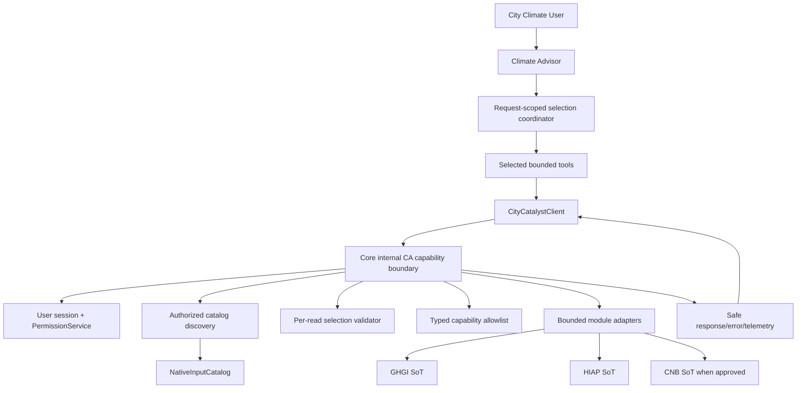

# Application Design — CC-737

## Approved Design Basis

- **Issue**: [CC-737 — Connect NativeInputCatalog to Climate Advisor capabilities](https://linear.app/openearth/issue/CC-737/connect-nativeinputcatalog-to-climate-advisor-capabilities)
- **Project**: CityCatalyst brownfield monorepo.
- **Stage**: INCEPTION — Application Design.
- **Design status**: Generated and approved 2026-08-28; Units Generation planning is now in progress.
- **Implementation status**: No application code modified; Units Generation and Construction remain unauthorized.

This consolidated design translates the approved requirements, User Stories, Workflow Planning, and Application Design plan answers into high-level component, method, service, and dependency decisions. Detailed business rules, per-unit implementation, exact file changes, and test placement remain deferred to later approved stages.

## Design Decisions

1. Core owns NativeInputCatalog discovery, typed capability allowlisting, object-level authorization, source-state validation, bounded source adapters, error normalization, and storage boundaries.
2. Climate Advisor owns active-request selection coordination, client transport, bounded tool wrappers, and request-time registration.
3. Discovery is a dedicated internal Core CA capability operation using existing service authentication, feature flags, user bearer sessions, schema validation, and permission patterns.
4. The allowlist is Core-authoritative and keyed by supported `(owningModule, kind, sourceType)` combinations. Unknown mappings fail closed.
5. A selected read carries catalog identity, Core-issued capability identity, and explicit request context, but Core re-resolves and revalidates all state before execution.
6. Discovery omits unauthorized, unavailable, withdrawn, superseded, missing, and deleted entries without useful metadata disclosure.
7. All selected-read resolution failures for stale, forged, malformed selection values, unauthorized, unavailable, missing, withdrawn, superseded, and deleted sources use one stable caller-visible contract:
   - HTTP status: `404`.
   - Machine code: `capability_unavailable`.
   - Generic message: `Requested capability is unavailable.`
   - Optional correlation reference only; no catalog ID, source ID, state, labels, scope, storage location, or content.
   - Missing/invalid service authentication remains under existing authentication semantics; transport-level invalid JSON can remain a request-validation failure without source metadata.
8. Each capability has a typed input/output schema, explicit source-specific field and size limits, finite timeouts, and a common safe response envelope.
9. Climate Advisor registers only selected tools after request context resolution and before agent execution. It never registers every supported catalog tool and never derives arbitrary routes.
10. A selected-tool failure is isolated with the stable generic error; unrelated independently authorized tools may continue when existing orchestration permits. No indefinite retry or raw-storage fallback is allowed.
11. `CityCatalystClient` remains the single CA transport path for service headers, bearer propagation, one-time token refresh, safe error mapping, timeout, and cleanup.
12. Core and Climate Advisor maintain coordinated deterministic contract/security evidence in their existing test suites; no separately versioned shared package is introduced.

## Architecture Overview

## Artifact Index

- [Components](components.md): component ownership, responsibilities, interfaces, and boundary rules.
- [Component methods](component-methods.md): high-level method signatures, inputs/outputs, and invariants.
- [Services](services.md): service responsibilities, orchestration sequences, and failure behavior.
- [Component dependencies](component-dependency.md): dependency matrix, trust matrix, data flows, and coupling rules.

## Requirements and Story Traceability

| Design area | Requirements / stories covered | Design evidence |
|---|---|---|
| Authorized discovery and safe metadata | FR-01, FR-02, FR-06, FR-07; US-01, US-05 | Core discovery filters before response; only safe metadata/capability IDs cross the boundary. |
| Typed allowlist and selection binding | FR-03, FR-04; US-02, US-03 | Core registry owns closed mapping; selections carry Core-issued capability identity and are revalidated. |
| Bounded source reads | FR-05, FR-06; US-04 | Core adapters enforce schemas, field/size bounds, timeouts, and module ownership. |
| Stale/forged/invalid non-disclosure | FR-04, FR-06, FR-07, FR-10; US-06 | HTTP 404 `capability_unavailable` generic contract at selected-read boundary. |
| Compatibility and request-time loading | FR-08, FR-10; US-03, US-07 | AgentService adds selected tools only; existing workflow packs remain governed by current conditions. |
| Core verification evidence | FR-09, FR-11, NFR-01, NFR-06, NFR-08; US-08 | Core route/registry/adapter/auth and contract/security test responsibilities are defined. |
| Climate Advisor verification evidence | FR-09, FR-11, NFR-04, NFR-05, NFR-06, NFR-08; US-09 | Client/selection/tool/AgentService test responsibilities and deterministic fixtures are defined. |
| No storage credentials/raw access | NFR-01, NFR-02, NFR-07; US-04, US-08, US-09 | Trust matrix and component/service boundaries prohibit storage access in Climate Advisor. |

## Security and Resiliency Controls

### Security Baseline

- Defense in depth: service authentication, user bearer/session binding, per-scope authorization, catalog state, typed allowlist, source availability, bounded schemas/results, generic errors, and safe telemetry.
- Discovery filtering is not authorization delegation; Core repeats authorization at read time.
- No credentials, signed URLs, storage keys as access mechanisms, raw content, or direct database access cross into Climate Advisor.
- Caller-visible errors do not distinguish unauthorized, missing, unavailable, deleted, withdrawn, or superseded source states.

### Resiliency Baseline

- Reuse existing internal client timeouts, one-time refresh, short-lived client cleanup, deployment, rollback, and incident processes.
- Fail closed on auth, validation, catalog, source, and dependency uncertainty.
- Isolate selected-tool failures where existing orchestration permits continuation; never broaden the tool set as a fallback.
- Operations-stage Core-unavailability and timeout scenarios remain required downstream evidence.

### Partial Property-Based Testing

- Apply generators, shrinking, and reproducible seeds to pure allowlist, scope, selection, serialization, result-bound, and safe-error invariants.
- Keep example-based tests mandatory for critical security, non-disclosure, cross-service, and compatibility scenarios.

## Deferred to Functional Design and Units Generation

- Per-capability GHGI/HIAP/CNB operation details and source-specific field limits.
- Exact Core route filenames, request field names, schema library placement, and implementation units.
- Concrete persistence/query strategy, if any, within existing Core ownership; no migration is currently planned.
- Detailed tool descriptions, model instructions, and agent prompt changes.
- Test file placement, fixture mechanics, CI job wiring, and deployment rollout steps.
- Operational dashboards, alerts, and failover/DR execution.

## Approval Gate

The Application Design package is generated and approved. Units Generation may now begin its planning part; Construction and application-code changes remain unauthorized.
