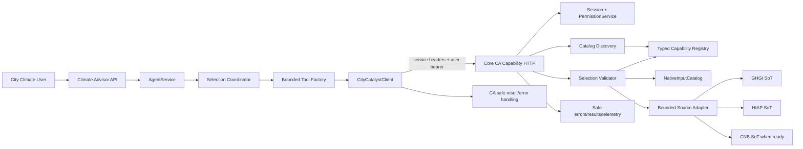
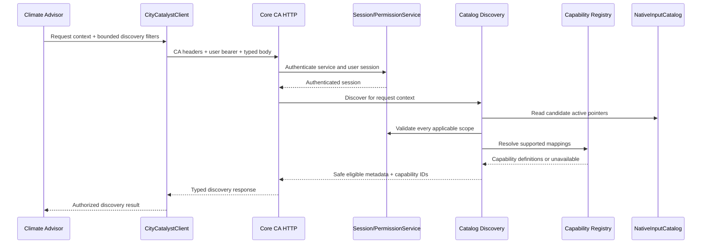
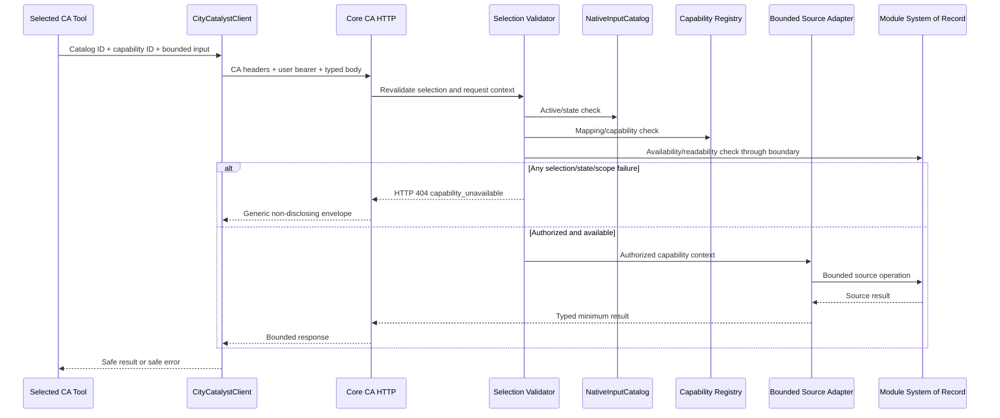

# Application Design Component Dependencies — CC-737

## Dependency Direction

## Dependency Matrix

Legend: **R** = runtime dependency, **C** = contract dependency, **T** = test/verification dependency, **—** = no direct dependency.

| From \ To | Catalog discovery | Registry | Auth/permissions | Source adapter | Core HTTP | CA client | Selection coordinator | Tool factory | AgentService | Telemetry |
|---|---:|---:|---:|---:|---:|---:|---:|---:|---:|---:|
| Catalog discovery | — | R | R | R/readiness | R | — | — | — | — | R |
| Registry | — | — | — | C | C | — | — | — | — | — |
| Auth/permissions | — | — | — | — | R | — | — | — | — | R |
| Source adapter | — | C | R | — | R | — | — | — | — | R |
| Core HTTP | R | R | R | R | — | C | — | — | — | R |
| CA client | — | C/consume | — | — | R | — | C | R | — | R |
| Selection coordinator | — | C/consume | — | — | — | R | — | R | R | R |
| Tool factory | — | C/consume | — | — | — | R | R | — | C | R |
| AgentService | — | — | — | — | — | — | R | R | — | R |
| Telemetry | — | — | — | — | — | — | — | — | — | — |

## Ownership and Trust Matrix

| Concern | Authoritative owner | Consumer | Required rule |
|---|---|---|---|
| Catalog row lifecycle | Core `NativeInputCatalog` service/producers | Core discovery/read | Producer lifecycle remains unchanged; rows are pointers, not grants. |
| Caller identity | Core session/authentication | Core capability boundary | User bearer identity is required; CA service identity alone is insufficient. |
| Resource scope | Core `PermissionService` and resource relationships | Core discovery/read | Check every applicable populated user/org/project/city/inventory dimension. |
| Capability mapping | Core typed registry | Core and CA client/tool factory | Closed allowlist; no untrusted route derivation. |
| Source content | GHGI/HIAP/CNB module systems of record | Core bounded adapters | Module remains system of record; only minimum result crosses. |
| Tool selection | Climate Advisor request coordinator | AgentService/tool factory | Request-scoped only; selection cannot override Core authorization. |
| Storage credentials/access | Core/module boundary | None in Climate Advisor | No S3 credentials, signed URLs, raw objects, direct DB, or storage paths as access mechanisms. |
| Error normalization | Core selected-read boundary | CA client/tools | Selection-resolution outcomes use the single generic contract. |
| Operational telemetry | Existing Core/CA logging conventions | Reviewers/operators | Safe correlation/outcome data only; secrets/content excluded. |

## Data Flow — Discovery

## Data Flow — Selected Read

## Coupling and Change Rules

- **Core → Climate Advisor**: Contract dependency; additive internal capability contract. Core contract changes require synchronized client/tool tests.
- **Climate Advisor → Core**: Runtime HTTP dependency; CA may only call published internal capability operations and cannot infer routes.
- **Core → Modules**: Existing module-owned capability dependency; CC-737 adds adapters only where a bounded read boundary is approved.
- **Catalog → Source data**: Logical pointer relationship only; no cross-database ownership or content copy is introduced.
- **Telemetry**: Cross-cutting observation, not an authorization or data-storage dependency.
- **No shared package**: Keep authoritative schemas/fixtures close to Core and consume deterministic fixtures from CA tests, as approved in the design plan.

## Failure Isolation

1. Authentication failure stops the call under existing auth semantics.
2. Discovery entry ineligibility removes that entry only and emits no metadata.
3. Selected-source resolution failure returns the generic `capability_unavailable` contract.
4. A failed selected tool is isolated; unrelated independently authorized tools may continue under existing orchestration rules.
5. Core/module timeout or dependency failure fails closed, is bounded, and is logged only with safe outcome data.

