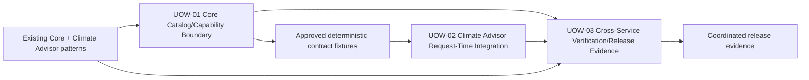

# Unit of Work Dependencies — CC-737

## Dependency Overview

## Dependency Matrix

Legend: **P** = prerequisite, **C** = contract dependency, **R** = runtime dependency, **V** = verification dependency, **—** = no direct dependency.

| From \ To | UOW-01 Core | UOW-02 Climate Advisor | UOW-03 Verification |
|---|---:|---:|---:|
| UOW-01 Core | — | P/C | P/V |
| UOW-02 Climate Advisor | R/C | — | P/V |
| UOW-03 Verification | V | V | — |
| Existing service patterns | P | P | P |

## Required Sequence

### Gate 1 — Core contract and boundary

UOW-01 defines the Core-owned discovery/read schemas, allowlist, scope propagation, per-read validation, source adapter boundaries, generic error contract, and authoritative deterministic fixtures. No Climate Advisor implementation may assume a contract that has not passed this unit's review.

### Gate 2 — Climate Advisor consumer

UOW-02 consumes the approved UOW-01 contract through `CityCatalystClient`, binds request-scoped selections, registers selected-only tools, and preserves existing workflows. Any contract mismatch returns to UOW-01 rather than being solved by client-side authorization or route derivation.

### Gate 3 — Cross-service evidence

UOW-03 runs integrated and release verification after UOW-01 and UOW-02 evidence is available. It verifies the complete flow and negative security cases while preserving service-local test ownership.

## Parallelization Rules

- UOW-01 is the critical path for the runtime contract.
- UOW-03 may prepare test harnesses, fixture consumers, and compatibility matrices in parallel after the UOW-01 contract shape is approved; it may not assert unapproved behavior.
- UOW-02 and UOW-03 test scaffolding may proceed in parallel only with the same deterministic fixtures and no divergence in contract semantics.
- Source-specific Core adapter subunits may proceed in parallel when their module boundaries are independently ready, but all remain under UOW-01 and the same allowlist/security rules.
- No parallel work may create a second authorization path, new storage access, or an incompatible error contract.

## Handoffs and Coordination Points

| Handoff | Producer | Consumer | Required artifact/evidence |
|---|---|---|---|
| Core discovery/read contract | UOW-01 | UOW-02/UOW-03 | Typed schemas, capability IDs, bounds, error contract, safe fixture set. |
| Scope and authorization semantics | UOW-01 | UOW-02 | Request-context contract and proof that Core revalidates every read. |
| Tool registration contract | UOW-02 | UOW-03 | Selected-only registration evidence and compatibility matrix. |
| Negative security behavior | UOW-01/UOW-02 | UOW-03 | Omission/error/forbidden-field assertions for all source states. |
| Release readiness | UOW-01/UOW-02/UOW-03 | Existing CI/Operations | Build/test results, feature-gate/rollback checklist, safe telemetry review. |

## Ownership and Communication

- **Core maintainers** approve UOW-01 contract changes and source-boundary readiness.
- **Climate Advisor maintainers** implement UOW-02 consumer behavior against the approved contract.
- **Security/operations governance** reviews non-disclosure, secret handling, resiliency, telemetry, deployment, and rollback evidence across all units.
- **Joint review** is required for UOW-03 because it crosses the service boundary; joint review does not transfer Core authorization ownership.

## Contract Coordination

- Authoritative schemas and fixture definitions remain adjacent to Core capability contracts.
- Climate Advisor tests consume deterministic fixtures without introducing a new shared runtime package.
- Contract changes are additive/feature-gated where possible and require synchronized Core/Climate Advisor checks.
- The generic selection-read failure remains HTTP `404` with code `capability_unavailable`; no unit may introduce state-specific caller-visible errors.
- Capability IDs are Core-issued and allowlisted; no unit may derive a route from catalog or model input.

## Rollback and Partial Completion

1. If UOW-01 fails, do not release UOW-02 catalog loading; existing Climate Advisor workflows remain unchanged.
2. If UOW-02 fails, disable the additive catalog-driven path and retain existing workflow tool packs.
3. If UOW-03 fails, hold coordinated release or roll back Core/Climate Advisor deployments through existing procedures; do not roll back catalog producer data.
4. A partial source failure must not widen another source's access or expose the failed source's existence/state.
5. Every unit has an atomic commit boundary so review/revert can be scoped without destructive repository operations.

## Verification Checkpoints

- **After UOW-01**: Core unit/security tests, allowlist and bounded contract fixtures, generic error/non-disclosure checks.
- **After UOW-02**: Climate Advisor client/tool/AgentService tests, selected-only registration, compatibility, cleanup, and safe error checks.
- **After UOW-03**: Integrated authorized/denied/unavailable/deleted flows, forbidden-field checks, timeout/failure isolation, builds, CI, and release evidence.

