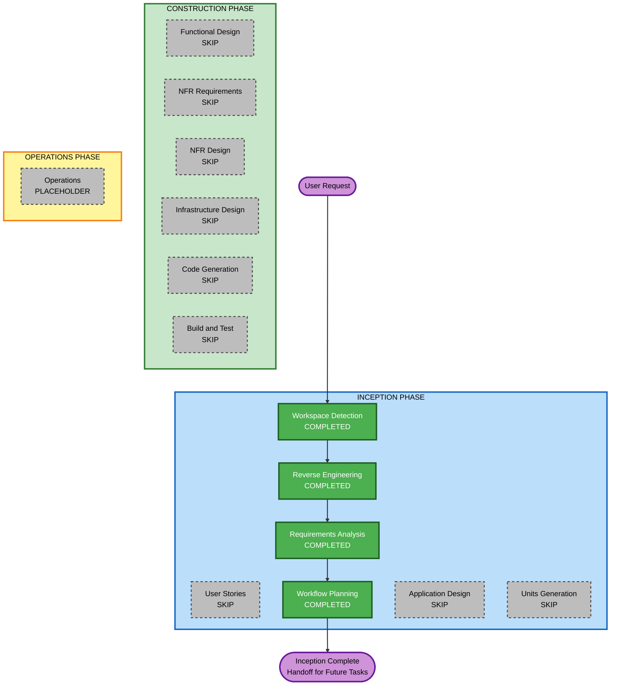

# Execution Plan

**Project**: CityCatalyst (Brownfield)
**Created**: 2026-07-09T19:54:00Z
**Document Language**: English (team lingua franca)
**Phase Scope**: Documentation only — no application code changes

---

## Detailed Analysis Summary

### Transformation Scope (Brownfield)

| Attribute | Assessment |
|-----------|------------|
| **Transformation Type** | Documentation / knowledge capture — not a code transformation |
| **Primary Changes** | AI-DLC artifacts under `aidlc-docs/` only |
| **Related Components** | All monorepo packages documented; none modified |

### Change Impact Assessment

| Impact Area | Applies? | Description |
|-------------|----------|-------------|
| **User-facing changes** | No | No UI or API changes |
| **Structural changes** | No | Architecture documented, not altered |
| **Data model changes** | No | No database migrations |
| **API changes** | No | No contract changes |
| **NFR impact** | No | Documentation clarity and maintainability only |

### Component Relationships

- **Primary focus**: `aidlc-docs/` documentation tree
- **Documented runtime packages**: `app/`, `global-api/`, `climate-advisor/`, `hiap/`, `hiap-meed/`, `api-demo/`, `k8s/`
- **Infrastructure components**: Documented in reverse-engineering artifacts; not modified
- **Dependent components**: None — no deployment or integration changes

### Risk Assessment

| Attribute | Level |
|-----------|-------|
| **Risk Level** | Low |
| **Rollback Complexity** | Easy (documentation-only; git revert) |
| **Testing Complexity** | Simple (content review; no test execution required) |

---

## Workflow Visualization



### Text Alternative

```
INCEPTION (completed): Workspace Detection, Reverse Engineering, Requirements Analysis, Workflow Planning
INCEPTION (skipped): User Stories, Application Design, Units Generation
CONSTRUCTION (skipped): All stages — documentation-only phase
END: Inception complete; handoff for future implementation tasks
```

---

## Phases to Execute

### INCEPTION PHASE

| Stage | Status | Rationale |
|-------|--------|-----------|
| Workspace Detection | COMPLETED | Brownfield monorepo identified |
| Reverse Engineering | COMPLETED | 9 artifacts generated and approved |
| Requirements Analysis | COMPLETED | Documentation scope formalized |
| User Stories | SKIP | No user-facing feature; documentation-only |
| Workflow Planning | COMPLETED | This document |
| Application Design | SKIP | No new components; implementation deferred |
| Units Generation | SKIP | No code units until implementation task defined |

### CONSTRUCTION PHASE

| Stage | Status | Rationale |
|-------|--------|-----------|
| Functional Design | SKIP | No business logic to design |
| NFR Requirements | SKIP | Extensions deferred; no implementation |
| NFR Design | SKIP | No NFR implementation needed |
| Infrastructure Design | SKIP | No infrastructure changes |
| Code Generation | SKIP | Explicitly out of scope per FR-5 |
| Build and Test | SKIP | No code to build or test |

### OPERATIONS PHASE

| Stage | Status | Rationale |
|-------|--------|-----------|
| Operations | PLACEHOLDER | Future deployment workflows |

---

## Remaining Inception Deliverable

One optional artifact completes the documentation phase:

| Deliverable | Location | Purpose |
|-------------|----------|---------|
| **Inception Completion Summary** | `aidlc-docs/inception/plans/inception-completion-summary.md` | Handoff document for the distributed team; links all artifacts and future-task checklist |

**Execute on approval** of this execution plan.

---

## Package Change Sequence

**Not applicable** — no package code changes in this phase.

For **future implementation tasks**, recommended analysis order when scoping changes:

1. `app/` — if UI, API, auth, or tenancy affected
2. `global-api/` — if catalogue, emissions, or GIS data affected
3. `hiap/` or `climate-advisor/` — if AI/ML workflows affected
4. `k8s/` + `.github/workflows/` — if deployment or env vars change

---

## Estimated Timeline

| Item | Estimate |
|------|----------|
| **Inception phases completed** | 4 of 4 applicable stages |
| **Remaining work** | Inception completion summary (~1 interaction) |
| **Construction phases** | 0 (deferred) |

---

## Success Criteria

### Primary Goal

Establish a complete, English-language documentation foundation so the distributed engineering team can plan and execute future CityCatalyst implementation tasks.

### Key Deliverables

- [x] Reverse-engineering artifacts (9 files)
- [x] Requirements document
- [x] Execution plan (this document)
- [x] Inception completion summary
- [x] Audit trail in `audit.md`
- [x] State tracking in `aidlc-state.md`

### Quality Gates

- All documents in English
- Mermaid diagrams validated
- No application code modified
- 12 understanding gaps preserved for future resolution
- Extension opt-in deferred until implementation

---

## Future Implementation Workflow (When Ready)

When a concrete implementation task is defined, restart or resume AI-DLC with:

1. Refresh reverse engineering if codebase changed significantly
2. Requirements Analysis (minimal or standard depth for the specific task)
3. User Stories (if user-facing impact)
4. Application Design + Units Generation (if multi-component)
5. Construction per-unit loop (Functional Design through Code Generation)
6. Build and Test
7. Re-evaluate Security, Resiliency, and PBT extensions

---

## User Override Options

You may override this plan:

- **Add User Stories** — if you want personas/stories even for documentation
- **Add Application Design** — if you want component-level design docs without code
- **Force Construction stages** — only if scope changes to include implementation

Default recommendation: **approve as-is** and generate inception completion summary only.
