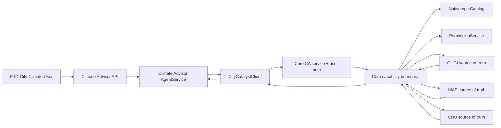

# Workflow Planning — CC-737

## Scope and Planning Status

- **Issue**: [CC-737 — Connect NativeInputCatalog to Climate Advisor capabilities](https://linear.app/openearth/issue/CC-737/connect-nativeinputcatalog-to-climate-advisor-capabilities)
- **Project type**: Brownfield CityCatalyst monorepo.
- **Active branch**: `cc-737-connect-nativeinputcatalog-to-climate-advisor-capabilities`.
- **Planning status**: Approved 2026-08-28; Application Design is now in progress.
- **Current phase**: INCEPTION.
- **Application code status**: Unchanged by AI-DLC; Construction has not started and is not authorized.
- **Source artifacts**: Approved reverse-engineering artifacts, `requirements.md`, `stories.md`, and `personas.md`.

This plan selects the remaining AI-DLC stages and their order. It does not define implementation-level routes, classes, exact schemas, or error codes. Those decisions belong to Application Design and must be approved before Units Generation or Construction.

## Detailed Analysis Summary

### Transformation Scope — Brownfield

- **Transformation type**: Cross-service application capability integration within existing boundaries; not a deployment-model or infrastructure transformation.
- **Primary changes**:
  - Extend CityCatalyst Core's NativeInputCatalog consumer surface for authorized Climate Advisor discovery.
  - Add typed, allowlisted mapping from supported catalog identity dimensions to existing or explicitly approved bounded capabilities.
  - Connect Climate Advisor request-time selection and tool registration to the authorized discovery result.
  - Revalidate caller scope, catalog state, capability mapping, and source availability at every selected read in Core.
  - Add Core and Climate Advisor contract/security evidence.
- **Explicit non-changes**:
  - No new catalog database, storage owner, direct S3 path, S3 credential, signed-URL flow, or raw storage access in Climate Advisor.
  - No replacement of NativeInputCatalog producer lifecycle or module systems of record.
  - No new deployment topology, broad capability-registry redesign, UI redesign, or unrelated refactoring.

### Change Impact Assessment

| Impact area | Assessment | Planning consequence |
|---|---|---|
| User-facing | Yes, indirectly. Authorized users gain catalog-backed source choices and bounded answers; existing workflows must remain compatible. | Preserve current general chat, Stationary Energy, Concept Note, inventory, and legacy behavior; no UI redesign planned. |
| Structural | Yes, additive changes across the Core capability boundary and Climate Advisor orchestration. | Application Design is required; no new service boundary is authorized. |
| Data model | No persistent schema migration is planned. NativeInputCatalog remains the existing pointer registry; new transient request/response contracts may be required. | Units Generation must not invent ownership or migrations. Any unavoidable migration requires a new design decision and approval. |
| API/contract | Yes. Discovery, allowlisted capability selection, bounded source reads, and stable non-disclosing failure behavior require internal contract definition. | Application Design must define schemas, scope inputs, bounds, and the exact US-06 error contract. |
| Security | High impact. The feature crosses user, service, catalog, and module authorization boundaries. | Security Baseline applies at every downstream implementation/test stage; Core remains final authority. |
| Reliability/performance | Moderate-to-high impact. Calls are request-time and dependency-backed, with unavailable-source and timeout paths. | Resiliency Baseline, explicit timeouts, bounded results, graceful degradation, and inherited operational controls apply. |
| Observability/privacy | Yes. Discovery and selected reads need safe correlation and outcome telemetry. | Design and tests must verify redaction and non-disclosure; no sensitive scope or source content in logs. |
| Infrastructure/deployment | No topology change identified. Existing Docker/EKS/Kubernetes/GitHub Actions patterns remain. | Infrastructure Design is skipped for this issue unless later approved design discovers a material infrastructure change. |

### Component Relationships

```mermaid
flowchart LR
    User["P-01 City Climate User"] --> CAAPI["Climate Advisor API"]
    CAAPI --> Agent["Climate Advisor AgentService"]
    Agent --> CAClient["CityCatalystClient"]
    CAClient --> CoreAuth["Core CA service + user auth"]
    CoreAuth --> CoreCap["Core capability boundary"]
    CoreCap --> Catalog["NativeInputCatalog"]
    CoreCap --> Perm["PermissionService"]
    CoreCap --> GHGI["GHGI source of truth"]
    CoreCap --> HIAP["HIAP source of truth"]
    CoreCap --> CNB["CNB source of truth"]
    GHGI --> CoreCap
    HIAP --> CoreCap
    CNB --> CoreCap
    CoreCap --> CAClient
    CAClient --> Agent
```

| Component | Change type | Priority | Relationship and constraint |
|---|---|---|---|
| `app` Core capability routes/registry | Major additive contract change | Must update first | Owns discovery, final authorization, catalog-state validation, source resolution, bounded response shaping, and safe error normalization. |
| `app` NativeInputCatalog service/model | Minor consumer-side extension | Must update with Core boundary | Remains the catalog owner and pointer registry; producer registration/withdrawal/supersession semantics remain unchanged. |
| `app` PermissionService/authentication | Reuse/integration, no ownership transfer | Critical dependency | User bearer identity and every applicable scope dimension remain authoritative; service identity alone is insufficient. |
| `climate-advisor` `CityCatalystClient` | Major additive client contract | After Core contract is defined | Centralizes headers, user token, timeouts, refresh, bounded parsing, and safe error mapping. |
| `climate-advisor` tools and `AgentService` | Major additive orchestration behavior | After client contract | Registers only selected, authorized, allowlisted source tools at request time; existing tool packs remain compatible. |
| GHGI/HIAP/CNB module boundaries | Contract consumer/adapter impact | Coordinate with Core design | Source systems remain authoritative; only capabilities with approved bounded read boundaries are eligible. |
| `app/tests` | New/updated Core evidence | Must update with Core | Covers contract, authorization, state, boundedness, non-disclosure, and storage-boundary invariants. |
| `climate-advisor/service/tests` | New/updated Climate Advisor evidence | After client/tool design | Covers discovery consumption, selected registration, error handling, compatibility, and forbidden data. |
| CI/CD and deployment manifests | Verification-only unless needed | Later | Use existing pipelines and rollback/change-management process; no new topology is planned. |

### Risk Assessment

- **Risk level**: High. The implementation crosses two services and multiple object-level scope dimensions; a discovery or stale-read mistake could disclose source existence or content.
- **Rollback complexity**: Moderate. The change is planned as additive and feature-gated, with no expected schema migration or ownership transfer. Rollback must disable catalog-driven loading without breaking existing workflow tool packs.
- **Testing complexity**: Complex. Positive and negative security paths must be demonstrated in both services and at the cross-service contract boundary, including unavailable/deleted states and request-time registration.
- **Primary risk controls**:
  - Core authorization and source-state checks on every read.
  - Typed allowlist; no route derivation from untrusted catalog/model strings.
  - Discovery omission and stable non-disclosure for denied/unavailable/deleted entries.
  - Bounded schemas, finite result sizes, explicit timeouts, and safe resource cleanup.
  - Deterministic service doubles, example-based critical tests, and partial property-based invariants.
  - Atomic commits after each approved stage or independently reviewable unit.

## Workflow Visualization

```mermaid
flowchart TD
    Start(["CC-737 request"])

    subgraph INCEPTION["🔵 INCEPTION PHASE"]
        WD["Workspace Detection<br/><b>COMPLETED</b>"]
        RE["Reverse Engineering<br/><b>COMPLETED</b>"]
        RA["Requirements Analysis<br/><b>COMPLETED</b>"]
        US["User Stories<br/><b>COMPLETED</b>"]
        WP["Workflow Planning<br/><b>AWAITING APPROVAL</b>"]
        AD["Application Design<br/><b>EXECUTE AFTER APPROVAL</b>"]
        UG["Units Generation<br/><b>EXECUTE AFTER APPROVAL</b>"]
    end

    subgraph CONSTRUCTION["🟢 CONSTRUCTION PHASE — NOT AUTHORIZED"]
        FD["Functional Design<br/><b>EXECUTE AFTER INCEPTION</b>"]
        NFRA["NFR Requirements<br/><b>EXECUTE AFTER INCEPTION</b>"]
        NFRD["NFR Design<br/><b>EXECUTE AFTER INCEPTION</b>"]
        ID["Infrastructure Design<br/><b>SKIP</b>"]
        CG["Code Generation<br/><b>EXECUTE AFTER EXPLICIT AUTHORIZATION</b>"]
        BT["Build and Test<br/><b>EXECUTE AFTER EXPLICIT AUTHORIZATION</b>"]
    end

    subgraph OPERATIONS["🟡 OPERATIONS PHASE"]
        OPS["Operations<br/><b>PLACEHOLDER</b>"]
    end

    Start --> WD --> RE --> RA --> US --> WP
    WP -->|approval gate| AD
    AD -->|approval gate| UG
    UG -->|inception approval + construction authorization| FD
    FD --> NFRA --> NFRD --> ID --> CG --> BT --> OPS
    OPS --> End(["Complete"])

    style Start fill:#CE93D8,stroke:#6A1B9A,stroke-width:3px,color:#000
    style End fill:#CE93D8,stroke:#6A1B9A,stroke-width:3px,color:#000
    style WD fill:#4CAF50,stroke:#1B5E20,stroke-width:3px,color:#fff
    style RE fill:#4CAF50,stroke:#1B5E20,stroke-width:3px,color:#fff
    style RA fill:#4CAF50,stroke:#1B5E20,stroke-width:3px,color:#fff
    style US fill:#4CAF50,stroke:#1B5E20,stroke-width:3px,color:#fff
    style WP fill:#FFA726,stroke:#E65100,stroke-width:3px,stroke-dasharray:5 5,color:#000
    style AD fill:#FFA726,stroke:#E65100,stroke-width:3px,stroke-dasharray:5 5,color:#000
    style UG fill:#FFA726,stroke:#E65100,stroke-width:3px,stroke-dasharray:5 5,color:#000
    style FD fill:#FFA726,stroke:#E65100,stroke-width:3px,stroke-dasharray:5 5,color:#000
    style NFRA fill:#FFA726,stroke:#E65100,stroke-width:3px,stroke-dasharray:5 5,color:#000
    style NFRD fill:#FFA726,stroke:#E65100,stroke-width:3px,stroke-dasharray:5 5,color:#000
    style ID fill:#BDBDBD,stroke:#424242,stroke-width:2px,stroke-dasharray:5 5,color:#000
    style CG fill:#4CAF50,stroke:#1B5E20,stroke-width:3px,color:#fff
    style BT fill:#4CAF50,stroke:#1B5E20,stroke-width:3px,color:#fff
    style OPS fill:#FFF59D,stroke:#F57F17,stroke-width:2px,color:#000
    linkStyle default stroke:#333,stroke-width:2px
```

The green Construction nodes indicate stages planned for later execution, not current authorization. The current workflow stops at the orange Workflow Planning approval gate.

## Phases to Execute

### 🔵 INCEPTION PHASE

- [x] Workspace Detection — **COMPLETED**.
- [x] Reverse Engineering — **COMPLETED and approved**.
- [x] Requirements Analysis — **COMPLETED and approved**; Security Baseline, Resiliency Baseline, and Partial Property-Based Testing decisions are recorded.
- [x] User Stories — **COMPLETED and approved**; 9 stories and 4 personas.
- [ ] Workflow Planning — **GENERATED; explicit approval required**.
- [ ] Application Design — **EXECUTE after Workflow Planning approval**.
  - **Rationale**: New Core/Climate Advisor contracts, component methods, allowlist definitions, request-time loading behavior, scope propagation, bounded result shapes, and the exact stable non-disclosing error contract require design decisions. US-06 explicitly defers its status/code/envelope/normalization contract to this stage.
- [ ] Units Generation — **EXECUTE after Application Design approval**.
  - **Rationale**: The work crosses `app` and `climate-advisor`, introduces typed request/response/error units and capability mappings, and requires coordinated Core and Climate Advisor contract/security tests.

### 🟢 CONSTRUCTION PHASE — PLANNED, NOT AUTHORIZED

- [ ] Functional Design — **EXECUTE after Inception approvals and explicit Construction authorization**.
  - **Rationale**: Translate the approved stories/design into end-to-end behavior and testable functional contracts across discovery, selection, read, denial, availability, and compatibility paths.
- [ ] NFR Requirements — **EXECUTE after Inception approvals and explicit Construction authorization**.
  - **Rationale**: Security, non-disclosure, boundedness, reliability, auditability, privacy, and compatibility requirements materially constrain implementation and verification.
- [ ] NFR Design — **EXECUTE after Inception approvals and explicit Construction authorization**.
  - **Rationale**: Define enforceable controls for timeouts, redaction, error normalization, bounded payloads, safe telemetry, failure isolation, and inherited resiliency processes.
- [ ] Infrastructure Design — **SKIP unless separately approved**.
  - **Rationale**: Reverse engineering found no required topology, storage, networking, or deployment-model change. Existing Docker/EKS/Kubernetes/GitHub Actions and rollback processes remain authoritative.
- [ ] Code Generation — **EXECUTE after explicit Construction authorization**.
  - **Rationale**: Core and Climate Advisor implementation plus contract/security tests are required by CC-737.
- [ ] Build and Test — **EXECUTE after explicit Construction authorization**.
  - **Rationale**: Verify both service suites, cross-service contracts, security/non-disclosure invariants, compatibility, boundedness, timeout behavior, and production build paths.

### 🟡 OPERATIONS PHASE

- [ ] Operations — **PLACEHOLDER**.
  - **Rationale**: Use existing CityCatalyst deployment, monitoring, incident, rollback, and resiliency processes. Execute the inherited Core-unavailability and timeout scenarios during the Operations stage as required by the approved requirements.

## Module Update Strategy

- **Update approach**: Hybrid — sequential contract ownership followed by parallel service evidence.
- **Critical path**:
  1. Application Design defines the Core-owned discovery/read/error contracts and typed allowlist.
  2. Units Generation decomposes those contracts into Core and Climate Advisor units.
  3. Core implementation and contract/security tests establish the authoritative boundary.
  4. Climate Advisor client/tool/AgentService implementation consumes the approved Core contract.
  5. Integrated contract tests and compatibility verification validate both services together.
- **Coordination points**:
  - Core is the final authority for caller identity, every applicable user/organization/project/city/inventory scope, catalog state, source availability, and read authorization.
  - The allowlist and capability IDs must remain consistent across Core registry/route definitions and Climate Advisor client/tool registration.
  - US-06's exact error status, code, envelope, and normalization must be one approved cross-service contract.
  - No Climate Advisor code may acquire S3 credentials, raw object access, signed URLs, direct database access, or a new authorization authority.
  - Existing workflow-specific tool packs and token refresh behavior must be tested at the integration boundary.
- **Parallelization opportunities**:
  - After the Core contract is approved and units are generated, Core unit/security tests and Climate Advisor client/tool test scaffolding can proceed in parallel when they use the same versioned/deterministic contract fixtures.
  - Compatibility regression tests can run alongside positive/negative capability tests, provided they do not alter shared application code simultaneously.
- **Testing checkpoints**:
  - Core: discovery omission, allowlist, per-read authorization/state, bounded response, safe error/logging, and no-storage-access invariants.
  - Climate Advisor: request-time selected registration, bounded client/tool handling, stable error behavior, compatibility, and forbidden-field assertions.
  - Integrated: authorized discovery → selection → read, cross-scope denial, stale/forged/invalid selection, unavailable/deleted source, timeout, and dependency-failure behavior.
  - Release: existing CI/CD/build checks and inherited rollback/change-management checks.
- **Rollback strategy**:
  - Keep catalog-driven behavior additive and behind existing approved feature/service-auth boundaries.
  - Disable the new discovery/registration path and retain existing workflow behavior if contract or dependency verification fails.
  - Roll back the Core and Climate Advisor deployment units as one coordinated change if the internal contract is incompatible.
  - Do not roll back or rewrite catalog producer data as part of this feature.

## Package Change Sequence — Brownfield

1. **Core contract/design units**: `app/src/backend/NativeInputCatalogService.ts`, existing internal CA capability route/registry areas, and Core contract/security tests. No schema migration is planned.
2. **Climate Advisor contract consumer/design units**: `climate-advisor/service/app/services/citycatalyst_client.py`, bounded tool wrappers, `AgentService`, and service tests. Consume only the approved Core contract.
3. **Cross-service contract fixtures/tests**: align deterministic positive and negative fixtures across `app/tests` and `climate-advisor/service/tests`; verify no raw storage or secret fields cross the boundary.
4. **Compatibility and release verification**: existing general chat, Stationary Energy, Concept Note, inventory, legacy datasource, CI/CD, build, and deployment checks.

The first two package updates are dependency-ordered because Climate Advisor depends on Core's authoritative contract. Test implementation can be partially parallelized only after the contract and units are approved.

## Extension Handling

- **Security Baseline**: Execute. Treat service authentication, user bearer identity, object-level authorization, catalog/source state, allowlisting, non-disclosure, redaction, and forbidden storage access as release-blocking controls.
- **Resiliency Baseline**: Execute using existing CityCatalyst processes. Preserve timeout/resource-cleanup behavior, fail closed, isolate unavailable selections where the approved contract permits, and defer operational failover/DR execution to Operations.
- **Property-Based Testing**: Partial. Keep example-based tests mandatory for critical security and contract paths. Apply property-based tests to pure allowlist/scope/result/error serialization invariants with domain-specific generators, shrinking, and reproducible seeds.

## Explicit Approval Gates

1. **Current gate — Workflow Planning**: Approve this `execution-plan.md`. Until approved, no Application Design or Units Generation work starts.
2. **Application Design gate**: Approve the Core/Climate Advisor component, contract, authorization, error, boundedness, and compatibility design. This must define the exact US-06 error contract.
3. **Units Generation gate**: Approve the generated implementation units, dependencies, test units, sequencing, and cross-service fixtures.
4. **Construction authorization gate**: Explicitly authorize Construction. User Stories, Workflow Planning, Application Design, and Units Generation approval do not implicitly authorize code changes.
5. **Construction unit gates**: For each approved functional/NFR/code/test unit, commit atomically after verification and stop for the required review gate.

## Estimated Timeline

This is a relative planning estimate; no Construction schedule is authorized by this artifact.

- **Inception already completed**: Workspace Detection, Reverse Engineering, Requirements Analysis, and User Stories.
- **Remaining Inception**: Workflow Planning approval, Application Design, and Units Generation, each with its own review gate.
- **Construction**: Multiple coordinated service units plus integrated test verification; duration to be estimated after Units Generation.
- **Operations**: Existing deployment/monitoring/rollback process after implementation acceptance.

## Success Criteria

- **Primary goal**: Authorized CityCatalyst users can receive bounded, source-backed Climate Advisor assistance through NativeInputCatalog-driven request-time capabilities without cross-scope or source-state disclosure.
- **Key deliverables**:
  - Core-owned authorized discovery and per-read validation.
  - Explicit typed allowlist and request-time selected capability loading.
  - Stable non-disclosing stale/forged/invalid read behavior, with exact contract approved during Application Design.
  - Bounded source-specific responses with no Climate Advisor storage credentials/raw access.
  - Core and Climate Advisor contract/security/compatibility tests.
  - Safe audit/telemetry and inherited operational readiness evidence.
- **Quality gates**:
  - Requirements and User Stories approvals recorded.
  - Workflow Planning approval recorded before Application Design.
  - Application Design and Units Generation approvals recorded before Construction.
  - Explicit Construction authorization recorded before application-code changes.
  - All critical positive/negative security tests and cross-service contract/build checks pass.

## Open Planning Decisions Deferred to Application Design

No new Workflow Planning question file is opened: the approved requirements and stories contain the necessary scope decisions. The following are explicitly deferred design decisions, not authorization to implement:

- Exact discovery and selected-read request/response schemas and endpoint placement within existing Core CA capability patterns.
- Exact stable non-disclosing error status, code, envelope, and normalization contract for US-06.
- First-slice capability allowlist entries and readiness of GHGI, HIAP, and CNB source boundaries.
- Precise request/thread scope propagation and audit-field minimization.
- Exact bounded field sets, size limits, timeouts, and partial-failure behavior per source capability.

These decisions must be documented, questioned where ambiguous, and explicitly approved during Application Design. No implementation assumption in this plan overrides Core authorization or the approved security boundaries.
