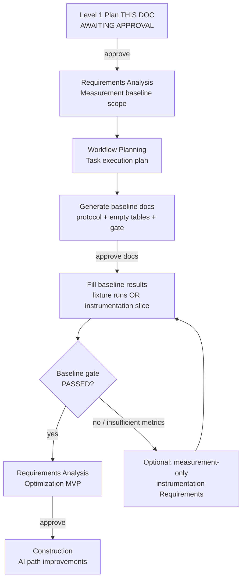

# GHGI Upload Inventory (AI Paths) — Level 1 Plan

**Project**: CityCatalyst (Brownfield)
**Task**: Improve GHGI “Upload Existing Inventory” AI options (Path B / Path C) — **measurement-first**
**Created**: 2026-07-14T00:56:00Z
**Status**: Approved 2026-07-14T01:08:00Z — Section 6 artifacts generated
**Document Language**: English (team lingua franca)
**Phase**: New task cycle after monorepo Inception COMPLETE — start at Requirements / Workflow for **baseline measurement only**

---

## 1. Purpose

This Level 1 Plan scopes a **new AI-DLC cycle** for the existing GHGI onboarding import wizard. It does **not** re-run monorepo reverse engineering.

**Hard constraints for this phase**

| Constraint | Rule |
|------------|------|
| Optimization application code | **Forbidden** until baseline gate passes |
| Measurement-only instrumentation | Allowed only as a **separate Requirements slice** if manual methods are insufficient — still requires approval before code |
| AI-DLC docs | English, under `aidlc-docs/` only |
| Application code | Never under `aidlc-docs/` |
| Deterministic Path A / Adapter D | In scope as **controls** for baseline comparison only — not optimization targets |

**Upon approval of this plan**, the next step is to generate the **baseline measurement documentation set** (Section 6), then pause for approval before any fixture runs or instrumentation code.

---

## 2. Prior Context (Reuse — Do Not Recreate)

| Source | Role |
|--------|------|
| `aidlc-docs/inception/*` (monorepo inception) | Architecture, components, prior requirements — reference only |
| Notion: [GHGI Upload Inventory — Import Flow Architecture](https://app.notion.com/p/openearth/39ceb557728b80a4a858faff4f6c59e2) | **UI / orchestrator source of truth**: 3-step wizard, `ImportStatus` state machine, `usePollUntil`, RTK `upload` / `status` / `extract` / `interpret` / `approve` |
| Local exploration (already done) | App + Postgres Docker; fixtures under `app/tmp-import-fixtures/`; near-eCRF (F0) reached `waiting_for_approval` with 74 rows **without AI** |
| Latency/cost | **Not measured yet** — this cycle’s first deliverable |

### Import paths (code-backed map)

| Path | Trigger | LLM? | Primary code |
|------|---------|------|--------------|
| **A** eCRF | Deterministic XLSX template | No | `import/route.ts` + eCRF services |
| **D** near-eCRF | Tabular structured enough | No | Adapter / upload path (control) |
| **B** tabular AI | `pending_ai_interpretation` → `POST .../interpret` | Yes | `interpret/route.ts`, `AIInterpretationService`, `FormatAdapterService` |
| **C** PDF AI | `pending_ai_extraction` → `POST .../extract` | Yes | `extract/route.ts`, `InventoryExtractionService` |

Frontend branching after upload follows Notion §4–§5 (`pending_ai_*` → Extract with AI → poll → `waiting_for_approval`).

---

## 3. Goals Mapping

| User goal | This plan’s response |
|-----------|----------------------|
| Improve AI options (Path B/C) | In scope for **later** Construction — **blocked** until baseline gate |
| No improvements without recorded baseline | Phase A = protocol + empty tables; Phase B = fill tables; Phase C = optimization Requirements only after gate |
| Docs under `aidlc-docs/`, AI-DLC-aligned | Section 6 artifact list; update `aidlc-state.md` / `audit.md` |
| Measurement-only instrumentation if needed | Separate Requirements slice **before** optimization MVP — optional fork after baseline attempt |
| Gate before optimization MVP | Explicit checklist (Section 8) |

---

## 4. Task-Level Intent Analysis

| Attribute | Assessment |
|-----------|------------|
| **Request clarity** | Clear — evidence-first, measurement before optimization |
| **Request type** | Enhancement (AI import Path B/C) with mandatory NFR baseline |
| **Scope** | Multiple components inside `app/` (API routes, AI services, optional UX progress); UI orchestrator already documented in Notion |
| **Complexity** | Moderate–Complex (LLM cost/latency, sequential chunks, UX progress asymmetry) |
| **Requirements depth (proposed)** | **Standard** for measurement baseline; **Minimal** User Stories (optional skip — see Workflow) |
| **Reverse engineering** | **Skip** monorepo RE; optional short **code-backed hypotheses** note only |

---

## 5. Proposed Workflow (This Task Cycle)

### Stage decisions (proposed)

| Stage | Decision | Rationale |
|-------|----------|-----------|
| Reverse Engineering (monorepo) | **SKIP** | Already complete; reuse Notion + code pointers |
| Requirements Analysis (baseline) | **EXECUTE** | Formalize metrics, fixtures, protocol, gates, non-goals |
| User Stories | **SKIP** (default) | Measurement/docs phase; no UX change yet. Revisit at optimization MVP if Path B progress UX is in scope |
| Application Design / Units | **SKIP** until optimization MVP | No design for parallelization/prompt changes until evidence |
| Construction (optimizations) | **BLOCKED** by gate | Explicit |
| Construction (measurement instrumentation) | **CONDITIONAL** | Only if approved Requirements slice after manual baseline attempt fails |

### Extension opt-in (deferred again for baseline docs phase)

Re-ask at optimization Requirements Analysis (Security / Resiliency / PBT). For measurement-only instrumentation, default: keep deferred unless instrumentation touches auth or public APIs.

---

## 6. Artifacts After This Plan Is Approved

**Generate only after approval.** Location under `aidlc-docs/` (English).

| # | Artifact | Purpose |
|---|----------|---------|
| 1 | `aidlc-docs/inception/requirements/ghgi-upload-ai-baseline-requirements.md` | Measurement-scope requirements: metrics, fixtures, protocol, success criteria, non-goals, gate |
| 2 | `aidlc-docs/inception/plans/ghgi-upload-ai-baseline-measurement-plan.md` | Run protocol, environment assumptions, fixture matrix, empty **baseline results** table, empty **gains** table template, recording method (stopwatch / DB timestamps / logs) |
| 3 | `aidlc-docs/inception/plans/ghgi-upload-ai-bottlenecks-hypotheses.md` | **Labeled hypotheses** (code-backed, **not measured claims**) |
| 4 | `aidlc-docs/inception/plans/ghgi-upload-ai-task-execution-plan.md` | Task Workflow Planning: stages, gates, what is forbidden until baseline filled |
| 5 | Updates to `aidlc-docs/aidlc-state.md` and `aidlc-docs/audit.md` | Stage progress for this task cycle |

### Explicitly NOT in the post-approval doc set (yet)

- Optimization MVP requirements
- Functional/NFR design for parallel chunks, prompt changes, raising `MAX_TABLE_SHAPE_CHUNKS`, etc.
- Application code or instrumentation patches

---

## 7. Measurement Scope Preview (To Be Formalized in Artifacts)

### 7.1 Fixed fixtures (`app/tmp-import-fixtures/`)

| ID | File | Expected role |
|----|------|---------------|
| F0 | `01-near-ecrf-BR-RIO-2022.csv` | Control — near-eCRF / no AI (already explored) |
| F1 | `02-ecrf-template.xlsx` | Control — Path A eCRF |
| F2 | `06-ecrf-minimal-filled.xlsx` | Control — Path A minimal |
| F3 | `03-path-b-long-tidy-2022.csv` | Path B — long tidy tabular AI |
| F4 | `04-path-b-wide-year.csv` | Path B — wide year shape |
| F5 | `05-path-c-sample-inventory.pdf` | Path C — PDF AI |

Protocol will require **empty inventory** before each run (approve returns 409 on non-empty).

### 7.2 Metrics (candidate — finalize in measurement plan)

| Metric | Path relevance | Capture method (preferred order) |
|--------|----------------|----------------------------------|
| Wall-clock upload → terminal status | All | Stopwatch + `created` / `lastUpdated` / `completedAt` |
| Wall-clock interpret or extract → `waiting_for_approval` | B, C | Same |
| Chunk count (`N`) | B shape, C extract | Logs / progress / code constants |
| Per-chunk latency (if observable) | B, C | Logs; else note “not available” → instrumentation candidate |
| Token usage / estimated cost | B, C | Provider logs or app LLM layer if present; else TBD |
| Outcome | All | `importStatus`, `rowCount`, errors |
| UX progress signal | C vs B | Observation: C has `extractionProgress`; B does not |

### 7.3 Empty tables (to appear in measurement plan)

- **Baseline results table**: one row per fixture × run (N≥1; recommend N≥3 for AI paths when cost allows)
- **Gains table template**: columns for metric, baseline, after-change, Δ%, notes — filled only post-optimization

---

## 8. Baseline Gate Checklist (Before Optimization Construction)

Optimization Construction (parallel chunks, prompt edits, raising caps, Path B progress UX, etc.) may start **only when all of the following are true**:

- [ ] Baseline measurement plan approved
- [ ] Baseline **results** table filled for Path B (F3 and/or F4) and Path C (F5)
- [ ] At least one non-AI control (F0 and/or F1/F2) recorded for comparison
- [ ] Environment noted (local Docker Postgres, model/provider, approximate date)
- [ ] Hypotheses document remains labeled as **unvalidated** until corresponding metrics support them
- [ ] Optimization MVP Requirements Analysis completed and approved
- [ ] If metrics could not be captured manually: measurement-only instrumentation Requirements approved **and** shipped, then baseline re-run completed

**Until then**: no optimization PRs / code under the guise of “quick wins.”

---

## 9. Code-Backed Hypotheses (Preview — Not Measured Claims)

Full write-up after approval in `ghgi-upload-ai-bottlenecks-hypotheses.md`. Preview:

| ID | Hypothesis | Code pointer |
|----|------------|--------------|
| H1 | Sequential LLM chunk loops → wall-clock ≈ N × LLM latency | Path B shape loop in `interpret/route.ts`; Path C chunk progress in `extract/route.ts` |
| H2 | Path B always pays `interpretTabular` then up to 15 shape calls; `MAX_TABLE_SHAPE_CHUNKS = 15` may truncate | `interpret/route.ts` (`MAX_TABLE_SHAPE_CHUNKS`) |
| H3 | Path C exposes `extractionProgress`; Path B has no per-chunk progress UX | Notion + `import/page.tsx` vs interpret route |
| H4 | Large `maxTokens` / retries / ~90s timeout amplify cost and failure modes | LLM config in AI services (confirm in hypotheses note) |
| H5 | Thin tests for extract/interpret/adapters; approve blocks non-empty inventories (409) | Test tree + approve route |

These are **inputs to measurement**, not implementation tickets.

---

## 10. Success Criteria (This Phase)

| Criterion | Done when |
|-----------|-----------|
| Clear baseline protocol | Measurement plan exists with steps and fixture matrix |
| Empty results + gains tables | Present and ready to fill |
| Explicit gate | Section 8 checklist mirrored in task execution plan + state |
| AI-DLC alignment | `aidlc-state.md` / `audit.md` updated for this task cycle |
| No premature code | Zero optimization or instrumentation code until respective approvals |

**Next step after Level 1 approval**: generate artifact set in Section 6 → user reviews → then either (a) run baseline on fixtures, or (b) approve measurement-only instrumentation Requirements if capture gaps are known upfront.

---

## 11. Clarifying Questions (Answer Before or With Approval)

Place answers here or in chat; they will be recorded in requirements after approval.

**Q1. Baseline run ownership**  
Who will execute fixture runs after the measurement docs are approved?  
A) Same engineer / this agent session with local Docker  
B) Separate QA / eng later; docs only for now  
C) Other: ___

**Q2. AI path run budget**  
For Path B/C, acceptable number of full LLM runs per fixture for baseline?  
A) 1 (cheap, noisier)  
B) 3 (recommended)  
C) Defer AI runs until instrumentation lands; fill controls only first  

**Q3. Instrumentation preference if stopwatch + DB timestamps + debug logs are insufficient**  
A) Prefer a small measurement-only instrumentation Requirements slice before any AI optimization  
B) Exhaust manual methods first; only then consider instrumentation  
C) Skip instrumentation forever; accept coarse wall-clock only  

**Q4. Path B progress UX**  
Treat “add interpret progress like Path C” as:  
A) In scope for optimization MVP (after gate)  
B) Separate UX ticket later  
C) Out of scope for this initiative  

**Q5. Extension opt-in for this task cycle**  
A) Keep Security / Resiliency / PBT deferred until optimization Requirements  
B) Re-evaluate now  

---

## 12. Approval Gate

> Please review this Level 1 Plan at:  
> `aidlc-docs/inception/plans/ghgi-upload-ai-baseline-level-1-plan.md`

**Approve** to generate the Section 6 documentation set (requirements + measurement plan + hypotheses + task execution plan).  

**Do not approve yet** if you want changes to scope, fixtures, metrics, or stage skip/execute decisions.

**No application code** will be generated on approval of this plan.
