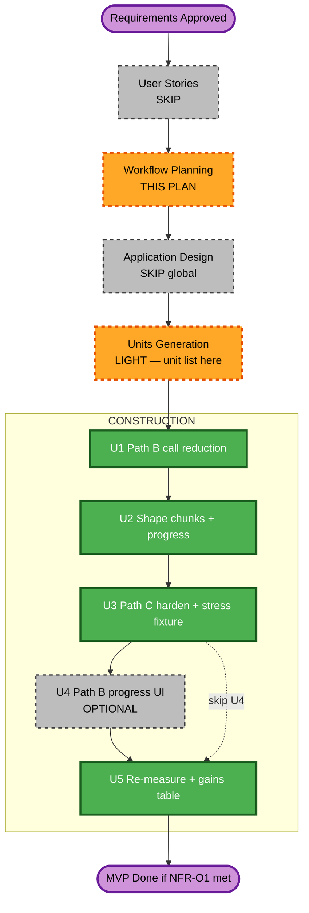

# GHGI Upload AI — Optimization MVP Execution Plan

**Project**: CityCatalyst (Brownfield)  
**Created**: 2026-07-14T02:15:00Z  
**Status**: Approved 2026-07-14T02:15:00Z — Construction authorized at U1
**Document Language**: English  
**Requirements**: `aidlc-docs/inception/requirements/ghgi-upload-ai-optimization-mvp-requirements.md` (**Approved** 2026-07-14)  
**Baseline**: OpenRouter session — gate PASSED  

---

## 1. Detailed Analysis Summary

### Transformation Scope (Brownfield)

| Attribute | Assessment |
|-----------|------------|
| **Transformation type** | Single-package enhancement (`app/`) — AI import Path B/C |
| **Primary changes** | Reduce Path B LLM round-trips; adaptive shape chunk cap + progress; Path C fail-closed; stress fixture; optional UI |
| **Related components** | `interpret/route.ts`, `extract/route.ts`, `AIInterpretationService`, `InventoryExtractionService`, optional `import/page.tsx` |

### Change Impact Assessment

| Impact area | Applies? | Notes |
|-------------|----------|-------|
| User-facing | Optional | Path B progress UI (FR-O6 nice-to-have) |
| Structural | Minor | Service/route logic within existing boundaries |
| Data model | No / minimal | May extend `mappingConfiguration` JSON only |
| API contract | Compatible | Same endpoints; richer status payload for progress |
| NFR | Yes | Latency (M2), tokens (M6), resiliency on failures |

### Component Relationships

```
ImportPage (optional U4)
    → RTK getImportStatus / interpretImport / extractImport
        → interpret/route.ts  ←── U1, U2
        → extract/route.ts    ←── U3
            → AIInterpretationService / InventoryExtractionService
            → ImportedInventoryFile.mappingConfiguration
```

### Module Update Strategy

| Attribute | Plan |
|-----------|------|
| **Approach** | Sequential units in `app/` only |
| **Critical path** | U1 → U2 → U3 → (U4 optional) → U5 |
| **Parallelization** | None across packages; U4 can overlap late U3 if desired |
| **Testing** | Jest per unit; U5 gains = acceptance |

### Risk Assessment

| Attribute | Level |
|-----------|-------|
| **Risk** | Medium (LLM output quality / rowCount regressions) |
| **Rollback** | Easy (revert PR; feature remains behind same APIs) |
| **Testing** | Moderate (fixtures + gains table; partial PBT on pure helpers) |

---

## 2. Workflow Visualization



---

## 3. Stage Decisions

| Stage | Decision | Rationale |
|-------|----------|-----------|
| User Stories | **SKIP** | Q8=A |
| Application Design (global) | **SKIP** | Changes stay inside existing services/routes; per-unit Functional Design in Construction if needed |
| Units Generation (formal story map) | **LIGHT** | Unit list + dependency in this plan replaces heavy units-generation artifacts |
| NFR Requirements / NFR Design stages | **SKIP as separate stages** | NFRs already in MVP requirements; apply during Construction |
| Infrastructure Design | **SKIP** | No infra changes |
| Construction U1–U3, U5 | **EXECUTE** | Core MVP |
| Construction U4 | **OPTIONAL** | FR-O6 / Q5=B |
| Parallel chunk work | **FORBIDDEN** this MVP | Q3=A |

---

## 4. Unit of Work Definitions

### U1 — Path B LLM call reduction  
**Requirements**: FR-O1, NFR-O1, NFR-O4, NFR-O6  
**Touch**: `AIInterpretationService.ts`, `interpret/route.ts`  
**Done when**: Typical F3/F4 path uses fewer sequential LLM round-trips than baseline (2); tests for any new pure merge helpers; no state-machine change  

### U2 — Adaptive shape chunks + progress + fail-closed  
**Requirements**: FR-O2, FR-O3, NFR-O3  
**Depends on**: U1 preferred first (same route); may share helpers  
**Touch**: `interpret/route.ts`, mappingConfiguration progress shape  
**Done when**: Cap adaptive/raised; truncation not silent; progress fields writable for poll; hard errors → `failed`  

### U3 — Path C harden + stress fixture  
**Requirements**: FR-O4, FR-O5, NFR-O3  
**Touch**: `extract/route.ts` (and related), `app/tmp-import-fixtures/` new file(s)  
**Done when**: Extract hard failures set `failed`; ≥1 multi-chunk stress fixture added; one extended-baseline timing recorded for that fixture  

### U4 — Path B progress UI (optional)  
**Requirements**: FR-O6  
**Depends on**: U2  
**Touch**: `import/page.tsx` (and mapping step if needed)  
**Done when**: UI shows Path B progress when `total > 1` (or phases), mirroring Path C patterns from Notion  

### U5 — Re-measure + gains  
**Requirements**: FR-O7, NFR-O1, NFR-O2  
**Depends on**: U1–U3 (U4 if done)  
**Done when**: Gains table filled for F0, F3, F4, F5 + stress fixture; NFR-O1 evaluated pass/fail  

---

## 5. Construction Loop (per unit)

For each EXECUTE unit:

1. Short Functional Design notes under `aidlc-docs/construction/{unit-id}/` if non-trivial  
2. Code in `app/` (never under `aidlc-docs/`)  
3. Jest (+ partial PBT on pure helpers)  
4. Docs-after-change / simplify skills as applicable  
5. Mark unit done in `aidlc-state.md`  

U5 uses the existing measurement harness/protocol (OpenRouter env).

---

## 6. Forbidden Until This Plan Is Approved

- Application optimization code (U1–U4)  
- Raising caps / merging LLM calls / UI progress without this plan approval  

After approval: Construction may start at **U1**.

---

## 7. Approval

> Please examine: `aidlc-docs/inception/plans/ghgi-upload-ai-optimization-mvp-execution-plan.md`  
>  
> **Approve** to begin Construction at U1.  
> **Request changes** if unit split or stage skip/execute decisions need adjustment.
