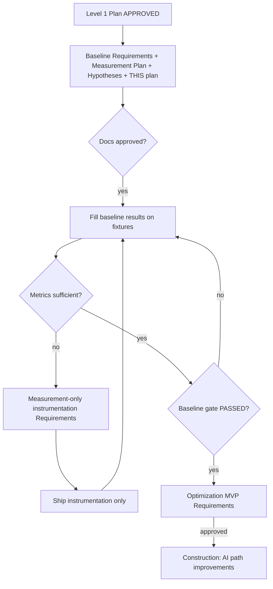

# GHGI Upload AI — Task Execution Plan

**Project**: CityCatalyst (Brownfield)
**Task**: Improve Path B / Path C of GHGI Upload Existing Inventory — measurement-first
**Created**: 2026-07-14T01:10:00Z
**Status**: Approved 2026-07-14T01:15:00Z
**Document Language**: English
**Level 1 Plan**: `aidlc-docs/inception/plans/ghgi-upload-ai-baseline-level-1-plan.md` (Approved)

---

## 1. Detailed Analysis Summary

### Transformation Scope (Brownfield)

| Attribute | Assessment |
|-----------|------------|
| **Transformation type** | Enhancement of existing import AI paths — **gated** by measurement |
| **Primary package** | `app/` (API routes, AI services, optional later UX) |
| **UI SoT** | Notion Import Flow Architecture (reuse; do not reinvent) |
| **This milestone** | Documentation + baseline protocol only |

### Change Impact Assessment (This Milestone)

| Impact area | Applies? |
|-------------|----------|
| User-facing changes | No |
| Structural / API contract changes | No |
| Data model changes | No |
| NFR (performance) work | Measurement only — no code yet |
| Application optimization code | **Forbidden** until gate |

### Risk Assessment

| Attribute | Level |
|-----------|-------|
| Risk (docs phase) | Low |
| Risk (future AI optimization) | Medium (cost, correctness truncation H2, LLM non-determinism) |
| Rollback | Docs: git revert; later code: feature PR revert |

---

## 2. Workflow Visualization

---

## 3. Stage Decisions (This Task Cycle)

| Stage | Decision | Notes |
|-------|----------|-------|
| Monorepo Reverse Engineering | **SKIP** | Complete; reuse |
| Requirements (baseline measurement) | **EXECUTE** | `ghgi-upload-ai-baseline-requirements.md` |
| User Stories | **SKIP** | Until optimization MVP (Path B progress UX may revisit) |
| Workflow Planning (this doc) | **EXECUTE** | |
| Application Design / Units | **SKIP** until post-gate optimization | |
| Construction (optimization) | **BLOCKED** | Gate §5 |
| Construction (instrumentation) | **CONDITIONAL** | Separate Requirements only |
| NFR / Security / Resiliency / PBT extensions | **Deferred** | Q5 = A |

---

## 4. Artifact Checklist

| Artifact | Path | Status |
|----------|------|--------|
| Level 1 Plan | `inception/plans/ghgi-upload-ai-baseline-level-1-plan.md` | Approved |
| Baseline questions | `inception/requirements/ghgi-upload-ai-baseline-questions.md` | Defaults applied |
| Baseline requirements | `inception/requirements/ghgi-upload-ai-baseline-requirements.md` | Awaiting approval |
| Measurement plan + empty tables | `inception/plans/ghgi-upload-ai-baseline-measurement-plan.md` | Awaiting approval |
| Hypotheses (labeled) | `inception/plans/ghgi-upload-ai-bottlenecks-hypotheses.md` | Awaiting approval |
| This execution plan | `inception/plans/ghgi-upload-ai-task-execution-plan.md` | Awaiting approval |

---

## 5. Baseline Gate Checklist (Copy into runs)

Before **any** optimization Construction:

- [x] Baseline requirements + measurement plan + hypotheses + this plan **approved**
- [x] Environment table filled in measurement plan
- [x] Baseline results: Path B (F3 and/or F4) filled
- [x] Baseline results: Path C (F5) filled
- [x] Baseline results: ≥1 non-AI control (F0 and/or F1/F2) filled
- [x] Hypotheses validation matrix updated (Y/N/Partial) — still not treated as tickets alone
- [ ] Optimization MVP Requirements written and **approved**
- [x] If instrumentation was required: N/A — manual + logs sufficient for gate
- [x] Gains table still empty until after-change runs

**Gate status (2026-07-14 OpenRouter):** **PASSED** with caveats (N=1; fixtures too small to stress multi-chunk H1).

**Forbidden until Optimization MVP Requirements approved:** parallel chunks, prompt/model/`maxTokens`/retry/timeout tuning, raising `MAX_TABLE_SHAPE_CHUNKS`, Path B progress UX implementation, or other AI path “quick win” code.

---

## 6. Next Actions After This Plan Set Is Approved

1. **Primary:** Execute baseline protocol on fixtures (controls + Path B + Path C); fill §7 of measurement plan.
2. **Alternate:** If capture gaps are already known, approve a measurement-only instrumentation Requirements slice first, then run baseline.
3. **Then:** Re-open Requirements Analysis for **optimization MVP** only after gate.

---

## 7. User Override Options

- Force User Stories now (e.g. progress UX personas) — optional
- Force instrumentation Requirements before any AI fixture runs — optional (Q3 default is exhaust manual first)
- Narrow fixtures (e.g. skip F4) — allowed if gate minimum still met

---

## 8. Approval Prompt

> Please examine:
> - `aidlc-docs/inception/requirements/ghgi-upload-ai-baseline-requirements.md`
> - `aidlc-docs/inception/plans/ghgi-upload-ai-baseline-measurement-plan.md`
> - `aidlc-docs/inception/plans/ghgi-upload-ai-bottlenecks-hypotheses.md`
> - `aidlc-docs/inception/plans/ghgi-upload-ai-task-execution-plan.md`
>
> Approve to proceed to **baseline fixture runs** (or instrumentation Requirements).  
> No optimization application code will be generated on this approval.
