# Inception Completion Summary

**Project**: CityCatalyst (Brownfield)
**Organization**: Open Earth Foundation (California, USA)
**Completed**: 2026-07-09T20:05:00Z
**Document Language**: English (team lingua franca)
**Phase Scope**: Documentation only — no application code changes

---

## Executive Summary

The **INCEPTION phase** of the AI-DLC workflow for CityCatalyst is **complete**. This brownfield documentation initiative captured the architecture, business context, APIs, dependencies, and code conventions of the CityCatalyst monorepo without modifying any application source code.

The deliverable is a structured documentation foundation under `aidlc-docs/` for a **distributed engineering team** to onboard, plan, and execute future implementation tasks.

---

## What Was Accomplished

| Stage | Status | Key Output |
|-------|--------|------------|
| Workspace Detection | Completed | Brownfield monorepo identified |
| Reverse Engineering | Completed | 9 technical artifacts |
| Requirements Analysis | Completed | Scope formalized (documentation-only) |
| User Stories | Skipped | Not applicable for documentation phase |
| Workflow Planning | Completed | Execution plan with all construction stages skipped |
| Application Design | Skipped | Deferred until implementation task |
| Units Generation | Skipped | Deferred until implementation task |
| **Inception Summary** | **Completed** | This document |

**No application code was generated or modified.**

---

## System at a Glance

CityCatalyst is an open-source climate journey platform (AGPL v3) helping cities measure emissions (GPC-compliant), assess climate risk, prioritize actions, and prepare finance-ready projects.

### Architecture Pattern

**Hub-and-spoke monorepo** — `app` (Next.js 15) orchestrates Python microservices via synchronous HTTP.

```
Browser / API clients / MCP agents
            |
            v
     app/ (Next.js + PostgreSQL)
      /    |    \
     v     v     v
global-api  hiap  climate-advisor
              |
         hiap-meed (experimental, not wired to app)
```

### Runtime Packages

| Package | Role |
|---------|------|
| `app/` | Main product — UI, `/api/v1`, auth, tenancy, GHGI/CCRA/HIAP |
| `global-api/` | Global emissions data, GPC catalogue, GIS, CCRA |
| `hiap/` | ML action prioritization + LLM plan generation |
| `climate-advisor/` | RAG chat agent; callbacks to app for inventory context |
| `hiap-meed/` | Experimental MEED+ scoring (not integrated in app) |
| `api-demo/` | OAuth 2.0 + PKCE demo client |
| `k8s/` | Shared Kubernetes manifests (AWS EKS) |

### Tenancy Model

```
Organization → Project → City → Inventory
```

### Main Execution Flows

1. **Auth** — NextAuth credentials → JWT → apiHandler (PAT/OAuth/service-to-service)
2. **GHGI** — Onboarding → catalogue sync → activity values → CalculationService → results
3. **HIAP** — HiapService → hiap prioritizer → polling → ranking persisted
4. **Climate Advisor** — App proxy (SSE) → CA reads inventory via user JWT
5. **External integration** — OAuth 2.0 + PKCE, MCP server tools

---

## Artifact Index

### State and Audit

| Document | Purpose |
|----------|---------|
| [`aidlc-state.md`](../../aidlc-state.md) | Workflow progress and current status |
| [`audit.md`](../../audit.md) | Complete audit trail of all interactions |

### Plans

| Document | Purpose |
|----------|---------|
| [`reverse-engineering-level-1-plan.md`](reverse-engineering-level-1-plan.md) | Reverse engineering scope and execution plan |
| [`execution-plan.md`](execution-plan.md) | Full workflow plan with skip/execute decisions |
| [`inception-completion-summary.md`](inception-completion-summary.md) | This handoff document |

### Requirements

| Document | Purpose |
|----------|---------|
| [`requirements.md`](../requirements/requirements.md) | Formal requirements for documentation phase |
| [`requirement-verification-questions.md`](../requirements/requirement-verification-questions.md) | Clarifying questions with answers |

### Reverse Engineering (Technical Baseline)

| Document | Start Here If You Need To... |
|----------|------------------------------|
| [`business-overview.md`](../reverse-engineering/business-overview.md) | Understand what CityCatalyst does and key business transactions |
| [`architecture.md`](../reverse-engineering/architecture.md) | See system diagrams, data flows, integration points, K8s |
| [`code-structure.md`](../reverse-engineering/code-structure.md) | Learn module layout, patterns, conventions, key files |
| [`api-documentation.md`](../reverse-engineering/api-documentation.md) | Find REST endpoints by domain (app, global-api, hiap, CA) |
| [`component-inventory.md`](../reverse-engineering/component-inventory.md) | Get package counts and module inventory |
| [`technology-stack.md`](../reverse-engineering/technology-stack.md) | Look up languages, frameworks, tools, versions |
| [`dependencies.md`](../reverse-engineering/dependencies.md) | Understand inter-service and external dependencies |
| [`code-quality-assessment.md`](../reverse-engineering/code-quality-assessment.md) | Review testing, CI, technical debt, anti-patterns |
| [`reverse-engineering-timestamp.md`](../reverse-engineering/reverse-engineering-timestamp.md) | Check analysis date and open understanding gaps |

### Existing Repo Documentation (Complement)

| Document | Purpose |
|----------|---------|
| [`README.md`](../../../README.md) | Product overview and quick start |
| [`app/AGENTS.md`](../../../app/AGENTS.md) | Detailed app conventions for AI agents |
| [`.cursor/rules/project-architecture.mdc`](../../../.cursor/rules/project-architecture.mdc) | Architecture rule for Cursor agents |

---

## Recommended Reading Order

### For a new engineer (first week)

1. This summary
2. `business-overview.md`
3. `architecture.md`
4. `code-structure.md`
5. `app/AGENTS.md` + `app/README.md`

### For scoping an implementation task

1. `requirements.md` (current phase constraints)
2. `component-inventory.md` + `dependencies.md`
3. `api-documentation.md` (affected endpoints)
4. `code-quality-assessment.md` (debt and test patterns)
5. `reverse-engineering-timestamp.md` (open gaps)

### For resuming AI-DLC on a new task

1. `aidlc-state.md`
2. `audit.md` (last interaction)
3. `execution-plan.md` → section "Future Implementation Workflow"

---

## Open Understanding Gaps (For Future Tasks)

These items were identified during reverse engineering and remain unresolved:

| # | Gap | Suggested Investigation |
|---|-----|-------------------------|
| 1 | `hiap` vs `hiap-meed` product roadmap | READMEs, product team, k8s deploy configs |
| 2 | GHGI calculation engine internals | `CalculationService`, formula seed data |
| 3 | CCRA dual backend (global-api vs Replit) | `CcraApiService`, `CC_CCRA_REPLIT_URL` |
| 4 | global-api `/api/v0` vs `/api/v1` deprecation | `global-api/routes/`, `deprecated/` |
| 5 | MCP server full scope and auth | `app/src/lib/mcp/` |
| 6 | OAuth/PAT scope definitions | `app/src/lib/auth/`, OAuth routes |
| 7 | Partner modules (Journey Navigator) | `JN_ENABLED` flag, module catalog |
| 8 | Agentic stationary-energy contract | `internal/ca/capabilities/ghgi/` |
| 9 | Cross-service observability | Highlight, PostHog, MLflow configs |
| 10 | K8s secret rotation | `k8s/cc-web-aws-secret.yml` |
| 11 | Cross-service integration tests | CI workflows, test directories |
| 12 | Catalogue sync cadence in production | `cc-sync-catalogue.yml`, cron jobs |

---

## Extension Configuration (Deferred)

| Extension | Status | Action When Implementing |
|-----------|--------|--------------------------|
| Security Baseline | Deferred | Opt in during Requirements Analysis |
| Resiliency Baseline | Deferred | Opt in during Requirements Analysis |
| Property-Based Testing | Deferred | Opt in during Requirements Analysis |

---

## Checklist: Starting a New Implementation Task

When the team is ready to implement a feature, fix, or refactor:

- [ ] Define the concrete task (what, why, who benefits)
- [ ] Check if reverse-engineering artifacts are still current (re-run if codebase changed significantly)
- [ ] Start a new AI-DLC cycle or resume from `aidlc-state.md`
- [ ] Run Requirements Analysis for the specific task (not documentation-only)
- [ ] Decide on User Stories (if user-facing impact)
- [ ] Opt in/out of Security, Resiliency, and PBT extensions
- [ ] Run Application Design and Units Generation if multi-component
- [ ] Execute Construction per-unit loop (design → code → build and test)
- [ ] Resolve relevant understanding gaps from the table above

### Suggested package analysis order (when scoping changes)

1. `app/` — UI, API, auth, tenancy
2. `global-api/` — catalogue, emissions, GIS
3. `hiap/` or `climate-advisor/` — AI/ML workflows
4. `k8s/` + `.github/workflows/` — deployment and env vars

---

## Workflow Status Diagram

```mermaid
flowchart LR
  subgraph done [INCEPTION COMPLETE]
    WD[Workspace Detection]
    RE[Reverse Engineering]
    RA[Requirements Analysis]
    WP[Workflow Planning]
    ICS[Completion Summary]
  end

  subgraph future [FUTURE - ON NEW TASK]
    US[User Stories]
    AD[Application Design]
    UG[Units Generation]
    CG[Code Generation]
    BT[Build and Test]
  end

  WD --> RE --> RA --> WP --> ICS
  ICS -.->|new task| US
  US -.-> AD
  AD -.-> UG
  UG -.-> CG --> BT

  style WD fill:#4CAF50,stroke:#1B5E20,color:#fff
  style RE fill:#4CAF50,stroke:#1B5E20,color:#fff
  style RA fill:#4CAF50,stroke:#1B5E20,color:#fff
  style WP fill:#4CAF50,stroke:#1B5E20,color:#fff
  style ICS fill:#4CAF50,stroke:#1B5E20,color:#fff
  style US fill:#FFA726,stroke:#E65100,stroke-dasharray: 5 5,color:#000
  style AD fill:#FFA726,stroke:#E65100,stroke-dasharray: 5 5,color:#000
  style UG fill:#FFA726,stroke:#E65100,stroke-dasharray: 5 5,color:#000
  style CG fill:#FFA726,stroke:#E65100,stroke-dasharray: 5 5,color:#000
  style BT fill:#FFA726,stroke:#E65100,stroke-dasharray: 5 5,color:#000
```



---

## Acceptance Criteria — All Met

- [x] Reverse-engineering artifacts complete and approved
- [x] Requirements documented in English
- [x] Execution plan approved
- [x] Inception completion summary created
- [x] Audit trail maintained
- [x] No application code modified
- [x] Understanding gaps preserved for future work
- [x] Handoff ready for distributed engineering team

---

## Contacts and Conventions

| Convention | Value |
|------------|-------|
| **Documentation language** | English |
| **Application code location** | Workspace root (never in `aidlc-docs/`) |
| **AI-DLC docs location** | `aidlc-docs/` only |
| **Path alias (app)** | `@/` → `app/src/` |
| **License** | AGPL v3 |
| **Deployment** | AWS EKS; `develop` → dev, `main` → test, tags → prod |

---

**INCEPTION PHASE: COMPLETE**

The documentation foundation is ready. Define the next implementation task to resume AI-DLC at Requirements Analysis or Workflow Planning for that specific scope.
