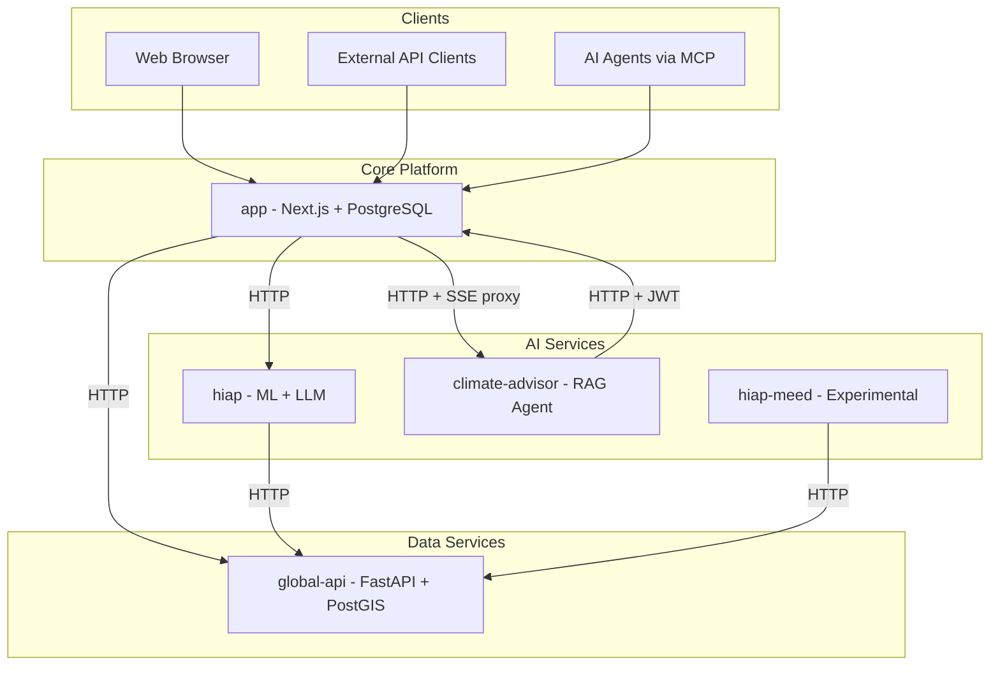

# Reverse Engineering — Level 1 Plan

**Project**: CityCatalyst (Brownfield)
**Created**: 2026-07-09T18:55:00Z
**Status**: Approved — Part 2 Complete
**Phase**: INCEPTION — Reverse Engineering (Part 1: Planning)

---

## 1. Purpose

This Level 1 Plan defines the scope, approach, and expected deliverables for reverse-engineering the CityCatalyst monorepo. It captures preliminary findings from workspace detection and initial exploration, and maps them to the user's stated goals.

**No application code will be generated.** Upon approval, Part 2 will produce documentation artifacts only under `aidlc-docs/inception/reverse-engineering/`.

---

## 2. Workspace Detection Summary

| Attribute | Finding |
|-----------|---------|
| **Project Type** | Brownfield |
| **Workspace Root** | `/home/davi/Área de trabalho/projects/open-earth/CityCatalyst` |
| **Languages** | TypeScript, Python, YAML, SQL |
| **Build Systems** | npm (app, load-test), uv/pip (Python services) |
| **Project Structure** | Monorepo — multi-service (hub-and-spoke) |
| **Existing AI-DLC Artifacts** | None (first run) |
| **License** | AGPL v3 — Open Earth Foundation |

---

## 3. Goals Mapping

| User Goal | Planned Artifact / Section | Preliminary Finding |
|-----------|---------------------------|---------------------|
| General system architecture | `architecture.md` | Hub-and-spoke: `app` orchestrates UI, auth, tenancy, GHGI; Python microservices for data/AI |
| Main modules, responsibilities, dependencies | `component-inventory.md`, `dependencies.md` | 9 runtime packages identified (see Section 4) |
| Architectural patterns | `code-structure.md` | apiHandler, Service Layer, RTK Query, Sequelize ORM, FastAPI routers |
| Project organization | `code-structure.md` | Monorepo by domain; each service has own Dockerfile, K8s, CI workflow |
| Code conventions | `code-structure.md`, `code-quality-assessment.md` | AGENTS.md per package; `@/` alias; Zod validation; `.cjs` migrations |
| Main execution flows | `architecture.md`, `business-overview.md` | Auth, GHGI, HIAP, Climate Advisor, OAuth/MCP |
| Doubts / understanding gaps | Dedicated section in each artifact + consolidated list | 12 gaps identified (see Section 8) |

---

## 4. Package Inventory (Preliminary)

### 4.1 Application Packages

| Package | Stack | Business Purpose |
|---------|-------|------------------|
| `app/` | Next.js 15, React 18, Chakra UI v3, Sequelize, NextAuth | Main product: UI, REST API `/api/v1`, GHGI/CCRA/HIAP orchestration, tenancy |
| `global-api/` | FastAPI, SQLAlchemy, Alembic, PostGIS | Global emissions data, GPC catalogue, city boundaries, climate actions, CCRA data |
| `climate-advisor/` | FastAPI, pgvector, openai-agents, SSE | Conversational AI advisor (RAG); calls back to `app` for inventory context |
| `hiap/` | FastAPI, XGBoost, LangChain, ChromaDB | HIAP action prioritization and plan generation (ML + LLM) |
| `hiap-meed/` | FastAPI, httpx, pandas | Experimental MEED+ scoring engine; **not wired to `app`** |
| `api-demo/` | Static HTML + Nginx | OAuth 2.0 + PKCE demo client |
| `load-test/` | k6 + TypeScript | Load testing scripts |

### 4.2 Infrastructure / Tooling Packages

| Package | Type | Purpose |
|---------|------|---------|
| `k8s/` | Kubernetes YAML | Shared manifests: web, DB, global-api, ingress, cron jobs |
| `.github/workflows/` | CI/CD | Per-service build, test, deploy to EKS via GHCR |
| `aws-aidlc-rules/`, `aws-aidlc-rule-details/` | AI workflow rules | AI-DLC process documentation (not runtime) |
| `.cursor/` | IDE config | Agent skills and project rules |
| `docs/` | Documentation | Architecture notes (`docs/plan.md`, `docs/AgenticModuleScope.md`) |

---

## 5. Preliminary Architecture Overview

### 5.1 System Context (Text Diagram)

```
                    +------------------+
                    |   City Users     |
                    |  (Browser/API)   |
                    +--------+---------+
                             |
                             v
              +------------------------------+
              |         app/ (Next.js)       |
              |  UI + /api/v1 + PostgreSQL   |
              +--+--------+--------+--------+
                 |        |        |
     GLOBAL_API  |  HIAP  |   CA   |  OAuth/MCP
     _URL        |  _URL  |  _URL  |
                 v        v        v
         +-----------+ +------+ +----------------+
         |global-api | | hiap | |climate-advisor |
         | (PostGIS) | +------+ |  (pgvector)    |
         +-----------+          +-------+--------+
                                        |
                              CC_BASE_URL + CC_API_KEY
                                        |
                                        v
                              (callback to app/)
```

### 5.2 Mermaid Architecture Diagram (for Part 2 artifact)



### 5.3 Tenancy Model (app/)

```
Organization --> Project --> City --> Inventory
     |              |           |
  OrgAdmin      ProjectAdmin  CityUser
```

---

## 6. Preliminary Findings by Goal

### 6.1 General System Architecture

- **Pattern**: Hub-and-spoke monorepo; `app` is the integration hub.
- **Communication**: Synchronous HTTP between services (no message bus observed).
- **Data stores**: PostgreSQL in `app` (Sequelize) and `global-api` (SQLAlchemy/PostGIS); separate Postgres + pgvector in `climate-advisor`.
- **Deployment**: Docker containers on AWS EKS; branch-based promotion (`develop` -> dev, `main` -> test, tags -> prod).
- **Domain standard**: GPC (Global Protocol for Community-Scale GHG Inventories).

### 6.2 Main Modules, Responsibilities, and Dependencies

| Module | Key Responsibilities | Depends On |
|--------|---------------------|------------|
| `app` | Auth, tenancy, GHGI CRUD, CCRA UI, HIAP orchestration, chat proxy, OAuth, MCP | PostgreSQL, global-api, hiap, climate-advisor, AWS S3 |
| `global-api` | Catalogue sync source, emissions factors, boundaries, climate actions | PostgreSQL/PostGIS |
| `hiap` | Action ranking (XGBoost), LLM explanations, plan creation | global-api (city context, actions), OpenAI |
| `climate-advisor` | Chat threads, RAG, agentic GHGI assistance | app (inventory APIs), OpenAI, pgvector |
| `hiap-meed` | MEED+ multi-criteria scoring | global-api only |

### 6.3 Architectural Patterns Identified

| Pattern | Location | Description |
|---------|----------|-------------|
| **API Handler Wrapper** | `app/src/util/api.ts` | Centralized auth, DB init, rate limit, error handling for all API routes |
| **Service Layer** | `app/src/backend/*Service.ts` | Business logic separated from route handlers |
| **Repository/ORM** | `app/src/models/`, `global-api/db/` | Sequelize (app) and SQLAlchemy (global-api) |
| **Client-Side Data Layer** | `app/src/services/api.ts` | RTK Query with tag-based cache invalidation |
| **Request Validation** | `app/src/util/validation.ts` | Zod schemas at API boundary |
| **Feature Flags** | `app/src/util/feature-flags.ts` | Env-driven toggles for modules and integrations |
| **Proxy Pattern** | `app/src/backend/chat/climate-advisor.ts` | App proxies CA requests; CA calls back to app |
| **Async Job Polling** | HIAP prioritization + `cron/check-hiap-jobs` | Long-running ML jobs with status polling |
| **OpenAPI-First** | `@swagger` JSDoc in routes | Spec generated to `app/public/openapi-spec.json` |
| **FastAPI Routers** | `global-api/routes/`, Python services | Domain-separated API modules |

### 6.4 Project Organization

```
CityCatalyst/
├── app/                  # Main Next.js application
├── global-api/           # Python data API
├── climate-advisor/      # Python AI chat service
├── hiap/                 # Python HIAP service
├── hiap-meed/            # Python MEED experimental service
├── api-demo/             # OAuth demo
├── k8s/                  # Shared K8s manifests
├── load-test/            # k6 load tests
├── docs/                 # Architecture docs
├── .github/workflows/    # CI/CD per service
└── aidlc-docs/           # AI-DLC documentation (this workflow)
```

Each Python service follows: `app/main.py`, `app/services/`, `app/modules/`, `Dockerfile`, `k8s/`, `pyproject.toml`, `AGENTS.md`.

### 6.5 Code Conventions (Preliminary)

| Area | Convention |
|------|-------------|
| TypeScript imports | `@/` path alias maps to `app/src/` |
| API routes | Must use `apiHandler`; Zod validation; `http-errors` |
| DB timestamps | `created` / `lastUpdated` (not Sequelize defaults) |
| Migrations | `.cjs` format with `up()` and `down()` |
| Tests (app) | `*.jest.ts` (unit/API), `*.spec.ts` (Playwright E2E) |
| Tests (Python) | pytest per service |
| i18n | Keys in `en/` only; CI auto-translates |
| Python style | Black formatter; absolute imports |
| Logging | Pino (app), structured logging (Python services) |
| Agent docs | `AGENTS.md` in each major package |

### 6.6 Main Execution Flows (Preliminary)

#### Flow A — Authentication
1. User submits credentials via NextAuth (`app/src/lib/auth.ts`)
2. JWT session created with `user.id` and `user.role`
3. API routes resolve auth via `apiHandler` (session -> Bearer JWT -> PAT -> OAuth -> service-to-service)
4. Middleware handles CORS, i18n, route protection

#### Flow B — GHGI Inventory
1. Onboarding creates Organization -> Project -> City -> Inventory
2. Catalogue/emission factors synced from global-api (`sync-catalogue`, `sync-emissions-factors`)
3. User enters activity data via UI -> `POST /api/v1/inventory/{id}/activity-value`
4. `CalculationService` applies methodology-specific formulas
5. Results aggregated via `ResultsService`; export via eCRF/PDF/CDP

#### Flow C — HIAP Prioritization
1. Client calls `GET /api/v1/inventory/{id}/hiap`
2. `HiapService` builds context; `HiapApiService` calls `hiap/prioritizer/v1/start_prioritization`
3. HIAP fetches city context and actions from global-api
4. ML ranking + LLM explanations; polling until complete
5. Results persisted in `HighImpactActionRanking`; cron job checks async jobs

#### Flow D — Climate Advisor Chat
1. UI -> `POST /api/v1/chat/threads` (authenticated)
2. App proxies to `CA_BASE_URL/v1/threads` with service token
3. Messages streamed via SSE; CA uses `CityCatalystClient` to read inventory with user JWT
4. Agentic stationary-energy drafts via internal routes `api/v1/internal/ca/capabilities/ghgi/*`

#### Flow E — External Integration (OAuth / MCP)
1. OAuth 2.0 + PKCE for third-party apps (`api-demo/` demonstrates flow)
2. MCP server exposes tools (inventories, emissions, cities, action plans) at `api/v1/.well-known/mcp-server`

---

## 7. Part 2 Execution Plan (Artifacts to Generate)

Upon approval, the following artifacts will be created per AI-DLC `reverse-engineering.md`:

| # | Artifact | Depth | Key Content |
|---|----------|-------|-------------|
| 1 | `business-overview.md` | Comprehensive | Business context diagram, transactions (GHGI, CCRA, HIAP, CA), domain glossary |
| 2 | `architecture.md` | Comprehensive | System overview, Mermaid diagrams, data flows, integration points, infrastructure |
| 3 | `code-structure.md` | Comprehensive | Module hierarchy, design patterns, critical file inventory (top-level + key files) |
| 4 | `api-documentation.md` | Standard | REST endpoints by domain (app `/api/v1`, global-api `/api/v0`+`/api/v1`, Python services) |
| 5 | `component-inventory.md` | Standard | Package catalog with counts and types |
| 6 | `technology-stack.md` | Standard | Languages, frameworks, infra, testing tools with versions |
| 7 | `dependencies.md` | Standard | Internal package graph + key external dependencies |
| 8 | `code-quality-assessment.md` | Standard | Test coverage indicators, linting, CI, technical debt, anti-patterns |
| 9 | `reverse-engineering-timestamp.md` | Minimal | Metadata and artifact checklist |

### 7.1 Execution Steps (Checkboxes)

- [x] **Step 1** — Multi-package discovery (deep scan of all packages, build configs, CI)
- [x] **Step 2** — Generate `business-overview.md`
- [x] **Step 3** — Generate `architecture.md` (validate Mermaid syntax)
- [x] **Step 4** — Generate `code-structure.md`
- [x] **Step 5** — Generate `api-documentation.md` (sample key endpoints per domain)
- [x] **Step 6** — Generate `component-inventory.md`
- [x] **Step 7** — Generate `technology-stack.md`
- [x] **Step 8** — Generate `dependencies.md`
- [x] **Step 9** — Generate `code-quality-assessment.md`
- [x] **Step 10** — Generate `reverse-engineering-timestamp.md`
- [x] **Step 11** — Update `aidlc-state.md` with completion status
- [x] **Step 12** — Present completion summary and await approval to proceed to Requirements Analysis

### 7.2 Analysis Depth

Per `common/depth-levels.md`, this brownfield monorepo warrants **comprehensive** detail in architecture and code-structure artifacts, and **standard** detail in API documentation and quality assessment.

### 7.3 Out of Scope (Part 2)

- Application code changes
- Running services or databases
- Full endpoint enumeration (representative sampling per domain)
- Line-by-line file inventory (key files only)

---

## 8. Understanding Gaps and Open Questions

The following items require deeper investigation during Part 2:

| # | Gap | Why It Matters | Investigation Target |
|---|-----|----------------|---------------------|
| 1 | `hiap` vs `hiap-meed` relationship | MEED not integrated in `app`; unclear product roadmap | READMEs, AGENTS.md, k8s deploy configs |
| 2 | GHGI calculation engine | Core business logic complexity | `CalculationService`, formula seed data |
| 3 | CCRA data sources | `CcraApiService` vs `CC_CCRA_REPLIT_URL` — dual backends? | `app/src/backend/ccra/`, env configs |
| 4 | global-api API versioning | `/api/v0` vs `/api/v1` — canonical vs deprecated | `global-api/routes/`, `deprecated/` |
| 5 | MCP server scope | Full tool catalog and auth model | `app/src/lib/mcp/` |
| 6 | OAuth/PAT authorization model | Scopes, client registration, token lifecycle | `app/src/lib/auth/`, OAuth routes |
| 7 | Partner modules (Journey Navigator) | External iframe/API integration pattern | Feature flag `JN_ENABLED`, module catalog |
| 8 | Agentic stationary-energy flow | Draft -> review -> commit contract between CA and app | `internal/ca/capabilities/ghgi/`, CA client |
| 9 | Cross-service observability | Request correlation across services | Highlight.io, PostHog, MLflow configs |
| 10 | Secret management in K8s | Key rotation for `CC_SERVICE_API_KEY` | `k8s/cc-web-aws-secret.yml`, deploy manifests |
| 11 | Integration test coverage | Cross-service test strategy | `tests/` directories, CI workflows |
| 12 | Data sync cadence | How catalogue/emission factors stay current | Sync scripts, cron jobs |

---

## 9. Risk and Constraints

- **No code generation** — documentation only
- **Content validation** — all Mermaid diagrams validated before file write
- **AGPL license** — documentation must not reproduce proprietary third-party content
- **Large codebase** — API documentation will use representative sampling, not exhaustive listing

---

## 10. Approval

> **REVIEW REQUIRED**
> Please examine this Level 1 Plan at: `aidlc-docs/inception/plans/reverse-engineering-level-1-plan.md`

> **WHAT'S NEXT?**
>
> You may:
>
> - **Request Changes** — Ask for modifications to scope, depth, or preliminary findings
> - **Approve and Continue** — Approve this plan; Part 2 will generate reverse-engineering artifacts

**Awaiting explicit approval before proceeding to Part 2.**
