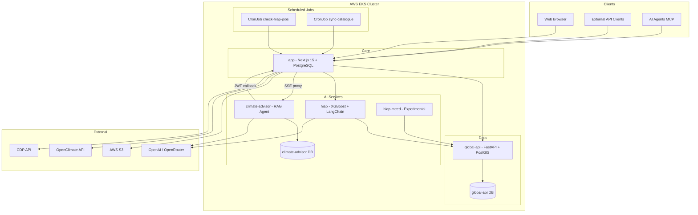
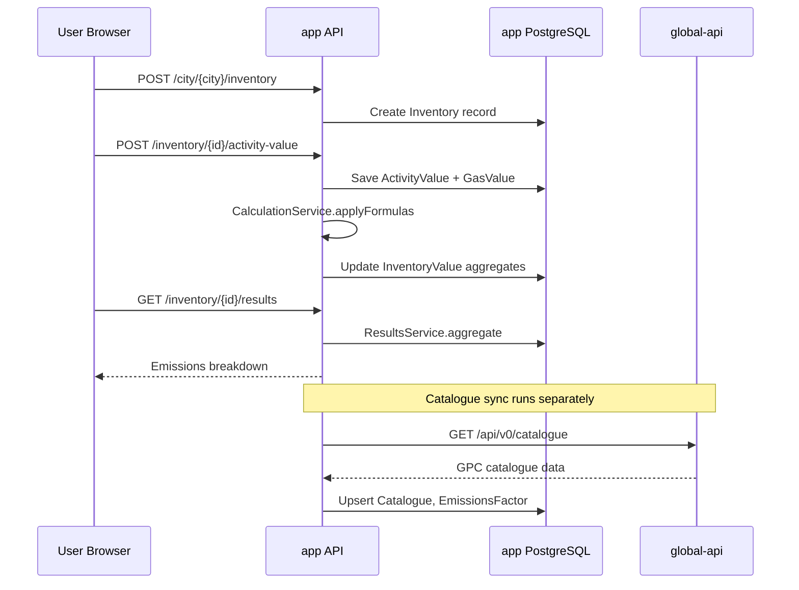
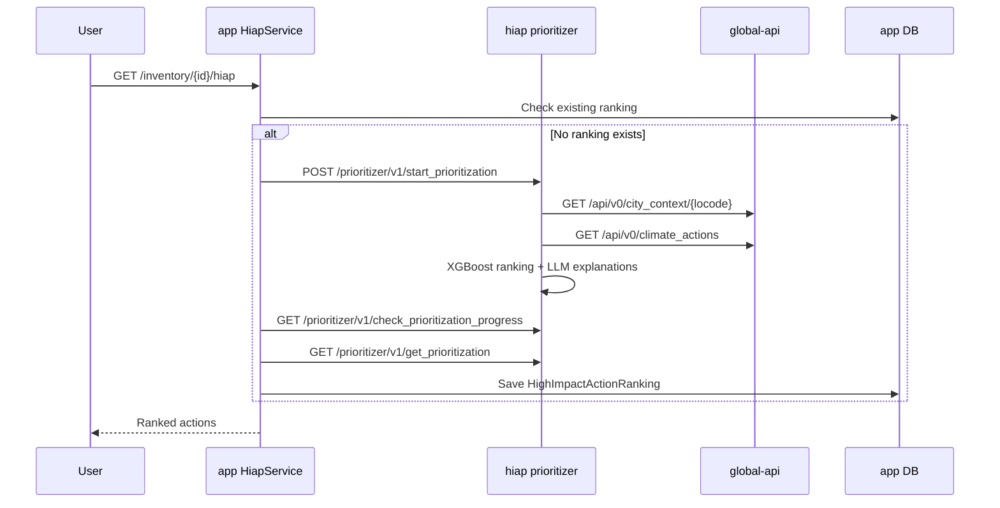
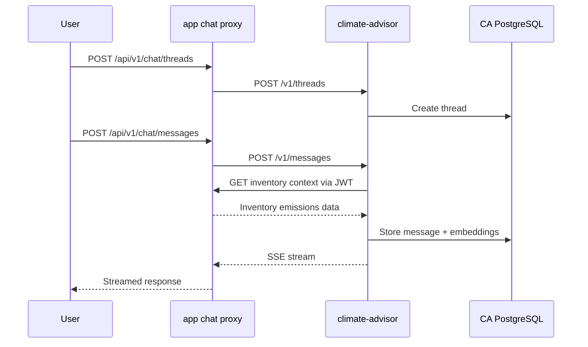

# System Architecture

## System Overview

CityCatalyst is a **hub-and-spoke monorepo** deployed as multiple containerized services on **AWS EKS**. The `app` package (Next.js 15) is the integration hub: it serves the web UI, exposes the public REST API (`/api/v1`), manages tenancy and authentication, and orchestrates calls to Python microservices.

Communication between services is **synchronous HTTP** (no message bus). Long-running HIAP jobs use **async task polling** with a Kubernetes CronJob for status checks.

Three PostgreSQL databases exist across services:
- **app DB** — tenancy, inventories, users, HIAP rankings (Sequelize)
- **global-api DB** — catalogue, emissions, GIS data (SQLAlchemy + PostGIS)
- **climate-advisor DB** — chat threads, pgvector embeddings (async SQLAlchemy)

## Architecture Diagram



### Text Alternative

```
Clients -> app (hub)
app -> global-api, hiap, climate-advisor
climate-advisor -> app (callback)
hiap -> global-api
hiap-meed -> global-api (not wired to app)
CronJobs -> app (HIAP check, catalogue sync)
```

## Component Descriptions

### app/ — Application

- **Purpose:** Main product — UI, API, auth, tenancy, GHGI/CCRA/HIAP orchestration.
- **Responsibilities:** Next.js pages, 152 API routes, Sequelize ORM, NextAuth, RTK Query client, OAuth/MCP servers.
- **Dependencies:** PostgreSQL, global-api, hiap, climate-advisor, AWS S3, OpenClimate, CDP.
- **Type:** Application

### global-api/ — Data Services

- **Purpose:** Global emissions, GPC catalogue, GIS boundaries, climate actions, CCRA, climate finance.
- **Responsibilities:** 35 FastAPI route modules; Alembic migrations; PostGIS spatial queries.
- **Dependencies:** PostgreSQL/PostGIS.
- **Type:** Application (data service)

### hiap/ — Prioritization and Plans

- **Purpose:** ML action ranking and LLM plan generation.
- **Responsibilities:** `/prioritizer/v1/*`, `/plan-creator/v1/*`, legacy plan-creator.
- **Dependencies:** global-api (v0), OpenAI, ChromaDB, AWS S3.
- **Type:** Application (AI/ML service)

### climate-advisor/ — Conversational AI

- **Purpose:** RAG chat agent and agentic GHGI workflows.
- **Responsibilities:** Thread/message management, SSE streaming, stationary-energy drafts.
- **Dependencies:** app (inventory APIs via JWT), OpenAI/OpenRouter, pgvector Postgres.
- **Type:** Application (AI service)

### hiap-meed/ — MEED Scoring (Experimental)

- **Purpose:** Alternative multi-criteria prioritization engine.
- **Responsibilities:** `POST /v1/prioritize` synchronous pipeline.
- **Dependencies:** global-api (v0+v1), S3 (legal assessments), MLflow.
- **Type:** Application (experimental)

### k8s/ — Infrastructure Manifests

- **Purpose:** Shared Kubernetes resources for app, global-api, DBs, ingress, cron jobs.
- **Type:** Infrastructure

## Tenancy Model

```
Organization
  └── Project
        └── City (locode)
              └── Inventory (year)
                    ├── ActivityValue / GasValue
                    ├── InventoryValue (aggregated)
                    └── HighImpactActionRanking (HIAP)
```

**Access control:** OrganizationAdmin, ProjectAdmin, CityUser roles via PermissionService.

## Data Flow

### GHGI Inventory Creation and Calculation



### HIAP Prioritization



### Climate Advisor Chat



## Integration Points

### External APIs

| Service | URL Env Var | Purpose |
|---------|-------------|---------|
| global-api | `GLOBAL_API_URL` | Catalogue, boundaries, CCRA, forecast, climate actions |
| hiap | `HIAP_API_URL` | Action prioritization and plan creation |
| climate-advisor | `CA_BASE_URL` | Chat threads and messages |
| OpenClimate | `NEXT_PUBLIC_OPENCLIMATE_API_URL` | Actor hierarchy, country emissions |
| CDP | CDP API credentials | Green Star reporting |
| OpenAI / OpenRouter | API keys in Python services | LLM explanations, chat, plan generation |

### Databases

| Database | Service | ORM | Purpose |
|----------|---------|-----|---------|
| app PostgreSQL | app | Sequelize v6 | Tenancy, inventories, users, HIAP rankings |
| global-api PostgreSQL | global-api | SQLAlchemy 2 + Alembic | Catalogue, emissions, GIS, CCRA |
| climate-advisor PostgreSQL | climate-advisor | SQLAlchemy + asyncpg | Chat, pgvector embeddings |

### Third-Party Services

| Service | Usage |
|---------|-------|
| AWS S3 | File uploads, HIAP artifacts, hiap-meed legal CSVs |
| GitHub Container Registry | Docker image hosting |
| Highlight.io | Frontend error monitoring (`HIGHLIGHT_ENABLED`) |
| PostHog | Analytics (`ANALYTICS_ENABLED`) |
| MLflow | climate-advisor and hiap-meed experiment tracking |
| LangSmith | hiap LLM tracing |

## Infrastructure Components

### Kubernetes Resources (k8s/)

| Resource | Purpose |
|----------|---------|
| `cc-web-deploy.yml` | Next.js app deployment |
| `cc-db*.yml` | App PostgreSQL |
| `cc-global-api*.yml` | Global API + dedicated DB |
| `cc-ingress.yml` | Nginx ingress (blocks `/api/v1/cron/` externally) |
| `cc-migrate.yml` / `cc-seed.yml` | DB migration and seed jobs |
| `cc-sync-catalogue.yml` | CronJob for GPC catalogue sync |
| `cc-check-hiap-jobs.yml` | CronJob for HIAP async job polling |
| `cc-ca-smoke-fixture.yml` | Climate Advisor smoke test job |

Per-service manifests: `hiap/k8s/`, `hiap-meed/k8s/`, `climate-advisor/k8s/`, `api-demo/k8s/`.

### Deployment Model

- **Containerized:** Each service has its own Dockerfile.
- **Registry:** `ghcr.io/open-earth-foundation/citycatalyst-*`
- **Promotion:** `develop` branch -> dev; `main` -> test; version tags `vX.Y.Z` -> production.
- **CI:** GitHub Actions per service (build, test, push image, deploy to EKS).

### Networking

- Ingress via nginx controller (`cc-ingress.yml`).
- Internal service DNS: `hiap-service`, `hiap-service-dev`, `climate-advisor-service`, etc.
- Cron endpoints blocked at ingress level for external access.

## Understanding Gaps (Architecture)

| Gap | Status | Notes |
|-----|--------|-------|
| hiap vs hiap-meed coexistence | Open | MEED deployed separately; app uses hiap only |
| CCRA dual backend | Partially mapped | global-api v0 for data; Replit URL for full UI |
| global-api v0 vs v1 | Partially mapped | App uses v0 predominantly; v1 for newer finance/scoring APIs |
| Cross-service tracing | Open | Highlight, PostHog, MLflow — no unified trace ID observed |
| Partner module integration | Open | Journey Navigator iframe pattern not fully documented |
