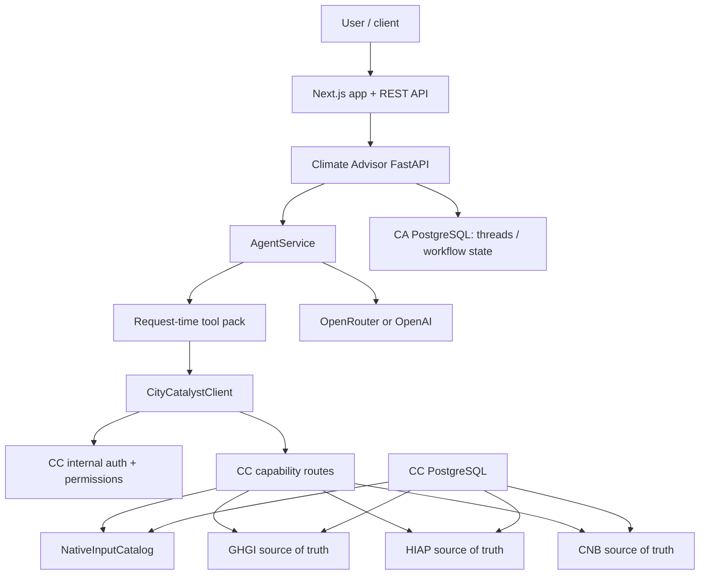
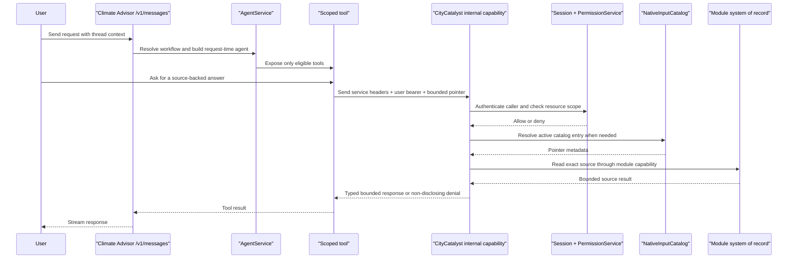

# System Architecture

## System Overview

CityCatalyst is a monorepo of cooperating services. The Next.js/TypeScript `app` is the Core system: it exposes public and internal API routes, enforces permissions, and owns the PostgreSQL-backed product models. Climate Advisor is a Python/FastAPI service that stores conversations and workflow state, builds an OpenAI Agents SDK agent per request, and calls Core internal capabilities with service-to-service headers plus a user-scoped bearer token.

The NativeInputCatalog currently exists in Core as a pointer registry with producer adapters for GHGI and HIAP. The existing Climate Advisor integration already has request-time tool construction and several bounded GHGI, HIAP, Stationary Energy, and Concept Note capability paths. The CC-737 gap is the connection between catalog discovery and request-time source-specific capability loading.

## Architecture Diagram

```mermaid
flowchart TB
  User["User / client"] --> Web["Next.js app + REST API"]
  Web --> CAAPI["Climate Advisor FastAPI"]
  CAAPI --> Agent["AgentService"]
  Agent --> Tools["Request-time tool pack"]
  Tools --> CCClient["CityCatalystClient"]
  CCClient --> Auth["CC internal auth + permissions"]
  CCClient --> Capabilities["CC capability routes"]
  Capabilities --> Catalog["NativeInputCatalog"]
  Capabilities --> GHGI["GHGI source of truth"]
  Capabilities --> HIAP["HIAP source of truth"]
  Capabilities --> CNB["CNB source of truth"]
  CAAPI --> CAData["CA PostgreSQL: threads / workflow state"]
  Agent --> LLM["OpenRouter or OpenAI"]
  CoreData["CC PostgreSQL"] --> Catalog
  CoreData --> GHGI
  CoreData --> HIAP
  CoreData --> CNB
```

Text alternative: The client reaches the Next.js app and Climate Advisor. Climate Advisor creates a request-scoped AgentService tool pack. Tools call CityCatalystClient, which reaches permission-checked Core capability routes. Those routes read the Core catalog or module-owned GHGI/HIAP/CNB systems of record. Climate Advisor persists conversation/workflow state separately and sends model requests to the configured chat provider.

## Component Descriptions

### CityCatalyst `app`

- **Purpose**: Core web/API application and authorization boundary.
- **Responsibilities**: Next.js routes, Sequelize models/migrations, PermissionService, module services, capability registries/routes, and internal service authentication.
- **Dependencies**: PostgreSQL, AWS services for product storage where applicable, and module services/data.
- **Type**: Application.

### NativeInputCatalog

- **Purpose**: Discoverability index for durable native inputs and generated artifacts.
- **Responsibilities**: Store source identity, owning module, scope, availability, digest/readiness labels; support idempotent registration, withdrawal, and supersession.
- **Dependencies**: Core Sequelize model and producer adapters.
- **Type**: Shared Core model/service.

### Core capability routes

- **Purpose**: Provide typed internal read/write boundaries to Climate Advisor.
- **Responsibilities**: Validate service headers, require the CA integration flag, authenticate the user bearer token through the app session, check resource permissions, and return bounded JSON.
- **Dependencies**: PermissionService and module-owned backend services.
- **Type**: Application/API.

### Climate Advisor `service`

- **Purpose**: Conversational orchestration and workflow-specific agent runtime.
- **Responsibilities**: Thread/message handling, token refresh, request-time AgentService registration, bounded capability clients/tools, SSE streaming, and CA-owned draft persistence.
- **Dependencies**: FastAPI, Agents SDK, PostgreSQL, CityCatalyst internal API, configured model provider.
- **Type**: Application/service.

### Module systems of record

- **GHGI**: Inventory, imported file, OCR, and emissions data.
- **HIAP / HIAP-MEED**: Rankings, selections, plans, and MEED-specific state in separate schemas/services.
- **CNB**: Upload and concept-note workflow data, with file bytes/Markdown remaining behind Core storage access.

## Data Flow

```mermaid
sequenceDiagram
  participant User
  participant CA as "Climate Advisor /v1/messages"
  participant Agent as "AgentService"
  participant Tool as "Scoped tool"
  participant CC as "CityCatalyst internal capability"
  participant Perm as "Session + PermissionService"
  participant Cat as "NativeInputCatalog"
  participant SoT as "Module system of record"

  User->>CA: Send request with thread context
  CA->>Agent: Resolve workflow and build request-time agent
  Agent->>Tool: Expose only eligible tools
  User->>Tool: Ask for a source-backed answer
  Tool->>CC: Send service headers + user bearer + bounded pointer
  CC->>Perm: Authenticate caller and check resource scope
  Perm-->>CC: Allow or deny
  CC->>Cat: Resolve active catalog entry when needed
  Cat-->>CC: Pointer metadata
  CC->>SoT: Read exact source through module capability
  SoT-->>CC: Bounded source result
  CC-->>Tool: Typed bounded response or non-disclosing denial
  Tool-->>CA: Tool result
  CA-->>User: Stream response
```

The current implementation supports the surrounding request-time and capability flow, but it does not yet connect the NativeInputCatalog to Climate Advisor source-specific discovery/loading. The sequence above describes the current boundary plus the missing CC-737 link; it is not an implementation decision for an unapproved design.

## Integration Points

- **Internal Core HTTP APIs**: `/api/v1/internal/ca/capabilities/*`, user-token refresh, identity validation, and existing concept-note Markdown read.
- **NativeInputCatalog lifecycle APIs**: Internal registration, withdrawal, and supersession endpoints; no consumer discovery endpoint exists yet.
- **Database**: Core PostgreSQL via Sequelize; Climate Advisor PostgreSQL via SQLAlchemy/Alembic.
- **Model provider**: OpenRouter by default, with direct OpenAI-compatible configuration.
- **External/shared data**: Global API is an optional context source and is not a catalog row owner.

## Infrastructure Components

- **CDK/Terraform stacks**: None identified in the repository scan.
- **Deployment model**: Docker images deployed to AWS EKS through Kubernetes manifests and GitHub Actions; branch/tag promotion is documented in the root README.
- **Networking**: Service-to-service HTTP through configured internal/base URLs; authentication uses service headers and user-scoped bearer tokens. Exact cluster networking policy is outside this task's affected boundary.
- **Storage boundary**: Product modules and Core own storage access. Climate Advisor has no approved role in raw S3 access for CC-737.
