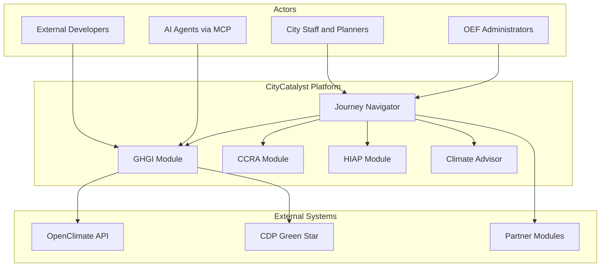

# Business Overview

## Business Context Diagram



### Text Alternative

```
City Users / OEF Admins
        |
        v
  Journey Navigator (4 stages)
        |
   +----+----+----+----+
   |    |    |    |    |
 GHGI CCRA HIAP  CA  Partner Modules
   |              |
   +-> OpenClimate, CDP
```

## Business Description

**CityCatalyst** is an open-source climate journey platform for cities, built by the Open Earth Foundation. It helps municipalities measure greenhouse gas emissions (GPC-compliant), assess climate risk, prioritize high-impact actions, and prepare finance-ready projects — with AI assistance throughout.

The platform organizes tools into four journey stages:

| Stage | Business Activity | Core Modules |
|-------|-------------------|--------------|
| **Assess and Analyze** | Measure emissions, assess climate risk | GHGI, CCRA |
| **Plan** | Prioritize and sequence climate actions | HIAP |
| **Implement** | Turn plans into bankable projects | Partner modules |
| **Monitor, Evaluate and Report** | Track and report progress | Partner modules |

**Data standard:** GPC (Global Protocol for Community-Scale GHG Inventories).

**License:** AGPL v3.

## Business Transactions

| Transaction | Description | Primary Components |
|-------------|-------------|-------------------|
| **City Onboarding** | Create organization, project, city, and first inventory | `app` — UserService, InventoryService |
| **GHGI Data Entry** | Enter activity data, apply emission factors, calculate totals | `app` — ActivityService, CalculationService |
| **Catalogue Sync** | Import GPC catalogue, emission factors, formula values from global data | `app` scripts + `global-api` |
| **Inventory Import/Export** | Import eCRF Excel or PDF; export eCRF, CSV, PDF | `app` — ECRFImportService, CDPService |
| **CCRA Assessment** | Retrieve and display climate risk data for a city | `app` CcraService + `global-api` `/api/v0/ccra/*` |
| **HIAP Prioritization** | Rank climate actions by impact for a city's inventory | `app` HiapService + `hiap` prioritizer |
| **Action Plan Generation** | Create implementation-ready action plans from rankings | `app` ActionPlanService + `hiap` plan-creator |
| **Climate Advisor Chat** | Conversational AI assistance for inventory workflows | `app` chat proxy + `climate-advisor` |
| **Agentic Stationary Energy** | AI-assisted draft entry for stationary energy sector | `app` internal CA routes + `climate-advisor` |
| **OAuth API Access** | Third-party apps access inventories via OAuth 2.0 + PKCE | `app` OAuth routes + `api-demo` |
| **MCP Tool Access** | AI agents query inventories, emissions, cities, action plans | `app` MCP server |
| **Admin Bulk Operations** | Bulk inventory creation, HIAP jobs, catalogue connection | `app` AdminService, cron jobs |

## Business Dictionary

| Term | Meaning |
|------|---------|
| **GPC** | Global Protocol for Community-Scale Greenhouse Gas Emissions |
| **GHGI** | Greenhouse Gas Inventory — a city's emissions profile for a year |
| **Inventory** | A city's emissions dataset for a specific reporting year |
| **Sector / SubSector / SubCategory** | GPC hierarchy for emissions classification |
| **ActivityValue** | Individual emissions data entry (e.g., fuel consumption) |
| **GasValue** | Gas-specific emissions for an activity (CO2, CH4, N2O) |
| **InventoryValue** | Aggregated emissions per sub-category |
| **EmissionsFactor** | Factor converting activity data to emissions |
| **DataSource** | External provider for emission factors or activity data |
| **HIAP** | High Impact Action Prioritization — ranking climate actions |
| **CCRA** | Climate Change Risk Assessment |
| **Locode** | UN/LOCODE city identifier (e.g., "BR RIO") |
| **eCRF** | Electronic Common Reporting Framework (GPC Excel format) |
| **GWP** | Global Warming Potential — converts gases to CO2 equivalent |
| **AR5 / AR6** | IPCC Assessment Report versions for GWP values |
| **Journey Navigator** | In-app module catalog organizing the four journey stages |
| **MEED** | Multi-criteria scoring methodology (experimental, hiap-meed) |

## Component Level Business Descriptions

### app/ (Main Web Application)

- **Purpose:** Primary product surface — UI, REST API, tenancy, and orchestration of all modules.
- **Responsibilities:** User auth, organization/project/city management, GHGI CRUD, CCRA display, HIAP orchestration, chat proxy, OAuth server, MCP server, data sync from global-api.

### global-api/ (Global Data API)

- **Purpose:** Authoritative source for global emissions data, GPC catalogue, city boundaries, climate actions, and CCRA datasets.
- **Responsibilities:** Serve catalogue, emission factors, formula inputs, city context, climate actions, CCRA assessments, climate finance data.

### hiap/ (Action Prioritization Service)

- **Purpose:** ML-based ranking of climate actions and LLM-generated action plans.
- **Responsibilities:** Prioritize actions (XGBoost + heuristics), generate explanations, create action plans via LangChain agents.

### hiap-meed/ (MEED Scoring Engine — Experimental)

- **Purpose:** Alternative multi-criteria action scoring pipeline (MEED+ methodology).
- **Responsibilities:** Synchronous prioritization with configurable scoring blocks; consumes global-api v0+v1 data. **Not integrated into app production flows.**

### climate-advisor/ (Conversational AI)

- **Purpose:** RAG-based climate advisor chat and agentic GHGI assistance.
- **Responsibilities:** Manage chat threads, stream responses (SSE), retrieve inventory context from app, run stationary-energy draft workflows.

### api-demo/ (OAuth Demo Client)

- **Purpose:** Demonstrate OAuth 2.0 + PKCE integration for external developers.
- **Responsibilities:** Static SPA showing authorization code flow against app API.
