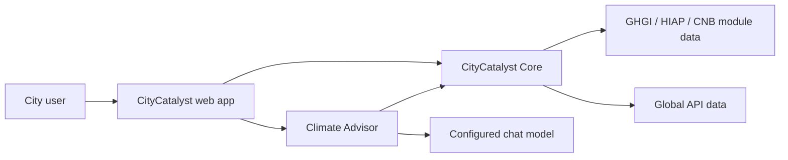

# Business Overview

## Business Context Diagram

```mermaid
flowchart LR
  User["City user"] --> Web["CityCatalyst web app"]
  Web --> Core["CityCatalyst Core"]
  Web --> Advisor["Climate Advisor"]
  Advisor --> Core
  Core --> Modules["GHGI / HIAP / CNB module data"]
  Core --> Global["Global API data"]
  Advisor --> Model["Configured chat model"]
```

Text alternative: A city user interacts with the CityCatalyst web app and Climate Advisor. Climate Advisor requests user-scoped capabilities from CityCatalyst Core. Core delegates to module-owned data such as GHGI, HIAP, or CNB and may use Global API data for shared context. Climate Advisor also calls its configured chat model.

## Business Description

- **Business Description**: CityCatalyst helps cities measure emissions, understand climate risk, prioritize actions, and prepare implementation or finance materials. Climate Advisor is the conversational surface that explains climate context and, in selected workflows, helps users review or prepare bounded changes.
- **CC-737 business objective**: Let Climate Advisor discover durable CityCatalyst-native inputs and generated artifacts through the Core catalog, then use only the source-specific capabilities authorized for the active request.
- **Business Transactions**:
  - City setup and workspace access: maintain cities, projects, organizations, and memberships.
  - GHGI inventory lifecycle: create, import, review, calculate, publish, and summarize an inventory.
  - GHGI source/artifact lifecycle: store uploaded or generated source identities, OCR results, and inventory outputs.
  - HIAP prioritization: rank actions, persist selections, and generate action plans.
  - CNB source lifecycle: upload concept-note documents and prepare source context.
  - Climate Advisor conversation: create threads, load scoped context, invoke read-only or workflow tools, and stream responses.
  - Native input catalog lifecycle: register immutable pointers, withdraw unavailable pointers, and supersede prior versions.
  - **CC-737 target transaction**: discover scoped catalog entries, select a source-specific capability at request time, and read bounded source data through CityCatalyst authorization.
- **Business Dictionary**:
  - **NativeInputCatalog**: Core lookup table containing pointers and scope metadata, not source content or an access grant.
  - **Owning module**: The CityCatalyst module that remains authoritative for the underlying source or generated artifact.
  - **Catalog entry**: An immutable pointer identity with source type/id, scope, availability, and optional readiness/digest metadata.
  - **Capability**: A typed, module-owned operation exposed through an authorized CityCatalyst boundary.
  - **Caller scope**: The authenticated user's applicable user, organization, project, city, and inventory access.
  - **Bounded read**: A summarized or constrained response that exposes only the requested source data and permitted fields.
  - **Unavailable/deleted source**: A catalog pointer whose source is withdrawn, superseded, missing, incomplete, or no longer readable; it must not disclose useful metadata/content to an unauthorized caller.

## Component Level Business Descriptions

### CityCatalyst Core (`app`)

- **Purpose**: Own the primary product APIs, authentication, permissions, database models, and module capability boundaries.
- **Responsibilities**: Enforce user/resource authorization, own the NativeInputCatalog table and lifecycle, keep module systems of record authoritative, and return bounded capability responses.

### Climate Advisor (`climate-advisor/service`)

- **Purpose**: Orchestrate conversational climate assistance and workflow-specific tools.
- **Responsibilities**: Resolve request/thread scope, call CityCatalyst with user-scoped bearer tokens and service authentication, register only request-appropriate tools, and keep storage credentials out of the service.

### GHGI (`app` module boundary)

- **Purpose**: Own greenhouse-gas inventory inputs, imported files, OCR artifacts, calculations, and results.
- **Responsibilities**: Persist authoritative inventory state, register durable catalog pointers, and expose permission-checked bounded inventory capabilities.

### HIAP / HIAP-MEED

- **Purpose**: Prioritize climate actions and generate action-plan or MEED outputs.
- **Responsibilities**: Own their respective schemas and computations. Existing architecture treats them as separate implementations even when both produce reusable structured artifacts.

### CNB (`app` and Climate Advisor context)

- **Purpose**: Manage concept-note uploads and source context.
- **Responsibilities**: Own upload metadata and workflow state; any file/Markdown read remains behind a CityCatalyst boundary.

### Global API

- **Purpose**: Serve shared emissions, risk, and action datasets.
- **Responsibilities**: Provide optional non-city-native context; it is not a NativeInputCatalog owner for CC-737.
