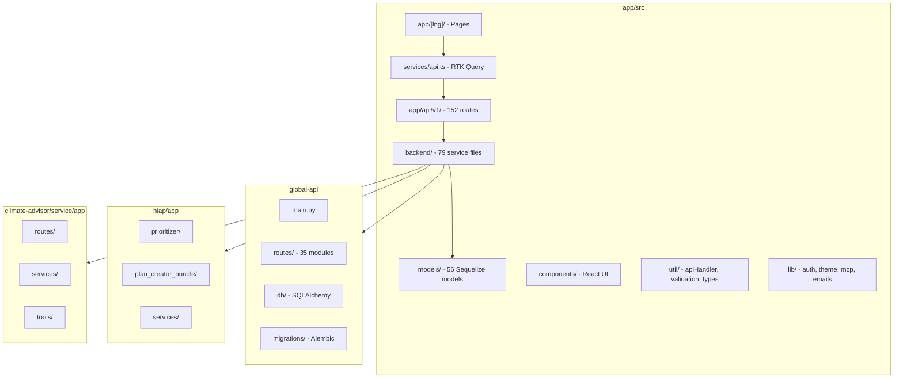

# Code Structure

## Build System

### app/

- **Type:** npm (Node.js `^22.21.1`)
- **Configuration:** `app/package.json`, `app/tsconfig.json`, `app/next.config.ts`
- **Key scripts:** `dev`, `build`, `jest`, `e2e:test`, `db:migrate`, `sync-catalogue`, `openapi:lint`
- **Version:** 1.22.0-dev.0

### Python Services

| Service | Package Manager | Config |
|---------|----------------|--------|
| global-api | pip | `global-api/requirements.txt` |
| hiap | uv | `hiap/pyproject.toml`, `hiap/uv.lock` |
| hiap-meed | uv | `hiap-meed/pyproject.toml` |
| climate-advisor | uv | `climate-advisor/pyproject.toml`, `climate-advisor/uv.lock` |

## Module Hierarchy



## app/ Directory Structure

```
app/src/
├── app/
│   ├── [lng]/              # Locale pages (en, de, es, fr, pt)
│   └── api/v1/             # REST API routes (apiHandler pattern)
├── backend/                # Server-side business logic
│   ├── hiap/               # HIAP orchestration
│   ├── ccra/               # CCRA services
│   ├── chat/               # Climate Advisor proxy
│   ├── llm/                # LLM abstraction
│   ├── permissions/        # Permission system
│   └── agentic/ghgi/       # CA capability endpoints
├── components/             # React components (Chakra UI v3)
├── features/               # Redux slices
├── hooks/                  # Custom React hooks
├── i18n/                   # i18next locales
├── lib/                    # Auth, theme, MCP, emails
├── models/                 # Sequelize ORM models
├── services/               # RTK Query, logger, PDF
└── util/                   # apiHandler, validation, types, feature-flags
```

## Key Files Inventory

### app/ — Critical Entry Points

| File | Purpose |
|------|---------|
| `app/src/util/api.ts` | `apiHandler` — auth, DB init, rate limit, error handling |
| `app/src/lib/auth.ts` | NextAuth credentials provider, JWT session |
| `app/src/middleware.ts` | CORS, i18n, route protection |
| `app/src/services/api.ts` | RTK Query API (~2000 lines, main client data layer) |
| `app/src/models/init-models.ts` | Sequelize model registration and associations |
| `app/src/util/validation.ts` | Zod schemas for API request validation |
| `app/src/util/feature-flags.ts` | Feature flag parsing and checks |
| `app/src/backend/CalculationService.ts` | GHGI emissions calculation engine |
| `app/src/backend/HiapService.ts` | HIAP job orchestration |
| `app/src/backend/hiap/HiapApiService.ts` | HTTP client to hiap service |
| `app/src/backend/chat/climate-advisor.ts` | Proxy to climate-advisor |
| `app/src/lib/mcp/server.ts` | MCP server for AI agent tools |

### global-api/

| File | Purpose |
|------|---------|
| `global-api/main.py` | FastAPI app, router registration |
| `global-api/routes/catalogue_endpoint.py` | GPC catalogue (`/api/v0/catalogue`) |
| `global-api/routes/city_context.py` | City context for HIAP (`/api/v0/city_context`) |
| `global-api/routes/ccra_assessment.py` | CCRA risk data (`/api/v0/ccra/*`) |
| `global-api/routes/ghgi_emissions.py` | Unified GHGI emissions (`/api/v1/source/*`) |
| `global-api/db/database.py` | SQLAlchemy session management |

### hiap/

| File | Purpose |
|------|---------|
| `hiap/app/main.py` | FastAPI app with prioritizer and plan-creator mounts |
| `hiap/app/prioritizer/api.py` | Prioritization endpoints |
| `hiap/app/plan_creator_bundle/plan_creator/api.py` | Plan creation endpoints |
| `hiap/app/services/get_context.py` | global-api city context client |

### climate-advisor/

| File | Purpose |
|------|---------|
| `climate-advisor/service/app/main.py` | FastAPI app |
| `climate-advisor/service/app/services/agent_service.py` | OpenAI Agents SDK lifecycle |
| `climate-advisor/service/app/services/citycatalyst_client.py` | Callback client to app |
| `climate-advisor/llm_config.yaml` | Model and prompt configuration |

### hiap-meed/

| File | Purpose |
|------|---------|
| `hiap-meed/app/main.py` | FastAPI app |
| `hiap-meed/app/modules/prioritizer/orchestrator.py` | MEED scoring pipeline |
| `hiap-meed/app/services/data_clients.py` | global-api v0+v1 clients |

## Design Patterns

### API Handler Wrapper

- **Location:** `app/src/util/api.ts`
- **Purpose:** Centralize cross-cutting concerns for all API routes.
- **Implementation:** Wraps route handlers with auth resolution (session, Bearer JWT, PAT, OAuth, service-to-service), DB initialization, rate limiting (200 req/min), frozen-org check, and unified error handling.

### Service Layer

- **Location:** `app/src/backend/*Service.ts`
- **Purpose:** Separate business logic from HTTP route handlers.
- **Implementation:** 44 top-level services plus subdirectories for hiap, ccra, chat, permissions, agentic.

### Repository / ORM

- **Location:** `app/src/models/`, `global-api/db/`
- **Purpose:** Data persistence abstraction.
- **Implementation:** Sequelize v6 (app) with UUID PKs and custom timestamps (`created`/`lastUpdated`); SQLAlchemy 2 (global-api, climate-advisor).

### Client-Side Data Layer (RTK Query)

- **Location:** `app/src/services/api.ts`
- **Purpose:** Client-side caching, mutations, and tag-based invalidation.
- **Implementation:** `createApi` with ~40 tag types; responses unwrapped via `transformResponse`.

### Request Validation (Zod)

- **Location:** `app/src/util/validation.ts`
- **Purpose:** Schema validation at API boundary.
- **Implementation:** Zod schemas parsed in route handlers; `ZodError` caught by `errorHandler`.

### Proxy Pattern (Climate Advisor)

- **Location:** `app/src/backend/chat/climate-advisor.ts`
- **Purpose:** App proxies CA requests; CA calls back to app for inventory data.
- **Implementation:** Service-to-service auth via `CC_SERVICE_API_KEY` and user JWT exchange.

### Async Job Polling (HIAP)

- **Location:** `app/src/backend/HiapService.ts`, `app/src/app/api/v1/cron/check-hiap-jobs/`
- **Purpose:** Long-running ML jobs with status polling.
- **Implementation:** hiap returns task UUID; app polls progress; K8s CronJob triggers batch checks.

### Provider Pattern (File Upload)

- **Location:** `app/src/backend/FileUploadService.ts`, `S3FileUploadService.ts`
- **Purpose:** Pluggable storage backends.
- **Implementation:** Provider interface with S3 implementation.

### Feature Flags

- **Location:** `app/src/util/feature-flags.ts`
- **Purpose:** Runtime feature toggles without redeployment.
- **Implementation:** `NEXT_PUBLIC_FEATURE_FLAGS` env (comma-separated); QA override via localStorage.

### FastAPI Router Modules

- **Location:** `global-api/routes/`, Python service `app/modules/`
- **Purpose:** Domain-separated API endpoints.
- **Implementation:** Each domain gets its own router file with prefix.

## Critical Dependencies

### app/ (selected)

| Dependency | Version | Usage | Purpose |
|------------|---------|-------|---------|
| next | 15.x | Framework | App Router, API routes, SSR |
| @chakra-ui/react | 3.8.x | UI | Component library |
| sequelize | 6.x | ORM | PostgreSQL data access |
| next-auth | 4.x | Auth | Credentials + JWT sessions |
| @reduxjs/toolkit | 2.x | State | RTK Query data layer |
| zod | — | Validation | Request schema validation |
| @modelcontextprotocol/sdk | 1.25.x | MCP | AI agent tool server |
| @aws-sdk/client-s3 | 3.x | Storage | File uploads |
| pino | — | Logging | Structured server logs |

### global-api/ (selected)

| Dependency | Version | Usage | Purpose |
|------------|---------|-------|---------|
| fastapi | 0.136.x | Framework | REST API |
| SQLAlchemy | 2.0.x | ORM | Database access |
| alembic | 1.18.x | Migrations | Schema versioning |
| geopandas | 0.12-1.2 | GIS | Spatial data processing |
| psycopg2-binary | 2.9.x | Driver | PostgreSQL connection |

### hiap/ (selected)

| Dependency | Usage | Purpose |
|------------|-------|---------|
| xgboost | ML | Action ranking model |
| langchain / langgraph | LLM | Plan creation agents |
| chromadb | Vector store | RAG for action context |

### climate-advisor/ (selected)

| Dependency | Usage | Purpose |
|------------|-------|---------|
| openai-agents | Agent framework | Conversational AI |
| pgvector | Embeddings | RAG vector search |
| sse-starlette | Streaming | SSE message delivery |

## Code Conventions

| Area | Convention | Evidence |
|------|-------------|----------|
| Path alias | `@/` maps to `app/src/` | `app/tsconfig.json` |
| API routes | Must use `apiHandler` | `app/AGENTS.md` |
| DB timestamps | `created` / `lastUpdated` | Sequelize models |
| Migrations | `.cjs` with `up()` and `down()` | `app/migrations/` |
| Unit/API tests | `*.jest.ts` | `app/jest.config.ts` |
| E2E tests | `*.spec.ts` | `app/playwright.config.ts` |
| i18n | Keys in `en/` only; CI translates | `app/AGENTS.md`, `web-translate.yml` |
| Python style | Black formatter | `global-api/requirements.txt` |
| Agent docs | `AGENTS.md` per package | `app/`, `hiap/`, `climate-advisor/`, `hiap-meed/` |
| Semicolons | Yes (Prettier) | `app/package.json` |
| Logging | Pino on server | `@/services/logger` |
