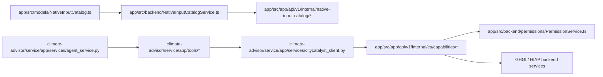

# Code Structure

## Build System

- **Web/Core**: npm, Next.js, TypeScript, Sequelize CLI migrations, Jest, Playwright, ESLint, Prettier, Spectral.
- **Climate Advisor**: uv-managed Python project, FastAPI, pytest, pytest-asyncio, coverage.
- **Other services**: uv-managed Python projects for Global API, HIAP, and HIAP-MEED; Dockerfiles and Kubernetes manifests support deployment.
- **Repository shape**: Monorepo; the application code stays at repository root while AI-DLC artifacts live under `aidlc-docs/`.

## Key Classes/Modules

```mermaid
flowchart LR
  CatalogModel["app/src/models/NativeInputCatalog.ts"] --> CatalogService["app/src/backend/NativeInputCatalogService.ts"]
  CatalogService --> CatalogRoutes["app/src/app/api/v1/internal/native-input-catalog/*"]
  CapabilityRoutes["app/src/app/api/v1/internal/ca/capabilities/*"] --> Permission["app/src/backend/permissions/PermissionService.ts"]
  CapabilityRoutes --> ModuleServices["GHGI / HIAP backend services"]
  AgentService["climate-advisor/service/app/services/agent_service.py"] --> ToolBuilders["climate-advisor/service/app/tools/*"]
  ToolBuilders --> Client["climate-advisor/service/app/services/citycatalyst_client.py"]
  Client --> CapabilityRoutes
```

## Existing Files Inventory

### Primary CC-737 candidates

- `app/src/models/NativeInputCatalog.ts` — Core catalog row model and allowed soft-string values.
- `app/migrations/20260806120000-create-native-input-catalog.cjs` — Catalog table, availability check, indexes, and source-identity uniqueness.
- `app/src/backend/NativeInputCatalogService.ts` — Registration, withdrawal, supersession, scope validation, and producer/service authentication helper.
- `app/src/app/api/v1/internal/native-input-catalog/route.ts` — Internal registration endpoint.
- `app/src/app/api/v1/internal/native-input-catalog/[id]/route.ts` — Internal withdrawal endpoint.
- `app/src/app/api/v1/internal/native-input-catalog/[id]/supersede/route.ts` — Internal supersession endpoint.
- `app/src/app/api/v1/internal/ca/capabilities/*` — Existing CA capability route boundary and authorization patterns.
- `app/src/backend/agentic/ghgi/inventory/registry.ts` — Existing typed capability registry pattern.
- `app/src/backend/agentic/ghgi/inventory/context/*` — Existing bounded GHGI context builders.
- `app/src/backend/agentic/ghgi/stationary-energy/auth.ts` — Existing CA service/request authentication and feature-flag checks.
- `app/src/backend/permissions/PermissionService.ts` — User/resource permission checks.
- `app/tests/agentic-inventory-capabilities.jest.ts` — Authorized/denied GHGI capability contract coverage.
- `app/tests/api/internal-ca-service-auth.jest.ts` — Internal CA service authentication contract coverage.
- `app/tests/native-input-catalog-service.jest.ts` — Catalog lifecycle unit coverage.

### Primary Climate Advisor candidates

- `climate-advisor/service/app/services/agent_service.py` — Request-time model/instruction/tool registration.
- `climate-advisor/service/app/services/citycatalyst_client.py` — Internal capability HTTP client, bearer token refresh, and response handling.
- `climate-advisor/service/app/tools/inventory_context_tools.py` — Bounded capability tool-builder and error serialization pattern.
- `climate-advisor/service/app/tools/cc_inventory_tool.py` and `cc_inventory_wrappers.py` — Existing legacy datasource wrapper path.
- `climate-advisor/service/app/tools/concept_note_source_tools.py` — Persisted source-query tool pattern for a scoped workflow.
- `climate-advisor/service/tests/test_agent_service.py` — Tool registration behavior tests.
- `climate-advisor/service/tests/test_citycatalyst_client.py` — Capability request/response tests.
- `climate-advisor/service/tests/test_citycatalyst_client_auth*.py` — Auth and token contract tests.
- `climate-advisor/service/tests/test_inventory_context_tools.py` — Tool payload, bounded result, and error tests.

### Supporting documentation

- `docs/NativeInputCatalog.md` — Current catalog contract, ownership, lifecycle, and producer mappings.
- `docs/NativeDocumentStorageArchitecture.md` — Core catalog and storage-boundary architecture.
- `docs/AgenticModuleScope.md` — Capability wrapper and request-time tool-pack direction.
- `climate-advisor/docs/architecture.md` — Current Climate Advisor modes and registration rules.
- `docs/ConceptNoteBuilderArchitecture.md` — Existing source/context-bundle boundary.

## Design Patterns

### Internal service authentication plus user authorization

- **Location**: Core CA capability routes and Climate Advisor client.
- **Purpose**: Separate service identity from the end-user's resource authorization.
- **Implementation**: `X-Service-Name`/`X-Service-Key` authenticate the service; a user-scoped bearer token is converted into the app session and checked by `PermissionService`.

### Typed capability registry

- **Location**: `app/src/backend/agentic/ghgi/*/registry.ts`.
- **Purpose**: Describe capability IDs, operation type, resource scope, transport, and schemas in one place.
- **Implementation**: Zod input/output schemas and route metadata are defined beside the module capability.

### Request-time tool builders

- **Location**: `AgentService.create_agent()` and `build_*_tools()` modules.
- **Purpose**: Keep workflow-specific tools out of unrelated requests.
- **Implementation**: AgentService checks token, user, thread, workflow/run context, and feature state before building tools; builders close short-lived clients and share refreshed token references.

### Core-owned source of truth with catalog pointer

- **Location**: NativeInputCatalog and GHGI/HIAP producer adapters.
- **Purpose**: Provide discovery without copying data or moving storage ownership.
- **Implementation**: Catalog rows store source type/id and scope; module tables/files remain authoritative.

### Bounded context payloads

- **Location**: GHGI inventory context builders, Stationary Energy loaders, CNB context tools.
- **Purpose**: Keep model/tool inputs small and task-specific.
- **Implementation**: Capability routes summarize or constrain returned fields and reject invalid scope combinations.

## Critical Dependencies

- **Sequelize 6 / sequelize-cli** — Core models and migrations.
- **Next.js 16 / TypeScript 6** — Core API route runtime and type checking.
- **FastAPI 0.135 / Python 3.11–3.12** — Climate Advisor HTTP service.
- **OpenAI Agents SDK 0.17** — Climate Advisor agent and `function_tool` runtime.
- **httpx 0.28** — Climate Advisor async Core client.
- **Pydantic 2.12 / SQLAlchemy 2.0** — Climate Advisor contracts and persistence.
- **Jest 30 / Playwright 1.61 / pytest 9** — Existing test and integration tooling.
