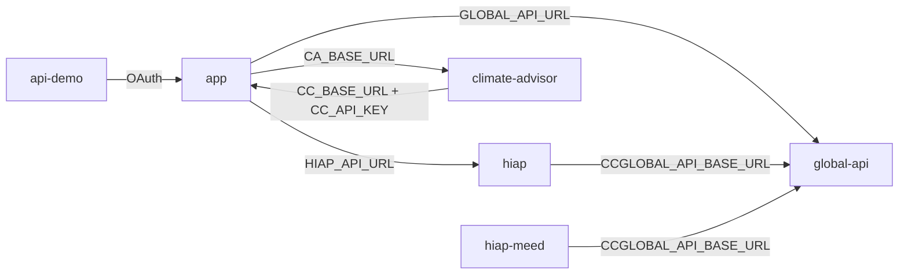

# Dependencies

## Internal Package Dependency Graph



### Text Alternative

```
app -> global-api, hiap, climate-advisor
climate-advisor -> app (callback)
hiap -> global-api
hiap-meed -> global-api (not connected to app)
api-demo -> app (OAuth only)
```

## Internal Dependencies

### app depends on global-api

- **Type:** Runtime HTTP
- **Env:** `GLOBAL_API_URL`
- **Clients:** `GlobalAPIService.ts`, `CityBoundaryService.ts`, `CcraApiService.ts`
- **Reason:** GPC catalogue sync, city boundaries, CCRA data, emissions forecast, climate actions

### app depends on hiap

- **Type:** Runtime HTTP
- **Env:** `HIAP_API_URL`
- **Client:** `HiapApiService.ts`
- **Reason:** Action prioritization and plan generation

### app depends on climate-advisor

- **Type:** Runtime HTTP (proxy) + reverse callback
- **Env:** `CA_BASE_URL`, `CC_SERVICE_API_KEY`
- **Clients:** `chat/climate-advisor.ts`, `climate-advisor-connection.ts`
- **Reason:** Chat threads, SSE streaming, agentic GHGI workflows

### climate-advisor depends on app

- **Type:** Runtime HTTP (callback)
- **Env:** `CC_BASE_URL`, `CC_API_KEY`
- **Client:** `citycatalyst_client.py`
- **Reason:** User JWT exchange, inventory context, stationary-energy commit

### hiap depends on global-api

- **Type:** Runtime HTTP
- **Env:** `CCGLOBAL_API_BASE_URL`
- **Clients:** `get_context.py`, `get_actions.py`, `get_ccra.py`
- **Reason:** City context, climate actions catalog, CCRA risk data for ranking

### hiap-meed depends on global-api

- **Type:** Runtime HTTP
- **Env:** `CCGLOBAL_API_BASE_URL`
- **Clients:** `data_clients.py` (7 API clients)
- **Reason:** City attributes, action pathways, policy scores, feasibility, legal assessments

### hiap-meed does NOT depend on app

- **Note:** Deployed independently; no references in app codebase. Experimental parallel to hiap.

### api-demo depends on app

- **Type:** Runtime HTTP (OAuth)
- **Reason:** Demonstrates OAuth 2.0 + PKCE authorization flow

## External Dependencies (Key)

### app/

| Dependency | Version | Purpose | License |
|------------|---------|---------|---------|
| next | 15.x | Web framework | MIT |
| sequelize | 6.x | ORM | MIT |
| next-auth | 4.x | Authentication | ISC |
| @chakra-ui/react | 3.8.x | UI components | MIT |
| @reduxjs/toolkit | 2.x | State management | MIT |
| @aws-sdk/client-s3 | 3.x | Cloud storage | Apache-2.0 |
| @modelcontextprotocol/sdk | 1.25.x | MCP protocol | MIT |
| zod | — | Validation | MIT |
| bcrypt | 6.x | Password hashing | MIT |
| openai | — | LLM (import interpretation) | Apache-2.0 |

### global-api/

| Dependency | Version | Purpose | License |
|------------|---------|---------|---------|
| fastapi | 0.136.x | API framework | MIT |
| SQLAlchemy | 2.0.x | ORM | MIT |
| geopandas | 0.12-1.2 | GIS | BSD |
| psycopg2-binary | 2.9.x | PostgreSQL driver | LGPL |
| pandas | 3.0.x | Data processing | BSD |
| openclimate | 0.1.x | Climate data | — |

### hiap/

| Dependency | Purpose | License |
|------------|---------|---------|
| xgboost | ML ranking | Apache-2.0 |
| langchain | LLM agents | MIT |
| chromadb | Vector store | Apache-2.0 |
| boto3 | AWS S3 | Apache-2.0 |

### climate-advisor/

| Dependency | Purpose | License |
|------------|---------|---------|
| openai-agents | Agent framework | Apache-2.0 |
| pgvector | Vector search | PostgreSQL License |
| sse-starlette | SSE streaming | MIT |
| mlflow | Experiment tracking | Apache-2.0 |

## Infrastructure Dependencies

| Service | Used By | Purpose |
|---------|---------|---------|
| PostgreSQL | app, global-api, climate-advisor | Primary data store |
| PostGIS | global-api | Spatial queries |
| AWS S3 | app, hiap, hiap-meed | File storage |
| AWS EKS | All services | Container orchestration |
| GitHub Container Registry | CI/CD | Docker images |
| OpenAI API | hiap, climate-advisor, app (LLM features) | LLM inference |
| OpenRouter | climate-advisor | Alternative LLM provider |
| OpenClimate API | app | Actor hierarchy, country emissions |
| CDP API | app | Green Star reporting |
| Highlight.io | app (optional) | Error monitoring |
| PostHog | app (optional) | Analytics |

## Data Sync Dependencies

| Script | Source | Target | Trigger |
|--------|--------|--------|---------|
| `sync-catalogue` | global-api `/api/v0/catalogue` | app DB (Catalogue, Sector, etc.) | Manual / CronJob |
| `sync-emissions-factors` | global-api `/api/v0/emissions_factor/*` | app DB (EmissionsFactor) | Manual |
| `sync-formula-values` | global-api `/api/v0/formula_input/*` | app DB (FormulaInput) | Manual |

K8s CronJob: `k8s/cc-sync-catalogue.yml` automates catalogue sync in deployed environments.

## Versioning Notes

- **global-api:** Mixed `/api/v0` (legacy/catalogue) and `/api/v1` (modern) endpoints coexist. App predominantly consumes v0.
- **hiap:** `/prioritizer/v1` and `/plan-creator/v1` are current; `/plan-creator-legacy` is deprecated.
- **app API:** All public routes under `/api/v1`.
