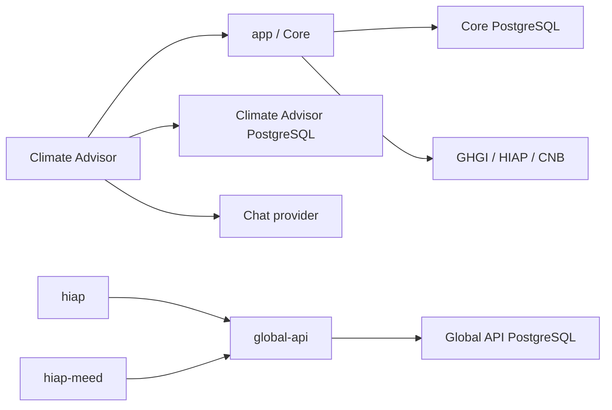

# Dependencies

## Internal Dependencies

```mermaid
flowchart LR
  App["app / Core"] --> DB["Core PostgreSQL"]
  App --> Modules["GHGI / HIAP / CNB"]
  CA["Climate Advisor"] --> App
  CA --> CADB["Climate Advisor PostgreSQL"]
  CA --> LLM["Chat provider"]
  Global["global-api"] --> GlobalDB["Global API PostgreSQL"]
  HIAP["hiap"] --> Global
  MEED["hiap-meed"] --> Global
```

Text alternative: Core owns the primary product database and module boundaries. Climate Advisor depends on Core's internal API and its own PostgreSQL database, and also depends on a configured chat provider. HIAP and HIAP-MEED use Global API context where configured. This task's affected dependency edge is Climate Advisor → Core capability boundary, with NativeInputCatalog participating in Core discovery.

### Climate Advisor depends on CityCatalyst Core

- **Type**: Runtime HTTP.
- **Reason**: User identity validation, token refresh, inventory/context reads, workflow capability calls, and future catalog/source capability calls.
- **Constraint**: Calls must carry the authenticated user's scope and use bounded capability contracts.

### Core capability routes depend on PermissionService

- **Type**: Runtime application.
- **Reason**: Convert the user-scoped bearer token into permission-checked access to city, project, organization, or inventory resources.
- **Constraint**: Service authentication alone cannot authorize resource access.

### NativeInputCatalog depends on producer adapters and Core persistence

- **Type**: Runtime application/database.
- **Reason**: Producers register durable source pointers while source-of-truth data remains in their own tables/files.
- **Constraint**: Catalog rows do not copy content or grant storage access.

### Climate Advisor tools depend on `CityCatalystClient`

- **Type**: Compile/runtime Python module.
- **Reason**: Centralize headers, timeouts, token refresh, HTTP error mapping, and bounded response parsing.

## External Dependencies

### PostgreSQL

- **Version**: Environment-managed.
- **Purpose**: Core models and Climate Advisor conversations/workflows.
- **License**: Not audited in this reverse-engineering pass.

### AWS S3

- **Version**: Service-managed.
- **Purpose**: Existing module-owned file/artifact storage.
- **License**: Not audited in this reverse-engineering pass.
- **CC-737 boundary**: Climate Advisor must not receive S3 credentials or bypass Core/module capability routes.

### OpenAI-compatible model provider

- **Version**: Provider/model configuration.
- **Purpose**: Agent completion and tool orchestration.
- **License**: Provider-managed; not audited here.

### FastAPI / Next.js / Agents SDK / httpx / Sequelize

- **Version**: See `technology-stack.md` and package manifests.
- **Purpose**: HTTP applications, agent runtime, client transport, ORM, and migrations.
- **License**: Not audited in this reverse-engineering pass.
