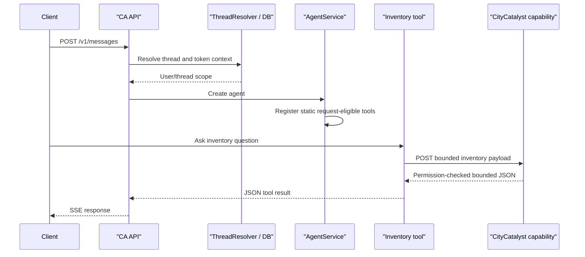
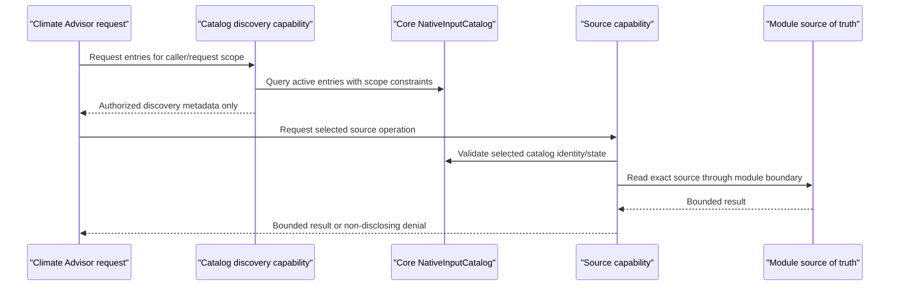

# Interaction Diagrams

These diagrams record current interactions and the CC-737 gap. They do not authorize implementation choices.

## Current general Climate Advisor request

## CC-737 target interaction to be designed in Inception

Text alternative: Climate Advisor would first receive only catalog metadata permitted for the caller and active request. A later tool call would identify a selected entry, but Core would revalidate catalog state, caller scope, and source authorization before reading the module-owned source. The diagram intentionally leaves route names and selection semantics open for Requirements Analysis/Application Design.

## Security boundary summary

1. Climate Advisor authenticates to Core as a service.
2. The user bearer token supplies resource identity for permission checks.
3. Catalog metadata is filtered before discovery response.
4. Every selected source read is independently authorized and bounded.
5. Storage credentials and raw storage paths remain inside Core/module ownership.
