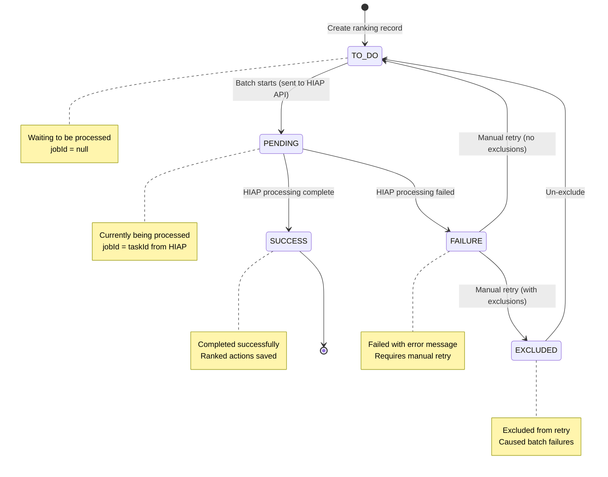

# Bulk HIAP Prioritization API

Complete documentation for the bulk High Impact Actions prioritization system.

---

## Table of Contents

- [Quick Start](#quick-start)
- [Overview](#overview)
- [Single vs Bulk Job Distinction (isBulk Flag)](#single-vs-bulk-job-distinction-isbulk-flag)
- [Architecture](#architecture)
- [API Endpoints](#api-endpoints)
  - [Start Bulk Prioritization](#1-start-bulk-prioritization)
  - [Get Batch Status](#2-get-batch-status)
  - [Retry Failed Batches (with Optional Exclusions)](#3-retry-failed-batches-with-optional-exclusions)
  - [Un-exclude Cities](#4-un-exclude-cities)
- [How It Works](#how-it-works)
- [Status Lifecycle](#status-lifecycle)
- [Retry Functionality](#retry-functionality)
- [Excluding Problematic Cities](#excluding-problematic-cities)
- [Multi-Project Processing](#multi-project-processing)
- [Error Handling](#error-handling)
- [Security](#security)
- [Local Development](#local-development)
- [Troubleshooting](#troubleshooting)
- [Related Files](#related-files)

---

## Quick Start

```bash
# Start bulk prioritization for a project
curl -X POST http://localhost:3000/api/v1/admin/bulk-hiap-prioritization \
  -H "Content-Type: application/json" \
  -d '{
    "projectId": "your-project-id",
    "year": 2024,
    "actionType": "mitigation",
    "languages": ["en", "pt"]
  }'

# Response (returns immediately in ~1-2 seconds)
{
  "totalCities": 5000,
  "firstBatchSize": 100,
  "message": "First batch started. Cron job will process remaining batches automatically."
}

# Check batch status
curl http://localhost:3000/api/v1/admin/bulk-hiap-prioritization?projectId=...&actionType=mitigation

# Retry failed cities
curl -X PATCH http://localhost:3000/api/v1/admin/bulk-hiap-prioritization \
  -H "Content-Type: application/json" \
  -d '{"projectId": "...", "actionType": "mitigation"}'

# Retry failed cities, excluding problematic ones
curl -X PATCH http://localhost:3000/api/v1/admin/bulk-hiap-prioritization \
  -H "Content-Type: application/json" \
  -d '{
    "projectId": "...",
    "actionType": "mitigation",
    "excludedCityLocodes": ["US-NYC", "BR-SAO"]
  }'

# Un-exclude cities to retry them again
curl -X PUT http://localhost:3000/api/v1/admin/bulk-hiap-prioritization \
  -H "Content-Type: application/json" \
  -d '{
    "projectId": "...",
    "actionType": "mitigation",
    "cityLocodes": ["US-NYC"]
  }'
```

---

## Overview

This system handles large-scale HIAP (High Impact Actions) prioritization for **thousands of cities** using a **cron-based architecture**.

### Key Features

✅ **Fast API Response**: Returns immediately (~1-2 seconds), doesn't block  
✅ **Background Processing**: Kubernetes CronJob handles long-running work  
✅ **Batch Processing**: Processes cities in chunks (default: 100 per batch)  
✅ **Global Sequential**: Only 1 batch runs at a time (HIAP API constraint)  
✅ **Automatic Retry Flow**: Manual retry resets failures, cron picks them up  
✅ **Multi-Project Support**: FIFO fairness across multiple projects  
✅ **Multi-Language**: Processes actions in multiple languages per city  
✅ **Resilient**: Handles failures gracefully with detailed error messages  

### Key Architecture Decision

Uses **Kubernetes CronJob** (runs every minute) instead of a traditional background job queue.

**Why?**
- ✅ No complex queue infrastructure needed
- ✅ Stateless: survives pod restarts
- ✅ Simple to monitor and debug
- ✅ Kubernetes-native solution

---

## Single vs Bulk Job Distinction (isBulk Flag)

The system distinguishes between **single-city** and **bulk** HIAP prioritization jobs using the `is_bulk` flag in the `HighImpactActionRanking` table. This ensures the cron job uses the correct HIAP API endpoints.

### Problem

Previously, the cron job always called bulk API endpoints even for single-city rankings, which could cause issues.

### Solution

Added a boolean `is_bulk` field to track whether a ranking is part of a bulk job or a single-city job.

### API Endpoint Mapping

| Job Type | Cron Calls | Status Check Endpoint | Result Fetch Endpoint |
|----------|-----------|----------------------|----------------------|
| **Bulk** (`isBulk = true`) | `checkBulkActionRankingJob()` | `checkBulkPrioritizationProgress(jobId)` | `getBulkPrioritizationResult(jobId)` |
| **Single** (`isBulk = false`) | `checkSingleActionRankingJob()` | `checkPrioritizationProgress(jobId)` | `getPrioritizationResult(jobId)` |

**Architecture:**
- Cron job queries `is_bulk` flag and routes to appropriate handler function
- Each handler function uses its specific HIAP API endpoints
- Both handlers share common processing logic via `processBulkJobResults()`

### Database Schema

**Column:** `is_bulk` BOOLEAN
- Default value: `false`
- NOT NULL constraint
- Set automatically when creating ranking records

### Backfill Logic

Existing rankings are backfilled with this heuristic:
```sql
UPDATE "HighImpactActionRanking" har
SET is_bulk = true
WHERE har.job_id IN (
  SELECT job_id
  FROM "HighImpactActionRanking"
  WHERE job_id IS NOT NULL
  GROUP BY job_id
  HAVING COUNT(*) > 1  -- More than 1 ranking = bulk job
);
```

**Logic:**
- If 2+ cities share the same `job_id` → Bulk job (`is_bulk = true`)
- If only 1 city has the `job_id` → Single job (`is_bulk = false`)

### Implementation Notes

**Cron Job** (`/api/cron/check-hiap-jobs`):
- Queries `is_bulk` field when fetching pending jobs
- Routes to `checkBulkActionRankingJob()` or `checkSingleActionRankingJob()` based on flag

**Service Layer** (`HiapService.ts`):
- Both functions check job status and fetch results using their respective endpoints
- Both save results using shared `processBulkJobResults()` logic
- `isBulk` is set when creating ranking records:
  - Single city: `isBulk: false`
  - Bulk: `isBulk: true`

---

## Architecture

### High-Level Flow


### Cron Job Logic

Every minute, the cron job (`/api/cron/check-hiap-jobs`) does:

1. **Check PENDING jobs** - Poll HIAP API for completion
2. **Process completed jobs** - Save results, mark SUCCESS/FAILURE
3. **Start next batch** - If NO PENDING jobs exist anywhere:
   - Find ONE project with TO_DO rankings (oldest first, FIFO)
   - Start ONE batch (100 cities: TO_DO → PENDING)

---

## API Endpoints

### 1. Start Bulk Prioritization

**Endpoint:** `POST /api/v1/admin/bulk-hiap-prioritization`

**Purpose:** Start bulk HIAP prioritization for all cities in a project

**Request:**
```json
{
  "projectId": "uuid",
  "year": 2024,
  "actionType": "mitigation",  // or "adaptation"
  "languages": ["en", "pt"]     // Languages for climate actions
}
```

**Response (200 OK):**
```json
{
  "totalCities": 5000,
  "firstBatchSize": 100,
  "message": "First batch started. Cron job will process remaining batches automatically."
}
```

**What It Does:**
1. Fetches all cities with inventories for the specified year
2. Creates `HighImpactActionRanking` records (status: `TO_DO`)
3. Starts ONLY the first batch (100 cities)
4. Returns immediately (~1-2 seconds)
5. Remaining batches processed by cron job

**Errors:**
- `400`: Missing/invalid parameters
- `401`: Not authenticated
- `403`: Not an admin
- `404`: Project not found or no inventories for year

---

### 2. Get Batch Status

**Endpoint:** `GET /api/v1/admin/bulk-hiap-prioritization/status`

**Purpose:** Get detailed status of all batches for a project

**Query Parameters:**
- `projectId` (required): UUID of project
- `actionType` (required): `mitigation` or `adaptation`

**Response (200 OK):**
```json
{
  "batches": [
    {
      "jobId": "abc123",
      "status": "SUCCESS",
      "cityCount": 100,
      "cities": [
        {
          "inventoryId": "uuid",
          "locode": "US-IL-CHI",
          "status": "SUCCESS",
          "errorMessage": null
        },
        ...
      ]
    },
    {
      "jobId": "def456",
      "status": "PENDING",
      "cityCount": 100,
      "cities": [...]
    },
    {
      "jobId": "ghi789",
      "status": "FAILURE",
      "cityCount": 95,
      "cities": [
        {
          "inventoryId": "uuid",
          "locode": "US-CA-LA",
          "status": "FAILURE",
          "errorMessage": "Failed to fetch context data"
        },
        ...
      ]
    },
    {
      "jobId": null,
      "status": "TO_DO",
      "cityCount": 4800,
      "cities": [...]
    }
  ]
}
```

**Batch Status Values:**
- `SUCCESS`: All cities in batch completed successfully
- `PENDING`: Batch is currently being processed by HIAP API
- `FAILURE`: At least one city in batch failed
- `TO_DO`: Batch hasn't been started yet
- `EXCLUDED`: City excluded from retry (causes batch failures)

---

### 3. Retry Failed Batches (with Optional Exclusions)

**Endpoint:** `PATCH /api/v1/admin/bulk-hiap-prioritization`

**Purpose:** Reset failed rankings to allow reprocessing, optionally excluding problematic cities

**Request:**
```json
{
  "projectId": "uuid",
  "actionType": "mitigation",
  "jobIds": ["abc123", "def456"],  // Optional: specific batches to retry
  "excludedCityLocodes": ["US-NYC", "BR-SAO"]  // Optional: cities to exclude
}
```

**Parameters:**
- `projectId` (required): Project UUID
- `actionType` (required): `mitigation` or `adaptation`
- `jobIds` (optional): Specific batches to retry. Omit to retry ALL failed cities
- `excludedCityLocodes` (optional): City locodes to exclude from retry

**Response (200 OK):**
```json
{
  "retriedCount": 148,  // Cities reset to TO_DO
  "excludedCount": 2    // Cities marked as EXCLUDED
}
```

**What It Does:**
1. Finds rankings with `status = FAILURE` (optionally filtered by jobIds)
2. For cities in `excludedCityLocodes`: `FAILURE` → `EXCLUDED`, stores reason
3. For remaining cities: `FAILURE` → `TO_DO`, clears `jobId` and `errorMessage`
4. Cron job will automatically pick up TO_DO rankings on next run
5. EXCLUDED cities won't be retried (prevents problematic cities from failing entire batches)

**Why Exclude Cities?**

The HIAP API doesn't handle partial failures well - if one city fails, the entire batch fails. Use `excludedCityLocodes` to skip cities that consistently cause batch failures (e.g., missing data, invalid context).

**Errors:**
- `400`: Missing required parameters
- `401`: Not authenticated
- `403`: Not an admin

---

### 4. Un-exclude Cities

**Endpoint:** `PUT /api/v1/admin/bulk-hiap-prioritization`

**Purpose:** Move excluded cities back to TO_DO for retry

**Request:**
```json
{
  "projectId": "uuid",
  "actionType": "mitigation",
  "cityLocodes": ["US-NYC", "BR-SAO"]  // Cities to un-exclude
}
```

**Response (200 OK):**
```json
{
  "unexcludedCount": 2
}
```

**What It Does:**
1. Finds rankings with `status = EXCLUDED` matching the city locodes
2. Updates: `EXCLUDED` → `TO_DO`, clears `errorMessage`
3. Cron job will pick them up on next run

**Errors:**
- `400`: Missing required parameters or empty cityLocodes array
- `401`: Not authenticated
- `403`: Not an admin

---

## How It Works

### Phase 1: Initial Request

**Endpoint:** `POST /api/v1/admin/bulk-hiap-prioritization`

1. **Fetch cities** with inventories for the specified year (e.g., 5000 cities)
2. **Create ranking records** for ALL cities:
   - Status: `TO_DO`
   - JobId: `null`
   - All 5000 records created at once
3. **Process ONLY the first batch** (100 cities):
   - Update: `TO_DO` → `PENDING`
   - Send to HIAP API
   - Get `taskId`, update records
4. **Return immediately** to user with summary

**Result:** API responds in ~1-2 seconds. User doesn't wait for completion.

---

### Phase 2: Cron-Based Processing

**Cron Job:** Runs every minute via `/api/cron/check-hiap-jobs`

#### Every Minute, the Cron Does:

**Step 1: Check PENDING Jobs**
- Query for all rankings with `status = PENDING`
- Get unique `jobId`s
- For each job:
  - Call HIAP API: `GET /check_progress/{taskId}`
  - If `"pending"`: Do nothing, check again next minute
  - If `"completed"`: Go to Step 2
  - If `"failed"`: Mark all as `FAILURE`, log error

**Step 2: Process Completed Jobs**
- Fetch results from HIAP API: `GET /get_prioritization_bulk/{taskId}`
- Save ranked actions to `HighImpactActionRanked` table
- Update rankings: `PENDING` → `SUCCESS`

**Step 3: Start Next Batch** (if NO PENDING jobs exist anywhere)
- **Critical**: Only runs if `pendingJobs.length === 0`
- Query for projects with `TO_DO` rankings
- Select ONE project (oldest `created` timestamp, FIFO)
- Start ONE batch (100 TO_DO → PENDING)
- Send to HIAP API

**Repeat** until no more TO_DO rankings exist.

---

### Timing Example

```
Minute 0:  Admin clicks "Start" → Batch 1 starts (100 cities)
           Database: 100 PENDING, 4900 TO_DO

Minute 1:  Cron checks → Batch 1 still pending
           No action taken

Minute 5:  Cron checks → Batch 1 complete!
           Saves results → 100 SUCCESS
           No PENDING jobs exist → Starts Batch 2
           Database: 100 SUCCESS, 100 PENDING, 4800 TO_DO

Minute 6:  Cron checks → Batch 2 still pending
           PENDING exists → Skip Step 3

Minute 11: Cron checks → Batch 2 complete!
           Saves results → 100 SUCCESS
           No PENDING jobs → Starts Batch 3
           Database: 200 SUCCESS, 100 PENDING, 4700 TO_DO

... continues until all complete
```

**Performance Impact:**
- ~1 minute gap between batches
- For 50 batches: adds ~50 minutes total
- For processes running hours: 1-2% overhead
- Acceptable trade-off for simplicity

---

## Status Lifecycle



---

## Retry Functionality

### UI Overview

The admin UI shows batches in an accordion with retry options:

```
┌─────────────────────────────────────────────────────────────┐
│  HIAP Prioritization Batches    [Retry All Failed Cities]  │
├─────────────────────────────────────────────────────────────┤
│  ☐ Batch 1  abc123  SUCCESS   100 cities                   │
│  ☐ Batch 2  def456  PENDING   100 cities                   │
│  ☑ Batch 3  ghi789  FAILURE    95 cities     [Selected]    │
│  ☐ TO_DO    -       TO_DO     4805 cities                   │
└─────────────────────────────────────────────────────────────┘

When batches selected:
┌─────────────────────────────────────────────────────────────┐
│  2 selected  [Deselect All]  [Retry Selected]              │
└─────────────────────────────────────────────────────────────┘
```

### Retry Options

**1. Retry All Failed Cities**
- Button at top right (only visible if any failures exist)
- Retries ALL failed cities across all batches
- Request: `{ projectId, actionType }` (no jobIds)

**2. Retry Selected Batches**
- Select specific batches with checkboxes
- Click "Retry Selected"
- Request: `{ projectId, actionType, jobIds: ["abc", "def"] }`

**3. Retry Individual Batch**
- Expand batch accordion
- Click "Retry This Batch" inside
- Request: `{ projectId, actionType, jobIds: ["abc"] }`

### Database State Changes

**Before Retry:**
```sql
SELECT status, COUNT(*) 
FROM "HighImpactActionRanking" 
GROUP BY status;

 status  │ count
─────────┼───────
 SUCCESS │ 4500
 PENDING │  100
 FAILURE │  200  ← Will be retried
 TO_DO   │  200
```

**After Retry:**
```sql
 status  │ count
─────────┼───────
 SUCCESS │ 4500
 PENDING │  100  (unchanged)
 FAILURE │    0  ✅ All reset!
 TO_DO   │  400  (200 original + 200 retried)
```

**Next Cron Run:**
- Finds TO_DO rankings with no PENDING
- Starts next batch (100 of the 400 TO_DO)
- Retried cities get reprocessed automatically

---

## Excluding Problematic Cities

### The Problem

The HIAP API doesn't handle **partial failures** well. If one city in a batch fails (e.g., missing data, invalid context), the **entire batch** fails. This means 99 working cities get marked as FAILURE because of 1 problematic city.

### The Solution: City Exclusion

Exclude problematic cities from retry so the rest of the batch can proceed:

```json
{
  "projectId": "uuid",
  "actionType": "mitigation",
  "jobIds": ["failed-batch-id"],
  "excludedCityLocodes": ["US-NYC"]  // ← Exclude this problematic city
}
```

### How It Works

**Step 1: Identify Problematic City**
- Batch fails with error: "City US-NYC has insufficient emissions data"
- You identify US-NYC as the cause

**Step 2: Exclude and Retry**
```bash
curl -X PATCH /api/v1/admin/bulk-hiap-prioritization \
  -d '{
    "projectId": "...",
    "actionType": "mitigation",
    "jobIds": ["failed-batch-id"],
    "excludedCityLocodes": ["US-NYC"]
  }'
```

**Response:**
```json
{
  "retriedCount": 99,    // 99 cities reset to TO_DO
  "excludedCount": 1     // US-NYC marked as EXCLUDED
}
```

**Step 3: Database State**
```sql
-- Before:
US-NYC:  status=FAILURE, error_message="insufficient data"
US-CHI:  status=FAILURE  (collateral damage)
US-LA:   status=FAILURE  (collateral damage)
... 97 more cities: FAILURE

-- After:
US-NYC:  status=EXCLUDED, error_message="City excluded from retry - caused batch failure"
US-CHI:  status=TO_DO    ✅ Ready to retry
US-LA:   status=TO_DO    ✅ Ready to retry
... 97 more cities: TO_DO
```

**Step 4: Cron Reprocesses**
- Cron picks up the 99 TO_DO cities
- Batch succeeds (no problematic city)
- All 99 → SUCCESS

### UI Features

The admin UI provides checkboxes for excluding cities:

```
┌─ Batch 3: FAILURE (100 cities) ────────────────────────┐
│                                                         │
│  [Retry This Batch]                                    │
│                                                         │
│  🚫 Exclude | City LOCODE | Status  | Message         │
│  ├──────────┼─────────────┼─────────┼─────────────────│
│  │ ☐        │ US-NYC      │ FAILURE │ Insufficient... │
│  │ ☐        │ US-CHI      │ FAILURE │ Batch failed    │
│  │ ☐        │ US-LA       │ FAILURE │ Batch failed    │
│                                                         │
│  ⚠️  1 city will be excluded: US-NYC                   │
│     [Clear exclusions]                                  │
└─────────────────────────────────────────────────────────┘
```

**Workflow:**
1. Expand failed batch
2. Check boxes in "🚫 Exclude" column for problematic cities
3. Orange banner shows excluded cities
4. Click "Retry This Batch"
5. Excluded cities → EXCLUDED, others → TO_DO

### Un-excluding Cities

If you fix the underlying issue (e.g., add missing data), move cities back to TO_DO:

```bash
curl -X PUT /api/v1/admin/bulk-hiap-prioritization \
  -d '{
    "projectId": "...",
    "actionType": "mitigation",
    "cityLocodes": ["US-NYC"]
  }'
```

**Result:**
```
US-NYC: status=EXCLUDED → status=TO_DO, error_message=NULL
```

The UI also provides an "Un-exclude X cities" button in batches with excluded cities.

### When to Use Exclusions

✅ **Use when:**
- One city consistently fails batches
- Missing/corrupt data for specific city
- Invalid city context (wrong locode, missing location data)
- City causes HIAP API errors

❌ **Don't use when:**
- Entire batch fails (likely HIAP API issue, not city-specific)
- Temporary network errors (just retry without exclusions)
- First failure (give it another try first)

### EXCLUDED Status

Cities with `status = EXCLUDED`:
- **Won't be picked up** by cron for processing
- **Show in orange** in the UI
- **Can be un-excluded** to move back to TO_DO
- **Store reason** in `error_message` field

---

## Multi-Project Processing

### Network-Level Protection

The cron endpoint `/api/cron/check-hiap-jobs` is **blocked at the ingress level**.

**Ingress Configuration** (`k8s/cc-ingress.yml`):
```yaml
metadata:
  annotations:
    nginx.ingress.kubernetes.io/server-snippet: |
      location ~ /api/cron/ {
        deny all;
        return 403;
      }
```

**Result:**
- ✅ External requests to `/api/cron/*` → 403 Forbidden
- ✅ Internal Kubernetes services can call it
- ✅ No application-level authentication needed

### Authentication for Public Endpoints

User-facing endpoints (`POST`, `GET`, `PATCH`) require:
- Valid session (authenticated user)
- Admin role

---

## Local Development

### Start Development Server

```bash
cd app
npm run dev
```

### Trigger Bulk Prioritization

```bash
curl -X POST http://localhost:3000/api/v1/admin/bulk-hiap-prioritization \
  -H "Content-Type: application/json" \
  -H "Cookie: your-auth-cookie" \
  -d '{
    "projectId": "your-project-id",
    "year": 2024,
    "actionType": "mitigation",
    "languages": ["en"]
  }'
```

### Manually Trigger Cron (Local Testing)

```bash
# Simple GET request
curl http://localhost:3000/api/cron/check-hiap-jobs

# With formatted JSON output
curl -s http://localhost:3000/api/cron/check-hiap-jobs | jq

# Example response
{
  "checkedJobs": 2,
  "completedJobs": 1,
  "startedBatches": 1,
  "durationMs": 1250
}
```

**In production**, this endpoint is called automatically by Kubernetes CronJob every minute.

### Monitor Progress

**Terminal 1: Watch database**
```bash
watch -n 5 'psql $DATABASE_URL -c "
  SELECT status, COUNT(*) 
  FROM \"HighImpactActionRanking\" 
  WHERE type = '\''mitigation'\'' 
  GROUP BY status;
"'
```

**Terminal 2: Simulate cron**
```bash
# Call cron every 30 seconds for testing
while true; do
  echo "=== $(date) ==="
  curl -s http://localhost:3000/api/cron/check-hiap-jobs | jq
  sleep 30
done
```

**Terminal 3: Check batch status**
```bash
curl "http://localhost:3000/api/v1/admin/bulk-hiap-prioritization/status?projectId=...&actionType=mitigation" | jq
```

---

## Troubleshooting

### Problem: Batches stuck in TO_DO, not starting

**Possible Causes:**
1. Cron job not running
2. PENDING jobs exist (blocking new batches)
3. Database connection issue

**Solution:**
```bash
# Check if cron is running (Kubernetes)
kubectl get cronjobs citycatalyst-check-hiap-jobs
kubectl get jobs | grep check-hiap

# Check for PENDING jobs
psql $DATABASE_URL -c "
  SELECT COUNT(*), job_id 
  FROM \"HighImpactActionRanking\" 
  WHERE status = 'PENDING' 
  GROUP BY job_id;
"

# Manually trigger cron
curl http://localhost:3000/api/cron/check-hiap-jobs
```

---

### Problem: Batch stuck in PENDING for hours

**Possible Causes:**
1. HIAP API not responding
2. TaskId lost or invalid
3. Results not being fetched

**Solution:**
```bash
# Check HIAP API manually
curl http://hiap-service/check_progress/{taskId}

# If job is actually complete, manually mark as failed and retry
psql $DATABASE_URL -c "
  UPDATE \"HighImpactActionRanking\"
  SET status = 'FAILURE', 
      error_message = 'Stuck in PENDING, manual intervention'
  WHERE job_id = 'stuck-task-id';
"

# Then retry via API or UI
```

---

### Problem: High failure rate

**Diagnosis:**
```sql
-- Check error patterns
SELECT 
  error_message,
  COUNT(*) as count,
  COUNT(*) * 100.0 / SUM(COUNT(*)) OVER() as percentage
FROM "HighImpactActionRanking"
WHERE status = 'FAILURE'
GROUP BY error_message
ORDER BY count DESC;
```

**Common Solutions:**
- "Failed to fetch context data" → Check database connections
- "City has no locode" → Fix City data quality
- "HIAP API error" → Check HIAP service logs and health

---

### Problem: Cron job logs show errors

**Check Kubernetes logs:**
```bash
# View recent logs
kubectl logs -l job=check-hiap-jobs --tail=100

# Follow logs in real-time
kubectl logs -l job=check-hiap-jobs -f

# Check specific job run
kubectl logs job/check-hiap-jobs-{timestamp}
```

**Common errors:**
- "Database not initialized" → DB connection issue
- "HIAP API timeout" → HIAP service down or slow
- "QueryTypes is not defined" → Code deployment issue

---

## Related Files

### Code

- **API Route**: `app/src/app/api/v1/admin/bulk-hiap-prioritization/route.ts`
- **Cron Job**: `app/src/app/api/cron/check-hiap-jobs/route.ts`
- **Service**: `app/src/backend/hiap/BulkHiapPrioritizationService.ts`
- **HIAP Service**: `app/src/backend/hiap/HiapService.ts`
- **Frontend**: `app/src/app/[lng]/admin/bulk-inventory-actions/BulkHiapPrioritizationTabContent.tsx`

### Tests

- **API Tests**: `app/tests/api/bulk-hiap-prioritization.jest.ts`

### Kubernetes

- **CronJob**: `k8s/cc-check-hiap-jobs.yml`
- **Ingress Security**: `k8s/cc-ingress.yml`

### Database Models

- **Ranking Model**: `app/src/models/HighImpactActionRanking.ts`
- **Ranked Action Model**: `app/src/models/HighImpactActionRanked.ts`

---

**Last Updated:** 2025-10-24
