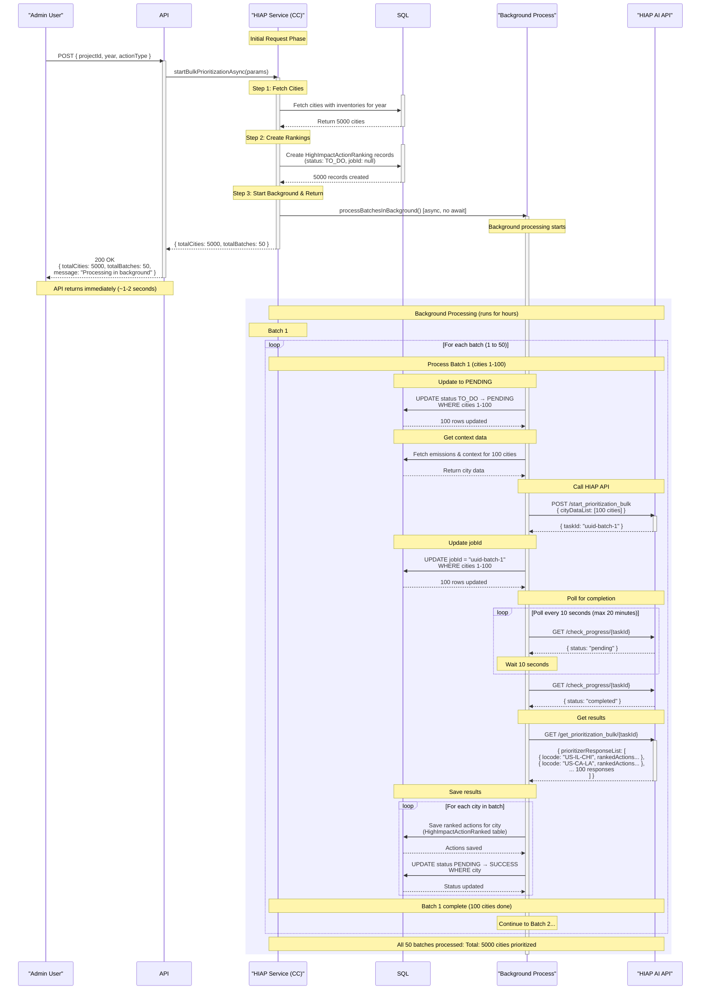
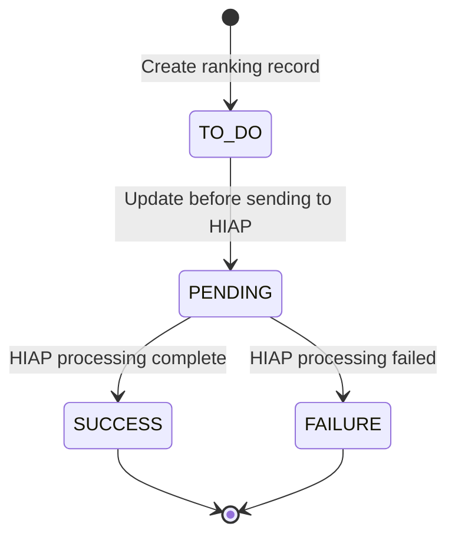

# Bulk HIAP Prioritization - Sequence Diagram

## Overview
This document explains the asynchronous bulk HIAP prioritization process that handles large-scale prioritization for thousands of cities.

## Sequence Diagram

## Process Flow Explanation

### Phase 1: Synchronous (API Request) - ~1-2 seconds
1. **API receives request** with projectId, year, actionType
2. **Service fetches cities** from database (all cities with inventories for that year)
3. **Service creates ranking records** in batch:
   - Status: `TO_DO` (not yet sent to AI)
   - JobId: `null` (no task assigned yet)
   - All 5000 records created at once
4. **Service calculates batches**: 5000 cities ÷ 100 = 50 batches
5. **Service starts background process** (fire-and-forget)
6. **API returns immediately** with summary

### Phase 2: Asynchronous (Background Processing) - Several hours

For **each batch of 100 cities**:

#### Step 1: Prepare Batch
- Update ranking status: `TO_DO` → `PENDING`
- Fetch emissions data and city context from database

#### Step 2: Send to HIAP API
- Call `/start_prioritization_bulk` with 100 cities
- Receive single `taskId` for the entire batch
- Update all 100 rankings with this `taskId`

#### Step 3: Poll for Completion
- Check `/check_progress/{taskId}` every 10 seconds
- Wait until status is `completed` (or `failed`)
- Timeout after 20 minutes

#### Step 4: Retrieve Results
- Call `/get_prioritization_bulk/{taskId}`
- Receive array of 100 responses (one per city)
- Each response identified by `locode`

#### Step 5: Save Results
- For each city in the response:
  - Match by `locode`
  - Save ranked actions to `HighImpactActionRanked` table
  - Update status: `PENDING` → `SUCCESS`

#### Step 6: Move to Next Batch
- Process batch 2 (cities 101-200)
- Repeat steps 1-5
- Continue until all 50 batches complete

## Status Lifecycle

## Key Design Decisions

### Why Async?
- **Fast API response**: Returns in 1-2 seconds instead of hours
- **Non-blocking**: Server can handle other requests
- **Scalable**: Can process thousands of cities without timeout

### Why Batches of 100?
- **HIAP API limit**: Can process ~10 cities per API call (we batch to 100)
- **Memory management**: Processing 5000 cities at once would consume too much memory
- **Error isolation**: If batch 25 fails, batches 1-24 and 26-50 continue

### Why Sequential Batches?
- **HIAP rate limiting**: Prevents overwhelming the AI API
- **Predictable load**: Easier to monitor and debug
- **Resource management**: Controlled database and API usage

## Error Handling

### Batch-Level Errors
- If a batch fails, mark all cities in that batch as `FAILURE`
- Continue processing remaining batches
- Log error details for debugging

### City-Level Errors
- If context data fetch fails for a city: skip it, mark as `FAILURE`
- If HIAP doesn't return results for a city: mark as `FAILURE`
- Continue processing other cities in the batch

### Recovery
- Failed batches can be reprocessed by:
  1. Querying for cities with status `FAILURE`
  2. Resetting status to `TO_DO`
  3. Re-triggering the bulk prioritization
