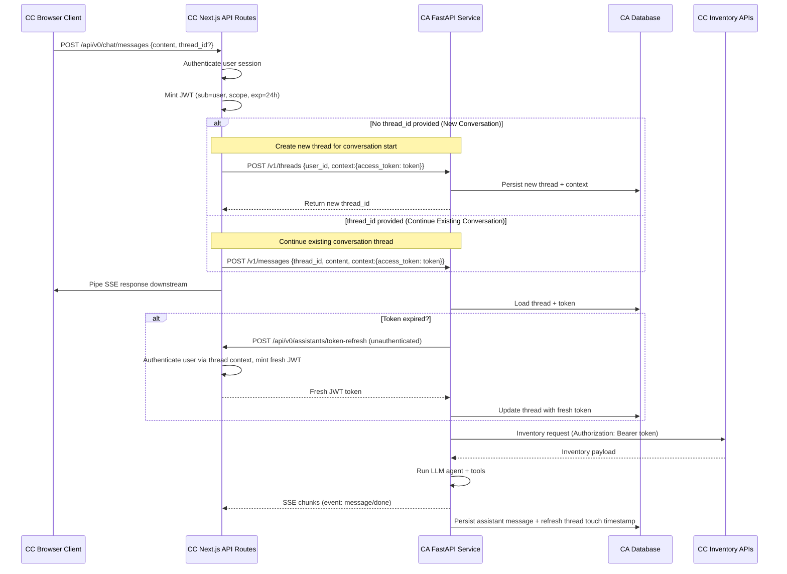

# CC ↔ CA Communication Implementation

## Alignment Summary

- CC mints a long-lived JWT (≈24 hours) whenever it calls CA; the token scopes access to inventory data for the authenticated user.
- The JWT travels only inside CC → CA requests and is stored by CA in the thread `context` field under its own key; it is never sent to the browser or injected into LLM prompts.
- CA reuses the stored token as an opaque bearer credential when fetching inventory data from CC and refreshes it by calling CC when needed.
- **CA refreshes expired tokens**: CA calls an unauthenticated CC endpoint to request fresh tokens when the stored token expires.
- Conversations are session-only: a page reload starts fresh, so CC does not persist history. CA can still load the last _n_ messages for a thread when streaming.
- Streaming continues to flow through `POST /v1/messages` (SSE). CC provides an additional endpoint for token refresh.

## High-Level Flow

## Token Lifecycle

- **Issuer:** CC (`issuer = process.env.HOST`); **Audience:** `"climate-advisor"`.
- **Claims:** `sub` (user id), `scope` (e.g. `["inventory:read"]`), `iat`, `exp`.
- **Rotation:** CC generates a fresh token every time it CA sends a request for authentication or at the start of the conversation. CC overwrites the previous token in the thread context. CA proactively refreshes expired tokens by calling CC's token refresh endpoint.
- **Validation:** CA verifies `iss`, `aud`, and expiry before replaying the token. When expired, CA calls CC's unauthenticated token refresh endpoint with user context.
- **Storage:** `Thread.context.access_token` with optional metadata (`expires_at`, `issued_at`). Context can hold additional fields for future use. Exclude sensitive fields from logs.

## Endpoint Responsibilities

| Owner | Endpoint                                     | Purpose                                              | Calls/Connects To        | Notes                                                                                              |
| ----- | -------------------------------------------- | ---------------------------------------------------- | ------------------------ | -------------------------------------------------------------------------------------------------- |
| CC    | `POST /api/v0/assistants/threads`            | Create CA thread when the UI starts a chat.          | `POST /v1/threads` (CA)  | Mint JWT, call `POST /v1/threads`, persist `thread_id` client-side.                                |
| CC    | `POST /api/v0/chat/messages` (or equivalent) | Forward user messages to CA with streaming response. | `POST /v1/messages` (CA) | Mint new JWT, call `POST /v1/messages`, and relay SSE back to browser.                             |
| CC    | `POST /api/v0/assistants/token-refresh`      | Provide fresh JWT tokens to CA (unauthenticated).    | -                        | CA calls this when tokens expire; CC authenticates user via stored thread context.                 |
| CA    | `POST /v1/threads`                           | Persist thread metadata + token.                     | -                        | Existing implementation already stores `context`; ensure token is stored under `access_token` key. |
| CA    | `POST /v1/messages`                          | Stream assistant replies and persist messages.       | CC Inventory APIs        | Load thread, extract token, call CC inventory APIs, run agent, stream SSE.                         |

## Thread Handling

- CC should pass a `thread_id` when resuming within the same tab; otherwise omit it to trigger new thread creation.
- CA continues to enforce ownership via `ThreadService.get_thread_for_user`.
- No long-term history requirement from CC: CA may expose a future `GET /v1/messages?limit=n` for UI playback if needed, but it is not part of this phase.

## Assistant Message Persistence & Thread Touch Timestamp

The phrase "Persist assistant message + refresh thread touch timestamp" refers to two database operations that happen after CA streams the complete assistant response:

1. **Persist assistant message**: Save the complete AI-generated response as a new message record in the database, associated with the thread. This allows CA to maintain conversation history for future interactions within the same thread.

2. **Refresh thread touch timestamp**: Update the thread's `updated_at` or `last_activity_at` timestamp to the current time. This helps with:
   - Thread cleanup (identifying inactive threads)
   - Analytics and monitoring (tracking thread engagement)
   - UI features (showing "recent conversations")
   - Database optimization (indexing by recency)

This is standard practice for chat applications to maintain conversation state and enable features like resuming conversations from where they left off.

## Implementation Checklist

**CityCatalyst**

- [ ] Inject `CLIMATE_ADVISOR_BASE_URL` into deployment configs.
- [ ] Update thread creation route to mint JWT (~24h expiry), call CA `/v1/threads`, and store token under `context.access_token`.
- [ ] Update chat message proxy route to mint JWT per request and include it in the payload sent to CA under `context.access_token`.
- [ ] Create `POST /api/v0/assistants/token-refresh` endpoint (unauthenticated) that CA calls to get fresh tokens.
- [ ] Ensure SSE proxying strips the token from any logs or analytics.

**Climate Advisor**

- [ ] Extend `/v1/messages` handler to read the latest token from `thread.context.access_token`.
- [ ] Add a helper client to call CC inventory endpoints with the stored bearer token; refresh tokens via CC endpoint when expired.
- [ ] Implement token refresh logic: when token expires, call CC's `POST /api/v0/assistants/token-refresh` endpoint.
- [ ] Guard logs/telemetry to redact token values.
- [ ] Decide on fallback behavior when token refresh fails.

**Testing**

- [ ] Integration test: CC creates a thread, sends a message, CA uses the provided token to fetch inventory data (stub the CC API in tests).
- [ ] Token expiry test: inject an expired token and confirm CA calls CC's token refresh endpoint to get a fresh token.
- [ ] Regression test: ensure threads created without a token are rejected, preventing unauthenticated inventory access.

## Open Questions

- Should CA persist additional audit metadata (e.g., last token issued timestamp) for observability?
