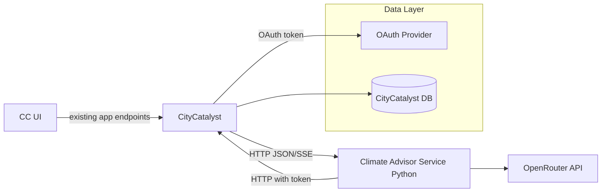
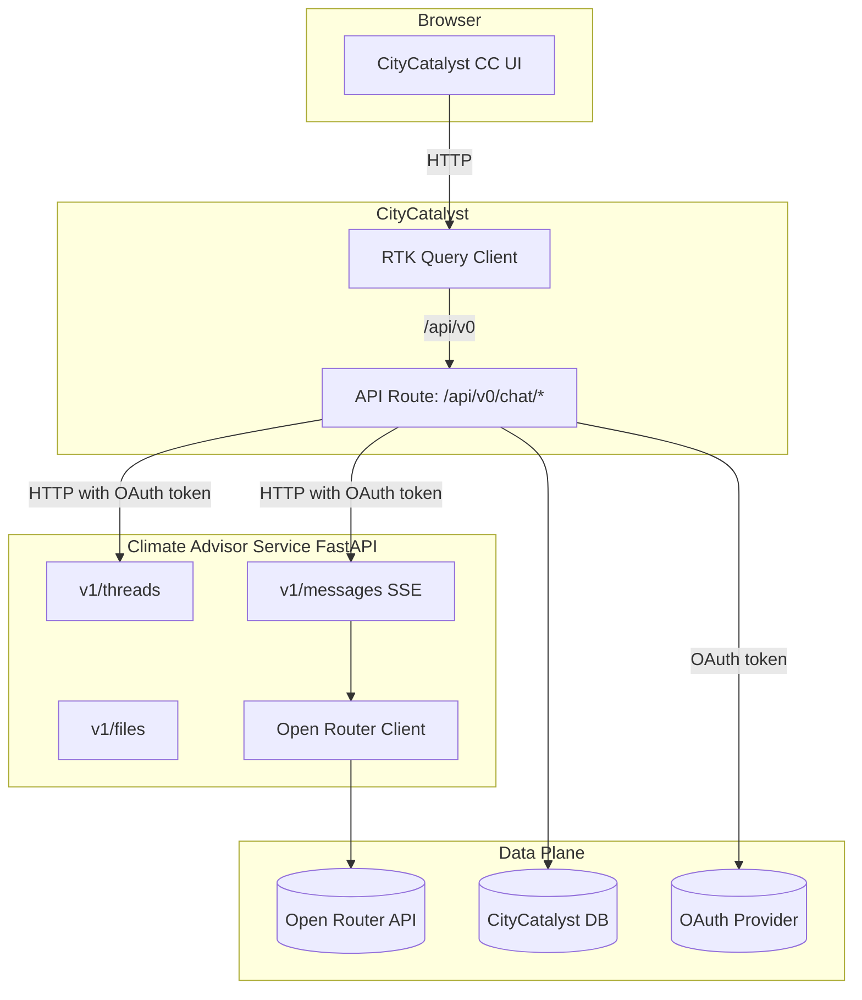
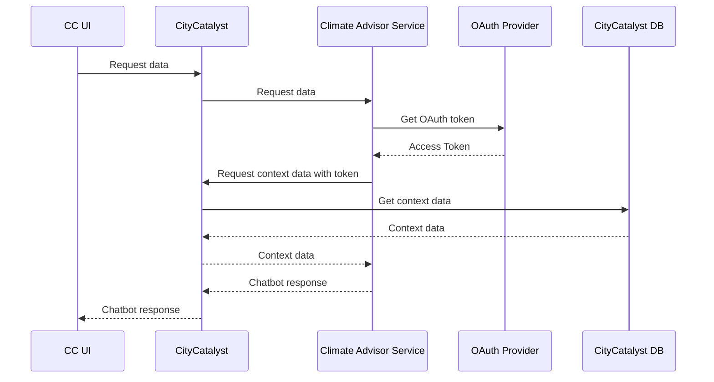
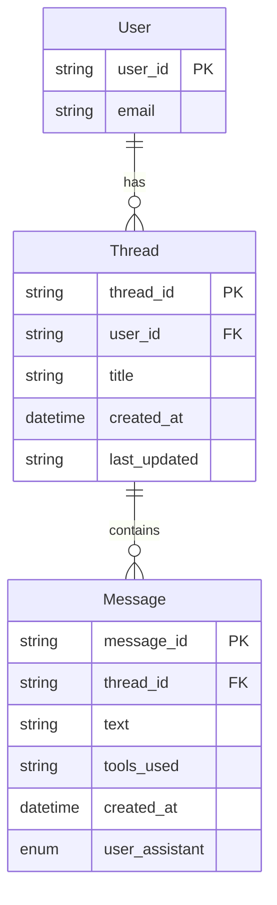

# Climate Advisor (Chatbot) Architecture

## Current Architecture (As-Is)

The chatbot is implemented inside the Next.js app via API routes that directly call the OpenAI API using the JS SDK.

Key components and flows:

- Assistant creation (stubbed):
  - `app/src/app/api/v0/assistants/route.ts` – defines instructions and assistant name, currently returns 501 (not fully implemented). Uses `OPENAI_API_KEY` via `setupOpenAI()`.
- Thread lifecycle:
  - Create thread with inventory context: `app/src/app/api/v0/assistants/threads/[inventory]/route.ts`
    - Builds a context string from Inventory + City + Population data fetched via Sequelize models and session user.
    - Creates an OpenAI thread and seeds it with the context and an initial assistant message.
    - Returns `{ threadId }` to the client.
  - Send message and stream assistant response: `app/src/app/api/v0/assistants/threads/messages/route.ts`
    - Accepts `{ threadId, content }`.
    - Appends a user message and starts a streamed run using `OPENAI_ASSISTANT_ID`.
    - Streams response back to the browser.
  - Tool outputs streaming: `app/src/app/api/v0/assistants/threads/actions/route.ts`
    - Submits tool outputs to an active run and streams the result.
  - Retrieve thread metadata: `app/src/app/api/v0/assistants/threads/[inventory]/retrieve/route.ts`.
  - Optional persistence of thread mapping: `app/src/app/api/v0/assistants/threads/export/route.ts` writes to `db.models.AssistantThread`.
- OpenAI client wiring:
  - `app/src/util/openai.ts` – thin wrapper to create the OpenAI client with `OPENAI_API_KEY`.
- Frontend API usage:
  - `app/src/services/api.ts` – exposes `createThreadId` calling `/assistants/threads/{inventoryId}`.

Runtime deps and env:

- Env: `OPENAI_API_KEY`, `OPENAI_ASSISTANT_ID` (consumed in routes).
- Data access: Next.js API routes reach directly into app DB models to build context (inventory, city, populations, user session info).
- Streaming: Next.js route returns a readable stream to the browser.

### Current Pain Points

- Tight coupling: Chat logic depends on app session, DB models, and domain types.
- Hard to scale independently: Chat traffic scales with the web app.
- Mixed concerns: OpenAI integration and domain-specific context generation live in the same process.
- Limited admin flows: Assistant creation stubbed; vector store/file flows not fully wired.

---

## Target Architecture (To-Be)

Introduce a standalone Python microservice “Climate Advisor Service” exposing a language-agnostic HTTP API. The Next.js app will call this service instead of OpenRouter directly.

Guiding principles:

- Clear API contract (no app-internal ORM/models in boundary).
- Service owns OpenRouter integration, assistant/run lifecycles, and response streaming.
- Context is provided explicitly by caller as structured data, or fetched via stable app APIs (not DB coupling).
- Compatible streaming (SSE or chunked) to preserve UX.

### Service Responsibilities

- Thread lifecycle: create/retrieve threads, seed context.
- Messaging: accept user messages; stream LLM responses.
- Tool calls: accept and forward tool outputs.
- Files/vector store: optional endpoints to upload/list/retrieve; or accept externally managed IDs.
- Observability: structured logs, request IDs, metrics; configurable timeouts and retry/backoff.

### Detailed Architecture Diagram (Service and App Connections)

Sequence (OAuth DB connection):

### API Contract (proposed v1)

`

- `/v1/threads/{thread_id}`
  - Returns: Messages in thread
- `/v1/messages`
  - includes thread_id or request to generate new thread. Contains also user_id
  - Streaming endpoint for messages
- `/v1/actions` (optional)
  - Future thing to call ''actions" in CC like redirect to other page
- `/v1/files` (optional)
  - Multipart upload, returns file ID; list/retrieve as needed.
  - Mockup for now but possible way to share screenshots parts of the app with the model

## Database Schema Additions (Chat)

The chat feature persists minimal thread and message data in the CityCatalyst DB. It introduces two new tables linked to the existing `User` table:

- Entities: `User` → `Thread` → `Message`.
- Relationships: one user has many threads; one thread has many messages.
- Identifiers: `user_id` (existing), `thread_id` (thread id), `message_id` (message id).
- Message payload: `text` and `tools_used` (`jsonb`) capturing tools invoked and arguments.
- Indexes: by `user_id` on threads and by `thread_id` on messages; unique `thread_id`.

Notes:

- `tools_used` holds a JSON array of tool calls per message, e.g. `[ { "name": "search_inventory", "args": { ... }, "status": "success" } ]`.
- Threads may exist without an `thread_id` until created upstream; populate after thread creation.
- Messages are append-only; edits create new rows if needed.

## Required Changes

Changes in the Next.js app:

- Replace direct OpenAI SDK usage in routes with HTTP calls to the microservice:
  - `app/src/app/api/v0/chat/threads/[inventory]/route.ts` – create thread by calling `POST /v1/threads` with the existing context string (or structured blocks). Persist returned `thread_id` .
  - `app/src/app/api/v0/chat/threads/messages/route.ts` – call `POST /v1/messages` and pipe SSE/stream to the client. Handle `OPENAI_ASSISTANT_ID` on the service side.
  - `app/src/app/api/v0/chat/threads/actions/route.ts` – proxy to `POST /v1/actions`.
  - `app/src/app/api/v0/chat/threads/[inventory]/retrieve/route.ts` – proxy to `GET /v1/threads/{id}`.
  - `app/src/app/api/v0/chat/files/[fileId]/route.ts` – proxy to service’s file endpoints (optional).
- Config:
  - Add `CLIMATE_ADVISOR_BASE_URL` and service-to-service credential env vars.
  - Keep `OPENAI_*` envs only in the service (remove from Next app when migration completes).
- Streaming:
  - Maintain the same streaming contract to the browser
-

## References to Current Code

- Assistant (stub): `app/src/app/api/v0/assistants/route.ts:1`
- Create thread with context: `app/src/app/api/v0/assistants/threads/[inventory]/route.ts:1`
- Send message + stream: `app/src/app/api/v0/assistants/threads/messages/route.ts:1`
- Tool outputs stream: `app/src/app/api/v0/assistants/threads/actions/route.ts:1`
- Retrieve thread: `app/src/app/api/v0/assistants/threads/[inventory]/retrieve/route.ts:1`
- Export mapping: `app/src/app/api/v0/assistants/threads/export/route.ts:1`
- OpenAI client setup: `app/src/util/openai.ts:1`
- Frontend RTK endpoint creating thread ID: `app/src/services/api.ts:876`
