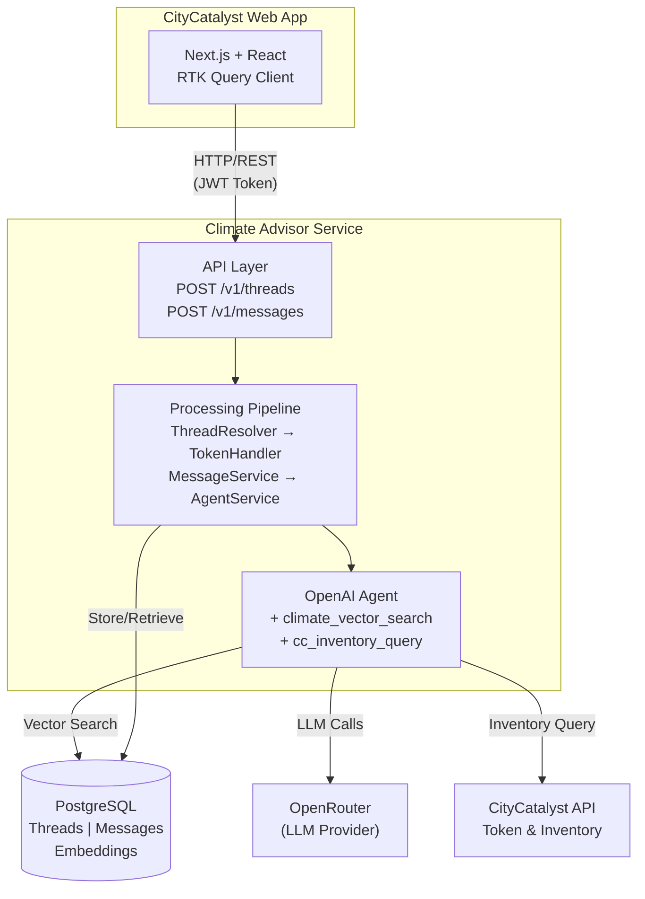
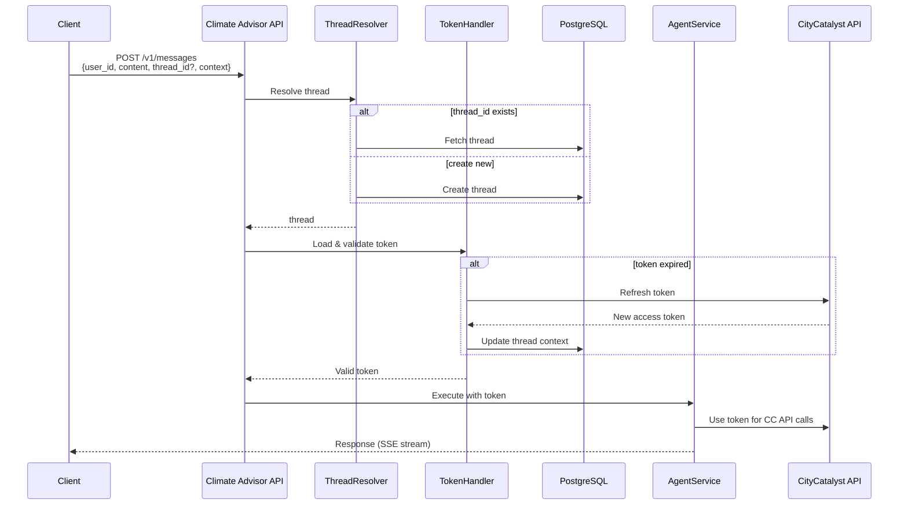
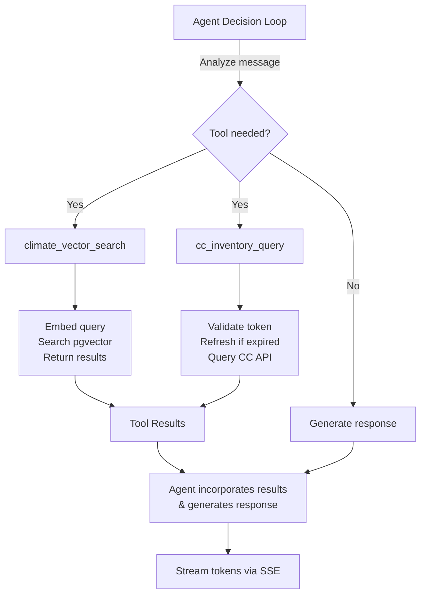
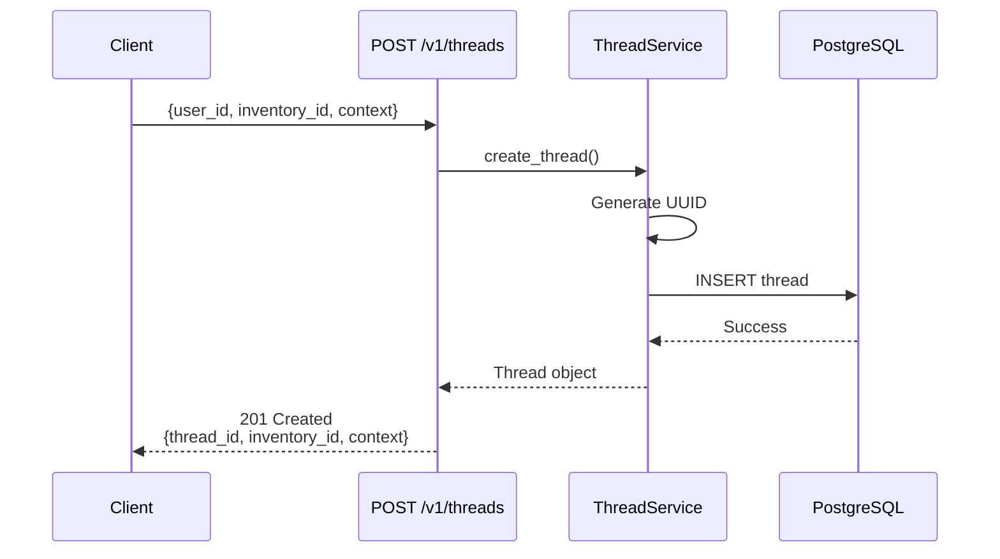
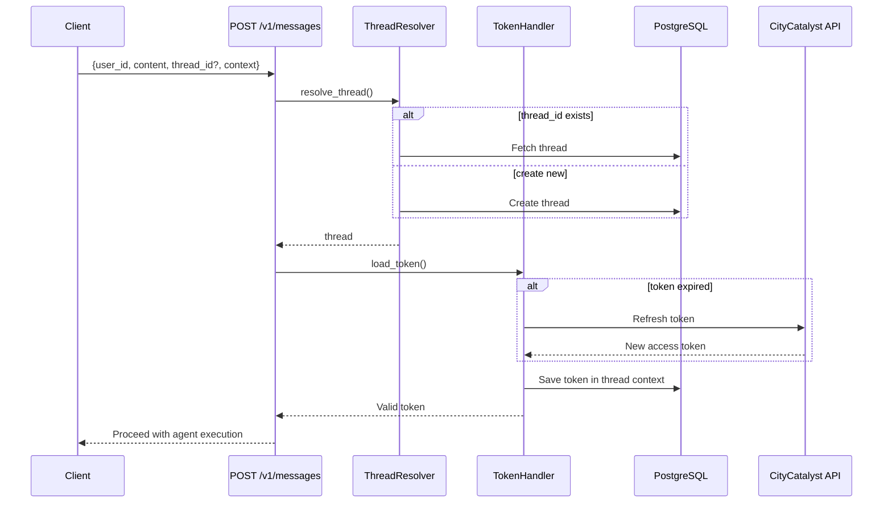

# Climate Advisor Service Architecture

## Overview

Climate Advisor is a production FastAPI microservice that manages conversational AI for CityCatalyst. It provides:

- **Thread & Message Management**: Persistent conversation storage in PostgreSQL
- **Agentic AI with Tool Integration**: OpenAI Agents SDK with function calling
- **Vector-Based RAG**: Semantic search over climate knowledge base via pgvector
- **Token Management**: JWT refresh and caching for CityCatalyst API access
- **Streaming Responses**: Server-Sent Events (SSE) for real-time delivery

## Current Architecture (As-Implemented)

### System Architecture



### Request Flow Diagram



### Tool Integration Architecture



## Data Flow

### 1. Thread Creation Flow



### 2. Message & Streaming Flow



## Database Schema

### Thread Model

```python
class Thread(Base):
    __tablename__ = "threads"

    thread_id: UUID = PK
    user_id: str = FK (User)
    inventory_id: Optional[str]
    context: Optional[Dict] = JSONB
    title: Optional[str]
    created_at: datetime
    last_updated: datetime

    messages: List[Message] = relationship(cascade=delete)
```

**context field example:**

```json
{
  "access_token": "eyJ...",
  "expires_at": "2025-01-29T15:30:00Z",
  "issued_at": "2025-01-29T13:30:00Z",
  "cc_access_token": "...",
  "inventory_name": "San Francisco",
  "custom_metadata": "..."
}
```

### Message Model

```python
class Message(Base):
    __tablename__ = "messages"

    message_id: UUID = PK
    thread_id: UUID = FK (Thread)
    text: str
    role: Enum = {'user', 'assistant'}
    tools_used: Optional[Dict] = JSONB
    created_at: datetime

    thread: Thread = relationship(back_populates=messages)
```

**tools_used field example:**

```json
[
  {
    "name": "climate_vector_search",
    "status": "success",
    "arguments": {
      "query": "emissions reduction strategies"
    },
    "results": [
      {
        "filename": "GPC_Full_MASTER_RW_v7.pdf",
        "chunk_index": 42,
        "score": 0.87,
        "content": "Document excerpt..."
      }
    ]
  }
]
```

### DocumentEmbedding Model (Vector DB)

**Vector Index:**

```sql
CREATE INDEX ix_document_embeddings_vector
ON document_embeddings
USING ivfflat (embedding_vector vector_cosine_ops)
WITH (lists = 100);
```

## Service Layers

### 1. Route Layer (FastAPI)

**`routes/health.py`**

- `GET /health` - Liveness probe

**`routes/threads.py`**

- `POST /v1/threads` - Create thread with optional context

**`routes/messages.py`**

- `POST /v1/messages` - Send message, stream response (SSE)

### 2. Service Layer

**ThreadService** (`services/thread_service.py`)

- `create_thread()` - Create new thread
- `get_thread()` - Retrieve thread by ID
- `get_thread_for_user()` - Verify user ownership
- `update_context()` - Update thread JSONB context
- `touch_thread()` - Update last_updated timestamp

**MessageService** (`services/message_service.py`)

- `create_user_message()` - Persist user message
- `create_assistant_message()` - Persist assistant response
- `get_thread_messages()` - Load conversation history

**AgentService** (`services/agent_service.py`)

- `create_agent()` - Initialize Agents SDK with tools
- `_create_openrouter_client()` - Configure OpenRouter endpoint
- `_setup_tools()` - Build tool definitions for agent

**EmbeddingService** (`services/embedding_service.py`)

- `generate_embeddings()` - Call OpenAI embedding API
- `generate_embeddings_batch()` - Batch embedding generation

**CityCatalystClient** (`services/citycatalyst_client.py`)

- `refresh_token()` - Call CityCatalyst token refresh endpoint
- `query_inventory()` - Call CityCatalyst inventory APIs
- Error handling and retry logic

### 3. Tool Layer

**ClimateVectorSearchTool** (`tools/climate_vector_tool.py`)

```python
async def climate_vector_search(query: str, top_k: int = 5) -> List[VectorSearchMatch]:
    """
    Semantic search over climate knowledge base.

    1. Generate embedding for query using OpenAI
    2. Search pgvector for similar chunks
    3. Return top-k results with similarity scores
    4. Tool invocation recorded in message.tools_used
    """
```

**CCInventoryTool** (`tools/cc_inventory_tool.py`)

```python
async def cc_inventory_query(inventory_id: str, data_type: str) -> Dict:
    """
    Query CityCatalyst inventory APIs.

    1. Load JWT token from thread context
    2. Check token expiration
    3. Refresh token if needed via CityCatalyst
    4. Call CityCatalyst inventory endpoint
    5. Return formatted inventory data
    6. Tool invocation recorded in message.tools_used
    """
```

### 4. Utility Layer

**StreamingHandler** (`utils/streaming_handler.py`)

- Orchestrates agent execution
- Handles SSE stream formatting
- Manages tool invocation tracking
- Persists messages after streaming

**ThreadResolver** (`utils/thread_resolver.py`)

- Resolves thread_id (existing or create new)
- Handles thread creation with context

**TokenHandler** (`utils/token_handler.py`)

- Loads token from multiple sources
- Manages token refresh logic
- Handles CityCatalyst token endpoint calls

**HistoryManager** (`utils/history_manager.py`)

- Loads conversation messages from database with optional limit
- Applies configurable pruning to manage context size
- Splits messages into "preserved" (full metadata) and "discarded" (trimmed)
- Provides DB-optional mode for graceful degradation
- Reduces context token usage by stripping tool metadata from older messages

**ToolHandler** (`utils/tool_handler.py`)

- Persists assistant messages post-stream
- Gates tool invocation persistence based on configuration
- Trims tool metadata for storage efficiency in older messages
- Handles graceful fallback when database unavailable

## Configuration & Settings

### LLM Configuration (`llm_config.yaml`)

See `llm_config.yaml` in the project root for configuration of models, prompts, tools, conversation history limits, and observability settings.

### Environment Variables (`settings.py`)

Environment variables are configured in `.env` file. See `.env.example` for all available configuration options including database URL, API keys (OpenRouter, OpenAI), CityCatalyst settings, and LangSmith configuration.

## Integration Points

### 1. CityCatalyst App ↔ Climate Advisor

**Request Flow:**

```
CityCatalyst Next.js App
  └─ POST /api/v0/chat/messages
      {
        "user_id": "...",
        "content": "...",
        "thread_id": "..." (optional),
        "context": {
          "cc_access_token": "jwt"
        }
      }
      ↓
      Proxy to Climate Advisor Service
      └─ POST /v1/messages
          ↓
          Response: SSE stream
          ├─ event: message
          ├─ event: tool_use
          └─ event: done
```

### 2. Climate Advisor ↔ OpenRouter (LLM)

```
AgentService
  └─ AsyncOpenAI(base_url="https://openrouter.ai/api/v1")
      └─ headers: {"Authorization": "Bearer $OPENROUTER_API_KEY"}
          ├─ LLM Provider: OpenRouter
          ├─ Tools: [climate_vector_search, cc_inventory_query]
          └─ Stream: true (token-by-token)
```

### 3. Climate Advisor ↔ OpenAI (Embeddings)

```
EmbeddingService
  └─ AsyncOpenAI(api_key=$OPENAI_API_KEY)
      └─ Model: text-embedding-3-large
          ├─ Used for query embeddings (climate_vector_search)
          ├─ Dimension: 3072
          └─ Rate limit: 3000 RPM
```

### 4. Climate Advisor ↔ CityCatalyst (Token & Inventory)

```
TokenHandler / CCInventoryTool
  └─ POST $CC_BASE_URL/api/v0/assistants/token-refresh
      ├─ Input: refresh_token or access_token
      ├─ Response: new access_token with expiry
      └─ Cached in thread.context["access_token"]

  └─ GET $CC_BASE_URL/api/v0/inventory/{data_type}
      ├─ Headers: Authorization: Bearer {access_token}
      ├─ Query: inventory_id
      └─ Response: Formatted inventory data
```

### 5. Climate Advisor ↔ PostgreSQL

```
AsyncSession (SQLAlchemy)
  ├─ Threads table (CRUD)
  ├─ Messages table (Write + Read history)
  └─ DocumentEmbeddings table (Vector search)
```

### 6. Climate Advisor ↔ pgvector (Vector Search)

```
vector_search query:
SELECT
  embedding_id,
  filename,
  content,
  embedding_vector <=> query_embedding as distance
FROM document_embeddings
ORDER BY embedding_vector <=> query_embedding
LIMIT 5
```

### Conversation History Pruning & Retention

**Overview**: Conversation history is loaded and pruned to reduce LLM context token usage while keeping complete tool metadata in the database for audit trails.

**Key Principle**: Full tool metadata is **always saved to the database**. Pruning only affects what is sent to the LLM.

**Retention Configuration** (`llm_config.yaml` → `conversation.retention`):

```yaml
conversation:
  retention:
    preserve_turns: 4         # Keep last 4 turns in LLM context
    max_loaded_messages: 20   # Load max 20 messages from DB
    prune_tools_for_llm: true # Apply pruning window for tool-output injection
```

**Pruning Pipeline**:

1. **Load Phase** (`HistoryManager.load_messages`):
   - Fetch up to `max_loaded_messages` messages from DB (oldest first)
   - Messages have FULL tool metadata from database
   - Gracefully return empty list if DB unavailable

2. **Pruning Phase** (`HistoryManager.build_context`):
   - Split messages into "preserved" (latest N turns) and "pruned" (older)
   - For pruned messages: do not inject tool outputs into LLM context
   - For preserved assistant messages: inject tool outputs as additional SYSTEM messages
   - **Database message objects are unchanged** (always have full tools)

3. **Context Building for LLM**:
   - Messages sent to the model are always role/content only:
     - Base messages: `{"role": "user/assistant", "content": "..."}`
     - Tool grounding: a SYSTEM message is appended after preserved assistant messages:
       `{"role": "system", "content": "INTERNAL_TOOL_OUTPUT_JSON\\n{...}"}`
   - This context is sent to the LLM only; the DB rows do not include these SYSTEM items.

4. **Persistence Phase** (`tool_handler.persist_assistant_message`):
   - Always persist FULL tool metadata to database
   - No trimming, no gating
   - Ensures complete audit trail of all tool invocations

**Benefits**:

- **Token Usage**: 20-50% reduction for long conversations by not sending older tool metadata to LLM
- **Database Integrity**: Complete audit trail with all tool invocation details preserved
- **Context Quality**: Latest turns retain full metadata for traceability in LLM
- **Flexibility**: Can still access full history from database for analytics/debugging
- **Graceful Degradation**: DB-optional mode returns empty history instead of crashing

**Usage in StreamingHandler**:

```python
# Instead of loading raw history:
conversation_history = await message_service.get_thread_messages(...)

# Now uses pruned context for LLM:
conversation_history = await load_conversation_history(
    thread_id=thread_id,
    user_id=user_id,
    session_factory=session_factory,
)
# Returns LLM-ready context with older tools removed
# Database still has complete messages with full tools
```

**Feature Flags**:

- `prune_tools_for_llm=true` (default): Strip tools from older messages for LLM (token optimization)
- `prune_tools_for_llm=false`: Treat all loaded messages as preserved for tool-output injection (higher tokens)
- `preserve_turns`: Control how many recent turns get tool-output SYSTEM messages injected

**Observability**:

Logged metrics:
- `total_messages`: Messages loaded from DB (with full tools)
- `preserved_count`: Messages kept with full metadata for LLM
- `pruned_count`: Messages with tools removed from LLM context
- `context_items`: Final LLM context size (smaller due to pruning)

**Conversation History Loading**

- **Default Limit**: Last 5 messages (configurable via `history_limit` in `llm_config.yaml`)
- **Pruning**: Applied automatically via `HistoryManager` (see above)
- **Query**: Indexed by `thread_id` for O(log n) lookup
- **Benefit**: Balances context richness vs. token usage while reducing payload size

### Vector Search Optimization

- **Index**: IVFFlat on `embedding_vector` column
- **Search Time**: ~10-50ms for 10k+ documents
- **Distance Metric**: Cosine similarity
- **Tuning**: `WITH (lists = 100)` for balance

### Database Connection Pooling

```python
engine = create_async_engine(
    database_url,
    poolclass=NullPool,  # Async-safe
    pool_size=20,
    max_overflow=10,
    pool_timeout=30
)
```
