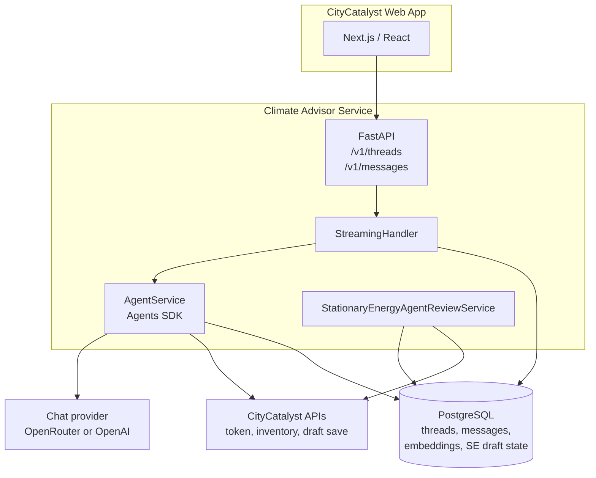
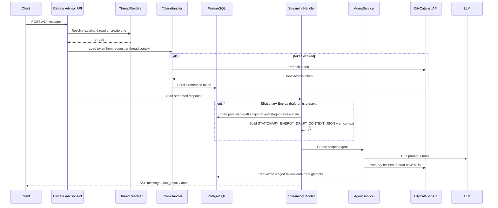
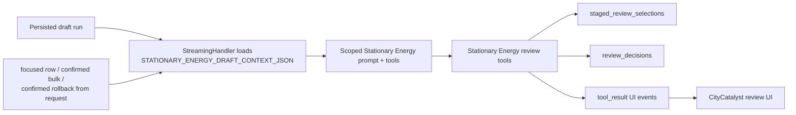

# Climate Advisor Service Architecture

## Overview

Climate Advisor is the FastAPI service behind CityCatalyst chat. The same
`/v1/messages` endpoint supports two runtime modes:

- General climate and inventory chat.
- Stationary Energy draft review chat scoped to a persisted
  `stationary_energy_draft_run_id`.

Both modes share thread persistence, token handling, SSE streaming, and the
Agents SDK runtime. The Stationary Energy review flow adds CA-owned draft state,
a second prompt entrypoint, and scoped review tools that return UI-oriented
`tool_result` payloads.

## Current Architecture (As-Implemented)

### System Architecture

```mermaid
flowchart TB
    subgraph Client["CityCatalyst Web App"]
        UI["Next.js / React"]
    end

    subgraph Service["Climate Advisor Service"]
        API["FastAPI<br/>/v1/threads<br/>/v1/messages"]
        Stream["StreamingHandler"]
        Agent["AgentService<br/>Agents SDK"]
        Review["StationaryEnergyAgentReviewService"]
    end

    DB[("PostgreSQL<br/>threads, messages,<br/>embeddings, SE draft state")]
    LLM["Chat provider<br/>OpenRouter or OpenAI"]
    CC["CityCatalyst APIs<br/>token, inventory, draft save"]

    UI --> API
    API --> Stream
    Stream --> Agent
    Stream --> DB
    Agent --> LLM
    Agent --> CC
    Agent --> DB
    Review --> DB
    Review --> CC
```

### Request Flow

```mermaid
sequenceDiagram
    participant Client
    participant API as Climate Advisor API
    participant Thread as ThreadResolver
    participant Token as TokenHandler
    participant DB as PostgreSQL
    participant Stream as StreamingHandler
    participant Agent as AgentService
    participant CC as CityCatalyst API

    Client->>API: POST /v1/messages
    API->>Thread: Resolve existing thread or create one
    Thread-->>API: thread

    API->>Token: Load token from request or thread context
    alt token expired
        Token->>CC: Refresh token
        CC-->>Token: New access token
        Token->>DB: Persist refreshed token
    end

    API->>Stream: Start streamed response
    opt Stationary Energy draft run is present
        Stream->>DB: Load persisted draft snapshot and staged review state
        Stream-->>Stream: Build STATIONARY_ENERGY_DRAFT_CONTEXT_JSON + ui_context
    end

    Stream->>Agent: Create scoped agent
    Agent->>LLM: Run prompt + tools
    Agent->>CC: Inventory fetches or draft-save calls
    Agent->>DB: Read/write staged review data through tools
    Stream-->>Client: SSE message / tool_result / done
```

### Tool Registration Rules

`AgentService.create_agent()` builds the tool pack at request time:

- Added outside active Stationary Energy review chat:
  - `climate_vector_search`
- Added when the request has CityCatalyst credentials and thread scope:
  - `get_user_inventories`
  - `city_inventory_search`
  - `get_inventory`
  - `get_all_datasources`
- Added when the request is scoped to the Stationary Energy draft surface and
  no draft run is active:
  - `stationary_energy_start_draft`
- Added when the request is scoped to a Stationary Energy draft run:
  - `stationary_energy_list_review_options`
  - `stationary_energy_list_notation_keys`
  - `stationary_energy_accept_one`
  - `stationary_energy_stage_notation_key`
  - `stationary_energy_accept_multiple`
  - `stationary_energy_accept_all_recommended`
  - `stationary_energy_request_bulk_review_confirmation`
  - `stationary_energy_request_bulk_notation_confirmation`
  - `stationary_energy_apply_bulk_notation_choices`
  - `stationary_energy_request_all_recommended_confirmation`
  - `stationary_energy_request_staged_source_change_confirmation`
  - `stationary_energy_request_staged_sources_rollback_confirmation`
  - `stationary_energy_rollback_staged_sources`
  - `stationary_energy_rollback_staged_notation_keys`
  - `stationary_energy_save_review_draft`
  - `stationary_energy_request_inventory_save_confirmation`

`AgentService.create_agent()` selects instructions from the active chat mode:

- General chat starts from `prompts.default`.
- General inventory chat can append `prompts.inventory_context`.
- Stationary Energy draft-surface chat can register `stationary_energy_start_draft`
  before a draft run exists, using the default prompt plus a focused start-draft
  instruction.
- Stationary Energy review chat starts from `prompts.stationary_energy_review`
  instead of appending to `prompts.default`, and registers only tools scoped to
  the active draft review workflow. That pack includes Stationary Energy review
  tools, but not the pre-draft `stationary_energy_start_draft` tool.

## Stationary Energy Review Flow

```mermaid
flowchart LR
    Draft["Persisted draft run"] --> Context["StreamingHandler loads<br/>STATIONARY_ENERGY_DRAFT_CONTEXT_JSON"]
    UIContext["focused row / confirmed bulk /<br/>confirmed rollback from request"] --> Context
    Context --> Agent["Scoped Stationary Energy prompt + tools"]
    Agent --> Tools["Stationary Energy review tools"]
    Tools --> Staged["staged_review_selections"]
    Tools --> Decisions["review_decisions"]
    Tools --> Confirm["tool_result UI events"]
    Confirm --> Client["CityCatalyst review UI"]
```

The review tools operate on CA-owned persisted draft state:

- The draft snapshot contains `source_candidates`, `proposals`,
  `review_decisions`, and active `staged_review_selections`.
- Single-row and bulk actions stage temporary selections first.
- Notation-key actions first list CC-eligible Stationary Energy targets and the
  allowed settable keys (`NO`, `NE`, `IE`, `C`), then stage or roll back CA
  notation choices without writing inventory data.
- Save-to-draft persists complete `review_decisions`.
- Save-to-inventory remains a separate UI-confirmed CityCatalyst step after CA
  emits an inventory-save confirmation payload. That final save can commit
  both source/manual rows and saved notation-key rows.

## Persistence Model

Climate Advisor persists both normal chat history and Stationary Energy draft
workflow state in PostgreSQL.

| Store | Purpose |
| --- | --- |
| `threads` | Chat thread ownership, context, and refreshed tokens |
| `messages` | User and assistant chat history, including tool invocation metadata |
| `document_embeddings` | pgvector-backed climate knowledge retrieval |
| `stationary_energy_draft_runs` | One persisted Stationary Energy draft workflow, optionally linked to a thread |
| `stationary_energy_draft_source_candidates` | Candidate datasources and normalized source rows for the draft |
| `stationary_energy_draft_proposals` | Proposed Stationary Energy row changes with recommended and alternate candidates |
| `stationary_energy_review_decisions` | Durable saved review decisions with versioning, commit status, and optional notation-key metadata |
| `stationary_energy_staged_review_selections` | Active temporary chat-staged source or notation-key choices awaiting save, change, or rollback |

## Service And Utility Layers

### Route Layer

- `routes/threads.py`
  - Creates threads and stores initial context.
- `routes/messages.py`
  - Accepts chat requests and streams SSE responses.

### Service Layer

- `services/agent_service.py`
  - Selects the model for the current workflow context.
  - Loads `prompts.default` for general chat.
  - Appends `inventory_context` only for general inventory chat.
  - Uses `stationary_energy_review` as the full prompt for active Stationary
    Energy review chat.
  - Keeps general inventory and vector-search tools out of active review chat.
  - Registers the correct Stationary Energy review tool pack when a draft run is
    active.
- `services/stationary_energy/stationary_energy_draft_repository.py`
  - Loads draft runs, proposals, decisions, and staged review selections.
  - Persists staged selection status transitions.
- `services/stationary_energy/stationary_energy_agent_review.py`
  - Orchestrates review staging, notation-key staging, preview, rollback, and
    draft-save flows.
  - Commits staged selection transitions through the repository and draft service.
- `services/stationary_energy/stationary_energy_review_resolver.py`
  - Resolves selectable sources, notation-key targets, pending review rows, and
    save-ready decision inputs for one persisted draft snapshot.
- `services/stationary_energy/stationary_energy_review_models.py`
  - Defines shared Stationary Energy review tool request and response payloads.
- `services/stationary_energy/stationary_energy_review_messages.py`
  - Builds language-neutral review message metadata for the UI.
- `services/stationary_energy/stationary_energy_chat_context.py`
  - Serializes persisted draft snapshots and request-shaped `ui_context` for
    Stationary Energy chat grounding.
- `services/stationary_energy/stationary_energy_tool_events.py`
  - Builds Stationary Energy `tool_result` SSE payloads for UI event cards.

### Tool Layer

- `tools/climate_vector_sync.py`
  - General climate knowledge retrieval.
- `tools/cc_inventory_wrappers.py`
  - The CityCatalyst inventory tool pack used by the general prompt.
- `tools/stationary_energy_review_tools.py`
  - The scoped Stationary Energy review tool pack backed by
    `StationaryEnergyAgentReviewService`.
- `tools/stationary_energy_start_draft_tools.py`
  - The scoped chat tool that starts Stationary Energy draft generation before
    a draft run is active and review proposals exist.

### Utility Layer

- `utils/streaming_handler.py`
  - Loads pruned conversation history.
  - Loads persisted Stationary Energy draft context and delegates Stationary
    Energy payload shaping to `services/stationary_energy/stationary_energy_chat_context.py`.
  - Enforces the Stationary Energy chat prompt budget.
  - Emits `tool_result` SSE payloads for normal tools and Stationary Energy UI
    events via `services/stationary_energy/stationary_energy_tool_events.py`.
- `utils/history_manager.py`
  - Prunes older tool metadata for LLM context while keeping full DB audit data.
- `utils/token_handler.py`
  - Refreshes and persists CityCatalyst tokens.

## SSE Contract

Climate Advisor streams these SSE event types today:

- `message`
  - Token deltas and response text chunks.
- `tool_result`
  - Tool execution state and tool outputs.
  - Used for Stationary Energy confirmation and state-change payloads.
- `warning`
  - Recoverable request issues, such as unavailable history.
- `info`
  - Non-error metadata such as token refresh notices.
- `error`
  - Streaming or token failures.
- `done`
  - Terminal response metadata for the request.

Stationary Energy review tool outputs may include one of these `ui_event`
values inside `tool_result` payloads:

- `stationary_energy_review_state_changed`
- `stationary_energy_review_bulk_confirmation_requested`
- `stationary_energy_review_change_confirmation_requested`
- `stationary_energy_review_rollback_confirmation_requested`
- `stationary_energy_inventory_save_confirmation_requested`
- `stationary_energy_draft_started`

## Prompts And Configuration

`llm_config.yaml` is the source of truth for model, prompt, retry, and history
settings.

- `prompts.default`
  - General Climate Advisor chat prompt.
- `prompts.inventory_context`
  - Injected only when an inventory is active and CA can fetch its details.
- `prompts.stationary_energy_review`
  - Used as the full prompt for active Stationary Energy draft review chat.
  - Defines inline tool policy for the Stationary Energy review tools.

Prompt include directives such as `{{ include: tools/default_tool_policy.md }}`
are resolved relative to the including file first and then against the prompt
search roots discovered by `PromptsConfig`.

Stationary Energy chat also has a dedicated prompt budget:

- `StreamingHandler` prepends `STATIONARY_ENERGY_DRAFT_CONTEXT_JSON`.
- If needed, the draft snapshot is compacted before the run.
- The final runner input is trimmed to the configured `chat_context` budget.

## External Integrations

### LLM Providers

- OpenRouter is the default chat-completions provider.
- Direct OpenAI chat endpoints are also supported through the same
  OpenAI-compatible client abstraction.
- OpenAI embeddings power `climate_vector_search`.

### CityCatalyst

- Token refresh flows through `TokenHandler`.
- Inventory tools call CityCatalyst APIs with the scoped bearer token.
- Stationary Energy draft-save uses the existing CityCatalyst draft-save route
  after CA has assembled a complete reviewed draft state.
- Inventory commit is not executed directly by CA chat tools; CA returns a
  confirmation payload and CityCatalyst owns the final inventory-write step.
- Stationary Energy notation-key commits use an internal CC capability only
  from the confirmed save-to-inventory path. Public notation-key routes remain
  backward compatible.

### PostgreSQL And pgvector

- SQLAlchemy async sessions back thread, message, and draft workflow
  persistence.
- pgvector stores semantic-search embeddings for the climate knowledge base.

## Conversation History And Prompt Budgets

Climate Advisor prunes older tool metadata for LLM context while preserving the
full audit trail in PostgreSQL.

For Stationary Energy review chat:

1. `load_conversation_history()` loads pruned history.
2. `StreamingHandler` loads the persisted draft snapshot.
3. `ui_context` from the request is attached to the snapshot when present.
4. The context message is compacted if it exceeds the configured prompt budget.
5. The final runner input is trimmed again before the streamed run starts.

## Observability

Each streamed request creates a `RunConfig` with workflow-specific metadata.
Stationary Energy context chat uses a dedicated workflow name and includes
`stationary_energy_draft_run_id` in trace metadata so it can be separated from
general conversations in traces and logs.
