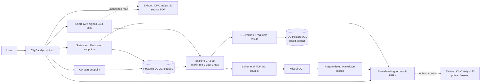

# Climate Advisor PDF OCR to Markdown Architecture

Status: Draft

Last updated: 2026-07-14

## Decision Summary

Climate Advisor (CA) will provide one shared CityCatalyst PDF-to-Markdown
converter using Mistral OCR. It supports inventory imports first and uses the
same contract for Concept Note uploads. The first version uses the existing CA
pod and adds no separate OCR worker, Kubernetes workload, persistent volume, or
public upload endpoint.

The key decisions are:

- CityCatalyst authenticates the user and owns the source upload/storage
  boundary. The existing inventory upload path is reused; the Concept Note
  upload route will use the same storage boundary. CA never becomes the durable
  owner of the source PDF.
- CA accepts work asynchronously and stores job state in its own PostgreSQL
  database.
- The public conversion key is the pair `(source_type, source_id)`. There is no
  second OCR job ID and no hash-based idempotency scheme.
- The existing CA process runs at most two PDF jobs concurrently.
- CA PostgreSQL stores only OCR job state and source metadata, never PDF, chunk,
  Markdown, or S3-key contents.
- During conversion, CA downloads a temporary working copy and creates chunks on
  the pod's ephemeral filesystem. They are deleted after each attempt.
- Final Markdown is stored under `pdf-ocr/results/` in the existing
  CityCatalyst S3 setup. CityCatalyst gives CA a short-lived signed PUT URL for
  the exact result object. CA uploads the Markdown itself but has no persistent
  S3 credentials or bucket permissions. CityCatalyst verifies the uploaded
  object and stores the authoritative result S3 key in the CC database.
- CA stops after producing Markdown. It does not extract rows, map schemas,
  validate business data, or trigger another workflow.

The MVP supports PDFs up to 20 MB. The inventory-import endpoint already
enforces this limit, and the Concept Note upload route must enforce the same
limit. A later increase must be coordinated across upload and conversion paths.

## Scope

Included:

- PDF validation, page-range chunking, Mistral OCR, ordered Markdown merging,
  result storage, retries, and status reporting.
- A durable PostgreSQL queue that survives pod restarts.
- Two active conversions with one Mistral request per conversion.

Excluded:

- Vision refinement, image descriptions, structured extraction, schema mapping,
  database loading, callbacks, and workflow continuation.
- Page, chunk, percentage, or stage progress in the public API.
- A separate OCR pod, Deployment, Service, HPA, PV, or PVC.
- Multiple CA replicas or Uvicorn workers before a distributed OCR limiter
  exists.

## System Flow



## Service Boundary

| Component                | Responsibility                                                          |
| ------------------------ | ----------------------------------------------------------------------- |
| CityCatalyst             | Authorization, source/result pointers, S3 access, and signed URLs.      |
| CA API                   | CC-proxied start, status, retry, and Markdown endpoints.                 |
| CA dispatcher            | Queue claiming, validation, OCR, retries, merge, upload, and cleanup.   |
| CC PostgreSQL            | Source records and the authoritative final Markdown S3 pointer.         |
| CA PostgreSQL            | Durable job status, attempts, leases, timestamps, and sanitized errors. |
| Existing CityCatalyst S3 | Durable source PDFs and final Markdown artifacts in separate prefixes.  |
| Mistral                  | PDF page OCR and Markdown generation.                                   |

The conversion is complete when status is `succeeded` and the Markdown is
downloadable. Any later use of that Markdown belongs to the caller.

## Source Identity

Each PDF uses a namespaced source pair:

| `source_type`         | `source_id`                      | Resolver access check                       |
| --------------------- | -------------------------------- | ------------------------------------------- |
| `inventory_import`    | `ImportedInventoryFile.id`       | Imported file plus current inventory access |
| `concept_note_upload` | `concept_note_uploads.upload_id` | CC source record plus project/city access   |

`source_type` selects the CityCatalyst resolver that authorizes access and finds
the source PDF. It never changes the OCR behavior or Markdown result.

- `(source_type, source_id)` uniquely identifies one CA job. The same UUID under
  another source type is a different source.
- Each upload receives a new source ID. A retry keeps the same pair and creates
  a new attempt.
- For Concept Notes, the CC stored-file record owns the S3 pointer and access;
  the CNB upload record links the same `upload_id` to the run.
- Browser routes set `source_type` server-side. New source types add a CC
  resolver without changing the shared PDF-to-Markdown pipeline.

## API and Authentication

OCR introduces no new authentication method, token type, API key, or
browser-to-CA path:

- The browser continues to call authenticated, domain-specific CityCatalyst
  routes only.
- CityCatalyst reuses the current CA integration: it obtains the existing
  user-scoped JWT through `POST /api/v1/internal/ca/user-token` using
  `X-CA-Service-Key`, then calls CA with `Authorization: Bearer <token>`.
- CA requests storage URLs with the same bearer plus the existing
  `X-Service-Name: climate-advisor` and `X-Service-Key` headers.
- CityCatalyst rechecks current user access and signs only the exact source or
  result object. Signed URLs authorize one S3 operation; they are not a new
  application-authentication scheme.

| Endpoint                                                                                              | Purpose                                                          |
| ----------------------------------------------------------------------------------------------------- | ---------------------------------------------------------------- |
| `POST /v1/pdf-ocr/jobs`                                                                               | Create or reuse a conversion; returns `202 Accepted`.             |
| `GET /v1/pdf-ocr/jobs/{source_type}/{source_id}`                                                       | Return status and sanitized failure details.                      |
| `POST /v1/pdf-ocr/jobs/{source_type}/{source_id}/retry`                                                | Explicitly retry a failed or expired conversion.                  |
| `GET /v1/pdf-ocr/jobs/{source_type}/{source_id}/markdown`                                              | Return `text/markdown` after success.                             |
| `POST /api/v1/internal/ca/capabilities/pdf-ocr/{source_type}/{source_id}/source-url`                    | Issue a fresh signed GET URL for the authorized source object.    |
| `POST /api/v1/internal/ca/capabilities/pdf-ocr/{source_type}/{source_id}/result-url`                    | Issue a signed PUT or GET URL for the derived result object.      |
| `POST /api/v1/internal/ca/capabilities/pdf-ocr/{source_type}/{source_id}/result-complete`               | Verify the uploaded object and persist its CC-owned result record. |

The result-URL request contains only `operation` (`put` or `get`) and
`attempt_number`. CityCatalyst derives the exact object key. After a PUT, CA
calls `result-complete`; CityCatalyst checks that exact object in S3 before
storing its key. A GET is issued only for a registered result. No request
accepts a raw S3 key.

The start request carries `source_type`, `source_id`, and the requesting user
ID needed by the existing token-refresh flow. It does not contain PDF bytes,
S3 keys, signed URLs, or business-specific post-processing instructions. Before
accepting a new job, CA uses the current bearer to obtain canonical filename,
size, and content-type metadata from the CityCatalyst source resolver.

Public status values are:

- `queued`
- `running`
- `succeeded`
- `failed`
- `expired`

Status responses include `source_type`, `source_id`, status, timestamps, and a
stable sanitized error when relevant. They do not expose storage keys, signed
URLs, or progress details.

Repeated start requests for the same pair return the existing job. An explicit
retry may requeue a `failed` or `expired` job while the source still exists. If
canonical source metadata differs for an existing pair, CA returns
`409 source_identity_conflict` instead of silently rebinding the job.

## Processing

1. A domain-specific CityCatalyst route verifies access and maps the file to a
   supported `(source_type, source_id)` pair.
2. CA validates the pair through the CityCatalyst resolver, creates or reuses
   the PostgreSQL job, and returns immediately.
3. The in-process dispatcher claims jobs while one of its two slots is free.
4. The task refreshes the existing user-scoped token when needed, obtains a
   fresh signed GET URL from CityCatalyst, and streams the PDF to temporary disk.
5. CA validates the PDF signature, size, page count, encryption, and readability.
6. CA creates ordered page-range chunks under `/tmp/pdf-ocr`.
7. Each active job sends one Mistral request at a time; the process-wide limit is
   two requests.
8. Returned chunk Markdown is written to temporary files and merged in page
   order with clear page separators.
9. CA obtains a signed PUT URL and uploads the final Markdown directly to the
   derived result object.
10. CA calls CityCatalyst to complete the result. CityCatalyst verifies the
    object, stores the result S3 key in the CC database, and confirms completion.
    Only then does CA mark its job `succeeded`.
11. Temporary files are removed in `finally`, including after failure or
    shutdown.

Recommended page separator:

```markdown
<!-- page: 12 -->
```

## Persistence and Recovery

1. **CityCatalyst stores the source PDF.** Inventory imports reuse
   `ImportedInventoryFile.s3Key`; Concept Note uploads reuse the CC stored-file
   record. CityCatalyst remains the owner of every physical S3 pointer.

2. **CA creates or reuses one job.** `pdf_ocr_jobs` has one unique row per
   `(source_type, source_id)`. An atomic insert-on-conflict prevents duplicate
   jobs when starts arrive together. The row stores file metadata, status,
   attempts, model/page information, sanitized errors, lease data, audit user
   IDs, and timestamps. It never stores S3 keys, tokens, signed URLs, or
   cross-database foreign keys.

3. **CityCatalyst authorizes each start or retry.** CA records the validated
   current-attempt user so the worker can use the existing token-refresh flow.
   The creator user remains only for audit; neither user ID grants access by
   itself.

4. **The CA dispatcher claims and processes the job.** It uses
   `FOR UPDATE SKIP LOCKED`, a ten-minute lease, and a heartbeat every 60
   seconds. Chunk files are temporary, are not resumable, and require no chunk
   table or Kubernetes persistent volume.

5. **CA uploads the final Markdown to the existing CityCatalyst bucket.**
   Development and test reuse `citycatalyst-files`; production reuses
   `citycatalyst-files-prod`. CityCatalyst derives and validates the result key:

   ```text
   pdf-ocr/results/{source_type}/{source_id}/{attempt_count}/combined_markdown.md
   ```

6. **CityCatalyst verifies and registers the result.** `PdfOcrResult` stores the
   source pair, attempt number, result S3 key, content type, byte size, optional
   S3 ETag, and creation/expiry timestamps. Its primary key is
   `(source_type, source_id, attempt_number)`, and the result key is unique. CA
   retains only the job and successful attempt number. Repeating completion for
   the same verified object returns the existing row; conflicting metadata is
   rejected.

7. **Recovery and expiry remain simple.** After a pod restart, CA reclaims an
   expired lease and restarts the full conversion attempt. Results expire after
   14 days; an expired or missing result returns `410 Gone` and can be generated
   again while the source PDF still exists.

## New Database Fields

Only the following tables and fields are introduced for PDF OCR and Concept Note
upload integration.

### CityCatalyst Database

`StoredFile`:

```text
source_type
source_id
city_id
uploaded_by_user_id
original_file_name
content_type
size_bytes
s3_key
created
last_updated
```

`PdfOcrResult`:

```text
source_type
source_id
attempt_number
result_s3_key
content_type
size_bytes
etag
created_at
expires_at
```

### Climate Advisor Database

`pdf_ocr_jobs`:

```text
source_type
source_id
source_filename
source_size_bytes
source_content_type
created_by_user_id
attempt_requested_by_user_id
status
model
page_count
attempt_count
queued_at
run_after
started_at
completed_at
lease_owner
lease_expires_at
heartbeat_at
error_code
error_message
created_at
updated_at
```

### Concept Note Builder Database

Workflow and document tables:

`concept_note_runs`:

```text
run_id
thread_id
user_id
city_id
project_id
funder_id
selected_funding_record_id
status
workflow_step
context_summary
permission_summary
trace_id
created_at
updated_at
```

`concept_note_uploads`:

```text
upload_id
run_id
uploaded_by_user_id
source_label
filename
mime_type
size_bytes
created_at
```

`concept_note_upload_processing`:

```text
upload_id
status
attempt_count
error_code
error_message
started_at
completed_at
updated_at
```

`concept_note_context_bundles`:

```text
run_id
context_bundle
created_at
updated_at
```

`concept_note_gaps`:

```text
gap_id
run_id
chapter_id
field_key
severity
reason
status
created_at
```

`concept_note_chapters`:

```text
chapter_id
run_id
template_section_id
title
body_markdown
position
status
required
user_locked
deleted
latest_revision_id
created_at
updated_at
```

`concept_note_chapter_revisions`:

```text
revision_id
chapter_id
revision_number
author_type
change_type
body_markdown
patch_summary
created_at
```

`concept_note_evidence_links`:

```text
evidence_link_id
chapter_id
revision_id
selected_source_label
source_location
claim_ref
quote_or_summary
```

`concept_note_matched_projects`:

```text
match_id
run_id
funding_record_id
decision
fit_rationale
evidence
caveats
```

`concept_note_exports`:

```text
export_id
run_id
file_type
file_ref
status
```

Funding-reference tables:

`funders`:

```text
funder_id
name
funder_type
country
region
profile
```

`funding_records`:

```text
funding_record_id
funder_id
is_opportunity
name
applicant_name
city
state_region
country
category
hazards
interventions
finance_route
instrument_type
region_scope
min_award
max_award
award_amount
currency
award_year
status
summary
```

`is_opportunity = true` identifies programme/application opportunities;
`false` identifies complete funded-project examples. Templates and criteria
reference only opportunity records.

`funder_templates`:

```text
template_id
funding_record_id
template_name
output_format
chapter_schema
required_fields
```

`funder_criteria`:

```text
criterion_id
funding_record_id
criterion_type
label
requirement_text
weight
hard_gate
normalized_rule
```

`source_documents`:

```text
source_document_id
source_type
url
title
license_status
content_hash
fetched_at
```

`funding_record_evidence`:

```text
evidence_id
funding_record_id
source_document_id
claim
quote_or_summary
source_map
```

CA-owned `threads` and `messages` are referenced by CNB where needed but are not
duplicated in the CNB database.

No new fields are required on the existing `ImportedInventoryFile`, CA
`threads`, or CA `messages` tables.

## Configuration

Behavior settings belong in `climate-advisor/llm_config.yaml`:

```yaml
pdf_ocr:
  enabled: true
  model: "mistral-ocr-latest"
  max_file_mb: 20
  max_pages: 500
  chunk_target_mb: 15
  chunk_max_pages: 50
  max_active_jobs: 2
  chunk_concurrency_per_job: 1
  global_mistral_concurrency: 2
  max_job_attempts: 3
  max_chunk_attempts: 3
  lease_duration_seconds: 600
  lease_heartbeat_seconds: 60
  job_timeout_minutes: 10
  mistral_request_timeout_seconds: 180
  source_download_timeout_seconds: 120
```

`MISTRAL_API_KEY` remains in the CA runtime environment. OCR reuses the existing
`CC_SERVICE_API_KEY`/`CC_API_KEY` secret and user-scoped JWT flow; it adds no auth
secret. S3 credentials stay with CityCatalyst. CA accesses only the exact source
or result object authorized by each short-lived signed URL.

Result retention belongs to the CityCatalyst result record and S3 lifecycle
configuration, not to CA's model/worker configuration.

## Failures and Retries

Each job has a 10-minute limit and at most three job/Mistral attempts.

- Retry only Mistral `429`/`5xx`/timeout failures and temporary signed-URL,
  Markdown-upload, or result-registration failures.
- Never retry PDF validation or Mistral authentication failures.
- If result registration is interrupted after upload, repeat CC registration;
  do not rerun successful OCR.

Return only these stable error codes:

- `file_too_large`
- `too_many_pages`
- `encrypted_pdf`
- `corrupt_pdf`
- `source_unavailable`
- `ocr_provider_rate_limited`
- `ocr_provider_failed`
- `job_timeout`
- `result_missing`
- `result_registration_failed`

Raw provider messages are kept out of API responses.

## Concurrency and Kubernetes

The MVP requires:

- one existing CA pod
- one Uvicorn process
- two active PDF jobs
- one active Mistral request per job
- two Mistral requests globally

All source types share the same FIFO queue and two execution slots; source type
does not change priority or conversion behavior. If five PDFs arrive together,
two run and three stay queued. Completing either running job frees a slot for
the next queued job.

No new Kubernetes workload, persistent volume, or S3 secret is needed. The
existing CA Deployment needs the OCR secret/configuration, sufficient resources,
and shutdown grace.

Initial resource target:

```text
cpu request: 500m
memory request: 1Gi
ephemeral storage request: 2Gi
terminationGracePeriodSeconds: 240
```

On `SIGTERM`, CA stops claiming jobs, finishes only work that fits within the
remaining grace period, releases unfinished leases, and deletes temporary files.

Two concurrent 20 MB PDFs must be benchmarked against CA chat/API latency and
memory use before production enablement. Do not increase concurrency or CA
replicas before implementing a distributed limiter.

## Security and Observability

- Do not log service tokens, signed URLs, raw PDFs, full Markdown, storage keys,
  or raw provider responses.
- Logs may include source type/ID, status transitions, durations, page and chunk
  counts, attempt numbers, and sanitized error codes.
- Metrics should cover queue depth/age, active jobs, duration, failures, retries,
  Mistral `429`s, lease recovery, and missing results.
- A `succeeded` state must always correspond to a readable Markdown artifact.

## `PDF_converter` Reuse Boundary

Reuse the useful stage-one concepts from
`Open-Earth-Foundation/PDF_converter`:

- Mistral OCR client behavior
- page or page-range OCR
- bounded provider concurrency
- deterministic page-order merging
- clear page separators

Do not copy its CLI assumptions, permanent local-output contract, vision agents,
structured extraction, mapping, database loading, or storage/retry behavior that
bypasses CA's job state.
