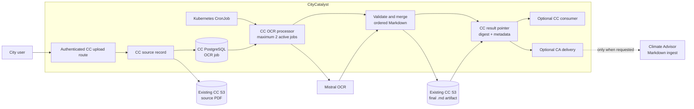

# CityCatalyst PDF OCR to Markdown Architecture

Status: Draft

Last updated: 2026-07-15

## Decision Summary

CityCatalyst (CC) owns the shared PDF-to-Markdown conversion capability. CC
authenticates the user, stores the source PDF, queues and runs Mistral OCR,
validates and stores the final Markdown, reports status, and retries failures.
Climate Advisor (CA) is not required for conversion.

The completed `.md` artifact can be consumed in two ways:

- CC can use it directly, for example as input to inventory extraction.
- CC can optionally pass it to CA when a CA workflow such as Concept Note
  Builder needs document context.

The key decisions are:

- Source PDFs and final Markdown reuse the existing CC S3 setup.
- OCR job state and the authoritative result pointer live in CC PostgreSQL.
- The internal conversion key is `(source_type, source_id)`; there is no second
  public OCR job ID.
- A CC-owned PostgreSQL queue and Kubernetes CronJob provide durable processing
  and restart recovery.
- CC runs no more than two Mistral conversions concurrently.
- CC stores a successful Markdown artifact before any consumer is invoked.
- Delivery to CA is optional, consumer-specific, and independently retryable.
  A CA failure never causes successful OCR to run again.
- The MVP accepts `application/pdf` files up to 20 MB.

## Relationship to the Markdown Schema Contract

[cc_ca_markdown_output_schema_contract.md](cc_ca_markdown_output_schema_contract.md)
is used as the source of truth for the required Markdown shape: ordered pages,
structured tables, headers, aligned rows and columns, captions, units, years,
totals, numeric values, and retained source context.

This architecture does not use that document to assign runtime ownership. The
converter ownership, queue, storage, and optional consumer handoff are defined
here. The schema contract remains unchanged.

## Scope

Included:

- PDF validation and storage through existing CC upload paths.
- Durable CC queueing, leases, retries, and status-only reporting.
- Mistral OCR and ordered page-to-Markdown assembly.
- Contract validation and authoritative Markdown storage in CC.
- Direct CC consumption of completed Markdown.
- Optional delivery of completed Markdown to CA.

Excluded:

- Inventory row extraction, schema mapping, approval, or database import.
- CNB excerpt selection, indexing, context assembly, drafting, or export.
- Public page, chunk, stage, or percentage progress.
- A browser-to-CA PDF upload or OCR route.
- A CA OCR queue, dispatcher, worker, Mistral secret, or S3 capability.
- DOCX, spreadsheet, image, or HTML normalization.

## System Flow



The conversion is complete when CC has stored the Markdown and persisted its
result metadata. Consumer processing is not part of OCR completion.

## Ownership Boundary

| Component | Responsibility |
| --- | --- |
| CC domain routes | Authenticate the user, authorize the source, upload the PDF, and expose status/retry actions. |
| CC OCR service | Create or reuse jobs, call Mistral, merge and validate Markdown, store the result, and dispatch optional consumers. |
| CC PostgreSQL | Store source records, durable OCR state, leases, attempts, result pointers, and optional-delivery state. |
| Existing CC S3 | Store authoritative source PDFs and Markdown artifacts. |
| Kubernetes CronJob | Invoke the internal CC job processor. |
| Mistral OCR | Produce page-level Markdown from the source PDF. |
| Climate Advisor | Optionally accept a completed `.md` artifact for a CA workflow; it does not participate in OCR. |

CA owns no OCR status, Mistral configuration, result S3 pointer, or conversion
retry policy. CC can complete conversion while CA is unavailable.

## Source Identity

The shared converter supports namespaced source pairs:

| `source_type` | `source_id` | Source resolver |
| --- | --- | --- |
| `inventory_import` | `ImportedInventoryFile.id` | Existing inventory import record and `s3Key`. |
| `concept_note_upload` | CC-created upload ID | CC stored-file record linked to the authorized CNB run. |

Rules:

- `(source_type, source_id)` uniquely identifies one logical conversion.
- The source pair is internal; browser routes continue using domain IDs.
- Repeated start requests reuse the existing job.
- Replacing a source creates a new source ID. Retrying keeps the same pair and
  increments `attempt_count`.
- CC reads filename, MIME type, size, and S3 pointer from its authoritative
  source record.
- A deleted, replaced, or unauthorized source is never rebound to an old job.

## API and Authentication

The browser calls CityCatalyst only. There is no public generic OCR API and no
browser-to-CA conversion path.

### CC domain routes

| Endpoint | Purpose |
| --- | --- |
| `POST /api/v1/city/{city}/inventory/{inventory}/import/{importedFileId}/extract` | Authorize the inventory PDF and create or reuse OCR work. |
| `GET /api/v1/city/{city}/inventory/{inventory}/import/{importedFileId}` | Return the existing import/OCR status. |
| `POST /api/v1/concept-notes/{run_id}/uploads` | Authorize, validate, store, and enqueue a CNB source PDF. |
| `GET /api/v1/concept-notes/{run_id}/uploads/{upload_id}` | Return file-specific OCR and optional-delivery status. |
| `POST /api/v1/concept-notes/{run_id}/uploads/{upload_id}/retry` | Retry failed OCR or retry only the optional handoff. |

Internal OCR states are:

- `queued`
- `running`
- `succeeded`
- `failed`

No page or percentage counters are exposed.

### Internal processor route

The CC Kubernetes CronJob calls:

```http
POST /api/v1/cron/process-pdf-ocr-jobs
Authorization: Bearer <CC_CRON_JOB_API_KEY>
```

The route is internal to the cluster, validates the existing cron secret, and
claims at most two jobs. The CronJob uses `concurrencyPolicy: Forbid`.

### Optional CA Markdown endpoint

When a workflow requires CA, CC uses the existing CC-to-CA user-scoped token
flow and calls:

```http
POST /v1/concept-notes/{run_id}/uploads/{upload_id}/markdown
Authorization: Bearer <CC-issued user-scoped token>
Content-Type: application/json
```

```json
{
  "markdown": "<!-- page: 1 -->\n# Climate Action Plan\n...",
  "filename": "climate-action-plan.pdf",
  "source_label": "Climate Action Plan",
  "page_count": 42,
  "sha256": "64-character-lowercase-hex-digest"
}
```

CA returns `202 Accepted` after durably registering the Markdown for its
workflow. Repeating the same upload and digest is idempotent. A different digest
for the same immutable upload returns `409 markdown_identity_conflict`.

This endpoint is an optional consumer interface, not part of OCR completion.
The request contains no PDF bytes, S3 key, signed result URL, Mistral settings,
or OCR instructions.

## Processing

1. A CC domain route authenticates the user, checks access, validates
   `application/pdf` and the 20 MB limit, and stores the source in existing CC
   S3.
2. CC creates or reuses the OCR row for `(source_type, source_id)` and returns
   without waiting for conversion.
3. The CronJob calls the CC processor. The processor claims at most two due jobs
   using `FOR UPDATE SKIP LOCKED` and establishes leases.
4. CC re-resolves the source record and validates its identity and metadata.
5. CC creates an attempt-scoped URL for the exact source object and calls
   [Mistral OCR](https://docs.mistral.ai/api/endpoint/ocr).
6. CC validates the response, orders pages by source index, and rejects missing
   or duplicate pages.
7. CC combines the page Markdown with stable `<!-- page: N -->` separators. It
   preserves table continuity and never inserts a separator inside a row.
8. CC validates the combined document against the Markdown schema contract,
   calculates its SHA-256 digest, and stores the `.md` object.
9. CC persists the result pointer, digest, byte size, page count, model, and
   completion timestamp, then marks OCR `succeeded`.
10. CC invokes the configured consumer, if any. Inventory can remain inside CC;
    CNB can request optional Markdown delivery to CA.
11. Temporary state and attempt-scoped URLs are discarded.

## Markdown Output Requirements

The converter produces one UTF-8 Markdown document containing all pages in
source order. It applies the unchanged schema contract as an output-quality
check.

Required behavior:

- Tables use Markdown table syntax with exact headers and aligned values.
- Captions, titles, row and column order, totals, subtotals, units, scale, and
  year context are retained.
- Numeric values remain digits and follow the contract's separator rules.
- GPC references, scopes, gas columns, activity types, amounts, methods, and
  source labels are retained when present.
- Narrative sections remain available for consumers such as CNB.
- CC does not aggregate, deduplicate, drop, classify, or semantically rewrite
  source rows during conversion.

The output contract's `ExtractedRow[]` is a downstream CC consumer shape. The
OCR service does not produce that JSON or perform inventory business mapping.

## Persistence

### Source records

- Inventory imports continue to use `ImportedInventoryFile.s3Key`.
- Concept Note uploads use a CC stored-file record linked to the run and current
  permission scope.
- Source objects are immutable; replacement creates a new source ID.

### `PdfOcrJob`

One logical CC row exists per source pair:

```text
source_type
source_id
status
attempt_count
run_after
model
page_count
result_s3_key
result_size_bytes
result_sha256
lease_owner
lease_expires_at
heartbeat_at
started_at
completed_at
error_code
error_message
delivery_target
delivery_status
delivery_attempt_count
delivery_run_after
delivered_at
delivery_error_code
delivery_error_message
created_at
updated_at
```

The unique key is `(source_type, source_id)`. `delivery_target` is null when no
external consumer is required. For CNB it is `climate_advisor` and
`delivery_status` is `pending`, `delivering`, `delivered`, or `failed`.

The row stores no PDF bytes, Markdown bytes, signed URLs, access tokens, or CA
workflow state.

### Result object

CC derives the key:

```text
pdf-ocr/results/{source_type}/{source_id}/{attempt_count}/combined_markdown.md
```

The result is authoritative only after both S3 storage and the CC database
update succeed. It follows the lifecycle of the source file. Callers never
provide raw S3 keys.

## Queue, Concurrency, and Recovery

- The CronJob schedule is `* * * * *` with overlapping runs forbidden.
- Each run claims and processes no more than two OCR jobs.
- Database leases prevent duplicate work across CC web replicas.
- Claims use `FOR UPDATE SKIP LOCKED`.
- Leases last ten minutes and receive a heartbeat every 60 seconds.
- After an expired lease, the next processor restarts the attempt from the
  stored source PDF.
- One Mistral request is active per job and no more than two globally.
- No page/chunk state or public progress is persisted in the MVP.

## Failures and Retries

OCR allows at most three attempts with bounded backoff.

| Failure | Behavior |
| --- | --- |
| Invalid MIME, signature, size, encryption, or unreadable PDF | Fail permanently with a sanitized validation code. |
| Missing, deleted, or changed source | Fail permanently; never rebind the job. |
| Mistral authentication failure | Fail without automatic retry and alert operations. |
| Mistral `429`, `5xx`, or timeout | Retry while attempts remain. |
| Empty, malformed, or incomplete Markdown response | Retry while attempts remain, then fail. |
| CC result storage or metadata update failure | Retry finalization safely. |
| Optional CA delivery unavailable | Keep OCR `succeeded`; retry from stored Markdown only. |
| CA digest conflict | Stop delivery retries and surface `markdown_identity_conflict`. |

Retrying optional delivery never increments the OCR attempt count and never
calls Mistral again.

## Configuration

CC secret:

```text
MISTRAL_API_KEY
```

CC non-secret runtime configuration:

```text
MISTRAL_OCR_MODEL=mistral-ocr-latest
PDF_OCR_MAX_FILE_MB=20
PDF_OCR_MAX_CONCURRENCY=2
PDF_OCR_MAX_ATTEMPTS=3
PDF_OCR_JOB_TIMEOUT_SECONDS=600
PDF_OCR_REQUEST_TIMEOUT_SECONDS=180
PDF_OCR_CRON_BATCH_SIZE=2
```

No OCR setting or Mistral secret is added to CA. Consumer-specific CA endpoint
configuration is separate from converter configuration.

## Security and Observability

- CC rechecks access at upload, status, retry, result consumption, and optional
  CA delivery.
- Mistral receives only an attempt-scoped URL for the exact source object.
- Signed URLs, tokens, PDF contents, Markdown contents, S3 keys, and secrets are
  never logged.
- Logs may include source type/ID, attempt, status, page count, duration, result
  size, digest prefix, and sanitized error code.
- Metrics cover queue depth and age, active work, Mistral latency and rate
  limits, retries, lease recovery, output size, and optional delivery failures.
- OCR success always corresponds to a readable CC-owned Markdown artifact.

## Acceptance Scenarios

1. An inventory PDF converts entirely within CC and the resulting Markdown can
   be passed directly to `InventoryExtractionService`.
2. A CNB PDF converts through the same CC service, after which CC optionally
   sends the stored `.md` content to CA.
3. CC completes OCR successfully while CA is unavailable.
4. A later CA delivery retry uses the stored digest without another Mistral call.
5. Duplicate start or CronJob requests reuse one source-pair job.
6. A multi-page inventory table retains its headers, rows, units, years, totals,
   and source order.
7. CA has no OCR table, dispatcher, worker, Mistral secret, or S3 permission.
