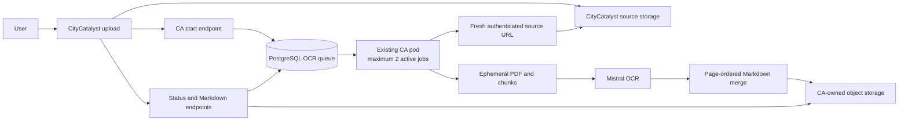

# Climate Advisor PDF OCR to Markdown Architecture

Status: Draft

Last updated: 2026-07-14

## Decision Summary

Climate Advisor (CA) will convert CityCatalyst inventory PDFs to Markdown with
Mistral OCR. The first version uses the existing CA pod and adds no separate OCR
worker, Kubernetes workload, persistent volume, or public upload endpoint.

The key decisions are:

- CityCatalyst owns the source PDF and authenticates the user.
- CA accepts work asynchronously and stores job state in PostgreSQL.
- `ImportedInventoryFile.id` is the only public job key; there is no second job
  ID and no hash-based idempotency scheme.
- The existing CA process runs at most two PDF jobs concurrently.
- Source PDFs and temporary chunks are never stored in PostgreSQL.
- Temporary files use the pod's ephemeral filesystem and are deleted after each
  attempt.
- Final Markdown is stored in CA-owned object storage and downloaded through an
  authenticated CA endpoint.
- CA stops after producing Markdown. It does not extract rows, map schemas,
  validate business data, or trigger another workflow.

The MVP supports PDFs up to 50 MB. A later increase should be based on measured
memory, storage, latency, and provider behavior.

## Scope

Included:

- PDF validation, page-range chunking, Mistral OCR, ordered Markdown merging,
  result storage, retries, and status reporting.
- A durable PostgreSQL queue that survives pod restarts.
- Two active conversions with one Mistral request per conversion.

Excluded:

- Vision refinement, image descriptions, structured extraction, schema mapping,
  database loading, callbacks, and workflow continuation.
- Page, chunk, percentage, or stage progress in the public API.
- A separate OCR pod, Deployment, Service, HPA, PV, or PVC.
- Multiple CA replicas or Uvicorn workers before a distributed OCR limiter
  exists.

## System Flow



## Service Boundary

| Component      | Responsibility                                                          |
| -------------- | ----------------------------------------------------------------------- |
| CityCatalyst   | User authorization, source upload, source ownership, and access checks. |
| CA API         | Start/status/download endpoints and service authentication.             |
| CA dispatcher  | Queue claiming, validation, OCR, retries, merge, upload, and cleanup.   |
| PostgreSQL     | Durable job status, attempts, leases, timestamps, and sanitized errors. |
| Object storage | Final Markdown artifacts only.                                          |
| Mistral        | PDF page OCR and Markdown generation.                                   |

The conversion is complete when status is `succeeded` and the Markdown is
downloadable. Any later use of that Markdown belongs to the caller.

## API and Authentication

The browser does not call the OCR endpoints directly. CityCatalyst calls CA with
a dedicated service bearer token. CA uses the existing service-key plus
user-scoped-token pattern when requesting the source PDF from CityCatalyst.

| Endpoint                                                         | Purpose                                                                               |
| ---------------------------------------------------------------- | ------------------------------------------------------------------------------------- |
| `POST /v1/pdf-ocr/imports/{imported_file_id}`                    | Create, reuse, or explicitly retry a conversion. Returns quickly with `202 Accepted`. |
| `GET /v1/pdf-ocr/imports/{imported_file_id}`                     | Return conversion status and sanitized failure details.                               |
| `GET /v1/pdf-ocr/imports/{imported_file_id}/markdown`            | Return `text/markdown` after successful conversion.                                   |
| `POST /api/v1/internal/ca/imports/{imported_file_id}/source-url` | Let CA obtain a fresh short-lived source URL for an attempt.                          |

The start request carries trusted `user_id`, `city_id`, `inventory_id`, source
filename, and size metadata. These values support auditing and source lookup;
they are not authorization credentials.

Public status values are:

- `queued`
- `running`
- `succeeded`
- `failed`
- `expired`

Status responses include the imported-file ID, status, timestamps, and a stable
sanitized error when relevant. They do not expose storage keys, signed URLs, or
progress details.

Repeated start requests for the same `imported_file_id` return the existing job.
An explicit retry may requeue a `failed` or `expired` job while the source still
exists. A new upload receives a new `ImportedInventoryFile.id`.

## Processing

1. CityCatalyst verifies access to the imported PDF and calls CA.
2. CA creates or reuses the PostgreSQL job and returns immediately.
3. The in-process dispatcher claims jobs while one of its two slots is free.
4. The task obtains a fresh source URL and streams the PDF to temporary disk.
5. CA validates the PDF signature, size, page count, encryption, and readability.
6. CA creates ordered page-range chunks under `/tmp/pdf-ocr`.
7. Each active job sends one Mistral request at a time; the process-wide limit is
   two requests.
8. Returned chunk Markdown is written to temporary files and merged in page
   order with clear page separators.
9. CA uploads the final Markdown and marks the job `succeeded` only after the
   artifact is readable.
10. Temporary files are removed in `finally`, including after failure or
    shutdown.

Recommended page separator:

```markdown
<!-- page: 12 -->
```

## Persistence and Recovery

`pdf_ocr_imports` contains one row per `imported_file_id`. It stores:

- trusted source metadata and CityCatalyst context IDs
- status, model, page count, and result key
- sanitized error code and message
- attempt count
- lease owner, lease expiry, and heartbeat time
- created, started, completed, and updated timestamps
- result expiry

The dispatcher claims rows using PostgreSQL row locking with
`FOR UPDATE SKIP LOCKED`. A running job has a ten-minute lease that is extended
every 60 seconds. If the pod stops, the restarted CA process reclaims expired
leases and restarts the whole conversion attempt.

Chunk files are not durable resume artifacts, and there is no chunk table. This
keeps recovery simple and avoids a persistent volume.

Final Markdown is stored under a CA-owned bucket or prefix such as:

```text
pdf-ocr/imports/{imported_file_id}/{attempt_count}/combined_markdown.md
```

The initial retention period is 14 days. Expired or unexpectedly missing results
return `410 Gone` and may be regenerated while the source PDF still exists.

## Configuration

Behavior settings belong in `climate-advisor/llm_config.yaml`:

```yaml
pdf_ocr:
  enabled: true
  model: "mistral-ocr-latest"
  max_file_mb: 50
  max_pages: 500
  chunk_target_mb: 15
  chunk_max_pages: 50
  max_active_jobs: 2
  chunk_concurrency_per_import: 1
  global_mistral_concurrency: 2
  max_job_attempts: 3
  max_chunk_attempts: 3
  lease_duration_seconds: 600
  lease_heartbeat_seconds: 60
  job_timeout_minutes: 45
  mistral_request_timeout_seconds: 180
  source_download_timeout_seconds: 120
  result_retention_days: 14
```

Secrets such as `MISTRAL_API_KEY`, service tokens, and object-storage credentials
remain in the runtime environment. Bucket, region, and prefix are configured per
environment.

## Failures and Retries

Retry individual Mistral requests for `429`, transient `5xx`, timeouts, and
connection resets, using exponential backoff with jitter and `Retry-After` when
available.

Do not retry invalid, encrypted, corrupt, oversized, over-page-limit, or
unsupported PDFs. Provider authentication failure is an operator alert, not a
document retry.

The overall 45-minute timeout includes download, validation, OCR, merge, and
result upload. User-facing responses use stable codes such as:

- `file_too_large`
- `too_many_pages`
- `encrypted_pdf`
- `corrupt_pdf`
- `source_unavailable`
- `ocr_provider_rate_limited`
- `ocr_provider_failed`
- `job_timeout`
- `result_missing`

Raw provider messages are kept out of API responses.

## Concurrency and Kubernetes

The MVP requires:

- one existing CA pod
- one Uvicorn process
- two active PDF jobs
- one active Mistral request per job
- two Mistral requests globally

If five PDFs arrive together, two run and three stay queued. Completing either
running job frees a slot for the next queued job.

No new Kubernetes workload or persistent volume is needed. The existing CA
Deployment needs the OCR secret/configuration, object-storage access, sufficient
resources, and shutdown grace.

Initial resource target:

```text
cpu request: 500m
memory request: 1Gi
ephemeral storage request: 2Gi
terminationGracePeriodSeconds: 240
```

On `SIGTERM`, CA stops claiming jobs, finishes only work that fits within the
remaining grace period, releases unfinished leases, and deletes temporary files.

Two concurrent 50 MB PDFs must be benchmarked against CA chat/API latency and
memory use before production enablement. Do not increase concurrency or CA
replicas before implementing a distributed limiter.

## Security and Observability

- Do not log service tokens, signed URLs, raw PDFs, full Markdown, storage keys,
  or raw provider responses.
- Logs may include request/import IDs, status transitions, durations, page and
  chunk counts, attempt numbers, and sanitized error codes.
- Metrics should cover queue depth/age, active jobs, duration, failures, retries,
  Mistral `429`s, lease recovery, and missing results.
- A `succeeded` state must always correspond to a readable Markdown artifact.

## `PDF_converter` Reuse Boundary

Reuse the useful stage-one concepts from
`Open-Earth-Foundation/PDF_converter`:

- Mistral OCR client behavior
- page or page-range OCR
- bounded provider concurrency
- deterministic page-order merging
- clear page separators

Do not copy its CLI assumptions, permanent local-output contract, vision agents,
structured extraction, mapping, database loading, or storage/retry behavior that
bypasses CA's job state.

## Verification

The implementation must verify:

- service authentication and source-access checks
- repeated start/retry behavior and valid state transitions
- PDF validation and stable error classification
- ordered chunk planning and deterministic Markdown merging
- retry limits, timeouts, leases, heartbeat, restart recovery, and shutdown
- no more than two active jobs or two global Mistral requests
- source, chunk, and merged temporary-file cleanup
- successful Markdown storage/download and result expiry
- no callback, row extraction, schema mapping, or post-processing call
- CA chat/API responsiveness during two simultaneous 50 MB conversions

## Remaining Decisions

- Confirm whether 500 pages is the first production cap after benchmarking.
- Confirm the sanitized message for each stable error code.
- Select the CA-owned bucket/prefix and workload identity for each environment.
- Decide later whether Mistral batch processing is useful for non-interactive
  bulk conversions.
