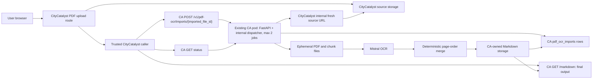

# Climate Advisor PDF OCR to Markdown Architecture

Status: Draft

Last updated: 2026-07-13

## Summary

Climate Advisor (CA) should expose a minimal asynchronous PDF OCR service that converts CityCatalyst inventory PDFs into Markdown using Mistral OCR. The MVP should support PDFs up to 50 MB and concurrent submissions from multiple users without holding a web request open for OCR completion. The existing CA pod hosts both the HTTP endpoints and an internal background dispatcher that runs at most two PDF conversions concurrently.

The workflow remains keyed by CityCatalyst's `ImportedInventoryFile.id`; there is no second public job ID. CA's responsibility ends when the OCR job is `succeeded` and the Markdown is available from the authenticated download endpoint. Anything a caller does with that Markdown is outside this architecture.

The service boundary is explicit:

- CityCatalyst authenticates users and owns the original PDF.
- CA authenticates CityCatalyst as a service, queues OCR, produces Markdown, and stores the derived artifact.
- CA obtains a fresh source download URL from an authenticated CityCatalyst internal endpoint when a conversion attempt starts. Signed URLs are not persisted in the OCR row.
- CA stores final Markdown in CA-owned object storage. The trusted caller retrieves it through CA's authenticated Markdown endpoint rather than reading CA storage directly.
- The MVP exposes only status and timestamps, not page or chunk progress.
- CA does not parse the Markdown into records, map it to a schema, extract inventory rows, validate business data, or trigger another workflow.

The first implementation should reuse only the Mistral OCR ideas from `Open-Earth-Foundation/PDF_converter`: bounded parallel OCR, page-ordered Markdown, and deterministic merging. It should not import the repository's CLI assumptions, local output contract, vision-refinement agent, structured extraction, mapping, or database-loading stages.

## Goals

- Convert PDF files to Markdown with Mistral OCR.
- Support PDF inputs up to 50 MB as a normal case.
- Preserve page order and document layout in the generated Markdown.
- Give users a recoverable long-running state: queued/running/succeeded/failed/expired.
- Support multiple submitting users through a durable queue and fair job claiming.
- Process up to two PDFs concurrently inside the existing CA pod.
- Protect CA and Mistral from unbounded concurrent OCR requests.
- Reuse CityCatalyst upload, storage, and auth concepts where practical.
- Stop processing immediately after the final Markdown artifact is stored.
- Define retries, leases, timeouts, retention, and shutdown behavior before implementation.

## Non-Goals

- No vision-refinement agent in the first pass.
- No structured extraction, schema mapping, record creation, or business-data validation.
- No callback, continuation worker, import approval, or post-OCR workflow.
- No PDF preview or image-asset serving from the OCR endpoint.
- No permanent public exposure of uploaded PDFs.
- No Mistral batch processing in the first implementation.
- No page-level, chunk-level, percentage, or stage progress in the MVP API.
- No separate PDF upload endpoint in CA for the MVP.
- No direct CityCatalyst access to CA's object-storage credentials or internal result key.
- No separate OCR worker pod, Deployment, Service, PV, or PVC for the MVP.
- No scaling beyond one CA pod and one Uvicorn process until a distributed OCR limiter exists.
- No resume-from-individual-chunk behavior in the MVP.

## Current State

CityCatalyst already has a PDF import path:

- `app/src/app/api/v1/city/[city]/inventory/[inventory]/import/route.ts` accepts PDF uploads and stores them in S3 when configured, with a database fallback for local development.
- PDF uploads are marked `pending_ai_extraction`.
- `app/src/app/api/v1/city/[city]/inventory/[inventory]/import/[importedFileId]/extract/route.ts` currently reads the stored PDF and extracts local text through `PdfToTextService`.
- `app/src/backend/PdfToTextService.ts` uses local PDF text extraction and is not OCR-quality for scanned PDFs.

CA already has:

- A FastAPI app under `climate-advisor/service/app`.
- Routes under `climate-advisor/service/app/routes`.
- Business logic under `climate-advisor/service/app/services`.
- Settings in `climate-advisor/service/app/config/settings.py`.
- A `CityCatalystClient` and CA-to-CityCatalyst service-auth pattern using a service key plus user-scoped bearer token.

The external `PDF_converter` repository has a stage-1 PDF-to-Markdown path:

- Mistral OCR produces page-level Markdown.
- Large PDFs can be split into page ranges.
- Split OCR runs with bounded concurrency.
- The final output is joined deterministically.

## Provider Constraints

Mistral's current OCR documentation describes page-level Markdown output and accepts PDFs through a URL, base64 data, or uploaded files. Mistral's known-limitations page currently lists a 512 MB upload limit, 30-day retention for uploaded files unless deleted earlier, organization-level rate limits, and `429 Too Many Requests` when rate limits are exceeded.

Those provider limits are not CityCatalyst limits. A 50 MB application cap is still required because OCR jobs can create substantial temporary disk use, egress, provider calls, cost, and latency.

References checked on 2026-07-13:

- https://docs.mistral.ai/studio-api/document-processing/basic_ocr
- https://docs.mistral.ai/resources/known-limitations

## Conversion Boundary

The conversion contract is complete when CA makes Markdown downloadable:

1. CityCatalyst validates the signed-in user and imported file.
2. CityCatalyst calls CA's start endpoint with service authentication.
3. CA returns `202 Accepted` and performs PDF-to-Markdown conversion asynchronously.
4. The trusted caller reads CA's status endpoint.
5. When status is `succeeded`, the caller may download the Markdown.
6. CA performs no work after serving the Markdown response.

There is no completion callback, CityCatalyst continuation worker, row extraction, schema conversion, approval step, or post-processing contract in this design. Status reads only observe the conversion state.

## Proposed Architecture



## Trust Boundary and Authentication

The browser never calls the CA OCR endpoints directly in the MVP.

CityCatalyst-to-CA requests use a dedicated service bearer token:

```text
Authorization: Bearer <CC_TO_CA_OCR_TOKEN>
```

`CC_TO_CA_OCR_TOKEN` is a runtime secret configured in both services. CA validates it before reading any request body. A `user_id` supplied by CityCatalyst is metadata for auditing and CA-to-CityCatalyst token refresh; it is not an authorization credential.

CA-to-CityCatalyst source requests reuse the established internal service-auth pattern:

```text
Authorization: Bearer <user-scoped CityCatalyst token>
X-Service-Name: climate-advisor
X-Service-Key: <CC_SERVICE_API_KEY>
```

CityCatalyst verifies that the authenticated token subject owns or can access the imported file and that the path ID belongs to the supplied city/inventory context. Status and Markdown endpoints do not accept `user_id` query parameters. If a browser-direct API is added later, it must validate a real user JWT and derive the user identity from that JWT.

## API Design

### Start or Reuse OCR

`POST /v1/pdf-ocr/imports/{imported_file_id}`

Request:

```json
{
  "user_id": "uuid-or-user-id",
  "city_id": "uuid",
  "inventory_id": "uuid",
  "source": {
    "type": "citycatalyst_import",
    "file_name": "inventory.pdf",
    "size_bytes": 10485760
  },
  "retry": false
}
```

The caller cannot choose the model or OCR output settings. CA loads the current settings from `climate-advisor/llm_config.yaml` when the job is queued.

Queued response:

```json
{
  "imported_file_id": "uuid",
  "status": "queued",
  "created_at": "2026-07-13T12:00:00Z",
  "updated_at": "2026-07-13T12:00:00Z"
}
```

### Read OCR Status

`GET /v1/pdf-ocr/imports/{imported_file_id}`

Running response:

```json
{
  "imported_file_id": "uuid",
  "status": "running",
  "created_at": "2026-07-13T12:00:00Z",
  "updated_at": "2026-07-13T12:04:00Z",
  "error": null
}
```

Succeeded response:

```json
{
  "imported_file_id": "uuid",
  "status": "succeeded",
  "updated_at": "2026-07-13T12:08:00Z",
  "markdown_result": {
    "available": true,
    "sha256": "hex-encoded-sha256"
  },
  "error": null
}
```

Failed response:

```json
{
  "imported_file_id": "uuid",
  "status": "failed",
  "updated_at": "2026-07-13T12:08:00Z",
  "markdown_result": null,
  "error": {
    "code": "encrypted_pdf",
    "message": "The PDF is encrypted and cannot be processed."
  }
}
```

This API intentionally has no page, chunk, percentage, or stage fields. `updated_at` lets CityCatalyst distinguish an active job from stale state, and the UI can show elapsed time and a stable "Processing PDF" message without pretending to know completion percentage.

### Download Markdown

`GET /v1/pdf-ocr/imports/{imported_file_id}/markdown`

This is the only MVP result-delivery path. It returns `text/markdown` after service authentication and only while the job is `succeeded` and the artifact exists. Recommended response headers:

```text
ETag: <result_sha256>
X-OCR-Model: <model>
X-OCR-Page-Count: <page_count>
X-Source-File-Name: <sanitized_file_name>
```

The status response never exposes `result_storage_key`. CityCatalyst does not receive CA object-storage credentials.

Expected result errors:

- `409 Conflict` when OCR is not yet succeeded.
- `410 Gone` with `result_missing` when the result expired or disappeared.
- `404 Not Found` for an unknown imported-file ID.

### Cancel OCR

`POST /v1/pdf-ocr/imports/{imported_file_id}/cancel`

Cancellation is optional for the first implementation. If included, the conversion task checks terminal status before starting each chunk and before publishing the final result.

### Resolve a Fresh Source URL in CityCatalyst

`POST /api/v1/internal/ca/imports/{imported_file_id}/source-url`

This CityCatalyst internal endpoint is called by the CA background conversion task when an attempt starts and again after a retryable source-download failure. It authenticates CA using the existing service headers plus a user-scoped bearer token.

Response:

```json
{
  "download_url": "https://short-lived-url.example/...",
  "expires_at": "2026-07-13T12:15:00Z",
  "file_name": "inventory.pdf",
  "content_type": "application/pdf",
  "size_bytes": 10485760
}
```

The endpoint can resolve either the production S3 object or the local database fallback. CA streams the complete PDF to temporary disk within `source_download_timeout_seconds`; chunk OCR never depends on the source URL remaining valid after download. CA stores the durable source metadata, not `download_url` or `expires_at`.

## Idempotency

`imported_file_id` is the sole idempotency key. CityCatalyst creates a new `ImportedInventoryFile.id` for a new upload and must not reuse an existing ID for different PDF bytes.

The `pdf_ocr_imports` table has one row per `imported_file_id`. Start behavior is:

- `queued`, `running`, or `succeeded`: return the existing status.
- `failed` or `expired` with `retry=false`: return the existing terminal status.
- `failed` or `expired` with `retry=true`: reset the attempt budget and set the row to `queued` when the CityCatalyst source still exists.

Model or configuration changes do not automatically create a new OCR run for an existing imported-file ID. A new upload receives a new ID; an explicit retry uses the configuration active when it is requeued.

## Job State Model

Statuses:

- `queued`: accepted but not claimed.
- `running`: claimed and downloading, validating, chunking, OCRing, merging, or uploading.
- `succeeded`: final Markdown is available.
- `failed`: a permanent error occurred or retry limits were exhausted.
- `expired`: the final Markdown is no longer available and the source may be reprocessed.
- `canceled`: optional terminal state when cancellation is implemented.

Recommended table: `pdf_ocr_imports`

Fields:

- `imported_file_id` primary key
- `user_id` trusted metadata, not authorization
- `city_id`
- `inventory_id`
- `status`
- `source_file_name`
- `source_size_bytes`
- `model`
- `page_count`
- `result_storage_key` internal to CA
- `result_sha256`
- `result_expires_at`
- `error_code`
- `error_message` sanitized for service/UI use
- `attempt_count`
- `lease_owner`
- `lease_expires_at`
- `heartbeat_at`
- `created_at`
- `started_at`
- `completed_at`
- `updated_at`

There is no chunk table or public progress JSON in the MVP. Only job-level `attempt_count` is durable. Chunk retries are in-process and appear in logs/metrics; if the CA process restarts, a reclaimed job restarts from the PDF source.

## Processing Flow

1. CityCatalyst validates that the signed-in user can access the inventory import.
2. CityCatalyst records the source file name and size.
3. CityCatalyst calls the CA start endpoint with the dedicated service token and trusted metadata.
4. CA creates or reuses the OCR row according to the `imported_file_id` idempotency rules and returns quickly.
5. The FastAPI lifespan starts one internal dispatcher when the existing CA process starts.
6. The dispatcher maintains two active-job slots and claims queued jobs while a slot is available.
7. Each claimed conversion task starts a lease heartbeat and checks the overall job timeout.
8. The task obtains a fresh source URL from the CityCatalyst internal endpoint.
9. The task streams the PDF to `/tmp/pdf-ocr/{imported_file_id}/{attempt}/source.pdf` and verifies its size.
10. The task validates MIME/signature, readability, encryption state, corruption, non-zero page count, file-size limit, and page-count limit before any Mistral call.
11. The task plans ordered page-range chunks.
12. Each chunk PDF and returned Markdown is written under the attempt directory rather than accumulated only in memory.
13. Each job sends at most one Mistral OCR request at a time; the process-wide semaphore permits two Mistral requests in total.
14. The task streams chunk Markdown in page order into a final temporary Markdown file with deterministic page separators.
15. The task uploads final Markdown to CA-owned object storage and records its SHA-256 and expiry.
16. The task marks the row `succeeded` only after the artifact is readable from result storage.
17. The task removes source, chunk, and merged temporary files in `finally`, stops its heartbeat, and frees an active-job slot.

The CA process also removes stale attempt directories on startup. No success status may reference a result that was not successfully uploaded. The conversion service performs no further processing after this point.

## Validation and Stable Errors

Validation occurs before provider calls and returns stable error codes. Raw Mistral messages, credentials, URLs, and storage keys must not reach the caller.

| Error code                  | Retry                         | Sanitized service message                                        |
| --------------------------- | ----------------------------- | ---------------------------------------------------------------- |
| `invalid_mime_type`         | No                            | The uploaded file is not a supported PDF.                        |
| `not_pdf`                   | No                            | The uploaded file is not a valid PDF.                            |
| `file_too_large`            | No                            | The PDF is too large for AI extraction.                          |
| `too_many_pages`            | No                            | The PDF has too many pages for AI extraction.                    |
| `encrypted_pdf`             | No                            | Encrypted or password-protected PDFs are not supported.          |
| `corrupt_pdf`               | No                            | The PDF appears to be damaged and could not be read.             |
| `zero_pages`                | No                            | The PDF contains no readable pages.                              |
| `source_unavailable`        | Yes                           | We could not retrieve the uploaded PDF. Please try again.        |
| `ocr_provider_rate_limited` | Yes                           | PDF processing is temporarily busy. We will retry automatically. |
| `ocr_provider_auth_failed`  | No; alert operators           | PDF processing is temporarily unavailable.                       |
| `ocr_provider_failed`       | Yes when classified transient | We could not read this PDF. Try again or contact support.        |
| `job_timeout`               | Yes only as a new job attempt | PDF processing took too long. Please try again.                  |
| `result_missing`            | Yes while source exists       | The processed result expired and must be generated again.        |
| `unknown`                   | Policy-dependent              | PDF processing failed. Please try again or contact support.      |

CA status responses expose only the stable code and sanitized message. Detailed provider diagnostics stay in structured logs.

## Size and Timeout Policy

Behavior settings belong in `climate-advisor/llm_config.yaml`:

```yaml
pdf_ocr:
  enabled: true
  model: "mistral-ocr-latest"
  max_file_mb: 50
  max_pages: 500
  chunk_target_mb: 15
  chunk_max_pages: 50
  max_active_jobs: 2
  chunk_concurrency_per_import: 1
  global_mistral_concurrency: 2
  max_job_attempts: 3
  max_chunk_attempts: 3
  lease_duration_seconds: 600
  lease_heartbeat_seconds: 60
  job_timeout_minutes: 45
  mistral_request_timeout_seconds: 180
  source_download_timeout_seconds: 120
  queue_age_warning_minutes: 15
  result_retention_days: 14
```

Rationale:

- 50 MB is the MVP application limit and remains well below the provider upload limit.
- 500 pages bounds latency and cost until benchmarks justify a higher cap.
- 15 MB/50-page chunk targets make provider retries smaller and bound temporary artifacts.
- Two active jobs let two users' PDFs progress concurrently. One provider request per job and a global limit of two prevent either job from monopolizing Mistral capacity.
- The 45-minute job timeout covers CA source download, validation, OCR, merge, and result upload.
- A provider request timeout is separate from total job timeout and source-download timeout.
- Queue age produces a metric/alert; queue waiting alone does not fail a job.

At every retry boundary, the conversion task checks `now() - started_at`. Once it exceeds `job_timeout_minutes`, the task marks the job `failed` with `job_timeout`. A Mistral request timeout is classified as a retryable chunk error while attempts and total job time remain.

## Chunking and Temporary Artifacts

Each in-process conversion task splits by ordered page ranges with byte-size feedback:

1. Inspect page count.
2. Create chunks of no more than `chunk_max_pages`.
3. If a chunk exceeds `chunk_target_mb`, reduce the page range and retry chunk creation.
4. Write each chunk to `/tmp/pdf-ocr/{imported_file_id}/{attempt}/chunks/{chunk_index}.pdf`.
5. Write returned Markdown to the corresponding `{chunk_index}.md` file.
6. Stream the chunk Markdown files in ascending order into `combined_markdown.md`.
7. If the Mistral file-upload API is used, explicitly delete each provider-side uploaded chunk after its OCR response instead of relying on the provider's retention window.
8. Remove the complete attempt directory in `finally`.

Recommended separator:

```markdown
<!-- page: 12 -->
```

Temporary files are ephemeral, not durable resume artifacts. They prevent a 500-page result from living only in memory. If the CA pod restarts, the lease expires and the startup dispatcher restarts the whole job. This deliberately keeps the MVP free of a chunk table and chunk-attempt persistence.

## Queue Claiming, Leases, and Heartbeats

The in-process dispatcher uses PostgreSQL row locking for claims:

```sql
SELECT *
FROM pdf_ocr_imports
WHERE
  status = 'queued'
  OR (
    status = 'running'
    AND lease_expires_at < now()
  )
ORDER BY created_at
FOR UPDATE SKIP LOCKED
LIMIT 1;
```

Within the same transaction, the dispatcher updates:

```sql
status = 'running',
lease_owner = :dispatcher_task_id,
lease_expires_at = now() + interval '10 minutes',
heartbeat_at = now(),
started_at = COALESCE(started_at, now()),
attempt_count = attempt_count + 1,
updated_at = now()
```

An independent heartbeat task extends the lease every 60 seconds during download, validation, each provider request, merge, and upload. The update is conditional on the current `lease_owner`. If the heartbeat updates zero rows, the conversion task has lost the lease and must stop before another provider call or result publication.

Expired `running` jobs are reclaimed by the same claim query. A reclaimed job starts a new full attempt and does not trust temporary files from the previous CA process.

## Retry Policy

Retry individual chunk OCR in process on:

- `429` responses, honoring `Retry-After`.
- transient `5xx` responses.
- provider request timeouts and connection resets.

Do not retry a chunk on:

- invalid requests or unsupported provider input.
- provider authentication/authorization failure.
- encrypted, corrupt, oversized, or over-page-limit PDFs.

Use exponential backoff with jitter. Chunk retry counts are logged and exported as metrics but are not stored in a chunk table. If chunk retries are exhausted, the job attempt fails. A job-level retry restarts from the source with a newly minted source URL.

## Result Storage and Retention

CA owns OCR-derived Markdown in a dedicated bucket or CA-owned prefix such as:

```text
pdf-ocr/imports/{imported_file_id}/{attempt_count}/combined_markdown.md
```

This separates derived-artifact lifecycle and IAM from CityCatalyst's original uploads. Trusted callers always download through CA's service endpoint.

Production storage configuration includes bucket, region, and prefix in deployment-specific non-secret configuration. Credentials use workload identity where possible or runtime secrets; they do not belong in `llm_config.yaml`. Local development may use a configured local result directory.

Retention behavior is explicit:

1. `result_expires_at` is set when the result is published.
2. The cleanup process first changes `succeeded` to `expired` and then deletes the object. Failed deletions are retried by cleanup without making the artifact downloadable again.
3. If `GET /markdown` finds a missing object for a `succeeded` row, CA changes the row to `expired`, records `result_missing`, and returns `410 Gone`.
4. A start request with `retry=true` may reset `expired` to `queued` while the CityCatalyst source still exists.

## Concurrency and Deployment Safety

The MVP runs the API and OCR dispatcher in the existing CA pod:

- `max_active_jobs: 2`
- `chunk_concurrency_per_import: 1`
- `global_mistral_concurrency: 2`
- existing CA Kubernetes `replicas: 1`
- one Uvicorn process
- no separate worker Deployment, Service, HPA, PV, or PVC

If five PDFs are submitted together, two become `running` and three stay `queued`. When either running job finishes, the dispatcher claims the next queued row. Each active job sends only one provider request at a time, so both users can make progress without exceeding two concurrent Mistral requests.

The current single-pod/single-process constraint matters because the semaphore is process-local. Do not increase the CA Deployment replica count or start Uvicorn with multiple worker processes until a distributed OCR limiter is implemented and tested. Acceptable later options are PostgreSQL advisory locks, a limiter-token table with row locking, or Redis if Redis already becomes a platform dependency.

No new Kubernetes workload is required. The existing CA Deployment needs only the OCR environment/secrets, sufficient resource limits, and shutdown grace. Temporary files use the pod's ephemeral filesystem under `/tmp/pdf-ocr`; no persistent volume is required.

Initial existing-CA-pod resource target:

```text
cpu request: 500m
memory request: 1Gi
ephemeral storage request: 2Gi
terminationGracePeriodSeconds: 240
```

Two concurrent 50 MB conversions must be benchmarked against CA API/chat latency and memory use. Raise the existing pod's memory or ephemeral-storage limits if the benchmark shows pressure; do not increase `max_active_jobs` before that validation.

## Graceful Shutdown

On `SIGTERM`, the CA process's OCR dispatcher:

1. Stops claiming new jobs.
2. Keeps heartbeats running for both active jobs.
3. Allows current provider requests to finish only while they fit inside the remaining Kubernetes grace period.
4. Stops each task before it starts another chunk.
5. If a job cannot finish, shortens/releases its lease so the same CA pod can reclaim it after restart.
6. Removes temporary files in `finally` and exits with the web process.

No task marks success until the final object is uploaded and verified. If termination interrupts publication, the job remains reclaimable. The grace period should exceed `mistral_request_timeout_seconds` plus cleanup margin.

## Observability

Metrics:

- `pdf_ocr_imports_queued`
- `pdf_ocr_imports_running`
- `pdf_ocr_imports_failed_total{error_code}`
- `pdf_ocr_import_duration_seconds`
- `pdf_ocr_queue_age_seconds`
- `pdf_ocr_file_size_bytes`
- `pdf_ocr_page_count`
- `pdf_ocr_chunk_count`
- `pdf_ocr_mistral_requests_total`
- `pdf_ocr_mistral_429_total`
- `pdf_ocr_chunk_retry_total`
- `pdf_ocr_job_retry_total`
- `pdf_ocr_lease_reclaim_total`
- `pdf_ocr_heartbeat_failure_total`
- `pdf_ocr_result_missing_total`

Logs include:

- `request_id`
- `imported_file_id`
- trusted `user_id`, `city_id`, and `inventory_id`
- source metadata and OCR model
- status transitions and lease owner
- chunk index/page range at debug level only
- durations
- stable error code and redacted diagnostic summary

Do not log service tokens, signed URLs, raw PDFs, full Markdown, or raw provider responses. MLflow, if used, stores metadata and metrics only unless a non-production debug run has explicit approval.

## Explicit `PDF_converter` Reuse Boundary

Copy the concepts:

- Mistral OCR client behavior.
- per-page or page-range OCR.
- bounded parallel provider calls.
- deterministic page-order Markdown merge.
- clear page separators.

Do not copy:

- CLI entrypoints or interactive assumptions.
- repository-specific configuration.
- local permanent output-directory contracts.
- direct filesystem result delivery.
- vision-refinement or image-description agents.
- structured extraction, mapping, or database loading.
- retry/storage behavior that bypasses CA's status row, lease, or object store.

## Testing Plan

Unit tests:

- Service-auth success/failure and proof that `user_id` is not accepted as authorization.
- Repeated start requests reuse the row by `imported_file_id`.
- `failed` and `expired` rows requeue only with `retry=true`.
- A new uploaded PDF receives a new `ImportedInventoryFile.id`.
- Validation for MIME/signature, encryption, corruption, zero pages, file size, and page count.
- Chunk planning and deterministic merge order.
- Stable error classification and redaction.
- Chunk retry classification for `429`, `5xx`, timeouts, `400`, and `401`.
- Result-expiry and unexpected-missing-result transitions.

CA service/dispatcher tests:

- Source URL is requested when each attempt starts and refreshed after expiry/failure.
- Signed URLs are not persisted.
- Queue claims include expired `running` rows.
- Heartbeats extend leases and a lost lease stops publication.
- Overall and per-request timeouts are enforced separately.
- Chunk Markdown is written to temp disk and cleaned on success/failure.
- CA process restart causes whole-job reclaim rather than chunk resume.
- `SIGTERM` stops new claims and releases unfinished work.
- `GET /markdown` is the only result path and never exposes the storage key.
- Five simultaneous submissions produce two `running` rows and three `queued` rows.
- Each active job sends no more than one Mistral request at a time and the process never exceeds two globally.

Conversion-boundary integration tests:

- A trusted CityCatalyst caller can start or reuse OCR for an imported-file ID.
- Status reads remain read-only and expose only conversion state.
- A succeeded job returns the stored Markdown through `GET /markdown`.
- The returned body matches the deterministic merged Markdown exactly.
- CA does not call a callback or invoke any parser, schema mapper, record writer, or post-processing step.
- `expired`/`result_missing` can requeue conversion while the source remains available.

Deployment tests:

- The existing CA Deployment remains at `replicas: 1` and Uvicorn uses one process.
- No separate OCR Deployment, Service, HPA, PV, or PVC is introduced.
- CI or manifest review rejects multiple CA replicas/processes until a distributed OCR limiter is enabled.
- Result bucket/prefix and workload identity are configured per environment.
- Termination grace period exceeds the provider request timeout plus cleanup margin.

Manual benchmarks:

- Text-native and scanned PDFs near 50 MB.
- Encrypted, corrupt, and zero-page PDFs.
- 300-500 page PDFs.
- Five users submitting jobs together, with two conversions running and the rest queued.
- CA pod termination during download, OCR, merge, and upload.
- CA API/chat latency while two 50 MB conversions are active.

Success criteria:

- No web request waits for OCR completion.
- The conversion ends with a retrievable Markdown artifact.
- Two PDFs can convert concurrently while additional jobs remain durable in the queue.
- Existing CA API and chat remain responsive during two active conversions.
- A 50 MB upload stays within measured pod memory and ephemeral-storage limits.
- Mistral `429` responses back off without request storms.
- Expired leases are reclaimed and active leases are heartbeated.
- Final Markdown is deterministic in page order.
- A `succeeded` status always points to a retrievable artifact.
- User-facing failures use stable, sanitized messages.

## Rollout Plan

Phase 1: CA OCR API, persistence, and auth.

- Add the OCR status model/migration keyed by `imported_file_id`.
- Add service-token auth and create/status/download endpoints.
- Add imported-file-keyed idempotency and stable errors.
- Keep the feature disabled by default.

Phase 2: Source handoff and dispatcher reliability.

- Add the CityCatalyst internal fresh-source-URL endpoint.
- Add the FastAPI lifespan dispatcher with two active-job slots, queue claims, expired-lease reclaim, heartbeats, timeouts, shutdown, and temp cleanup.
- Add CA-owned result storage and retention cleanup.

Phase 3: Mistral OCR and chunking.

- Add the Mistral client wrapper.
- Add PDF validation, chunk planner, temp artifacts, deterministic merger, and retry classification.
- Run representative manual OCR benchmarks.

Phase 4: Production hardening.

- Update the existing CA Deployment with OCR secrets/configuration and measured resource/termination settings; do not add a second workload.
- Add metrics, alerts, and result cleanup.
- Evaluate a distributed limiter before any CA replica/process increase.

## Remaining Decisions

- Is 500 the first production page cap, or should benchmark results lower it?
- What sanitized API message should accompany each stable conversion error code?
- Which CA-owned bucket/prefix and workload identity should each environment use?
- Should Mistral batch processing be evaluated later for non-interactive bulk backfills?

## Recommendation

Build the service-authenticated, imported-file-keyed asynchronous converter inside the existing CA pod. The FastAPI lifespan dispatcher runs two PDF jobs concurrently, with one Mistral request per job and two globally; additional jobs stay queued in PostgreSQL. A fresh source URL per attempt, expired-lease reclaim, heartbeat, explicit timeouts, CA-owned Markdown storage, stable conversion errors, and the single-pod/single-process guard are MVP reliability requirements for 50 MB PDFs. Do not add a separate worker workload or persistent volume. The component stops when Markdown is downloadable. Parsing, schema mapping, record creation, validation of business data, callbacks, and workflow continuation are outside its scope.
