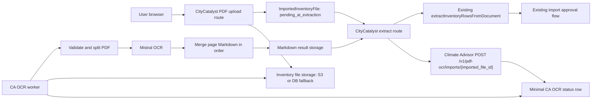

# Climate Advisor PDF OCR to Markdown Architecture

Status: Draft

Last updated: 2026-07-09

## Summary

Climate Advisor should expose a minimal asynchronous PDF OCR service that converts uploaded PDFs into Markdown using Mistral OCR. The MVP should support PDFs up to 50 MB and multiple concurrent users, so the primary interface should accept an existing CityCatalyst PDF reference rather than a new synchronous multipart upload. The MVP should key OCR state by CityCatalyst's `ImportedInventoryFile.id` and expose completion status only; it should not introduce a second public job id or report page-level/chunk-level progress.

The first implementation should reuse only the Mistral OCR stage from `Open-Earth-Foundation/PDF_converter`. It should not import the repository's vision-refinement agent, structured extraction, mapping, or database-loading stages.

The recommended product flow is:

1. CityCatalyst accepts and stores the uploaded PDF through the existing inventory import storage path.
2. CityCatalyst calls Climate Advisor with the `ImportedInventoryFile.id` and either an S3 key, short-lived signed URL, or equivalent storage reference.
3. Climate Advisor validates, queues, chunks, OCRs, and merges Markdown.
4. CityCatalyst polls OCR status by `ImportedInventoryFile.id`, retrieves the Markdown, and feeds it into the existing import extraction path.

## Goals

- Convert PDF files to Markdown with Mistral OCR.
- Support PDF inputs up to 50 MB as a normal case, not an exception path.
- Preserve page order and enough document structure for downstream inventory extraction.
- Give users a recoverable long-running conversion state: pending/running/done/failed.
- Protect Climate Advisor and Mistral from unbounded concurrent OCR requests.
- Reuse existing CityCatalyst upload, storage, auth, and import status concepts where practical.
- Keep the OCR service scoped to Markdown conversion; downstream row extraction remains separate.

## Non-Goals

- No vision-refinement agent in the first pass.
- No direct structured inventory row extraction inside Climate Advisor OCR.
- No PDF preview or image-asset serving from the OCR endpoint.
- No permanent public exposure of uploaded PDFs.
- No attempt to use Mistral batch processing in the first implementation.
- No page-level or chunk-level progress updates in the first implementation.
- No separate PDF upload endpoint in Climate Advisor for the MVP.

## Current State

CityCatalyst already has a PDF import path:

- `app/src/app/api/v1/city/[city]/inventory/[inventory]/import/route.ts` accepts PDF uploads and stores them in S3 when configured, with a database fallback for local development.
- PDF uploads are marked `pending_ai_extraction`.
- `app/src/app/api/v1/city/[city]/inventory/[inventory]/import/[importedFileId]/extract/route.ts` currently reads the stored PDF, extracts local text through `PdfToTextService`, and sends that text to the existing inventory extraction flow.
- `app/src/backend/PdfToTextService.ts` uses local PDF text extraction and is not OCR-quality for scanned PDFs.

Climate Advisor already has:

- A FastAPI app under `climate-advisor/service/app`.
- Routes under `climate-advisor/service/app/routes`.
- Business logic under `climate-advisor/service/app/services`.
- Settings in `climate-advisor/service/app/config/settings.py`.
- Existing CityCatalyst bearer-token patterns for user and inventory-scoped calls.

The external `PDF_converter` repository has a stage-1 PDF-to-Markdown path:

- Mistral OCR produces per-page Markdown.
- Large PDFs can be split into per-page OCR requests.
- Split OCR runs in parallel with a small worker pool.
- The final output is a joined `combined_markdown.md`.

That stage is the right source model. The CA implementation should copy the concept, not the whole repository design.

## External Constraints

Mistral's OCR documentation says the OCR processor returns page-level Markdown and supports PDF inputs through URL, base64 PDF, or uploaded PDF mechanisms. The known platform limits page currently lists a 512 MB maximum file upload size, organization-level rate limits, and `429 Too Many Requests` when limits are exceeded.

Those provider limits are higher than the proposed CityCatalyst application limit, but they do not remove our need for app-level controls. Even a 50 MB PDF can create long-running jobs, high temporary disk usage, high network egress, and many downstream OCR calls if chunked.

References checked:

- https://docs.mistral.ai/studio-api/document-processing/basic_ocr
- https://docs.mistral.ai/resources/known-limitations

## Proposed Architecture



## API Design

### Start OCR

`POST /v1/pdf-ocr/imports/{imported_file_id}`

Request:

```json
{
  "user_id": "uuid-or-user-id",
  "city_id": "uuid",
  "inventory_id": "uuid",
  "source": {
    "type": "s3_key",
    "key": "city/<city_id>/inventory/<inventory_id>/<file>.pdf"
  }
}
```

If Climate Advisor cannot read the CityCatalyst S3 bucket directly, CityCatalyst should pass `{"type": "signed_url", "url": "https://..."}` instead. S3 object tags can be added for traceability, but they should not be the primary workflow state.

Response:

```json
{
  "imported_file_id": "uuid",
  "status": "queued",
  "created_at": "2026-07-09T12:00:00Z"
}
```

Notes:

- `imported_file_id` is the business identifier for the PDF.
- The S3 key or signed URL is the storage pointer for the PDF bytes.
- Repeated calls for the same `imported_file_id` should be idempotent and return the existing OCR status unless the previous status is `failed` and the caller explicitly requests a retry.
- OCR model and output options should come from `climate-advisor/llm_config.yaml`, not from the client request, in the MVP.
- A local-development source type can resolve `imported_file_id` through CityCatalyst only if CA has an internal retrieval route. Do not make CA read the CityCatalyst database directly.
- Multipart upload directly to CA can exist later, but it is not needed for the first implementation because CityCatalyst already stores the PDF.

### Read OCR Status

`GET /v1/pdf-ocr/imports/{imported_file_id}?user_id=...`

Response while running:

```json
{
  "imported_file_id": "uuid",
  "status": "running",
  "error": null
}
```

Response when complete:

```json
{
  "imported_file_id": "uuid",
  "status": "succeeded",
  "markdown_result": {
    "type": "stored",
    "storage_key": "pdf-ocr/imports/<imported_file_id>/combined_markdown.md",
    "sha256": "..."
  },
  "model": "mistral-ocr-latest",
  "usage_info": {
    "pages_processed": 120
  }
}
```

Climate Advisor should not return very large Markdown bodies by default. Store Markdown and let CityCatalyst fetch it by job result reference, or add an explicit download endpoint.

### Download Markdown

`GET /v1/pdf-ocr/imports/{imported_file_id}/markdown?user_id=...`

Returns `text/markdown` only after authorization and job ownership checks.

### Cancel Job

`POST /v1/pdf-ocr/imports/{imported_file_id}/cancel`

This is useful if users need to stop a long-running conversion. Initial implementation can omit cancellation if the worker checks terminal status before each chunk.

## Job State Model

Recommended statuses:

- `queued`: job accepted but not claimed.
- `running`: worker is validating, chunking, OCRing, or merging.
- `succeeded`: Markdown result is available.
- `failed`: job ended with a permanent or exhausted retry error.
- `canceled`: user or system canceled the job.

Recommended table: `pdf_ocr_imports`

Fields:

- `imported_file_id`
- `user_id`
- `city_id`
- `inventory_id`
- `status`
- `source_type`
- `source_ref`
- `source_size_bytes`
- `source_sha256`
- `model`
- `result_storage_key`
- `result_sha256`
- `error_code`
- `error_message`
- `attempt_count`
- `lease_owner`
- `lease_expires_at`
- `created_at`
- `started_at`
- `completed_at`
- `updated_at`

The MVP does not need a separate chunk table, per-page counters, or per-chunk counters. Chunk planning and per-chunk retries can stay internal to the worker process. Add chunk persistence later only if we need resume-per-chunk or detailed operational debugging.

## Processing Flow

1. CityCatalyst validates that the user owns the inventory import.
2. CityCatalyst resolves the imported PDF's S3 key, signed URL, or equivalent source reference.
3. CityCatalyst calls `POST /v1/pdf-ocr/imports/{imported_file_id}` with the CA bearer token and source reference.
4. Climate Advisor creates or reuses the OCR status row and returns `202`.
5. A worker claims the job with a short lease.
6. Worker streams the PDF to temporary disk or object storage.
7. Worker validates file size, MIME type, and PDF readability.
8. Worker counts pages.
9. Worker splits the PDF into chunks.
10. Worker processes chunks with Mistral OCR under concurrency limits.
11. Worker stores per-chunk Markdown internally.
12. Worker merges chunks by page order.
13. Worker stores final Markdown.
14. Worker marks job `succeeded`.
15. CityCatalyst retrieves Markdown and continues the existing extraction flow.

## Size Policy

Initial application limits should live in `climate-advisor/llm_config.yaml`, with these starting values:

```yaml
pdf_ocr:
  max_file_mb: 50
  max_pages: 500
  chunk_target_mb: 15
  chunk_max_pages: 50
  job_timeout_minutes: 45
```

Rationale:

- 50 MB is the MVP application limit and stays well below Mistral's current platform upload limit.
- 500 pages is a practical operational guardrail for latency and cost. It can be raised after benchmarks.
- 15 MB chunk targets keep base64/chunk upload overhead contained and make retries cheaper.
- A 45-minute timeout gives room for OCR and downstream extraction while still failing stuck jobs.

The service should reject larger files with a clear `413 Payload Too Large` or job failure reason before spending OCR cost.

Page count and chunk count can still be computed internally for validation, logging, and tuning. They should not be exposed as progress fields in the MVP API.

## Chunking Strategy

The worker should split by page ranges, with byte-size feedback:

1. Inspect page count.
2. Create chunks of up to `pdf_ocr.chunk_max_pages`.
3. If a chunk exceeds `pdf_ocr.chunk_target_mb`, reduce the page range and retry chunk creation.
4. Keep chunk page ranges in worker memory or temporary metadata only.
5. Merge Markdown in ascending chunk order, adding clear page separators only if downstream extraction benefits from them.

Recommended Markdown separator:

```markdown
<!-- page: 12 -->
```

The separator is machine-readable and low-noise. It helps debug extraction mistakes without changing visible content much.

## Concurrency and Queueing

Mistral rate limits are organization-level, so concurrency must be controlled across users.

Recommended initial settings:

```yaml
pdf_ocr:
  worker_jobs: 1
  chunk_concurrency_per_import: 2
  global_concurrency: 3
```

For a single worker deployment, an in-process semaphore is enough. For multiple CA worker replicas, use a distributed limiter. Options:

- Postgres advisory locks for a small global token pool.
- A `pdf_ocr_limiter_tokens` table with row-level locking.
- Redis semaphore if Redis already exists in the deployment.

Do not rely only on per-process semaphores if the worker has multiple replicas. Three replicas each configured for `3` requests would become nine real Mistral calls.

The queue should be durable. Use the CA database with row leases:

```sql
SELECT *
FROM pdf_ocr_imports
WHERE status = 'queued'
ORDER BY created_at
FOR UPDATE SKIP LOCKED
LIMIT 1;
```

The worker updates `lease_owner` and `lease_expires_at`. If a worker dies, another worker can reclaim expired leases.

## Retry Policy

Retry chunk OCR on:

- HTTP `429`
- HTTP `500` through `599`
- network timeouts
- connection resets

Do not retry without intervention on:

- `400` invalid request or unsupported document
- `401` or `403` Mistral auth/config errors
- app-level file too large or page limit exceeded
- unreadable or encrypted PDFs

Use exponential backoff with jitter. Honor `Retry-After` if the Mistral response includes it. Persist chunk attempt counts and final failure reason.

## Security and Privacy

- All job creation and reads must verify the CA bearer token and user ownership.
- Job status should be scoped by `user_id` and `inventory_id`.
- Signed source URLs should be short-lived and single-purpose where possible.
- Do not log raw PDF content, Markdown content, signed URLs, or API keys.
- Store only metadata in MLflow or logs: file size, page count, chunk count, duration, status, and error class.
- Delete temporary PDFs and chunk files after completion or failure.
- Apply result retention. A starting value of 7-30 days is reasonable, depending on product needs.
- If Mistral file upload retention is used, prefer explicit deletion after OCR when the SDK/API supports it.

## Storage

The final Markdown should be stored outside the OCR status row:

- S3/object storage in production.
- Local filesystem or database blob only for local development.

Recommended keys:

```text
pdf-ocr/imports/<imported_file_id>/combined_markdown.md
pdf-ocr/imports/<imported_file_id>/metadata.json
```

CityCatalyst can store the returned `result_storage_key` in `ImportedInventoryFile.mappingConfiguration.ocrMarkdown` or a dedicated column if this becomes a long-lived feature.

## Integration With CityCatalyst Import

The clean integration point is the existing PDF extract route:

`app/src/app/api/v1/city/[city]/inventory/[inventory]/import/[importedFileId]/extract/route.ts`

Current behavior:

```text
stored PDF -> PdfToTextService -> extractInventoryRowsFromDocument -> waiting_for_approval
```

Target behavior:

```text
ImportedInventoryFile.id + S3 key -> CA OCR status row -> Markdown -> extractInventoryRowsFromDocument -> waiting_for_approval
```

Implementation options:

1. Fully async two-step flow:
   - `extract` route starts CA OCR if no OCR status row exists.
   - UI polls existing import status.
   - Backend advances from `extracting` to row extraction when OCR succeeds.

2. Split status phases:
   - Add separate `ocr_running` and `extracting_rows` statuses.
   - More explicit, but requires enum/UI changes.

Option 1 has less UI churn. For the MVP, CityCatalyst only needs to know whether OCR is still running, has failed, or has produced Markdown. It does not need page or chunk progress.

## Configuration

Environment variables should contain secrets only:

```text
MISTRAL_API_KEY=...
```

Non-secret OCR settings should live in `climate-advisor/llm_config.yaml`:

```yaml
pdf_ocr:
  enabled: true
  model: "mistral-ocr-latest"
  max_file_mb: 50
  max_pages: 500
  chunk_target_mb: 15
  chunk_max_pages: 50
  worker_jobs: 1
  chunk_concurrency_per_import: 2
  global_concurrency: 3
  job_timeout_minutes: 45
  result_retention_days: 14
```

Dependency changes:

- Add `mistralai`.
- Prefer `pypdf` for robust page splitting, unless the existing `PyPDF2` dependency is sufficient after a spike.

## Deployment Model

Use the same CA container image with two process roles:

- Web API: `uvicorn app.main:app`
- OCR worker: `python -m app.workers.pdf_ocr_worker`

Kubernetes should deploy the worker separately from the web pod. This keeps CPU, memory, temp disk, and scaling behavior independent from chat latency.

Worker resource starting point:

```text
cpu request: 500m
memory request: 1Gi
ephemeral storage request: 2Gi
```

Raise ephemeral storage if the file limit is later increased beyond 50 MB. The worker should stream and clean up aggressively.

## Observability

Metrics:

- `pdf_ocr_imports_queued`
- `pdf_ocr_imports_running`
- `pdf_ocr_imports_failed_total`
- `pdf_ocr_import_duration_seconds`
- `pdf_ocr_file_size_bytes`
- `pdf_ocr_page_count`
- `pdf_ocr_chunk_count`
- `pdf_ocr_mistral_requests_total`
- `pdf_ocr_mistral_429_total`
- `pdf_ocr_retry_count`

Logs should include:

- `request_id`
- `imported_file_id`
- `user_id`
- `inventory_id`
- status transitions
- chunk index and page range in debug logs only
- durations
- redacted error summaries

MLflow, if used, should log metadata and metrics only. Do not log raw PDFs or full Markdown unless explicitly approved for a non-production debug run.

## Testing Plan

Unit tests:

- Request validation and auth failure cases.
- Job state transitions.
- Page-count and file-size validation.
- Chunk planning preserves page order.
- Chunk merge preserves order and separators.
- Retry classification for `429`, `5xx`, timeout, `400`, `401`.

Service tests:

- Mock Mistral OCR responses for multi-chunk PDFs.
- Verify failed chunks mark the job failed after retry exhaustion.
- Verify successful jobs store final Markdown and metadata.

CityCatalyst integration tests:

- PDF import starts or reuses an OCR status row.
- Existing import polling reports pending/running/succeeded/failed state.
- Completed OCR Markdown is passed into `extractInventoryRowsFromDocument`.
- Failed OCR returns a user-visible import failure.

Manual benchmark tests:

- Text-native PDF around 50 MB.
- Scanned PDF around 50 MB.
- Scanned PDF near the 50 MB limit.
- 300-500 page PDF.
- Two users submitting jobs at the same time.

Success criteria:

- No web request waits for full OCR completion.
- 50 MB upload does not exceed web pod memory limits.
- Polling shows the job as running until OCR completes or fails.
- Mistral `429` responses back off instead of causing request storms.
- Final Markdown is deterministic in page order.

## Rollout Plan

Phase 1: CA OCR status API with mocked Mistral tests.

- Add OCR status model and migration keyed by `imported_file_id`.
- Add create/status/download endpoints.
- Add worker loop with mocked OCR client in tests.
- Keep feature flag disabled by default.

Phase 2: Mistral OCR client and chunking.

- Add Mistral client wrapper.
- Add PDF chunk planner and merger.
- Run manual OCR tests with representative PDFs.
- Tune size, page, and concurrency defaults.

Phase 3: CityCatalyst import integration.

- Replace `PdfToTextService` path for PDFs with CA OCR status flow.
- Keep existing row extraction unchanged.
- Surface OCR running/done/failed state through existing import polling.

Phase 4: Production hardening.

- Add worker deployment.
- Add metrics and alerts.
- Add cleanup job for expired OCR artifacts.
- Add distributed concurrency limiter if multiple worker replicas are needed.

## Open Decisions

- Should CA store Markdown in the same object-storage bucket as CityCatalyst uploads, or in CA-owned storage?
- Should the UI show separate OCR and row-extraction states, or keep one combined extraction state?
- What is the first production page cap: 500, 750, or 1000 pages?
- Is a small synchronous endpoint useful for developer/testing workflows, or should all paths use jobs?
- Should Mistral batch processing be evaluated for bulk backfills after the MVP?

## Recommendation

Build the minimal asynchronous status architecture first. A synchronous endpoint is acceptable only as a test utility for small files. For 50 MB production PDFs, the durable status row, worker, chunking, result storage, and concurrency limiter are not optional infrastructure; they are the architecture needed to make the feature reliable for multiple users. A later increase toward 100 MB should be gated by benchmarks and resource tuning.
