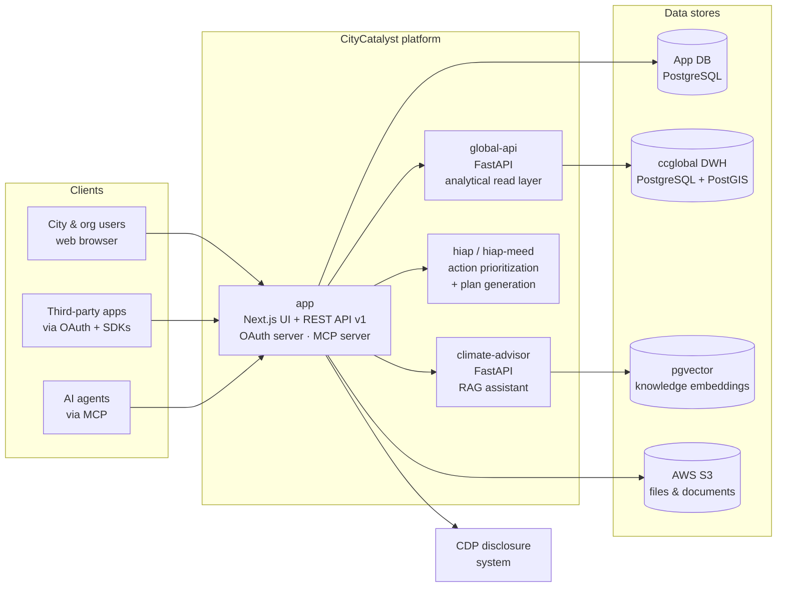
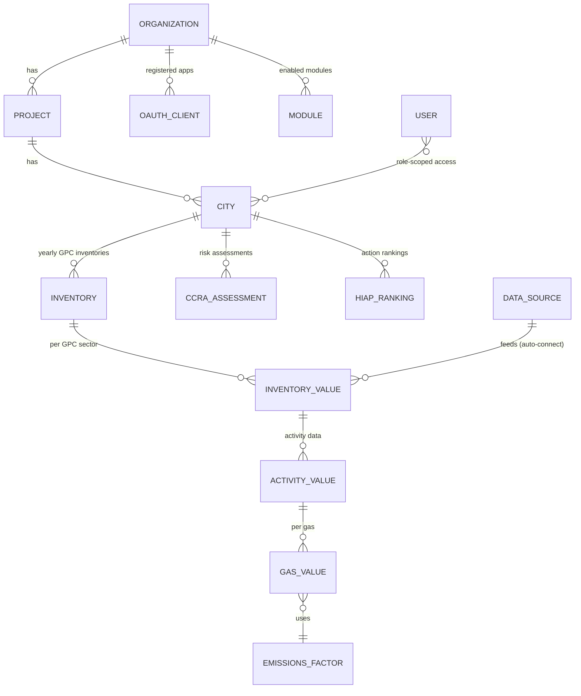
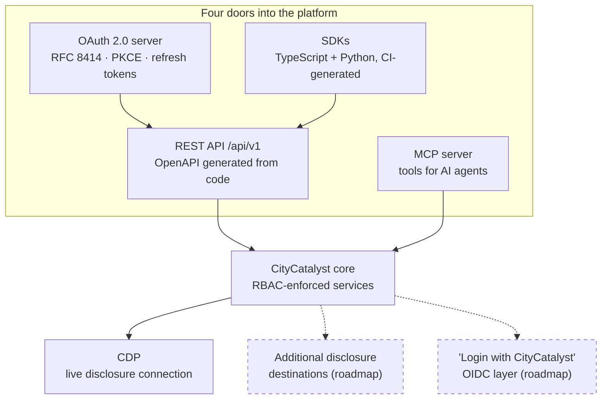
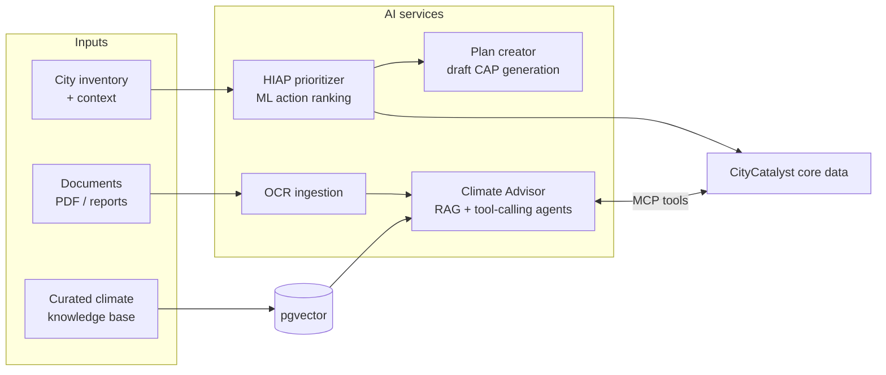
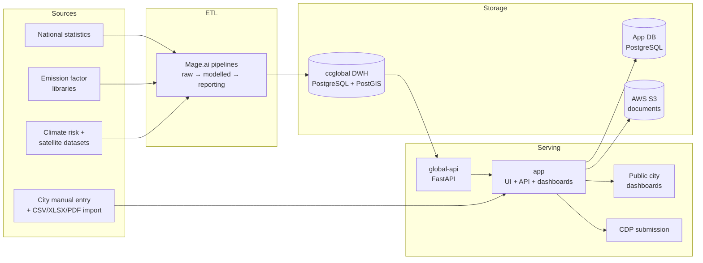
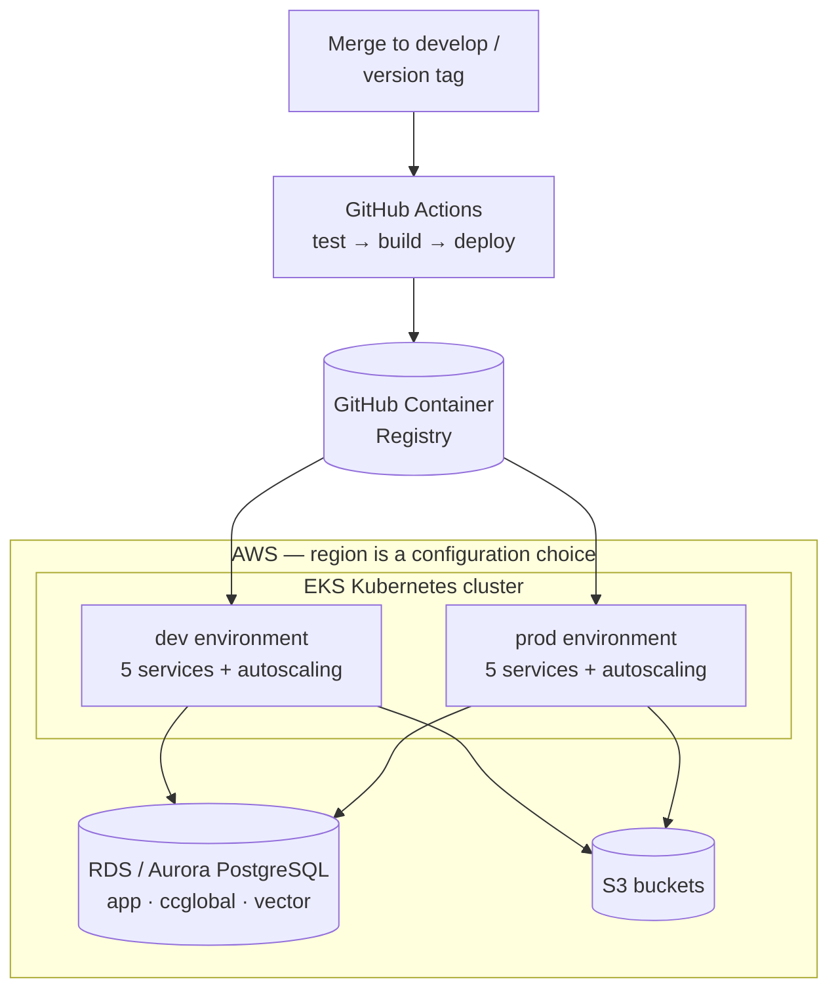

# A Tech Deep Dive into CityCatalyst

**The open-source climate journey platform for cities — from measuring emissions to unlocking climate finance.**

CityCatalyst, built by the [Open Earth Foundation](https://openearth.org), helps cities act on climate change without advanced technical skills. It begins with a GPC-compliant greenhouse-gas inventory and guides cities through the full climate journey: assessing climate risk, prioritizing high-impact actions, and preparing finance-ready projects — AI-assisted and open source throughout.

This document is a written companion to the live technical walkthrough: the architecture, the data model, the interoperability surfaces, the AI layer, the data platform, and the cloud setup — each section with direct links into the codebase so your team can verify everything independently.

- **Live platform:** [citycatalyst.io](https://citycatalyst.io)
- **Source code:** [github.com/Open-Earth-Foundation/CityCatalyst](https://github.com/Open-Earth-Foundation/CityCatalyst)
- **License:** [AGPL-3.0](https://github.com/Open-Earth-Foundation/CityCatalyst/blob/develop/LICENSE) — fully open source, no license fees, no vendor lock-in

---

## 1. Platform at a glance

| Dimension | Today |
|---|---|
| Deployable services | 5 (web platform, global data API, AI advisor, action prioritization ×2) |
| Public REST API | `/api/v1`, ~150 endpoints, OpenAPI spec generated from code on every build |
| Data model | ~60 entities under schema migration control (Sequelize + Alembic) |
| Standards | GPC (GHG Protocol for Cities) in the schema; OAuth 2.0 + RFC 8414; OpenAPI; MCP |
| Languages | English, German, Spanish, French, Portuguese (i18n built into routing) |
| Disclosure | Live machine-to-machine submission to CDP |
| Deployment | Docker + Kubernetes (AWS EKS), GitHub Actions CI/CD, branch-based promotion |
| Visualization | Custom React + Nivo (MIT) charts — zero visualization licensing cost |

---

## 2. Architecture overview

CityCatalyst is a monorepo of cooperating services, each with its own database boundary, CI pipeline, and Kubernetes deployment:

The services:

| Service | What it does | Stack | Code |
|---|---|---|---|
| **app** | Web platform: UI, REST API (`/api/v1`), OAuth 2.0 authorization server, MCP server, GHGI calculation engine, RBAC | Next.js / TypeScript | [`/app`](https://github.com/Open-Earth-Foundation/CityCatalyst/tree/develop/app) |
| **global-api** | Global emissions, risk & action data API over the analytical warehouse | Python / FastAPI / PostGIS | [`/global-api`](https://github.com/Open-Earth-Foundation/CityCatalyst/tree/develop/global-api) |
| **climate-advisor** | Conversational AI advisor (RAG + tool-calling agents) | Python / FastAPI / pgvector | [`/climate-advisor`](https://github.com/Open-Earth-Foundation/CityCatalyst/tree/develop/climate-advisor) |
| **hiap** | High-Impact Actions & Plans: ML action ranking + plan generation | Python / FastAPI | [`/hiap`](https://github.com/Open-Earth-Foundation/CityCatalyst/tree/develop/hiap) |
| **hiap-meed** | MEED energy-model variant of the prioritizer | Python / FastAPI | [`/hiap-meed`](https://github.com/Open-Earth-Foundation/CityCatalyst/tree/develop/hiap-meed) |
| **api-demo** | Working example of an external app integrating via OAuth | Static / Nginx | [`/api-demo`](https://github.com/Open-Earth-Foundation/CityCatalyst/tree/develop/api-demo) |

---

## 3. Data model: multi-tenancy and standards in the schema

The core hierarchy — **Organization → Project → City → Inventory** — supports national programs, city networks, and single cities on the same deployment. Emissions are stored at activity/gas granularity with explicit emission factors, so every number is traceable to its factor and methodology.

Highlights, with code:

- **The GPC standard lives in the schema.** The full questionnaire structure is data, keyed by GPC reference numbers: [`manual-input-hierarchy.json`](https://github.com/Open-Earth-Foundation/CityCatalyst/blob/develop/app/src/util/form-schema/manual-input-hierarchy.json).
- **~60 typed data models** under [`app/src/models`](https://github.com/Open-Earth-Foundation/CityCatalyst/tree/develop/app/src/models) — see [`Organization.ts`](https://github.com/Open-Earth-Foundation/CityCatalyst/blob/develop/app/src/models/Organization.ts), [`City.ts`](https://github.com/Open-Earth-Foundation/CityCatalyst/blob/develop/app/src/models/City.ts), [`Inventory.ts`](https://github.com/Open-Earth-Foundation/CityCatalyst/blob/develop/app/src/models/Inventory.ts), [`EmissionsFactor.ts`](https://github.com/Open-Earth-Foundation/CityCatalyst/blob/develop/app/src/models/EmissionsFactor.ts).
- **External data sources are catalog entries, not hard-coded connectors** — the [`DataSource`](https://github.com/Open-Earth-Foundation/CityCatalyst/blob/develop/app/src/models/DataSource.ts) family models sources with their scopes, methodologies and reporting levels, and the auto-connect service fills inventories from them.
- **Third-party apps, API tokens, and pluggable modules are first-class citizens** of the core schema: [`OAuthClient.ts`](https://github.com/Open-Earth-Foundation/CityCatalyst/blob/develop/app/src/models/OAuthClient.ts), [`PersonalAccessToken.ts`](https://github.com/Open-Earth-Foundation/CityCatalyst/blob/develop/app/src/models/PersonalAccessToken.ts), [`Module.ts`](https://github.com/Open-Earth-Foundation/CityCatalyst/blob/develop/app/src/models/Module.ts).
- **Role-based access control** is hierarchical and resource-scoped (organization admin → project admin → collaborator → public reader), enforced centrally in the API layer.

---

## 4. Interoperability: four doors into the same platform

Interoperability is not a feature of CityCatalyst; it is the architecture. There are four independent, standards-based ways to build on the platform:

*(Solid = in production today; dashed = scoped roadmap items.)*

**Door 1 — REST API.** ~150 endpoints under [`app/src/app/api/v1`](https://github.com/Open-Earth-Foundation/CityCatalyst/tree/develop/app/src/app/api/v1). Every route carries its OpenAPI annotation in the code itself, and the spec is regenerated on every build — documentation cannot drift from reality. Reference: [API wiki](https://github.com/Open-Earth-Foundation/CityCatalyst/wiki).

**Door 2 — OAuth 2.0 authorization server.** External applications obtain tokens via the authorization-code flow with PKCE and refresh tokens, and act on a user's behalf under that user's exact permissions. Discovery follows RFC 8414: [`oauth/metadata/route.ts`](https://github.com/Open-Earth-Foundation/CityCatalyst/blob/develop/app/src/app/api/v1/oauth/metadata/route.ts). A working example client ships in the repo: [`api-demo`](https://github.com/Open-Earth-Foundation/CityCatalyst/tree/develop/api-demo).

**Door 3 — Generated SDKs.** TypeScript and Python client SDKs are generated from the OpenAPI spec by CI on every API change: [`sdk-generator.yml`](https://github.com/Open-Earth-Foundation/CityCatalyst/blob/develop/.github/workflows/sdk-generator.yml). Publication to the public npm/PyPI registries is on the current sprint.

**Door 4 — MCP server.** CityCatalyst ships a [Model Context Protocol](https://modelcontextprotocol.io) server, making the platform directly usable by AI assistants and agent frameworks: tools for cities, inventories, emissions, city profiles, risk assessments and action plans, behind the same authentication. Code: [`app/src/lib/mcp`](https://github.com/Open-Earth-Foundation/CityCatalyst/tree/develop/app/src/lib/mcp), with agent discovery at [`.well-known/mcp-server`](https://github.com/Open-Earth-Foundation/CityCatalyst/tree/develop/app/src/app/api/v1/.well-known/mcp-server).

**Disclosure.** The platform submits inventories machine-to-machine to CDP today ([`CDPService.ts`](https://github.com/Open-Earth-Foundation/CityCatalyst/blob/develop/app/src/backend/CDPService.ts)) — the working proof of the "measure once, report everywhere" pattern. Generalizing this into an adapter framework for additional destinations (GCoM/ICLEI systems) is a scoped roadmap item.

---

## 5. The AI layer

- **Climate Advisor** ([`/climate-advisor`](https://github.com/Open-Earth-Foundation/CityCatalyst/tree/develop/climate-advisor)) — a FastAPI service doing retrieval-augmented generation over a curated climate knowledge base (PostgreSQL + pgvector), with tool-calling agents. The LLM provider is **configuration, not architecture** ([`llm_config.yaml`](https://github.com/Open-Earth-Foundation/CityCatalyst/blob/develop/climate-advisor/llm_config.yaml)): no lock-in to a single AI vendor, and the only AI cost is upstream API usage — no per-seat licensing.
- **Document ingestion** — city documents (PDFs, reports) are processed through a durable OCR job queue into structured data.
- **HIAP** ([`/hiap`](https://github.com/Open-Earth-Foundation/CityCatalyst/tree/develop/hiap)) — ranks climate actions for a city from its inventory and context (ML comparator + LLM reasoning), then generates draft action plans. In production today: see [`hiap/app/prioritizer`](https://github.com/Open-Earth-Foundation/CityCatalyst/tree/develop/hiap/app/prioritizer) and the plan creator bundle.
- **Modularity proof:** [`/hiap-meed`](https://github.com/Open-Earth-Foundation/CityCatalyst/tree/develop/hiap-meed) runs the MEED energy model as a sibling service on the same contract — the pattern for plugging in alternative models.

---

## 6. The data platform

- **Analytical warehouse (`ccglobal`)** — PostgreSQL + **PostGIS**, organized in medallion layers (raw → modelled → reporting). Real geospatial capability: city boundaries, spatial joins, map-based search. Served read-only through [`global-api/routes`](https://github.com/Open-Earth-Foundation/CityCatalyst/tree/develop/global-api/routes) (city boundaries, citywide emissions, risk assessments, emission-factor catalogs, climate actions, and more).
- **ETL** — ingestion runs as versioned, reviewable [Mage.ai](https://www.mage.ai) pipeline code in a dedicated repository: [CityCatalyst-global-data](https://github.com/Open-Earth-Foundation/CityCatalyst-global-data).
- **Clean separation of concerns** — operational database (user data, drafts, app state) vs. analytical warehouse (curated global datasets) vs. object storage (unstructured files).
- **Multi-path city data ingestion** — deterministic format adapters for standard files, AI interpretation for non-standard tables, and OCR for PDFs — all feeding one review-then-approve workflow. See the ingestion services in [`app/src/backend`](https://github.com/Open-Earth-Foundation/CityCatalyst/tree/develop/app/src/backend).
- **Dashboards** — custom React + [Nivo](https://nivo.rocks) (MIT-licensed) charts, fully brandable, zero visualization licensing cost.

---

## 7. Cloud & operations

- **Everything is containerized** (Docker) and deployed to **Kubernetes on AWS EKS**. Manifests are in the repo: [`/k8s`](https://github.com/Open-Earth-Foundation/CityCatalyst/tree/develop/k8s) — deployments, services, horizontal pod autoscalers, migration jobs, scheduled workers.
- **CI/CD** — per-service GitHub Actions pipelines with branch-based promotion (`develop` → dev, `main` → test, version tags → production): [`.github/workflows`](https://github.com/Open-Earth-Foundation/CityCatalyst/tree/develop/.github/workflows).
- **Databases** — managed RDS/Aurora PostgreSQL; unstructured files on S3.
- **Portability by construction** — the critical path is vanilla Kubernetes + PostgreSQL + S3, with no proprietary managed services baked in. Deployment region (including EU regions, relevant for data-residency requirements) is a configuration decision; and because the platform is AGPL open source, the entire stack can be independently operated by any party.
- **Scaling** — horizontal pod autoscaling is already in place; scaling to large city counts is an infrastructure-sizing exercise, not a rearchitecture.

---

## 8. Standards & licensing summary

| Area | Standard |
|---|---|
| GHG accounting | GPC (Global Protocol for Community-Scale GHG Inventories) — encoded in the schema |
| API description | OpenAPI, generated from code on every build |
| Authorization | OAuth 2.0: authorization-code + PKCE, refresh tokens, RFC 8414 discovery |
| AI integration | Model Context Protocol (MCP) |
| Disclosure | Live CDP machine-to-machine submission |
| License | AGPL-3.0 — free to use, inspect, run, and fork; no vendor lock-in |
| Visualization | MIT-licensed charting (Nivo) — no proprietary BI licensing |

---

## 9. Technical resource index

Everything referenced above, in one place:

**Entry points**

| Resource | Link |
|---|---|
| Live platform | [citycatalyst.io](https://citycatalyst.io) |
| Source repository | [github.com/Open-Earth-Foundation/CityCatalyst](https://github.com/Open-Earth-Foundation/CityCatalyst) |
| Project README (architecture, quick start) | [README.md](https://github.com/Open-Earth-Foundation/CityCatalyst/blob/develop/README.md) |
| API documentation wiki | [CityCatalyst wiki](https://github.com/Open-Earth-Foundation/CityCatalyst/wiki) |
| License | [AGPL-3.0](https://github.com/Open-Earth-Foundation/CityCatalyst/blob/develop/LICENSE) |
| Open Earth Foundation | [openearth.org](https://openearth.org) |

**Platform core**

| Resource | Link |
|---|---|
| Web platform + API service | [`/app`](https://github.com/Open-Earth-Foundation/CityCatalyst/tree/develop/app) |
| REST API routes (`/api/v1`) | [`/app/src/app/api/v1`](https://github.com/Open-Earth-Foundation/CityCatalyst/tree/develop/app/src/app/api/v1) |
| Data models (~60 entities) | [`/app/src/models`](https://github.com/Open-Earth-Foundation/CityCatalyst/tree/develop/app/src/models) |
| Backend service layer | [`/app/src/backend`](https://github.com/Open-Earth-Foundation/CityCatalyst/tree/develop/app/src/backend) |
| GPC questionnaire schema (as data) | [`manual-input-hierarchy.json`](https://github.com/Open-Earth-Foundation/CityCatalyst/blob/develop/app/src/util/form-schema/manual-input-hierarchy.json) |
| Internationalization (5 languages) | [`/app/src/i18n`](https://github.com/Open-Earth-Foundation/CityCatalyst/tree/develop/app/src/i18n) |

**Interoperability**

| Resource | Link |
|---|---|
| OAuth 2.0 discovery endpoint (RFC 8414) | [`oauth/metadata/route.ts`](https://github.com/Open-Earth-Foundation/CityCatalyst/blob/develop/app/src/app/api/v1/oauth/metadata/route.ts) |
| MCP server + agent tools | [`/app/src/lib/mcp`](https://github.com/Open-Earth-Foundation/CityCatalyst/tree/develop/app/src/lib/mcp) |
| MCP agent discovery endpoint | [`.well-known/mcp-server`](https://github.com/Open-Earth-Foundation/CityCatalyst/tree/develop/app/src/app/api/v1/.well-known/mcp-server) |
| SDK generation pipeline (TS + Python) | [`sdk-generator.yml`](https://github.com/Open-Earth-Foundation/CityCatalyst/blob/develop/.github/workflows/sdk-generator.yml) |
| CDP disclosure integration | [`CDPService.ts`](https://github.com/Open-Earth-Foundation/CityCatalyst/blob/develop/app/src/backend/CDPService.ts) |
| Example external OAuth client | [`/api-demo`](https://github.com/Open-Earth-Foundation/CityCatalyst/tree/develop/api-demo) |

**Data & AI services**

| Resource | Link |
|---|---|
| Global data API (PostGIS-backed) | [`/global-api`](https://github.com/Open-Earth-Foundation/CityCatalyst/tree/develop/global-api) · [routes](https://github.com/Open-Earth-Foundation/CityCatalyst/tree/develop/global-api/routes) |
| ETL pipelines (Mage.ai) | [CityCatalyst-global-data](https://github.com/Open-Earth-Foundation/CityCatalyst-global-data) |
| Climate Advisor (RAG assistant) | [`/climate-advisor`](https://github.com/Open-Earth-Foundation/CityCatalyst/tree/develop/climate-advisor) |
| LLM provider configuration | [`llm_config.yaml`](https://github.com/Open-Earth-Foundation/CityCatalyst/blob/develop/climate-advisor/llm_config.yaml) |
| Action prioritization (HIAP) | [`/hiap`](https://github.com/Open-Earth-Foundation/CityCatalyst/tree/develop/hiap) · [prioritizer](https://github.com/Open-Earth-Foundation/CityCatalyst/tree/develop/hiap/app/prioritizer) |
| MEED model variant | [`/hiap-meed`](https://github.com/Open-Earth-Foundation/CityCatalyst/tree/develop/hiap-meed) |

**Operations**

| Resource | Link |
|---|---|
| CI/CD pipelines | [`/.github/workflows`](https://github.com/Open-Earth-Foundation/CityCatalyst/tree/develop/.github/workflows) |
| Kubernetes manifests | [`/k8s`](https://github.com/Open-Earth-Foundation/CityCatalyst/tree/develop/k8s) |
| Architecture docs in-repo | [`/docs`](https://github.com/Open-Earth-Foundation/CityCatalyst/tree/develop/docs) |

**Related Open Earth Foundation work**

| Resource | Link |
|---|---|
| OpenClimate (climate accounting data) | [github.com/Open-Earth-Foundation/OpenClimate](https://github.com/Open-Earth-Foundation/OpenClimate) |
| Model Context Protocol (standard) | [modelcontextprotocol.io](https://modelcontextprotocol.io) |
| GPC standard (GHG Protocol) | [ghgprotocol.org/ghg-protocol-cities](https://ghgprotocol.org/ghg-protocol-cities) |

---

*CityCatalyst is developed in the open by the [Open Earth Foundation](https://openearth.org). Questions, integration ideas, or contributions are welcome — through [GitHub issues](https://github.com/Open-Earth-Foundation/CityCatalyst/issues) or directly with the OEF team.*
