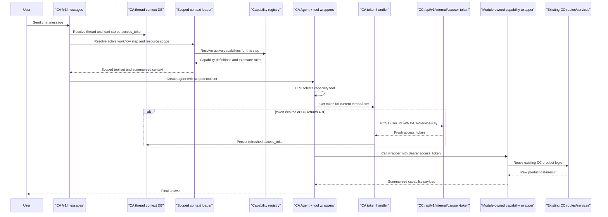

# Agentic Module Scope Map

This document maps CityCatalyst from the product surface. The goal is to define
which user-facing workflows should become agentic, and what architecture would
make that practical without turning the product into one flat tool bag.

## Scope Boundary

- In scope: human-facing workflows where the agent reads state, explains gaps,
prepares drafts or exports, and waits for explicit user decisions before
product data changes.
- Out of scope: auth, OAuth/clients, personal tokens, health/liveness, mock
routes, internal CA token plumbing, feature-flag administration, and
operational observability/hardening.
- Experimental work already built as a separate proof of concept should not set
the scope for the broader module plan.

## MCP Layer

> This section is transport-only. It is not the product module map.

Current MCP tools:


| Tool                          | Current capability                                                         | Coverage             |
| ----------------------------- | -------------------------------------------------------------------------- | -------------------- |
| `get_user_cities`             | List accessible cities, optionally with inventory counts.                  | City/project context |
| `get_city_profile`            | Read city profile, demographics, inventories, collaborators, and metadata. | City context         |
| `get_user_inventories`        | List accessible inventories with filters and optional emissions/details.   | GHGI                 |
| `get_inventory_emissions`     | Read totals and sector/subsector summaries for an inventory.               | GHGI results         |
| `get_climate_action_plans`    | Read ranked HIAP actions for an inventory and action type.                 | HIAP                 |
| `get_climate_risk_assessment` | Registered but not implemented.                                            | CCRA                 |


Current MCP surfaces:

- Transport: `app/src/app/api/v1/mcp/route.ts`
- Discovery: `app/src/app/api/v1/.well-known/mcp-server/route.ts`

Current MCP limits:

- The tool registry is manual and hand-wired.
- Tools are not generated from module-owned capability definitions.
- The MCP surface is much smaller than the real product surface.
- MCP currently exposes a flat list, not workflow-specific scoped tool packs.

## Product Module Map

### Workspace and Navigation

- Current: profile, invites, active cities/projects/inventories, city home,
module catalog, and module dashboards.
- APIs: `user/*`, `city/[city]`, `city/[city]/dashboard`, `modules`,
`projects/[project]/modules`, `projects/[project]/modules/[module]/access`,
`city/[city]/modules/[module]/access`, and city module dashboards.
- Agentic direction: explain active workspace, list accessible modules,
summarize dashboard state, and route the user into the right flow.

### City Setup and Management

- Current: city onboarding, boundary lookup, population/year state, city
dashboard, and city readiness for downstream modules.
- APIs: `city`, `city/[city]`, `city/[city]/boundary`,
`city/[city]/population*`, `city/[city]/years`, `city/[city]/organization`,
`bulk-locations`.
- Agentic direction: search and normalize city candidates, confirm create-city
actions, and summarize missing setup.

### GHGI Onboarding

- Current: create inventory, set year/type/GWP/country emissions, set
populations, and choose normal vs import path.
- APIs: `city/[city]/inventory`, `city/[city]/population`,
`inventory/[inventory]/country-emissions`,
`inventory/[inventory]/populations`.
- Agentic direction: validate prerequisites, prepare inventory creation, create
after confirmation, and recover missing state.

### GHGI Import

- Current: upload file, extract/interpret, inspect mappings, approve import,
and poll status.
- APIs: `city/[city]/inventory/[inventory]/import*`.
- Agentic direction: treat as a first-class workflow with start, status,
mapping review, approval, and final report.

### GHGI Entry and Data Sources

- Current: progress tracking, source search/connect, manual activity values,
notation keys, file upload, and support/reference lookups.
- APIs: `inventory/[inventory]/progress`, `datasource/[inventoryId]*`,
`inventory/[inventory]/value*`, `inventory/[inventory]/activity-value*`,
`inventory/[inventory]/notation-keys`, `city/[city]/file*`,
`sector/[sectorId]/required-scopes`, `subsector/[subsectorId]`,
`emissions-factor`, `waste-composition`.
- Agentic direction: identify missing data, explain candidate sources, confirm
source-connect and manual edits, mark scopes not applicable, and preserve
version history behavior.

### GHGI Results and Publishing

- Current: results, forecast, downloads, publish/unpublish, CDP submission,
restore from version history, and GHGI dashboard widgets.
- APIs: `inventory/[inventory]/results*`, `inventory/[inventory]/download`,
`inventory/[inventory]/cdp`, `inventory/[inventory]/version-history*`,
`user/cities/[id]/results`, `city/[city]/modules/ghgi/dashboard`.
- Agentic direction: summarize emissions and drivers, prepare artifacts, and
gate publish, CDP, and restore actions behind explicit confirmation.

### GHGI Preferences

- Current: preference screens exist, but no clear persistence was identified.
- Surfaces: `app/src/app/[lng]/[inventory]/preferences/*`.
- Agentic direction: treat as informational until these become real persisted
inventory settings.

### HIAP

- Current: dashboard, ranking/status, reprioritization, top picks, action
plans, exports, and version history.
- APIs: `inventory/[inventory]/hiap`, `inventory/[inventory]/hiap/status`,
`city/[city]/modules/hiap/dashboard`, `city/[city]/hiap/action-plan*`,
`inventory/[inventory]/version-history?module=hiap`,
`cron/check-hiap-jobs`.
- Agentic direction: read actions/status/plans, standardize generation as a
workflow, and require confirmation for top-pick changes and plan generation.

### CCRA

- Current: city dashboard risk summary plus external full-app link.
- APIs: `city/[city]/modules/ccra/dashboard`.
- Agentic direction: implement `get_climate_risk_assessment`, summarize risks,
and link out when the full external UI is needed.

### Organization, Project, and Collaboration

- Current: organization settings/branding, projects, invites, roles,
collaborators, city transfer/delete, project module access, and project bulk
download.
- APIs: `organizations*`, `projects/[project]*`, `city/invite*`,
`city/transfer`, `city/[city]/user*`, `city/[city]/organization`,
`inventory/[inventory]/organization`.
- Agentic direction: read membership/access, confirm structural changes, preview
branding/file flows, and return clear preflight/result summaries.

### Admin

- Current: organization admin, bulk inventory creation/download/HIAP,
module administration, and feature flags.
- APIs: `admin/*`, `organizations/[organization]/active-status`.
- Agentic direction: keep outside the first capability pack. If exposed later,
start with read/reporting and dry-run previews only.

### Public and Reference

- Current: public inventory/city/project dashboards, methodology pages, and the
OpenAPI docs UI.
- APIs: `public/*`, `projects/[project]/summary`, `api/openapi/json`.
- Agentic direction: public tools stay read-only; methodology lookup is a
reference tool for explanations.

### Chat and Assistant Layer

- Current: chat threads/messages, assistant threads/files, and CA vs legacy
assistant routing.
- APIs: `chat/*`, `assistants*`.
- Agentic direction: this is a UI and transport layer, not a separate capability
universe. It should call shared module wrappers.

## Architecture Direction

### Desired End State

We want agentic features to come from product-owned capabilities, not from a
growing pile of one-off prompts or route-specific glue.

The desired stack is:

1. Product modules own capability wrappers.
2. Capabilities are registered with typed metadata.
3. Each workflow loads only the context and tool scope it actually needs.
4. Chat, MCP, and future agent UIs consume those same capabilities through
  different transports.
5. Long-running work uses a shared workflow/status/result model.

### Core Pieces We Need

#### 1. Module-Owned Capability Wrappers

Create stable wrappers such as:

- `ghgi.capabilities.ts`
- `hiap.capabilities.ts`
- `ccra.capabilities.ts`
- `city.capabilities.ts`
- `organization.capabilities.ts`
- `project.capabilities.ts`

These should be thin server-side wrappers over current backend services and,
where useful, current CC API routes. They are not a rewrite of the app. They
are a smaller capability layer that sits in front of the existing CC product
logic and gives CA a cleaner contract to call.

They expose three operation types:

- Query: safe reads
- Command: immediate writes
- Workflow: async or multi-step jobs

Each wrapper should represent a real user-facing capability or workflow step,
not a random low-level route. In practice that means:

- reuses current routes and services instead of rebuilding them
- hides low-level or very UI-specific calls that would confuse the agent
- combines multiple raw calls into one real user-facing operation where needed
- returns summarized capability payloads instead of large raw route objects
- gives confirmation, version-history, and workflow semantics one stable place

Implementation-wise, each module file should own a narrow set of wrappers for
that module's real capabilities:

- `ghgi.capabilities.ts`: inventory reads, import review, source-connect, manual
  value edit, publish workflows
- `hiap.capabilities.ts`: ranking reads, top-pick selection, action-plan
  generation
- `city.capabilities.ts`: city search, create-city preparation, readiness
  summaries

The important rule is that CA should target these wrappers, not the full CC
route catalog. A wrapper may internally call one existing service, one existing
route, or several existing reads before returning one coherent result. If CA
remains a separate service, the cross-service call can still go through a thin
internal transport, but the wrapper contract is the thing the agent sees and
the registry scopes.

From CA's perspective, the LLM still calls tools. Those tools call a smaller
set of module-owned capability wrappers, which then delegate to existing CC
routes and services while reusing the secure token exchange already in place
today.

In the desired flow, CA should not decide tool registration manually. The
scoped context loader should determine the active workflow step, load the
minimal context needed for that step, resolve the matching capabilities from
the registry, and build the agent's scoped tool set from that.



This keeps the architecture aligned with the desired runtime model: CA scopes
tools from the registry, the LLM selects one wrapper-level capability, and that
wrapper reuses existing CC implementation rather than forcing the agent to
choose from many raw routes.

#### 2. Capability Registry

We need one registry that describes every capability with:

- capability id and module
- operation type: query, command, workflow
- input/output schema
- required resource scope
- confirmation behavior
- artifact/result type if any
- transport exposure: internal only, chat, MCP, public read-only

This registry should become the source of truth for tool generation and scope
selection.

In the desired CA runtime, the registry should be the thing that decides which
capabilities are available to the agent for a given scoped step. CA should ask
the scoped context loader for the active step, resolve the matching
capabilities from the registry, and create the agent from that scoped set.

#### 3. Scoped Context Loaders

Each workflow should have a dedicated context loader that decides:

- which resource is active: city, inventory, project, organization
- which capabilities are enabled for this step
- what should be summarized for the model instead of dumping raw objects

Example:

- A city onboarding flow should load city search results, current project
  context, and city-create capability only.
- A GHGI import review flow should load one import job, its mappings, approval
  rules, and import-review capabilities only.
- A HIAP top-pick selection flow should load one inventory, current rankings,
  selected actions, and top-pick mutation capability only.

This scope chaining is the main way to reduce context load and lower tool
misuse.

A simple way to make this explicit is a small YAML scope definition owned by
the product workflow. The YAML should describe the user-facing flow, then chain
each step to the small set of functions, context summaries, and mutation
capabilities available at that point.

Small example from the GHGI import review flow:

```yaml
ghgi_import_review:
  user_facing_surface: "GHGI Import"
  active_resource: inventory
  steps:
    - id: open_import_review
      functions:
        - ghgi.import.getJob
        - ghgi.import.getStatus
      enabled_capabilities:
        - ghgi.import.read
      context:
        city: summarize name, country, project
        inventory: summarize year, type, GWP version
        user: summarize role and approval permission
        import_job: summarize status, file name, blocking errors

    - id: inspect_mappings
      functions:
        - ghgi.import.getMappings
        - ghgi.import.getApprovalRules
      enabled_capabilities:
        - ghgi.import.explain_mappings
      context:
        inventory: summarize affected scopes only
        import_job: summarize mapped sectors, unmapped count, warnings

    - id: approve_or_reject
      functions:
        - ghgi.import.prepareApproval
        - ghgi.import.approve
        - ghgi.import.reject
      enabled_capabilities:
        - ghgi.import.approve
        - ghgi.import.reject
      requires_confirmation: true
      context:
        approval_rules: summarize blockers and required reviewer role
        pending_action: summarize rows, sectors, version-history impact
```

This is intentionally step-scoped. The status step cannot approve the import,
the mapping step cannot mutate data, and the approval step only receives the
summaries needed for the final human decision.

#### 4. Confirmation and Staging Model

For human-in-the-loop behavior we need a consistent pending-action model, not
ad hoc confirm dialogs per route.

Useful pieces:

- preflight summary before write
- proposed change object for risky mutations
- explicit user confirm/reject step
- post-action result summary

This is especially relevant for publish/unpublish, imports, source connects,
manual value edits, top-pick changes, role changes, city transfers, and bulk
operations.

#### 5. Version History

Version history should be treated as its own staging concern, not as a small
side effect of confirmation. Any workflow that can materially change inventory
or module data should declare:

- whether version history is supported, required, or unavailable for that step
- what snapshot or change record is created before the mutation
- what user-facing label and summary will appear in version history
- which fields, sectors, actions, or files are affected
- whether restore/rollback is available after the action
- which capability owns the restore path

This matters most for GHGI imports, manual GHGI value edits, source connects,
publish/unpublish actions, HIAP top-pick changes, action-plan generation, and
any future bulk operation. The confirmation model should show the same change
summary the version-history entry will later preserve, so the user approves the
actual auditable change rather than an agent-only explanation.

#### 6. Workflow Runtime

The current app and CA already have several async patterns: import status
polling, HIAP status, cron-based HIAP batch processing, and CA streaming. What
is missing is one shared runtime model.

We need a standard workflow contract with:

- start
- status
- result
- retry or resume where meaningful
- failure shape
- user-facing progress summary

This can be added to the current CA as additional workflow pieces instead of
starting as a separate public service. For workflows that need writes, CA should
reuse the existing secure DB-write path rather than introducing a new write
surface.

New workflow endpoints should introduce a consistent polling mechanism:

- start endpoint returns a workflow/job id and initial status
- status endpoint returns progress, current step, blockers, and next action
- result endpoint returns the final summary or artifact reference
- failed jobs return a stable failure shape that can be retried or resumed where
  meaningful

#### 7. Artifact Model

Exports and workflow outputs should be first-class objects, not just incidental
file downloads.

That includes:

- GHGI CSV/eCRF
- HIAP CSV/PDF
- action-plan PDF
- project bulk downloads
- import review reports

Having a consistent artifact shape will make chat, MCP, and UI flows much
easier to unify.

#### 8. Test Surface

We will need:

- schema validation tests
- access-scope tests
- confirmation tests
- workflow status/resume tests
- golden tests for summaries sent to users or models

### Direct Function Wrappers vs Centralized MCP

This is the main design choice.

#### Option A: Direct Function-Based Implementation with Chained Scopes

This means the agent runtime calls module wrappers directly inside the app, and
each workflow step decides what context and tool scope comes next.

Why this is strong:

- It reuses current app services, DB models, and access checks directly.
- It keeps each step narrow, which reduces context size and tool count.
- It fits product flows better because the UI already knows the active city,
inventory, project, or organization.
- It avoids turning every internal function into an externally shaped tool too
early.
- It is easier to keep human approval in the loop because the app owns the step
transitions.

Main downside:

- Without a registry, it can devolve into many app-specific helper paths.
- External agent clients do not get a clean protocol automatically.

#### Option B: One Centralized MCP with Everything Exposed

This means we make MCP the main capability surface and let agents call a broad,
flat tool catalog.

Why it is attractive:

- One protocol
- external interoperability
- easier tool discovery for non-UI agents
- a clean integration story for future clients

Main problems:

- Tool explosion is real. A flat list across GHGI, HIAP, CCRA, org, project,
admin, files, and workflows raises context cost fast.
- The model has to choose from too many tools unless we still add scope gating.
- MCP schemas alone do not solve product flow design.
- The current repo shape suggests MCP is transport glue today, not the natural
home of business logic.

#### Recommended Approach

Use a hybrid:

- Real user-facing capabilities are the starting point.
- Function-based, module-owned capability wrappers are the primary
  implementation model.
- Scoped capability packs are the primary runtime model.
- The capability registry is the source of truth for those capabilities.
- MCP is generated from that registry for the capabilities we actually want to
  expose through that transport.

So the answer is not "direct functions or MCP". The durable answer is:

- define real user-facing capabilities first
- implement them as module-owned function wrappers
- add scope chaining on top of that registry
- generate scoped MCP exposure from the same registry

That gives us lower context load inside the product and still preserves a clean
protocol surface where it is useful.

### Are We Missing Anything?

Yes. The main missing pieces are:

- capability registry
- scoped context loaders
- pending-action and confirmation model
- shared workflow runtime
- artifact model
- generated transport bindings from the registry
- stronger summary contracts for what the model sees at each step

The last point matters. We should not pass full raw records when a small,
structured summary would do.

### Do We Need More Microservices?

Probably not for the next step.

What already exists:

- CityCatalyst app: primary domain logic and access control
- Climate Advisor FastAPI service: conversational orchestration, tool use,
streaming, vector retrieval, and CC API access

What should stay in the main app for now:

- module capability wrappers
- scope loaders
- capability registry
- confirmation model
- workflow state for product-owned actions

Why:

- the product services and access rules already live in the app
- moving capability execution into a new service would duplicate domain logic
- cross-service writes would make confirmation, version history, and debugging
harder before they make anything simpler

### What Could Make Life Easier Later?

Not a broad new microservice. More likely one of these:

- A lightweight worker or queue-backed runner for long jobs if cron/status
patterns keep spreading.
- Registry-generated tool bindings so chat and MCP do not need separate wiring.
- A reusable workflow UI/state package for confirmation, pending actions, and
status polling.

The first real scaling split should probably be a job runner, not a second
general capability microservice.

## First Capability Pack

Start with a thin vertical slice that proves the architecture:

- City context queries: current city, accessible cities, city dashboard, module
list.
- GHGI reads: inventory summary, progress, missing data, results breakdown.
- GHGI import workflow: start, status, mapping review, approve.
- HIAP reads/workflows: status, ranked actions, generation, top-pick selection.

This covers read, write, and async patterns without opening admin or platform
plumbing first.
