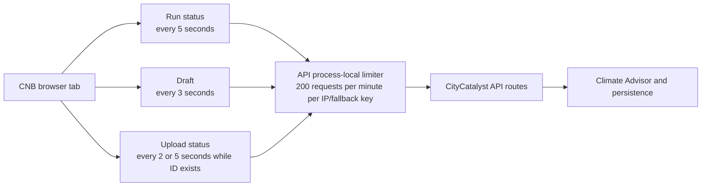
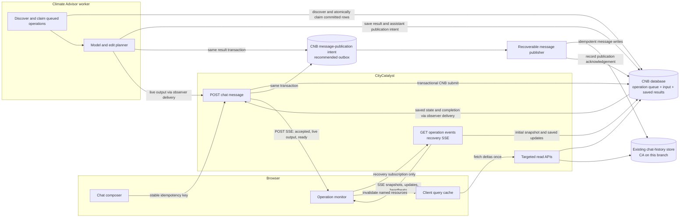
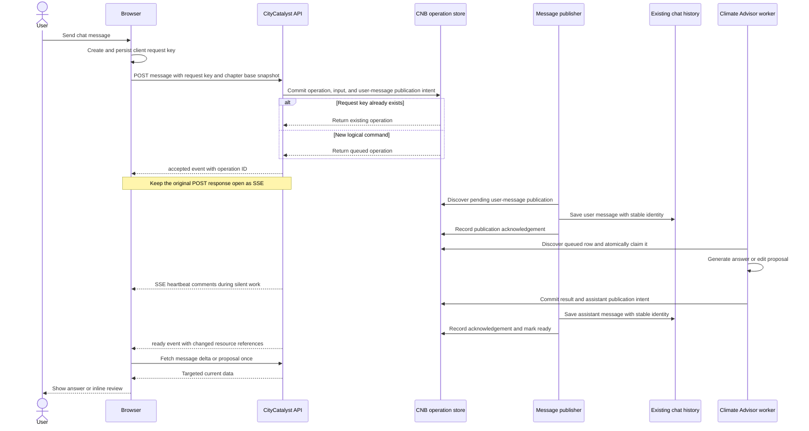
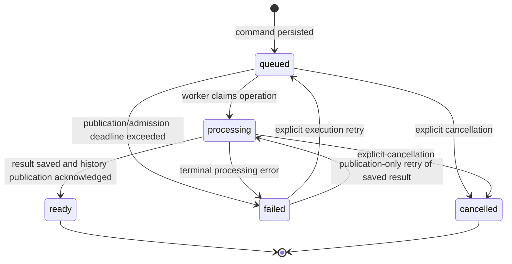
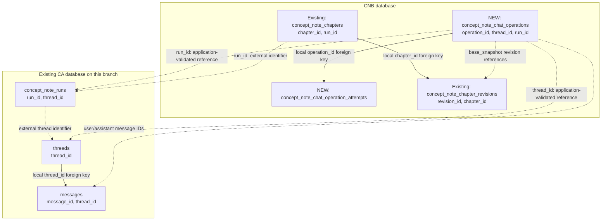

# CNB Chat Operation Architecture

## Implemented request-reduction scope (2026-09-22)

The API limiter, its identity selection, and its limits are unchanged. This branch
implements a **shared, adaptive observer**, not producer-driven events or durable
chat recovery. SSE is the delivery transport; active upstream resources are still
read periodically. The design proposals below are not all implemented.

- Stable workspaces have no recurring run/draft/upload/proposal status requests.
- Active resource reads are shared by `(authenticated user, run, resource,
  upload ID where applicable)` within a web process. Different resource selections
  can reuse the same resource observer. User data is never shared across users.
- Each active resource is read initially, then after 10 seconds. Unchanged states
  back off to 20 and 30 seconds; changed states return to 10 seconds. A terminal
  resource stops independently, even when another resource is still active.
- Run observation is needed only while its context bundle is building. Draft or
  upload activity alone no longer causes repeated run reads. Upload completion
  invalidates the run once to discover context-bundle processing.
- Processing edit proposals (including after reload) are observed until they leave
  processing. Initial reads and mutation/chat-result reconciliation remain.
- The server retries transient upstream failures once per shared observer, rather
  than making every subscriber reconnect. Run/draft/edit reads honor upstream
  Retry-After. Browser reconnection also honors Retry-After and uses exponential
  backoff with jitter; receiving a snapshot does not reset an interruption loop.
- Each SSE stream emits independent heartbeat comments without upstream reads.
  Last-subscriber disconnect stops the resource observer and aborts its HTTP read;
  individual upstream reads have a 30-second timeout.
- With Web Locks and BroadcastChannel, tabs for the same authenticated user,
  workspace and resource selection elect one connection owner. Followers receive
  cached snapshots locally and can take over after leader departure. Different
  selections can still open separate connections, but their overlapping resource
  reads are coalesced by the server when they reach the same process.
- Without those browser APIs, connections are independent; server coalescing still
  applies within one process. Multiple application replicas and independent browser
  profiles are **not** globally coordinated. There is no Redis/event bus/worker
  notification migration in this implementation.
- Redundant explicit run refreshes after upload retry and population save are
  removed; existing cache invalidation and terminal reconciliation remain.

### Request budgets and evidence boundary

For one unchanged active resource, the first minute includes four upstream reads
(at approximately 0, 10, 30 and 60 seconds); subsequent unchanged operation needs
about two reads/minute. Continuously changing active state is bounded by six reads
per minute after the initial read, per shared resource observer. These budgets
exclude authentication, initial page reads, mutation-triggered reconciliation and
reconnects. Upload status additionally reads the OCR job from the database.

Automated tests cover shared subscribers, user isolation, follower replay and
leadership transfer, terminal closure, last-subscriber cleanup, adaptive request
counts, upstream Retry-After, and processing-proposal recovery. They do not establish
live multi-tab request counts, production proxy identity or cross-replica behavior.
Worker-published events, persisted chat-operation recovery and full CC-806 acceptance
evidence remain follow-up work. Do not mark the original investigation complete from
these unit tests alone.


**Status:** Polling-removal implementation complete; browser and deployment verification pending

**Tracking ticket:** [CC-806 — Investigate polling-driven API rate-limit cascade and chat recovery](https://linear.app/openearth/issue/CC-806/cnb-investigate-polling-driven-api-rate-limit-cascade-and-chat)

**Related reliability ticket:** [CC-827 — Whole-document chat edits fail when the response stream disconnects](https://linear.app/openearth/issue/CC-827/cnb-whole-document-chat-edits-fail-when-the-response-stream)

**Scope:** Investigate and remove unnecessary CNB workspace polling that drives API rate-limit pressure; support chat completion and recovery without recurring browser status requests. Model-context rebuilding and the GHGI/CCRA refresh policy (R6), and limiter redesign (R11), are deferred.

**Recommended direction:** Replace recurring workspace reads with initial reads, mutation-triggered refreshes, and observation of active work; use durable chat submission with live POST SSE and a separate recovery SSE subscription.

## 1. Decision summary

The primary CC-806 objective is to remove unnecessary recurring run, draft, upload, and proposal requests and verify their effect on API rate-limit pressure. Durable chat operations support completion and recovery, but chat SSE alone does not replace the run/draft/upload pollers. Browser resource refresh and backend model-context rebuilding are separate concerns: deferring R6 does not defer polling removal.

When a user sends a CNB chat message, the browser should submit that logical command once. The backend persists the operation, immutable command input, and message-publication intent in the CNB database before acknowledging acceptance. The committed operation row is the durable queue entry. Chat history remains in its existing external store, linked by thread/message IDs; its publication is a separate recoverable step, not part of the same database transaction. The POST response delivers live assistant output over SSE; a separate observation endpoint recovers the operation after a disconnect or page reload.

The browser must not resubmit the message merely because the stream disconnects. It should resume the existing operation by its operation ID. Once processing completes, the client fetches only the resources named by the completion result, such as new messages or one edit proposal. It should not repeatedly reload the full concept note.

### Recommended API shape

1. `POST /api/v1/chat/messages` — create or replay one durable chat operation and return its live SSE response, starting with an `accepted` event after commit.
2. `GET /api/v1/chat/operations/{operationId}/events` — recover with an immediate saved snapshot, then observe further updates over the same SSE response.
3. Targeted reads — retrieve saved messages, one proposal, or changed chapters when the operation says they changed. Delta/cursor extensions and proposal routes below are proposed contracts, not all existing routes on this branch.
4. `GET /api/v1/concept-notes/{runId}/events` — implemented active-work observer for changed run, draft, and upload snapshots. This route replaces their recurring browser timers; it is separate from the proposed durable chat-operation recovery route.

### Review decisions and remaining choices

- R1: distinguish the branch baseline, the five-second mitigation reported in CC-806, and the target; keep investigation evidence separate from implementation delivery.
- Data placement: store operations and attempts in `CNB_DATABASE_URL`, linked to the existing chat thread and CA run by external IDs. Preserve existing chat history; section 7 records the accepted relationship/table design.
- R3: use committed operation rows as the durable work queue, with worker discovery independent of request-side notification.
- R5: keep live SSE on the POST response and recover through a separate observation endpoint. Do not introduce a separate normal-path `202` plus GET subscription.
- R8: users may continue editing through document components while chat prepares a proposal. A proposal may become stale; concurrency controls must not lock the document to chat-only use.
- R6: defer model-context rebuilding and once-per-opening GHGI/CCRA refresh. Preserve their current behaviour. Removing browser run/draft polling and refreshing displayed resources after mutations or asynchronous completion remain in scope; these do not introduce a new model-context rebuilding policy.
- R7: include a server-computed `request_fingerprint` in the CNB operation-table design. The same key with different command inputs is a conflict; the fingerprint itself is not unique. No migration has been executed.
- R10: persist monotonically increasing operation versions; recover saved progress and the final result from an authoritative snapshot. Ignore duplicate/older state updates and reconcile provisional streamed text with the persisted assistant message. Token-by-token replay is deferred.
- R11: defer rate-limiter redesign and additional resource-budget mechanisms. Keep the current limiter configuration, keying, storage, and route treatment unchanged; R1's read-only investigation remains in scope.

- D6: select a separate recovery SSE endpoint. Keep the normal live stream on the POST response; reconnect to the existing operation through GET SSE, with a saved snapshot first and subsequent updates on the same connection. Regular browser status polling and the proposed 25-second wait loop are removed from this design.

Current implementation scope makes polling removal the primary change, records D6's recovery transport choice, and preserves previously accepted decisions. The normal workspace now uses initial reads, mutation invalidation, and one active-work SSE observer instead of recurring run/draft/upload requests. Edit proposals are loaded from the normal chat tool result or explicit refresh rather than a status timer. Further work on durable chat operations, including the D6 chat recovery endpoint, and D1-D5 and D7 remains outside this implementation. R6's model-context policy and R11 remain deferred. Browser request-count, deployed proxy, and `429` verification are still required before closing CC-806.

## 2. Baselines, request pressure, and investigation evidence

### Branch baseline

Baseline inspected at `05d83ad97` on the CC-806 branch. These are source-derived interval budgets, not browser measurements or statements about current deployed behaviour.



**Text fallback:** This branch independently polls run, draft, and upload state. API requests share an IP/fallback bucket within each API process. The later chat-edit proposal poller described by CC-806 is absent from this baseline.

| Poll / owner | Interval and theoretical requests/minute | Activation and stop rule in this branch |
|---|---|---|
| Run / `ConceptNoteWorkspace/index.tsx` | 5 s / 12 | Unconditional while subscribed; no workflow-terminal stop rule |
| Draft / `ConceptNoteWorkspace/index.tsx` | 3 s / 20 | Unconditional while subscribed; no workflow-terminal stop rule |
| Upload / `ConceptNoteWorkspace/index.tsx` | 2 s / 30, otherwise 5 s / 12 | Enabled while an upload ID exists; interval uses `uploadDetails.status`, not the latest `refreshedUpload.status`; no terminal stop rule |
| Proposal / later chat-edit workspace | Absent here | Inventory on the implementation revision used for browser verification |
| Legacy wiring harness / `ConceptNoteWiringHarness/use-concept-note-wiring.ts` | 2 s / 30 when enabled | Separate harness controlled by `shouldPoll`; exclude from normal workspace totals |

Normal workspace queries use `skipPollingIfUnfocused`, and the Redux store installs `setupListeners`. Measure foreground/background windows and separate browser contexts; open tab count alone does not establish a traffic multiplier. RTK Query cache sharing within one store must be distinguished from independent stores in different tabs.

### Five-second mitigation and target comparison

CC-806 reports a locally tested five-second mitigation and a later busy-workspace baseline of approximately 82 requests/minute. Neither describes the implementation now present in this checkout.

| Workspace condition | This branch: theoretical requests/minute | CC-806 five-second mitigation: theoretical requests/minute | Target observation behaviour |
|---|---:|---:|---|
| Stable, no upload ID | 32 | 24 | No periodic stable-state reads; initial and triggered reads remain |
| Completed upload still attached | 44 if the terminal status selects 5 s; 62 if stale local state keeps 2 s | 36 | Stop upload observation at terminal status |
| Upload processing | 62 with the 2 s upload interval | 36 | Observe only active work until completion |
| Drafting, no upload ID | 32 | 24 | Observe active drafting and refresh affected data |
| Upload and proposal processing | No proposal poller in this branch; upload subtotal 62 | 48 | POST SSE for chat; other active workflows need explicit completion coverage |

Rates use `60 / interval_seconds` and exclude request duration, initial page queries, history, mutation-triggered refreshes, retries, and unrelated traffic. Removing recurring workspace polling is the primary planned change, independent of deferred R6 model-context work. The stable-state target is zero periodic run/draft/upload/proposal requests, not zero total API traffic. D6 recovery uses one SSE subscription per connection attempt; do not present target rates as measured savings.

### Evidence required to complete CC-806

- Pin the tested code revision and record route-level request counts for stable, uploading, drafting, and proposal-processing states.
- Reproduce or rule out the `429` cascade with controlled tab/window/context counts, focus state, and rate limiting enabled. Compare same-key queries within one store with independent tabs; record actual retry and invalidation traffic.
- Verify limiter identity and proxy-header handling separately in local, development, and production environments. The current limiter is process-local; do not describe it as a shared cluster-wide quota.
- Identify each poll owner, start condition, terminal stop condition, and overlap with explicit refreshes on the tested revision.
- Check submit/retry behaviour for duplicate messages and stable request-key reuse.
- Keep polling-driven `429` evidence separate from CC-757 token issuance and unrelated upstream `503` failures.
- Attach browser/request-count evidence and reviewed implementation recommendations. Create follow-up implementation tickets when delivery exceeds the investigation scope; the proposal itself does not close these criteria.

These measurements and environment checks remain pending in this document update.

## 3. Target architecture



**Text fallback:** CNB stores the command, queued operation, and intent to publish its user message together. A recoverable publisher writes chat history to its existing store using stable message identities. Workers discover eligible queued rows independently of the submitting request. Results and assistant publication intent are saved before terminal readiness. The POST carries live SSE; recovery attaches a separate GET SSE response that sends the saved snapshot first and then further updates.

Operation placement is decided: the CNB database owns operations, attempts, and their durable execution inputs. The existing architecture assigns durable chat ownership to CityCatalyst, while this branch's chat routes delegate persistence to CA through `CA_DATABASE_URL`. Use the actual history service's API and preserve its IDs; inventory that adapter on the implementation revision instead of assuming the CC `AssistantThread` table is the active store. This integration discrepancy does not move the CNB operation-table migration to CA or CC.

### Durable dispatch without a separate enqueue step

1. In one CNB transaction, commit immutable command input, a `queued` operation, and user-message publication intent. Acknowledge only after commit. This guarantees command recovery even if publication to chat history is interrupted.
2. A worker discovery loop finds queued rows at startup and at a bounded server-side interval. Atomically claim eligible work through the CNB persistence contract so competing workers cannot both claim the same queued attempt. The recommended ordering gate waits for acknowledgement of user-message publication before model execution; the queued row remains visible while delivery is pending.
3. An optional post-commit notification may reduce pickup latency. Correctness must not depend on that notification arriving: a crash after commit but before notification leaves discoverable work.
4. Replayed submissions return the existing operation rather than creating another queue entry. No browser connection is required for discovery or execution.
5. Keep the claim transaction short; model work runs after it commits. Lease expiry, stale-worker commit protection, retry bounds, and worker deployment still need the R4 ownership design before production implementation.

The queue guarantee is durable discoverability after acceptance. It does not promise exactly-once model invocation. The operation table remains the work queue; the message outbox proposed below handles the separate history write and does not require a broker.

### Publication across the CNB/chat boundary

Recommended mechanism: a CNB message outbox, committed with the associated command or saved result. Its payload must retain the message content (or an immutable durable reference), operation ID, stable message identity, role, ordering information, and delivery state. The history service deduplicates publication by that identity and verifies the thread/author binding. The current CA message writer generates a new UUID on each create, so the required idempotent publication contract is an implementation change, not an existing guarantee.

After model work, persist the result/proposal and assistant-message publication intent before attempting the external history write. A publisher records acknowledgement in CNB and only then marks the operation `ready` once every required result is retrievable. While delivery is pending, retain `processing` with progress stage `publishing`; the result is already saved and must not be regenerated. A lost acknowledgement triggers another idempotent delivery, not another model attempt.

The detailed outbox schema, delivery deadlines, and retry commands remain open under D2/D3 in section 14. Cancellation or retry must not republish a superseded assistant result. Failed publication must retain recoverable result data and an explicit error phase so recovery can retry delivery only. A notification is optional for discovering work; durable publication intent and required history writes are not optional.

## 4. End-to-end message sequence



**Text fallback:** The browser posts once. CNB durably deduplicates the command and records recoverable history publication. Climate Advisor works independently of the connection. Completion waits for the saved result and required history publication; the browser then retrieves the referenced resources. Heartbeats continue throughout silent execution and publication.

## 5. Disconnect and reload recovery

```mermaid
sequenceDiagram
    participant Browser
    participant API as CityCatalyst API
    participant Store as CNB operation store
    participant Worker as Climate Advisor worker

    Browser->>API: POST message with stable request key
    API-->>Browser: accepted with operation ID
    Worker->>Store: Discover and claim eligible queued operation
    Browser-xAPI: SSE connection is interrupted
    Worker->>Store: Continue processing independently
    Browser->>Browser: Reload and restore operation ID
    Browser->>API: GET operation events SSE with afterVersion=0
    API-->>Browser: snapshot event with saved state and current version
    alt Snapshot is still active
        Note over Browser,API: Keep this recovery SSE response open
        API-->>Browser: Heartbeat comments during silent work
        API-->>Browser: Newer persisted progress snapshots
        API-->>Browser: Terminal operation snapshot
        Browser->>API: Fetch saved result by reference when available
        Note over Browser: Close the observer after terminal reconciliation
    else Snapshot is terminal
        Browser->>API: Fetch saved result by reference when available
        Note over Browser: Close the observer; no further subscription needed
    end
```

**Text fallback:** Losing SSE never cancels or duplicates the operation. After reload, the browser restores the known operation ID and opens the recovery SSE endpoint. It receives the current saved snapshot immediately. Active operations send subsequent updates and heartbeat comments on that same response; terminal operations are reconciled and the observer is closed. An interrupted recovery stream reconnects with backoff to the same operation. It never resubmits the model command or starts a regular status-polling loop. Discovery when the operation ID was never received or has been lost remains the out-of-scope D5 topic.

## 6. Operation state machine



**Text fallback:** A new operation is queued while any required input publication is pending, then claimed for processing. Processing includes saved-result publication. It ends as ready only after required delivery is acknowledged, or as failed/cancelled. Failure phase determines whether recovery retries input delivery/execution through `queued` or saved-result publication through `processing`; publication-only retries never start model work. The same logical operation and message identities survive retries; cancellation and retry APIs remain open under D3.

## 7. Durable data model

### Relationship to existing data



**Text fallback:** A CNB operation links to the existing chat thread and CA run by external IDs. Local CNB foreign keys connect attempts to their operation and chapter revisions to their chapter. The operation's base snapshot references existing immutable chapter revisions; these JSON references are validated by application code, not foreign keys. One thread can have many operations, and one operation can have several attempts and one aggregate edit proposal.

Solid arrows identify local foreign-key relationships; dashed arrows identify application-validated references. Validate the requesting user's current access and the `run_id`/`thread_id` binding server-side. The existing `concept_note_runs.thread_id` is already an external identifier without a local foreign key. Do not infer that the CC `AssistantThread` model backs this branch's active chat path. If history storage later changes, preserve IDs or provide an explicit mapping at the history-service boundary.

Source anchors: [CA run binding](../climate-advisor/service/app/models/db/concept_note.py), [current chat thread](../climate-advisor/service/app/models/db/thread.py), [current message model](../climate-advisor/service/app/models/db/message.py), and [CNB chapters/revisions](../climate-advisor/service/app/models/db/cnb_workspace.py). Proposal persistence is absent from this branch baseline; confirm its table and link contract on the implementation revision rather than inventing an existing table here.

### Operation table: `concept_note_chat_operations`

This is the selected design for a new table in `CNB_DATABASE_URL`; no table or migration has been created by this document review.

| Column | PostgreSQL type | Purpose |
|---|---|---|
| `operation_id` | `uuid`, primary key | Stable operation identity |
| `thread_id` | `uuid` | Existing external chat thread ID |
| `run_id` | `uuid` | Existing external CA run ID |
| `requested_by_user_id` | `varchar(255)` | Authenticated submitting user; not a substitute for live permission checks |
| `client_request_key` | `uuid` | Stable submission/replay key |
| `request_fingerprint` | `varchar(64)` | Server-computed SHA-256 of canonical command inputs |
| `operation_type` | `varchar(32)` | `chat_answer` or `edit_proposal`; authoritative classification still needs D4 |
| `status` | `varchar(32)` | `queued`, `processing`, `ready`, `failed`, or `cancelled` |
| `version` | `bigint`, default `1` | Persisted operation-state version |
| `input_snapshot` | `jsonb` | Instruction, scope, options, and immutable inputs/references sufficient for execution |
| `base_snapshot` | `jsonb` | Ordered chapter IDs and their immutable revision IDs used for planning; an explicit empty snapshot for non-document commands |
| `progress` | `jsonb` | Latest saved milestone/counts, including publication phase when needed |
| `attempt_number` | `integer`, default `0` | Current model-execution attempt; delivery retries do not increment it |
| `user_message_id` | `uuid`, nullable | External user-message identity confirmed by the history service |
| `assistant_message_id` | `uuid`, nullable | External assistant-message identity confirmed by the history service |
| `proposal_id` | `uuid`, nullable | Result proposal reference; validate the actual proposal store contract |
| `error_code` | `varchar(128)`, nullable | Saved error; `progress.stage` distinguishes execution from publication failure |
| `created_at` | `timestamptz` | Creation time |
| `updated_at` | `timestamptz` | Last saved change |
| `completed_at` | `timestamptz`, nullable | Terminal transition time; cleared if an explicit retry reactivates the operation |

Thread/message UUID types match this branch's active CA path. Delivery intent must retain stable identities and payloads even before external message IDs are confirmed. Input/result references must remain recoverable for the operation's retention window; a mutable current-context pointer alone is insufficient. Do not include credentials in snapshots or publication payloads.

### Attempts and migration placement

`concept_note_chat_operation_attempts` resides in CNB with `attempt_id` (UUID primary key), `operation_id` (local foreign key), `attempt_number`, `status`, `error_code`, `started_at`, and `completed_at`. Enforce unique `(operation_id, attempt_number)`. R4 must specify the additional worker ownership/lease fields and commit checks; this table outline alone does not provide restart safety.

Use the independent [CNB Alembic chain](../climate-advisor/service/cnb_migrations/README.md) for these additions. Existing messages, runs, chapters, and chapter revisions stay in place. The recommended message outbox is also CNB-local; its exact schema and history-service idempotency contract remain to be specified under D2.

### Chapter base snapshot

The inspected model versions chapters individually; it does not establish a global document revision counter. Persist the ordered chapter membership and immutable `revision_id` values used for planning, including relevant structure/lock metadata if the edit relies on it. Verify that each revision belongs to the expected chapter and run. At apply time compare affected revisions and, for whole-document/structural changes, detect added, removed, or reordered chapters as well. Capture and apply must use a consistent snapshot/transaction protocol on the implementation revision.

This snapshot detects stale proposals while users continue editing elsewhere. It is separate from R10's operation `version`, which orders progress and lifecycle updates.

### Required constraints

- Unique `(thread_id, client_request_key)` prevents duplicate logical messages.
- At most one active chat edit-planning operation per concept-note run limits concurrent planning, not document editing through other components.
- `base_snapshot` identifies the chapter versions used for planning. A completed proposal may be stale and still remain reviewable.
- Required assistant-history publication is acknowledged and the result/proposal is durably retrievable before the operation becomes `ready`.
- An operation remains recoverable independently of the browser or SSE connection.
- Committed queued rows remain discoverable after the submitting process crashes, even if no wake-up notification was delivered.
- `version` starts at 1 when the operation is created and increases atomically with every externally visible saved state, progress, attempt, or result-reference change. It never resets when the same logical operation is retried.
- `progress` holds the latest saved milestone or counts needed for recovery. It is a snapshot, not a durable token log. Heartbeats and provisional text chunks do not advance `version`.

### Request fingerprint (R7)

Store a server-computed `request_fingerprint` alongside `client_request_key`. Hash a canonical representation of the instruction, run/thread scope, chapter base snapshot, and meaningful options; exclude credentials and transport-only metadata. The key identifies a submission, while the fingerprint detects reuse of that key for different inputs. Authenticate and validate access first, then resolve same-key replay before applying new-command stale-base or active-planner checks.

Same key and fingerprint returns the existing operation. Same key with different inputs returns `409 idempotency_key_reused`. A new key with the same fingerprint represents an intentional new command and is subject to normal admission rules; do not make the fingerprint unique. The client must preserve the original command envelope when retrying, rather than substituting the latest document snapshot under the old key.

This is an additive field in the planned CNB operation table, not a rewrite of existing message contents or document records. A fingerprint does not replace durable execution inputs. The canonicalization details and pre-acceptance recovery storage are implementation decisions in D5; no migration has been executed.

## 8. Endpoint contracts

### Submit a message

```http
POST /api/v1/chat/messages
Idempotency-Key: <stable client request key>
Content-Type: application/json
```

```json
{
  "threadId": "thread-id",
  "runId": "run-id",
  "clientMessageId": "client-message-id",
  "content": "Rewrite the chapters without repeating the project name.",
  "baseSnapshot": {
    "chapters": [
      { "chapterId": "chapter-id", "revisionId": "revision-id" }
    ]
  },
  "context": {
    "concept_note_edit": {
      "scope": { "kind": "auto" }
    }
  }
}
```

This is a proposed CNB request envelope, not the current route's implemented schema. Validate the requested thread/run binding and chapter snapshot against the authorized saved data; never treat client-supplied IDs as proof of ownership. Preserve the validated envelope for replay and execution.

After committing the CNB operation/input/publication intent, the POST returns `200` with `Content-Type: text/event-stream`. Its first SSE event must be `accepted`, containing at least:

```json
{
  "event": "accepted",
  "operationId": "operation-id",
  "version": 1,
  "status": "queued",
  "replayed": false
}
```

A retry with the same key returns the same operation and sets `replayed` to `true`. The example shows a newly queued operation; a replay returns the actual saved version and status, not a reset to version 1 or `queued`.

Live assistant output and the terminal `ready`, `failed`, or `cancelled` event continue on this same POST response. Pre-acceptance validation, authorization, or CNB persistence failures return an appropriate HTTP error without an `accepted` event. After acceptance, a history outage remains a recoverable publication state or explicit operation failure. Opening the stream is observation, not ownership of model execution.

Emit SSE comment heartbeats, for example `: heartbeat` followed by a blank line, approximately every 15 seconds even when the model produces no events. Flush them through the CA-to-CC proxy and the browser response; verify delivery through the deployed load balancer. Heartbeats create no additional HTTP requests or model calls. The client parser must ignore comments. See the [SSE authoring guidance](https://html.spec.whatwg.org/dev/server-sent-events.html#authoring-notes).

The worker-to-observer delivery mechanism must support the selected worker/API deployment topology. A missing or slow subscriber must not cancel or block the worker. Closing or reloading the page detaches the observer; recovery uses the separate endpoint below.

### Recovery SSE subscription (D6 selected)

```http
GET /api/v1/chat/operations/{operationId}/events?afterVersion=3
Accept: text/event-stream
```

Possible results:

- `200` with `Content-Type: text/event-stream`; the first `snapshot` event contains current saved state, including when its version equals the supplied cursor.
- Active operations keep that response open for further saved updates and comment heartbeats approximately every 15 seconds. Silence does not return a periodic `204` or require another HTTP request.
- A terminal initial snapshot or subsequent terminal event completes observation. The client explicitly closes its observer and suppresses automatic reconnect for that terminal operation.
- `404` when the operation does not belong to the authenticated user and thread.
- `410` only when retention has intentionally expired and the durable result is no longer available.

Validate authentication, access, retention, and cursor before opening the response. On a transport interruption, reconnect to this GET endpoint with backoff and the last reconciled version. The server sends a fresh authoritative snapshot on every attachment; it need not replay intermediate progress or text tokens. State events may use the operation version as their SSE `id`; heartbeat comments have no state version. Stop transport retries when authentication or access requires user action, rather than treating every error as a temporary disconnect. This endpoint adds no new background-credential renewal mechanism.

### Versioned snapshots and client reconciliation (R10)

1. On initial recovery, open the GET SSE endpoint with `afterVersion=0`. Every connection starts with the latest saved snapshot, so it can restore UI state after reload even when a saved cursor exists but its associated local state was lost. Later reconnections may supply the latest reconciled version.
2. After the initial snapshot, push newer persisted versions over the same response. Do not open parallel normal-path and recovery observers for the same operation. A terminal snapshot is delivered immediately even when its version equals the cursor; the client closes observation once reconciled. An explicit processing retry may start observation again under the same operation ID and a higher version; the retry command itself belongs to D3.
3. Every durable SSE state/progress/completion event carries `operationId`, `version`, `status`, the current attempt number when available, saved progress, and all currently available result/resource references. The snapshot must remain sufficient when intermediate notifications were missed; it must not contain only the last change. Failed terminal snapshots include the saved error code when available.
4. Apply newer snapshots only to the matching operation. Ignore older state and duplicate side effects from an already handled `(operationId, version)`. An equal-version snapshot may hydrate missing UI state after reload or complete an outstanding result fetch. A repeated completion must not append another assistant message or proposal; retry failed result reads by their stable references.
5. Treat text chunks on the live POST response as provisional. On recovery, display saved progress; on completion, fetch the persisted assistant message and reconcile/replace its provisional text rather than appending the saved answer. Discard chunks from a detached response or superseded attempt, and ignore late text after terminal reconciliation. Token-by-token recovery and persistence of every streamed chunk are outside the selected R10 scope.
6. When notifications wake observers, establish listening before reading the authoritative snapshot, then stream saved changes. Re-read persisted state after notifications, after listener recovery, and through bounded server-side reconciliation so a missed notification does not hide completion indefinitely. These are server-side checks, not recurring browser requests. A listener reconnect repeats the setup sequence. See the [PostgreSQL listen/snapshot ordering guidance](https://www.postgresql.org/docs/current/sql-listen.html).

An omitted cursor is treated as `0`; negative, malformed, or ahead-of-current cursors return `400 invalid_operation_version`. The client recovers an invalid cursor by requesting a fresh snapshot, not by resubmitting the command. Operation `version` and chapter `base_snapshot` are separate: the former orders operation updates, while the latter identifies the document state used for planning.

Example terminal SSE event data (JSON payload):

```json
{
  "operationId": "operation-id",
  "version": 4,
  "status": "ready",
  "attemptNumber": 1,
  "progress": { "stage": "completed" },
  "assistantMessageId": "assistant-message-id",
  "proposalId": "proposal-id",
  "resourcesChanged": [
    "chat_messages",
    "edit_proposal"
  ]
}
```

### Proposed targeted-read extensions

```http
GET /api/v1/chat/threads/{threadId}/messages?after={lastMessageId}
GET /api/v1/concept-notes/{runId}/edit-proposals/{proposalId}
GET /api/v1/concept-notes/{runId}/draft?chapters={changedChapterIds}
```

These shapes require implementation verification: this branch's message proxy forwards `limit`, not `after`, and the displayed proposal/draft filtering contracts must be implemented or adjusted to the actual edit branch. A UUID by itself is not a chronological cursor; define stable message ordering and cursor semantics under D7.

The selected goal is to fetch referenced results once instead of repeatedly loading the full draft. Whether to add chapter deltas immediately or fetch the full draft once after apply remains D7; this document does not assume the delta endpoints already exist.

## 9. Concurrency and retry rules

### Chat planning and editing through document components

- Serialize active chat edit-planning operations per concept-note run. This restriction does not lock the document or disable manual/component edits, other valid document workflows, or review of an existing proposal.
- A second distinct chat edit request while planning is active returns `409` with the active operation ID. Preserve the unsent instruction in the composer and explain that it was not accepted; observing the existing operation must not imply that it contains the second instruction.
- Capture the selected saved chapter snapshot when accepting a new planning operation. Users may change the document while that operation runs; those changes do not automatically cancel planning.
- Planning produces a separate proposal and never applies it to the saved document. `ready` means the result was persisted, not that it is current or accepted.
- A proposal may become stale during planning or review. Keep it visible and label the mismatch; a finished proposal does not retain the active-planning restriction.
- At apply time, check the relevant current revisions atomically with the write. A stale proposal must not silently overwrite intervening edits. The user may keep editing through components, reject the proposal, or request a refreshed proposal. Conflict-aware partial apply or rebasing needs a separate decision.

### Informational chat

- Independent read-only execution is a candidate, not a settled ordering policy. Define authoritative classification and conversation-history ordering under D4 before allowing parallel turns on the same thread.
- Their operation records still use stable request keys and durable terminal states.

### Retries

- Network retry before acceptance reuses the same client request key.
- Stream recovery subscribes to GET SSE for the existing operation ID.
- Model-execution retry creates a new attempt under the same logical operation. Publication-only retry reuses the saved result and message identity without another model attempt.
- A materially changed user instruction creates a new operation and new request key.

## 10. Complexity evaluation

Let:

- `T` be processing duration.
- `W` be the long-wait timeout.
- `R` be the number of recovery connection attempts.
- `N` be the complete concept-note payload size.
- `Delta` be the changed message, proposal, or chapter payload size.
- `U` be the number of active users.

| Design | Request complexity per operation | Data transferred after completion | Reliability |
|---|---:|---:|---|
| Current independent polling | `O(T / interval × endpoints)` | Repeated resource reads | Weak under multiple tabs |
| Two routes with ordinary polling | `O(T / interval)` | Usually `O(N)` | Better, but still rate-sensitive |
| Two routes with long waiting | `O(T / W)` | `O(Delta)` or one `O(N)` fetch | Good |
| Durable POST SSE + recovery GET SSE | Normal case `O(1)`; recovery `O(R)` | Saved snapshots plus result reads | Selected; durable execution/publication still require their own implementation |
| Webhook without browser push or waiting | Incomplete | Undefined | Does not update an open browser |

Long waiting is retained in the table only as an unselected comparison. The selected path has one POST stream, followed only after interruption by GET SSE recovery connections; each may stay open for the remaining operation duration. Heartbeats add bytes, not HTTP requests. Model processing complexity does not change. Durable deduplication prevents new logical jobs from replayed submissions, but crash recovery can still repeat a model invocation. The table counts observation requests, not open connections, server-side discovery/reconciliation queries, or retry costs. Across `U` users making one logical submission each, command submissions remain `O(U)`.

## 11. Delivery phases and polling scope

Polling removal is the primary delivery track. The normal workspace implementation removes recurring run, draft, upload, and proposal browser timers. While run context, draft generation, or upload processing is active, one authenticated SSE route rechecks only the selected server-side resources, emits an immediate snapshot and subsequent changes, sends heartbeats, and closes when all selected resources are terminal. The client reconnects only after transport interruption, using exponential backoff with jitter. Mutation invalidation and explicit proposal refresh remain one-off reads.

Chat-operation durability and D6 recovery are supporting architecture; their delivery must not substitute for the implemented workspace polling removal. The durable operation records and `/chat/operations/{operationId}/events` route are not implemented by this change, and the deferred D1-D5 and D7 design work is not reopened.

### Primary change: workspace observation without recurring browser polling

| Resource | Initial and triggered reads | Active-work observation and stop rule |
|---|---|---|
| Run | Read on workspace entry; refresh after a mutation or completion that changes run state | Observe active generation until terminal state; remove the unconditional five-second browser poll |
| Draft | Read on workspace entry; refresh after a successful component save, proposal apply, or draft-generation completion | Remove the unconditional three-second browser poll; chat completion alone is not evidence that a draft was changed |
| Upload | Read the attached upload's current state on entry or attachment | Observe only nonterminal processing; stop on `ready` or `failed`, using the latest authoritative state |
| Proposal | Read when chat completion identifies a saved proposal, and refresh after review/apply mutations | Use POST SSE or recovery GET SSE for chat processing; do not introduce a proposal-status poller |

For non-chat upload and draft generation, wire an explicit completion/status observation path before deleting the corresponding poller. Reuse a suitable existing stream where available; otherwise specify a narrowly scoped SSE subscription for the active workflow. The chat-operation endpoint must not be assumed to cover these separate workflows. Verify the actual producer and route on the implementation revision; this document does not claim such non-chat endpoints already exist. A broad event bus is not required by this plan.

On entry or reload, read current resource state and attach observation if work is still active. The observer must reconcile a saved snapshot when attaching and reconnecting so completion during a disconnect cannot be missed. Close observers on terminal state or workspace disposal. After returning to a workspace or regaining connectivity, a one-off revalidation may reconcile changes made elsewhere; this does not promise immediate cross-tab synchronization. Coalesce refreshes for the same resource/version so mutation responses, cache invalidation, and completion events do not cause duplicate reads.

Refreshing browser data after a component save is part of this track. Changing when the backend rebuilds model context or reloads GHGI/CCRA is still deferred under R6. One full draft fetch after a relevant change is acceptable for this scope; chapter-delta API design remains deferred under D7.

### Immediate safeguards

1. Stop upload polling completely when the latest authoritative upload status is `ready` or `failed`; use `refreshedUpload` before the initial `uploadDetails` snapshot.
2. Remove unconditional run/draft browser polling using the initial-read, mutation-refresh, and active-work observation rules above. An interim stop-condition fix does not complete this requirement.
3. Apply exponential backoff with jitter after `429` and `503`.
4. Prevent explicit mutation refreshes from overlapping a scheduled poll.
5. Keep the current limiter configuration and keying unchanged while R11 is deferred; inspect identity and request pressure as part of R1 without changing limiter behaviour.

### Durable chat operation

1. Add CNB operation/attempt records with request-key constraints and fingerprint checking, plus the selected durable message-publication mechanism.
2. Persist the command input, operation, and publication intent in one CNB transaction; deliver chat messages through an idempotent external history contract.
3. Make committed operation rows the durable queue; discover work at startup and at a bounded server-side interval, with atomic claims and optional wake-up notifications. Complete worker ownership/recovery rules before implementation.
4. Keep the original POST response as SSE, emit the operation ID in the first event after commit, and send independent heartbeat comments during silent work.
5. Persist the result/proposal and publication intent, confirm required external history delivery, then mark the operation ready. A delivery failure must not rerun successful model work.

### Recovery and targeted refresh

1. Add the recovery GET SSE route with an immediate authoritative snapshot and subsequent saved updates on the same response.
2. Persist active operation IDs in browser session storage and maintain the latest reconciled version while observing each operation.
3. On mount or reload with a known operation ID, recover its snapshot through GET SSE; keep observing only while active and explicitly close on terminal state.
4. Return saved progress and complete current result/resource references with versioned snapshots; reconcile the final assistant message by ID and deduplicate repeated completion effects.
5. Use completion on the POST stream or recovery GET SSE; reconnect with backoff only after transport interruption, without a recurring browser status timer.
6. Refresh run/draft resources only when an initial read, relevant mutation, completion, or one-off revalidation requires it. Cover non-chat generation and upload completion separately; preserve the deferred model-context policy.

## 12. Failure handling

| Failure | Required behaviour |
|---|---|
| Initial POST response is lost | Retry with the same request key; receive the existing operation |
| Submitting process crashes after commit, before worker notification | Worker discovery finds the queued row without a new user submission |
| Worker wake-up notification is lost | Bounded server-side discovery still finds eligible queued work |
| History write succeeds but CNB acknowledgement is lost | Retry publication with the same stable identity; the history service returns the existing message |
| Model result is saved but assistant-history delivery fails | Retain the result, show publication progress/error, and retry delivery without another model invocation |
| Model is silent for longer than the proxy idle timeout | Independent SSE comment heartbeats keep the POST response active; verify through the deployed proxy chain |
| SSE disconnects | Continue server-side processing and reconnect through recovery GET SSE with backoff |
| Browser reloads with a known operation ID | Open recovery GET SSE, receive its saved snapshot first, and observe until terminal |
| Duplicate or out-of-order operation update arrives | Ignore older versions and duplicate effects; allow a snapshot to restore missing local state or retry an outstanding result read |
| Completion is saved while the browser is disconnected | Recover the terminal snapshot and saved result without replaying the model or every text chunk |
| State changes while observation is being attached | Establish listening before the snapshot read, reconcile persisted state, and deliver the latest snapshot on SSE |
| Saved observer cursor is invalid | Fetch a fresh snapshot with `afterVersion=0`; do not submit another command |
| Worker crashes | Mark or reclaim the stale attempt without duplicating the user message |
| Model fails | Persist a terminal error code and show an explicit retry action |
| User edits through another component during planning/review | Allow the edit; keep the proposal separate and mark it stale when relevant revisions differ |
| Proposal becomes stale | Keep it reviewable; reject an unsafe apply without blocking manual editing |
| Second distinct chat edit arrives during planning | Return conflict and active operation ID, preserve the new instruction, and do not imply it was accepted |
| Recovery stream is silent | Send heartbeat comments on the open response; do not start periodic browser requests |
| Terminal event arrives or was already saved before connection | Reconcile the terminal snapshot and close the client observer to prevent automatic reconnect loops |
| `429` or `503` | Back off with jitter; do not resend the logical command with a new key |

## 13. Observability

Track one correlation chain across browser, CityCatalyst, and Climate Advisor:

- `client_request_key`
- `operation_id`
- `version`
- `thread_id`
- `run_id`
- `attempt_number`
- Chapter IDs/revision IDs from `base_snapshot`, as needed for diagnostics; never log the snapshot's full input content
- `proposal_id`, when produced

Recommended metrics:

- Operations created versus idempotently replayed.
- Time in queued and processing states.
- Age of the oldest eligible queued operation and worker discovery/claim delay.
- Queued operations recovered without a submit-side notification.
- Message-publication backlog age, retry count, and terminal delivery failures.
- SSE disconnect and recovery rate.
- Recovery SSE connection attempts per operation.
- Duplicate-submission conflicts.
- Stale-proposal rate.
- Requests per active CNB tab.
- `429` and `503` responses by route.

## 14. Review checklist

### Scope decision and future topics

D6's second transport option is selected: retain POST SSE for normal delivery and use a separate recovery GET SSE subscription, beginning with saved state and continuing with live saved updates. There is no regular browser status-polling loop. Existing authorization applies to the observer; redesigning worker credentials or other backend lifecycle mechanisms is outside this scope update.

The following topics are outside the current work scope. Retain them for future reference without treating their resolution as a prerequisite for completing this document update. Previously accepted table, queue, fingerprint, and versioning decisions remain recorded; R6 and R11 remain deferred.

| ID | Future topic — outside current scope | Retained design context |
|---|---|---|
| D1 / R4 | Worker deployment, atomic ownership/lease renewal, stale-worker commit protection, recovery deadlines, and checkpoints | Use CNB-owned claims through CA worker services; choose bounded whole-attempt retry first or explicitly require chapter checkpoints. Field names, timeouts, and fencing are not yet specified. |
| D2 | Cross-database message/result publication | Use the CNB outbox described in section 3, with stable message identities and delivery acknowledgements. Confirm schema, actual history API, user-message ordering gate, and result retention during delivery failures. |
| D3 / R9 | Retry/cancel API and races with completion/publication | Separate execution retry from delivery retry; define idempotent commands and cancellation's effect on a saved but unpublished result. Decide whether cancellation ships initially. |
| D4 | Initial chat scope, read-only ordering, and edit classification | Decide CNB edits only versus all CNB chat commands on the shared route; preserve other chat modes. Define how edit admission is known before planning and how concurrent turns select consistent conversation history. |
| D5 | Recovery before the first `accepted`, request canonicalization, and reopening without session storage | Persist the original client command envelope/key until acceptance; define a server lookup for active operations by authorized thread/run. Set retention/tombstone rules so late retries cannot recreate completed work. |
| D7 / R12 | Result-read size and exact contracts | Decide one full draft fetch after apply versus chapter deltas; specify stable message cursors and the real proposal schema on the implementation branch. |

### Accepted design

- [x] Data-placement decision: operations/attempts live in CNB; thread/run/message bindings are external references, not cross-database foreign keys.
- [x] R7 design decision: include `request_fingerprint` in the CNB operation table; preserve original command inputs on same-key replay.
- [x] Design decision: the existing SSE POST remains the primary live path; the separate observation endpoint is recovery-only.
- [x] Design decision: committed operation rows form the durable queue; notification is optional for correctness.
- [x] Design decision: component/manual edits remain available during chat planning and review; proposals may become stale.
- [x] R10 design decision: durable operation versions and saved progress/result snapshots support recovery; token-by-token replay is deferred.
- [x] R11 decision: preserve the current rate limiter; redesign and additional resource-budget mechanisms are deferred.
- [x] D6 decision: select separate recovery GET SSE with snapshot-first delivery and subsequent updates on the same response; replace the 25-second wait-loop proposal.
- [x] Scope decision: further work on D1-D5 and D7 is excluded from the current task.
- [x] Primary scope: remove recurring workspace polling; chat recovery is supporting work, not a substitute for the CC-806 request-pressure fix.
- [x] R6 decision: defer model-context rebuilding and GHGI/CCRA refresh-policy changes; browser resource refresh and polling removal remain in scope.

### Primary CC-806 verification to perform for delivery

- [x] Inventory every normal-workspace run/draft/upload/proposal poller on the implementation revision and replace it, including active upload and draft-generation observation. Preserve the explicitly separate legacy wiring harness.
- [ ] Verify zero periodic run/draft/upload/proposal requests in a stable workspace, including with a completed upload attached.
- [ ] Verify live upload and draft-generation completion, failure, reload, and disconnect recovery without recurring browser status requests or stale displayed results.
- [ ] Verify component saves and proposal applies refresh affected browser resources without duplicate reads or changes to the deferred model-context policy.
- [ ] Measure route-level requests before and after changes in stable, uploading, drafting, and proposal-processing states, including controlled multiple tabs and focus/reconnect transitions.
- [ ] Reproduce or rule out the polling-driven `429` cascade with the current limiter unchanged; verify limiter identity in the required environments and keep unrelated `503`/CC-757 failures separate.
- [ ] Attach the CC-806 browser evidence and environment/revision identity. A successful chat stream alone does not satisfy these checks.

### D6 implementation verification to perform when implemented

- [ ] Verify initial snapshot delivery for active and already terminal operations, heartbeat delivery, and newer snapshots on the same GET response.
- [ ] Verify transport reconnect with backoff, no command resubmission, and no regular browser status requests.
- [ ] Verify explicit observer closure after terminal reconciliation, including the already-terminal-on-attach case.
- [ ] Verify existing access checks and snapshot/version reconciliation on the recovery endpoint.

### Retained future verification — outside current work

- [ ] Confirm D1/D2's worker and message-publication contracts, including the current history adapter and restart recovery.
- [ ] Verify current access and thread/run/revision bindings, including deletion or revoked access during an operation.
- [ ] Verify post-commit/pre-notification crash recovery and competing worker claims.
- [ ] Verify independent SSE heartbeats and a long silent edit through the deployed load balancer.
- [ ] Verify reload snapshot hydration, version ordering across retries, duplicate completion, failed result-read recovery, and a change during observer attachment.
- [ ] Verify chat-planning serialization without blocking component edits and with atomic stale-apply checks.
- [ ] Resolve D4's chat classification/scope and history-ordering policy.
- [ ] Confirm operation retention and cleanup policy.
- [ ] Confirm targeted chapter reads or accept a full draft fetch only after apply.
- [ ] Verify canonical fingerprint stability, same-key conflicts, new-key repeated instructions, and loss of the first acceptance response.
- [ ] Verify history write/acknowledgement loss and saved-result delivery recovery without a duplicate message or model invocation.

## 15. Recommended decision

Prioritize removing unconditional run/draft polling, terminal upload polling, and recurring proposal-status reads. Use initial resource reads, refreshes after relevant mutations, and snapshot-recoverable observation of active workflows. Wire non-chat upload/generation completion as well as chat completion, then verify request reductions and the polling-driven rate-limit cascade under CC-806. Do not call the polling problem fixed based only on chat reliability improvements.

Keep the live SSE POST response, including independent heartbeats. For D6, use a separate recovery GET SSE response that sends the current saved snapshot immediately and subsequent updates on the same connection. Reconnect only after interruptions, with backoff; close observation on terminal state. Preserve the previously accepted CNB operation/table, fingerprint, queue, versioning, and manual-editing decisions. Keep the current rate limiter unchanged while R11 is deferred.

Further work on D1-D5 and D7 is outside the current scope. R6 defers model-context rebuilding and GHGI/CCRA refresh-policy changes, not browser polling removal. D6's transport decision does not itself provide worker restart safety, cross-database publication, or operation discovery when its ID is unknown. The workspace observer now covers non-chat run, draft, and upload completion, but durable chat-operation recovery remains unimplemented. This change does not execute migrations or establish browser/deployment evidence.

