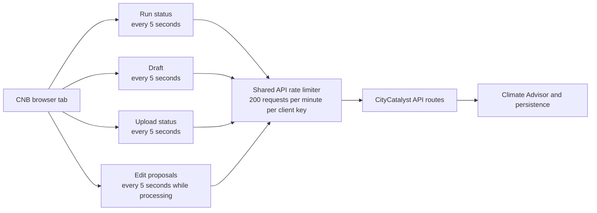
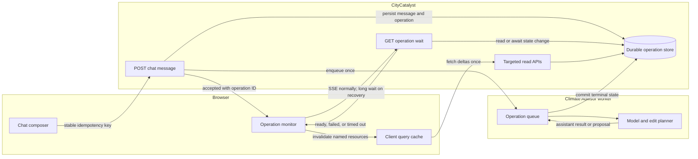
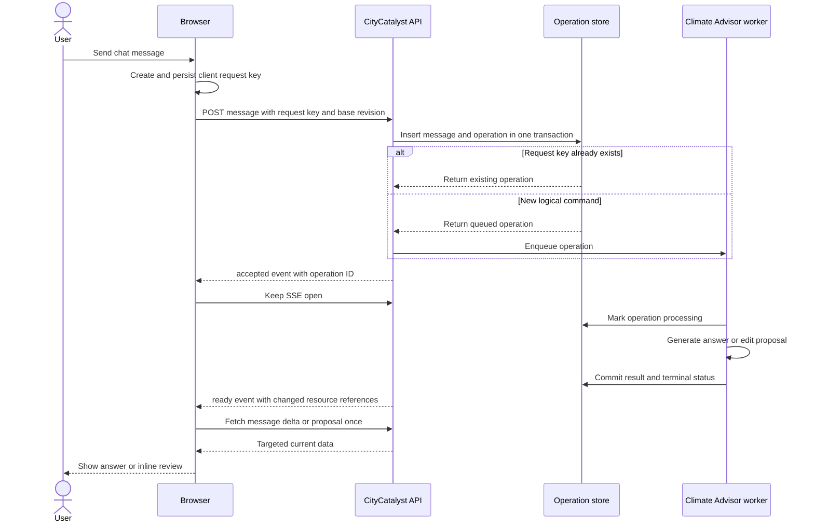
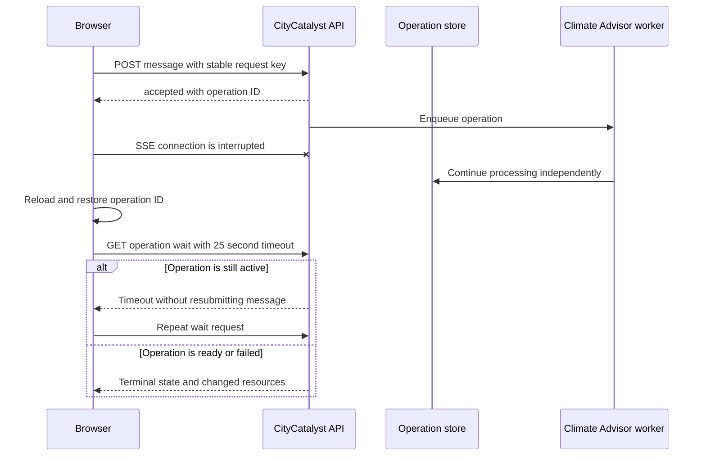
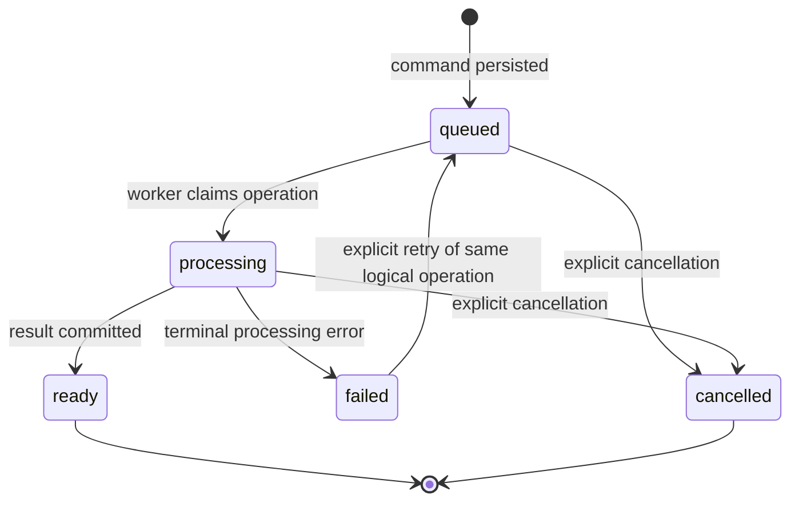
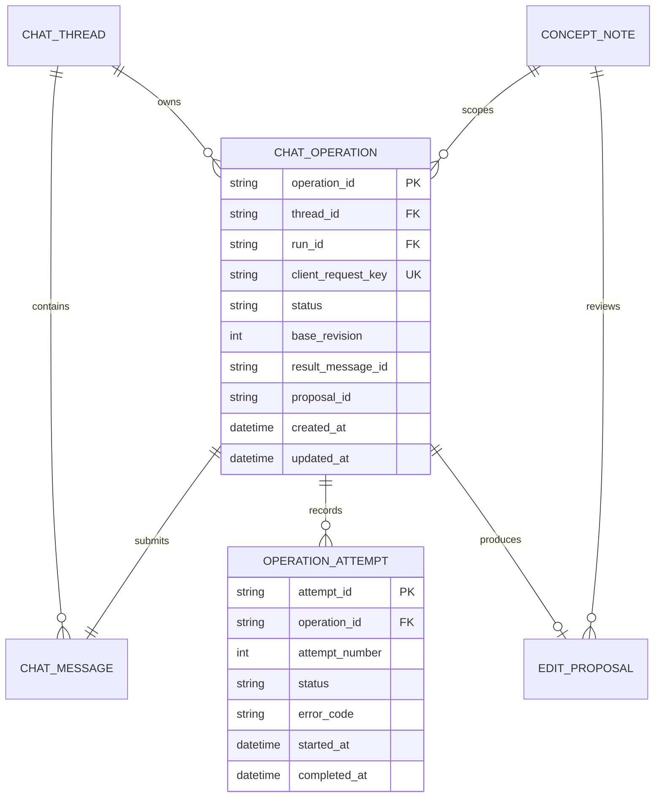

# CNB Chat Operation Architecture

**Status:** Proposed for review

**Tracking ticket:** [CC-806 — Investigate polling-driven API rate-limit cascade and chat recovery](https://linear.app/openearth/issue/CC-806/cnb-investigate-polling-driven-api-rate-limit-cascade-and-chat)

**Scope:** Concept Note Builder chat messages, edit proposals, recovery, and removal of high-frequency workspace polling

**Recommended direction:** Durable command submission with live SSE delivery and a long-wait recovery route

## 1. Decision summary

When a user sends a CNB chat message, the browser should submit that logical command once. The backend should persist the user message and an operation record before starting model work. The existing SSE response can continue to deliver live assistant output, while a separate wait route recovers the operation after a disconnect or page reload.

The browser must not resubmit the message merely because the stream disconnects. It should resume the existing operation by its operation ID. Once processing completes, the client fetches only the resources named by the completion result, such as new messages or one edit proposal. It should not repeatedly reload the full concept note.

### Recommended API shape

1. `POST /api/v1/chat/messages` — create or replay one durable chat operation.
2. `GET /api/v1/chat/operations/{operationId}/wait` — wait for a state change or recover after interruption.
3. Existing targeted read routes — retrieve message deltas, one proposal, or changed chapters only when the operation says they changed.

## 2. Current architecture and request pressure



**Text fallback:** One browser tab independently polls run, draft, upload, and proposal state. Every request passes through the same API limiter before reaching the CityCatalyst routes and Climate Advisor. Several open tabs or shared local client keys can exhaust the limiter.

Approximate CNB background traffic per active tab:

| Workspace condition | Requests per minute |
|---|---:|
| Stable, no upload ID | 24 |
| Stable, completed upload still attached | 36 |
| Upload processing | 36 |
| Upload and proposal processing | 48 |

This excludes initial page queries, chat history, explicit mutation refreshes, retries, and unrelated application traffic.

## 3. Target architecture



**Text fallback:** The composer sends one command with a stable idempotency key. CityCatalyst durably records it and queues Climate Advisor work. The operation monitor receives live output over SSE. If that stream is lost, it waits on the saved operation rather than resending the message. Completion names the resources the client should fetch once.

## 4. End-to-end message sequence



**Text fallback:** The browser saves a request key and posts once. The API deduplicates that command transactionally. Climate Advisor processes it independently of the browser connection. SSE normally returns the result, after which the browser retrieves only the changed resource.

## 5. Disconnect and reload recovery



**Text fallback:** Losing SSE never cancels or duplicates the operation. The worker continues. After reload, the browser restores the operation ID and repeats only the wait request until it receives a terminal result.

## 6. Operation state machine



**Text fallback:** A new operation is queued, then claimed for processing. It ends as ready, failed, or explicitly cancelled. A controlled retry reuses the same logical operation rather than inserting another user message.

## 7. Durable data model



**Text fallback:** Threads contain messages and operations. Every operation belongs to one concept note and submits exactly one user message. It may record several controlled processing attempts and optionally produce one reviewable edit proposal.

### Required constraints

- Unique `(thread_id, client_request_key)` prevents duplicate logical messages.
- At most one active edit operation per concept-note run prevents concurrent edits from the same base revision.
- `base_revision` makes stale edit planning detectable.
- Assistant messages and proposal references are committed before the operation becomes `ready`.
- An operation remains recoverable independently of the browser or SSE connection.

## 8. Endpoint contracts

### Submit a message

```http
POST /api/v1/chat/messages
Idempotency-Key: <stable client request key>
Content-Type: application/json
```

```json
{
  "threadId": "thread-id",
  "clientMessageId": "client-message-id",
  "content": "Rewrite the chapters without repeating the project name.",
  "baseRevision": 14,
  "context": {
    "concept_note_edit": {
      "scope": { "kind": "auto" }
    }
  }
}
```

The first SSE event, or an immediate `202` response if streaming is separated, must contain:

```json
{
  "event": "accepted",
  "operationId": "operation-id",
  "status": "queued",
  "replayed": false
}
```

A retry with the same key returns the same operation and sets `replayed` to `true`.

### Recover or wait

```http
GET /api/v1/chat/operations/{operationId}/wait?afterVersion=3&timeout=25
```

Possible results:

- `200` with a changed or terminal operation.
- `204` when the wait expires without a state change.
- `404` when the operation does not belong to the authenticated user and thread.
- `410` only when retention has intentionally expired and the durable result is no longer available.

Example terminal response:

```json
{
  "operationId": "operation-id",
  "version": 4,
  "status": "ready",
  "assistantMessageId": "assistant-message-id",
  "proposalId": "proposal-id",
  "resourcesChanged": [
    "chat_messages",
    "edit_proposal"
  ]
}
```

### Targeted reads

```http
GET /api/v1/chat/threads/{threadId}/messages?after={lastMessageId}
GET /api/v1/concept-notes/{runId}/edit-proposals/{proposalId}
GET /api/v1/concept-notes/{runId}/draft?chapters={changedChapterIds}
```

The full draft should be fetched only when the server cannot safely express the affected chapter set or after a whole-document replacement.

## 9. Concurrency and retry rules

### Editing requests

- Serialize document-changing operations per concept-note run.
- A second edit request while one is active returns `409` with the active operation ID.
- The client resumes the existing operation rather than silently queuing an instruction against an unknown revision.
- A new edit starts only from the latest accepted draft revision.

### Informational chat

- Read-only questions may be queued independently if they do not mutate the draft.
- Their operation records still use stable request keys and durable terminal states.

### Retries

- Network retry before acceptance reuses the same client request key.
- Stream recovery waits on the existing operation ID.
- Processing retry creates a new attempt under the same logical operation.
- A materially changed user instruction creates a new operation and new request key.

## 10. Complexity evaluation

Let:

- `T` be processing duration.
- `W` be the long-wait timeout.
- `N` be the complete concept-note payload size.
- `Delta` be the changed message, proposal, or chapter payload size.
- `U` be the number of active users.

| Design | Request complexity per operation | Data transferred after completion | Reliability |
|---|---:|---:|---|
| Current independent polling | `O(T / interval × endpoints)` | Repeated resource reads | Weak under multiple tabs |
| Two routes with ordinary polling | `O(T / interval)` | Usually `O(N)` | Better, but still rate-sensitive |
| Two routes with long waiting | `O(T / W)` | `O(Delta)` or one `O(N)` fetch | Good |
| Durable POST + SSE + wait recovery | Normal case `O(1)`; recovery `O(T / W)` | `O(Delta)` | Recommended |
| Webhook without browser push or waiting | Incomplete | Undefined | Does not update an open browser |

Model processing complexity does not change. The architectural improvement removes repeated observation traffic and duplicate model invocations. Across `U` users, command submissions remain `O(U)` rather than growing with processing duration and the number of independently polled resources.

## 11. Polling removal plan

### Immediate safeguards

1. Stop upload polling completely when upload status is `ready` or `failed`.
2. Poll run and draft only while their workflow states can still change asynchronously.
3. Apply exponential backoff with jitter after `429` and `503`.
4. Prevent explicit mutation refreshes from overlapping a scheduled poll.
5. Do not group unrelated local clients under a single fallback limiter identity.

### Durable chat operation

1. Add the operation and attempt records with unique request-key constraints.
2. Persist the user message and operation in one transaction.
3. Move model execution under a worker-owned lifecycle that survives browser disconnects.
4. Emit the operation ID in the first SSE event.
5. Persist assistant messages and proposals before marking the operation ready.

### Recovery and targeted refresh

1. Add the operation wait route.
2. Persist active operation IDs in browser session storage.
3. Resume active operations on mount or reload.
4. Return changed-resource references with terminal results.
5. Replace proposal polling with SSE completion or the wait route.
6. Remove unconditional run and draft polling after event-driven invalidation is verified.

## 12. Failure handling

| Failure | Required behaviour |
|---|---|
| Initial POST response is lost | Retry with the same request key; receive the existing operation |
| SSE disconnects | Continue server-side processing and recover through the wait route |
| Browser reloads | Restore the operation ID and resume waiting |
| Worker crashes | Mark or reclaim the stale attempt without duplicating the user message |
| Model fails | Persist a terminal error code and show an explicit retry action |
| Proposal becomes stale | Keep it reviewable but prevent apply against the wrong base revision |
| Second edit arrives | Return the active operation ID or require an explicit queueing decision |
| Wait request times out | Return no change; repeat only the wait request |
| `429` or `503` | Back off with jitter; do not resend the logical command with a new key |

## 13. Observability

Track one correlation chain across browser, CityCatalyst, and Climate Advisor:

- `client_request_key`
- `operation_id`
- `thread_id`
- `run_id`
- `attempt_number`
- `base_revision`
- `proposal_id`, when produced

Recommended metrics:

- Operations created versus idempotently replayed.
- Time in queued and processing states.
- SSE disconnect and recovery rate.
- Wait-route calls per operation.
- Duplicate-submission conflicts.
- Stale-proposal rate.
- Requests per active CNB tab.
- `429` and `503` responses by route.

## 14. Review checklist

- [ ] Confirm that Climate Advisor owns work after the command is durably accepted.
- [ ] Confirm whether the existing SSE POST remains the primary live path.
- [ ] Confirm a 25-second long-wait timeout for recovery.
- [ ] Confirm that edit operations are serialized per concept-note run.
- [ ] Confirm that read-only chat may queue separately from edits.
- [ ] Confirm operation retention and cleanup policy.
- [ ] Confirm targeted chapter reads or accept a full draft fetch only after apply.
- [ ] Confirm separate limiter treatment for commands, reads, and long-lived waits.
- [ ] Confirm removal of terminal upload polling.
- [ ] Confirm removal of unconditional run and draft polling after event invalidation is live.

## 15. Recommended decision

Adopt the durable POST plus SSE architecture, with the operation wait route as recovery rather than as the normal delivery mechanism. This reuses the existing chat streaming implementation, adds reliable reload and disconnect behaviour, and removes the need to poll four independent CNB resources. It is less complex than a full cross-service event bus while preserving a clear migration path to an outbox or event stream if multi-device synchronization becomes necessary.

