# Concept Note Builder Architecture

## Purpose

The Concept Note Builder is a CityCatalyst agentic workflow for helping a city
turn an existing project, CityCatalyst context, funder requirements, user
uploads, and comparable funded-project evidence into an editable funder-ready
concept note.

The first release should be narrow: one selected Minnesota funder, one
instrument type, and DOCX plus PDF export. The architecture should still
generalize to additional funders, regions, languages, and templates by changing
data and configuration, not by rebuilding the workflow.

## Inputs This Incorporates

- Local agentic architecture direction in
  [AgenticModuleScope.md](AgenticModuleScope.md).
- Current Climate Advisor runtime shape in
  [climate-advisor/docs/architecture.md](../climate-advisor/docs/architecture.md).
- The Concept Note Builder draft PRD exploration page.
- The NBS Project Preparation prototype and its document, block, patch,
  knowledge-source, and concept-note patterns.
- The CityCatalyst global-data concept-note-builder research page, especially
  its supply/awards/pipeline split and its funder, funding opportunity, project,
  action, and funding-link data model.
- The supporting PDF converter repository for PDF-to-markdown conversion.

## Scope

In scope:

- A Climate Advisor workflow for concept-note runs.
- A document workspace that supports structured chapters, evidence review,
  revisions, gaps, and export.
- Funding reference tables for funders, funder criteria, templates, and similar
  funded projects in the datateam managed CNB database.
- A curated research ingest pipeline for funder profiles and funded-project
  examples.
- Runtime matching between the user's project and similar funded projects.
- PDF upload ingestion using the supporting PDF converter repository.
- Reuse of current CityCatalyst-to-Climate-Advisor connection for CC data.

Out of scope:

- Redesigning the CC data connection.
- Planning the internals of `Open-Earth-Foundation/PDF_converter`.
- Multi-funder discovery in the first release.
- Submitting grants or applications to external funder portals.
- A new broad agent microservice outside Climate Advisor.

## Architecture Decision

Concept Note Builder should be implemented as a new Climate Advisor agentic
workflow, following the same direction as the Stationary Energy workflow:

1. CityCatalyst owns product data, user permissions, and committed module state.
2. Climate Advisor owns conversation state and pre-commit agentic workflow state.
3. The datateam managed CNB database stores reusable funder and funded-project
   tables alongside CNB workflow tables.
4. PDF ingestion should use the supporting PDF converter repository to convert
   PDFs to markdown.
5. The agent gets a scoped tool pack for the active workflow step, not a flat
   list of every possible operation.

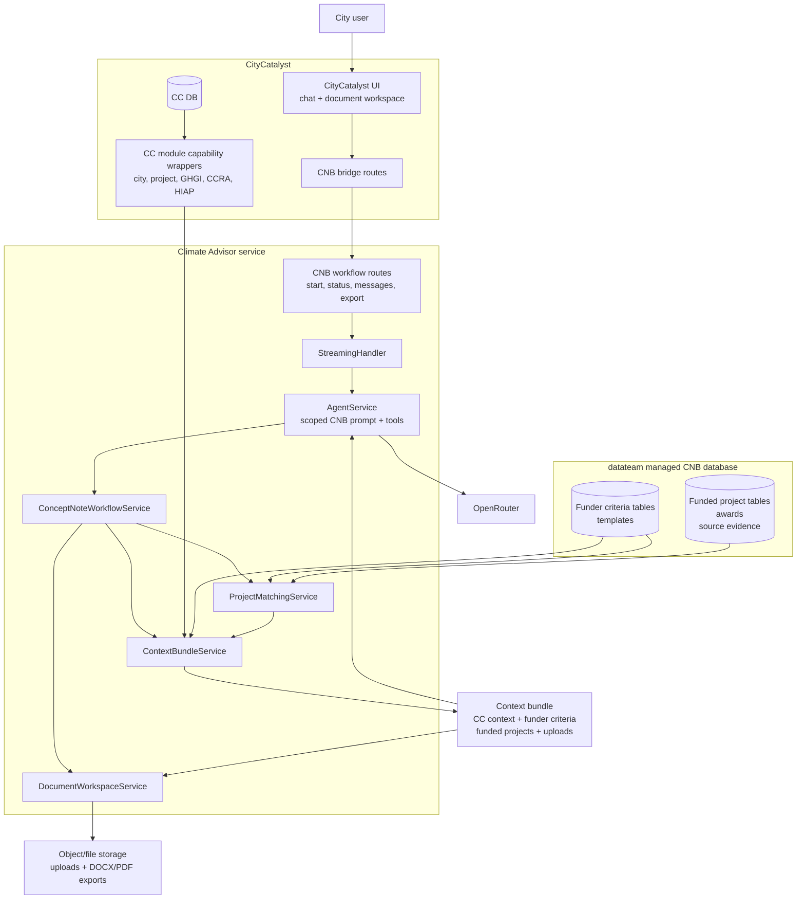

## Product Shape

The user experience is not a step-by-step questionnaire. It is a guided
interview with a live document workspace.

The first part of the workflow is context bundle building. The
`ContextBundleService` should assemble the reusable run context by:

- Loading what CityCatalyst already knows.
- Ingesting what the user uploads at intake or mid-flow.
- Retrieving the selected funder's profile, rubric, and template.
- Matching the project against comparable funded projects.
- Identifying decisions or missing facts that cannot be grounded.

The agent and document workspace then use that context bundle to:

- Draft document chapters and show evidence links for user review.
- Ask only for the identified decisions or missing facts.
- Let the user edit, add, delete, restore, and reorder chapters.
- Export DOCX and PDF documents plus a reusable context bundle.

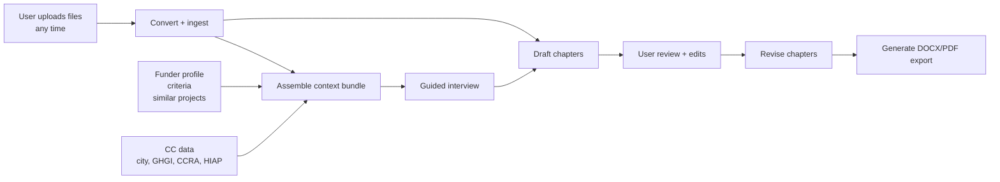

## State Ownership

| State | Owner | Reason |
| --- | --- | --- |
| City profile, project, GHGI, CCRA, HIAP | CityCatalyst | Existing product source of truth and permission model. |
| Chat threads and messages | Climate Advisor | Existing CA conversation model. |
| Concept-note run state | datateam managed CNB database | Pre-commit agentic workflow state; CA orchestrates but does not own the infrastructure. |
| Context bundle snapshot | datateam managed CNB database | Reusable run input/output for this workflow. |
| Uploaded file references and selected source context | datateam managed CNB database | Needed for mid-flow ingestion, evidence review, and export. |
| Document chapters and revisions | datateam managed CNB database | Draft document state before export. |
| Funder profiles and criteria | datateam managed CNB database | Shared curated corpus, reusable across cities and agents. |
| Similar funded projects | datateam managed CNB database | Shared project repository, queryable by funder, category, region, instrument. |
| Exported DOCX/PDF file references | datateam managed CNB database | Workflow output artifacts. |
| PDF-to-markdown conversion | Supporting PDF converter repo | Used for converting uploaded PDFs to markdown. |

## Data Infrastructure Boundary

The CNB backend should not plan to own or provision the durable data
infrastructure for concept-note runs, context bundles, document chapters,
revisions, gaps, evidence links, funder profiles, or funded-project corpora. Those
schemas and stores live in the datateam managed CNB database.

The application and Climate Advisor work should consume that infrastructure
through stable contracts:

- typed read/write clients or repositories for CNB run and document state
- typed reference-data clients for funder, funding-opportunity, pipeline, and
  funded-project data
- stable file references for uploads and exports
- source labels/locations and evidence link records for workspace review and
  audit trails

The diagrams below describe the logical storage shape the workflow needs. They
are contract requirements for integration, not a decision that the Climate
Advisor service owns the database infrastructure or migrations.

## Workflow Steps

Each workflow step should map to a scoped context loader and scoped tool pack.
The active step decides which tools are available.

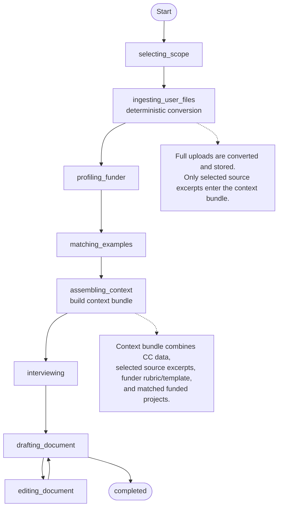

### Step Scope Table

| Step | Main context | Enabled tool groups |
| --- | --- | --- |
| `selecting_scope` | user, city, project candidates | workflow control, CC project reads |
| `ingesting_user_files` | uploaded file refs, deterministic converter status, candidate source excerpts | deterministic document ingest tools; no LLM |
| `profiling_funder` | selected funder, template, criteria | CNB reference table tools |
| `matching_examples` | project profile, funder profile, project KB filters | matching tools |
| `assembling_context` | CC summaries, selected upload excerpts, funder rubric/template, matched funded projects, known gaps | internal `ContextBundleService`; no agent tools |
| `interviewing` | gaps, known facts, required template fields | interview tools, document read tools |
| `drafting_document` | chapter plan, evidence map, examples | chapter draft tools, evidence tools |
| `editing_document` | selected chapter/revision | document edit tools |

Export is not a workflow step for the LLM. It is a document workspace button
that calls export preflight and generation routes against the current chapters
and template.

## Context Bundle

The context bundle is built for the active project and selected funder. Project
ownership, run routing, and funder selection already live outside the bundle in
the surrounding CNB database/API layer, so the bundle should not duplicate IDs.
It should only carry the context the model and document workspace need.

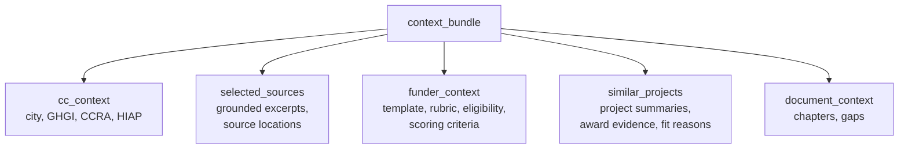

Recommended high-level shape:

```json
{
  "cc_context": {
    "city": {},
    "project": {},
    "ghgi": {},
    "ccra": {},
    "hiap": {}
  },
  "selected_sources": [
    {
      "label": "string",
      "excerpt": "string",
      "source_location": "string"
    }
  ],
  "funder_context": {
    "template": {},
    "rubric": {},
    "eligibility": {},
    "scoring_criteria": []
  },
  "similar_projects": [
    {
      "title": "string",
      "summary": "string",
      "award_context": {},
      "fit_reason": "string",
      "evidence": []
    }
  ],
  "document_context": {
    "chapters": [],
    "gaps": []
  }
}
```

## Database Model

### Data Planning Constraints From Global Data

The CNB funding reference table model follows the global-data CNB research page. The
important planning rules are:

- Keep the four discovered input groups separate: finance landscape, funder
  profiles, comparable awards, and CityCatalyst city context/GHGI.
- Keep funding lifecycle moments separate:
  - `supply`: what funding exists, one row per program/opportunity.
  - `awards`: what got funded, one row per award/funding link.
  - `pipeline`: the ranked queue that determines funding order for routes such
    as SRF priority lists.
- Use four country-agnostic stored concepts: funder, funding opportunity,
  funded project, and funded project action.
- Connect projects/actions to funding through explicit funding links rather than
  embedding awards directly in project records.
- Treat the finance route as document-shaping data. A competitive grant,
  revolving-fund priority-list project, formula/block grant, green-bank loan,
  capital-investment request, and city self-financing path each imply different
  required document sections.
- Store funder profiles with two halves:
  - `stated`: eligibility, rubric, template, award rules, and requirements read
    from RFP/NOFO/program documents.
  - `derived`: patterns computed from awards data, such as typical recipients,
    award sizes, categories, and revealed preferences.
- Treat calibrated matching criteria as a later concept. NLC should approve
  thresholds and weights before the workflow uses numeric scoring against a
  rubric.
- Treat Minnesota city/GHGI sources as context candidates until license,
  redistribution, and GPC-mapping blockers are resolved.

### CNB Workflow Tables

These are the logical workflow/document tables the CNB backend needs to use.
They should live in the datateam managed CNB database. Climate Advisor consumes
them through typed service/repository contracts.

The workflow tables below and the funding reference tables in the next diagram
are part of the same database infrastructure. They are split into two diagrams
only so the workflow state and curated funding/reference data are easier to read.

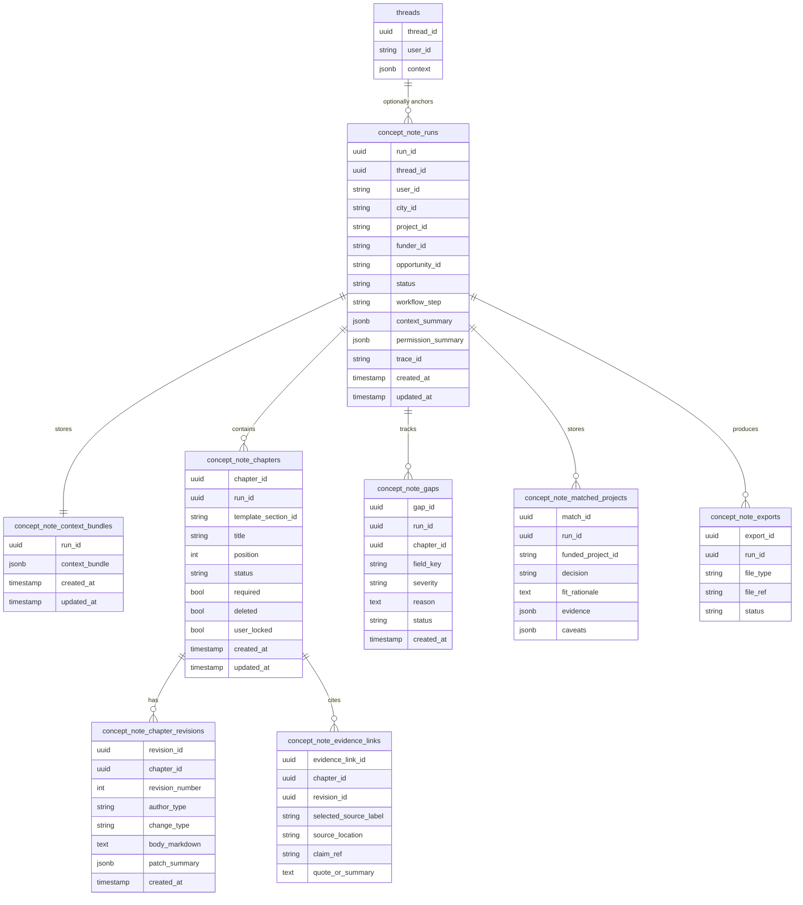

### Evidence Links

`concept_note_evidence_links` are workspace review records. They connect a claim
in a specific chapter revision to the selected source context that supports it.

They do not store source documents or converter chunks. The supporting context
lives in the context bundle, and the evidence link records the user-facing source
label, source location, claim reference, and quote or summary needed for user
review.

Example: if a chapter says the project targets the city's largest emissions
sector, an evidence link can point that claim to a GHGI summary, an uploaded CAP
excerpt, a funder criterion, or a matched funded-project example already present
in the context bundle.

### Gaps

`concept_note_gaps` are unresolved missing facts or required template fields
that cannot be grounded from the context bundle yet. They are not source records.
They are drafting/export blockers or warnings such as missing budget amount,
missing partner confirmation, or a required funder section with no
evidence-backed content.

### CNB Funding Reference Tables

These tables live in the same datateam managed CNB database as the workflow
tables. They are the curated, reusable table group for funders and funded
projects.

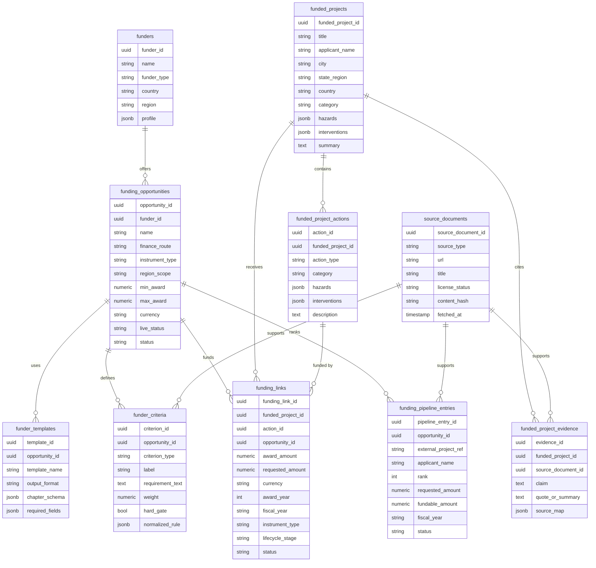

## Research Ingest Pipeline

The ingest pipeline should turn curated research into stable records with
provenance, not just embeddings.

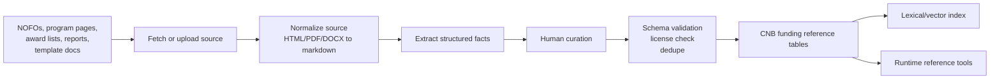

Required ingest outputs:

- Source document record with URL, title, date, license status, and hash.
- Funder record and funding opportunity record, including route, instrument,
  geography, live status, and award-size ranges.
- Template chapter schema.
- Stated eligibility criteria from program documents.
- Derived matching signals, marked as derived.
- Funded-project records, project-action records, and funding links.
- Pipeline entries for priority-list routes where the funding order matters.
- Evidence links for each important claim.

## Similar Project Matching

For the first release, similar-project matching should be an LLM agent decision
over a candidate set from the CNB funding reference tables. The agent should
choose examples, explain why they fit, and surface caveats. It should not present
a calibrated numeric score yet.

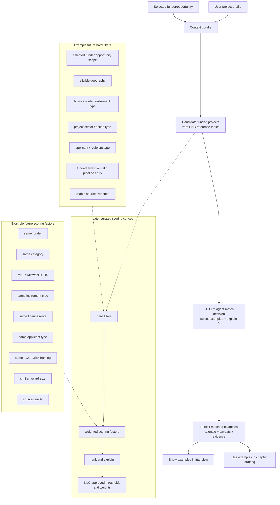

V1 matching result should include:

- matched project id
- LLM fit rationale
- source evidence
- text snippets safe to show as examples
- caveats or missing fields

The later curated scoring system should be treated as a concept, not current v1
behavior. It can add hard filters and weighted scoring once NLC approves the
thresholds and weights.

Conceptual hard filters are gates, not ranking signals. A funded project would
need to pass the applicable gates before it can be scored.

| Hard filter | What it excludes before scoring |
| --- | --- |
| Funder/opportunity scope | Projects from unrelated funders, programs, or opportunity families when the user selected a specific funder/opportunity. |
| Eligible geography | Projects outside the configured geography fallback path for the opportunity, such as Minnesota, Midwest, then US. |
| Finance route / instrument type | Examples from the wrong funding route, such as comparing a loan or SRF priority-list project against a competitive grant. |
| Project sector / action type | Projects in unrelated sectors or action categories. |
| Applicant / recipient type | Awards to recipient types that do not match the user's applicant profile, such as nonprofit-only awards for a city-led project. |
| Funded award or valid pipeline entry | Records that are not actual awards or, for priority-list routes, valid pipeline entries. |
| Usable source evidence | Records without enough source evidence to show the user why the example is relevant. |

If the user project or funder profile is missing a field needed for the future
scoring concept, the workflow should not invent it. It should record a match
caveat and create a gap if the missing field matters for drafting.

## PDF Conversion

CNB should use the supporting `Open-Earth-Foundation/PDF_converter` repository to
convert uploaded PDFs to markdown.

## Document Workspace

The document workspace is the product surface where the concept note takes
shape. It is not just a generated blob. It is a structured editor for chapter
text, revision history, missing facts, and evidence review. The final DOCX/PDF
export is generated from the chapter text and template structure only.

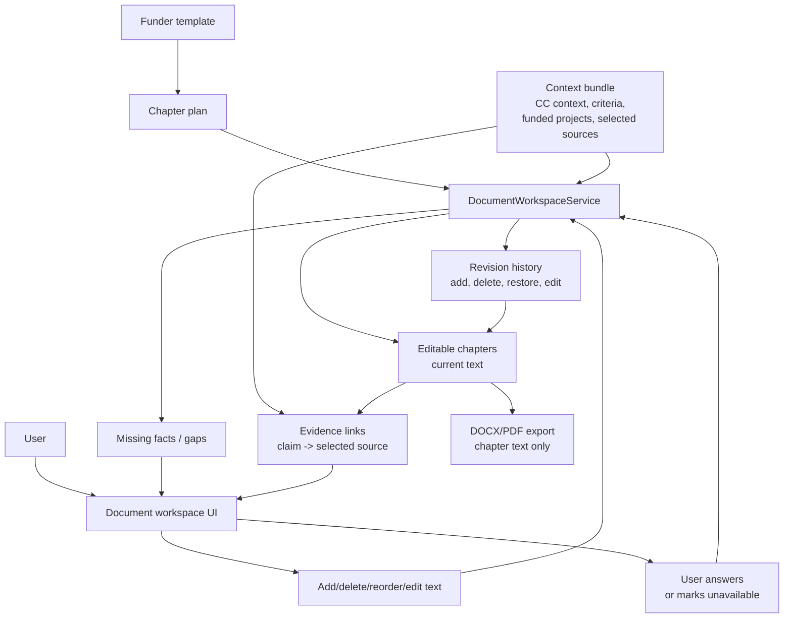

How it works:

- The selected funder template creates the chapter plan and initial empty
  chapters.
- The context bundle supplies drafting context: CC facts, funder criteria,
  matched project examples, and selected source excerpts.
- The workspace shows editable chapters as the main document surface.
- Every add, delete, restore, reorder, or text edit creates a chapter revision.
  Revisions are an audit/history trail; they do not feed evidence links.
- Missing facts are stored as gaps and surfaced to the user in the workspace.
  They do not create chapters by themselves.
- Evidence links are shown to the user to explain why a claim was grounded.
  They are review/audit UI only and are ignored by DOCX/PDF export.

Chapter fields should support the editable document surface:

- `chapter_id`
- `run_id`
- `template_section_id`
- `title`
- `body_markdown`
- `position`
- `status`: `empty`, `draft`, `needs_review`, `ready`, `deleted`
- `required`
- `user_locked`
- `deleted`
- `latest_revision_id`

Revision fields should support history and conflict handling:

- `revision_id`
- `chapter_id`
- `revision_number`
- `author_type`: `agent`, `user`, `system`
- `change_type`: `draft`, `edit_text`, `add_chapter`, `delete_chapter`,
  `restore_chapter`, `rewrite`
- `body_markdown`
- `patch_summary`
- `created_at`

## Document Tool Deep Dive

Tools should be grouped by step and registered only when relevant. The LLM
should not be able to delete a chapter while it is only assembling context.
Export is not an LLM tool; it is a document workspace button that calls
preflight and generation routes.

### Tool Groups

| Group | Purpose | Writes CNB storage | Calls CC | Calls CNB reference tables |
| --- | --- | --- | --- | --- |
| Workflow tools | start, resume, retry | yes | no | no |
| Ingest tools | convert uploads, prepare candidate source excerpts | yes | no | no |
| Reference tools | funder profile, template, criteria | no | no | yes |
| Matching tools | find and explain similar projects | yes | no | yes |
| Document tools | chapters, text, evidence, gaps | yes | no | optional |
| Export button actions | preflight and generate DOCX/PDF | yes | no | no |

### Workflow Tools

#### `concept_note_start_run`

Starts or resumes a concept-note workflow for a selected city, project, funder,
and opportunity.

Input:

```json
{
  "user_id": "string",
  "city_id": "string",
  "project_id": "string",
  "funder_id": "string",
  "opportunity_id": "string",
  "thread_id": "uuid|null"
}
```

Output:

```json
{
  "run_id": "uuid",
  "status": "active",
  "workflow_step": "assembling_context",
  "next_action": "load_context"
}
```

Rules:

- Creates `concept_note_runs`.
- Creates initial empty document from the selected funder template.
- Reuses an active run if the same user, city, project, funder, and opportunity
  already has one.

### Always-On Agent Context

Run status is not an agent tool. The agent should always receive current run
state as injected context before it answers or calls tools.

Always-on context should include:

- current run state
- current workflow step
- blockers
- chapter counts
- open gaps
- matched project counts
- export readiness

This is crucial because the agent should never need to ask a tool what state the
workflow is in before deciding what to do next.

### Context Bundle Build Responsibilities

Context bundle building is not an agent tool group. During `assembling_context`,
`ContextBundleService` should assemble the bundle before the agent turn and
inject it as always-on context.

Context loaded:

- City profile summary.
- Project summary.
- GHGI summary if available.
- CCRA risk summary if available.
- HIAP actions/status if available.
- Module availability and known missing pieces.
- Selected source excerpts from uploads.
- Funder rubric/template and selected opportunity criteria.
- LLM-selected similar funded projects, rationale, evidence, and caveats.
- Known gaps that must be surfaced to the user.

Rules:

- Uses current CC-CA capability architecture.
- Returns summarized payloads, not raw route dumps.
- Stores the context bundle snapshot in the datateam managed CNB database for
  reproducibility.
- Updates the bundle through workflow orchestration when uploads, funder profile,
  similar projects, or user-confirmed facts change.
- Does not register CC context loading or context bundle updates as
  agent-callable tools.

### Reference Tools

#### `funder_get_profile`

Loads the curated funder profile and opportunity criteria.

Output includes:

- Funder overview.
- Eligible applicants.
- Eligible geography.
- Eligible project categories.
- Instrument type.
- Award size range.
- Match or cost-share rules.
- Required documents.
- Template reference.
- Stated criteria and derived matching signals.

#### `funder_get_template`

Returns the chapter schema that drives the document workspace.

Output example:

```json
{
  "template_id": "uuid",
  "chapters": [
    {
      "template_section_id": "problem_diagnosis",
      "title": "Problem Diagnosis",
      "required": true,
      "position": 1,
      "expected_content": "Problem, location, evidence, affected groups",
      "criteria_refs": ["criterion_id"]
    }
  ]
}
```

#### `similar_projects_search`

Finds comparable funded projects.

Input:

```json
{
  "run_id": "uuid",
  "funder_id": "uuid",
  "opportunity_id": "uuid",
  "category": "stormwater",
  "region": "MN",
  "instrument_type": "grant",
  "hazards": ["flood", "heat"],
  "limit": 10
}
```

Output:

```json
{
  "matches": [
    {
      "funded_project_id": "uuid",
      "decision": "selected",
      "fit_rationale": "Why the LLM agent considers this example useful.",
      "evidence": [],
      "caveats": []
    }
  ]
}
```

Rules:

- Retrieve candidate funded projects from CNB reference tables.
- Use the LLM agent to select comparable examples and explain fit.
- Do not return calibrated numeric scores in v1.
- Persist selected matches in `concept_note_matched_projects`.
- Return rationale, evidence, and caveats.

### Ingest Tools

#### `concept_note_ingest_upload`

Converts and indexes a user upload.

Input:

```json
{
  "run_id": "uuid",
  "file_ref": "string",
  "filename": "string",
  "mime_type": "string",
  "source_label": "Climate Action Plan"
}
```

Output:

```json
{
  "status": "converted",
  "selected_sources": [
    {
      "label": "Climate Action Plan",
      "excerpt": "string",
      "source_location": "page 4"
    }
  ],
  "warnings": [],
  "extracted_summary": "string"
}
```

Rules:

- Uses the supporting PDF converter repository for PDF-to-markdown conversion.
- Does not persist converter chunks in dedicated CNB source tables.
- Stores selected source context in the context bundle.
- Emits an SSE event so the UI can show the upload as available context.

#### `concept_note_extract_facts_from_context`

Extracts structured facts from selected source context in the context bundle and
proposes chapter updates.

Rules:

- Does not silently overwrite user-locked chapter text.
- Produces suggested updates with source links.
- Can mark gaps when an expected fact is missing.

## Chapter Editing Tools

These tools are the core of the document workspace. They are CA-local document
tools. They do not write committed CC product data.

### `document_list_chapters`

Returns the current chapter outline.

Output:

```json
{
  "chapters": [
    {
      "chapter_id": "uuid",
      "template_section_id": "problem_diagnosis",
      "title": "Problem Diagnosis",
      "position": 3,
      "status": "draft",
      "required": true,
      "deleted": false,
      "user_locked": false,
      "latest_revision_id": "uuid"
    }
  ]
}
```

### `document_get_chapter`

Returns one chapter with current text, revision metadata, evidence review state,
gaps, and template requirements.

### `document_add_chapter`

Adds a new chapter to the draft document.

Input:

```json
{
  "run_id": "uuid",
  "title": "Community Benefits",
  "position_after_chapter_id": "uuid|null",
  "body_markdown": "optional initial text",
  "reason": "User asked to add a dedicated benefits chapter"
}
```

Output:

```json
{
  "chapter_id": "uuid",
  "status": "draft",
  "revision_id": "uuid",
  "position": 7
}
```

Rules:

- Creates a new `concept_note_chapters` row.
- Creates an initial `concept_note_chapter_revisions` row with
  `change_type=add_chapter`.
- Re-numbers positions transactionally.
- If the funder template is strict, mark custom chapters as
  `template_section_id=custom`.
- Custom chapters should be allowed in the working draft but may be excluded
  from final export unless the export preflight allows appendices or optional
  sections.
- The tool should return a warning if the new chapter does not map to a funder
  template section.

When enabled:

- `drafting_document`
- `editing_document`

Confirmation:

- No confirmation for adding an empty or clearly requested chapter.
- Confirmation required if the agent proposes adding several chapters at once
  or if the chapter changes export structure.

### `document_delete_chapter`

Deletes a chapter from the working draft.

Input:

```json
{
  "run_id": "uuid",
  "chapter_id": "uuid",
  "delete_mode": "soft_delete",
  "reason": "User said this section is not needed"
}
```

Output:

```json
{
  "chapter_id": "uuid",
  "deleted": true,
  "revision_id": "uuid",
  "restore_available": true
}
```

Rules:

- Use soft delete only. Do not hard-delete chapter rows.
- Create a revision with `change_type=delete_chapter`.
- Preserve previous text for restore.
- Re-number visible chapters transactionally.
- If the chapter is required by the funder template, do not delete silently.
  Instead mark it as `deleted=true` and create or update a gap explaining why a
  required section is intentionally skipped.
- If the chapter has user-authored text, require explicit user confirmation.

When enabled:

- `editing_document`

Confirmation:

- Required for non-empty chapters.
- Required for required template chapters.
- Required for chapters with user edits.

### `document_restore_chapter`

Restores a soft-deleted chapter.

Rules:

- Clears `deleted`.
- Restores position or inserts at a requested position.
- Adds a `restore_chapter` revision.
- Reopens any gaps that were closed only because the chapter was deleted.

### `document_edit_chapter_text`

Edits the text inside a chapter.

Input:

```json
{
  "run_id": "uuid",
  "chapter_id": "uuid",
  "edit_mode": "replace_body|patch_body|append_text|rewrite_selection",
  "body_markdown": "new full body when replacing",
  "patch": {
    "find": "old text",
    "replace": "new text"
  },
  "selection": {
    "start_offset": 0,
    "end_offset": 120
  },
  "reason": "Improve alignment with funder criterion",
  "evidence_links": []
}
```

Output:

```json
{
  "chapter_id": "uuid",
  "revision_id": "uuid",
  "revision_number": 5,
  "status": "needs_review",
  "changed_ranges": []
}
```

Rules:

- Always creates a new revision.
- Never mutates old revision rows.
- Supports full replacement, patch replacement, append, and selected rewrite.
- Maintains evidence review state where possible.
- If a patch cannot be applied cleanly, return a structured conflict and ask
  the user to confirm the current chapter text.
- If the chapter is `user_locked`, the agent may propose an edit but cannot
  apply it without explicit user confirmation.
- If an edit changes text connected to an evidence link, mark that evidence link
  as stale and surface it in the UI.
- If an edit adds factual claims without evidence, create a gap or require the
  agent to attach evidence.

When enabled:

- `drafting_document`
- `editing_document`

Confirmation:

- Not required for direct user edits.
- Required for agent edits to user-locked text.
- Required for edits that remove budget numbers, partners, or named
  commitments.

### `document_reorder_chapter`

Moves a chapter before or after another chapter.

Rules:

- Reorders visible chapters transactionally.
- Does not change template section ids.
- Export preflight should warn if the order violates a strict funder template.

### `document_link_evidence`

Links selected source context, a funder criterion, a CC fact, or a similar
project example to a claim inside a chapter.

Rules:

- Evidence links should point to the selected source label and source location
  from the context bundle.
- Each link should include a claim reference or text range where possible.
- Evidence links are shown in the workspace for review and audit only. They are
  not included in DOCX/PDF export.

### `document_flag_gap`

Flags missing or weak data for a chapter.

Examples:

- Missing budget amount.
- No confirmed project partner.
- Funder requires match funding and the user has not confirmed it.
- Comparable projects are too weak or regionally mismatched.

### `document_mark_chapter_ready`

Marks a chapter ready after required fields and user review are complete.

Rules:

- Cannot mark ready while critical gaps are open.
- Can mark ready with non-critical caveats if the caveats are persisted.

## Document Edit Flow

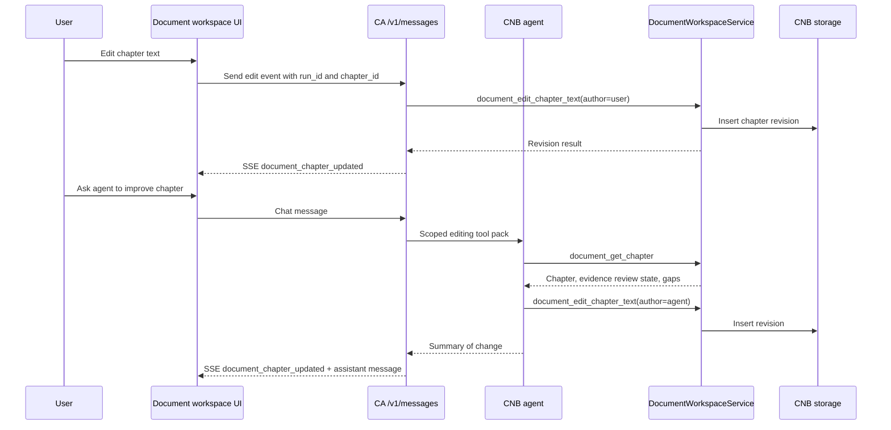

## Chapter Delete Confirmation Flow

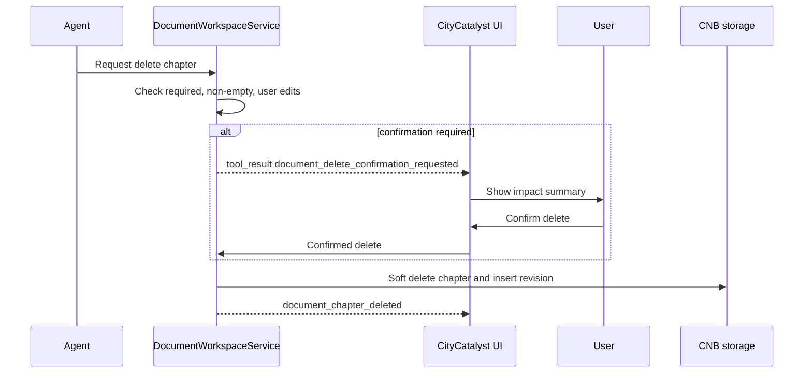

## Agent Tool Scoping

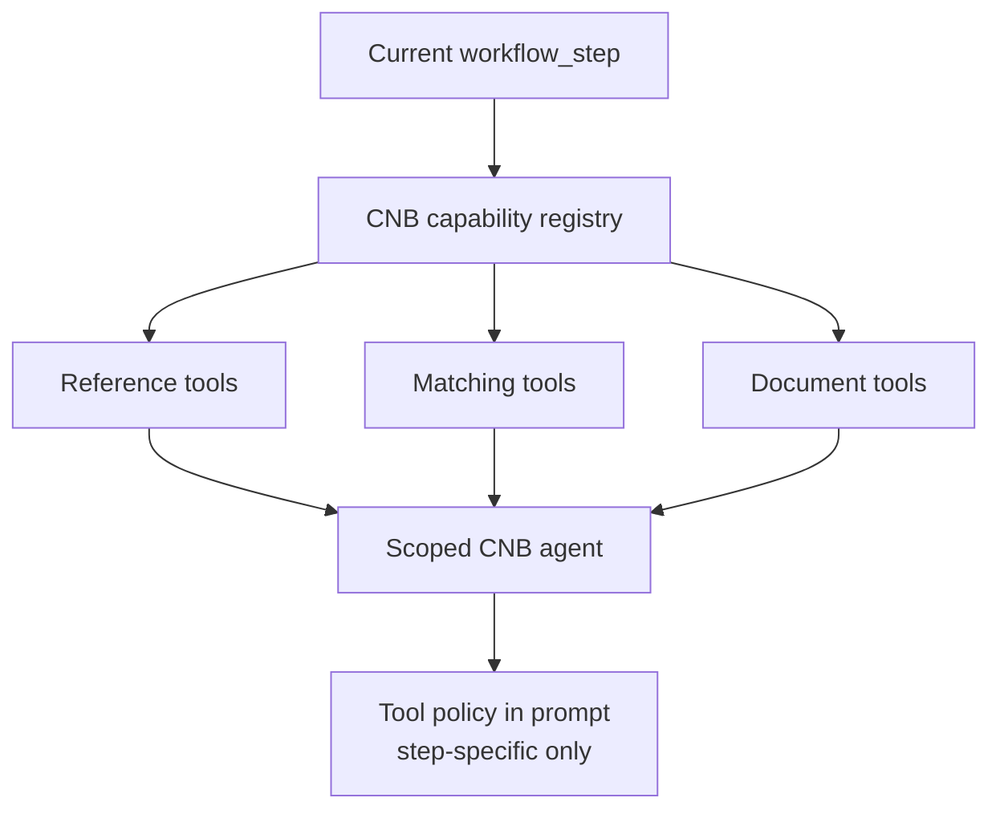

Example registry rows:

| Capability id | Step | Operation | Writes | Confirmation |
| --- | --- | --- | --- | --- |
| `concept_note.upload.ingest` | `ingesting_user_files` | workflow | context bundle selected sources | no |
| `concept_note.funder.get_profile` | `profiling_funder` | query | no | no |
| `concept_note.projects.search_similar` | `matching_examples` | query/workflow | CNB matches | no |
| `concept_note.document.add_chapter` | `drafting_document` | command | CNB document | sometimes |
| `concept_note.document.delete_chapter` | `editing_document` | command | CNB document | yes for non-empty/required |
| `concept_note.document.edit_text` | `editing_document` | command | CNB revision | sometimes |
| `concept_note.document.link_evidence` | `drafting_document` | command | CNB evidence links | no |

Export preflight, DOCX generation, and PDF generation are button-triggered route
actions. They are not registered in the scoped agent tool registry.

## Prompt Model

Add a new prompt entry in `climate-advisor/llm_config.yaml`:

```yaml
prompts:
  concept_note_builder: "prompts/concept_note_builder.md"
```

Prompt composition should follow the current CA pattern:

- General chat keeps using the default prompt.
- Active CNB runs use `concept_note_builder` as the workflow prompt.
- Runtime context injection is separate from prompt-file composition.
- The prompt should describe chapter editing rules, evidence-review rules, and
  no-fabrication guardrails.

CNB context should be injected as a bounded JSON block:

```text
CONCEPT_NOTE_CONTEXT_BUNDLE_JSON
CURRENT_DOCUMENT_STATE_JSON
ACTIVE_WORKFLOW_STEP
UI_CONTEXT
```

## SSE Events

The UI needs typed events for chat and document state.

| Event | Purpose |
| --- | --- |
| `concept_note_run_started` | Run id and initial status. |
| `concept_note_context_loaded` | Context bundle is ready. |
| `concept_note_upload_ingested` | Uploaded file indexed and available. |
| `concept_note_funder_loaded` | Funder profile and template ready. |
| `concept_note_matches_updated` | Similar projects changed. |
| `document_chapter_added` | Chapter inserted. |
| `document_chapter_deleted` | Chapter soft-deleted. |
| `document_chapter_restored` | Chapter restored. |
| `document_chapter_updated` | New revision created. |
| `document_gap_added` | Gap or blocker added. |
| `document_evidence_linked` | Evidence review link added. |
| `document_delete_confirmation_requested` | UI must confirm delete. |
| `document_edit_confirmation_requested` | UI must confirm sensitive edit. |
| `concept_note_export_ready` | DOCX or PDF export created. |
| `concept_note_export_failed` | Export failed with stable reason. |

## Export Pipeline

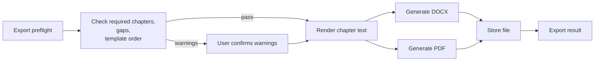

Export preflight should check:

- Required chapters present or intentionally skipped.
- Critical gaps resolved.
- Budget, partners, match funding, and commitments are confirmed or intentionally
  left blank.
- Custom chapters are allowed by the export mode.
- Deleted required chapters are represented in a preflight warning.

Export should not include evidence links, source labels, source locations,
source manifests, inline citations, or endnotes. Those are workspace review
features only.

## Planned Routes

### Climate Advisor

The status routes are for the UI and backend orchestration. Current run state
must still be injected into the agent context on every turn, not exposed as an
agent tool.

```text
POST /v1/concept-notes/start
GET  /v1/concept-notes/{run_id}
GET  /v1/concept-notes/{run_id}/status
POST /v1/concept-notes/{run_id}/retry
POST /v1/concept-notes/{run_id}/uploads
POST /v1/concept-notes/{run_id}/matches/refresh
GET  /v1/concept-notes/{run_id}/document
POST /v1/concept-notes/{run_id}/document/chapters
PATCH /v1/concept-notes/{run_id}/document/chapters/{chapter_id}
DELETE /v1/concept-notes/{run_id}/document/chapters/{chapter_id}
POST /v1/concept-notes/{run_id}/document/chapters/{chapter_id}/restore
POST /v1/concept-notes/{run_id}/export/preflight
POST /v1/concept-notes/{run_id}/export/docx
POST /v1/concept-notes/{run_id}/export/pdf
```

### CityCatalyst

```text
POST /api/v1/concept-notes/start
GET  /api/v1/concept-notes/{run_id}
POST /api/v1/concept-notes/{run_id}/messages
POST /api/v1/concept-notes/{run_id}/uploads
GET  /api/v1/concept-notes/{run_id}/export/{export_id}

POST /api/v1/internal/ca/capabilities/city/load-context
POST /api/v1/internal/ca/capabilities/project/load-context
POST /api/v1/internal/ca/capabilities/ghgi/summary
POST /api/v1/internal/ca/capabilities/ccra/summary
POST /api/v1/internal/ca/capabilities/hiap/summary
```

## Implementation Responsibilities

The implementation should stay organized by responsibility, not by a prescribed
file layout.

| Responsibility | Owner | Boundary |
| --- | --- | --- |
| Workflow orchestration | Climate Advisor | Starts/resumes runs, resolves active step, scopes tools, streams responses. |
| CNB storage access | datateam managed CNB database | Climate Advisor uses typed contracts for runs, context bundles, chapters, revisions, gaps, evidence, and exports. It does not own CNB database infrastructure or migrations. |
| Funding reference access | datateam managed CNB database | Climate Advisor reads funders, opportunities, templates, criteria, pipeline entries, funded projects, and funding links from CNB reference tables. |
| Document tools | Climate Advisor | Mutates draft document state through the CNB storage contract only. |
| File ingestion | Climate Advisor | Registers uploads and uses the supporting PDF converter repository for PDF-to-markdown conversion. CNB persistence keeps only selected source context in the context bundle. |
| CC context loading | CityCatalyst | Provides bounded city, project, GHGI, CCRA, and HIAP summaries through internal capabilities. |
| CC bridge routes | CityCatalyst | Authenticated browser-facing proxy into CA workflow routes. |
| Capability registry | CityCatalyst and Climate Advisor | Defines step-scoped capability exposure; no flat tool bag. |
| UI workspace | CityCatalyst | Chat, chapter outline, editor, evidence/gap views, upload status, export controls. |

## Failure Handling

| Failure | User-visible behavior | System behavior |
| --- | --- | --- |
| CC context unavailable | Show missing CityCatalyst context and continue with uploads/interview. | Persist blocker and retry option. |
| Funder profile missing | Block drafting against a real template. | Mark `profiling_funder` blocked. |
| Converter failed | Show file-specific failure. | Keep upload ref and allow retry. |
| Similar projects weak | Continue but show caveat. | Persist match caveats. |
| Chapter edit conflict | Ask user to confirm current text. | Return structured conflict. |
| Required chapter deleted | Warn at export preflight. | Keep soft-deleted row and gap. |
| Export failed | Show stable export error. | Persist failed export row with retry. |

## Guardrails

- Do not fabricate budgets, partners, named commitments, eligibility rules, or
  award facts.
- Every factual chapter claim should link to a source, user confirmation, or
  CityCatalyst context snapshot.
- User-authored text is higher priority than model-generated text.
- Agent edits to user-locked chapters require confirmation.
- Required funder criteria must be represented as template requirements or gaps.
- Future scoring criteria must be curated and calibrated with NLC, not invented
  by the model.
- PDF conversion output is evidence input, not automatically trusted truth.

## Tests

Minimum test surface:

- Pydantic contracts for all CNB route payloads.
- CNB storage client and contract tests for run, chapter, revision, gap, and
  evidence behavior.
- Chapter add/delete/restore/reorder tests.
- Text edit conflict tests.
- User-locked chapter confirmation tests.
- Required chapter delete/export preflight tests.
- Source-link preservation tests when editing text.
- Matching tests for candidate retrieval, LLM decision output, fit rationale,
  evidence, and caveats.
- PDF ingestion tests with success, warning, and failure payloads.
- Prompt/tool registration tests proving only the active step's tools are
  available.
- SSE event shape tests for document updates.

## Implementation Phases

### Phase 1: Durable Document Workspace

- Integrate with datateam managed CNB database contracts for runs, context
  bundles, chapters, revisions, gaps, and evidence links.
- Add document tools:
  - list chapters
  - get chapter
  - add chapter
  - delete chapter
  - restore chapter
  - edit chapter text
  - link evidence
  - flag gap
- Add a minimal CC page with chat plus document workspace.

### Phase 2: Context Bundle and CC Context

- Add run start/resume/status.
- Add context bundle service.
- Add CC capability wrappers for city, project, GHGI, CCRA, and HIAP summaries.
- Persist context snapshots for audit and resume.

### Phase 3: CNB Reference Tables and Matching

- Stand up funder/profile/template/project schema.
- Add curated ingest scripts.
- Add reference tools and LLM-agent similar-project matching.
- Persist matched examples and show them in the document workflow.

### Phase 4: File Ingestion

- Add upload registration.
- Use the supporting PDF converter repository for PDF-to-markdown conversion.
- Attach converted source context to the context bundle.
- Enable mid-flow upload ingestion and evidence review through the document workspace.

### Phase 5: Export

- Add export preflight.
- Add DOCX export generation.
- Add PDF export generation.
- Store export file refs.
- Add retry and failure reporting.

## Open Questions

- Which funder and instrument type are the first release target?
- Which exact DOCX template should be treated as authoritative, and should PDF
  render from that same document model?
- Are custom chapters allowed in the final funder document, or only as
  appendices/internal notes?
- What source license rules apply to the Minnesota funded-project corpus?
- Which matching weights are NLC-approved hard gates versus soft signals?
