# Concept Note Builder Architecture

## Purpose

The Concept Note Builder is a CityCatalyst agentic workflow for helping a city
turn an existing project, CityCatalyst context, funder requirements, user
uploads, and comparable funded-project evidence into an editable funder-ready
concept note.

The first release should be narrow: one selected Minnesota funder, one
instrument type, and DOCX plus PDF export. The architecture should still
generalize to additional funders, regions, languages, and templates by changing
data and configuration, not by rebuilding the workflow.

## Inputs This Incorporates

- Local agentic architecture direction in
  [AgenticModuleScope.md](AgenticModuleScope.md).
- Current Climate Advisor runtime shape in
  [climate-advisor/docs/architecture.md](../climate-advisor/docs/architecture.md).
- The Concept Note Builder draft PRD exploration page.
- The NBS Project Preparation prototype and its document, block, patch,
  knowledge-source, and concept-note patterns.
- The CityCatalyst global-data concept-note-builder research page, especially
  its funder and funding reference data.

## Scope

Implementation baseline (2026-08-28): the repository owns the CNB schema chain,
reviewed-reference importer, similar-project reader, and persisted chapter
workspace. CA owns run, bundle, pointer, and drafting-progress persistence. Its
draft API materializes the selected template, then runs an independent
server-side process that saves one immutable chapter revision before generating
the next. Explicit chapter validation runs completeness before document-wide
consistency and persists one latest result per chapter. CC accepts authorized PDFs through `PdfOcrJob` and native UTF-8
Markdown through direct artifact storage, then exposes either result through its
authenticated read boundary. Runs may begin without uploaded document evidence
and later rebuild with it; all optional CC, funding, matching, and source
context may be absent.

In scope:

- A Climate Advisor workflow for concept-note runs.
- A document workspace that supports structured chapters, evidence review,
  revisions, gaps, explicit validation, and export.
- Funding reference tables for funders, funder criteria, templates, and similar
  funded projects in the externally operated CNB database.
- A curated research ingest pipeline for funder profiles and funded-project
  examples.
- Runtime matching between the user's project and similar funded projects.
- PDF conversion plus direct native Markdown ingestion in CityCatalyst.
- Reuse of current CityCatalyst-to-Climate-Advisor connection for CC data.

Out of scope:

- Redesigning the CC data connection.
- Using `Open-Earth-Foundation/PDF_converter` as a runtime service.
- Multi-funder discovery in the first release.
- Submitting grants or applications to external funder portals.
- A new broad agent microservice outside Climate Advisor.

## Architecture Decision

Concept Note Builder should be implemented as a new Climate Advisor agentic
workflow, following the same direction as the Stationary Energy workflow:

1. CityCatalyst owns product data, user permissions, durable chat threads and
   messages, and committed module state.
2. Climate Advisor orchestrates the conversation and pre-commit agentic
   workflow and owns the schema integration code, but not durable chat or the
   externally operated database infrastructure.
3. `CA_DATABASE_URL` stores run, context-bundle, and upload persistence on the
   existing Climate Advisor Alembic chain.
4. `CNB_DATABASE_URL` stores the document workspace and reusable funding
   reference corpus on an independent `cnb_alembic_version` chain owned by this
   repository. Infrastructure and curated data remain externally managed.
5. CC owns PDF OCR and direct native `.md` storage, then serves the verified
   artifact to CA by stable pointer through the authenticated internal route.
6. The agent gets a scoped tool pack for the active workflow step, not a flat
   list of every possible operation.
7. Every ready source is read completely; PDFs retain pages, native Markdown
   retains anchors, and missing optional sources never block readiness.

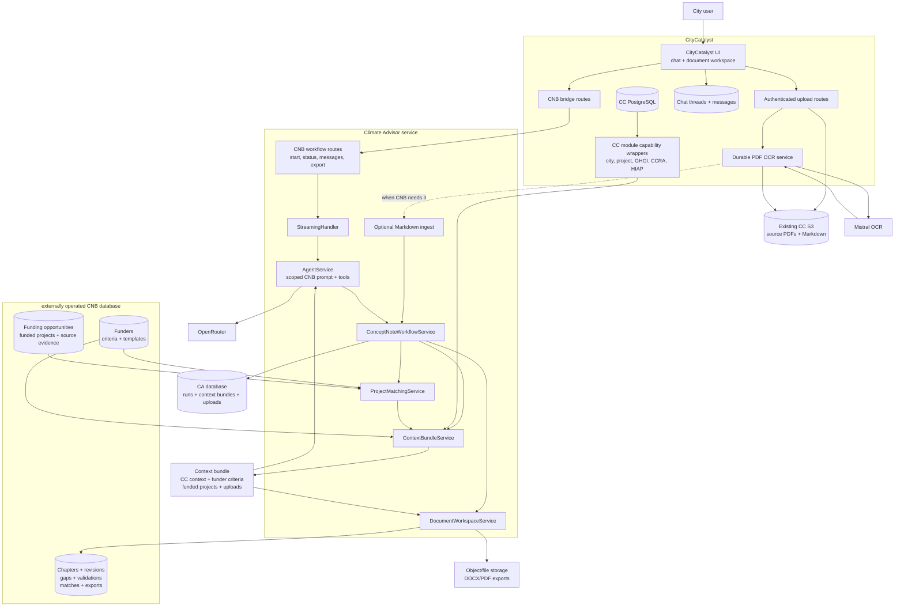
```mermaid
flowchart TB
    User["City user"] --> CCUI["CityCatalyst UI<br/>chat + document workspace"]

    subgraph CC["CityCatalyst"]
        CCUI
        CCBridge["CNB bridge routes"]
        CCUpload["Authenticated upload routes"]
        CCOCR["Durable PDF OCR service"]
        CCCaps["CC module capability wrappers<br/>city, project, GHGI, CCRA, HIAP"]
        CCChat[("Chat threads + messages")]
        CCData[("CC PostgreSQL")]
    end

    CCFiles[("Existing CC S3<br/>source PDFs + Markdown")]
    Mistral["Mistral OCR"]

    subgraph CA["Climate Advisor service"]
        CARoutes["CNB workflow routes<br/>start, status, messages, export"]
        MarkdownIngress["Optional Markdown ingest"]
        Stream["StreamingHandler"]
        Agent["AgentService<br/>scoped CNB prompt + tools"]
        CNBService["ConceptNoteWorkflowService"]
        ContextService["ContextBundleService"]
        DocService["DocumentWorkspaceService"]
        MatchService["ProjectMatchingService"]
    end

    CADB[("CA database<br/>runs + context bundles + uploads")]

    subgraph CNBDB["externally operated CNB database"]
        WorkspaceDB[("Chapters + revisions<br/>gaps + validations<br/>matches + exports")]
        FunderDB[("Funders<br/>criteria + templates")]
        ProjectKB[("Funding opportunities<br/>funded projects + source evidence")]
    end

    ContextBundle["Context bundle<br/>CC context + funder criteria<br/>funded projects + uploads"]
    OpenRouter["OpenRouter"]
    ExportStore["Object/file storage<br/>DOCX/PDF exports"]

    CCUI --> CCBridge
    CCUI --> CCChat
    CCUI --> CCUpload
    CCUpload --> CCFiles
    CCUpload --> CCOCR
    CCOCR --> Mistral
    Mistral --> CCOCR
    CCOCR --> CCFiles
    CCOCR -. "when CNB needs it" .-> MarkdownIngress
    MarkdownIngress --> CNBService
    CCBridge --> CARoutes
    CARoutes --> Stream
    Stream --> Agent
    Agent --> CNBService
    CNBService --> ContextService
    CNBService --> DocService
    CNBService --> MatchService
    CNBService --> CADB
    DocService --> WorkspaceDB
    CCData --> CCCaps
    CCCaps --> ContextService
    FunderDB --> ContextService
    FunderDB --> MatchService
    ProjectKB --> MatchService
    MatchService --> ContextService
    ContextService --> ContextBundle
    ContextBundle --> Agent
    ContextBundle --> DocService
    DocService --> ExportStore
    Agent --> OpenRouter
```

## Product Shape

The user experience is not a step-by-step questionnaire. It combines an
optional manual interview with a live document workspace. Draft generation is
not driven through chat: starting a draft invokes a dedicated persisted process,
and chat remains available only for user-led questions and clarification.

The first part of the workflow is context bundle building. The
`ContextBundleService` assembles the reusable run context by:

- Re-fetching and verifying every ready source upload after pointer delivery.
- Reading each source in its native evidence mode and persisting only compact
  per-document summaries, topics, and exact source-cited excerpts.
- Attempting GHGI and persisted HIAP context without making either mandatory.
- Initializing explicit empty sections for later funder, similar-project, and
  document-workspace workflows.
- Rebuilding automatically whenever another upload reaches `ready`.

Funder research, comparable-project matching, and document-workspace assembly
remain separate targeted workflows. When they run later, their sections are
preserved by a PDF-triggered rebuild.

Matching is internal preparation. Completing a match does not immediately show
the user a list of projects. A stored example is surfaced only when it is useful
for the current interview question, chapter draft, or evidence review.

The drafting service and document workspace then use that context bundle to:

- Draft exactly one template chapter at a time and persist it before continuing.
- Give each chapter call the complete Markdown of every earlier chapter so the
  document remains consistent without turning drafting into a chat exchange.
- Ask only for the identified decisions or missing facts.
- Let the user edit, add, delete, restore, and reorder chapters.
- Validate one chapter explicitly for completeness, then internal and
  cross-chapter consistency, without silently truncating the document.
- During full-document review, validate at most three chapters concurrently.
  Completeness and consistency remain sequential within each chapter, and every
  worker evaluates the fingerprinted document snapshot before its result is
  persisted.
- Export DOCX and PDF documents plus a reusable context bundle.

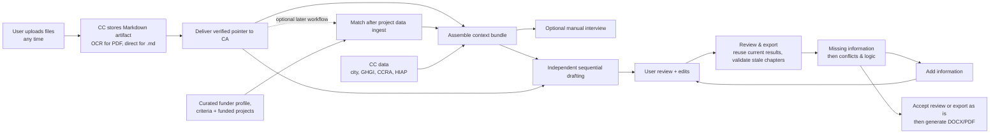
```mermaid
flowchart LR
    Context["Assemble context bundle"]
    Context --> Interview["Optional manual interview"]
    Context --> Draft["Independent sequential drafting"]
    Draft --> Review["User review + edits"]
    Review --> Validate["Review & export<br/>reuse current results, validate stale chapters"]
    Validate --> Decision["Missing information<br/>then conflicts & logic"]
    Decision --> Revise["Add information"]
    Revise --> Review
    Decision --> Export["Accept review or export as is<br/>then generate DOCX/PDF"]

    Upload["User uploads files<br/>any time"] --> Convert["CC stores Markdown artifact<br/>OCR for PDF, direct for .md"]
    Convert --> Ingest["Deliver verified pointer to CA"]
    Ingest --> Context
    Ingest --> Draft

    Ingest -. optional later workflow .-> Match["Match after project data ingest"]
    Research["Curated funder profile,<br/>criteria + funded projects"] --> Match
    Match --> Context

    CCData["CC data<br/>city, GHGI, CCRA, HIAP"] --> Context
```

## State Ownership

| State                                                              | Owner                               | Reason                                                                                               |
| ------------------------------------------------------------------ | ----------------------------------- | ---------------------------------------------------------------------------------------------------- |
| City profile, project, GHGI, CCRA, and persisted HIAP context      | CityCatalyst                        | Existing product source of truth and permission model.                                               |
| Chat threads and messages                                          | CityCatalyst                        | Keeps durable user conversation state with the product permission boundary.                          |
| Concept-note run state                                             | Climate Advisor (`CA_DATABASE_URL`) | Pre-commit workflow state provisioned by the CA Alembic chain.                                       |
| Context bundle snapshot                                            | Climate Advisor (`CA_DATABASE_URL`) | Reusable run input/output initialized transactionally with each run.                                 |
| CN upload/run associations and Markdown result identity            | Climate Advisor (`CA_DATABASE_URL`) | Owns the run binding, lifecycle, label, and immutable result identity.                               |
| Uploaded source objects, OCR result objects, and their S3 pointers | CityCatalyst                        | Reuses authenticated CC upload, S3 storage, project/city permissions, and the CC result catalog.     |
| Document chapters and revisions                                    | `CNB_DATABASE_URL`                  | Draft document state before export; `run_id` is an external CA identifier.                           |
| Latest chapter validations                                         | `CNB_DATABASE_URL`                  | Fixed checks, actionable findings, validated revision, input fingerprint, and validation timestamp.  |
| Funder profiles and criteria                                       | `CNB_DATABASE_URL`                  | Shared curated corpus, reusable across cities and agents.                                            |
| Funding opportunities and funded projects                          | `CNB_DATABASE_URL`                  | Separate programme and awarded-project tables with explicit foreign keys.                            |
| Exported DOCX/PDF file references                                  | `CNB_DATABASE_URL`                  | Workflow output artifacts.                                                                           |
| Source-to-Markdown storage                                         | CityCatalyst                        | Owns PDF OCR and direct native Markdown validation, storage, and result pointers.                    |
| Pointer-only Markdown handoff                                      | CityCatalyst to Climate Advisor     | CC sends a stable result key and immutable metadata; CA reads content only through authenticated CC. |

## Data Infrastructure Boundary

The repository owns the schema contracts and migration code but not the RDS
clusters, database users, credentials, backups, or curated production records.
The boundary is deliberately two-database: `CA_DATABASE_URL` holds runs,
context bundles, and uploads; `CNB_DATABASE_URL` holds workspace and reference
tables. Each URL has an independent Alembic chain and version table.

The application and Climate Advisor work should consume that infrastructure
through stable contracts:

- typed read/write clients or repositories for CA run state and CNB document state
- typed reference-data clients for funders, funding opportunities, funded projects, templates,
  criteria, and evidence
- stable CC-created upload IDs and CNB export file references
- source labels/locations and evidence link records for workspace review and
  audit trails

The existing Climate Advisor chain provisions `concept_note_runs`,
`concept_note_context_bundles`, and `concept_note_uploads` through
`CA_DATABASE_URL`. The CNB migration chain requires only `CNB_DATABASE_URL` and
never creates those CA workflow tables. The existing Climate Advisor chain must
likewise never create CNB workspace or reference tables.

Deployment credentials follow the repository's GitHub Actions boundary:
`CNB_DATABASE_URL_DEV` supplies dev and the current test deployment, while
`CNB_DATABASE_URL_PROD` supplies production. Workflows reconcile Kubernetes
Secrets containing only `CNB_DATABASE_URL`; Deployments and CNB migration Jobs
use `secretRef`. No real or base64-encoded CNB credential belongs in Git,
ConfigMaps, logs, or migration commands. Credentials exposed through chat or
tickets must be rotated before use, with reserved password characters
URL-encoded in the final DSN.

## Tables and Data Placement

Source ingestion and document authoring span CityCatalyst PostgreSQL, the Climate
Advisor database, the CNB database, and the existing CC S3 bucket. Identifiers
cross these boundaries through authenticated application contracts; databases
do not create cross-database foreign keys.

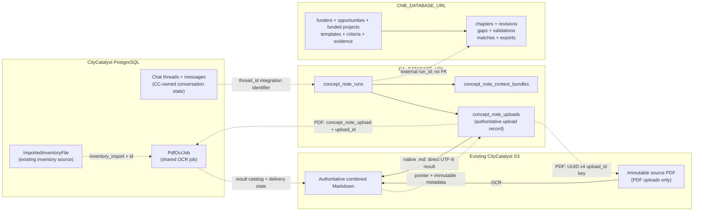
```mermaid
flowchart LR
    subgraph CCDB["CityCatalyst PostgreSQL"]
        Inventory["ImportedInventoryFile<br/>(existing inventory source)"]
        Chat["Chat threads + messages<br/>(CC-owned conversation state)"]
        OCR["PdfOcrJob<br/>(shared OCR job)"]
    end

    subgraph CCS3["Existing CityCatalyst S3"]
        Source["Immutable source PDF<br/>(PDF uploads only)"]
        Markdown["Authoritative combined Markdown"]
    end

    subgraph CADB["CA_DATABASE_URL"]
        Run["concept_note_runs"]
        Upload["concept_note_uploads<br/>(authoritative upload record)"]
        Bundle["concept_note_context_bundles"]
    end

    subgraph CNBDB["CNB_DATABASE_URL"]
        Workspace["chapters + revisions<br/>gaps + validations<br/>matches + exports"]
        References["funders + opportunities + funded projects<br/>templates + criteria + evidence"]
    end

    Inventory -.->|"inventory_import + id"| OCR
    Upload -.->|"PDF: concept_note_upload + upload_id"| OCR
    Upload -.->|"PDF: UUID v4 upload_id key"| Source
    Source -->|"OCR"| Markdown
    Upload -->|"native .md: direct UTF-8 result"| Markdown
    OCR -.->|"result catalog + delivery state"| Markdown
    Chat -.->|"thread_id integration identifier"| Run
    Run --> Upload
    Run --> Bundle
    Run -.->|"external run_id; no FK"| Workspace
    References --> Workspace
    Markdown -.->|"pointer + immutable metadata"| Upload
```

### CityCatalyst PostgreSQL

CC adds no Concept Note upload table, model, or migration. The existing
`PdfOcrJob` table is the only CC database record used by this flow.

#### `PdfOcrJob`

This is the durable CC queue and result catalog shared by inventory imports and
Concept Note uploads. It has one logical row per `(source_type, source_id)` and
has no public job identifier.

```text
source_type            string not null
source_id              uuid not null
status                 string not null
attempt_count          integer not null
run_after              timestamp null
model                  string null
page_count              integer null
result_s3_key           string null
result_size_bytes       bigint null
result_sha256           string null
lease_owner             string null
lease_expires_at        timestamp null
heartbeat_at            timestamp null
started_at              timestamp null
completed_at            timestamp null
error_code              string null
error_message           string null
delivery_target         string null
delivery_status         string null
delivery_attempt_count  integer not null
delivery_run_after      timestamp null
delivered_at            timestamp null
delivery_error_code     string null
delivery_error_message  string null
created_at              timestamp not null
updated_at              timestamp not null
unique                  (source_type, source_id)
```

Rules:

- `source_type = inventory_import` resolves `source_id` through the existing
  `ImportedInventoryFile` table.
- `source_type = concept_note_upload` resolves its deterministic source key
  directly from the CA-owned `upload_id` for PDFs; native Markdown has only a
  content-addressed final result object.
- Because the source relationship is polymorphic, `source_id` is resolved and
  authorized by application code rather than a database foreign key.
- OCR state, retries, leases, and result metadata are independent from optional
  CA delivery state. Retrying delivery does not increment `attempt_count` or
  call Mistral again.
- PDF and Markdown bytes stay in S3. The table stores pointers and metadata only.

The existing `ImportedInventoryFile.importStatus` remains the user-facing GHGI
import lifecycle. It does not replace `PdfOcrJob`: the current `extract` route
will create or reuse the shared OCR row, and successful OCR will pass the stored
Markdown to `InventoryExtractionService` before the import advances to
`waiting_for_approval`.

### Existing CityCatalyst S3

| Object                  | Authoritative pointer         | Lifecycle                                 |
| ----------------------- | ----------------------------- | ----------------------------------------- |
| Inventory source PDF    | `ImportedInventoryFile.s3Key` | Existing inventory import lifecycle.      |
| Concept Note source PDF | UUID v4 `upload_id` key       | CNB upload lifecycle coordinated with CA. |
| PDF-derived Markdown    | `PdfOcrJob.result_s3_key`     | Produced by the shared OCR lifecycle.     |
| Native Markdown         | `PdfOcrJob.result_s3_key`     | Stored directly as the final artifact.    |

PDF-derived Markdown follows
`pdf-ocr/results/{source_type}/{source_id}/{attempt_count}/combined_markdown.md`.
Native Markdown follows
`pdf-ocr/results/concept_note_upload/{upload_id}/direct-{sha256}/combined_markdown.md`,
so a replay with different bytes cannot replace an already registered artifact.

### Climate Advisor Workflow Database

The `concept_note_uploads` table belongs to the existing Climate Advisor Alembic
chain under `CA_DATABASE_URL`. CA creates the row before CC stores or queues the
source. It stores filename, label, lifecycle state, immutable digest/page
metadata, and a nullable stable CC S3 key after conversion. It stores no
Markdown bytes, presigned URL, Mistral configuration, OCR attempt, or lease.

`concept_note_uploads.upload_id` is reused as `PdfOcrJob.source_id`. The upload
identity is checked through API and repository contracts without a
cross-database foreign key to CC. Within the CA database,
`concept_note_uploads.run_id` references `concept_note_runs.run_id` with
cascading deletion.

## Workflow Steps

Each workflow step should map to a scoped context loader and scoped tool pack.
The active step decides which tools are available.

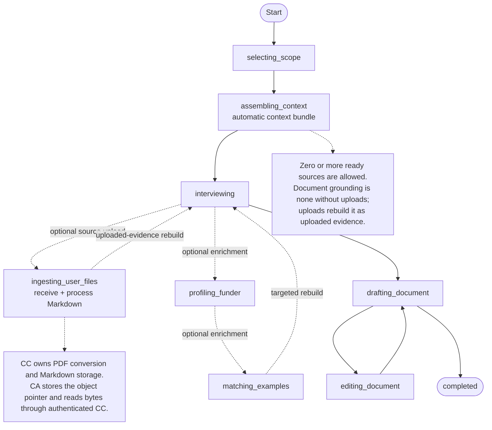
```mermaid
flowchart TB
    Start([Start]) --> Scope["selecting_scope"]
    Scope --> Context["assembling_context<br/>automatic context bundle"]
    Context --> Interview["interviewing"]
    Interview -. optional source upload .-> Ingest["ingesting_user_files<br/>receive + process Markdown"]
    Ingest -. uploaded-evidence rebuild .-> Interview
    Interview -. optional enrichment .-> Funder["profiling_funder"]
    Funder -. optional enrichment .-> Match["matching_examples"]
    Match -. targeted rebuild .-> Interview
    Interview --> Draft["drafting_document"]
    Draft --> Edit["editing_document"]
    Edit --> Draft
    Draft --> Complete([completed])

    IngestNote["CC owns PDF conversion and Markdown storage.<br/>CA stores the object pointer and reads bytes through authenticated CC."]
    ContextNote["Zero or more ready sources are allowed.<br/>Document grounding is none without uploads;<br/>uploads rebuild it as uploaded evidence."]
    Ingest -.-> IngestNote
    Context -.-> ContextNote
```

### Step Scope Table

| Step                   | Main context                                                                            | Enabled tool groups                                                                |
| ---------------------- | --------------------------------------------------------------------------------------- | ---------------------------------------------------------------------------------- |
| `selecting_scope`      | user, city, project candidates                                                          | workflow control, CC project reads                                                 |
| `ingesting_user_files` | CC OCR/delivery status, CA Markdown-ingest status, candidate source excerpts            | deterministic document ingest operations; no LLM                                   |
| `profiling_funder`     | selected funder, template, criteria                                                     | CNB reference table tools                                                          |
| `matching_examples`    | ingested project-upload fields, funder profile, project KB filters                      | internal `ProjectMatchingService`; no agent tools                                  |
| `assembling_context`   | zero or more ready sources, optional GHGI/HIAP, typed empty sections                    | internal `ContextBundleService`; no agent tools                                    |
| `interviewing`         | per-document summaries, optional CC context, gaps and known facts                       | interview tools plus `concept_note.sources.query`                                  |
| `drafting_document`    | application context, complete run bundle, current chapter, all earlier chapter Markdown | independent structured drafting; document validation stays in the UI               |
| `editing_document`     | selected chapter/revision and per-document summaries                                    | document edit tools and selected-source query; document validation stays in the UI |

Export is not a workflow step for the LLM. It is a document workspace button
that calls export preflight and generation routes against the current chapters
and template.

## Context Bundle

The authorized run may advance with no ready source by recording
`document_grounding: none` and `missing_context: [source_documents]`. A ready
upload records `document_grounding: uploaded_evidence`; every other section has
an explicit empty value. Independent `available_context` flags report the
presence of city, project, GHGI, CCRA, HIAP, and uploaded-document context. A
rebuild keeps the last completed bundle and flags available to chat and
selected-source queries until the replacement is committed.

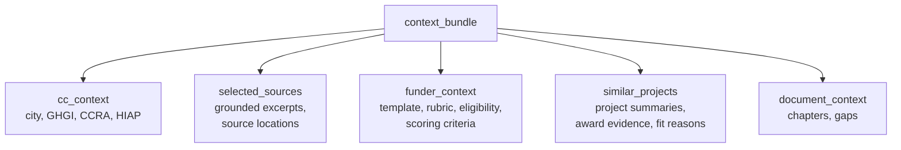
```mermaid
flowchart TB
    Bundle["context_bundle"]
    Bundle --> CCSummary["cc_context<br/>city, GHGI, CCRA, HIAP"]
    Bundle --> Sources["selected_sources<br/>grounded excerpts,<br/>source locations"]
    Bundle --> Funder["funder_context<br/>template, rubric, eligibility,<br/>scoring criteria"]
    Bundle --> Examples["similar_projects<br/>project summaries,<br/>award evidence, fit reasons"]
    Bundle --> Draft["document_context<br/>chapters, gaps"]
```

Recommended high-level shape:

```json
{
  "cc_context": {
    "city": null,
    "project": null,
    "ghgi": null,
    "ccra": null,
    "hiap": null
  },
  "selected_sources": [
    {
      "upload_id": "uuid",
      "source_label": "City climate plan",
      "filename": "plan.pdf",
      "sha256": "64 lowercase hexadecimal characters",
      "source_format": "pdf",
      "page_count": 42,
      "summary": "Short document summary",
      "topics": ["adaptation", "transport"],
      "key_excerpts": [{ "text": "Exact contiguous source text", "page": 7 }]
    }
  ],
  "funder_context": null,
  "similar_projects": [],
  "document_context": null
}
```

The bundle contains no raw source, storage key, credential, or derived chunk.
Its summary records build/fingerprint identity, mode, missing context, source and
optional-context statuses, warnings, retryability, and completion. Only the
active build may commit; later rebuilds or retryable failures keep serving the
last completed bundle.

### CNB City Context API

During `assembling_context`, CNB calls Climate Advisor with the active run and
the CityCatalyst city selected for that run:

```http
POST /v1/concept-notes/{run_id}/cc-context
Authorization: Bearer <CityCatalyst user token>
Content-Type: application/json

{
  "city_id": "uuid",
  "include_hiap": false,
  "language": "en"
}
```

Climate Advisor validates the CC identity, CNB run ownership, immutable run/city
binding, and city access. It then selects the newest accessible inventory by
inventory year, last update, and stable inventory UUID tie-break. A successful
response has this bounded shape:

```json
{
  "run_id": "uuid",
  "city_id": "uuid",
  "context_bundle": {
    "cc_context": {
      "ghgi": {
        "availability": "available",
        "inventory": {
          "id": "uuid",
          "year": 2024,
          "type": "gpc_basic",
          "gwp": "ar6"
        },
        "emissions": {
          "total_kgco2e": 83950000,
          "sectors": [
            {
              "gpc": "I",
              "name": "Stationary Energy",
              "emissions_kgco2e": 40399000,
              "share_pct": 48.12,
              "completion_pct": 92,
              "required": 25,
              "filled": 23,
              "missing": 2,
              "data_state": {
                "third_party": 1,
                "manual_or_uploaded": 20,
                "not_estimated": 1,
                "not_occurring": 1
              }
            }
          ],
          "top_sources": []
        }
      }
    }
  }
}
```

GHGI always contains GPC sectors I-V in order and caps `top_sources` at five.
Source-state counts remain sector-specific; the CNB contract has no aggregate
`source_mix`. CityCatalyst returns its kilogram-based inventory values unchanged
through explicit `kgco2e` fields, and CNB persists the same base unit. Both the
status and emissions capability payloads must contain sectors I-V exactly once;
malformed sets fail with `503 invalid_cc_context`. `availability` is
`partial` when required GHGI values are missing and `missing` with null
inventory/emissions when the city has no accessible inventory.

`include_hiap` defaults to `false`; when false, the compatible `/cc-context`
response omits `hiap`.
When true, Climate Advisor calls the read-only
`hiap.inventory.context` capability for the same inventory selected for GHGI.
`language` defaults to `en` and can be `en`, `es`, `pt`, `de`, or `fr`.
Mitigation and adaptation are separate. For each category, the projection
returns every explicitly city-selected persisted action. If the city has no
selection, it falls back to all persisted ranked actions without a hidden cap.
The capability reports `available`, `pending`, `failed`, or `missing`, but never
starts a ranking job, copies translations, repairs selection state, or writes
CityCatalyst product data.

The compatible route's repository update replaces only the GHGI and/or HIAP sections built by the
current request. It reads the current bundle under the write lock so every
other assembled section is preserved. Before using a cached section, Climate
Advisor revalidates live access to the city and confirms that the cached
inventory is still the selected inventory. Incomplete CC capability payloads
fail with `503 invalid_cc_context` and are not persisted. `run_id` and `city_id`
remain in the API envelope and are not duplicated inside the stored bundle.

The current caller supplies `city_id`, opts into HIAP with
`include_hiap: true`, and can select a response language. The future
CityCatalyst UI should list accessible choices through
`GET /api/v1/user/projects`, bind the city selection when starting the run, and
submit that same UUID and HIAP preference to the compatible route. Automatic
Source-aware assembly always attempts both GHGI and HIAP; missing, pending, failed,
malformed, or unavailable optional results are persisted as `null` and do not
block readiness. Partial GHGI and HIAP with usable persisted actions are kept.

#### Compact GHGI and HIAP response example

This bounded example shows HIAP tied to the same inventory as GHGI. Explicit
city selections win; the adaptation category demonstrates the ranked fallback.

```json
{
  "run_id": "af6430b9-cfd7-4009-aed3-5f545dff960a",
  "city_id": "b6a15059-ddfa-42d8-9daf-450713a86b0d",
  "context_bundle": {
    "cc_context": {
      "ghgi": {
        "availability": "partial",
        "inventory": {
          "id": "2edd677c-1ec6-4bc6-a052-a634b195f4df",
          "year": 2022,
          "type": "gpc_basic_plus",
          "gwp": "ar6"
        },
        "emissions": {
          "total_kgco2e": 9076427280,
          "sectors": ["I", "II", "III", "IV", "V"],
          "top_sources": 5
        }
      },
      "hiap": {
        "availability": "available",
        "inventory_id": "2edd677c-1ec6-4bc6-a052-a634b195f4df",
        "requested_language": "en",
        "mitigation": {
          "status": "available",
          "ranking_id": "uuid",
          "updated_at": "2026-07-29T10:00:00Z",
          "language": "en",
          "selection_mode": "city_selected",
          "counts": {
            "ranked": 10,
            "selected": 2,
            "returned": 2
          },
          "actions": [
            {
              "action_id": "action-1",
              "name": "Selected mitigation action",
              "type": "mitigation",
              "rank": 1,
              "selected": true,
              "source": "ranked",
              "language": "en",
              "description": null,
              "sectors": ["Stationary Energy"],
              "hazards": [],
              "primary_purposes": ["Mitigation"],
              "timeline": null,
              "investment_cost": null,
              "explanation": null
            },
            {
              "action_id": "action-2",
              "name": "City-added mitigation action",
              "type": "mitigation",
              "rank": null,
              "selected": true,
              "source": "unranked",
              "language": "en",
              "description": null,
              "sectors": ["Transportation"],
              "hazards": [],
              "primary_purposes": ["Mitigation"],
              "timeline": null,
              "investment_cost": null,
              "explanation": null
            }
          ]
        },
        "adaptation": {
          "status": "available",
          "ranking_id": "uuid",
          "updated_at": "2026-07-29T10:00:00Z",
          "language": "en",
          "selection_mode": "ranked_fallback",
          "counts": {
            "ranked": 1,
            "selected": 0,
            "returned": 1
          },
          "actions": [
            {
              "action_id": "action-3",
              "name": "Ranked adaptation action",
              "type": "adaptation",
              "rank": 1,
              "selected": false,
              "source": "ranked",
              "language": "en",
              "description": null,
              "sectors": [],
              "hazards": ["Floods"],
              "primary_purposes": ["Adaptation"],
              "timeline": null,
              "investment_cost": null,
              "explanation": null
            }
          ]
        }
      }
    }
  }
}
```

## CityCatalyst Data Landscape

The context bundle should use the available CityCatalyst data as bounded
summaries. Coverage and source formats vary by city, so the workflow must not
assume that every selected city has complete GHGI or CCRA data.

### GHGI

Amanda confirmed that GHGI data exists for Minnesota cities, but coverage is not
complete. Not every city is available, and some cities report only selected
sectors. Cities also use their own reporting structures, so the available data
must be mapped into the CityCatalyst/GPC structure before it can be used as
consistent concept-note context.

Once the first target cities are selected, Amanda can confirm the exact GHGI
coverage for each city, including available years, covered sectors, missing
sectors, source format, and required mapping work.

### CCRA and Minnesota GreenStep

Minnesota cities may have risk-assessment material and reported sustainability
actions that can contribute to CCRA context. These sources must be reviewed for
the selected cities before they are treated as structured CityCatalyst data.

[Minnesota GreenStep Cities & Tribal Nations](https://greenstep.pca.state.mn.us/)
is a voluntary sustainability and quality-of-life program built around 29
optional best practices and more than 180 actions. It gives cities a menu of
actions they can choose to pursue and records implementation at one-, two-, or
three-star levels. The
[Climate Adaptation and Community Resilience best practice](https://greenstep.pca.state.mn.us/bp-detail/81730)
includes actions covering extreme-weather preparedness, integration of climate
resilience into planning and budgeting, community resilience, and private-sector
risk reduction. Individual GreenStep actions can also reference risk-assessment
methods; for example, the
[water and wastewater resilience action](https://greenstep.pca.state.mn.us/bp-action-detail/81918)
uses CREAT or a similar assessment to evaluate climate risk to infrastructure.

GreenStep therefore provides potentially useful evidence about city actions,
plans, and resilience work, but it should not be assumed to be a complete or
standardized CCRA dataset. For each selected city, the workflow should review:

- available risk assessments and their hazard, exposure, vulnerability, and
  scoring structure;
- GreenStep actions, their implementation status, and supporting evidence;
- overlap between GreenStep actions and actions already stored in CityCatalyst;
- missing risks, sectors, populations, infrastructure, or geographic coverage;
  and
- whether the records are current enough to use in the concept note.

## Database Model

### Data Planning Constraints From Global Data

The CNB funding reference table model follows the global-data CNB research page. The
important planning rules are:

- Keep the four discovered input groups separate: finance landscape, funder
  profiles, comparable awards, and CityCatalyst city context/GHGI.
- Store application programmes in `funding_opportunities` and awarded examples
  in `funded_projects`; do not use a type flag to distinguish them.
- Keep each funded project and its award information in one complete row; do
  not introduce a separate funding-link table.
- Treat the finance route as document-shaping data. A competitive grant,
  formula/block grant, green-bank loan, capital-investment request, and city
  self-financing path each imply different required document sections.
- Store funder profiles with two halves:
  - `stated`: eligibility, rubric, template, award rules, and requirements read
    from RFP/NOFO/program documents.
  - `derived`: patterns computed from awards data, such as typical recipients,
    award sizes, categories, and revealed preferences.
- Treat calibrated matching criteria as a later concept. NLC should approve
  thresholds and weights before the workflow uses numeric scoring against a
  rubric.
- Treat Minnesota city/GHGI sources as context candidates until license,
  redistribution, and GPC-mapping blockers are resolved.

### CNB Workflow Tables

These are the logical workflow/document tables the CNB backend needs to use.
`concept_note_chapters`, `concept_note_chapter_revisions`,
`concept_note_evidence_links`, `concept_note_gaps`,
`concept_note_chapter_validations`,
`concept_note_matched_projects`, and `concept_note_exports` live under
`CNB_DATABASE_URL`. Climate Advisor consumes them through typed
service/repository contracts.

The run, context-bundle, and upload tables shown for logical context live under
`CA_DATABASE_URL` and are not created by the CNB migration. Relationships from
the CNB workspace to a run are application-level joins by `run_id`, not physical
foreign keys. Funding references in the next diagram share the CNB database with
the workspace and can use internal foreign keys.

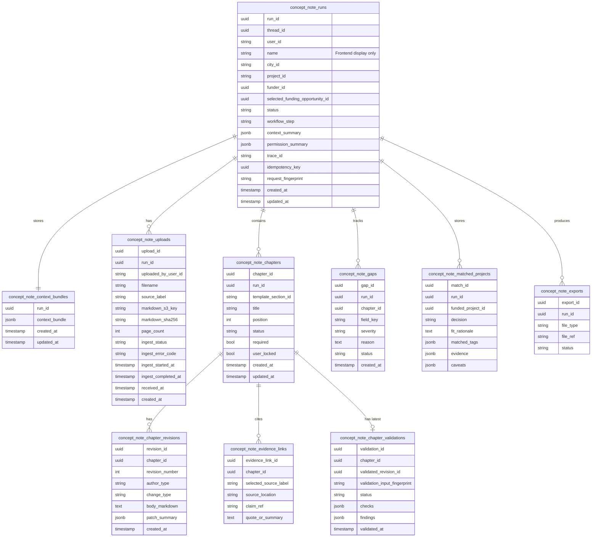
```mermaid
erDiagram
    concept_note_runs ||--|| concept_note_context_bundles : "stores"
    concept_note_runs ||--o{ concept_note_uploads : "has"
    concept_note_runs ||--o{ concept_note_chapters : "contains"
    concept_note_runs ||--o{ concept_note_gaps : "tracks"
    concept_note_runs ||--o{ concept_note_matched_projects : "stores"
    concept_note_runs ||--o{ concept_note_exports : "produces"
    concept_note_chapters ||--o{ concept_note_chapter_revisions : "has"
    concept_note_chapters ||--o{ concept_note_evidence_links : "cites"
    concept_note_chapters ||--o| concept_note_chapter_validations : "has latest"

    concept_note_runs {
        uuid run_id
        uuid thread_id
        string user_id
        string name "Frontend display only"
        string city_id
        string project_id
        uuid funder_id
        uuid selected_funding_opportunity_id
        string status
        string workflow_step
        jsonb context_summary
        jsonb permission_summary
        string trace_id
        uuid idempotency_key
        string request_fingerprint
        timestamp created_at
        timestamp updated_at
    }

    concept_note_uploads {
        uuid upload_id
        uuid run_id
        string uploaded_by_user_id
        string filename
        string source_label
        string markdown_s3_key
        string markdown_sha256
        int page_count
        string ingest_status
        string ingest_error_code
        timestamp ingest_started_at
        timestamp ingest_completed_at
        timestamp received_at
        timestamp created_at
    }

    concept_note_context_bundles {
        uuid run_id
        jsonb context_bundle
        timestamp created_at
        timestamp updated_at
    }

    concept_note_gaps {
        uuid gap_id
        uuid run_id
        uuid chapter_id
        string field_key
        string severity
        text reason
        string status
        timestamp created_at
    }

    concept_note_chapters {
        uuid chapter_id
        uuid run_id
        string template_section_id
        string title
        int position
        string status
        bool required
        bool user_locked
        timestamp created_at
        timestamp updated_at
    }

    concept_note_chapter_revisions {
        uuid revision_id
        uuid chapter_id
        int revision_number
        string author_type
        string change_type
        text body_markdown
        jsonb patch_summary
        timestamp created_at
    }

    concept_note_evidence_links {
        uuid evidence_link_id
        uuid chapter_id
        string selected_source_label
        string source_location
        string claim_ref
        text quote_or_summary
    }

    concept_note_chapter_validations {
        uuid validation_id
        uuid chapter_id
        uuid validated_revision_id
        string validation_input_fingerprint
        string status
        jsonb checks
        jsonb findings
        timestamp validated_at
    }

    concept_note_matched_projects {
        uuid match_id
        uuid run_id
        uuid funded_project_id
        string decision
        text fit_rationale
        jsonb matched_tags
        jsonb evidence
        jsonb caveats
    }

    concept_note_exports {
        uuid export_id
        uuid run_id
        string file_type
        string file_ref
        string status
    }
```

Across the two databases, integration identifiers use the same UUID type as
their source records:

- `concept_note_runs.funder_id` and `selected_funding_opportunity_id` are external
  identifiers into `CNB_DATABASE_URL` and receive no database foreign keys.
  The latter identifies a `funding_opportunities.funding_opportunity_id`.
- Every CNB workspace `run_id` is an external identifier into
  `CA_DATABASE_URL` and receives no database foreign key.
- `concept_note_matched_projects.funded_project_id` is internal to
  `CNB_DATABASE_URL` and references `funded_projects.funded_project_id` with
  restricted deletion.

`concept_note_runs.thread_id` is a nullable integration identifier for the
dedicated chat thread. It deliberately has no database foreign key so legacy
thread bindings remain compatible. Rename updates the owned thread title and
delete removes the dedicated thread. CityCatalyst validates thread ownership
before passing the identifier into the workflow.

`concept_note_chapter_revisions` enforces a unique
`(chapter_id, revision_number)` pair so each chapter has one unambiguous latest
revision.

`concept_note_chapter_validations` enforces one latest row per chapter. Its
nullable validated-revision foreign key uses `ON DELETE SET NULL`; chapter
deletion cascades the validation. The input fingerprint covers every active
chapter's identity, template reference, title, order, required flag, and latest
revision; the target chapter's open gaps and evidence links; and every field of
the reviewed application template supplied to validation. A change to any of
those inputs makes the result stale. A stale formerly-ready result is projected
as effective `needs_review` and presented as “Needs re-validation” while
retaining its original revision and timestamp. Validation reloads and compares
the application template after model evaluation, then rechecks the combined
fingerprint while locking the active chapters and target gap/evidence rows
before upsert. Changed inputs return `409 chapter_revision_changed` and preserve
the previous result. Run duplication copies no validation rows and derives
copied chapter status from body and open gaps rather than carrying
validation-derived state.

For uploads, the authenticated CityCatalyst upload route generates a new UUID v4
`upload_id` for each accepted initial request. CA first creates the run-bound
upload row; only then does CC store the PDF under a key derived from that ID and
create the OCR job. Retries after registration use the existing run-scoped
upload ID through the explicit retry route rather than submitting the initial
upload again. An upload ID already bound to another run or immutable
filename/label is rejected.

After conversion, CA verifies the artifact through CC's authenticated internal
Markdown read endpoint, then stores `markdown_s3_key`, the verified
`markdown_sha256`, page count, source label, and `ingest_status`. These values
are immutable for an `upload_id`; replacement creates a new upload. The stored
key is stable and never a presigned URL. Later context assembly reads the CA
upload row and asks CC for Markdown by `upload_id`; CA receives no bucket
credentials or Markdown storage authority.

### Evidence Links

`concept_note_evidence_links` are workspace review records. They connect a claim
in a chapter to the selected source context that supports it. Revisions remain
the chapter history and do not own evidence links.

They do not store source documents or converter chunks. The supporting context
lives in the context bundle, and the evidence link records the user-facing source
label, source location, claim reference, and quote or summary needed for user
review.

Example: if a chapter says the project targets the city's largest emissions
sector, an evidence link can point that claim to a GHGI summary, an uploaded CAP
excerpt, a funder criterion, or a matched funded-project example already present
in the context bundle.

### Gaps

`concept_note_gaps` are unresolved missing facts or required template fields
that cannot be grounded from the context bundle yet. They are not source records.
They are drafting/export blockers or warnings such as missing budget amount,
missing partner confirmation, or a required funder section with no
evidence-backed content.

### CNB Funding Reference Tables

These tables live under `CNB_DATABASE_URL` beside the document workspace. They
store reusable funders, funding opportunities, and funded-project examples and
are accessed through typed contracts. The repository owns their schema and
migrations; infrastructure and curated data remain externally managed. There
are no cross-database foreign keys to the CA-owned run foundation.

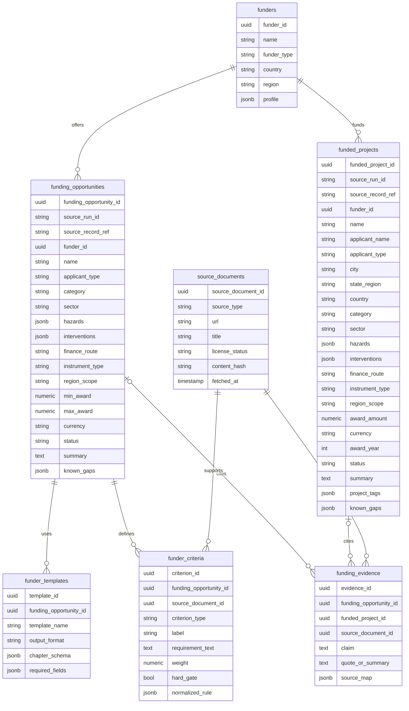
```mermaid
erDiagram
    funders ||--o{ funding_opportunities : "offers"
    funders ||--o{ funded_projects : "funds"
    funding_opportunities ||--o{ funder_templates : "uses"
    funding_opportunities ||--o{ funder_criteria : "defines"
    funding_opportunities o|--o{ funding_evidence : "cites"
    funded_projects o|--o{ funding_evidence : "cites"
    source_documents ||--o{ funding_evidence : "supports"
    source_documents ||--o{ funder_criteria : "supports"

    funders {
        uuid funder_id
        string name
        string funder_type
        string country
        string region
        jsonb profile
    }

    funding_opportunities {
        uuid funding_opportunity_id
        string source_run_id
        string source_record_ref
        uuid funder_id
        string name
        string applicant_type
        string category
        string sector
        jsonb hazards
        jsonb interventions
        string finance_route
        string instrument_type
        string region_scope
        numeric min_award
        numeric max_award
        string currency
        string status
        text summary
        jsonb known_gaps
    }

    funded_projects {
        uuid funded_project_id
        string source_run_id
        string source_record_ref
        uuid funder_id
        string name
        string applicant_name
        string applicant_type
        string city
        string state_region
        string country
        string category
        string sector
        jsonb hazards
        jsonb interventions
        string finance_route
        string instrument_type
        string region_scope
        numeric award_amount
        string currency
        int award_year
        string status
        text summary
        jsonb project_tags
        jsonb known_gaps
    }

    funder_templates {
        uuid template_id
        uuid funding_opportunity_id
        string template_name
        string output_format
        jsonb chapter_schema
        jsonb required_fields
    }

    funder_criteria {
        uuid criterion_id
        uuid funding_opportunity_id
        uuid source_document_id
        string criterion_type
        string label
        text requirement_text
        numeric weight
        bool hard_gate
        jsonb normalized_rule
    }

    source_documents {
        uuid source_document_id
        string source_type
        string url
        string title
        string license_status
        string content_hash
        timestamp fetched_at
    }

    funding_evidence {
        uuid evidence_id
        uuid funding_opportunity_id
        uuid funded_project_id
        uuid source_document_id
        text claim
        text quote_or_summary
        jsonb source_map
    }
```

Each `funding_opportunities` row holds one application programme and its award
range. Each `funded_projects` row holds one complete awarded-project example and
its award information. Templates and criteria reference only a funding
opportunity. Each `funding_evidence` row references exactly one opportunity or
funded project; a check constraint rejects rows with both or neither parent.

Every funded-project row must reference one canonical existing `funder_id`.
Local research may discover a project whose reported funder has not yet been
linked to the canonical funder table. Before import, a separate funder-identity
matching scan proposes existing funder records and the static review website
requires the reviewer to select the correct link. If no existing funder is
correct, that funder must be researched, reviewed, and imported first.
The importer rejects missing or unknown funder IDs. Funded projects do not need
an opportunity-record relationship for this matching flow.

Imported funded projects retain the local research identity as
`source_run_id` plus `source_record_ref`. The CNB database enforces a
unique constraint on that pair. Replaying an approved import returns the
existing `funded_project_id` and does not insert duplicate evidence; revised
reference data requires a new research run.

The physical schema also enforces unique `(content_hash, url)` source documents,
unique `(chapter_id, revision_number)` revisions, unique
`(run_id, funded_project_id)` matches, and unique active chapter positions per
run through a partial index that excludes deleted chapters. Reference children
cascade from opportunities or funded projects; chapter revisions and evidence
links cascade from chapters; deleting a referenced funder or matched funded
project is restricted.
All UUIDv4 primary keys are generated by application code, so the migration does
not require a PostgreSQL UUID extension. `funder_criteria.source_document_id` is
nullable and links a criterion to retained provenance when one exists.

Funded-project discovery itself is project-first: its CLI requires a substantive
current-project profile and uses that profile to guide queries and candidate
prioritization. A canonical-funder snapshot is optional at this stage and must
not narrow discovery. It becomes mandatory only when identities are resolved
for approved review and import.

## Research Ingest Pipeline

The ingest pipeline should reuse the same local script, JSON review bundle,
static review website, and local importer for funders and funded projects. It
turns curated research into stable records with provenance, not just embeddings.

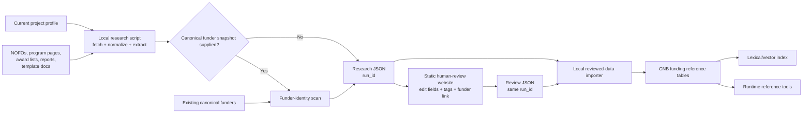
```mermaid
flowchart LR
    Target["Current project profile"] --> Script
    Sources["NOFOs, program pages,<br/>award lists, reports,<br/>template docs"] --> Script["Local research script<br/>fetch + normalize + extract"]
    Script --> HasFunders{"Canonical funder snapshot supplied?"}
    HasFunders -->|No| ResearchJSON["Research JSON<br/>run_id"]
    HasFunders -->|Yes| FunderMatch["Funder-identity scan"]
    ExistingFunders["Existing canonical funders"] --> FunderMatch
    FunderMatch --> ResearchJSON
    ResearchJSON --> Review["Static human-review website<br/>edit fields + tags + funder link"]
    Review --> ReviewJSON["Review JSON<br/>same run_id"]
    ResearchJSON --> Import["Local reviewed-data importer"]
    ReviewJSON --> Import
    Import --> Store["CNB funding reference tables"]
    Store --> Index["Lexical/vector index"]
    Store --> Tools["Runtime reference tools"]
```

The research and review files both contain the same `run_id`, and the importer
rejects mismatched IDs. A SHA check is not required for this pairing.

Required ingest outputs:

- Source document record with URL, title, date, license status, and hash.
- Funder record, funding-opportunity record, and funded-project records.
- A reviewer-selected canonical `funder_id` for every funded project.
- Reviewer-curated `project_tags` for funded projects used in matching.
- Template chapter schema.
- Stated eligibility criteria from program documents.
- Derived matching signals, marked as derived.
- Opportunity details in `funding_opportunities` and awarded examples in
  `funded_projects`.
- Evidence links for each important claim.

## Similar Project Matching

For the first release, similar-project matching should be an LLM agent decision
over a candidate set from the CNB funding reference tables. The agent should
choose examples, explain why they fit, and surface caveats. It should not present
a calibrated numeric score yet.

The matching dataset should support a curated tag system as an option. Each
funded project can carry tags such as sector, hazard, intervention type, finance
route, applicant type, geography, beneficiary group, and implementation stage.
The current project fields used for matching should be normalized to the same
tag vocabulary where possible. Matching can then compare tag combinations to
find the closest funded examples before the later scoring model is calibrated.
Runtime retrieval uses `same_funder` by default. An explicit `cross_funder`
scope can broaden discovery across reviewed funded-project records while
retaining each candidate's canonical funder identity and the same evidence
gate.

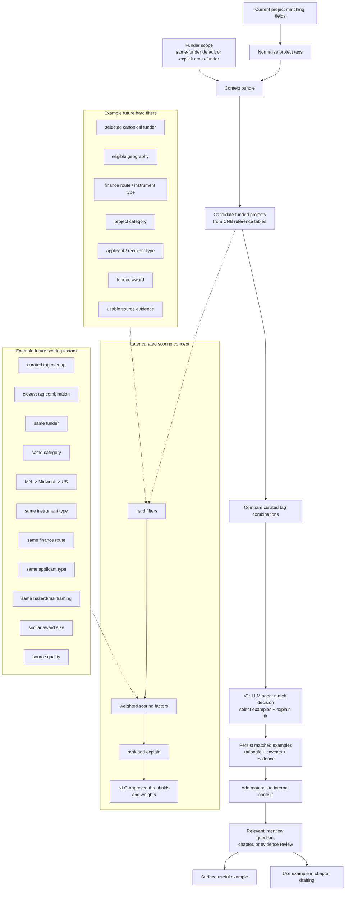
```mermaid
flowchart TB
    Project["Current project matching fields"] --> Tags["Normalize project tags"]
    Tags --> Bundle["Context bundle"]
    Scope["Funder scope<br/>same-funder default or explicit cross-funder"] --> Bundle
    Bundle --> CandidateSet["Candidate funded projects<br/>from CNB reference tables"]
    CandidateSet --> TagCompare["Compare curated tag combinations"]
    TagCompare --> AgentDecision["V1: LLM agent match decision<br/>select examples + explain fit"]
    AgentDecision --> StoreMatch["Persist matched examples<br/>rationale + caveats + evidence"]
    StoreMatch --> Context["Add matches to internal context"]
    Context --> Relevant["Relevant interview question,<br/>chapter, or evidence review"]
    Relevant --> UI["Surface useful example"]
    Relevant --> Draft["Use example in chapter drafting"]

    CandidateSet -.-> FutureFilters

    subgraph FutureScoring["Later curated scoring concept"]
        FutureFilters["hard filters"]
        FutureFilters --> Score["weighted scoring factors"]
        Score --> Rank["rank and explain"]
        Rank --> Calibration["NLC-approved thresholds<br/>and weights"]
    end

    subgraph FilterExamples["Example future hard filters"]
        FunderGate["selected canonical funder"]
        GeographyGate["eligible geography"]
        InstrumentGate["finance route / instrument type"]
        CategoryGate["project category"]
        ApplicantGate["applicant / recipient type"]
        StatusGate["funded award"]
        EvidenceGate["usable source evidence"]
    end

    subgraph FactorExamples["Example future scoring factors"]
        TagOverlap["curated tag overlap"]
        TagCombo["closest tag combination"]
        SameFunder["same funder"]
        Category["same category"]
        Region["MN -> Midwest -> US"]
        Instrument["same instrument type"]
        Route["same finance route"]
        Applicant["same applicant type"]
        Hazards["same hazard/risk framing"]
        AwardSize["similar award size"]
        Evidence["source quality"]
    end

    FilterExamples -.-> FutureFilters
    FactorExamples -.-> Score
```

V1 matching result should include:

- matched project id
- LLM fit rationale
- matched tag combination, when available
- source evidence
- text snippets safe to show as examples
- caveats or missing fields

The matching operation starts only after the user's project upload has been
ingested into the current project fields. Match completion remains internal and
does not create a standalone user-facing result. The workflow surfaces a stored
example only when the active interview or document context makes it relevant.

The tag vocabulary should be curated data, not invented at runtime by the model.
The LLM can reason over tags already assigned to projects, but new tags or tag
weights should be added through the externally managed curated-data process.

The later curated scoring system should be treated as a concept, not current v1
behavior. It can add hard filters and weighted scoring once NLC approves the
thresholds and weights.

Conceptual hard filters are gates, not ranking signals. A funded project would
need to pass the applicable gates before it can be scored.

| Hard filter                     | What it excludes before scoring                                                                                                 |
| ------------------------------- | ------------------------------------------------------------------------------------------------------------------------------- |
| Canonical funder                | Projects whose required `funder_id` does not match the selected funder.                                                         |
| Eligible geography              | Projects outside the configured geography fallback path for the opportunity, such as Minnesota, Midwest, then US.               |
| Finance route / instrument type | Examples from the wrong funding route, such as comparing a loan against a competitive grant.                                    |
| Project category                | Projects in unrelated sectors or categories.                                                                                    |
| Applicant / recipient type      | Awards to recipient types that do not match the user's applicant profile, such as nonprofit-only awards for a city-led project. |
| Funded award                    | Records that are not actual awards.                                                                                             |
| Usable source evidence          | Records without enough source evidence to show the user why the example is relevant.                                            |

If the user project or funder profile is missing a field needed for the future
scoring concept, the workflow should not invent it. It should record a match
caveat and create a gap if the missing field matters for drafting.

## PDF Conversion and Native Markdown Handoff

CityCatalyst owns both source-to-Markdown paths:

- PDF uploads use the shared PDF-to-Markdown converter. CC owns source-file
  authorization and storage, the durable OCR queue, Mistral requests, retries,
  ordered page merge, schema validation, and the authoritative Markdown
  artifact.
- Native `.md` uploads bypass OCR entirely. CC validates UTF-8, rejects NUL or
  empty content, removes an optional BOM, normalizes line endings, and stores
  that Markdown directly in the final result namespace that CA reads later.

The PDF-derived artifact follows these Markdown-shape requirements:

- all pages are merged in source order into one UTF-8 Markdown document;
- tables retain Markdown structure, exact headers, aligned rows and columns,
  captions, totals, units, scale, and year context;
- source rows are not merged, dropped, aggregated, or reordered;
- GPC references, scopes, gas columns, and activity fields are retained when
  present; and
- narrative sections remain available for CNB evidence and context selection.

Native Markdown preserves the text content after BOM and line-ending
normalization and does not receive synthetic page markers or a synthetic
`page_count`. CA verifies and consumes both PDF
and native Markdown only through the authenticated CC read boundary and does
not participate in OCR.

Each accepted upload request receives a fresh UUID v4 `upload_id`; uploading the
same file again intentionally creates another source identity. Replaying the
same CA create request with that ID and unchanged metadata is idempotent, while
changing its immutable identity is rejected. PDF uploads use
`source_type = concept_note_upload` and `source_id = upload_id` inside the shared
OCR queue. A run may contain many distinct uploads. The shared 20 MiB upload
limit applies to the uploaded source file, not to the final Markdown artifact.
PDF-derived Markdown includes `page_count` metadata; native Markdown does not
use page counts.

The browser sends source bytes only to the authenticated CC upload route. CA
receives the stable Markdown **object key** as pointer metadata, but never the
source file, bucket credentials, AWS access keys, signed URLs, Mistral
configuration, or OCR retry instructions. The object key is not an access
credential: CA cannot read CC S3 directly. It retrieves Markdown by `upload_id`
through CC's authenticated internal read route; CC resolves the stored result
key, reads S3, verifies SHA-256, and streams the bytes.

Each upload is handled independently:

1. `POST .../{run_id}/uploads` verifies run access, creates or replays the
   authoritative CA row, stores the user file in CC, and wakes the shared OCR
   and delivery processors after the durable work record exists. The route
   still returns `202` without waiting for OCR or context rebuilding; the
   scheduled worker remains the recovery and retry path.
2. For a PDF upload, CC creates or reuses the OCR job, converts the file, and
   stores the authoritative Markdown artifact in CC S3. For a native Markdown
   upload, CC stores the validated, normalized UTF-8 artifact directly in the
   final Markdown namespace without queuing or running OCR; the same
   `PdfOcrJob` table records the completed result and delivery state.
3. CC calls
   `POST /v1/concept-notes/{run_id}/uploads/{upload_id}/markdown` with the stable
   Markdown object key, filename, source label, and digest. PDF-derived
   artifacts may also include page metadata; native Markdown does not.
4. CA rechecks run permission and calls CC's authenticated internal Markdown
   read route by `upload_id`.
5. CA validates the returned bytes against the delivered identity metadata,
   rejects an upload ID already bound to another run, durably registers the
   pointer, and returns `202`.
6. CA can then perform excerpt selection, indexing, summarization, and context
   bundle rebuilding. These steps are not part of conversion.
7. A failed OCR retry may call Mistral again for PDF uploads only. A failed
   pointer delivery or authenticated read retries the stored result only and
   never repeats successful OCR or native Markdown storage.

Repeated handoff with the same upload and digest is idempotent. A different
digest for the same immutable upload returns
`409 markdown_identity_conflict`. One failed file never hides or overwrites
another upload in the same run.

Other document types require a separate CC normalizer before they can enter the
CA pointer-registration and authenticated Markdown-read boundary.

## Document Workspace

The document workspace is the product surface where the concept note takes
shape. It is not just a generated blob. It is a structured editor for chapter
text, revision history, missing facts, and evidence review. The final DOCX/PDF
export is generated from the chapter text and template structure only.

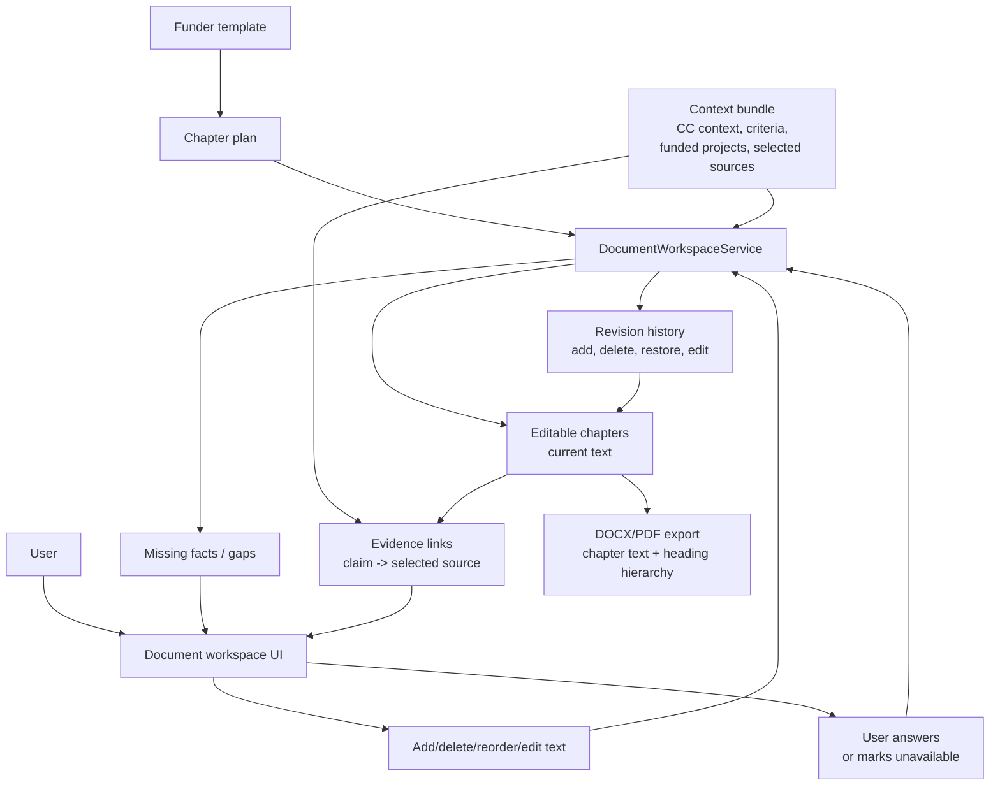
```mermaid
flowchart TB
    Template["Funder template"] --> ChapterPlan["Chapter plan"]
    ChapterPlan --> DocService["DocumentWorkspaceService"]
    Context["Context bundle<br/>CC context, criteria,<br/>funded projects, selected sources"] --> DocService
    User["User"] --> Workspace["Document workspace UI"]
    Workspace --> UserEdits["Add/delete/reorder/edit text"]
    UserEdits --> DocService
    DocService --> Chapters["Editable chapters<br/>current text"]
    DocService --> Revisions["Revision history<br/>add, delete, restore, edit"]
    Revisions --> Chapters
    DocService --> Gaps["Missing facts / gaps"]
    Gaps --> Workspace
    Workspace --> UserAnswers["User answers<br/>or marks unavailable"]
    UserAnswers --> DocService
    Context --> EvidenceLinks["Evidence links<br/>claim -> selected source"]
    Chapters --> EvidenceLinks
    EvidenceLinks --> Workspace
    Chapters --> Exporter["DOCX/PDF export<br/>chapter text + heading hierarchy"]
```

How it works:

- The selected funder template creates the chapter plan and initial empty
  chapters. Each funding opportunity has exactly one template.
- The context bundle supplies drafting context: CC facts, funder criteria,
  matched project examples, and selected source excerpts.
- Generated document Markdown reserves H1 for the final document title; every
  template chapter starts at H2 and its subsections start at H3.
- DOCX and PDF exports preserve that hierarchy with numbered chapter headings.
  PDF exports also include structure tags plus document title and language
  metadata for accessible navigation.
- The workspace shows editable chapters as the main document surface.
- Every add, delete, restore, reorder, or text edit creates a chapter revision.
  Revisions are an audit/history trail; they do not feed evidence links.
- Missing facts are stored as gaps and surfaced to the user in the workspace.
  They do not create chapters by themselves.
- Evidence links are shown to the user to explain why a claim was grounded.
  They are review/audit UI only and are ignored by DOCX/PDF export.
- A five-minute reconciler marks chapter-drafting leases left `running` for more
  than one hour as failed and retryable, without discarding completed chapters.

Chapter fields should support the editable document surface:

- `chapter_id`
- `run_id`
- `template_section_id`
- `title`
- `position`
- `status`: `empty`, `draft`, `needs_review`, `ready`, `deleted`
- `required`
- `user_locked`

`concept_note_chapters` stores chapter metadata only. Chapter Markdown is stored
only in `concept_note_chapter_revisions.body_markdown`. The current chapter body
is the full Markdown body from the revision with the highest `revision_number`
for that chapter; it is not duplicated on the chapter row.

Revision fields should support history and conflict handling:

- `revision_id`
- `chapter_id`
- `revision_number`
- `author_type`: `agent`, `user`, `system`
- `change_type`: `draft`, `edit_text`, `add_chapter`, `delete_chapter`,
  `restore_chapter`, `rewrite`
- `body_markdown`
- `patch_summary`
- `created_at`

Every revision stores the complete `body_markdown`, including revisions created
for non-text chapter operations, so any historical chapter state can be
reconstructed without reading Markdown from `concept_note_chapters`.

## Document Tool Deep Dive

Tools should be grouped by step and registered only when relevant. The LLM
should not be able to delete a chapter while it is only assembling context.
Export is not an LLM tool; it is a document workspace button that calls
preflight and generation routes.

### Tool Groups

| Group                 | Purpose                            | Writes CNB storage | Calls CC | Calls CNB reference tables |
| --------------------- | ---------------------------------- | ------------------ | -------- | -------------------------- |
| Workflow tools        | start, resume, retry               | yes                | no       | no                         |
| Reference tools       | funder profile, template, criteria | no                 | no       | yes                        |
| Document tools        | chapters, text, evidence, gaps     | yes                | no       | optional                   |
| Export button actions | preflight and generate DOCX/PDF    | yes                | no       | no                         |

Markdown receipt and downstream source processing are deterministic service
operations. They are not agent tools and do not give CA any conversion
capability.

Similar-project matching is also an internal workflow operation. It reads the
curated CNB reference tables during `matching_examples` after project-upload
ingestion, persists the selected matches, and gives the result to
`ContextBundleService`; it is not registered as an agent tool or surfaced as a
standalone result.

### Workflow Tools

#### `concept_note_start_run`

Starts or resumes a concept-note workflow for a selected city, project, funder,
and opportunity.

Input:

```json
{
  "user_id": "string",
  "name": "string",
  "city_id": "string",
  "project_id": "string|null",
  "funder_id": "uuid|null",
  "selected_funding_opportunity_id": "uuid|null",
  "thread_id": "uuid|null",
  "idempotency_key": "uuid"
}
```

Output:

```json
{
  "run_id": "uuid",
  "status": "active",
  "workflow_step": "assembling_context",
  "next_action": "load_context",
  "created": true
}
```

Rules:

- Validates the CC-issued bearer token, canonical user identity, and current
  city access before reading or writing run state.
- Creates `concept_note_runs` and its initial empty
  `concept_note_context_bundles` row in one transaction.
- Accepts only a CityCatalyst-created `thread_id`; the value is stored as an
  external integration identifier without a CNB-database foreign key.
- Treats `name` as display metadata only; it does not drive workflow behavior.
- Replays the same normalized request for a user's `idempotency_key` and
  returns the original `run_id` with `created: false`.
- Rejects reuse of that idempotency key with changed input as `409
idempotency_key_reused`.
- Does not yet create document chapters or load the selected funder template;
  the response directs the next backend step to `load_context`.

### Dashboard Run Read Contract

`GET /v1/concept-notes?user_id=...&city_id=...` is a backend/UI read operation,
not an agent tool. It validates the CC-issued bearer token, requires the query
user to match the canonical token identity, rechecks live city access, and
returns only that user's runs for the requested city. Results are ordered by
`updated_at DESC`, `created_at DESC`, and `run_id DESC`.
Registering an upload or moving it to failed, queued-for-retry, or ready refreshes
the parent run's `updated_at`, so those run-scoped actions affect dashboard order.

Each list item contains `run_id`, optional `thread_id`, display name, city and
stored project/funding identifiers, persisted `status` and `workflow_step`,
`progress_summary`, and creation/update timestamps. `run_id` is the durable
identifier used by the existing single-run detail route. `progress_summary`
maps directly from `concept_note_runs.context_summary` and defaults to an empty
object; this contract does not infer percentages or document/upload counts.
CityCatalyst exposes the same list at
`GET /api/v1/concept-notes?city_id=...`, deriving the user from the session and
rejecting malformed or mixed-city successful responses from Climate Advisor.
Its single-run read, rename, duplicate, and delete routes also require `city_id` so
CityCatalyst can authorize the requested city before issuing the Climate Advisor
token. Climate Advisor remains authoritative for run ownership and stored city
binding.
The CityCatalyst dashboard consumes this contract at
`/{lng}/cities/{cityId}/concept-notes`. Each card exposes Resume, Duplicate,
Export, and Delete, with a compact rename button beside the title. Rename uses
the single-run patch contract; Duplicate remains on the dashboard while its
working copy is created; Delete requires permanent-deletion confirmation and
removes the card only after server confirmation. Resume carries the durable run
ID and loads the authorized single-run detail before continuing.

Duplicate creates a fresh thread, copies current context and chapter content
into new mutable records, and reuses immutable Markdown artifacts by key. Delete
removes the managed workspace before deleting the CA run and dedicated thread.
Shared city/project files and immutable source artifacts remain outside the
deletion boundary. No archive or restore state is added.

The dashboard and wiring pages are hidden unless both
`CA_SERVICE_INTEGRATION` and `CONCEPT_NOTE_BUILDER` are present in
`NEXT_PUBLIC_FEATURE_FLAGS`. The server-side page guard returns the standard
not-found response when either flag is disabled.

### Always-On Agent Context

Run status is not an agent tool. The agent should always receive current run
state as injected context before it answers or calls tools.

Always-on context should include:

- current run state
- current workflow step
- blockers
- one short summary and topic list for every ready source upload, including its
  `upload_id`, label, filename, and source-type-specific locator metadata
- chapter counts
- open gaps
- matched project counts
- export readiness

This is crucial because the agent should never need to ask a tool what state the
workflow is in before deciding what to do next.

### Context Bundle Build Responsibilities

Context bundle building is not an agent tool group. `ContextBundleService`
builds at run creation and whenever a source reaches `ready`. It snapshots the
ready-upload set, assembles it in retained background work, and injects only the
completed compact bundle.

The authorized application-context read reports presence flags for the
persisted `cc_context` sections. The workspace uses those flags for its status
badges; it does not infer that city or project context is included merely
because the corresponding record is available elsewhere in CityCatalyst.

Context loaded:

- Every ready upload's identity, summary, topics, and bounded exact excerpts,
  using pages for PDFs and deterministic heading/block anchors for Markdown.
  Queued and failed uploads are excluded.
- City profile summary if another workflow has populated it.
- Project summary if another workflow has populated it.
- GHGI summary if available.
- CCRA risk summary if available.
- Compact persisted HIAP context, separated into mitigation and adaptation.
- Module availability and known missing pieces.
- Selected source excerpts from uploads.
- Funder rubric/template, similar projects, and document context when later
  workflows have populated those sections; otherwise their typed empties.

Rules:

- Uses current CC-CA capability architecture.
- Returns summarized payloads, not raw route dumps.
- Stores the context bundle snapshot under `CA_DATABASE_URL` for
  reproducibility.
- For PDF-derived Markdown, parses existing page markers and creates
  page-preserving partitions capped at 50,000 input tokens. An oversized page
  is split by headings/paragraphs and then exact character spans without
  dropping content. For native Markdown, derives deterministic heading/block
  anchors from the stored UTF-8 bytes and partitions without inventing
  synthetic pagination.
- Uses configured GPT-5.6 Luna readers with low reasoning and process-wide
  concurrency no greater than three, then GPT-5.6 Sol with medium reasoning for
  final document synthesis. Both retain tool-free structured outputs through
  OpenRouter Chat Completions and omit temperature.
- Requires exactly one ordered result per input section and verifies every
  retained excerpt as an exact substring of that section. Generated segment
  identifiers are attached only by backend code, never included in the prompt.
- Requires every factual sentence in a synthesized document summary to remain
  self-contained and supported by an exact retained excerpt. Conflicting
  evidence remains explicit instead of being silently reconciled.
- Limits source-query caveats to material interpretation constraints such as
  missing scope, time, units, definitions, coverage, conflicts, or indirect
  support; an empty result alone is not a caveat.
- Reuses an unchanged selected-source analysis only when the upload identity,
  immutable Markdown digest, source metadata, and analysis-contract version all
  match. Adding one upload therefore preserves unchanged analyses and sends only
  the new document through the reader and synthesizer.
- Completes with `document_grounding: none` when no ready upload exists. A
  pointer/digest change, reader partition failure, or incomplete source coverage
  still fails retryably.
- Reconciles every five minutes and marks builds left in `building` for more
  than one hour as `context_bundle_build_interrupted`, preserving the existing
  retry route without storing a durable access token in a job queue.
- Edits the bundle through workflow orchestration by rebuilding affected sections
  from changed underlying inputs such as uploads, funder profile changes,
  refreshed similar projects, or user-confirmed facts.
- Does not expose arbitrary context bundle replacement. Bundle edits must come
  from a known workflow trigger and preserve the rest of the assembled context.
- Replaces only `selected_sources`, `cc_context.ghgi`, and `cc_context.hiap` on a
  source-triggered rebuild, preserving all unrelated sections populated later.
- Does not register CC context loading or context bundle editing as
  agent-callable tools. The separate source-query capability is read-only.

### Selected-document source query

`concept_note.sources.query` is the only agent capability that can read uploaded
source content. Climate Advisor registers its function-tool implementation
`concept_note_sources_query` only for the authorized `concept_note_run_id`, only
after the bundle is ready, and only during `interviewing`,
`drafting_document`, or `editing_document`.

The model-facing context excludes identifier and fingerprint fields recursively;
the persisted bundle above retains its backend IDs and integrity metadata. The
main CNB agent selects a source by its one-based, model-safe `source_index` from
the always-on summaries and asks one bounded natural-language question. The tool
maps that index to the persisted upload inside the authorized run, so duplicate
label/filename pairs remain independently queryable. Its model-facing result
returns the source index but omits upload IDs.
Generated block fingerprints are replaced with readable document headings, while
the backend retains exact block anchors for source verification.
Questions spanning documents require
separate calls. The function re-fetches and verifies that document, fans out
tool-free GPT-5.6 Luna readers over every source-preserving partition using
deterministic code-controlled `Runner.run` calls, and returns only after every
partition succeeds. Its result contains the source label, verified page- or
block-located excerpts, source-unit/segment coverage counts, and reader caveats for the calling agent
to combine. If no passage supports the question it returns an explicit
`found: false` result. Source text is untrusted evidence; embedded instructions are
ignored and reader agents receive no external tools.

### Internal Research Capabilities

The JSON model boundary is distinct from the persisted schemas in this document.
Model-facing data omits database UUIDs, generated record/chapter references, source
hashes, storage paths and build bookkeeping. Research uses `ResearchPromptResult`:
public source URLs, zero-based record positions in field paths, and evidence-array
positions. Code validates these selections and reconstructs the internal
`FundingOpportunityResearchResult` before existing provenance checks and persistence.
Existing record names/order must be preserved; new records append. Unknown source
URLs, invalid positions and reassigned rows trigger a bounded correction retry.

Funder identity matching uses exact canonical names and rejects ambiguity.
Similar-project selection returns one decision per input candidate, with its name
and one-based evidence positions; code restores the internal IDs and applies the
existing tag, evidence and selection-limit validation. Source readers similarly
use ordered sections, and summary synthesis receives pages/readable headings.
Chapter inputs and retained CNB tool history use the identifier-free projection.
The backend and provider protocol still retain identifiers necessary for ownership,
integrity, trace correlation and tool-response routing.

These are internal service capabilities, not user-facing tools. They are invoked
by workflow orchestration during funder profiling, similar-project matching, and
context bundle assembly, or by chapter creation when the document workspace
needs a funder-driven chapter schema. The user sees the results as assembled
context, matched examples, evidence links, gaps, and draft chapter content, not
as standalone tools.

#### `funder_get_profile`

Loads the curated funder profile and criteria attached to the selected
opportunity record into the context bundle.

Output includes:

- Funder overview.
- Eligible applicants.
- Eligible geography.
- Eligible project categories.
- Instrument type.
- Award size range.
- Match or cost-share rules.
- Required documents.
- Template reference.
- Stated criteria and derived matching signals.

#### `funder_get_template`

Returns the chapter schema that drives chapter creation in the document
workspace.

Output example:

```json
{
  "template_id": "uuid",
  "chapters": [
    {
      "template_section_id": "problem_diagnosis",
      "title": "Problem Diagnosis",
      "required": true,
      "position": 1,
      "expected_content": "Problem, location, evidence, affected groups",
      "criteria_refs": ["criterion_id"]
    }
  ]
}
```

#### `similar_projects_search`

Finds comparable funded projects as an internal operation during
`matching_examples`, after the user's project upload has been ingested, so
context assembly and chapter drafting can use grounded examples when relevant.

Example PDF-derived input:

```json
{
  "run_id": "uuid",
  "funder_scope": "same_funder",
  "funder_id": "uuid",
  "project_name": "Municipal stormwater resilience programme",
  "project_summary": "Green infrastructure addressing flood and heat risk.",
  "category": "stormwater",
  "region": "MN",
  "instrument_type": "grant",
  "hazards": ["flood", "heat"],
  "project_tags": ["stormwater", "flood", "green-infrastructure", "city-led"],
  "limit": 10
}
```

Output:

```json
{
  "matches": [
    {
      "funded_project_id": "uuid",
      "decision": "selected",
      "fit_rationale": "Why the LLM agent considers this example useful.",
      "matched_tags": ["stormwater", "flood", "city-led"],
      "evidence": [],
      "caveats": []
    }
  ]
}
```

Rules:

- Retrieve candidates directly from `funded_projects`.
- Require `funder_id` for `same_funder`; an explicit `cross_funder` request may
  omit the current project's funder while every reviewed candidate retains its
  own canonical funder identity.
- Use curated project tags when available to find close tag combinations.
- Use the LLM agent to select comparable examples and explain fit.
- Do not return calibrated numeric scores in v1.
- Persist selected matches in `concept_note_matched_projects`.
- Return rationale, evidence, and caveats.

### Markdown Ingest Operations

#### `POST /v1/concept-notes/{run_id}/uploads/{upload_id}/markdown`

Receives the stable CC object key and immutable metadata after CC has finished
persisting the authoritative Markdown artifact. This is a service-to-service
pointer handoff, not an LLM tool and not an OCR trigger.

Input:

```json
{
  "markdown_s3_key": "pdf-ocr/results/concept_note_upload/{upload_id}/1/combined_markdown.md",
  "filename": "string",
  "source_label": "Climate Action Plan",
  "page_count": 12,
  "sha256": "lowercase-hex-digest"
}
```

Native payloads use `source_format: markdown`, `block_count`, and excerpt
anchors. CA fetches and validates both source formats through the authenticated
CC boundary described in the handoff contract above.

Output:

```json
{
  "upload_id": "uuid",
  "status": "ready"
}
```

Rules:

- Uses the existing CC-issued user-scoped bearer authentication and rechecks
  current run permission.
- Rejects an `upload_id` already associated with another run.
- Fetches the stored object through authenticated CC and validates the supplied
  SHA-256 digest before durably registering its pointer.
- Treats `page_count` as optional metadata for PDF-derived artifacts only.
- Requires the completed Markdown to satisfy the
  [source-specific Markdown requirements](#pdf-conversion-and-native-markdown-handoff)
  before CNB source processing begins.
- Returns `202 Accepted` only after CA durably registers the Markdown for
  downstream processing.
- Repeated delivery of the same immutable upload and digest is idempotent. A
  different digest for the same upload returns
  `409 markdown_identity_conflict`.
- Receives no source PDF, S3 credentials, signed URL, Mistral configuration, or
  CC OCR status and never writes CC conversion state. It does receive the stable
  Markdown object key as opaque pointer identity, but can retrieve bytes only
  through authenticated CC.

#### `concept_note_process_markdown`

After CA has registered the pointer and marked the upload `ready`, it
automatically schedules summary extraction and context-bundle rebuilding. The
operation re-fetches and verifies every ready upload, then stores compact
selected-source context with page locators for PDFs or anchors for native
Markdown. It emits `concept_note_context_bundle_ready` only after the guarded
commit; the scoped retry reruns downstream work without OCR or Mistral.

#### `concept_note_extract_facts_from_context`

Extracts structured facts from selected source context in the context bundle and
proposes chapter updates.

Rules:

- Does not silently overwrite user-locked chapter text.
- Produces suggested updates with source links.
- Can mark gaps when an expected fact is missing.

## Chapter Editing Tools

These tools are the core of the document workspace. They are CA-local document
tools. They do not write committed CC product data.

### `document_list_chapters`

Returns the current chapter outline.

Output:

```json
{
  "chapters": [
    {
      "chapter_id": "uuid",
      "template_section_id": "problem_diagnosis",
      "title": "Problem Diagnosis",
      "position": 3,
      "status": "draft",
      "required": true,
      "user_locked": false,
      "latest_revision_id": "uuid"
    }
  ]
}
```

`latest_revision_id` in this response is derived from the revision with the
highest `revision_number`; it is not stored on `concept_note_chapters`.

### `document_get_chapter`

Returns one chapter with current text, revision metadata, evidence review state,
gaps, and template requirements. Current text is read from the revision with the
highest `revision_number`; no Markdown body is read from the chapter row.

### `document_add_chapter`

Adds a new chapter to the draft document.

Input:

```json
{
  "run_id": "uuid",
  "title": "Community Benefits",
  "position_after_chapter_id": "uuid|null",
  "body_markdown": "optional initial text",
  "reason": "User asked to add a dedicated benefits chapter"
}
```

Output:

```json
{
  "chapter_id": "uuid",
  "status": "draft",
  "revision_id": "uuid",
  "position": 7
}
```

Rules:

- Creates a new `concept_note_chapters` row.
- Creates an initial `concept_note_chapter_revisions` row with
  `change_type=add_chapter`.
- Re-numbers positions transactionally.
- If the funder template is strict, mark custom chapters as
  `template_section_id=custom`.
- Custom chapters should be allowed in the working draft but may be excluded
  from final export unless the export preflight allows appendices or optional
  sections.
- The tool should return a warning if the new chapter does not map to a funder
  template section.

When enabled:

- `drafting_document`
- `editing_document`

Confirmation:

- No confirmation for adding an empty or clearly requested chapter.
- Confirmation required if the agent proposes adding several chapters at once
  or if the chapter changes export structure.

### `document_delete_chapter`

Deletes a chapter from the working draft.

Input:

```json
{
  "run_id": "uuid",
  "chapter_id": "uuid",
  "delete_mode": "soft_delete",
  "reason": "User said this section is not needed"
}
```

Output:

```json
{
  "chapter_id": "uuid",
  "status": "deleted",
  "revision_id": "uuid",
  "restore_available": true
}
```

Rules:

- Use soft delete only. Do not hard-delete chapter rows.
- Create a revision with `change_type=delete_chapter`.
- Preserve the previous text and non-deleted chapter status for restore.
- Re-number visible chapters transactionally.
- If the chapter is required by the funder template, do not delete silently.
  Instead set `status=deleted` and create or update a gap explaining why a
  required section is intentionally skipped.
- If the chapter has user-authored text, require explicit user confirmation.

When enabled:

- `editing_document`

Confirmation:

- Required for non-empty chapters.
- Required for required template chapters.
- Required for chapters with user edits.

### `document_restore_chapter`

Restores a soft-deleted chapter.

Rules:

- Restores the previous non-deleted chapter `status` recorded by the delete
  revision.
- Restores position or inserts at a requested position.
- Adds a `restore_chapter` revision.
- Reopens any gaps that were closed only because the chapter was deleted.

### `document_edit_chapter_text`

Edits the text inside a chapter.

Input:

```json
{
  "run_id": "uuid",
  "chapter_id": "uuid",
  "edit_mode": "replace_body|patch_body|append_text|rewrite_selection",
  "body_markdown": "new full body when replacing",
  "patch": {
    "find": "old text",
    "replace": "new text"
  },
  "selection": {
    "start_offset": 0,
    "end_offset": 120
  },
  "reason": "Improve alignment with funder criterion",
  "evidence_links": []
}
```

Output:

```json
{
  "chapter_id": "uuid",
  "revision_id": "uuid",
  "revision_number": 5,
  "status": "needs_review",
  "changed_ranges": []
}
```

Rules:

- Always creates a new revision.
- Never mutates old revision rows.
- Supports full replacement, patch replacement, append, and selected rewrite.
- Maintains evidence review state where possible.
- If a patch cannot be applied cleanly, return a structured conflict and ask
  the user to confirm the current chapter text.
- If the chapter is `user_locked`, the agent may propose an edit but cannot
  apply it without explicit user confirmation.
- If an edit changes text connected to an evidence link, mark that evidence link
  as stale and surface it in the UI.
- If an edit adds factual claims without evidence, create a gap or require the
  agent to attach evidence.

When enabled:

- `drafting_document`
- `editing_document`

Confirmation:

- Not required for direct user edits.
- Required for agent edits to user-locked text.
- Required for edits that remove budget numbers, partners, or named
  commitments.

### `document_reorder_chapter`

Moves a chapter before or after another chapter.

Rules:

- Reorders visible chapters transactionally.
- Does not change template section ids.
- Export preflight should warn if the order violates a strict funder template.

### `document_link_evidence`

Links selected source context, a funder criterion, a CC fact, or a similar
project example to a claim inside a chapter.

Rules:

- Evidence links should point to the selected source label and source location
  from the context bundle.
- Each link should include a claim reference or text range where possible.
- Evidence links are shown in the workspace for review and audit only. They are
  not included in DOCX/PDF export.

### `document_flag_gap`

Flags missing or weak data for a chapter.

Examples:

- Missing budget amount.
- No confirmed project partner.
- Funder requires match funding and the user has not confirmed it.
- Comparable projects are too weak or regionally mismatched.

## Document Edit Flow

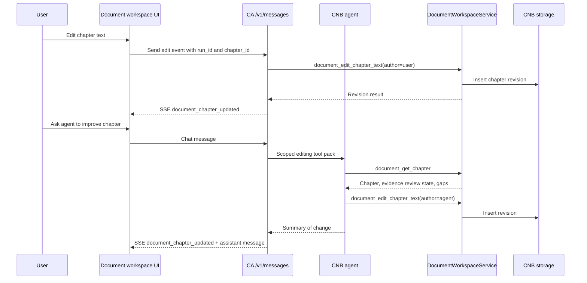
```mermaid
sequenceDiagram
    participant User
    participant UI as Document workspace UI
    participant CA as CA /v1/messages
    participant Agent as CNB agent
    participant Doc as DocumentWorkspaceService
    participant DB as CNB storage

    User->>UI: Edit chapter text
    UI->>CA: Send edit event with run_id and chapter_id
    CA->>Doc: document_edit_chapter_text(author=user)
    Doc->>DB: Insert chapter revision
    Doc-->>CA: Revision result
    CA-->>UI: SSE document_chapter_updated

    User->>UI: Ask agent to improve chapter
    UI->>CA: Chat message
    CA->>Agent: Scoped editing tool pack
    Agent->>Doc: document_get_chapter
    Doc-->>Agent: Chapter, evidence review state, gaps
    Agent->>Doc: document_edit_chapter_text(author=agent)
    Doc->>DB: Insert revision
    Agent-->>CA: Summary of change
    CA-->>UI: SSE document_chapter_updated + assistant message
```

## Chapter Validation

Validation is explicit and UI-driven. **Review & export** is available only
after an application template and at least one draft chapter are loaded. The UI
shows the missing prerequisite and links template failures back to Application
context without starting validation. Once available, the action opens a focused
modal before any export format is shown. It immediately reuses results whose
validated revision still matches the chapter, validates only missing or stale
chapters with bounded parallel requests, and offers an explicit full rerun.
Successful chapter results remain visible if another chapter fails, and retry
targets only the failed chapters. Chat does not expose a mark-ready tool. Each
request revalidates current CityCatalyst city access before reading or writing
the workspace.

The validator always runs two structured calls in order:

1. The completeness pass receives the full target body, resolved template
   schema and requirements, open target gaps, and target evidence-link metadata.
   It checks required content, template constraints, unresolved gaps, and
   evidence support.
2. The consistency pass receives the complete target again, the first-pass
   result, and every other active chapter. It checks names, dates, quantities,
   units, goals, timelines, dependencies, causality, internal logic, and
   target-involved cross-chapter conflicts. Large documents are split into
   complete non-target batches; the full target is repeated in every batch and
   findings are merged and deduplicated. Input is rejected rather than silently
   truncated.

After the structured passes, deterministic policy guardrails preserve recorded
gaps and explicit scope contradictions that must not depend on model recall. A
scope guard applies only when the target makes a strong affirmative claim that
includes current delivery work and another chapter explicitly excludes
completed, construction, or commissioning work (or the target states both
delivery and a late implementation state). Project names, route descriptions,
sustainability framing, generic references to an investment concept, and an
omitted future scope are not treated as contradictions.

The final fixed checks use `pass`, `warning`, or `fail`. Open
`missing_information`, `critical`, and `blocking` gaps, missing required
content, template violations, and material contradictions produce
`incomplete`. Evidence deficiencies and non-blocking ambiguity produce
`needs_review`. Only a result with no failures or warnings is `ready`. An empty
required chapter is deterministically persisted as `incomplete`; an empty
optional chapter remains visible as non-blocking missing information with
`needs_review`. Model, structured-output, or template-loading failures preserve
the previous validation and chapter status.

The draft contract nests validation under each chapter with status, stale flag,
validated revision/time, fixed checks, and findings. Findings include phase,
category, severity, actionable resolution, involved chapter IDs, and optional
excerpts. The guided modal first presents Missing information with evidence
warnings, then Conflicts & logic, and finally a decision step. The decision and
export screens use the same impact summary: validation blockers remain
unresolved in exported text, unanswered workspace prompts are omitted from the
file, and warnings stay in the workspace for follow-up. The user can jump from
a blocking finding to its chapter, review warnings again, or export anyway after
acknowledging omitted prompts. Symmetric document conflicts are deduplicated for
presentation while the per-chapter records remain intact. Saved findings also
remain visible under each chapter's Missing information area, with controls to
recheck the chapter, dismiss the card in that browser, or prefill an Ask Clima
request. Returning to fix blockers focuses the exact actionable finding.

## Chapter Delete Confirmation Flow

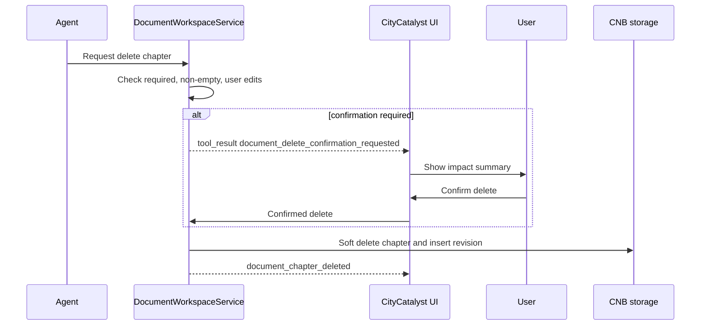
```mermaid
sequenceDiagram
    participant Agent
    participant Doc as DocumentWorkspaceService
    participant UI as CityCatalyst UI
    participant User
    participant DB as CNB storage

    Agent->>Doc: Request delete chapter
    Doc->>Doc: Check required, non-empty, user edits
    alt confirmation required
        Doc-->>UI: tool_result document_delete_confirmation_requested
        UI->>User: Show impact summary
        User->>UI: Confirm delete
        UI->>Doc: Confirmed delete
    end
    Doc->>DB: Soft delete chapter and insert revision
    Doc-->>UI: document_chapter_deleted
```

## Agent Tool Scoping

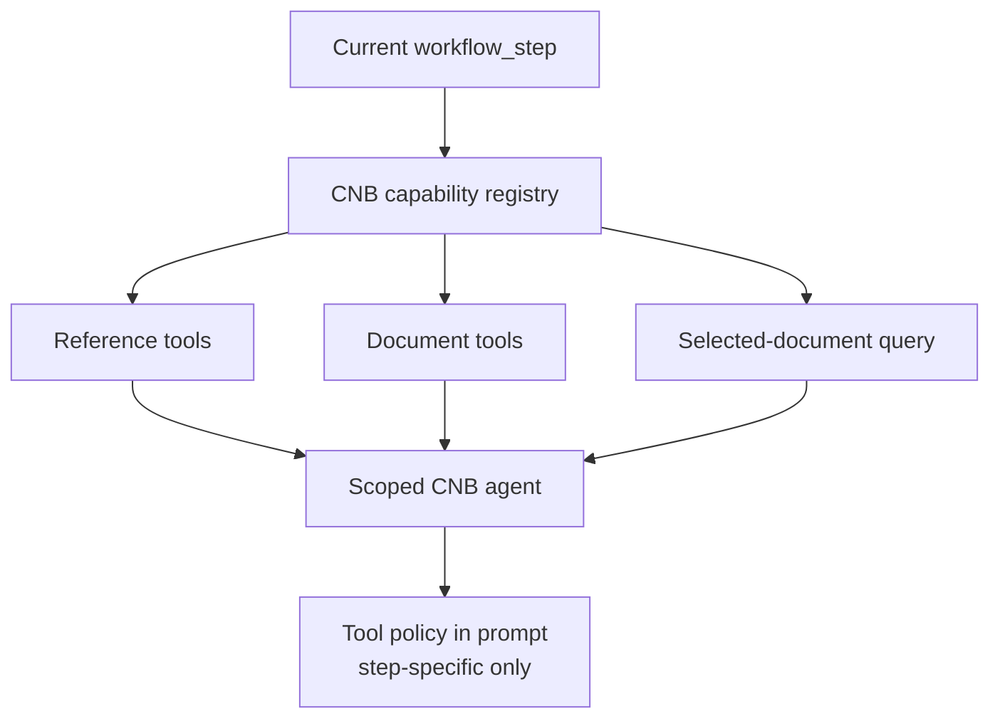
```mermaid
flowchart TB
    Step["Current workflow_step"] --> Registry["CNB capability registry"]
    Registry --> ReferenceTools["Reference tools"]
    Registry --> DocTools["Document tools"]
    Registry --> SourceQuery["Selected-document query"]

    ReferenceTools --> Agent["Scoped CNB agent"]
    DocTools --> Agent
    SourceQuery --> Agent

    Agent --> Rules["Tool policy in prompt<br/>step-specific only"]
```

Example registry rows:

| Capability id                              | Step                                                    | Operation | Writes                            | Confirmation               |
| ------------------------------------------ | ------------------------------------------------------- | --------- | --------------------------------- | -------------------------- |
| `concept_note.funder.get_profile`          | `profiling_funder`                                      | query     | no                                | no                         |
| `concept_note.sources.query`               | `interviewing`, `drafting_document`, `editing_document` | query     | no                                | no                         |
| `concept_note.document.add_chapter`        | `drafting_document`                                     | command   | CNB document                      | sometimes                  |
| `concept_note.document.delete_chapter`     | `editing_document`                                      | command   | CNB document                      | yes for non-empty/required |
| `concept_note.document.edit_text`          | `editing_document`                                      | command   | CNB revision                      | sometimes                  |
| `concept_note.document.link_evidence`      | `drafting_document`                                     | command   | CNB evidence links                | no                         |
| `concept_note.document.mark_chapter_ready` | `drafting_document`, `editing_document`                 | command   | CNB validation and chapter status | no                         |

Export preflight, DOCX generation, and PDF generation are button-triggered route
actions. They are not registered in the scoped agent tool registry.
Markdown receipt and bundle assembly are deterministic backend operations and
are excluded from the agent capability registry. Only the read-only selected
document query is registered for eligible CNB turns.
`similar_projects_search` is invoked internally by workflow orchestration and is
also excluded from the agent capability registry.

## Prompt Model

The configured prompt/model roles are:

```yaml
models:
  cnb_source_reader:
    name: openai/gpt-5.6-luna
    reasoning_effort: low
  cnb_source_synthesizer:
    name: openai/gpt-5.6-sol
    reasoning_effort: medium
  cnb_chapter_validator:
    name: openai/gpt-5.6-terra
    reasoning_effort: medium
prompts:
  cnb_source_document_mapping: "prompts/cnb/source_document_mapping.md"
  cnb_source_summary_synthesis: "prompts/cnb/source_summary_synthesis.md"
  cnb_source_question_reading: "prompts/cnb/source_question_reading.md"
  cnb_chapter_validation_completeness: "prompts/cnb/chapter_validation_completeness.md"
  cnb_chapter_validation_consistency: "prompts/cnb/chapter_validation_consistency.md"
```

The main CNB chat uses `models.agentic_flow` (`openai/gpt-5.6-sol`) with explicit
`reasoning_effort: none` for its Chat Completions function-tool loop. Funding
research and similar-project selection use Sol with medium reasoning on the
existing Responses API path; canonical-funder identity matching uses Luna with
low reasoning. Chapter drafting remains GPT-5.6 Terra with medium reasoning.

The validation prompt budget is 50,000 tokens. Completeness and consistency run
with temperature zero and strict structured contracts; only concise findings
are persisted, never model reasoning.

Prompt composition should follow the current CA pattern:

- General chat keeps using the default prompt.
- Active CNB context chat composes `prompts.core` with `prompts.cnb_chat`
  (`prompts/cnb/chat.md`), using the same `<additional_instructions>` wrapper as
  Stationary Energy review chat. It provides source-query guidance, evidence
  handling, and no-fabrication rules without granting document-mutation tools.
- Runtime context injection is separate from prompt-file composition. CNB bundle
  JSON and its unavailable-bundle marker use application-generated `user`-role
  data messages, not `system` messages. Retained `INTERNAL_TOOL_OUTPUT_JSON`
  messages are likewise projected to the user role for CNB only; live tool-call
  messages retain their protocol roles. The system prompt identifies these as
  untrusted evidence rather than user requests and retains the behavioral rules.
- Future chat-driven editing adds chapter-editing and approval rules separately;
  the current CNB chat must not claim that suggested wording was saved.

CNB context should be injected as a bounded JSON block:

```text
CONCEPT_NOTE_CONTEXT_BUNDLE_JSON
CURRENT_DOCUMENT_STATE_JSON
ACTIVE_WORKFLOW_STEP
UI_CONTEXT
```

## MLflow Interaction Names

Run logging uses explicit `MlflowClient` run IDs stored in a task-local context,
not MLflow's thread-local fluent active-run stack. All shared logging helpers and
run termination target that ID. Failed starts mask the enclosing target, queued
writes drain before closure, and exceptions/cancellation terminate only the
affected request. Trace metadata explicitly links to the source run through
`mlflow.sourceRun` and records session/user using MLflow 3.2 metadata keys.
CNB chat carries `prompt_name=cnb_chat` for the composed CNB workflow prompt.

All user-initiated CNB telemetry uses the `Clima` experiment and the visible
`workflow=CNB` tag. The durable CNB `run_id` remains a correlation tag; it must
not be embedded in `mlflow.runName`. The run name identifies the interaction
boundary with this stable, low-cardinality contract:

| CNB interaction | `mlflow.runName` | Integration boundary |
| --- | --- | --- |
| Start or idempotently replay a CNB run | `cnb_start` | `POST /v1/concept-notes/start` |
| Ask a non-mutating question in the CNB chat | `cnb_chat` | `/v1/messages` with an active `concept_note_run_id` |
| Answer, correct, skip, or retry missing information | `cnb_missing_information` | The run-scoped gap-resolution operation from CC-730 |
| Propose or apply a document edit through chat | `cnb_chat_edit` | The dedicated revision operation planned in CC-732 |

The future CC-732 flow must classify edit intent before opening its MLflow run:
ordinary questions remain `cnb_chat`, while a durable edit proposal or apply
operation uses `cnb_chat_edit`. More detailed actions belong in tags or spans so
dashboards can group the four interaction types without parsing dynamic names.

## SSE Events

The UI needs typed events for chat and document state.

| Event                                    | Purpose                                                                                        |
| ---------------------------------------- | ---------------------------------------------------------------------------------------------- |
| `concept_note_run_started`               | Run id and initial status.                                                                     |
| `concept_note_context_bundle_ready`      | Context bundle is ready. This generic readiness event does not expose matched-project details. |
| `document_chapter_added`                 | Chapter inserted.                                                                              |
| `document_chapter_deleted`               | Chapter soft-deleted.                                                                          |
| `document_chapter_restored`              | Chapter restored.                                                                              |
| `document_chapter_updated`               | New revision created.                                                                          |
| `document_gap_added`                     | Gap or blocker added.                                                                          |
| `document_evidence_linked`               | Evidence review link added.                                                                    |
| `document_delete_confirmation_requested` | UI must confirm delete.                                                                        |
| `document_edit_confirmation_requested`   | UI must confirm sensitive edit.                                                                |
| `concept_note_export_ready`              | DOCX or PDF export created.                                                                    |
| `concept_note_export_failed`             | Export failed with stable reason.                                                              |

## Export Pipeline

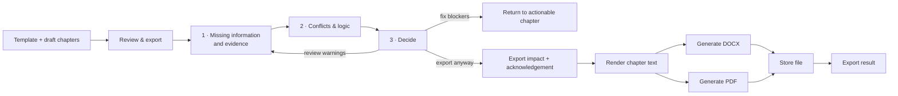
```mermaid
flowchart LR
    Gate["Template + draft chapters"] --> Trigger["Review & export"]
    Trigger --> Complete["1 · Missing information<br/>and evidence"]
    Complete --> Consistency["2 · Conflicts & logic"]
    Consistency --> Decide["3 · Decide"]
    Decide -->|fix blockers| Revise["Return to actionable chapter"]
    Decide -->|review warnings| Complete
    Decide -->|export anyway| Preflight["Export impact + acknowledgement"]
    Preflight --> Render["Render chapter text"]
    Render --> Docx["Generate DOCX"]
    Render --> Pdf["Generate PDF"]
    Docx --> Store["Store file"]
    Pdf --> Store
    Store --> Result["Export result"]
```

Export preflight should check:

- Required chapters present or intentionally skipped.
- Critical gaps resolved.
- Budget, partners, match funding, and commitments are confirmed or intentionally
  left blank.
- Custom chapters are allowed by the export mode.
- Deleted required chapters are represented in a preflight warning.

Export should include the final chapter text under a numbered chapter-heading
hierarchy. Evidence links, source labels, source locations, inline citations,
and endnotes are workspace review features only.

Validation is a required guided step before format selection, but its status
does not disable export. After viewing completeness and consistency findings,
the user can explicitly choose **Export as is**. Existing unresolved-information
acknowledgement remains authoritative for every validation state, including
Needs re-validation, `needs_review`, and `incomplete`.

## Planned Routes

### Climate Advisor

The status routes are for the UI and backend orchestration. Current run state
must still be injected into the agent context on every turn, not exposed as an
agent tool.

```text
POST /v1/concept-notes/start
GET  /v1/concept-notes?user_id={user_id}&city_id={city_id}
POST /v1/concept-notes/{run_id}/cc-context
GET  /v1/concept-notes/{run_id}
PATCH /v1/concept-notes/{run_id}
POST /v1/concept-notes/{run_id}/duplicate
DELETE /v1/concept-notes/{run_id}
GET  /v1/concept-notes/{run_id}/status
POST /v1/concept-notes/{run_id}/retry
POST /v1/concept-notes/{run_id}/context-bundle/retry
POST /v1/concept-notes/{run_id}/uploads/{upload_id}/markdown
GET  /v1/concept-notes/{run_id}/uploads/{upload_id}
POST /v1/concept-notes/{run_id}/matches/refresh
GET  /v1/concept-notes/{run_id}/document
POST /v1/concept-notes/{run_id}/chapters/{chapter_id}/validation
POST /v1/concept-notes/{run_id}/document/chapters
PATCH /v1/concept-notes/{run_id}/document/chapters/{chapter_id}
DELETE /v1/concept-notes/{run_id}/document/chapters/{chapter_id}
POST /v1/concept-notes/{run_id}/document/chapters/{chapter_id}/restore
POST /v1/concept-notes/{run_id}/export/preflight
POST /v1/concept-notes/{run_id}/export/docx
POST /v1/concept-notes/{run_id}/export/pdf
```

### CityCatalyst

```text
POST /api/v1/concept-notes/start
GET  /api/v1/concept-notes?city_id={city_id}
GET  /api/v1/concept-notes/{run_id}?city_id={city_id}
PATCH /api/v1/concept-notes/{run_id}?city_id={city_id}
POST /api/v1/concept-notes/{run_id}/duplicate?city_id={city_id}
DELETE /api/v1/concept-notes/{run_id}?city_id={city_id}
POST /api/v1/concept-notes/{run_id}/messages
POST /api/v1/concept-notes/{run_id}/chapters/{chapter_id}/validation
POST /api/v1/concept-notes/{run_id}/uploads
GET  /api/v1/concept-notes/{run_id}/uploads/{upload_id}
POST /api/v1/concept-notes/{run_id}/uploads/{upload_id}/retry
POST /api/v1/concept-notes/{run_id}/context-bundle/retry
GET  /api/v1/concept-notes/{run_id}/export/{export_id}

POST /api/v1/cron/process-pdf-ocr-jobs

POST /api/v1/internal/ca/capabilities/city/load-context
POST /api/v1/internal/ca/capabilities/project/load-context
POST /api/v1/internal/ca/capabilities/ghgi/inventory/list-accessible
POST /api/v1/internal/ca/capabilities/ghgi/inventory/status-overview
POST /api/v1/internal/ca/capabilities/ghgi/inventory/emissions-context
POST /api/v1/internal/ca/capabilities/ccra/summary
```

## Implementation Responsibilities

The implementation should stay organized by responsibility, not by a prescribed
file layout.

| Responsibility                | Owner                            | Boundary                                                                                                                                                                                                                                             |
| ----------------------------- | -------------------------------- | ---------------------------------------------------------------------------------------------------------------------------------------------------------------------------------------------------------------------------------------------------- |
| Chat thread/message storage   | CityCatalyst                     | Persists durable conversation state and supplies the authorized `thread_id` to the CNB workflow as a cross-database integration identifier.                                                                                                          |
| Workflow orchestration        | Climate Advisor                  | Starts/resumes runs, resolves active step, scopes tools, streams responses.                                                                                                                                                                          |
| CA workflow foundation        | Climate Advisor                  | The existing Alembic chain provisions and accesses `concept_note_runs`, `concept_note_context_bundles`, and `concept_note_uploads` through `CA_DATABASE_URL`.                                                                                        |
| CNB workspace schema/access   | Climate Advisor repository       | The independent CNB chain owns chapters, revisions, gaps, evidence links, latest validations, matches, and exports; externally operated infrastructure supplies `CNB_DATABASE_URL`.                                                                  |
| Funding reference access      | Climate Advisor repository       | The CNB chain owns the funder/reference schema; the importer writes reviewed projects/evidence and runtime matching reads the complete requested funder scope before bounded shortlist ranking. Curated data remains externally managed.             |
| Document tools                | Climate Advisor                  | Mutates draft document state through the CNB storage contract only.                                                                                                                                                                                  |
| Chapter validation            | Climate Advisor                  | Runs completeness before internal/document consistency, verifies the input fingerprint transactionally, and persists one latest result per chapter for the guided UI.                                                                                |
| Source and OCR result storage | CityCatalyst                     | Authenticates the user, stores source PDFs and authoritative Markdown in CC S3, and owns all source/result objects. CA receives only the stable Markdown key and immutable metadata, never bucket credentials, a source-PDF key, or a presigned URL. |
| PDF-to-Markdown execution     | CityCatalyst                     | Owns the PostgreSQL queue, authenticated processor endpoint, Mistral configuration and calls, retries, validation, result persistence, and pointer delivery.                                                                                         |
| CNB Markdown ingestion        | Climate Advisor                  | Verifies completed Markdown through CC and registers its key, digest, source locator metadata, and lifecycle status; CA stores no source bytes.                                                                                                      |
| Context-bundle assembly       | Climate Advisor                  | Re-fetches every ready upload, runs source-aware readers, attempts optional GHGI/HIAP, and persists guarded progress plus the typed bundle.                                                                                                          |
| CC context loading            | CityCatalyst                     | Provides bounded city, project, GHGI, CCRA, and read-only persisted HIAP summaries through internal capabilities; HIAP assembly never starts or repairs prioritization.                                                                              |
| CC bridge routes              | CityCatalyst                     | Authenticated browser-facing proxy into CA workflow routes.                                                                                                                                                                                          |
| Capability registry           | CityCatalyst and Climate Advisor | Defines step-scoped capability exposure; no flat tool bag.                                                                                                                                                                                           |
| UI workspace                  | CityCatalyst                     | Chat, chapter outline, editor, grouped validation findings, evidence/gap views, upload status, and always-available export controls.                                                                                                                 |

## Failure Handling

| Failure                        | User-visible behavior                                                              | System behavior                                                                                                                       |
| ------------------------------ | ---------------------------------------------------------------------------------- | ------------------------------------------------------------------------------------------------------------------------------------- |
| GHGI or HIAP unavailable       | Continue with the available context and show an optional-source warning.           | Persist the optional status and `null`; do not block bundle readiness.                                                                |
| No ready city source           | Start chat with available CityCatalyst context and show `Uploaded evidence: none`. | Complete with `document_grounding: none`, `source_documents` missing, and no selected sources.                                        |
| Source coverage/digest failure | Show that source analysis must be retried or the upload investigated.              | Reject readiness; persist a retryable guarded build failure and never keep partial summaries.                                         |
| Stale background build         | No user-visible regression.                                                        | Ignore the old build ID so it cannot replace a newer ready-upload fingerprint.                                                        |
| Interrupted background build   | Offer the existing context-bundle retry.                                           | A periodic database reconciler marks builds older than one hour failed with `context_bundle_build_interrupted` and `retryable: true`. |
| Funder profile missing         | Block drafting against a real template.                                            | Mark `profiling_funder` blocked.                                                                                                      |
| `cc_ocr_failed`                | Show that CC could not convert the specific source.                                | CC retains the source and failed OCR state; an explicit retry may enqueue another Mistral attempt. Nothing is delivered to CA.        |
| `ca_markdown_ingest_failed`    | Show that conversion succeeded but CNB could not ingest the Markdown yet.          | CC keeps the successful OCR result and retries delivery; CA may retry downstream processing without rerunning Mistral.                |
| `markdown_identity_conflict`   | Show that the immutable upload cannot be replaced.                                 | CA returns `409`; CC does not retry as a transient delivery failure or alter the successful OCR artifact.                             |
| Similar projects weak          | Continue but show caveat.                                                          | Persist match caveats.                                                                                                                |
| Chapter edit conflict          | Ask user to confirm current text.                                                  | Return structured conflict.                                                                                                           |
| Validation input changed       | Keep the prior result and ask the user to validate again.                          | Lock and re-fingerprint inputs; return `409 chapter_revision_changed` without an upsert.                                              |
| Validation model/parse failure | Keep the prior validation and chapter status.                                      | Return a stable validation error and persist no partial pass.                                                                         |
| Required chapter deleted       | Warn at export preflight.                                                          | Keep soft-deleted row and gap.                                                                                                        |
| Export failed                  | Show stable export error.                                                          | Persist failed export row with retry.                                                                                                 |

## Guardrails

- Do not fabricate budgets, partners, named commitments, eligibility rules, or
  award facts.
- Every factual chapter claim should link to a source, user confirmation, or
  CityCatalyst context snapshot.
- User-authored text is higher priority than model-generated text.
- Agent edits to user-locked chapters require confirmation.
- Required funder criteria must be represented as template requirements or gaps.
- Future scoring criteria must be curated and calibrated with NLC, not invented
  by the model.
- PDF conversion output is evidence input, not automatically trusted truth.

## Tests

Minimum test surface:

- Independent CNB migration upgrade, downgrade, re-upgrade, constraint/index,
  and cross-chain isolation tests against ephemeral PostgreSQL.
- Kubernetes contract tests proving CNB credentials come only from Secrets and
  both migration Jobs are launched before application rollout.
- Pydantic contracts for all CNB route payloads.
- CNB storage client and contract tests for run, chapter, revision, gap, and
  evidence behavior.
- Chapter add/delete/restore/reorder tests.
- Text edit conflict tests.
- User-locked chapter confirmation tests.
- Required chapter delete/export preflight tests.
- Source-link preservation tests when editing text.
- Matching tests for candidate retrieval, LLM decision output, fit rationale,
  evidence, and caveats.
- Markdown output fixtures covering multi-page order, table headers and
  alignment, units, years, totals, numeric values, and retained narrative.
- CC OCR tests covering upload authorization, durable job claims, lease recovery,
  three-attempt transient retries, ordered page merge, result persistence, and
  the 20 MB source-PDF upload limit.
- CC-to-CA pointer handoff contract tests covering authentication, digest
  verification, `202` durable registration, same-digest idempotency, and
  different-digest `409` conflicts.
- CNB city-context contract tests covering deterministic inventory selection,
  GPC I-V ordering, sector-local source states, five-source capping, missing and
  partial GHGI, immutable run/city binding, targeted bundle merging, cached
  reuse after live city-access revalidation, omission of HIAP by default,
  mitigation/adaptation grouping, selected-action preference, uncapped ranked
  fallback, and targeted GHGI/HIAP bundle merging.
- Failure tests distinguishing `cc_ocr_failed` from
  `ca_markdown_ingest_failed` and proving a delivery or downstream retry does not
  repeat successful OCR.
- Prompt/tool registration tests proving only the active step's tools are
  available.
- Strict validation pass-order, batching, aggregation, deduplication, stale
  projection, race, authorization, duplication, route, and structured-output
  tests.
- Rendered UI tests for sequential document validation, both guided review
  stages, actionable related-chapter findings, accessibility, add-information
  focus, acceptance, and explicit export-as-is behavior.

## Open Questions

- Which funder and instrument type are the first release target?
- Which exact DOCX template should be treated as authoritative, and should PDF
  render from that same document model?
- Are custom chapters allowed in the final funder document, or only as
  appendices/internal notes?
- What source license rules apply to the Minnesota funded-project corpus?
- Which matching weights are NLC-approved hard gates versus soft signals?
- For the selected cities, which GHGI years and sectors are available, what is
  missing, and which city-specific reports require mapping into the
  CityCatalyst/GPC structure?
- Should available risk assessments and GreenStep actions be transformed into
  the current CityCatalyst CCRA/action format, or remain source evidence that is
  summarized only inside the context bundle?
