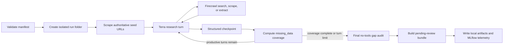

# Concept Note Builder Funder Research Pipeline

## Purpose

This document describes the implemented offline research pipeline for the
Concept Note Builder (CNB). One run researches one known funder and one known
funding opportunity, using Firecrawl for public-source retrieval and
`gpt-5.6-terra` with medium reasoning for source-grounded synthesis.

The workflow produces local, reviewable artifacts. It has no database tool and
does not publish or import research automatically.

## Implemented layout

```text
climate-advisor/
|-- prompts/
|   `-- cnb_funding_opportunity_research.md
|-- scripts/
|   `-- cnb_research/
|       |-- files/
|       |-- README.md
|       |-- research_funding_opportunity.py
|       |-- review.html
|       |-- review.css
|       `-- review.js
|-- service/app/
|   |-- models/cnb_research.py
|   |-- services/
|   |   |-- cnb_research_agent.py
|   |   |-- cnb_research_artifacts.py
|   |   |-- cnb_research_bundle.py
|   |   `-- cnb_research_service.py
|   `-- tools/firecrawl.py
`-- output/cnb_research/            # generated and gitignored
```

The CLI is intentionally thin. Reusable behavior is split into functions for
the agent loop, bundle conversion, provenance checks, artifact generation, and
run orchestration. Firecrawl is an application tool under `service/app/tools`,
not part of the script package.

## Input contract

The CLI accepts a JSON `FundingOpportunityResearchRequest`:

```json
{
  "funder_name": "Example Funder",
  "funder_url": "https://funder.example/",
  "program_name": "Example Climate Program",
  "program_url": "https://funder.example/program",
  "application_template_url": null,
  "current_filled_object": null,
  "max_turns": 15
}
```

The four seed identity fields are authoritative. A model-proposed replacement
is retained as a conflict while code restores the supplied seed.

`current_filled_object` may contain a previously validated
`FundingOpportunityResearchResult`. When it is absent, code creates a seed-only
object. This object is sent under the `current_filled_object` key on the first
turn and inside `<current_filled_object>` on later checkpoints.

## Runtime flow



The maximum model-turn count remains the execution boundary. The final model
turn has no tools, so it always returns the best available structured object.

## Coverage and turn awareness

The pipeline does not apply deterministic semantic judgments to researched
facts. It does compute structural coverage so an early partial model response
does not prematurely end the run.

Every model checkpoint receives:

- `<current_filled_object>`: the last validated structured result;
- `<missing_data>`: exact unresolved coverage priorities;
- `<turn_budget>`: current turn, maximum turns, and turns remaining;
- `<next_step>`: whether to deepen a funded project, complete required coverage,
  or perform the final audit.

Coverage targets include core funder/program fields, application-template
availability, eligibility and selection criteria, one official funded project,
one deeply linked project/action/funding chain, explicit financial-amount
meanings, authoritative guidance and project sources, and retained evidence.

A precise `ResearchGap` can satisfy a coverage target when public information
does not establish a value. This encourages investigation without forcing the
model to invent data.

`funder_country` is deliberately not a required coverage target. Multinational
and multilateral institutions may use `null`; the prompt explicitly says not to
substitute the headquarters country for institutional scope.

## Deep-project-first research

Before optional breadth, the prompt asks the agent to establish one strong
funded-project chain:

1. a named, officially documented funded project;
2. at least one concrete action linked to that project;
3. a funding relationship to the exact seeded program;
4. monetary facts and financing status when published;
5. field evidence pointing to captured Firecrawl snapshots.

For dense annual, portfolio, completion, or program reports, the agent is told
to run focused extractions for program scale, approvals and calendar years,
individual technical-assistance amounts, downstream investment amounts and
statuses, and the strongest named project. It should then follow that project
to an official project-specific source when available.

## Financial amount semantics

`financial_amounts` prevents unrelated figures from being flattened into one
ambiguous award field. Every record includes amount, currency, description,
timing/status, optional project/action links, and one explicit `amount_kind`:

- `program_capitalization`
- `portfolio_technical_assistance_total`
- `individual_technical_assistance`
- `requested_assistance`
- `identified_investment_longlist`
- `priority_investment_shortlist`
- `committed_financing`
- `disbursed_financing`
- `other`

The existing `funding_links` collection remains the relationship record between
the program, project, and action. The new collection describes what each
published monetary number actually means.

## Final gap audit

The last no-tools step checks award minima/maxima and currencies, criterion
weights and hard gates, selection timing/rates, co-financing, public application
templates, requested versus awarded amounts and calendar years, action-level
costs, downstream financing status, published pipeline status, and source
licenses. Unknowns remain null or empty and are recorded as precise gaps where
they matter to CNB coverage.

## Traceability and MLflow

Every bundle uses schema version `1.2` and contains code-owned run metadata.
All year-bearing funding links, financial amounts, and pipeline entries use one
optional integer `calendar_year`; fiscal-year labels are outside this contract.
The metadata includes:

- pipeline version;
- model and reasoning effort;
- SHA-256 of the exact prompt text;
- UTC start and completion timestamps;
- duration;
- maximum turns and turns used;
- termination reason;
- MLflow run ID when available.

Climate Advisor already contains a best-effort MLflow integration. The CNB CLI
now starts a run through it. When `MLFLOW_ENABLED=true`, OpenAI autologging,
parameters, coverage metrics, and redacted bundle/review/trace artifacts are
recorded in the configured experiment. Runs are tagged
`module=concept_note_builder` and
`workflow=cnb_funding_opportunity_research` for clear filtering. If MLflow is
disabled or unavailable, the same local run continues without telemetry.

## Local artifacts

Each run writes:

```text
output/cnb_research/<run_id>/
|-- research_bundle.json
|-- review.md
|-- agent_trace.jsonl
`-- sources/
    `-- <source_ref>.md
```

`research_bundle.json` is the only JSON artifact and the canonical
Pydantic-validated pending-review result. It embeds the authoritative request
and run metadata so reviewers do not have to choose between multiple JSON
files. The trace records seed scrapes, Firecrawl actions, structured
checkpoints, and the final audit. Source snapshots include their stable
reference, canonical URL, capture time, and content hash.

## Static review workspace

The static workspace at `scripts/cnb_research/review.html` reads a selected
`research_bundle.json` entirely in the browser. It renders top-level sections,
nested objects, and individual records as explicit `Expand`/`Collapse`
disclosures. A reviewer can edit every discovered leaf value and include or
exclude each value. The entire evidence-and-review panel remains hidden until a
field is selected, then reveals related evidence, gaps, conflicts, source links,
and review controls. Technical reference fields are hidden from the review
surface and visible counts but are preserved unchanged in
`reviewed_opportunity` so relationships remain intact.
Monetary inputs display thousands separators while parsing reviewer edits back
to numeric values for the saved update.

The page can be opened directly or served from `climate-advisor/`:

```powershell
uv run python -m http.server 8080
```

The served page is then available at
`http://localhost:8080/scripts/cnb_research/review.html`.

Saving downloads `<run_id>.review-update.json`. The update is separate from the
immutable research bundle and contains:

- update schema version and type;
- source run ID, bundle schema version, file name, bundle SHA-256 when browser
  crypto is available, model, and prompt SHA-256;
- review status, reviewer, timestamp, and notes;
- selected, excluded, and edited field counts;
- one auditable decision per field with original value, reviewed value, and
  evidence references;
- the selected edited values reconstructed as `reviewed_opportunity`.

The UI performs no network requests except when the reviewer chooses an
external source link. It has no application token, database dependency, or
database write capability.

## Running the pipeline

From `climate-advisor/`:

```powershell
uv run python -m scripts.cnb_research.research_funding_opportunity `
  --input scripts/cnb_research/files/solar_on_public_buildings.json `
  --output output/cnb_research
```

Required provider variables are `OPENAI_API_KEY` and `FIRECRAWL_API_KEY`.
MLflow uses the existing optional `MLFLOW_ENABLED`, `MLFLOW_TRACKING_URI`, and
`MLFLOW_EXPERIMENT_NAME` settings.

## Review boundary

Every generated bundle is `pending_review`, including a turn-limited partial
bundle. Evidence with an unknown source reference is converted into a gap.
Populated material fields without retained evidence are also surfaced as gaps.

### Future database save

Database persistence remains deliberately out of scope. When it is added, the
review UI should expose a separate `Save to database` action only after a local
update has been created and the reviewer explicitly confirms the write. That
action should send the review-update JSON to an authenticated Climate Advisor
or CityCatalyst endpoint. The server must revalidate the update schema, source
run and bundle version, selected paths, reviewer authorization, and referential
links before writing in one idempotent transaction. Database credentials and
direct table writes must remain server-side. No endpoint, button, or persistence
adapter is implemented in this version.
