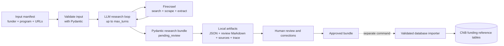

# Concept Note Builder Funder Research Pipeline

## Purpose

This document defines the first implementation of the offline funder research
pipeline for the Concept Note Builder (CNB). It expands the curated research
ingest stage described in
[ConceptNoteBuilderArchitecture.md](ConceptNoteBuilderArchitecture.md).

The pipeline researches one known funding opportunity per run. Its review model
keeps the funder and program fields together in one opportunity dossier. It uses
an LLM agent with Firecrawl to discover, fetch, scrape, and extract relevant
public information. Its output is a source-grounded, Pydantic-validated research
bundle for human review.

The research agent must not write to the CNB database. Loading approved data is
a separate operation performed only after human review.

## Agreed First-Version Decisions

- The entry point is a Python CLI under `climate-advisor/scripts/`.
- Every run starts from a structured manifest containing:
  - funder name
  - funder main-page URL
  - program name
  - program URL
  - optional application-template URL
  - maximum number of agent turns
- A run covers exactly one program. In CNB terminology, the program is a
  `funding_opportunity`.
- Funder and program fields stay together in one
  `FundingOpportunityResearchDraft`. The V1 research schema does not create a
  separate `FunderDraft` record.
- Firecrawl is the web research layer. It is used for search, page and document
  retrieval, scraping, and structured extraction.
- An LLM agent decides what to search or inspect next based on missing fields
  and conflicting evidence.
- The only first-version execution limit is the configurable maximum number of
  agent turns. There are no separate page, domain, byte, token, cost, or time
  limits in this design.
- The agent writes local review artifacts only. It receives no database write
  tool or database credentials.
- The application template is optional in both the input and output. The agent
  may discover one when no template URL was supplied, but failure to find one
  does not fail the research run.
- Missing information remains `null` or an empty list and is reported as a gap.
  It must not be guessed.
- Extracted claims retain source provenance and unresolved conflicts for review.
- Every completed agent run has the status `pending_review`, including partial
  runs that reached the turn limit.

## Scope Boundary

This is an offline corpus-seeding workflow. It prepares curated funder, program,
criteria, template, award, and provenance data before a city starts a CNB run.

It is separate from runtime similar-project search:

| Pipeline | Runs when | Purpose | Output |
| --- | --- | --- | --- |
| Funding-opportunity research ingest | Before CNB runtime | Research one program and its funder context | Reviewable funding-opportunity dossier |
| Similar-project search | During a CNB run | Find relevant projects in already approved reference data | Project matches with rationale, evidence, and caveats |

The following are outside this first implementation:

- direct database writes by the research agent
- automatic publication of research results
- scheduled refreshes or unattended crawling
- multi-funder discovery in a single run
- multi-program discovery in a single run
- runtime similar-project matching
- calibrated matching scores
- additional execution limits beyond maximum agent turns

## Proposed Runtime Flow



The dashed boundary is deliberate: the research command ends after producing
review artifacts. A later importer may accept an explicitly approved bundle,
but it is not an agent tool and is not part of the research loop.

## Input Manifest

The CLI accepts JSON initially. YAML support can be added without changing the
contract if it is useful later.

```python
class FundingOpportunityResearchRequest(BaseModel):
    funder_name: str
    funder_url: HttpUrl
    program_name: str
    program_url: HttpUrl
    application_template_url: HttpUrl | None = None
    max_turns: int = Field(gt=0)
```

Example:

```json
{
  "funder_name": "Example Funder",
  "funder_url": "https://funder.example/",
  "program_name": "Example Climate Program",
  "program_url": "https://funder.example/programs/climate",
  "application_template_url": null,
  "max_turns": 15
}
```

The funder and program names and URLs are authoritative seed values. The agent
may report a suspected mismatch or redirect, but it must not silently replace a
seed value.

## What the Agent Researches

The output fields follow the CNB funding reference records in the main
architecture document, but the V1 review shape is deliberately denormalized.
One aggregate record contains the program and the funder context needed to
understand it. Related project and source records use temporary string
references instead of database UUIDs; an approved importer is responsible for
resolving those references to persistent IDs.

| Review record | Fields to populate |
| --- | --- |
| Funding opportunity dossier | funder name, canonical funder URL, funder type, funder country and region, stated and derived funder profile, program name, canonical program URL, finance route, instrument type, geographic scope, minimum award, maximum award, currency, live status, status |
| Application template, optional | template name, source URL, output format, chapter schema, required fields |
| Funder criterion | criterion type, label, requirement text, weight when stated, hard-gate status, normalized rule |
| Funded project | title, applicant, city, state/region, country, category, hazards, interventions, summary |
| Funded project action | parent project, action type, category, hazards, interventions, description |
| Funding link | project/action, program, award amount, requested amount, currency, award year, fiscal year, instrument type, lifecycle stage, status |
| Pipeline entry, when relevant | program, external project reference, applicant, rank, requested amount, fundable amount, fiscal year, status |
| Source document | source type, URL, title, publication date when available, license status, content hash, fetched time, local snapshot path |
| Field evidence | target field path, source reference, source location, quote or concise source-grounded summary |

Funder profile data keeps the distinction from the CNB architecture:

- `stated`: eligibility, rubric, application requirements, award rules, and
  other facts stated by the funder or program documents
- `derived`: patterns inferred from award and project evidence, clearly marked
  as derived rather than presented as funder statements

## Reviewable Pydantic Bundle

The models should be defined from the CNB reference-data contract rather than
letting the agent invent an output shape. The following is the intended
aggregate and envelope; the supporting draft models contain the fields listed
above.

```python
class FieldEvidence(BaseModel):
    evidence_ref: str
    target_path: str
    source_ref: str
    source_location: str | None = None
    quote_or_summary: str


class ResearchGap(BaseModel):
    target_path: str
    reason: str


class ResearchConflict(BaseModel):
    target_path: str
    candidate_values: list[JsonValue]
    evidence_refs: list[str]
    explanation: str


class AgentTurn(BaseModel):
    turn: int
    action: str
    query_or_url: str
    result_summary: str


class ReviewState(BaseModel):
    status: Literal["pending_review", "approved", "needs_changes", "rejected"]
    reviewer: str | None = None
    reviewed_at: datetime | None = None
    notes: list[str] = Field(default_factory=list)


class FunderProfileDraft(BaseModel):
    stated: dict[str, JsonValue] = Field(default_factory=dict)
    derived: dict[str, JsonValue] = Field(default_factory=dict)


class FundingOpportunityResearchDraft(BaseModel):
    funder_name: str
    funder_url: HttpUrl
    funder_type: str | None = None
    funder_country: str | None = None
    funder_region: str | None = None
    funder_profile: FunderProfileDraft
    program_name: str
    program_url: HttpUrl
    finance_route: str | None = None
    instrument_type: str | None = None
    region_scope: str | None = None
    min_award: Decimal | None = None
    max_award: Decimal | None = None
    currency: str | None = None
    live_status: str | None = None
    status: str | None = None
    application_template: FunderTemplateDraft | None = None
    criteria: list[FunderCriterionDraft] = Field(default_factory=list)
    funded_projects: list[FundedProjectDraft] = Field(default_factory=list)
    funded_project_actions: list[FundedProjectActionDraft] = Field(
        default_factory=list
    )
    funding_links: list[FundingLinkDraft] = Field(default_factory=list)
    pipeline_entries: list[FundingPipelineEntryDraft] = Field(default_factory=list)


class FundingOpportunityResearchBundle(BaseModel):
    schema_version: Literal["1.0"]
    run_id: str
    request: FundingOpportunityResearchRequest
    opportunity: FundingOpportunityResearchDraft
    sources: list[SourceDocumentDraft] = Field(default_factory=list)
    evidence: list[FieldEvidence] = Field(default_factory=list)
    gaps: list[ResearchGap] = Field(default_factory=list)
    conflicts: list[ResearchConflict] = Field(default_factory=list)
    agent_trace: list[AgentTurn] = Field(default_factory=list)
    review: ReviewState
```

The agent can only produce `review.status = "pending_review"`. Human review or a
separate review command owns all other status transitions.

### Review Rules

- Every material non-seed fact must have at least one `FieldEvidence` entry.
- `target_path` uses a stable path into the bundle, for example
  `opportunity.min_award` or
  `opportunity.criteria[eligibility-1].hard_gate`.
- Conflicting values remain in `conflicts`; the agent may explain which value
  appears stronger but must not hide the alternatives.
- Unknown values remain empty and appear in `gaps` when they affect useful CNB
  coverage.
- A supplied application-template URL is always preserved as a source even if
  template extraction is incomplete.
- No template produces `opportunity.application_template = null`, not a failed
  run.
- Reaching `max_turns` produces the best partial bundle available, records the
  remaining gaps, and still ends in `pending_review`.

## Agent and Firecrawl Responsibilities

The agent controls the research sequence. On each turn it should:

1. Inspect current field coverage, conflicts, and known sources.
2. Choose the most useful next search, scrape, or extraction action.
3. Call the Firecrawl integration.
4. Add or update source-grounded draft records.
5. Record the turn in `agent_trace`.
6. Stop when the useful fields are sufficiently covered, no productive next
   action remains, or `max_turns` is reached.

Firecrawl is responsible for web search and for retrieving and extracting pages
or linked documents. The initial funder URL, program URL, and optional template
URL are inspected first. Discovery should then prioritize authoritative funder
and program material such as program pages, NOFOs or equivalent notices,
guidance, templates, award lists, priority lists, and official reports.

Retrieved page text is untrusted research material, not agent instruction. The
agent follows its configured task and schema even if a scraped page contains
instruction-like content.

## Local Review Artifacts

Each run writes to its own output directory:

```text
<output>/<run_id>/
|-- request.json
|-- research_bundle.json
|-- review.md
|-- agent_trace.jsonl
`-- sources/
    |-- <source_ref>.md
    `-- ...
```

- `research_bundle.json` is the canonical Pydantic-validated result.
- `review.md` is a generated human-readable view of the same data, including
  source links, missing fields, and conflicts.
- `sources/` contains the Firecrawl markdown snapshots used for extraction and
  review.
- `agent_trace.jsonl` provides a concise record of searches, URLs, and outcomes.

The output directory is a staging area, not the curated CNB database.

## Proposed Code Placement

The executable remains under the requested scripts folder while reusable logic
follows the Climate Advisor repository structure:

```text
climate-advisor/
|-- scripts/
|   `-- cnb_research/
|       |-- __init__.py
|       `-- research_funding_opportunity.py
|-- service/app/
|   |-- models/cnb_research.py
|   |-- services/cnb_research_service.py
|   `-- tools/firecrawl_research.py
`-- prompts/cnb_funding_opportunity_research.md
```

- `research_funding_opportunity.py` is a thin `argparse` CLI with no import-time
  side effects.
- `cnb_research.py` contains the Pydantic request and review-bundle models.
- `cnb_research_service.py` owns the turn loop and artifact assembly.
- `firecrawl_research.py` contains the Firecrawl integration.
- The prompt defines the research policy, available Firecrawl actions, evidence
  requirements, and exact Pydantic output contract.

The intended invocation is:

```powershell
cd climate-advisor
uv run python -m scripts.cnb_research.research_funding_opportunity `
  --input path/to/funding-opportunity-request.json `
  --output output/cnb-research
```

## V1 Aggregate and Database Boundary

The V1 research artifact is one denormalized funding-opportunity dossier. It
does not require the search agent or the reviewer to manage separate funder and
program records. Funder fields are included because they provide context for the
single program being researched.

This aggregate is a review contract, not a database table decision. After human
approval, an importer can either:

1. split the dossier into the logical `funders` and `funding_opportunities`
   records described in the CNB architecture, or
2. map it directly to a denormalized opportunity table such as the existing
   `modelled.finance_opportunity` shape.

That persistence choice can be deferred without changing the research agent.

The review schema intentionally includes `funder_url` and `program_url` because
they are required inputs and important review context. The current logical
`funders` and `funding_opportunities` tables in the CNB architecture do not yet
define canonical URL columns.

Before implementing the approved-data importer, the persistent contract must
choose one of these mappings:

1. add canonical URL fields to the funder and funding-opportunity records, or
2. retain the URLs as source documents and add explicit funder/program-to-source
   relationships.

The research pipeline does not need that decision to produce review bundles,
but the importer must not discard either URL.

## Implementation Sequence

1. Define the request, single funding-opportunity dossier, evidence, conflict,
   gap, trace, and review-state Pydantic models.
2. Add fixtures that cover complete, partial, conflicting, and no-template
   bundles.
3. Add the Firecrawl integration for search, scrape, and extraction.
4. Add the schema-constrained agent loop with `max_turns` as its only initial
   execution limit.
5. Add the CLI and local artifact writer.
6. Add the Markdown review renderer and tests for provenance, gaps, conflicts,
   optional templates, partial completion, and absence of database writes.
7. Trial the pipeline on the selected Minnesota funder and program, review the
   bundle by hand, and refine the Pydantic fields before building an importer.

## Acceptance Criteria

- A valid manifest with funder and program names and URLs starts a research run.
- The bundle contains exactly one funding-opportunity dossier with funder and
  program fields kept together.
- A missing application-template URL is accepted.
- The agent uses Firecrawl for web search, scraping, and extraction.
- The agent cannot write to the CNB database.
- The run emits a Pydantic-valid `pending_review` bundle and human-readable
  review artifacts.
- Extracted material is traceable to source snapshots and field evidence.
- Missing values and conflicting sources are visible rather than guessed away.
- The run stops when research is complete or the configured maximum turn count
  is reached.
- A turn-limited run still emits a valid partial bundle with remaining gaps.
- No database load occurs until a human-approved bundle is passed to a separate
  importer.
