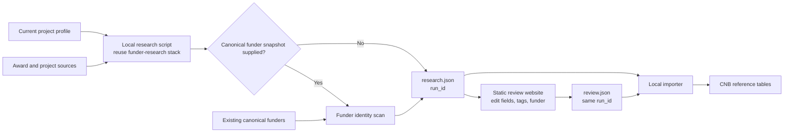
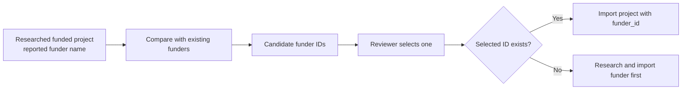
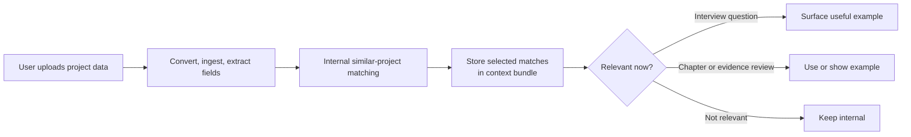
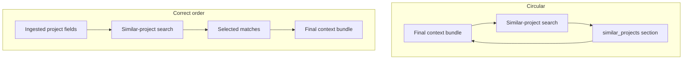
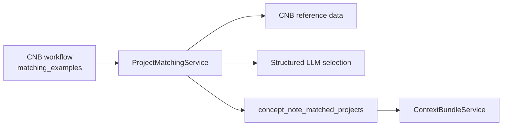

# Concept Note Builder Similar Project Search Plan

## Goal

Implement CC-512 so Concept Note Builder can:

- find comparable funded projects;
- explain why each example is relevant;
- retain evidence and caveats;
- add selected examples to the internal context bundle; and
- surface an example only when it helps the current interview or document.

Source of truth:

- [ConceptNoteBuilderArchitecture.md](ConceptNoteBuilderArchitecture.md)
- [AgenticModuleScope.md](AgenticModuleScope.md)

## Decisions

| Topic | V1 decision |
| --- | --- |
| Research mechanism | Reuse the existing local funder-research pipeline and static review website. |
| Search target | Every funded-project discovery run requires the current project profile and uses it to guide queries and project prioritization. |
| Funder snapshot | Optional during discovery; required only when resolving canonical funder IDs for review and import. |
| Research/review pairing | Pair the two JSON files by the same `run_id`; no SHA check. |
| Funder link | Every imported funded project requires one reviewer-selected canonical `funder_id`. |
| Opportunity link | Funded projects do not need an opportunity-record relationship for matching. |
| Tags | Add reviewer-curated `project_tags` directly to funded-project records. |
| Runtime trigger | Match only after the user's project upload has been ingested. |
| Tool exposure | `similar_projects_search` is internal workflow logic, not an agent tool. |
| User exposure | Store matches internally; surface them only when relevant. |
| Scoring | No calibrated numeric score, model-created tags, weights, or thresholds. |
| Missing examples | Continue the CNB workflow with a caveat. |

## 1. Prepare the Curated Project Corpus



### Reuse from the funder pipeline

- Firecrawl source capture.
- Research agent loop.
- Structured-output and model configuration.
- Evidence, gap, conflict, and source handling.
- Local artifact conventions.
- MLflow helpers.
- Static review website.

Do not introduce a separate shared-primitives layer.

### Discovery input contract

- `research_funded_projects.py` always requires `--project` with the current
  ingested project fields.
- The project JSON must contain at least one substantive search signal such as
  a name, summary, sector, location, intervention, hazard, or curated tag;
  metadata-only input is rejected.
- The project profile is embedded in every single or batch research request and
  must guide source queries and the prioritization of funded-project examples.
- `--funders` is optional. When omitted, discovery still writes
  `<run_id>.research.json`; funded-project rows retain their source-reported
  funder names but have no canonical-funder candidates yet.
- Supplying a canonical-funder snapshot enriches the same research output with
  possible IDs. It must never narrow the discovery scope or auto-select an ID.
- A real canonical-funder export is required before approved import, not before
  source discovery.

### Pair the JSON files

```text
<run_id>.research.json  -> { "run_id": "..." }
<run_id>.review.json    -> { "run_id": "..." }
```

Importer rule:

```text
research.run_id must equal review.run_id
```

- Reject mismatched IDs.
- Do not use a SHA or content comparison for pairing.
- The research agent and browser review page never write to the database.
- Only the local importer writes reviewed reference data.

## 2. Resolve the Canonical Funder



For every funded project:

1. Record the funder name reported by the source.
2. Scan the existing `funders` table for possible matches.
3. Put candidate IDs and short match reasons in the research JSON.
4. Require the reviewer to select exactly one `funder_id`.
5. Never let the scan assign the final ID automatically.
6. Reject import when the selected ID is missing or unknown.
7. If no funder exists, run that funder through the same research/review/import flow first.

Review shape:

```json
{
  "reported_funder_name": "Minnesota Pollution Control Agency",
  "candidate_funders": [
    {
      "funder_id": "uuid",
      "name": "Minnesota Pollution Control Agency",
      "match_reason": "Exact name and region match"
    }
  ],
  "selected_funder_id": null
}
```

## 3. Reference Data Contract

### Funded project

Store opportunities and funded projects in `funding_records`.

| Field group | Required behavior |
| --- | --- |
| Identity | `funding_record_id`, required canonical `funder_id`, `is_opportunity=false` |
| Project | name, applicant, city, region, country, summary |
| Matching | category, hazards, interventions, finance route, instrument type |
| Award | amount, currency, year, status |
| Tags | reviewer-curated `project_tags` JSONB |

Rules:

- Keep award information and interventions on the funded-project row.
- Do not attach templates or criteria to funded-project rows.
- Keep missing values null or empty.
- Do not infer unsupported facts.
- Let the persistence layer assign database UUIDs.
- Local research may use stable `_ref` identifiers before import.

### Evidence

Each candidate shown to the user retains:

- `funding_record_id`;
- source reference;
- claim or summary;
- source location when available; and
- the existing source provenance produced by the research pipeline.

### Curated tags

V1 tag groups:

- sector;
- hazard;
- intervention type;
- finance route;
- applicant type;
- geography;
- beneficiary group; and
- implementation stage.

Rules:

- Add `project_tags` to the existing schema 2.0 funded-project research model.
- Show and edit the tags in the static review website.
- Import tags only after human review.
- Apply the same normalization rules to the user project and candidates.
- The matching model may compare tags but may not create tags or weights.
- No vocabulary-version field is required.

## 4. Runtime Matching

### Trigger and visibility



- Do not start matching when the run is merely created.
- Wait for at least one user project upload to finish ingestion.
- Use the extracted current project fields.
- Refresh internally after a later upload changes those fields.
- Emit only the generic `concept_note_context_bundle_ready` event.
- Do not show a standalone matched-project result panel.

### Why the final context bundle is not the matcher input



- The final bundle contains `similar_projects`.
- Matching produces `similar_projects`.
- Making the final bundle a required matching input makes each wait for the other.
- Read the ingested project fields directly, match, then complete the bundle.
- Do not create a separate persisted target-profile object.

### Matching input

```json
{
  "run_id": "uuid",
  "funder_scope": "cross_funder",
  "category": "stormwater",
  "region": "MN",
  "instrument_type": "grant",
  "hazards": ["flood", "heat"],
  "project_tags": ["stormwater", "flood", "green-infrastructure", "city-led"],
  "limit": 10
}
```

Current project fields may include:

- selected canonical funder, required only for `same_funder` matching;
- matching scope: `same_funder` by default or explicit `cross_funder` discovery,
  which may omit the current project's `funder_id`;
- category and sector;
- region;
- finance route and instrument type;
- hazards and interventions;
- applicant type;
- curated tags; and
- known gaps.

### Candidate rules

Return only records that:

- have `is_opportunity=false`;
- have a valid canonical `funder_id`;
- belong to the selected canonical funder when `funder_scope=\"same_funder\"`;
- represent a funded award; and
- retain usable evidence.

`cross_funder` is an explicit broad-discovery mode. It may return reviewed
awards from multiple canonical funders, but every candidate keeps its real
`funder_id` and funder display name. It does not relax the funded-award or
evidence gates.

Use structured fields to bound an excessive candidate set. Unknown fields create caveats rather than silent exclusion.

### Selection rules

1. Normalize the project and candidate tags.
2. Build a bounded shortlist using structured fields and tag overlap.
3. Give the LLM only the current project fields, shortlisted candidates, evidence, and curated tags.
4. Require structured selected/rejected decisions.
5. Reject invented project IDs, tags, facts, weights, or evidence.
6. Return rationale, matched tags, evidence references, and caveats.
7. Do not return a calibrated numeric score.

### Match result

```json
{
  "matches": [
    {
      "funding_record_id": "uuid",
      "decision": "selected",
      "fit_rationale": "Comparable city-led flood resilience project.",
      "matched_tags": ["stormwater", "flood", "city-led"],
      "evidence": [],
      "caveats": []
    }
  ]
}
```

### Persistence

`concept_note_matched_projects`:

| Field | Type |
| --- | --- |
| `match_id` | UUID |
| `run_id` | UUID |
| `funding_record_id` | UUID |
| `decision` | string |
| `fit_rationale` | text |
| `matched_tags` | JSONB |
| `evidence` | JSONB |
| `caveats` | JSONB |

- Store selected matches against the active run.
- Rebuild only `context_bundle.similar_projects`.
- Preserve all other context-bundle sections.
- No extra matching audit/version tables are required.

## 5. Internal Service Boundary



- `similar_projects_search` is internal workflow logic.
- It is not a conversational agent tool.
- It is not added to the agent capability registry.
- Candidate retrieval and selection remain invisible to the user.

## 6. Implementation Changes

| Path | Change |
| --- | --- |
| `service/app/models/cnb_research.py` | Add reviewed `project_tags` and optional target-project context to funded-project research records. |
| `service/app/services/cnb_funder_identity_match.py` | Propose existing canonical funders for each researched project. |
| `scripts/cnb_research/research_funded_projects.py` | Require `--project`, accept optional `--funders`, and produce `<run_id>.research.json`. |
| `scripts/cnb_research/review.html` | Review fields, evidence, tags, and canonical funder; save `<run_id>.review.json`. |
| `scripts/cnb_research/import_reviewed_reference_data.py` | Pair files by `run_id`, validate `funder_id`, and import reviewed data. |
| `service/app/models/cnb_similar_projects.py` | Shared project profile plus runtime candidate, evidence, match, and result models; require a funder only for `same_funder`. |
| `service/app/services/cnb_similar_project_search.py` | Internal retrieval, shortlist, LLM selection, and match persistence. |
| `service/app/services/cnb_project_tag_normalizer.py` | Deterministic tag normalization. |
| `service/app/services/cnb_reference_data_client.py` | Typed reference-data reads. |
| `prompts/cnb_similar_project_matching.md` | Structured selection and no-fabrication rules. |

## 7. Delivery

### Phase 0 — Dependency

- Merge the schema 2.0 funder-research implementation.
- Update CC-512 from `develop`.
- Keep the CC-512 pull request scoped to similar-project work.
- Add `project_tags` to research records and the review UI.

### Phase 1 — Research and review

- Load the required current project profile.
- Research relevant funded projects with the existing pipeline.
- Optionally load the existing canonical funder list and run identity matching.
- Write `<run_id>.research.json`.
- Review project fields, evidence, tags, and funder selection.
- Write `<run_id>.review.json` with the same `run_id`.

### Phase 2 — Import

- Pair the files by `run_id`.
- Reject mismatched IDs.
- Reject missing or unknown `funder_id` values.
- Import projects, sources, evidence, and tags.
- If necessary, research and import the missing funder first.

### Phase 3 — Runtime matching

- Wait for project-upload ingestion.
- Read current project fields and curated candidates using the requested funder scope.
- Normalize tags and shortlist candidates.
- Run structured LLM selection.
- Persist selected matches.
- Rebuild the matching section of the context bundle.
- Keep results internal until relevant.

## 8. Verification

### Must prove

- The discovery CLI rejects a missing project profile.
- Discovery succeeds without a canonical-funder snapshot and still preserves
  source-reported funder names.
- The current project profile is present in the model input and persisted run
  request, rather than being command-line metadata only.
- Research and review JSON files pair by `run_id` without SHA.
- The importer rejects mismatched run IDs.
- The importer rejects missing or unknown funders.
- The funder scan proposes but never auto-selects a funder.
- Opportunity rows never become candidates.
- Tags are reviewed and normalized deterministically.
- Matching waits for project-upload ingestion.
- Invented IDs, tags, facts, and evidence are rejected.
- Empty or weak matches do not block CNB.
- Match completion stays internal.
- Relevant matches can be used in an interview or chapter.
- No numeric score appears in V1.

### Smoke path

```text
load current project
-> research relevant funded projects across the configured award sources
-> review JSON
-> select canonical funder and tags
-> import
-> upload user project
-> ingest
-> internal match
-> context bundle ready
-> surface example only when relevant
```

## Open Decisions

- Confirm the datateam reference API endpoint and filtering contract.
- Confirm how many selected examples enter the context bundle.
