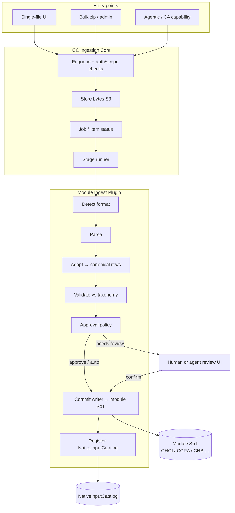
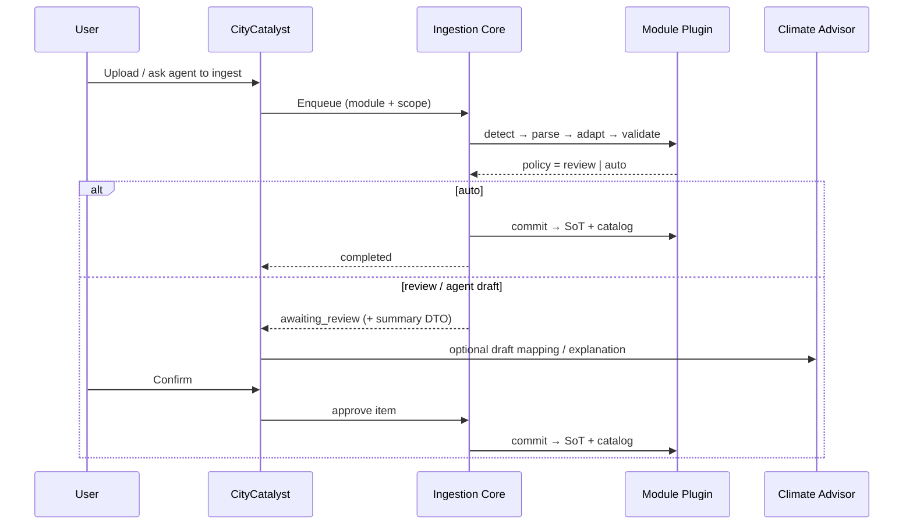

# Generic File Ingestion Architecture

> **Status:** draft for stakeholder review · 2026-09-21  
> **Companion docs:** [NativeDocumentStorageArchitecture](./NativeDocumentStorageArchitecture.md) · [AgenticModuleScope](./AgenticModuleScope.md) · [ConceptNoteBuilderArchitecture](./ConceptNoteBuilderArchitecture.md) · [CCRAModuleArchitecture](./CCRAModuleArchitecture.md) · GHGI bulk tickets (`app/docs/BULK_INVENTORY_FILE_IMPORT_TICKETS.md`)

## One-line intent

CityCatalyst gets a **shared file ingestion spine** — upload, store, detect, parse, map, validate, review/auto-approve, commit — that **modules plug into** with their own formats and taxonomies, so GHGI, CCRA, CNB, and future modules do not each reinvent ingestion.

---

## Problem

File upload today is **module-shaped glue**, not a platform capability:

| Surface | What exists | Limitation |
| --- | --- | --- |
| GHGI single-city wizard | Validate → parse → Path A eCRF / Adapter D / AI Path B → human approve → `InventoryImportService` | Inventory-scoped only; interactive |
| GHGI bulk (CC-878) | Zip → match city/year → classify → auto-approve eCRF/near-eCRF → worker | GHGI-only job tables; rejects non-eCRF |
| CNB / agentic | Upload → OCR / Markdown → native pointer → agent workflow → user-gated commit | Document Path B, not structured domain rows |
| CCRA | Dashboard + Global API sync proposal | No city-file ingest story yet |
| NativeInputCatalog | Discovery pointers after durable commit | Not an ingest pipeline |

As more modules accept city-provided files (risk workbooks, resilience scorecards, CAP PDFs, etc.), repeating this stack per module will diverge on status models, S3 keys, approval rules, and “what is valid CityCatalyst data?”

---

## Goal

Define an architecture where:

1. **CC Core** owns the shared ingestion lifecycle (bytes, jobs, stages, errors, auth/tenancy hooks).
2. **Modules** own format detectors, adapters, target taxonomies, and writers into their **system of record (SoT)**.
3. Output of a successful ingest is always data that **matches the module’s CityCatalyst schema/taxonomy** — never raw vendor spreadsheets as product state.
4. The same spine serves **UI upload**, **admin/bulk zip**, and **agentic** flows (draft → confirm → commit).
5. After commit, modules **register** discoverable pointers in `NativeInputCatalog` (existing contract).

### Non-goals

- One mega-table that stores every module’s domain rows.
- Replacing module SoTs (GHGI activities, CCRA scores, CNB chapters, etc.).
- Forcing every format through LLM interpretation.
- Giving Climate Advisor S3 keys or file SoT ownership.
- Rewriting GHGI bulk from scratch in v1 of this architecture (see Migration).

---

## Current patterns to preserve

### Shared lessons from GHGI

```text
bytes → FileValidatorService → FileParserService
      → (Path A ECRF | FormatAdapter D near-ecrf | AI interpret)
      → review / auto-approve policy
      → InventoryImportService.importECRFData (canonical commit)
      → optional NativeInputCatalog registration
```

Bulk (CC-878) proved:

- **Batch is orchestration**, not a second importer — `InventoryFileAutoImportService` reuses the same classify → adapt → commit path as the wizard’s happy path.
- **Deterministic formats auto-approve**; formats that need OpenAI fail bulk items (`not_ecrf`) instead of inventing mappings silently.
- **Negative / edge semantics** belong in the shared parser/writer (IMP-013), not in a bulk-only fork.

### Lessons from NativeInputCatalog + CNB

- **Owner = module** of upload/commit; catalog is a **lookup**, not the SoT.
- **Path A** = structured JSON from module SoT; **Path B** = file/markdown read via CC core.
- Agentic workflows prepare drafts and **wait for explicit confirmation** before product writes ([AgenticModuleScope](./AgenticModuleScope.md)).

---

## Desired end state

### Stack

1. **Ingestion Core** — job/item model, S3 storage helpers, stage runner, error taxonomy, dry-run.
2. **Module Ingest Plugins** — registered per product module (`ghgi`, `ccra`, `cnb`, …).
3. **Entry points** — single-file API, bulk zip API, internal capability for agents — all call the same runner.
4. **Commit** — plugin writer persists to module SoT; plugin registers catalog pointer when durable.
5. **Consumers** — UI status, agent status/report, dashboards read SoT (and catalog for discovery).



---

## Core vs module ownership

| Concern | Owner | Notes |
| --- | --- | --- |
| Multipart / zip limits, path traversal, `__MACOSX` skip | Core | Same limits family as bulk GHGI (e.g. 20 MiB/file, zip caps) |
| S3 key layout `ingest/{module}/{jobId}/…` | Core | Modules do not invent bucket layouts |
| Job + item status, counts, dry-run, cancel | Core | Generalized from `BulkInventoryImportJob/Item` |
| Auth, org freeze, module access, city/project scope | Core + existing Permission/Module services | Plugin declares required scope shape |
| Format detection / adapters | **Module plugin** | e.g. GHGI eCRF vs CCRA hazard CSV |
| Canonical intermediate type | **Module plugin** | Typed per module; not one global row type |
| Taxonomy / schema validation | **Module plugin** | Against CC form-schema / CCRA models / CNB contracts |
| Approval policy | **Module plugin** | Auto vs review vs agent-draft-only |
| Commit / replace / versioning | **Module plugin** | Writes module SoT only |
| NativeInputCatalog registration | **Module plugin** (via existing catalog services) | After durable commit |
| UI copy, wizards, mapping screens | Module product UI | May share generic progress components |

**Hard rule:** Core never interprets domain columns. If Core needs a “preview,” it asks the plugin for a sanitized summary DTO.

---

## Pipeline stages

Every item runs the same ordered stages. Stages may no-op when a plugin says so.

| Stage | Core responsibility | Plugin responsibility |
| --- | --- | --- |
| 1. **Receive** | Auth, scope, size/ext allowlist from plugin metadata | Declare allowed extensions / max size |
| 2. **Store** | Persist archive + per-file objects; content hash | — |
| 3. **Match** (batch only) | Invoke plugin matcher; record unmatched | Filename / manifest → entity ids (city, assessment, …) |
| 4. **Detect** | Call plugin | Return format id (`ecrf`, `near-ecrf`, `ccra-hazard-v1`, `pdf`, `unknown`) |
| 5. **Parse** | Call plugin (or shared binary helpers) | Sheets/rows/pages structure |
| 6. **Adapt** | Call plugin | Map to **canonical intermediate** |
| 7. **Validate** | Call plugin; attach issues to item | Taxonomy conformance; severity (error vs warn) |
| 8. **Decide** | Apply plugin policy + job flags (`dryRun`, `autoApprove`) | `auto` \| `review` \| `reject` |
| 9. **Commit** | Transaction boundary helpers; item status | Idempotent write to SoT; replace rules |
| 10. **Publish** | — | Catalog register; optional webhooks later |

### Canonical intermediate (module-defined)

Before commit, every successful adapt step produces a typed intermediate that the plugin validates:

| Module | Example intermediate | Target SoT |
| --- | --- | --- |
| GHGI | `ExtractedRow[]` / `ECRFImportResult` (GPC refs, gases, signed CO2e) | `InventoryValue` / `ActivityValue` / `GasValue` + `ImportedInventoryFile` |
| CCRA | Normalized risk/hazard rows matching proposed `CcraRiskScore` (and related) fields | `CcraAssessment` / `CcraRiskScore` / … (per CCRA architecture) |
| CNB | Verified file metadata + markdown readiness (Path B); not chapter text as inventory rows | CNB upload SoT + S3; catalog pointer |

Unknown formats either **reject** the item or route to an optional **mapping stage** (human wizard or agent draft). Mapping never writes SoT until the Decide stage says commit.

---

## Module ingest plugin contract

Conceptual TypeScript shape (illustrative — not shipped API yet):

```typescript
type IngestModuleId = "ghgi" | "ccra" | "cnb" | string;

interface IngestPlugin {
  moduleId: IngestModuleId;

  /** What scopes an upload may attach to (city, inventory, project, assessment, …). */
  scopeSchema: /* Zod */ unknown;

  allowedExtensions: string[];
  maxFileBytes: number;

  /** Batch helpers (optional). */
  parseManifest?(csv: string): ManifestRow[];
  matchFile?(input: MatchInput): MatchResult;

  detect(ctx: FileContext): FormatDetection;
  parse(ctx: FileContext, detection: FormatDetection): ParsedPayload;
  adapt(parsed: ParsedPayload, ctx: ScopeContext): CanonicalBundle;
  validate(bundle: CanonicalBundle, ctx: ScopeContext): ValidationReport;

  /** auto | review | reject — may depend on format id and job flags. */
  approvalPolicy(
    detection: FormatDetection,
    report: ValidationReport,
    flags: JobFlags,
  ): "auto" | "review" | "reject";

  commit(bundle: CanonicalBundle, ctx: ScopeContext): Promise<CommitResult>;
  summarizeForReview?(bundle: CanonicalBundle): ReviewSummaryDTO;
}
```

Plugins register in a core registry (same idea as agentic capability registries under `app/src/backend/agentic/`).

---

## Job / batch model

Generalize the CC-878 pattern without forcing every upload through zip:

```text
IngestJob
  id, moduleId, scope (JSONB), userId, status
  options: dryRun, createMissingTargets?, replaceExisting?, autoApproveOverride?
  counts: total, pending, completed, failed, unmatched, skipped
  s3Key (archive or null for single-file)

IngestItem
  id, jobId
  originalFileName, contentHash, s3Key / inline data (dev)
  status: pending | unmatched | validating | awaiting_review | importing | completed | failed | skipped
  formatId?, errorCode?, errorLog?, warnings[]
  targetIds (cityId, inventoryId, assessmentId, …)
  resultPointer? (imported file id / assessment id / catalog id)
```

**Single-file upload** creates a job with one item (same state machine as bulk).  
**Bulk zip** is many items + optional manifest + plugin matcher.

Status polling and admin UIs can share generic progress components parameterized by `moduleId`.

---

## Approval policies

| Mode | When | Used by |
| --- | --- | --- |
| **Auto** | Format is deterministic and validates clean | GHGI bulk eCRF / near-ecrf; future CCRA known templates |
| **Review** | Mapping uncertain or product requires human gate | GHGI wizard Path B; first CCRA city uploads |
| **Agent draft** | CA prepares mapping/commit payload; product write only after user confirm | Stationary Energy / CNB direction in AgenticModuleScope |
| **Reject** | Unsupported / multi-entity / policy deny | GHGI bulk CIRIS/BIOMATEC/PDF today |

`dryRun` runs through Validate + Decide but **skips Commit** (and catalog registration), matching bulk IMP-009 behavior.

---

## Entry points (API sketch)

Keep module-facing URLs for product clarity; implement via core runner.

| Entry | Example route family | Notes |
| --- | --- | --- |
| Module single | `…/modules/{module}/ingest` or existing GHGI `…/import` | Thin wrapper → core |
| Module bulk | `…/admin/bulk-ingest` or module-specific bulk | Zip + job |
| Status | `…/ingest/jobs/{jobId}` | Shared shape |
| Review / approve | `…/ingest/items/{itemId}/approve` | Only when policy = review |
| Agentic | Internal capability e.g. `ingest.start` / `ingest.status` / `ingest.confirm` | Same runner; confirm maps to Commit |

Do **not** invent a parallel MCP tool bag for ingest runtime; MCP may document capabilities later ([AgenticModuleScope](./AgenticModuleScope.md)).

---

## First plugins

### GHGI (reference — migrate onto spine)

| Piece | Today | On spine |
| --- | --- | --- |
| Detect | `FileValidatorService` + adapter detection | Plugin `detect` |
| Adapt | `ECRFImportService` / `FormatAdapterService` | Plugin `adapt` |
| Commit | `InventoryImportService.importECRFData` | Plugin `commit` |
| Bulk match | `BulkInventoryImportMatcher` | Plugin `matchFile` |
| Auto policy | eCRF + near-ecrf only | `approvalPolicy` |

Migration: wrap existing services behind `GhgiIngestPlugin` first; keep routes stable; optionally rename job tables later.

### CCRA (greenfield consumer)

| Piece | Direction |
| --- | --- |
| Scope | City (+ optional assessment year / scenario) |
| Inputs (examples) | Hazard/risk workbooks, UNDRR scorecard exports, curated CSV templates — **formats TBD with product/data** |
| Canonical | Rows aligned to proposed `CcraAssessment` / `CcraRiskScore` / `CcraResilienceResponse` ([CCRAModuleArchitecture](./CCRAModuleArchitecture.md)) |
| SoT | CC PostgreSQL CCRA tables (Global API remains modelled upstream sync — separate from city-file ingest) |
| Policy | Start with **review** or known-template **auto**; no silent LLM invent |
| Catalog | Register finished assessment / uploaded source when durable |

City-file ingest **complements** Global API sync; it does not replace geospatial pipeline ownership.

### CNB (Path B–heavy)

| Piece | Direction |
| --- | --- |
| Scope | City / project / CNB run |
| Inputs | PDF, native Markdown |
| Canonical | File identity + OCR/markdown readiness metadata (not GHGI rows) |
| Commit | Existing CC upload/OCR + CNB metadata; catalog register |
| Agent | Mapping of evidence into chapters stays in CA workflow; ingest spine stops at durable source registration |

---

## Agentic integration



Rules:

- Agents **must not** bypass Decide/Commit policy.
- Agents consume the same **ReviewSummaryDTO** / validation issues as the UI.
- Long-running OCR (PDF) stays on existing durable job patterns; the ingest item waits or links to that job id.

---

## Error taxonomy (shared codes + module detail)

Core codes (stable for UI/i18n):

- `unsupported_extension`, `file_too_large`, `empty_file`
- `unmatched_target`, `ambiguous_match`
- `unknown_format`, `validation_failed`, `multi_entity_not_allowed`
- `needs_review`, `dry_run`, `commit_failed`

Plugins may append detail: `not_ecrf:ciris`, `ccra:unknown_hazard_code`, etc., in `errorLog` / structured `issues[]`.

---

## Migration plan

1. **Document + agree** this spine and plugin boundary (this doc).
2. **Extract `GhgiIngestPlugin`** as a façade over current GHGI services; bulk worker calls the façade (behavior unchanged).
3. **Introduce generic `IngestJob`/`IngestItem`** (or widen bulk tables with `moduleId`) behind feature flag; dual-write optional.
4. **Ship CCRA plugin** for the first agreed template once CCRA SoT migrations exist.
5. **Align CNB uploads** to register through the same store + catalog publish stages (parse/adapt may stay Path B–specific).
6. **Deprecate** duplicated status/storage helpers only after one module is fully on the spine.

Do not block Chile/GHGI bulk delivery on the generic rename.

---

## Open decisions (product / platform)

| # | Question | Options | Lean |
| --- | --- | --- | --- |
| D1 | New generic tables vs `moduleId` on bulk GHGI tables? | New `Ingest*` · extend bulk · both for a while | Extend or dual-write first; avoid big-bang rename |
| D2 | Where does LLM column-mapping live? | Plugin-only · shared “mapping stage” service | Shared stage invoked only when plugin requests it |
| D3 | Cross-module zip (GHGI + CCRA in one archive)? | Reject · multi-plugin dispatch | Reject in v1 |
| D4 | Create-missing targets (cities, assessments) outside GHGI? | Plugin flag | Opt-in per plugin; default off |
| D5 | CCRA first city-file formats | TBD with data/product | Template + review before auto |
| D6 | Public vs internal agent confirm API | Capability-only · user session routes | Capability + existing session approve |

---

## Success criteria for this architecture

- One diagram and ownership table stakeholders can approve.
- GHGI wizard + bulk described as the same plugin with different entry/policy.
- CCRA and CNB have explicit plugin slots without forcing one intermediate row type.
- Clear rule: **SoT write only after taxonomy validation + Decide.**
- Catalog registration remains post-commit, module-owned.
- Migration path does not require rewriting CC-878 before CCRA work can start.

---

## Related implementation anchors (today)

| Area | Location |
| --- | --- |
| GHGI validate / adapt | `FileValidatorService`, `FormatAdapterService`, `ECRFImportService` |
| GHGI commit | `InventoryImportService` |
| GHGI bulk | `BulkInventoryImport*` services + models |
| Auto-import façade | `InventoryFileAutoImportService` |
| Native catalog | `NativeInputCatalog` + `app/src/backend/agentic/native-input-catalog/` |
| Agentic registries | `app/src/backend/agentic/**/registry.ts` |
| CCRA target SoT (proposal) | [CCRAModuleArchitecture](./CCRAModuleArchitecture.md) |

---

## Document history

| Date | Change |
| --- | --- |
| 2026-09-21 | Initial draft from GHGI (incl. bulk), NativeInputCatalog, CNB/agentic patterns |
