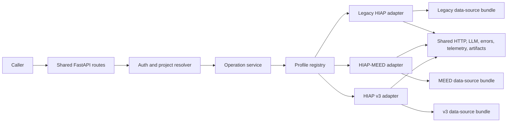

# Modular HIAP Service Analysis

**Ticket:** [CC-720 — Investigate modular HIAP module setup](https://linear.app/openearth/issue/CC-720/investigate-modular-hiap-module-setup)
**Status:** Architecture spike / recommendation
**Scope:** Current `hiap`, current `hiap-meed`, and a planned HIAP v3 profile whose final contract is not yet defined

## Executive decision

It is feasible and worthwhile to move toward **one logical HIAP microservice**, implemented as a modular monolith with profile-specific adapters. The service should have:

- one codebase, image, release pipeline, Kubernetes Service, and Deployment per environment;
- shared infrastructure for API envelopes, authentication, operation tracking, upstream HTTP behavior, observability, errors, and concurrency controls;
- isolated modules for `hiap-legacy`, `hiap-meed`, and future `hiap-v3` behavior;
- a small standardized capability API such as prioritization and plan creation;
- strict, versioned profile-specific input and result schemas inside the standardized envelope;
- explicit capability declarations so profiles do not have to implement every endpoint;
- temporary compatibility routes for existing callers during migration.

The recommendation is **not** to create one universal prioritization request/response model with many optional fields. The current variants do not implement the same business operation with minor configuration differences. They use different city data, action catalogues, scoring methods, result detail, and execution lifecycles. A universal nullable model would hide those differences, weaken validation, and couple every client to fields it does not use.

The target should standardize the **service lifecycle and outer contract**, while adapters retain ownership of variant-specific domain contracts and algorithms.

## What exists today

### Service and API comparison

| Concern | Legacy HIAP | HIAP-MEED | Consequence for consolidation |
| --- | --- | --- | --- |
| FastAPI composition | Three routers mounted at `/prioritizer`, `/plan-creator`, and `/plan-creator-legacy` in `hiap/app/main.py` | Prioritization and reference-data routers mounted directly in `hiap-meed/app/main.py` | Router registration is already modular enough to place behind a registry. |
| Prioritization lifecycle | Asynchronous `start -> check -> get`; separate single and bulk start/result endpoints | Synchronous `POST /v1/prioritize` for one or more cities | The outer lifecycle is incompatible and must be standardized or supported through migration facades. |
| Plan lifecycle | Asynchronous `start -> check -> get`, plus asynchronous translation | Synchronous `POST /v1/reports/output-plan`; this is a City Action Report assembled from a prioritization snapshot, not the same plan product | `create plan` is a shared capability name, not yet a shared result contract. |
| Other workflow endpoints | Create and translate ranking explanations; legacy plan creator routes; debug task listing | Exclusion preview, explanation translation, and seven normalized reference-data endpoints | Optional capabilities must not become mandatory methods on every adapter. |
| City input | Flat population plus five sector emission totals | Detailed GPC activity rows, inventory year, exclusions, strategic preferences, optional weight overrides, country per city | A single flat DTO would either lose MEED data or burden legacy callers. |
| Action types | Ranks mitigation, adaptation, or both | Current prioritizable catalogue is mitigation-focused | The common result cannot assume identical action groups. |
| Data sources | Global API v0 climate actions, city context, and CCRA; startup S3 artifacts/vector stores | Global API city attributes and v1 action pathways, policy scores, mitigation and financial feasibility; private S3 legal CSV | Data access must be selected by an authorized profile, not global process environment alone. |
| Scoring | XGBoost-backed pairwise/tournament or quick-select ranking, biome filtering, and adaptation risk inputs | Hard filter, Impact, Alignment, Feasibility, weighted final score, evidence, and optional LLM explanations | Algorithms should remain separate modules behind a narrow adapter protocol. |
| Result | Mitigation/adaptation action IDs, ranks, and optional explanations | Scores, evidence summaries, removed actions, warnings, detailed metadata, and explanations | Only a small result core is naturally common. |
| State | In-memory task dictionaries plus daemon threads/process pool | Stateless synchronous requests; report snapshots are supplied by the caller | Existing HIAP task handling is not safe as the shared operation mechanism. |
| Observability | LangSmith-oriented LLM tracing and process logs | Request-scoped MLflow runs/artifacts and process logs | A unified service needs one standard with profile tags, while adapters may add profile-specific artifacts. |
| Runtime dependencies | Heavy ML/agent stack including XGBoost, scikit-learn, LangGraph, Chroma, and S3 startup downloads | Smaller scoring/runtime stack plus MLflow, Pandas, OpenAI, Global API, and S3 legal data | One image will be larger and needs lazy profile initialization so one optional module cannot break all routes at startup. |

### Current endpoint inventory

Legacy HIAP exposes these primary routes:

- `POST /prioritizer/v1/start_prioritization`
- `POST /prioritizer/v1/start_prioritization_bulk`
- `GET /prioritizer/v1/check_prioritization_progress/{task_uuid}`
- `GET /prioritizer/v1/get_prioritization/{task_uuid}`
- `GET /prioritizer/v1/get_prioritization_bulk/{task_uuid}`
- `POST /prioritizer/v1/create_explanations`
- `POST /prioritizer/v1/translate_explanations`
- `POST /plan-creator/v1/start_plan_creation`
- `GET /plan-creator/v1/check_progress/{task_uuid}`
- `GET /plan-creator/v1/get_plan/{task_uuid}`
- `POST /plan-creator/v1/translate_plan`

The older `/plan-creator-legacy/*` router adds another implementation of start, progress, result, and deprecated direct plan creation.

HIAP-MEED exposes four workflow routes:

- `POST /v1/prioritize/exclusions/preview`
- `POST /v1/prioritize`
- `POST /v1/reports/output-plan`
- `POST /v1/explanations/translate`

It also exposes seven read APIs for city attributes, action pathways, policy scores, mitigation feasibility, financial feasibility, finance opportunities, and comparable finance projects.

This is not currently “the same API implemented twice.” The overlap is at the capability level: rank actions, explain rankings, and produce an action-oriented plan/report.

### Current operational duplication

Each service currently has:

- its own Python project and lockfile;
- its own Docker image;
- three GitHub workflows for development, test, and production;
- three Kubernetes Deployments and three ClusterIP Services;
- separate image repositories and deployment environment variables;
- separate health probes, resource sizing, secrets injection, and rollout checks.

Today that is six deployment manifests, six service manifests, and six service-specific CI/CD workflows across the two implementations. A third separately deployed v3 service would repeat the pattern.

The current development Deployments both request `250m` CPU and `1Gi` memory. Legacy HIAP allows up to `2Gi`; HIAP-MEED allows `1Gi`. Consolidation can reduce idle reservations, but equivalent concurrent capacity may still require roughly the combined resources. The strongest guaranteed savings are reduced release/configuration maintenance, not automatically lower compute cost.

### Current scaling and isolation constraints

Legacy HIAP stores operation state in process memory. A restart loses tasks. With more than one replica, a poll can reach a different pod and fail unless requests are sticky or operation state is externalized. The current one-replica Deployment avoids that routing problem but provides no high availability.

HIAP-MEED runs prioritization synchronously. Output-plan generation has a per-process semaphore and an eight-worker chapter pool. This protects that process from unlimited report concurrency, but the limits are local to each pod.

Putting both implementations in one runtime without new controls would therefore increase risk:

- legacy ML work could consume CPU or memory needed by MEED requests;
- MEED report generation could exhaust shared LLM or thread capacity;
- one profile's import, startup artifact, or configuration failure could make all profiles unavailable;
- every profile would be released together.

These are manageable, but they must be designed explicitly rather than treated as consequences of sharing a FastAPI application.

## Requirements for a unified service

### Separate tenant, project, profile, and contract version

These concepts must not be collapsed into one `client` string:

- **Tenant/client** identifies who is authorized to call the service and determines quotas and data access.
- **Project** identifies the configured project instance, for example a particular MEED deployment or a future v3 project.
- **Profile** selects the algorithm and workflow module, for example `hiap-legacy`, `hiap-meed`, or `hiap-v3`.
- **Contract version** selects the input/result schema supported by that profile.

The caller may state a project/profile only if its authenticated identity is authorized for it. Ideally the server resolves the allowed project configuration from auth claims. A caller must never be able to submit an arbitrary upstream URL, S3 bucket/key, prompt set, or another tenant's project ID.

This is a new requirement. Neither current service shows application-level authorization on its business routes; they rely on deployment/network context. Multi-project use turns that from an operational assumption into a data-isolation risk.

### Move source selection out of process-global environment switches

HIAP-MEED currently selects mock/API/S3 clients through service-wide `HIAP_MEED_*_DATA_SOURCE` environment variables. That works when one deployment serves one product configuration. It does not work when simultaneous requests in the same process need different project data.

A unified service needs an immutable project/profile registry loaded from trusted configuration. Each resolved profile should receive a request-scoped `DataSourceBundle`, for example:

```text
ProjectProfile
  identity and allowed tenants
  supported capabilities and contract versions
  algorithm configuration
  data-source bindings
  model/prompt configuration
  quotas and concurrency policy
```

Credentials remain in environment or a secret manager, but the authorized registry maps a project/profile to credential aliases and fixed source scopes. Request bodies contain business selectors such as locode or country code, not infrastructure locations.

### Use strict discriminated schemas, not `dict[str, Any]`

One endpoint can support different schemas without weakening validation. The request envelope should select a strict Pydantic discriminated union using `profile`, `contractVersion`, and an input `kind`. OpenAPI can then describe the alternatives using `oneOf`.

The same rule applies to results. Common metadata can be normalized, while the detailed result remains profile-specific and validated.

### Standardize operations before standardizing algorithms

The most reusable cross-profile contract is the operation lifecycle:

- correlation/request ID;
- authorized project and resolved profile;
- capability name and contract version;
- `queued`, `running`, `succeeded`, `failed`, or `cancelled` status;
- created/started/completed timestamps;
- stable error code and safe message;
- result and status links;
- profile-tagged logs, traces, metrics, and artifacts.

The existing HIAP in-memory dictionaries should not become the platform abstraction. A durable operation record is required before multiple replicas or a shared async API are safe. The storage/queue technology is an implementation decision, but it must support retries, leases, idempotency, expiry, and recovery after pod restart.

## Options

### Option 1: Keep three independent microservices

**Description:** Maintain legacy HIAP and HIAP-MEED as they are and create a new v3 service.

**Pros**

- strongest runtime, scaling, credential, and release isolation;
- no migration risk for current callers;
- each service can keep the most natural API and dependency stack;
- an incident or incompatible dependency in one variant does not affect the others.

**Cons**

- repeats Docker, Kubernetes, CI/CD, dependency updates, health, auth, logging, and HTTP-client work;
- common fixes drift between services;
- a third service repeats the operational footprint;
- inconsistent APIs continue to leak into every caller;
- cross-service observability and governance remain harder.

**Assessment:** Lowest short-term change, highest continuing duplication. Reasonable only if variants need independent teams, release cadence, data residency, or scaling from the start.

### Option 2: One service with client/profile-specific endpoint trees

**Description:** Put all modules in one FastAPI deployment but preserve routes such as `/legacy/...`, `/meed/...`, and `/v3/...`.

**Pros**

- removes most duplicate Kubernetes and image infrastructure;
- allows low-risk copy-in of current contracts;
- keeps OpenAPI schemas simple and profile-specific;
- existing clients can migrate mostly by changing the base URL.

**Cons**

- retains duplicate lifecycle, error, metadata, and route code;
- callers still need profile-specific clients;
- shared concepts can continue to drift;
- creates a monolith without obtaining much application-level reuse;
- release and failure coupling increase even though contract duplication remains.

**Assessment:** Useful as a temporary consolidation step or compatibility facade, but weak as the final architecture.

### Option 3: One endpoint with one universal request/response model

**Description:** Force every variant through one `/v1/prioritize` DTO containing all legacy, MEED, and v3 fields as optional values.

**Pros**

- superficially simple endpoint list;
- one generated client method name;
- common fields are immediately visible.

**Cons**

- most fields are invalid or meaningless for most profiles;
- cross-field validation becomes complex and error-prone;
- profile changes force a shared contract release;
- profile-specific evidence and plan structures either disappear or pollute all clients;
- weak schemas make incorrect profile/data combinations easier;
- future v3 needs would continually expand the universal model.

**Assessment:** Do not choose. This standardizes appearance rather than behavior.

### Option 4: Shared platform package with separate deployments

**Description:** Extract shared envelopes, clients, auth, operation tracking, and observability to a common package while keeping one deployable service per profile.

**Pros**

- retains runtime and release isolation;
- reduces code duplication;
- each profile keeps strict, natural contracts and dependencies;
- profiles can scale independently.

**Cons**

- does not reduce pods, services, image repositories, or deployment workflows;
- shared-package release/version coordination creates its own maintenance;
- services may pin different versions and drift;
- operational fixes still require multiple deployments.

**Assessment:** Strong fallback if profiling shows that one runtime cannot safely host the workloads. It does not satisfy the main infrastructure goal.

### Option 5: One modular service with standardized envelopes and profile adapters

**Description:** One deployable modular monolith exposes common capability and operation APIs. A registry resolves an authorized profile. Strict profile adapters validate inputs, select data sources, execute algorithms, and map results.

**Pros**

- one service/release/deployment surface per environment;
- common lifecycle, auth, error, HTTP, observability, and concurrency behavior;
- one endpoint can safely expose multiple strict schemas;
- profile-specific algorithms and contracts remain isolated in code;
- new profiles are registered rather than copied into a new service;
- compatible shared logic can be extracted only after reuse is proven;
- callers can share an SDK for envelopes and operation polling.

**Cons**

- larger image and combined dependency/security surface;
- shared release and outage blast radius;
- per-profile resource contention must be controlled;
- adapter boundaries and contract tests require discipline;
- durable operation handling and authorization add upfront work;
- independent profile scaling is less direct in one Deployment.

**Assessment:** Best balance and recommended target, subject to load tests and explicit extraction triggers.

## Recommended target architecture



### Adapter contract

Avoid a large class hierarchy. Use small typed protocols for capabilities:

```python
class PrioritizationProfile(Protocol):
    profile_id: str
    contract_versions: set[str]

    def validate_input(self, payload: object, version: str) -> BaseModel: ...
    def prioritize(self, request: BaseModel, context: ExecutionContext) -> BaseModel: ...


class PlanProfile(Protocol):
    def validate_plan_input(self, payload: object, version: str) -> BaseModel: ...
    def create_plan(self, request: BaseModel, context: ExecutionContext) -> BaseModel: ...
```

A registry entry declares which protocols/capabilities it implements. A profile without plan creation does not receive a stub method. Calling an unavailable capability returns a stable `capability_not_supported` error.

### Suggested code boundary

```text
app/
  main.py
  api/
    prioritizations.py
    plans.py
    operations.py
    profile_capabilities.py
  platform/
    auth.py
    errors.py
    operations.py
    registry.py
    telemetry.py
    http_client.py
  profiles/
    hiap_legacy/
      models.py
      prioritization.py
      plan.py
      data_sources.py
      prompts/
    hiap_meed/
      models.py
      prioritization.py
      report.py
      reference_data.py
      data_sources.py
      prompts/
    hiap_v3/
      models.py
      ...
```

`hiap-meed` is the better structural seed because it already uses an application package, module-local models, injected data clients, a shared retrying HTTP client, request correlation, and explicit scoring blocks. The legacy implementation should be imported as an isolated profile and incrementally cleaned up; its heavy dependencies and S3 artifacts should be initialized lazily only when that profile is enabled or invoked.

### API shape

Use resource nouns for the new stable API:

- `POST /v1/prioritizations`
- `POST /v1/plans`
- `GET /v1/operations/{operation_id}`
- `GET /v1/operations/{operation_id}/result`
- `GET /v1/profiles/{profile_id}/capabilities` for authorized discovery

Example prioritization request:

```json
{
  "meta": {
    "requestId": "frontend-123"
  },
  "project": "meed-plus",
  "profile": "hiap-meed",
  "contractVersion": "1",
  "input": {
    "kind": "hiap-meed.prioritization.v1",
    "requestedLanguages": ["en", "es"],
    "topN": 20,
    "cityDataList": [
      {
        "locode": "CL SCL",
        "countryCode": "CL",
        "cityEmissionsData": {
          "inventoryYear": 2024,
          "gpcData": {}
        }
      }
    ]
  }
}
```

The equivalent legacy request uses the same outer fields but `kind: "hiap-legacy.prioritization.v1"` and the strict legacy input model. Auth must confirm that the caller may use the requested project/profile pair.

Example accepted response:

```json
{
  "operationId": "01J...",
  "status": "queued",
  "profile": "hiap-meed",
  "contractVersion": "1",
  "links": {
    "status": "/v1/operations/01J...",
    "result": "/v1/operations/01J.../result"
  },
  "meta": {
    "requestId": "frontend-123"
  }
}
```

Example successful result envelope:

```json
{
  "operationId": "01J...",
  "status": "succeeded",
  "profile": "hiap-meed",
  "contractVersion": "1",
  "result": {
    "kind": "hiap-meed.prioritization-result.v1",
    "results": []
  },
  "meta": {
    "requestId": "frontend-123",
    "startedAt": "...",
    "completedAt": "..."
  }
}
```

The result envelope can expose a genuinely shared summary, such as locode and ordered action IDs, but the authoritative detailed result remains the discriminated profile result. Do not discard MEED scores/evidence or fabricate them for legacy HIAP merely to make the inner models identical.

### Synchronous versus asynchronous behavior

Use one asynchronous operation contract as the long-term default for prioritization and plan/report generation. It handles both current legacy behavior and long MEED report calls without tying correctness to an HTTP timeout.

For migration, keep compatibility facades in the same deployment:

- existing legacy start/check/get routes map to the shared operation service;
- existing MEED synchronous routes execute the MEED adapter and return the current response directly;
- new callers use the standardized operation API;
- facades are removed only after their consumers migrate.

Do not make the same standardized endpoint unpredictably return either a profile result (`200`) or an operation (`202`) based only on which profile was selected. That would move lifecycle branching into every client.

### Optional and profile-specific endpoints

Use three levels:

1. **Core standardized capabilities:** prioritizations, plans, operations.
2. **Reusable optional capabilities:** exclusion preview, explanation translation, and reference-data reads when at least two profiles share the same semantics.
3. **Truly profile-specific APIs:** keep them under an explicit profile namespace such as `/v1/profiles/hiap-meed/reference-data/...` rather than expanding the common contract.

One microservice does not require every route to be universal. The goal is one coherent platform and reusable lifecycle, not the smallest possible count of URL paths.

### Runtime isolation inside one service

The shared runtime needs:

- per-profile concurrency limits and queues;
- separate timeouts and rate limits for prioritization, plan/report, and translation capabilities;
- profile-tagged metrics, logs, traces, and cost measurements;
- lazy loading of XGBoost/LangGraph/Chroma and legacy S3 artifacts;
- bounded thread/process pools rather than unbounded daemon threads;
- readiness that distinguishes core service health from optional profile readiness;
- bulkhead behavior so one profile can be temporarily disabled without taking down the process;
- idempotency using tenant/project, request ID, profile, contract version, and an input fingerprint;
- durable operation state so restarts and multiple replicas are safe.

A single microservice may still contain more than one process role if reliable async work requires it. Start with one Kubernetes Deployment only if load tests show the API and worker execution can coexist safely. The important reduction is from one independently operated stack per project to one operated service, not forcing all work into an unsafe single process.

## Migration path

### Phase 0: Freeze and measure current behavior

- Export OpenAPI schemas and representative success/error fixtures for both services.
- Add contract tests for every consumer-used route.
- Record latency, CPU, memory, concurrency, upstream-call count, LLM cost, and image/startup size by workflow.
- Confirm the planned v3 capabilities, input data, result expectations, data residency, and expected load.

### Phase 1: Build the neutral platform shell

- Start from HIAP-MEED's structural conventions but use a neutral service name.
- Add auth/project resolution, profile registry, common errors, operation models, telemetry, and concurrency policy.
- Define discriminated profile schemas and capability protocols.
- Add durable operation storage before relying on async polling across replicas.

### Phase 2: Register HIAP-MEED first

- Move current MEED routes behind a `hiap-meed` profile adapter without changing behavior.
- Keep the existing `/v1/prioritize`, report, translation, and reference-data routes as facades.
- Prove result equivalence with golden contract/e2e tests.

This is the lowest-risk first profile because the code already has explicit modules, injected clients, strict Pydantic models, and shared observability.

### Phase 3: Add v3 as a new profile

- Implement v3 through the new contracts rather than creating another service.
- Reuse only platform services and genuinely shared domain components.
- Keep v3 models and algorithm configuration independent from MEED until equivalence is demonstrated.

This validates whether the extension seam works before the more complex legacy migration.

### Phase 4: Add the legacy HIAP profile

- Wrap the current ranking and plan logic behind legacy capability adapters.
- Externalize operation state and replace direct daemon-thread ownership.
- Lazy-load its heavy model/vector dependencies.
- Map current legacy start/check/get routes to the common operation store.
- Run shadow comparisons before directing production traffic to the unified deployment.

### Phase 5: Migrate callers and retire duplicate infrastructure

- Move consumers to the standardized operation SDK/API one workflow at a time.
- Keep old base URLs temporarily pointing to the same service if necessary.
- Remove compatibility routes only after usage metrics reach zero.
- Delete old images, manifests, workflows, environment variables, cron assumptions, and services only after production verification and rollback windows expire.

## Extraction triggers

Begin unified, but retain clean module boundaries so a profile can later be separated. Split a profile into its own deployment if evidence shows one or more of these:

- materially different data-residency, network, or credential boundaries;
- a release cadence that repeatedly blocks other profiles;
- sustained load requiring independent autoscaling or GPU/specialized nodes;
- dependency conflicts that cannot be isolated safely;
- repeated incidents where one profile exhausts shared CPU, memory, threads, or upstream quotas;
- availability objectives that require a smaller failure domain;
- a separate owning team with an independent operational lifecycle.

If extraction becomes necessary, keep the common external envelope and profile contract. The registry can dispatch to an out-of-process adapter later without changing callers.

## Decision matrix

Scores are relative (`1` poor, `5` strong) for the goals of CC-720.

| Option | Infra reduction | Contract clarity | Runtime isolation | Reuse | Migration safety | Long-term fit |
| --- | ---: | ---: | ---: | ---: | ---: | ---: |
| Separate services | 1 | 3 | 5 | 1 | 5 | 2 |
| One runtime, profile-specific routes | 4 | 3 | 2 | 2 | 4 | 3 |
| One universal DTO | 4 | 1 | 2 | 2 | 2 | 1 |
| Shared package, separate deployments | 1 | 4 | 5 | 4 | 4 | 3 |
| Modular service + adapters | 5 | 5 | 3 | 5 | 3 | 5 |

## Open questions before implementation

- What exact capabilities must HIAP v3 provide: prioritization, plan/report generation, reference-data reads, or others?
- Does v3 use the MEED action catalogue and evidence model, or only a similar workflow?
- Which system authenticates service-to-service callers and supplies tenant/project claims?
- Are any project data sources subject to separate residency or credential policies?
- What are current and forecast peak concurrency, latency, and availability targets per profile?
- Is one release cadence acceptable to all profile owners?
- Which current MEED frontend routes and response fields are already treated as stable public contracts?
- Can current CityCatalyst job persistence become the shared operation store, or should the HIAP service own it?

## Final recommendation

Proceed with **Option 5: one modular HIAP service with standardized envelopes and profile adapters**.

Use one standard operation lifecycle for future callers, strict discriminated input/result models per profile, and capability discovery for optional endpoints. Keep current legacy and MEED routes only as migration facades in the unified deployment. Resolve tenant/project/profile through authorization and trusted configuration, not caller-provided infrastructure settings. Add durable operation state and per-profile concurrency isolation before consolidating production traffic.

Implement MEED as the first profile, v3 as the first true extension, and legacy HIAP last. This sequence delivers the v3 infrastructure benefit early, tests the modular boundary against a new project, and postpones the riskiest task-state and heavyweight-dependency migration until the platform abstractions are proven.

The result is one operated microservice without pretending that all HIAP projects have identical data or outputs. It reduces duplicated infrastructure and shared-code maintenance while preserving an explicit escape path if a profile later requires independent scaling or isolation.
