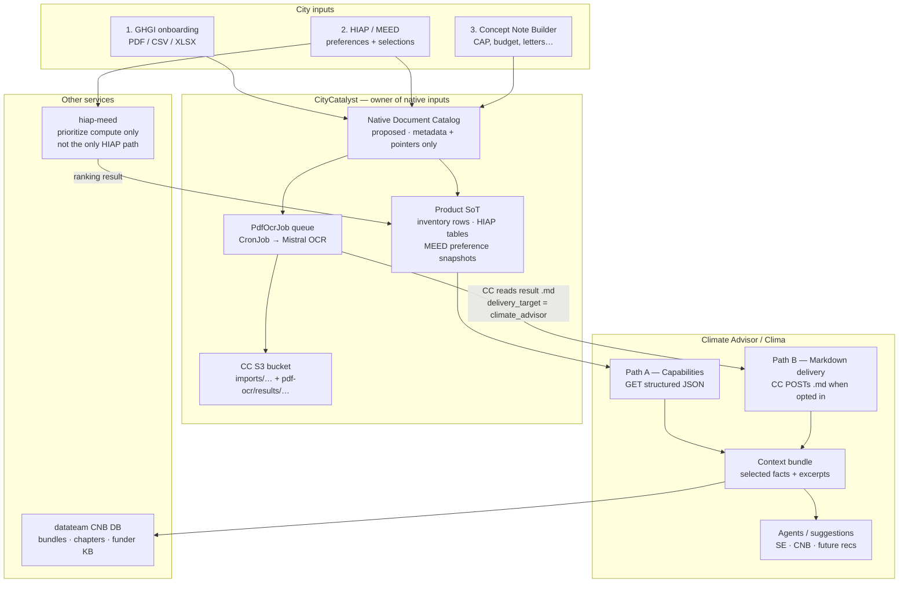
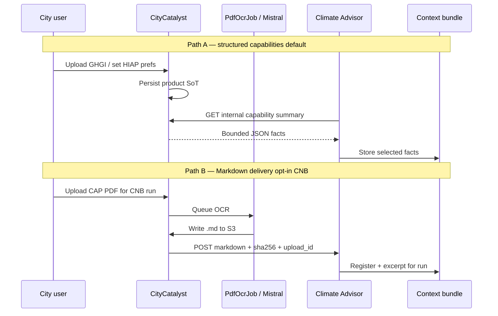
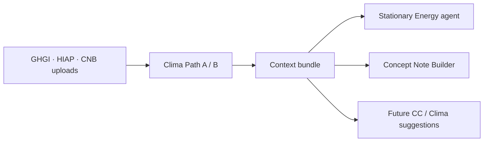

# Native Document Storage Architecture

> Draft for [CC-553](https://linear.app/openearth/issue/CC-553/create-architecture-for-agentic-native-document-storage) · 2026-07-22  
> Status: **draft for stakeholder review**

## One-line intent

CityCatalyst owns city-provided documents and structured intakes. Climate Advisor (Clima) never holds S3 keys; it reads via **typed capabilities** and optional **Markdown delivery**, then uses that context to guide downstream suggestions.

## Scope (from original product ask)

Three intakes today / soon:

1. **GHGI onboarding** — city uploads inventory file
2. **HIAP / MEED** — city preferences / selections
3. **Concept Note Builder** — city uploads supporting docs

DoD: Mermaid + ownership + how Clima accesses + how inputs inform decisions → then follow-up tickets.

**v1 services in diagram:** CityCatalyst app + Climate Advisor (+ hiap-meed as one compute path for preferences).  
**`global-api`:** out of v1 unless someone shows active document traffic there (open confirm).

**Related repo docs:** [ConceptNoteBuilderArchitecture.md](./ConceptNoteBuilderArchitecture.md) (CNB/OCR deep dive), [AgenticModuleScope.md](./AgenticModuleScope.md) (Stage-1 agentic scope).

---

## DoD diagram — target document flow



### How to read this (30 seconds)

1. All city inputs enter **CityCatalyst** first.
2. PDFs go S3 + OCR queue; prefs/rankings stay as **structured** product data.
3. Clima has **two doors**: ask for JSON summaries (Path A) or receive Markdown bytes from CC (Path B). Clima does **not** read S3.
4. Agents do not browse the bucket — they use a **context bundle** built from those doors.
5. The **Native Document Catalog** is a proposed logical layer (API facade over existing tables first, or an explicit table later) — it is not implemented yet.

---

## Ownership

| Input | What is stored | Owner | Clima access |
| --- | --- | --- | --- |
| GHGI PDF + OCR `.md` | S3 objects + `ImportedInventoryFile` + `PdfOcrJob` | CC | Path A (emissions/status) today; Path B optional later |
| HIAP / MEED prefs | JSON snapshot + ranking/selection tables | CC (MEED = compute when used) | Path A (`hiap.summary` — to build) |
| CNB uploads | S3 + `ConceptNoteUpload` + `PdfOcrJob` | CC | Path B → ingest → excerpts in bundle |
| Context bundle snapshot | Run-scoped assembled context | datateam CNB DB (CA orchestrates) | Internal to CA workflows |
| Funder / similar projects | Curated research corpus | datateam CNB DB | CNB tools (not city-native docs) |

**Hard rules**

1. Clima never gets S3 keys or signed URLs for source/OCR objects.
2. Path B is **opt-in** per OCR job (`delivery_target`), not automatic for every inventory PDF.
3. Re-upload = **new** immutable id; old row soft-deleted / superseded.
4. No cross-DB foreign keys — only shared IDs over APIs.

---

## How Clima gets access



### Path A — capability payloads

Clima calls CC internal APIs. Live GHGI examples already exist under `/api/v1/internal/ca/capabilities/ghgi/…` (for example `emissions-context`, `list-accessible`). The JSON below is **illustrative** for architecture discussion — field names may not match production responses 1:1.

**GHGI emissions context (illustrative; live capability exists):**

```json
{
  "capability": "ghgi.emissions_context",
  "city_id": "city_msp_001",
  "inventory_id": "inv_2024",
  "year": 2024,
  "status": "approved",
  "total_emissions_tco2e": 4120000,
  "sectors": {
    "stationary_energy": 1800000,
    "transportation": 1500000,
    "waste": 820000
  }
}
```

Optional later enrichment (not live today) could advertise related native documents:

```json
{
  "native_documents": [
    {
      "native_document_id": "ndoc_ghgi_pdf_01",
      "source_kind": "inventory_import",
      "label": "GHGI inventory PDF 2024",
      "markdown_ready": true
    }
  ]
}
```

**HIAP / MEED summary (target only — not wired yet):**

```json
{
  "capability": "hiap.summary",
  "city_id": "city_msp_001",
  "selected_actions": [
    {
      "action_id": "hiap_sw_12",
      "title": "Green stormwater infrastructure corridor",
      "is_selected": true
    }
  ],
  "strategic_preferences": {
    "sectors": ["water", "infrastructure"],
    "timeframes": ["near_term"],
    "co_benefits": ["equity", "public_health"]
  },
  "preference_snapshot_id": "ndoc_hiap_prefs_01"
}
```

### Path B — Markdown delivery

After OCR succeeds for a CNB upload, **CC reads** the authoritative Markdown from S3 and **POSTs the bytes** to CA (no S3 key in the body). Endpoint shape already exists; production storage still returns `503 cnb_storage_unavailable` until the datateam adapter is wired.

```http
POST /v1/concept-notes/cnb_run_demo_001/uploads/upl_cap_001/markdown
Authorization: Bearer <cc-to-ca-token>
Content-Type: application/json
```

```json
{
  "markdown": "<!-- page: 1 -->\n# Minneapolis Climate Action Plan\n...\n<!-- page: 34 -->\nTarget: reduce CSO events 40% by 2030.\n",
  "filename": "Minneapolis_CAP_2025.pdf",
  "source_label": "Climate Action Plan",
  "page_count": 120,
  "sha256": "a3f1c9e8b7d64520123456789abcdef0123456789abcdef0123456789abcdef0"
}
```

CA then keeps **excerpts** in the run bundle (not necessarily the full corpus in every prompt):

```json
{
  "upload_id": "upl_cap_001",
  "excerpts": [
    {
      "excerpt_id": "ex_34",
      "page": 34,
      "text": "Target: reduce CSO events 40% by 2030.",
      "used_for": ["problem_statement"]
    }
  ]
}
```

---

## Downstream decisions (why this storage matters)

| Input | Informs today | Informs with this architecture |
| --- | --- | --- |
| GHGI structured inventory | Inventory UI, HIAP inputs, CA GHGI tools | Same + SE agentic prefilling + CNB emissions context |
| GHGI OCR Markdown | Row extraction only | Optional excerpts if product enables Path B / excerpt capability |
| HIAP / MEED prefs | HIAP UI / prioritizer request | Any Clima skill via `hiap.summary` |
| CNB uploads | — (not wired) | Concept note draft, evidence links, gaps |
| Funder KB / similar projects | Research pipeline | CNB examples (curated, not city-native) |



---

## Current state vs target (short)

| Intake | Now | Target |
| --- | --- | --- |
| GHGI PDF | S3 + `PdfOcrJob` + row extract; CA = structured Path A only | Same ownership; proposed catalog registers it; Path A first |
| HIAP / MEED | Rankings in CC; MEED prefs often request-scoped; classic HIAP API path also exists | Durable preference snapshot in CC + Path A |
| CNB uploads | Ingest endpoint exists; `503 cnb_storage_unavailable` | CC upload + OCR + Path B delivery + CA storage adapter |

---

## Integration — no breaking changes

| Keep | Extend later (follow-up tickets) |
| --- | --- |
| `PdfOcrJob` + cron + Mistral | `concept_note_upload` resolver; inventory stays no-delivery by default |
| GHGI capability routes | Add `hiap.summary` (+ optional markdown excerpts) |
| CA `POST .../markdown` | Replace unavailable repo with datateam adapter |
| HIAP / hiap-meed split | Persist MEED snapshots in **CC**, not in hiap-meed |

Suggested follow-ups after approval: catalog facade/API · HIAP snapshot + capability · CNB upload + delivery · CA storage adapter ([CC-570](https://linear.app/openearth/issue/CC-570/placeholder-implementation)) · optional inventory Markdown excerpts.

---

## Constraints

| Constraint | Note |
| --- | --- |
| ~20 MB PDF working cap | Ops plan needed for larger files |
| S3 required for PDF OCR | Missing bucket → 503 |
| Permissions | Same city/project checks as import routes |
| Versioning | Immutable sources; new upload = new id |
| Compliance | Follow CC file lifecycle until product/legal say otherwise |
| Cross-DB | API IDs only — no FK CC ↔ CNB DB |

---

## Open questions (review)

1. Catalog: lean facade over existing tables first, or new `NativeDocument` table now?
2. Should agents ever read GHGI OCR Markdown, or only structured inventory?
3. Confirm HIAP/MEED snapshots live in CC.
4. Bundle stays **per-run** in v1; catalog is the path to later city-wide reuse?
5. Is `UserFile` BYTEA in-scope for agentic native docs?
6. Confirm `global-api` out of v1.
7. Extra retention/audit rules beyond current CC lifecycle?

---

## Document status

| Item | Status |
| --- | --- |
| Mermaid: three intakes → CC → services → Clima | Drafted |
| Ownership model | Drafted |
| Clima access patterns + example contracts | Drafted |
| Downstream decision map | Drafted |
| Integration / no-breaking-change path | Drafted |
| Constraints | Drafted |
| Stakeholder review (Piotr / Carlos / Mirco) | Pending |
| Follow-up implementation tickets | Pending after approval |
