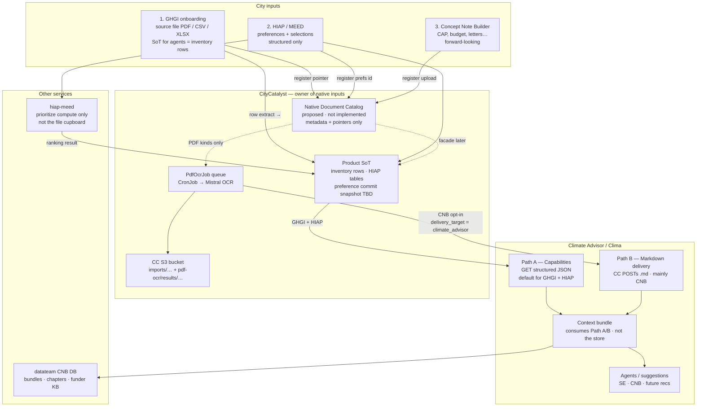
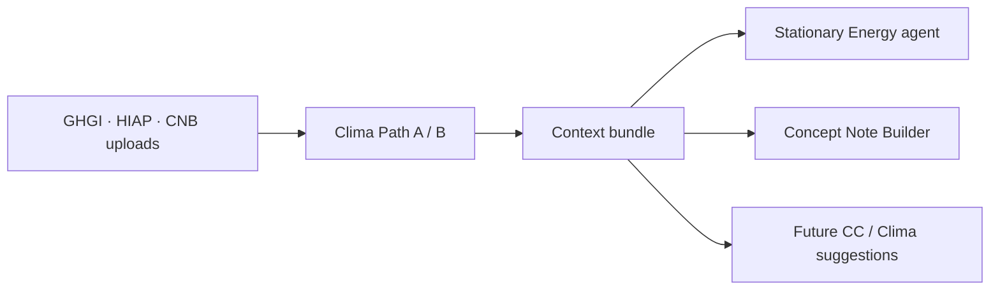

# Native Document Storage Architecture

> Draft for [CC-553](https://linear.app/openearth/issue/CC-553/create-architecture-for-agentic-native-document-storage) · 2026-07-22  
> Status: **draft for stakeholder review** (clarifications 2026-07-23 after Piotr / Mirco Slack feedback)

## One-line intent

CityCatalyst owns city-provided documents and structured intakes. Climate Advisor (Clima) never holds S3 keys; it reads via **typed capabilities** and optional **Markdown delivery**, then uses that context to guide downstream suggestions.

### What this draft is (and is not)

| This draft **is** | This draft **is not** |
| --- | --- |
| Ownership + access layer for city-native intakes (GHGI files, HIAP/MEED prefs, CNB uploads) | The Stationary Energy ↔ CNB **context-exchange** design itself |
| Rules so modules do not each invent their own upload cupboard | A requirement that Clima browse GHGI PDFs by default |
| Prerequisite for later SE ↔ CNB / city-wide reuse | A centralized mega-database for every service response |

The **context bundle** (and future SE ↔ CNB exchange) **consumes** this layer — it is not the document store.

**Naming note:** “Native document storage” here means **documents + structured city intakes** (preferences, selections), not only PDF bytes. The goal matches Mirco’s framing: joint foundation / data permeability across modules, without one DB that stores everything for all services.

## Scope (from original product ask)

Three intakes today / soon:

1. **GHGI onboarding** — city uploads inventory file (source artifact). Clima’s default numbers come from **structured inventory**, not from re-reading the PDF.
2. **HIAP / MEED** — city preferences / selections (**structured**, not PDF Path B)
3. **Concept Note Builder** — city uploads supporting docs (CAP, budget, letters…). CAP upload is **forward-looking** (not live in product yet).

DoD: Mermaid + ownership + how Clima accesses + how inputs inform decisions → then follow-up tickets.

**v1 services in diagram:** CityCatalyst app + Climate Advisor (+ hiap-meed as one compute path for preferences).  
**`global-api`:** out of v1 unless someone shows active document traffic there (open confirm).

**Related repo docs:** [ConceptNoteBuilderArchitecture.md](./ConceptNoteBuilderArchitecture.md) (CNB/OCR deep dive), [AgenticModuleScope.md](./AgenticModuleScope.md) (Stage-1 agentic scope — Path A capability payloads are the CC-facing contracts that feed those capability layers / module scope).

---

## DoD diagram — target document flow



### How to read this (30 seconds)

1. All city inputs enter **CityCatalyst** first.
2. **Two layers for the same intake (especially GHGI):**
   - **Storage / ownership:** source PDF (+ OCR Markdown in S3) may live in CC as a city-provided artifact / catalog pointer.
   - **Clima read path (default):** Path A JSON from the **product SoT** (approved inventory rows, HIAP selections) — **not** “send the PDF to Clima.”
3. Prefs/rankings stay **structured** product data. **HIAP / MEED never rides Path B.**
4. Clima has **two doors**: Path A (JSON capabilities, default) or Path B (Markdown bytes from CC, **mainly CNB**, opt-in). Clima does **not** read S3.
5. Agents do not browse the bucket — they use a **context bundle** built from those doors. SE ↔ CNB exchange is a **consumer** of this layer.
6. The **Native Document Catalog** is a **proposed** logical layer (API facade over existing tables first, or an explicit table later) — dashed in the diagram; **not implemented**.

---

## Ownership

| Input | What is stored | Owner | Clima access |
| --- | --- | --- | --- |
| GHGI PDF + OCR `.md` | S3 objects + `ImportedInventoryFile` + `PdfOcrJob` (source artifact) | CC | **Path A only today** (emissions/status from inventory). Path B / excerpts = product opt-in later, not default |
| HIAP / MEED prefs | Selection / preference SoT in CC (exact snapshot shape **open** — see below) | CC (MEED = compute when used) | **Path A only** (`hiap.summary` — to build). Never Path B |
| CNB uploads | S3 + `ConceptNoteUpload` + `PdfOcrJob` | CC | **Path B** → ingest → excerpts in bundle |
| Context bundle snapshot | Run-scoped assembled context | datateam CNB DB (CA orchestrates) | Internal to CA workflows |
| Funder / similar projects | Curated research corpus | datateam CNB DB | CNB tools (not city-native docs) |

**Hard rules**

1. Clima never gets S3 keys or signed URLs for source/OCR objects.
2. Path B is **opt-in** per OCR job (`delivery_target`), not automatic for every inventory PDF. **Default Path B traffic is CNB.**
3. Re-upload = **new** immutable id; old row soft-deleted / superseded.
4. No cross-DB foreign keys — only shared IDs over APIs.

---

## How Clima gets access

```mermaid
sequenceDiagram
  participant City as City user
  participant CC as CityCatalyst
  participant OCR as PdfOcrJob / Mistral
  participant CA as Climate Advisor
  participant Bundle as Context bundle

  Note over City,Bundle: Path A — structured capabilities default (GHGI + HIAP)
  City->>CC: Upload GHGI / commit HIAP prefs
  CC->>CC: Persist product SoT (inventory rows / prefs)
  CA->>CC: GET internal capability summary
  CC-->>CA: Bounded JSON facts
  CA->>Bundle: Store selected facts

  Note over City,Bundle: Path B — Markdown delivery opt-in (mainly CNB; not HIAP)
  City->>CC: Upload CAP PDF for CNB run
  CC->>OCR: Queue OCR
  OCR->>CC: Write .md to S3
  CC->>CA: POST markdown + sha256 + upload_id
  CA->>Bundle: Register + excerpt for run
```

### Path A — capability payloads

Clima calls CC internal APIs. These payloads are the **CC-facing capability contracts** that feed Clima / [AgenticModuleScope](./AgenticModuleScope.md) capability layers / context bundle assembly.

Live GHGI examples already exist under `/api/v1/internal/ca/capabilities/ghgi/…` (for example `emissions-context`, `list-accessible`). The JSON below is **illustrative** for architecture discussion — field names may not match production responses 1:1.

**GHGI emissions context (illustrative; live capability exists) — numbers from inventory SoT, not PDF bytes:**

```json
{
  "capability": "ghgi.emissions_context",
  "city_id": "city_msp_001",
  "inventory_id": "inv_2024",
  "year": 2024,
  "status": "approved",
  "total_emissions_tco2e": 4120000,
  "sectors": {
    "stationary_energy": 1800000,
    "transportation": 1500000,
    "waste": 820000
  }
}
```

Optional later enrichment (not live today) could **advertise** related native documents as references (e.g. “we already received this file from you”) without making PDF the agent SoT:

```json
{
  "native_documents": [
    {
      "native_document_id": "ndoc_ghgi_pdf_01",
      "source_kind": "inventory_import",
      "label": "GHGI inventory PDF 2024",
      "markdown_ready": true
    }
  ]
}
```

**HIAP / MEED summary (target only — not wired yet; Path A only):**

```json
{
  "capability": "hiap.summary",
  "city_id": "city_msp_001",
  "selected_actions": [
    {
      "action_id": "hiap_sw_12",
      "title": "Green stormwater infrastructure corridor",
      "is_selected": true
    }
  ],
  "strategic_preferences": {
    "sectors": ["water", "infrastructure"],
    "timeframes": ["near_term"],
    "co_benefits": ["equity", "public_health"]
  },
  "preference_snapshot_id": "ndoc_hiap_prefs_01"
}
```

### Path B — Markdown delivery

After OCR succeeds for a **CNB** upload, **CC reads** the authoritative Markdown from S3 and **POSTs the bytes** to CA (no S3 key in the body). Endpoint shape already exists; production storage still returns `503 cnb_storage_unavailable` until the datateam adapter is wired.

**HIAP / MEED does not use Path B** — preferences are structured Path A.

```http
POST /v1/concept-notes/cnb_run_demo_001/uploads/upl_cap_001/markdown
Authorization: Bearer <cc-to-ca-token>
Content-Type: application/json
```

```json
{
  "markdown": "<!-- page: 1 -->\n# Minneapolis Climate Action Plan\n...\n<!-- page: 34 -->\nTarget: reduce CSO events 40% by 2030.\n",
  "filename": "Minneapolis_CAP_2025.pdf",
  "source_label": "Climate Action Plan",
  "page_count": 120,
  "sha256": "a3f1c9e8b7d64520123456789abcdef0123456789abcdef0123456789abcdef0"
}
```

CA then keeps **excerpts** in the run bundle (not necessarily the full corpus in every prompt):

```json
{
  "upload_id": "upl_cap_001",
  "excerpts": [
    {
      "excerpt_id": "ex_34",
      "page": 34,
      "text": "Target: reduce CSO events 40% by 2030.",
      "used_for": ["problem_statement"]
    }
  ]
}
```

---

## Downstream decisions (why this storage matters)

| Input | Informs today | Informs with this architecture |
| --- | --- | --- |
| GHGI structured inventory | Inventory UI, HIAP inputs, CA GHGI tools | Same + SE agentic prefilling + CNB emissions context |
| GHGI source PDF / OCR Markdown | Row extraction only (current user flow) | Catalog pointer / user reference; optional excerpts only if product enables Path B later |
| HIAP / MEED prefs | HIAP UI / prioritizer request | Any Clima skill via `hiap.summary` (once wired) |
| CNB uploads | — (not wired) | Concept note draft, evidence links, gaps |
| Funder KB / similar projects | Research pipeline | CNB examples (curated, not city-native) |



---

## Current state vs target (short)

| Intake | Now | Target |
| --- | --- | --- |
| GHGI PDF | S3 + `PdfOcrJob` + row extract; CA = structured Path A only | Same ownership; proposed catalog may register the source file; **Clima stays on inventory Path A** unless product later opts into excerpts |
| HIAP / MEED | Rankings in CC; MEED prefs often request-scoped; classic HIAP API path also exists | Clima can read prefs via Path A `hiap.summary`. **How durable the SoT is (commit-only snapshot vs re-request) is an open question** — see below |
| CNB uploads | Ingest endpoint exists; `503 cnb_storage_unavailable` | CC upload + OCR + Path B delivery + CA storage adapter |

---

## Integration — no breaking changes

| Keep | Extend later (follow-up tickets) |
| --- | --- |
| `PdfOcrJob` + cron + Mistral | `concept_note_upload` resolver; inventory stays no-delivery by default |
| GHGI capability routes | Add `hiap.summary` (+ optional markdown excerpts only if product asks) |
| CA `POST .../markdown` | Replace unavailable repo with datateam adapter (CNB Path B) |
| HIAP / hiap-meed split | **hiap-meed stays compute-only** (not the file cupboard). Preference SoT for Clima lives on the **CC side** — exact persistence shape TBD (open question), not “cache every MEED API response” |

Suggested follow-ups after approval: catalog facade/API · HIAP Path A capability (`hiap.summary`) + agreed preference SoT · CNB upload + delivery · CA storage adapter ([CC-570](https://linear.app/openearth/issue/CC-570/placeholder-implementation)) · optional inventory Markdown excerpts · product UX if GHGI source files become user-visible references.

---

## Constraints

| Constraint | Note |
| --- | --- |
| ~20 MB PDF working cap | Ops plan needed for larger files |
| S3 required for PDF OCR | Missing bucket → 503 |
| Permissions | Same city/project checks as import routes |
| Versioning | Immutable sources; new upload = new id |
| Compliance | Follow CC file lifecycle until product/legal say otherwise |
| Cross-DB | API IDs only — no FK CC ↔ CNB DB |

---

## Open questions (review)

1. Catalog: lean facade over existing tables first, or new `NativeDocument` table now?
2. Should agents ever read GHGI OCR Markdown, or only structured inventory? (Default proposal: **inventory only**; PDF = source artifact / optional later reference.)
3. **HIAP / MEED preference SoT in CC — how light?** Options under discussion:
   - **A (lighter v1):** persist only on **explicit user commit / selection save**; ephemeral ranking stays re-request from MEED/HIAP APIs (avoids caching every upstream answer + heavy schema).
   - **B:** fuller durable snapshots / history in CC for audit and city-wide reuse.
   - Goal either way: Clima can `GET hiap.summary` without depending on request-scoped prefs alone — **not** “reproduce every MEED API payload in CC.”
4. Bundle stays **per-run** in v1; catalog is the path to later city-wide reuse?
5. Is `UserFile` BYTEA in-scope for agentic native docs?
6. Confirm `global-api` out of v1.
7. Extra retention/audit rules beyond current CC lifecycle?
8. If GHGI (or other) source files become visible as “we already received this,” what **product / UX** changes are needed so users are not confused (current GHGI flow was built for align-into-inventory, not future chat context)?
9. Loop in **Milan** (and product) before locking follow-up tickets?

---

## Document status

| Item | Status |
| --- | --- |
| Mermaid: three intakes → CC → services → Clima | Drafted (+ 2026-07-23 clarifications) |
| Ownership model | Drafted |
| Clima access patterns + example contracts | Drafted |
| Downstream decision map | Drafted |
| Integration / no-breaking-change path | Drafted (MEED persistence softened to open Q) |
| Constraints | Drafted |
| Stakeholder review (Piotr / Carlos / Mirco / Milan) | In progress (Slack + PR) |
| Follow-up implementation tickets | Pending after approval |
