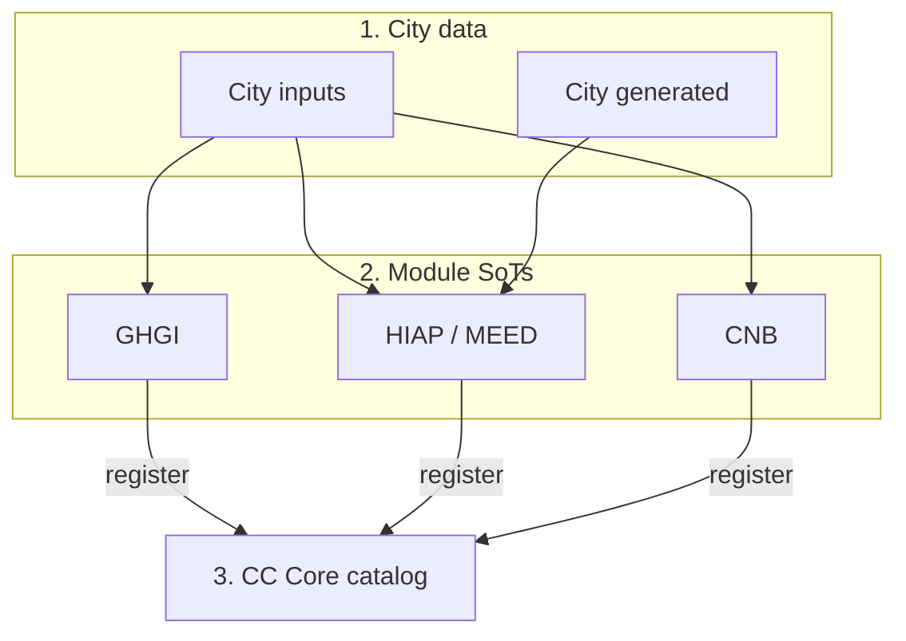
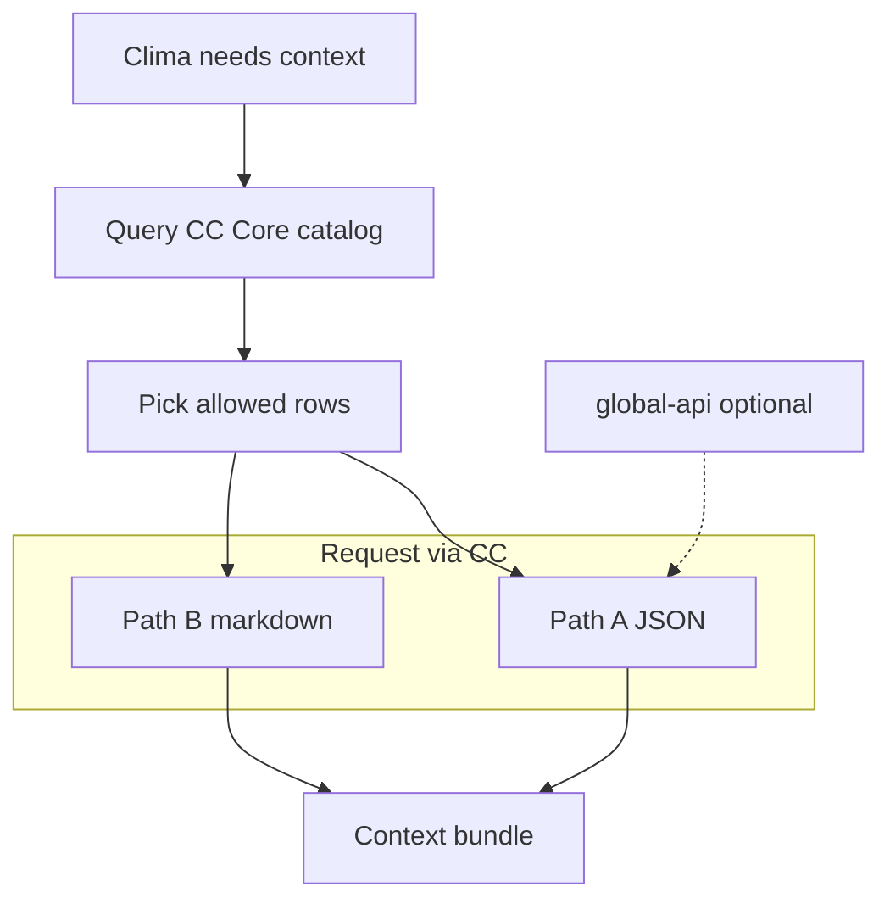
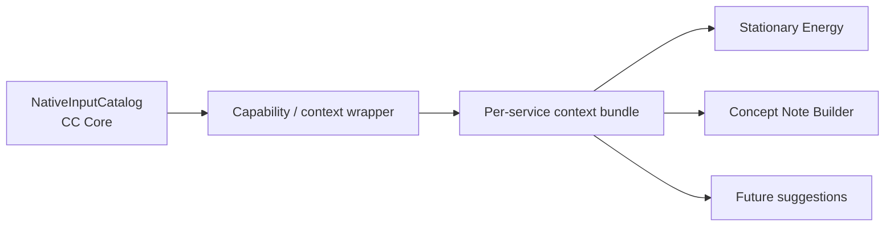

# Native Document Storage Architecture

> Draft for [CC-553](https://linear.app/openearth/issue/CC-553/create-architecture-for-agentic-native-document-storage) · 2026-07-22  
> Status: **draft for stakeholder review** (updated 2026-07-30 after Mirco PR follow-up)

## One-line intent

CityCatalyst **modules** own city-provided documents and structured intakes (owner = module where the user uploaded / committed). Climate Advisor (Clima) never holds S3 keys; it discovers inputs via a **CityCatalyst Core** pointer catalog and reads via **typed capabilities** (and optional Markdown access).

### Clear goal (why this exists)

Make it easy to **discover** everything a city (or org) has uploaded or generated — at any module, at any time — **without** Climate Advisor (or the frontend) querying five services one by one (“do you have data?” × N).

| With `NativeInputCatalog`                                                          | Without it                                                        |
| ---------------------------------------------------------------------------------- | ----------------------------------------------------------------- |
| One **lookup table** in CC Core: what exists, who owns it, scope, where to resolve | CA must ask each module individually                              |
| Then request only the needed items via existing CC auth + capabilities             | No single place to list “all inputs we hold” for settings / Clima |

Secondary benefit: the same lookup can power a future CC frontend view (e.g. settings — “all data we have about this city/org”), including manage/delete flows later.

Today many flows already know the target module; the catalog matters as modules and uploads grow (e.g. CNB).

### What this draft is (and is not)

| This draft **is**                                                                        | This draft **is not**                                          |
| ---------------------------------------------------------------------------------------- | -------------------------------------------------------------- |
| Ownership + access + **discovery** layer for city-native intakes and generated artifacts | The Stationary Energy ↔ CNB **context-exchange** design itself |
| A **CC Core** catalog (lookup), plus module SoTs that still hold the real data           | A mega-database that copies every file/JSON into one store     |
| Prerequisite for later SE ↔ CNB / city-wide reuse                                        | Climate Advisor owning the catalog or S3 credentials           |

The **context bundle** (already how CA scopes context per service) **consumes** this layer — it is not the input store.

**Naming note:** Ticket title keeps “Native document storage.” In-architecture name: **`NativeInputCatalog`** — files **and** structured / generated city data, not only PDF bytes.

---

## Where the catalog lives (decision)

**`NativeInputCatalog` lives in CityCatalyst Core** as an explicit **lookup table** in the **CC core database** (synced in the 2026-07-28 architecture check) — not in Climate Advisor, not as a separate microservice that owns city data, and not as a facade-only layer over module tables.

| Option                                        | Verdict  | Why                                                                                                                                                                                         |
| --------------------------------------------- | -------- | ------------------------------------------------------------------------------------------------------------------------------------------------------------------------------------------- |
| **CC Core lookup table (chosen)**             | ✅        | Auth already lives in CC (JWT / module access). One register/lookup place for discovery. Modules keep SoTs; catalog stores pointers + owner + scope. Schema/migrations with Milan / Amanda. |
| Catalog owned by Climate Advisor              | ❌        | CA should not become the system of record for “what the city uploaded.” Frontend/settings also need this list.                                                                              |
| Separate catalog microservice with its own DB | ❌ for v1 | Risks bypassing CC auth (“query another user’s files without CC checks”).                                                                                                                   |

**Auth reminder:** A row in the catalog means “this input exists.” It does **not** grant access. CC still verifies that the CA request (on behalf of a user) may read that module/file. Capability wrappers still decide what enters a given context bundle.

---

## Two kinds of city data (both register)

Everything discoverable by Clima should appear in `NativeInputCatalog`. We split conceptually. The product modules in play are the original three intakes from [CC-553](https://linear.app/openearth/issue/CC-553/create-architecture-for-agentic-native-document-storage) (**GHGI**, **HIAP / HIAP-MEED**, **CNB**).

| Kind                    | Examples (by module)                                                                                                              | Owner                     | SoT                      | Clima read                                                                                                                                                          | Catalog                                                            |
| ----------------------- | --------------------------------------------------------------------------------------------------------------------------------- | ------------------------- | ------------------------ | ------------------------------------------------------------------------------------------------------------------------------------------------------------------- | ------------------------------------------------------------------ |
| **City inputs**         | **GHGI:** inventory PDF/CSV/XLSX · **CNB:** CAP, budget, letters… · **HIAP/MEED:** prefs, exclusions, selections the user commits | Module of upload / commit | Module DB + S3 for files | **GHGI** default = structured inventory (**Path A**); optional later Markdown via CC read · **CNB** docs = **Path B** via CC · **HIAP/MEED** prefs = **Path A** | Register pointer + owning module + **scope** |
| **City generated data** | **HIAP / HIAP-MEED:** rankings, selected actions, output plans (and similar module-produced artifacts)                            | Module that produced it   | Module DB (structured)   | **Path A**                                                                                                                                                       | Register pointer + owning module + **scope** |

**Both kinds must be registered** in `NativeInputCatalog` when they become durable / “finished” enough to reuse (see HIAP option A below).

HIAP and HIAP-MEED stay **conceptually similar** for Path A, but **different services / schemas / storage** in implementation — do not merge them into one table by accident.

**Registration path:** different modules, **same catalog contract** (one register/lookup pattern into CC Core). Diagram arrows from modules → catalog are the same kind of registration, not three different architectures.

**Outside this catalog:** `global-api` remains an optional Clima resource (mostly shared / non-city-specific), capability-scoped — confirm datasets with product + data.

**Related:** [ConceptNoteBuilderArchitecture.md](./ConceptNoteBuilderArchitecture.md), [AgenticModuleScope.md](./AgenticModuleScope.md).

---

## DoD diagrams

### 1) Write path — persist + register

Short node labels so GitHub Mermaid does not clip text. Details are in the tables/examples below.

```mermaid
flowchart TB
  subgraph CityData["1. City data"]
    Inputs["City inputs"]
    Generated["City generated"]
  end

  subgraph Modules["2. Module SoTs"]
    GHGI["GHGI"]
    HIAP["HIAP / MEED"]
    CNB["CNB"]
  end

  Catalog["3. CC Core catalog"]

  Inputs --> GHGI
  Inputs --> HIAP
  Inputs --> CNB
  Generated --> HIAP

  GHGI -->|register| Catalog
  HIAP -->|register| Catalog
  CNB -->|register| Catalog
```

- **City inputs:** files, prefs, exclusions, selections.  
- **City generated:** rankings, selected actions, plans.  
- **Module SoTs:** GHGI inventory (+ S3 files); HIAP/MEED structured rows; CNB uploads (+ OCR markdown in S3).  
- **Catalog row:** what / where / **owning module** / **scope** (user · inventory · city · org — see open points).

### 2) Read path — who consumes the catalog

Clima is the consumer. It **queries** the catalog, then **requests** Path A / Path B through **CC** (auth + capabilities). Clima never holds S3 keys.

```mermaid
flowchart TB
  Clima["Clima needs context"]
  Catalog["Query CC Core catalog"]
  Pick["Pick allowed rows"]

  subgraph Paths["Request via CC"]
    PathA["Path A JSON"]
    PathB["Path B markdown"]
  end

  Bundle["Context bundle"]
  GlobalAPI["global-api optional"]

  Clima --> Catalog
  Catalog --> Pick
  Pick --> PathA
  Pick --> PathB
  PathA --> Bundle
  PathB --> Bundle
  GlobalAPI -.-> PathA
```

- **Path A:** CC returns structured JSON from the owning module’s SoT (capabilities).  
- **Path B:** CC exposes a **core file/markdown read** capability (S3 stays behind CC). Clima, CNB, or other services call that CC endpoint — they do not open S3 themselves.  
- Catalog link ≠ access granted; capability wrapper still scopes the run.  
- `global-api` stays optional and outside the catalog.

### How to read this (30 seconds)

1. **Write:** city data → module SoT → **register** pointer + **scope** in `NativeInputCatalog` (CC Core).  
2. **Read:** Clima **queries** the catalog, picks allowed rows, then **requests** Path A and/or Path B **via CC**.  
3. S3 access is a **CC core** concern; consumers never get S3 keys.  
4. Scope on every pointer matters (e.g. GHGI 2024 vs CNB run for 2025) — confirm with product.  
5. `global-api` is optional and outside the catalog.

---

## Ownership

| Input / artifact                      | SoT                                               | Owner (module)                                                   | Clima access                                                |
| ------------------------------------- | ------------------------------------------------- | ---------------------------------------------------------------- | ----------------------------------------------------------- |
| GHGI PDF + OCR `.md`                  | S3 + GHGI import / `PdfOcrJob`                    | **GHGI**                                                         | Path A default (inventory); Markdown when capability allows |
| CNB uploads                           | S3 + CNB upload rows                              | **CNB**                                                          | Path B via **CC core** markdown/file read → excerpts        |
| File uploaded in another module later | That module’s rows + S3                           | **That module**                                                  | Same pattern                                                |
| HIAP finished state                   | Ranking, ≤3 selected actions, output plan (in CC) | **HIAP**                                                         | Path A (`hiap.summary`)                                     |
| HIAP-MEED finished state              | Prefs, exclusions, + ranking / selections / plan  | **HIAP-MEED** (compute may run in hiap-meed; durable rows in CC) | Path A (MEED-aware fields); **separate schema**             |
| global-api datasets                   | global-api                                        | global-api                                                       | Optional Path A tools — **not** catalog rows                |
| Context bundle                        | CA / datateam CNB DB for CNB runs                 | CA orchestrates                                                  | Internal                                                    |

**Hard rules**

1. Clima never gets S3 keys or signed URLs for source/OCR objects.  
2. **Owner = module** of upload or generation; store on catalog metadata. Readers use capability — they do not become owner.  
3. Every catalog pointer stores **scope** as well as owner (e.g. user / inventory / city / organization) — not module alone. Exact scope model with product + Milan.  
4. Cross-module file/markdown reads go through **CC core** endpoints (S3 stays behind CC). Clima, CNB, and others may call those capabilities; they do not open the bucket themselves.  
5. Path B is opt-in; today mainly CNB-owned uploads; extendable to other module-owned files via the same CC read path.  
6. Re-upload = new immutable id.  
7. No cross-DB FKs — API IDs only. Modules stay self-contained; enrichment is additive.  
8. **`NativeInputCatalog` is CC Core** — not CA-owned.

---

## How Clima gets access

In practice there are only two moments:

1. **Something durable happens in a module** → module saves its SoT **and** inserts a row in `NativeInputCatalog`.
2. **Clima needs context** → queries the catalog, picks allowed rows (capability wrapper), then **requests** either structured JSON (**Path A**), markdown (**Path B**), or both.

Clima never receives S3 keys. A catalog row only answers “what exists / where / who owns it.”

### Example 1 — GHGI inventory (Path A)

1. City uploads a 2024 inventory PDF in **GHGI**.  
2. GHGI runs OCR / row extract, stores the approved inventory numbers in its DB (and the file in S3 as the source artifact).  
3. GHGI **registers** a catalog row, e.g. kind=`inventory_import`, owner=`ghgi`, pointer to inventory/file ids, **and scope** such as `inventory_id` / year **2024** / `city_id` (and org/user as product defines). Scope must travel with the pointer so a later CNB run for **2025** can see that this GHGI row is not a perfect match — or product may hide it.  
4. Later, Clima (e.g. Stationary Energy) queries the catalog for the relevant scope, sees the GHGI row, and calls the existing capability (e.g. `emissions-context`).  
5. CC/GHGI returns **bounded JSON** (totals / sectors). That is **Path A** — numbers from the inventory SoT, not “read the PDF in the prompt.”

Optional later: if a CA step needs prose from the OCR markdown, Clima requests **Path B** through a **CC core** markdown/file read for that catalog pointer (still no S3 keys to Clima).

### Example 2 — HIAP / HIAP-MEED finished state (Path A)

1. User generates a ranking, selects up to 3 actions, maybe an output plan; on MEED also saves prefs + exclusions.  
2. Those finished states are stored in the HIAP / HIAP-MEED tables in CC.  
3. Module **registers** catalog rows (owner=`hiap` or `hiap-meed`) **plus scope** (city / inventory / org / user as applicable).  
4. Clima queries the catalog for that scope, then requests something like `hiap.summary` and gets JSON (selected actions, prefs, exclusions, …).

| Service       | What Path A should expose (option A)                  |
| ------------- | ----------------------------------------------------- |
| **HIAP**      | Last ranking; up to 3 selected actions; output plan   |
| **HIAP-MEED** | City prefs; exclusions; + ranking / selections / plan |

Same idea for Path A; **separate schemas** in implementation.

### Example 3 — CNB supporting PDF (Path B)

1. City uploads a Climate Action Plan inside **CNB**.  
2. CNB queues OCR; markdown lands in S3 via **CC’s** existing upload/OCR plumbing; CNB keeps upload metadata in its SoT.  
3. CNB **registers** a catalog row: owner=`cnb`, `markdown_ready=true`, pointer to upload id, **plus scope** (e.g. city / project / CNB run — not only the module).  
4. Clima for that CNB run queries the catalog, sees the CAP row, and calls a **CC core** capability/endpoint to **read markdown** for that pointer (same pattern other services could use).  
5. **CC** reads S3 internally and returns markdown bytes (+ hash / ids). Clima keeps **excerpts** in the run’s context bundle. CNB as a product module may also call that same CC read path when it needs the file — it should not be the only door to S3.

That is **Path B**: CC-owned file access behind auth; Clima/CNB are consumers of the capability, not holders of bucket credentials. Prefs/rankings stay Path A (Example 2).

### Example 4 — Same run, both paths

CNB drafting a concept note might:

1. Query catalog → find GHGI inventory + HIAP selections + CAP upload (**filter/compare by scope**, e.g. warn if GHGI year ≠ concept-note year).  
2. **Path A** for emissions + selected actions.  
3. **Path B** for CAP excerpts via **CC** markdown read.  
4. Load only what the capability wrapper allows into the CNB context bundle.

`global-api` can still feed optional Path A tools; it is **not** listed in `NativeInputCatalog`.

Contracts for Path A align with [AgenticModuleScope](./AgenticModuleScope.md). Live GHGI capabilities already exist under `/api/v1/internal/ca/capabilities/ghgi/…`. Path B transport may look like an internal CC “get markdown for `native_input_id`” (existing CNB-oriented shapes can converge on that). Mental model: **consumers request → CC responds**; S3 stays inside CC.

---

## Downstream

```mermaid
flowchart LR
  Cat["NativeInputCatalog<br/>CC Core"] --> Cap["Capability / context wrapper"]
  Cap --> Bundle["Per-service context bundle"]
  Bundle --> SE["Stationary Energy"]
  Bundle --> CNBw["Concept Note Builder"]
  Bundle --> Recs["Future suggestions"]
```

Catalog informs **availability**; wrappers enforce **scope**. Services stay self-contained and can be enriched when another module’s input is allowed.

---

## Current vs target

| Area             | Now                                                | Target                                                |
| ---------------- | -------------------------------------------------- | ----------------------------------------------------- |
| Discovery        | Query modules ad hoc / know in advance what to ask | **CC Core** `NativeInputCatalog` lookup               |
| GHGI             | S3 + OCR + inventory Path A                        | Same SoT; catalog registers file + inventory pointers |
| HIAP / HIAP-MEED | Finished states partly in CC                       | Catalog registers those artifacts; Path A summaries   |
| CNB              | Ingest; storage adapter pending                    | Owner CNB; register + scope; Path B via **CC core** file/markdown read |
| global-api       | Separate                                           | Remains outside catalog; optional capabilities        |
| Frontend         | No unified “all uploads” view                      | Can reuse catalog later (settings)                    |

---

## Integration — no breaking changes

| Keep                        | Extend                                                                  |
| --------------------------- | ----------------------------------------------------------------------- |
| Module SoTs + `PdfOcrJob`   | Register into CC Core catalog **with scope fields**                     |
| GHGI capability routes      | `hiap.summary` (+ MEED); optional markdown via **CC core** file read    |
| Per-service context bundles | Feed discovery from catalog                                             |
| CC auth / JWT + S3 upload   | Catalog lookups + **CC-owned** markdown/file fetch for Clima / CNB / …  |

Suggested follow-ups: catalog table + register API (with Milan) · **scope model** with product · HIAP/MEED Path A · CC core markdown/file read capability (+ [CC-570](https://linear.app/openearth/issue/CC-570/placeholder-implementation) as needed) · global-api shortlist · CA “summarize all my context” tool · S3 retention policy with product.

---

## Constraints

| Constraint             | Note                                             |
| ---------------------- | ------------------------------------------------ |
| ~20 MB PDF working cap | Ops plan for larger files                        |
| S3 for OCR             | Missing bucket → 503                             |
| Auth                   | CC module / city / org checks + capability scope |
| Versioning             | Immutable sources; new upload = new id           |
| Cross-DB               | API IDs only                                     |
| Module isolation       | No hard cross-module dependency                  |

---

## Open points — questions and trade-offs

Resolve with **product (Greta / Joaquin)** and **CC platform (Milan / Amanda)** before locking schema.

| #   | Question                       | Option A                                                                                                 | Option B                                                                               | Lean / notes                                                                                                            |
| --- | ------------------------------ | -------------------------------------------------------------------------------------------------------- | -------------------------------------------------------------------------------------- | ----------------------------------------------------------------------------------------------------------------------- |
| 1   | **Catalog row scope**          | Store `scope_type` + ids on **every** pointer (user / inventory / city / organization)                   | Infer scope only from owning module tables at read time                                | Meeting + Mirco follow-up: **store scope with the pointer**. Needed so GHGI 2024 is not silently reused as CNB 2025. Confirm rules with Greta + Milan. |
| 2   | **Who can see a catalog row?** | Same rules as today’s module access (user / org / project)                                               | New catalog-specific ACL                                                               | Prefer reuse existing CC auth; don’t rebuild permissions in CA.                                                         |
| 3   | **Catalog table schema**       | Minimal columns first (id, kind, owning_module, scope_type + scope ids, pointer/location, created_at)    | Richer metadata up front (labels, markdown_ready, retention flags, …)                  | Table itself is decided; column set with Milan / Amanda. Start minimal if unsure.                                       |
| 4   | **Register API shape**         | One shared **register/lookup** API in CC Core; modules call it when inputs/generated data become durable | Modules write SoT only; a side process backfills catalog rows                          | Meeting lean: same registration contract into Core at write time; not N different discovery protocols.                  |
| 5   | **Path B / S3 read**           | **CC core** endpoint/capability: “get markdown/file for `native_input_id`” used by Clima, CNB, …         | Each owning module exposes its own S3 read API                                         | Lean CC core (upload already is CC capability). Consumers never hold S3 keys. Exact route shape with Milan / CNB.       |
| 6   | **S3 retention**               | Keep source + OCR for later CNB / Clima (Joaquin’s rich-knowledge direction)                             | Ephemeral: extract inventory then delete / cleanup jobs (closer to today’s OCR intent) | Architecture must **allow** durable files; **product** decides which kinds we keep. Double-check existing cleanup jobs. |
| 7   | **global-api datasets**        | Shortlist a few capability-scoped tools early                                                            | Defer until after catalog ships                                                        | In architecture scope; pick datasets with product + data.                                                               |
| 8   | **GHGI Markdown for agents**   | Default off; enable per CA step via pointer                                                              | Always offer Markdown alongside inventory                                              | Proposal: default **inventory Path A only**.                                                                            |
| 9   | **Frontend “all my data”**     | CA tool “summarize all my context” first                                                                 | Dedicated settings UI on catalog first                                                 | Prefer CA tool for v1 visibility; UI reuses same lookup later.                                                          |

---

## Document status

| Item                                        | Status                                                                         |
| ------------------------------------------- | ------------------------------------------------------------------------------ |
| Goal: canonical discovery lookup            | Updated (2026-07-29)                                                           |
| `NativeInputCatalog` in **CC Core**         | Decided in architecture check                                                  |
| City inputs vs city generated data          | Updated — both register                                                        |
| Write + read Mermaid (short labels)         | Updated (2026-07-30 — clip fix)                                                |
| Scope on every catalog pointer              | Updated (2026-07-30 Mirco note)                                                |
| Path B via CC core file/markdown read       | Updated (2026-07-30 Mirco note)                                                |
| Path A/B + ownership + no S3 keys to Clima  | Unchanged intent                                                               |
| Open points with trade-offs                 | Updated — Milan / Amanda / Greta                                               |
| Stakeholder review                          | Mirco follow-up comments 2026-07-30; **re-review after** product + Milan input |
| Implementation tickets                      | After open points above                                                        |

