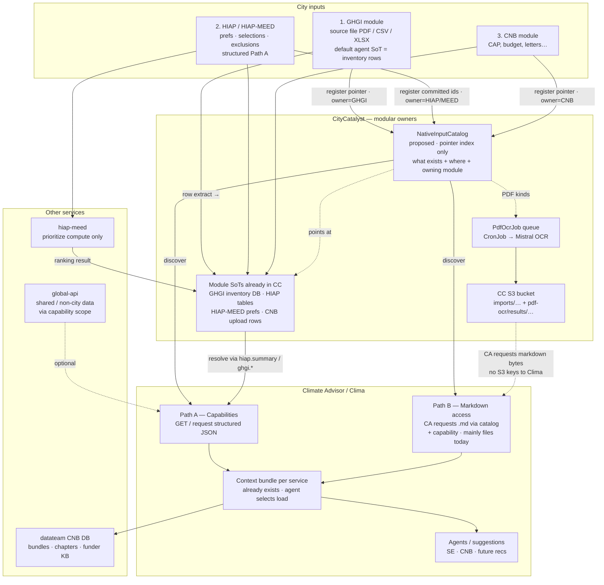
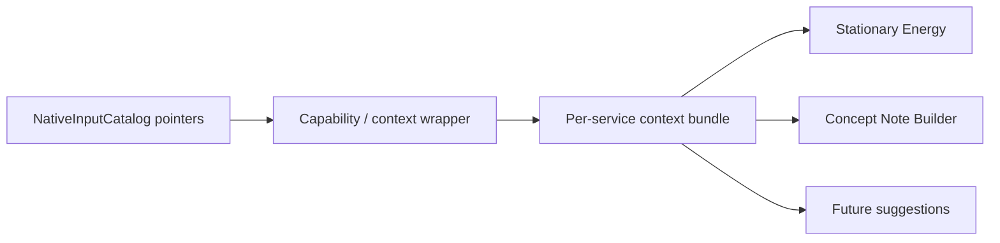

# Native Document Storage Architecture

> Draft for [CC-553](https://linear.app/openearth/issue/CC-553/create-architecture-for-agentic-native-document-storage) · 2026-07-22  
> Status: **draft for stakeholder review** (clarifications 2026-07-23 Piotr/Mirco Slack; 2026-07-24 Mirco PR review)

## One-line intent

CityCatalyst **modules** own city-provided documents and structured intakes (owner = module where the user uploaded / committed). Climate Advisor (Clima) never holds S3 keys; it discovers inputs via a pointer catalog and reads via **typed capabilities** (and optional Markdown access), then uses that context to guide downstream suggestions.

### What this draft is (and is not)

| This draft **is** | This draft **is not** |
| --- | --- |
| Ownership + access layer for city-native intakes (GHGI files, HIAP / HIAP-MEED prefs, CNB uploads) | The Stationary Energy ↔ CNB **context-exchange** design itself |
| Rules so modules do not each invent their own upload cupboard | A requirement that Clima browse GHGI PDFs by default |
| Prerequisite for later SE ↔ CNB / city-wide reuse | A centralized mega-database that stores everything for all services |

The **context bundle** (already how CA scopes context per service) **consumes** this layer — it is not the input store.

**Naming note:** Title keeps “Native document storage” for ticket continuity. In-architecture name for the index is **`NativeInputCatalog`** — documents **and** structured intakes (preferences, selections), not only PDF bytes. Goal: joint foundation / data permeability across modules, without one DB mirroring every service.

## Scope (from original product ask)

Three intakes today / soon:

1. **GHGI onboarding** — city uploads inventory file (source artifact). Clima’s default numbers come from **structured inventory**. Architecture must still allow a later pointer to OCR Markdown in CA context when a step needs it.
2. **HIAP / HIAP-MEED** — preferences / selections (**structured Path A** today). Same conceptual treatment; **different services, schemas, and storage** — do not collapse them in implementation.
3. **Concept Note Builder** — city uploads supporting docs (CAP, budget, letters…). CAP upload may also appear in other modules later (e.g. GHGI); ownership follows **upload module**.

DoD: Mermaid + ownership + how Clima accesses + how inputs inform decisions → then follow-up tickets.

**v1 services in diagram:** CityCatalyst app modules + Climate Advisor (+ hiap-meed as compute for MEED prioritization).  
**`global-api`:** useful Clima resource when scoped via capability / context (usually not city-specific). Confirm with product + data which datasets to expose — prefer **in-scope for architecture**, not deferred indefinitely.

**Related repo docs:** [ConceptNoteBuilderArchitecture.md](./ConceptNoteBuilderArchitecture.md) (CNB/OCR deep dive), [AgenticModuleScope.md](./AgenticModuleScope.md) (Stage-1 agentic scope — Path A capability payloads are the CC-facing contracts that feed those capability layers / module scope).

---

## DoD diagram — target input flow


```mermaid
flowchart TB
  subgraph Intakes["City inputs"]
    GHGI["1. GHGI module<br/>source file PDF / CSV / XLSX<br/>default agent SoT = inventory rows"]
    HIAP["2. HIAP / HIAP-MEED<br/>prefs · selections · exclusions<br/>structured Path A"]
    CNB["3. CNB module<br/>CAP, budget, letters…"]
  end

  subgraph CC["CityCatalyst — modular owners"]
    Catalog["NativeInputCatalog<br/>proposed · pointer index only<br/>what exists + where + owning module"]
    S3["CC S3 bucket<br/>imports/… + pdf-ocr/results/…"]
    OCR["PdfOcrJob queue<br/>CronJob → Mistral OCR"]
    Prod["Module SoTs already in CC<br/>GHGI inventory DB · HIAP tables<br/>HIAP-MEED prefs · CNB upload rows"]
  end

  subgraph Other["Other services"]
    MEED["hiap-meed<br/>prioritize compute only"]
    GlobalAPI["global-api<br/>shared / non-city data<br/>via capability scope"]
    CNBDB["datateam CNB DB<br/>bundles · chapters · funder KB"]
  end

  subgraph CA["Climate Advisor / Clima"]
    PathA["Path A — Capabilities<br/>GET / request structured JSON"]
    PathB["Path B — Markdown access<br/>CA requests .md via catalog<br/>+ capability · mainly files today"]
    Bundle["Context bundle per service<br/>already exists · agent selects load"]
    Agents["Agents / suggestions<br/>SE · CNB · future recs"]
  end

  GHGI -->|"register pointer · owner=GHGI"| Catalog
  HIAP -->|"register committed ids · owner=HIAP/MEED"| Catalog
  CNB -->|"register pointer · owner=CNB"| Catalog

  GHGI -->|"row extract →"| Prod
  HIAP --> Prod
  HIAP --> MEED
  MEED -->|"ranking result"| Prod
  CNB --> Prod

  Catalog -.->|"points at"| Prod
  Catalog -.->|"PDF kinds"| OCR
  OCR --> S3

  Catalog -->|"discover"| PathA
  Catalog -->|"discover"| PathB
  Prod -->|"resolve via hiap.summary / ghgi.*"| PathA
  S3 -.->|"CA requests markdown bytes<br/>no S3 keys to Clima"| PathB
  GlobalAPI -.->|"optional"| PathA

  PathA --> Bundle
  PathB --> Bundle
  Bundle --> CNBDB
  Bundle --> Agents
```

### How to read this (30 seconds)

1. City inputs enter a **CC module** first. **Owner = module of upload / commit** (metadata on the catalog row). Other modules may **read** when the capability wrapper allows — they do not become owner.
2. **`NativeInputCatalog` = pointer index only** (“what we received” + “authoritative storage is at …” + owning module). It is **not** the SoT. SoT remains existing module databases (GHGI inventory, HIAP rankings/selections, HIAP-MEED prefs, CNB upload records, S3 objects).
3. **Two layers for file intakes (e.g. GHGI):**
   - **Storage:** source PDF (+ OCR Markdown in S3) owned by the upload module; catalog registers a pointer.
   - **Clima read (default):** Path A from module SoT (inventory rows, HIAP selections). Optional later: capability step may also load Markdown via catalog pointer.
4. Prefs/rankings stay **structured**. HIAP / HIAP-MEED are Path A today; Path B for HIAP is a **future possibility**, not required now.
5. Clima **discovers** via catalog, then **requests** facts/files through capabilities (no S3 keys). Prefer “CA requests” over “CC pushes bytes” as the mental model; existing `POST .../markdown` shapes can remain as transport while ownership/access stay catalog + capability.
6. **Context bundle** already exists per service: the agent / capability wrapper decides what loads. Services stay **self-contained** (e.g. CNB must not hard-depend on GHGI inputs) but can be **enriched** when catalog + capabilities make another module’s input available.
7. Catalog is **proposed** (facade over existing tables first, or explicit table later) — not implemented.

---

## Ownership

| Input | What is stored | Owner (module) | Clima access |
| --- | --- | --- | --- |
| GHGI PDF + OCR `.md` | S3 + `ImportedInventoryFile` + `PdfOcrJob` | **GHGI** | Path A default (inventory). Markdown via catalog + capability when enabled |
| File uploaded in CNB (CAP, etc.) | S3 + `ConceptNoteUpload` + `PdfOcrJob` | **CNB** | Path B / markdown request → excerpts in that service’s bundle. Other modules may read later if allowed |
| File uploaded in another module later | Same S3 + module-local row | **That module** | Same pattern: owner module; readers via capability |
| HIAP finished state | Last ranking, up to 3 selected actions, output plan (already in CC) | **HIAP** | Path A (`hiap.summary`) |
| HIAP-MEED finished state | Prefs (0a), exclusions (0b), plus ranking / selections / output plan | **HIAP-MEED** (compute in hiap-meed; durable rows in CC) | Path A (MEED-aware summary / fields) — **separate schema from classic HIAP** |
| Context bundle | Run-/service-scoped assembled context | CA orchestrates; datateam CNB DB for CNB runs | Internal |
| Funder / similar projects | Curated research corpus | datateam CNB DB | CNB tools (not city-native) |
| global-api datasets | Shared / mostly non-city | global-api | Optional Path A tools, capability-scoped |

**Hard rules**

1. Clima never gets S3 keys or signed URLs for source/OCR objects.
2. **Owner = module where the user uploaded or committed.** Readers = any module / skill allowed by the capability wrapper. Store owning module on catalog metadata.
3. A file in S3 **may** be made accessible to **all** services later — only through catalog discovery + CA capability / context scope (not open bucket browsing).
4. Path B / markdown access is **opt-in** per use case. Today’s main file path is CNB; architecture stays **extendable** to GHGI and other modules.
5. Re-upload = **new** immutable id; old row soft-deleted / superseded.
6. No cross-DB foreign keys — only shared IDs over APIs. Modules stay self-contained; enrichment is additive.

---

## How Clima gets access

```mermaid
sequenceDiagram
  participant City as City user
  participant Mod as CC module (GHGI / HIAP / CNB)
  participant Cat as NativeInputCatalog
  participant OCR as PdfOcrJob / Mistral
  participant CA as Climate Advisor
  participant Bundle as Context bundle

  Note over City,Bundle: Path A — structured capabilities (default)
  City->>Mod: Upload file / commit HIAP selection
  Mod->>Mod: Persist module SoT
  Mod->>Cat: Register pointer (owner module + stable ids)
  CA->>Cat: Discover available inputs for this service scope
  CA->>Mod: Request capability summary (e.g. hiap.summary)
  Mod-->>CA: Bounded JSON facts
  CA->>Bundle: Load selected facts

  Note over City,Bundle: Path B — Markdown access (files; CA requests)
  City->>Mod: Upload CAP PDF (owner = that module)
  Mod->>OCR: Queue OCR
  OCR->>Mod: Write .md to S3
  Mod->>Cat: Register markdown-ready pointer
  CA->>Cat: Discover file input
  CA->>Mod: Request markdown bytes (via capability; no S3 key)
  Mod-->>CA: Markdown + sha256 + upload_id
  CA->>Bundle: Register + excerpt for this service run
```

### Path A — capability payloads

Clima calls CC internal APIs (and optionally global-api tools). Payloads are the **CC-facing capability contracts** that feed Clima / [AgenticModuleScope](./AgenticModuleScope.md) layers / per-service context bundle assembly.

Live GHGI examples already exist under `/api/v1/internal/ca/capabilities/ghgi/…` (for example `emissions-context`, `list-accessible`). JSON below is **illustrative**.

**GHGI emissions context (illustrative; live) — numbers from inventory SoT:**

```json
{
  "capability": "ghgi.emissions_context",
  "city_id": "city_msp_001",
  "inventory_id": "inv_2024",
  "year": 2024,
  "status": "approved",
  "total_emissions_tco2e": 4120000,
  "sectors": {
    "stationary_energy": 1800000,
    "transportation": 1500000,
    "waste": 820000
  }
}
```

Optional enrichment: advertise related native **inputs** (pointer refs) without making PDF the default SoT — and allow a CA step to request Markdown later:

```json
{
  "native_inputs": [
    {
      "native_input_id": "nin_ghgi_pdf_01",
      "source_kind": "inventory_import",
      "owning_module": "ghgi",
      "label": "GHGI inventory PDF 2024",
      "markdown_ready": true
    }
  ]
}
```

**HIAP / HIAP-MEED summary (target — Path A; option A committed states):**

Capture **finished** user actions only (not every ephemeral API round-trip):

| Service | Persist for Clima (Path A) |
| --- | --- |
| **HIAP** | (1) last ranking (already in CC) (2) up to 3 selected actions (already in CC) (3) generated output plan (already in CC) |
| **HIAP-MEED** | (0a) city preference inputs (0b) excluded / blocked actions + (1)–(3) as above |

```json
{
  "capability": "hiap.summary",
  "city_id": "city_msp_001",
  "hiap_flavor": "classic_or_meed",
  "selected_actions": [
    {
      "action_id": "hiap_sw_12",
      "title": "Green stormwater infrastructure corridor",
      "is_selected": true
    }
  ],
  "strategic_preferences": {
    "sectors": ["water", "infrastructure"],
    "timeframes": ["near_term"],
    "co_benefits": ["equity", "public_health"]
  },
  "excluded_action_ids": [],
  "preference_snapshot_id": "nin_hiap_prefs_01"
}
```

### Path B — Markdown access (request-oriented)

After OCR succeeds, Markdown lives in S3 under the **owning module**. Clima should **request** markdown through catalog + capability (no S3 key). An existing CNB-oriented `POST .../markdown` endpoint can remain as transport; the architecture mental model is **pull via capability**, not “CC owns pushing into CA.”

Today’s primary file consumer is **CNB**. Same mechanism should extend if GHGI (or others) own uploads. HIAP reading Path B is a **future possibility**, not a v1 requirement. Prefs stay Path A.

```http
POST /v1/concept-notes/cnb_run_demo_001/uploads/upl_cap_001/markdown
Authorization: Bearer <cc-to-ca-token>
Content-Type: application/json
```

```json
{
  "markdown": "<!-- page: 1 -->\n# Minneapolis Climate Action Plan\n...\n<!-- page: 34 -->\nTarget: reduce CSO events 40% by 2030.\n",
  "filename": "Minneapolis_CAP_2025.pdf",
  "source_label": "Climate Action Plan",
  "owning_module": "cnb",
  "page_count": 120,
  "sha256": "a3f1c9e8b7d64520123456789abcdef0123456789abcdef0123456789abcdef0"
}
```

CA keeps **excerpts** in the **service-scoped** bundle:

```json
{
  "upload_id": "upl_cap_001",
  "owning_module": "cnb",
  "excerpts": [
    {
      "excerpt_id": "ex_34",
      "page": 34,
      "text": "Target: reduce CSO events 40% by 2030.",
      "used_for": ["problem_statement"]
    }
  ]
}
```

---

## Downstream decisions (why this storage matters)

| Input | Informs today | Informs with this architecture |
| --- | --- | --- |
| GHGI structured inventory | Inventory UI, HIAP inputs, CA GHGI tools | Same + SE prefilling + CNB emissions context when capability allows |
| GHGI / other module source PDF | Row extraction / module-local use | Catalog pointer; other modules may read Markdown if scoped; optional CA Markdown step |
| HIAP / HIAP-MEED committed state | HIAP UI / prioritizer | Any Clima skill via Path A summary (separate schemas) |
| CNB uploads | — (storage adapter pending) | Concept note draft, evidence, gaps |
| global-api | Limited / TBD | Optional Clima tools after product+data agree |
| Funder KB / similar projects | Research pipeline | CNB examples (curated) |


```mermaid
flowchart LR
  Cat["NativeInputCatalog pointers"] --> Cap["Capability / context wrapper"]
  Cap --> Bundle["Per-service context bundle"]
  Bundle --> SE["Stationary Energy"]
  Bundle --> CNBw["Concept Note Builder"]
  Bundle --> Recs["Future suggestions"]
```

This matches the **existing** CA pattern: dedicated context bundle per service; the agent decides what loads. Catalog informs availability; wrappers enforce scope so services are not tightly coupled.

---

## Current state vs target (short)

| Intake | Now | Target |
| --- | --- | --- |
| GHGI PDF | S3 + `PdfOcrJob` + row extract; CA = Path A inventory | Owner = GHGI; catalog pointer; Path A default; optional Markdown capability later |
| HIAP / HIAP-MEED | Rankings / selections / plans already in CC for classic HIAP; MEED prefs often weaker / request-scoped | **Option A:** expose finished states via Path A; keep HIAP vs HIAP-MEED schemas distinct |
| CNB uploads | Ingest endpoint; `503 cnb_storage_unavailable` | Owner = CNB; OCR + CA markdown **request** + storage adapter |
| global-api | Not in prior v1 cut | Architecture includes optional capability-scoped use; product+data pick datasets |

---

## Integration — no breaking changes

| Keep | Extend later (follow-up tickets) |
| --- | --- |
| `PdfOcrJob` + cron + Mistral | Resolvers per owning module; inventory no auto-delivery by default |
| GHGI capability routes | `hiap.summary` (+ MEED fields); optional markdown request capability |
| CNB `POST .../markdown` transport | Datateam storage adapter; align naming with “CA requests via catalog” |
| HIAP + HIAP-MEED as separate stacks | Path A over **committed** CC rows; hiap-meed remains compute-only |
| Per-service context bundles | Feed discovery from `NativeInputCatalog` |

Suggested follow-ups: `NativeInputCatalog` facade · HIAP / HIAP-MEED Path A summaries · CNB upload + markdown access · CA storage adapter ([CC-570](https://linear.app/openearth/issue/CC-570/placeholder-implementation)) · optional Markdown for non-CNB owners · global-api capability shortlist with product/data · CA tool “summarize all context we hold for this city” (prefer over a net-new frontend page for v1 visibility).

---

## Constraints

| Constraint | Note |
| --- | --- |
| ~20 MB PDF working cap | Ops plan needed for larger files |
| S3 required for PDF OCR | Missing bucket → 503 |
| Permissions | Same city/project checks as module routes + capability scope |
| Versioning | Immutable sources; new upload = new id |
| Compliance | Follow CC file lifecycle until product/legal say otherwise |
| Cross-DB | API IDs only — no FK across module/CNB DBs |
| Module isolation | No hard cross-module dependency; enrichment only when available |

---

## Open questions (review)

1. Catalog implementation: lean facade over existing tables first, or new `NativeInput` table now?
2. Default for GHGI Markdown in CA: off until a specific step opts in? (Proposal: **yes** — inventory Path A default; architecture enables pointer → Markdown.)
3. **HIAP / HIAP-MEED:** Option **A** adopted for review (committed finished states). Confirm field lists above match production tables; wire `hiap.summary` (+ MEED variant) without merging schemas.
4. Bundle stays **per-service / per-run** in v1; catalog enables later city-wide discovery — confirm.
5. Is `UserFile` BYTEA in-scope for agentic native inputs?
6. **global-api:** which datasets first? (Architecture: in-scope when capability-scoped; needs product + data.)
7. Extra retention/audit rules beyond current CC lifecycle?
8. User-visible “we already received this”: prefer CA tool **“summarize all my context”** listing stored inputs + locations; new frontend page only if product requires it.
9. Loop in **Milan** (and product) before locking implementation tickets?

---

## Document status

| Item | Status |
| --- | --- |
| Mermaid: intakes → module SoTs → catalog → Clima | Updated (2026-07-24 Mirco PR notes) |
| Ownership = upload module | Updated |
| `NativeInputCatalog` pointer model | Updated |
| Clima access Path A/B + request framing | Updated |
| Downstream / existing context bundles | Updated |
| HIAP option A + HIAP≠MEED | Updated |
| global-api in architecture scope | Updated (dataset pick TBD) |
| Constraints | Drafted |
| Stakeholder review | Mirco **approved** PR with inline notes; Piotr Slack in progress |
| Follow-up implementation tickets | Pending after doc sync + any remaining open Qs |
