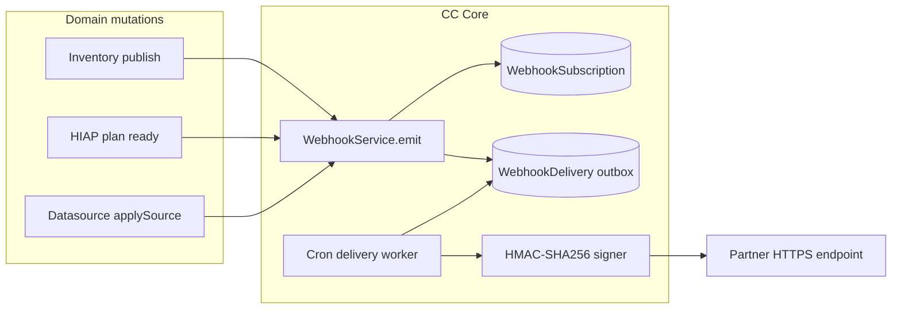
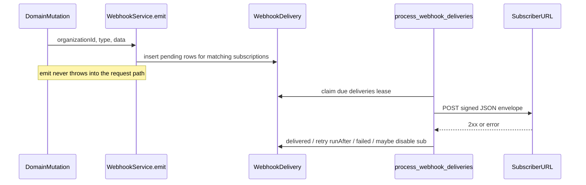
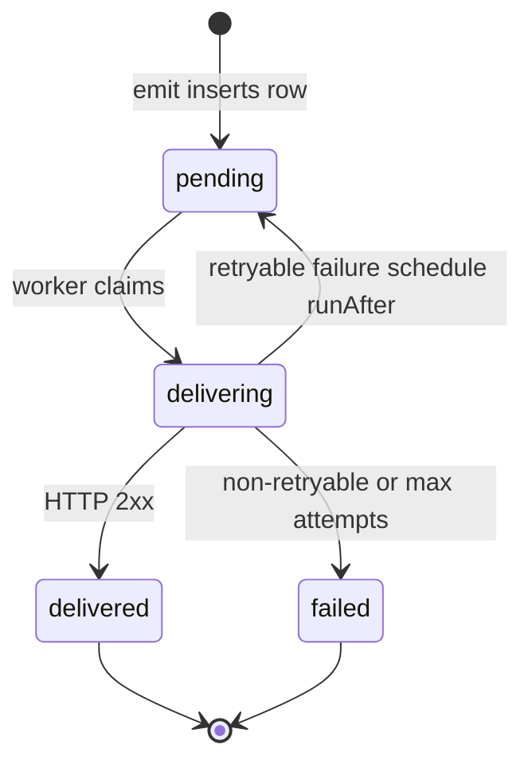

# Webhooks / Eventing Backbone Architecture

> Approved architecture for [CC-669](https://linear.app/openearth/issue/CC-669/webhooks-eventing-backbone-subscriptions-signed-delivery) · 2026-08-10  
> Status: **approved — implemented in CC Core**

## One-line intent

CityCatalyst **pushes** typed, HMAC-signed domain events to partner HTTPS endpoints so integrations react when something changes — without polling the API.

### Clear goal (why this exists)

There is no product way for an external system to learn that something happened in CityCatalyst (inventory published, plan generated, data source connected). Every integration must poll. A platform that other systems build on needs **outbound event delivery**: partner tools, monitoring dashboards, reporting pipelines, and event-triggered workflows.

| With webhooks | Without webhooks |
| --- | --- |
| Partner registers a URL + event filter once | Partner polls invent­ory / plan / datasource APIs |
| CC posts a signed envelope when the domain mutation succeeds | Latency and load scale with poll interval |
| Delivery is async (outbox + worker); user requests never wait on partners | Hard to build reliable “react when X happens” integrations |

### What this document is (and is not)

| This document **is** | This document **is not** |
| --- | --- |
| End-to-end design for **outbound** webhooks: taxonomy, subscriptions, signed delivery, outbox, API, ops | A general microservice event bus (Kafka / Redis Streams) |
| Org-scoped subscription + delivery contracts for CC Core | Inbound webhooks *from* partners into CC |
| Stable partner-facing envelope + signature rules | Settings UI / RTK (deferred; API-only for the backbone ticket) |
| v1 emit map for three core events + reserved catalog | Exactly-once delivery (we commit to **at-least-once**) |

**In-architecture name:** **Webhooks Eventing Backbone** — subscriptions + signed delivery inside CityCatalyst Core (`app/`).

**Related work (siblings, out of scope here):** disclosure adapters (CC-668), OAuth registration (CC-670), OIDC (CC-671), public SDKs (CC-663).

---

## Where the backbone lives (decision)

**Webhooks live in CityCatalyst Core** (Next.js API + PostgreSQL), not in Climate Advisor, HIAP, or a new microservice.

| Option | Verdict | Why |
| --- | --- | --- |
| **CC Core + Postgres outbox + CronJob (chosen)** | Chosen | Auth, org tenancy, and domain mutations already live here. Proven pattern: `PdfOcrJob` delivery claim/retry + k8s cron. No new infra for v1. |
| Separate event microservice + Redis/Bull | Rejected for v1 | Extra ops and auth surface; premature until volume demands it. |
| Sync HTTP POST inside domain handlers | Rejected | Couples user latency to partner uptime; risk of partial failures. |
| Climate Advisor owns subscriptions | Rejected | Partners integrate with CC the product; CA must not become SoT for org webhooks. |

---

## End-to-end system design

How everything comes together:



### Runtime sequence



### Component responsibilities

| Component | Responsibility |
| --- | --- |
| Domain handlers / services | Call `emit` after a successful durable mutation; do not POST to partners themselves |
| `WebhookService` | Org-admin CRUD; `emit(organizationId, type, data)` fan-out into the outbox |
| `WebhookSubscription` | Partner endpoint config: URL, events allow-list, encrypted secret, enabled flag |
| `WebhookDelivery` | Outbox row: payload snapshot, status, attempts, schedule |
| `WebhookDeliveryService` | Claim, sign, POST, backoff, disable-on-failure |
| Cron route + k8s CronJob | Periodically drain the outbox (same auth model as PDF OCR cron) |

**Intended code layout:**

| Layer | Path |
| --- | --- |
| Event catalog | `app/src/backend/webhooks/events.ts` |
| CRUD + emit | `app/src/backend/webhooks/WebhookService.ts` |
| Delivery worker logic | `app/src/backend/webhooks/WebhookDeliveryService.ts` |
| Crypto / HMAC | `app/src/util/webhook-crypto.ts`, `app/src/util/webhook-signature.ts` |
| CRUD API | `app/src/app/api/v1/organizations/[organization]/webhooks/...` |
| Cron | `app/src/app/api/v1/cron/process-webhook-deliveries/route.ts` |
| Models + migrations | `app/src/models/Webhook*.ts`, `app/migrations/...` |

**Pattern reuse:** [`PdfOcrDeliveryService`](../app/src/backend/PdfOcrDeliveryService.ts) (claim / `deliveryRunAfter` / exponential backoff) and [`process-pdf-ocr-jobs`](../app/src/app/api/v1/cron/process-pdf-ocr-jobs/route.ts) (Bearer `CC_CRON_JOB_API_KEY`). Webhooks add **HMAC signing** and a **subscription** layer that OCR delivery does not have.

---

## Event taxonomy

### Naming

- Format: `{domain}.{past_tense_verb}`
- Lowercase ASCII, dot-separated (Stripe / GitHub style)
- Domains for v1: `inventory`, `plan`, `datasource`
- Past tense signals “this already happened” (not a command)

Examples: `inventory.published`, `plan.generated`, `datasource.connected`.

### Envelope (stable partner contract)

Every delivery POSTs a JSON body:

```json
{
  "id": "550e8400-e29b-41d4-a716-446655440000",
  "type": "inventory.published",
  "created_at": "2026-08-10T08:00:00.000Z",
  "data": {
    "inventoryId": "...",
    "cityId": "...",
    "organizationId": "...",
    "year": 2024,
    "publishedAt": "2026-08-10T08:00:00.000Z"
  }
}
```

| Field | Meaning |
| --- | --- |
| `id` | Delivery UUID (= outbox row id). **Idempotency key** for receivers |
| `type` | Event type from the catalog |
| `created_at` | When CC recorded the event for delivery (ISO-8601 UTC) |
| `data` | Domain payload — small IDs and scalars only; no large blobs |

### Versioning policy

- **Additive** fields inside `data` are allowed without renaming the event type.
- **Breaking** changes (remove/rename/repurpose fields, change meaning of `type`) require a **new event type** (e.g. `inventory.published.v2`) rather than silent schema breakage.
- No top-level `api_version` in v1; the event type string is the contract identity.

### Subscription filter

- Each subscription stores an **allow-list** of event types (non-empty).
- Only enabled subscriptions whose allow-list contains the emitted type receive a delivery row.
- Wildcard `"*"` is **not** supported in v1 (explicit types only → safer partner review).

---

## Catalog

### v1 — emitted in this backbone

| Event type | When it fires | Emit site (anchor) | `data` fields |
| --- | --- | --- | --- |
| `inventory.published` | Inventory transitions from private → public | `PATCH` [`inventory/[inventory]/route.ts`](../app/src/app/api/v1/inventory/[inventory]/route.ts) after successful update when `isPublic` becomes true (`publishedAt` set) | `inventoryId`, `cityId`, `organizationId`, `year`, `publishedAt` |
| `plan.generated` | Action plan newly created / ready | [`HiapApiService`](../app/src/backend/hiap/HiapApiService.ts) after successful `upsertActionPlan` when the plan is newly created (same readiness moment as the “plan ready” email) | `planId`, `cityId`, `organizationId`, `rankingId`, `actionName`, `createdAt` |
| `datasource.connected` | A third-party / catalogue source is successfully applied to an inventory | [`DataSourceService.applySource`](../app/src/backend/DataSourceService.ts) when result is success (covers connect, connect-all, admin, agentic paths) | `datasourceId`, `inventoryId`, `cityId`, `organizationId`, `datasourceName` (optional) |

**Org resolution for emit:** Inventory / city → `City.projectId` → `Project.organizationId`. Emit is a no-op (logged) if organization cannot be resolved.

**Unpublish:** setting `isPublic` back to false does **not** emit `inventory.published`. See reserved `inventory.unpublished` below.

### Reserved — defined in catalog, not emitted until follow-ups

Documented so partners and product share a roadmap. Implementation may register these in a TypeScript enum without emit hooks.

| Event type | Intended trigger |
| --- | --- |
| `inventory.unpublished` | Inventory becomes private again |
| `inventory.deleted` | Inventory hard-deleted |
| `datasource.disconnected` | Source unlinked from inventory |
| `city.created` | City created under a project |
| `organization.updated` | Org branding / active status changes that partners care about |

Adding a reserved type to “emitted” requires a small follow-up ticket (emit hook + tests), not a redesign of the backbone.

---

## Subscription model

### Tenancy

- Subscriptions are **organization-scoped**.
- An org only receives events for domain objects that resolve to that organization.
- Management API: org-admin or global admin via `UserService.validateIsAdminOrOrgAdmin` (same gate as org branding / invitations).

### Fields

| Field | Notes |
| --- | --- |
| `id` | UUID |
| `organizationId` | FK → Organization |
| `name` | Human label |
| `url` | HTTPS endpoint only |
| `secretCiphertext` / `secretIv` / `secretAuthTag` | AES-256-GCM ciphertext of the signing secret |
| `secretPrefix` | Short prefix for support/debug (never enough to forge) |
| `events` | Non-empty array of catalog event types |
| `enabled` | Soft switch; disabled subscriptions skip emit |
| `consecutiveFailures` | Incremented on exhausted / hard failures; reset on success |
| `disabledAt` | Set when auto-disabled after failure threshold |
| `createdBy` | User who created the subscription |
| timestamps | `created` / `lastUpdated` |

### Secret lifecycle

| Step | Behavior |
| --- | --- |
| Create | Server generates a 32-byte random secret; returns **plaintext once** in the create response; stores encrypted at rest |
| List / get | Secret **never** returned again |
| Rotate | `POST .../webhooks/{id}/rotate-secret` generates a new secret, returns plaintext once, invalidates the old secret |
| At rest | AES-256-GCM with env `WEBHOOK_SECRET_ENCRYPTION_KEY` (32-byte key, base64 in env) |

PAT-style **hash-only** storage is insufficient: the worker must recover the secret to sign outbound bodies.

---

## Signed delivery contract

### HTTP

- Method: `POST`
- Content-Type: `application/json`
- Body: envelope JSON (exact bytes used for the signature)

### Headers

| Header | Value |
| --- | --- |
| `X-CityCatalyst-Event` | Event type string |
| `X-CityCatalyst-Delivery` | Delivery UUID (`id`) |
| `X-CityCatalyst-Timestamp` | Unix time in **seconds** |
| `X-CityCatalyst-Signature` | `sha256=<hex>` |

### Signature algorithm

1. Let `timestamp` = value of `X-CityCatalyst-Timestamp`.
2. Let `rawBody` = exact UTF-8 request body.
3. Let `signedPayload` = `` `${timestamp}.${rawBody}` ``.
4. `HMAC-SHA256(secret, signedPayload)` → hex digest.
5. Header value: `sha256=<hex>`.

Partners should:

- Reject timestamps outside a skew window (e.g. ±5 minutes) to limit replay.
- Compare digests with a constant-time compare.
- Treat `X-CityCatalyst-Delivery` / envelope `id` as the idempotency key.

### URL rules

- `https://` only at create/update (reject `http://` and non-URL values).
- v1 documents SSRF follow-up: block private/link-local ranges in a later hardening pass; https-only is the initial bar.

### Delivery semantics

- **At-least-once.** Retries may duplicate POSTs; receivers must be idempotent on delivery id.
- Payload is a **snapshot** at emit time (stored on the outbox row), not re-read from live domain tables at delivery time.

---

## Outbox and delivery state machine

### `WebhookDelivery` fields

| Field | Notes |
| --- | --- |
| `id` | UUID (= envelope `id`) |
| `subscriptionId` | FK |
| `eventType` | Catalog type |
| `payload` | JSONB envelope body (or `{ type, created_at, data }` assembled at send) |
| `status` | `pending` \| `delivering` \| `delivered` \| `failed` |
| `attemptCount` | Integer |
| `runAfter` | Next eligible attempt (null when due immediately) |
| `deliveredAt` | Set on success |
| `lastHttpStatus` | Last partner response code if any |
| `lastError` | Truncated error message / code |

Index for claiming: `(status, runAfter)`.

### Status flow



### Retry policy

Aligned with PDF OCR delivery:

- Delay: `min(60_000 * 2^(attempt - 1), 900_000)` ms (1m → 15m cap).
- Retryable: network errors, HTTP 408 / 429 / 5xx.
- Non-retryable: HTTP 4xx (except 408/429), invalid subscription secret decrypt, permanent config errors → `failed`.
- Max attempts: **8** (covers ~ several hours of backoff). After max → `failed`.
- **Subscription auto-disable:** if `consecutiveFailures` reaches **10** successful claim cycles that end in failure for that subscription, set `enabled=false` and `disabledAt=now` (stops further fan-out until an org-admin re-enables).

### Emit guarantees

- `emit` inserts outbox rows inside its own try/catch; failures are **logged** and **must not** fail the domain request.
- Prefer emitting **after** the domain write has committed successfully.

---

## HTTP API (management)

All under `/api/v1/organizations/{organization}/webhooks`. Auth: session/JWT/PAT as usual + org-admin check.

| Method | Path | Behavior |
| --- | --- | --- |
| `GET` | `/` | List subscriptions for the org (no secrets) |
| `POST` | `/` | Create; response includes `secret` **once** |
| `GET` | `/{webhookId}` | Get one (no secret) |
| `PATCH` | `/{webhookId}` | Update name, url, events, enabled |
| `DELETE` | `/{webhookId}` | Delete subscription (+ cascade pending deliveries or mark abandoned) |
| `POST` | `/{webhookId}/rotate-secret` | New secret returned once |

Validation (Zod): HTTPS URL; non-empty `events` subset of catalog; name length bounds.

OpenAPI/Swagger JSDoc on routes (project convention). Admin **Manage Webhooks** UI uses RTK Query against this API.

---

## Emit map (v1 code anchors)

| Event | Sync vs async today | Hook placement |
| --- | --- | --- |
| `inventory.published` | Sync request path | After `inventory.update` when transitioning to public |
| `plan.generated` | Request path with in-process HIAP poll | After successful plan upsert when `created === true`, co-located with plan-ready email side-effect |
| `datasource.connected` | Sync request path | Inside `applySource` on success so **all** callers share one emit |

Unpublish / disconnect / delete do not emit until reserved events are implemented.

---

## Operations

### Cron worker

- Route: `POST /api/v1/cron/process-webhook-deliveries`
- Auth: `Authorization: Bearer $CC_CRON_JOB_API_KEY` (same as PDF OCR / HIAP cron jobs)
- k8s: `k8s/cc-process-webhook-deliveries.yml` (+ test/prod variants), CronJob every **5 minutes** (`*/5 * * * *`)
- Terminal deliveries (`delivered` / `failed`) older than **30 days** are purged each worker run to keep the outbox bounded

### Environment

| Variable | Purpose |
| --- | --- |
| `WEBHOOK_SECRET_ENCRYPTION_KEY` | Base64 32-byte AES-256-GCM key for subscription secrets |
| `CC_CRON_JOB_API_KEY` | Existing cron auth (reuse) |

Document both in `app/env.example`.

### Observability (minimum v1)

- Structured logs on emit fan-out count, delivery success/failure, auto-disable.
- Optional later: metrics counters (follow observability epic; not blocking backbone).

---

## Security and tenancy

| Concern | v1 stance |
| --- | --- |
| Org isolation | CRUD scoped by `organizationId`; emit only to that org’s subscriptions |
| Secrets | Encrypted at rest; plaintext only on create/rotate responses; never in lists or logs |
| Transport | HTTPS subscriber URLs only |
| Replay | Timestamp in signed payload; partner skew window |
| SSRF | HTTPS-only now; private IP blocklist documented as follow-up |
| Admin abuse | Org-admin required to manage endpoints |

---

## Acceptance criteria

Testable outcomes for CC-669 implementation against this design:

1. Org-admin can create, list, update, and delete webhook subscriptions via the org API; non-admins receive 403.
2. Create (and rotate) responses include the signing secret exactly once; subsequent GETs do not.
3. Matching enabled subscriptions receive a pending `WebhookDelivery` when:
   - an inventory is published,
   - an action plan is newly generated, or
   - a datasource is successfully connected.
4. The cron worker POSTs the signed envelope to the subscriber URL and marks deliveries `delivered` on 2xx.
5. Retryable failures reschedule with exponential backoff; permanent / max-attempt failures mark `failed`; repeated failures can auto-disable the subscription.
6. Domain requests still succeed if emit or enqueue fails (logged, non-blocking).
7. This architecture document is checked in under `docs/WebhooksArchitecture.md`.
8. Automated tests cover signature construction, CRUD auth, emit → outbox, and delivery success/retry paths.

---

## Open questions / follow-ups

- Settings UI + RTK hooks for org admins (admin panel **Manage Webhooks** tab).
- Partner-facing public documentation site page (beyond this internal architecture + OpenAPI).
- SSRF hardening (block RFC1918 / link-local / metadata IPs).
- Expanding emits from the reserved catalog.
- Delivery attempt history UI / export for support.
- Whether event-triggered **email** should share this outbox or stay on `NotificationService` (recommend: keep email separate in v1; webhooks are for HTTPS partners).

---

## Decision log

| Date | Decision |
| --- | --- |
| 2026-08-10 | Org-scoped subscriptions; API-only management for backbone ticket |
| 2026-08-10 | v1 emits: `inventory.published`, `plan.generated`, `datasource.connected` |
| 2026-08-10 | Postgres outbox + CronJob (PdfOcr pattern); no Redis/Bull |
| 2026-08-10 | AES-GCM encrypted secrets; plaintext returned once on create/rotate |
| 2026-08-10 | HMAC-SHA256 over `${timestamp}.${rawBody}`; headers `X-CityCatalyst-*` |
| 2026-08-14 | Stakeholder go-ahead; implement on `feature/CC-669-webhooks-eventing-backbone` |
