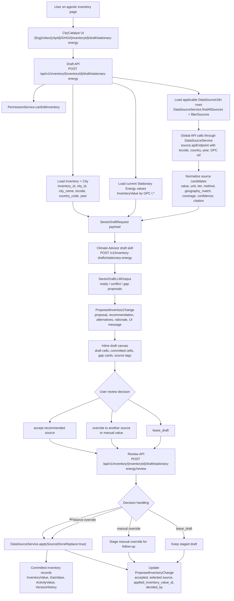
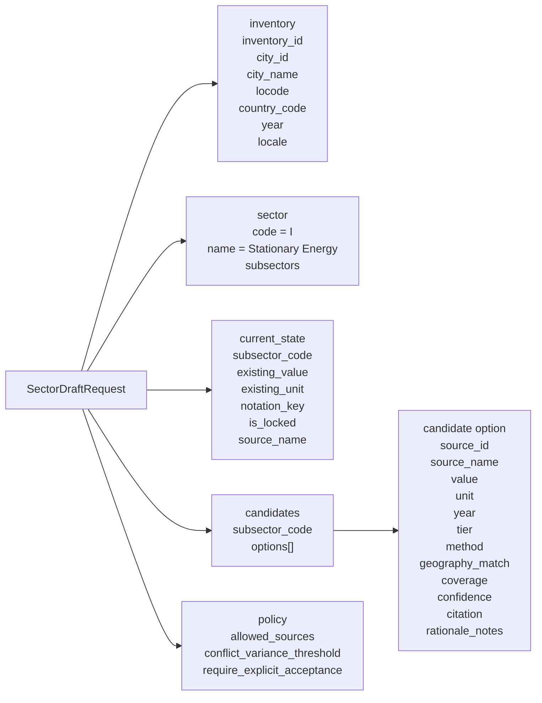
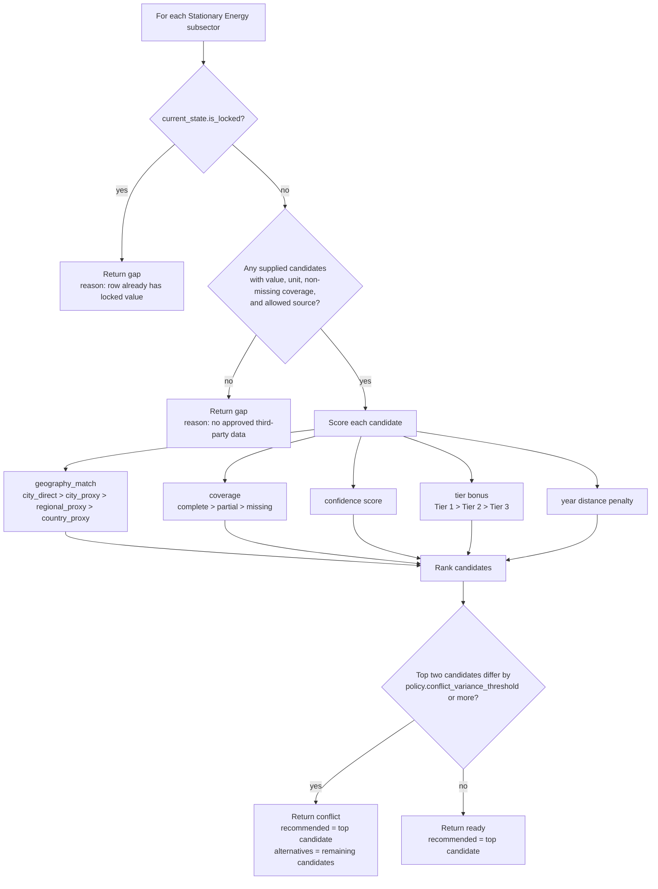
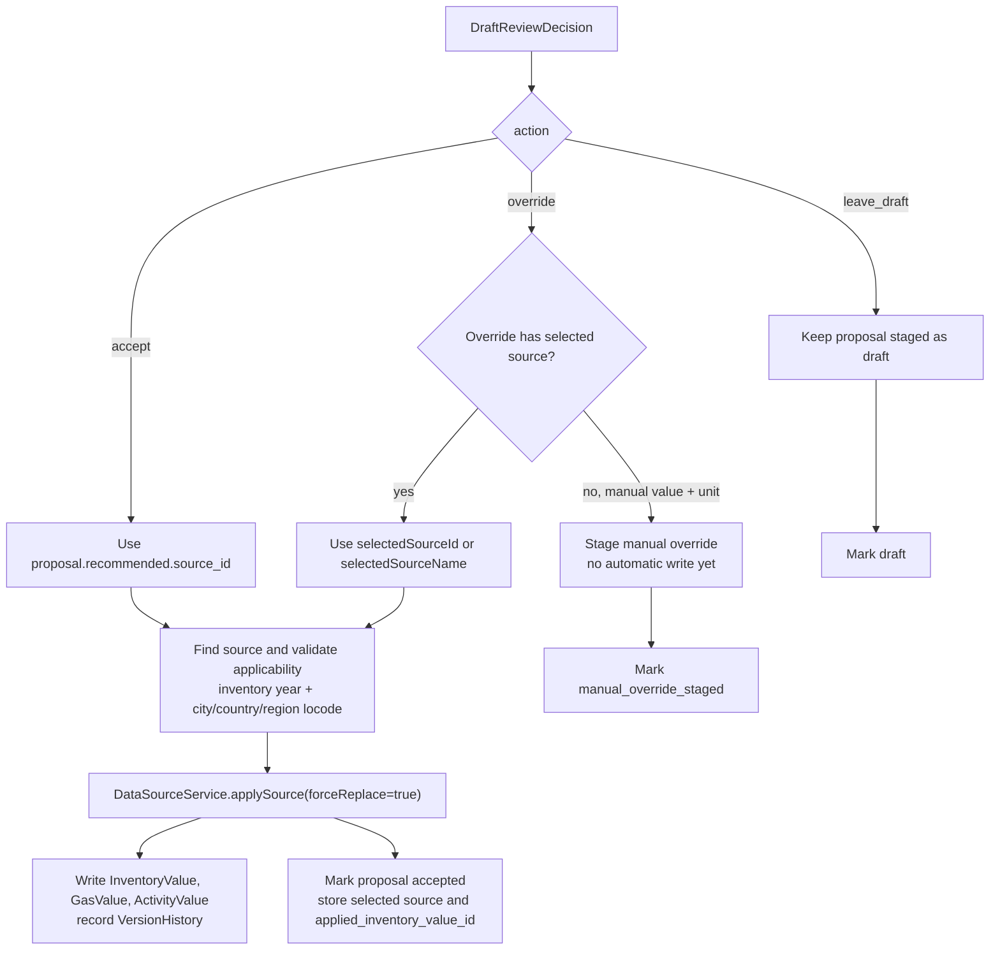

# Agentic Inventory Drafting Current Flow

This document describes the implemented Stationary Energy bulk-filler flow as it exists now. It focuses on responsibility boundaries, the data sent to Climate Advisor, and the decisions the CA/LLM-shaped draft skill is allowed to make.

## Big Picture

The agentic page does not let Climate Advisor search the whole product or write inventory values directly. CityCatalyst owns the inventory, city, permissions, catalogue lookup, Global API calls, staging table, and final write. Climate Advisor receives a bounded, city-scoped payload and returns draft proposals only.



## Call Chain And Ownership

| Step | Owner | Responsibility | Data passed forward |
| --- | --- | --- | --- |
| Page entry | CityCatalyst UI | Displays scoped drafting surface and calls the draft API. | `cityId`, `inventoryId`, `locale`, `sectorCode = I` |
| Draft API | CityCatalyst API | Validates permission, inventory/city match, and sector scope. | Authenticated user session, inventory id, city id |
| Inventory state | CityCatalyst backend | Loads city and current Stationary Energy state. | Existing values, notation keys, locked rows, source names |
| Source selection | `DataSourceService` | Filters catalogued sources by inventory year and city/country/region locode. | Applicable Global API-backed sources |
| Source retrieval | Global API | Returns emissions data for specific source, city, year, and GPC reference. | `totals.emissions`, records, quality metadata |
| Candidate normalization | CityCatalyst backend | Converts raw source response into comparable candidates. | Value, unit, tier, coverage, confidence, citation |
| Draft decision | Climate Advisor | Ranks supplied candidates and returns proposals only. | `ready`, `conflict`, or `gap` proposals |
| Proposal staging | CityCatalyst DB | Stores draft output before user acceptance. | `ProposedInventoryChange` rows |
| Review | CityCatalyst API | Applies user decisions and commits only accepted/source-overridden proposals. | `InventoryValue`, `GasValue`, `ActivityValue`, audit fields |

## What Climate Advisor Sees

Climate Advisor sees only the bounded `SectorDraftRequest` assembled by CityCatalyst:



Climate Advisor does not receive arbitrary user files, all city data, other sectors, unrelated module state, credentials, or permission context. It also does not call the Global API directly in the current implementation. CityCatalyst has already fetched and normalized the source candidates before CA runs.

## What Climate Advisor Can Decide

For each Stationary Energy subsector, Climate Advisor can return exactly one of these proposal states:

| Proposal state | Meaning | Required output | UI behavior |
| --- | --- | --- | --- |
| `ready` | One usable candidate is clearly selected. | `recommended` source/value/unit plus rationale. | Shows an inline draft cell with source tag. |
| `conflict` | More than one usable candidate exists and the top two differ meaningfully. | `recommended`, `alternatives`, `needs_user_choice = true`. | Shows chosen draft plus decision card to keep or switch source. |
| `gap` | No usable candidate exists, or row is already locked/committed. | No `recommended`; rationale explains why. | Shows empty/gap state or committed existing row. |

The CA decision is ranking and explanation only. It cannot commit values, bypass review, invent new sources, change the inventory schema, or write to `InventoryValue`.

## Decision Logic Inside The Draft Skill

The current Climate Advisor service uses the same bounded model shape as an LLM skill, but the implemented `generate_stationary_energy_draft` function is deterministic ranking. If the LLM runtime is swapped in, the same Pydantic request/response envelope should remain the guardrail.



The ranking score currently favors:

- More specific geography, with `city_direct` strongest.
- More complete coverage.
- Higher confidence computed from source quality and fit.
- Better source tier.
- Source year closer to the inventory year.

## User Review Decisions

User review is separate from CA drafting. The review API accepts only explicit decisions and then decides whether a database write is allowed.



Review action contract:

| Action | Who chooses it | Effect |
| --- | --- | --- |
| `accept` | User or `Accept all` button | Applies the recommended source through `DataSourceService.applySource`. |
| `override` with selected source | User conflict/source decision | Applies the selected source instead of the recommended one. |
| `override` with manual value/unit | User manual correction | Stages the manual override for follow-up; it is not auto-committed by this flow. |
| `leave_draft` | User or gap handling | Leaves the proposal staged; no inventory value is written. |

## Pydantic Boundary

Climate Advisor validates the draft request and output with Pydantic. The important models are:

```python
class SectorDraftRequest(BaseModel):
    inventory: InventoryDraftContext
    sector: SectorDraftContext
    current_state: List[CurrentSubsectorState] = Field(default_factory=list)
    candidates: List[SubsectorCandidateSet] = Field(default_factory=list)
    policy: DraftPolicy = Field(default_factory=DraftPolicy)


class SectorDraftLLMOutput(BaseModel):
    run_id: str
    inventory_id: str
    city_id: str
    city_name: str
    locode: str
    sector_code: str
    locale: Literal["en", "es", "pt"]
    proposals: List[SubsectorDraftProposal] = Field(default_factory=list)


class DraftReviewDecision(BaseModel):
    proposal_id: str
    subsector_code: str
    action: DraftReviewActionType
    selected_source_id: Optional[str] = None
    selected_source_name: Optional[str] = None
    override_value: Optional[float] = None
    override_unit: Optional[str] = None
    note: Optional[str] = None
```

The output validator enforces:

- `gap` proposals must not contain a recommended value.
- `ready` and `conflict` proposals must include a recommended value.
- `conflict` proposals must include at least one alternative.

The review validator enforces:

- `override` must include either a selected source or a manual value and unit.
- `accept` and `leave_draft` must not include override fields.

## Current Implementation Notes

- The first implemented sector is Stationary Energy only, `sectorCode = I`.
- The implemented CA route is `POST /v1/inventory-drafts/stationary-energy`.
- The CityCatalyst draft route is `POST /api/v1/inventory/{inventoryId}/draft/stationary-energy`.
- The CityCatalyst review route is `POST /api/v1/inventory/{inventoryId}/draft/stationary-energy/review`.
- Draft proposals are staged in `ProposedInventoryChange`.
- Accepted/source-overridden values are committed through existing inventory infrastructure, not by Climate Advisor.
- Existing committed values are shown as committed rows on the agentic page and are treated as locked by the draft skill.
