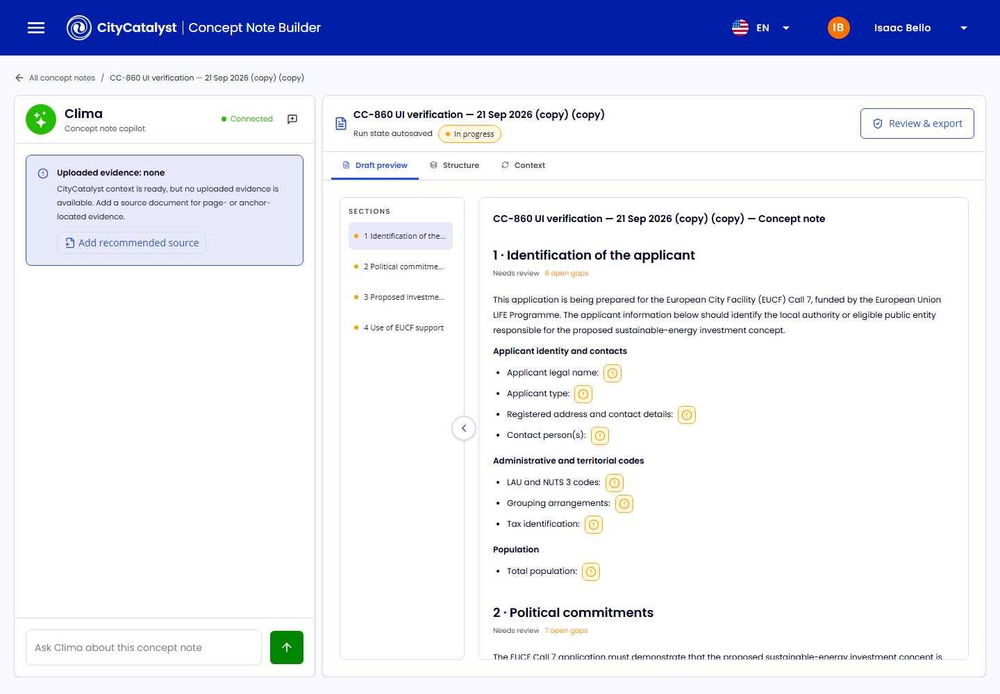
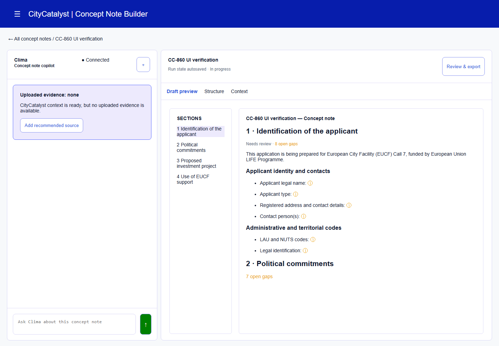
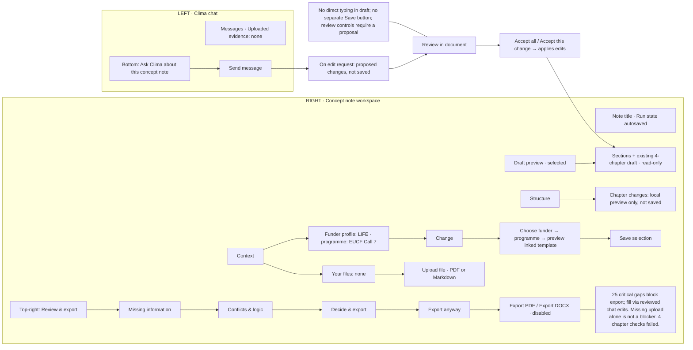

# CC-860: UI grounding experiments — full report

## Decision

Use a stable semantic UI tree plus per-turn state. The selected second revision corrected ambiguous template wording and scored 10/10 on the five questions in one run. This is not a statistically established ranking or deployment proof.

[Implementation PR #3182](https://github.com/Open-Earth-Foundation/CityCatalyst/pull/3182) · [Selected context](selected-context.txt) · [Runtime prompt](../../../climate-advisor/prompts/cnb/chat.md)

## Method and limitations

On 21 September 2026, five representations were tested using the configured `openai/gpt-5.6-sol`, high reasoning. Each question was an isolated real API call with the existing CNB system prompt and identical experiment instruction. No mocked model answers. The UI was inspected in authenticated Chromium at 1440 × 1000 on citycatalyst.openearth.dev. A copied note had four generated chapters, LIFE/EUCF Call 7 funding, no files, and 25 critical gaps.

The screenshot exposes only the visible screen. Text formats also describe hidden controls and workflows: this compares practical context packages, not encoding with identical information. The semantic tree is curated, not a raw accessibility dump. Mermaid was sent as source text, HTML as HTML/CSS source, and the screenshot as high-detail image input. Edit labels/lifecycle were checked against code; accepting edits and persistence were not tested. Known review failures must not be assumed to be export blockers.

One run per question. Scores are human assessments: 0 incorrect, 1 partial/material error, 2 correct navigation and relevant state. Output tokens include reasoning. `cost_details.upstream_inference_cost` is used because this BYOK connection reports top-level cost=0. Caching/cache-write charges affect actual totals. Context-only text counts use o200k_base; table increments are API-measured versus a calibration request and include packaging.

## Five-format comparison

| Format | Additional input tokens | Five-call input / output tokens | Upstream USD | Score |
| --- | ---: | ---: | ---: | ---: |
| screenshot | 1729 | 17020 / 575 | $0.058796 | 7/10 |
| html | 1423 | 15490 / 531 | $0.050266 | 9/10 |
| mermaid | 318 | 9965 / 476 | $0.021541 | 9/10 |
| tree | 422 | 10485 / 432 | $0.023261 | 10/10 |
| action_map | 369 | 10220 / 414 | $0.021576 | 9/10 |

Comparison cost: $0.175440 for 25 calls, plus $0.011902 calibration = $0.187342. At the contemporaneous direct Sol input price of $4/million tokens, the 1,729-token screenshot increment corresponds to $0.006916 uncached input, excluding the rest of the request. Actual upstream costs above include cache effects. [Pricing](https://developers.openai.com/api/docs/models/gpt-5.6-sol).

### Assessment details

- Screenshot: draft 2, funding 1, upload 1, edit 2, export 1. Cannot see unopened tabs; Add recommended source opens Context but the answer omits Upload file.
- HTML: 2,2,2,2,1. Export answer also treats failed/unreviewed chapters as potential blockers without establishing that.
- Mermaid: 2,2,2,2,1. Export answer conflates failed checks with blockers and abbreviates navigation.
- Semantic tree: 2,2,2,2,2. Most consistently useful initial format.
- Action map: 1,2,2,2,2. Ambiguous “Sections or document” becomes an invented view choice.

## Selected version and refinement

The first combined tree/live-state run cost $0.023066 (10,410 input / 441 output tokens; 406 context tokens). Its funding answer incorrectly suggests independently choosing the linked template. The next revision explicitly says the template is automatically linked and not separately selected.

The final selected run cost $0.022756 (10,460 input / 413 output tokens; **416 context tokens**), scored 10/10, and retained the distinction between 25 known critical gaps and review failures of unknown export impact. Combined refinement cost: $0.045822. Both raw result files are preserved.

## Runtime adaptation

The implementation prompt uses the static tree, with the unselected-funder Browse funders route. After existing run authorization and bundle readiness checks, each turn reads current chapter state from the separate managed CNB store and injects `ui_state`. It derives draft existence, chapter count and known critical-gap export blockers. Browser-only selected tab, pending proposal, loading/acknowledgement and failed-check counts remain null. Absence of known blockers does not claim the export button is enabled. Storage failure remains unknown and preserves the authorized bundle. Funding/source facts use existing context fields. None of the fixture's counts or selected funding are hardcoded.

The actual updated prompt was separately exercised with five fixture-shaped runtime messages (`runtime-results.json`); all gave expected navigation. This is a direct API contract check, not a deployed browser test of this branch. Twenty focused Python tests pass; Ruff selected import/undefined-name checks and formatting pass. No migration or frontend change.

## Visual inputs

### Screenshot


### HTML reconstruction

[HTML source](ui.html)

### Mermaid source


### Semantic tree
```text
CNB desktop
├─ LEFT: Clima chat
│  ├─ Header: Connected; button "Start new chat"
│  ├─ Messages: "Uploaded evidence: none"
│  └─ Bottom: textbox "Ask Clima about this concept note"; button "Send message"
└─ RIGHT: concept note workspace
   ├─ Header: note title; "Run state autosaved"; top-right button "Review & export"
   └─ Tabs
      ├─ "Draft preview" [selected]
      │  ├─ "Sections": four chapter jump buttons
      │  └─ Existing generated draft [read-only], four chapters, 25 critical gaps
      ├─ "Structure": chapter order/custom chapters [local preview only; not saved]
      └─ "Context"
         ├─ "Funder profile": LIFE; "Funding programme": EUCF Call 7
         │  └─ button "Change" → dialog "Choose funding for this concept note"
         │     └─ funder → programme → linked template preview → "Save selection" / "Cancel"
         └─ "Your files": none; button "Upload file" [PDF/Markdown]
Dialog from "Review & export":
  "Missing information" → "Continue to conflicts & logic" → "Conflicts & logic"
  → "Continue to decision" → "Decide & export" → "Export anyway"
  → "Export PDF" / "Export DOCX" [disabled: 25 critical gaps]
  Fill critical gaps through reviewed chat edits. Missing upload alone does not block export.
  0 chapters reviewed; 4 could not be checked.
Edit lifecycle:
  Type a replacement request in left chat → "Send message" → proposed edits
  → "Review in document" → "Accept all" / "Accept this change" applies changes.
  Review controls appear only with a proposal. Chat alone does not save edits.
  No direct typing in draft; no separate Save button.
```

### Action/state map
```yaml
ui_version: cnb-desktop-2026-09-21
layout: {left: Clima chat, right: concept-note workspace}
state:
  active_tab: Draft preview
  draft: {exists: true, chapters: 4, editable_directly: false, critical_gaps: 25}
  funding: {funder: European Union LIFE Programme, programme: EUCF Call 7}
  files: []
  proposal: none
  review: {reviewed: 0, failed_chapters: 4}
actions:
  view_draft:
    path: [right workspace, Draft preview, Sections or document]
    download_required: false
  change_funding:
    path: [right workspace, Context, Funder profile, Change]
    then: [Choose funding for this concept note, choose funder, choose programme, preview linked template, Save selection]
  upload:
    path: [right workspace, Context, Your files, Upload file]
    accepts: [PDF, Markdown]
  edit:
    path: [left chat, bottom textbox "Ask Clima about this concept note", Send message]
    then: [proposed edits, Review in document, Accept all or Accept this change]
    applies_on: acceptance
    separate_save_button: false
    review_controls_visible_when: proposal exists
  export:
    path: [top-right Review & export, Missing information, Continue to conflicts & logic, Conflicts & logic, Continue to decision, Decide & export, Export anyway, Export PDF or Export DOCX]
    enabled: false
    blocker: 25 critical gaps; fill through reviewed chat edits
    missing_upload_is_blocker: false
  structure:
    path: [right workspace, Structure]
    persistence: local preview only; not saved
```

### Final selected payload
```text
UI_TREE
CNB
├─ LEFT: Clima chat
│  └─ Bottom: "Ask Clima about this concept note" → "Send message"
└─ RIGHT: concept-note workspace
   ├─ Top-right: "Review & export"
   └─ Tabs
      ├─ "Draft preview"
      │  ├─ "Sections": chapter navigation, not a separate view
      │  └─ Document: read-only preview beside the chat
      ├─ "Structure": local preview changes; not saved
      └─ "Context"
         ├─ "Funder profile" → "Change"
         │  └─ Choose funder → programme → preview automatically linked template → "Save selection"
         │     No separate template selection.
         └─ "Your files" → "Upload file" (PDF/Markdown)

EDIT_FLOW
Request a replacement in left chat → send → proposed edit
→ "Review in document" → "Accept this change" or "Accept all".
Acceptance applies the edit. No direct typing in the preview or separate Save.
Review controls appear only when a proposal exists.

EXPORT_FLOW
"Review & export" → "Missing information"
→ "Continue to conflicts & logic" → "Conflicts & logic"
→ "Continue to decision" → "Decide & export"
→ "Export anyway" → "Export PDF" / "Export DOCX".
Use LIVE_STATE for availability and blockers; do not infer other blockers.

LIVE_STATE
active_tab: Draft preview
draft: {exists: true, chapters: 4}
funding: {funder: European Union LIFE Programme, programme: EUCF Call 7}
uploaded_files: 0
pending_proposal: false
export:
  enabled: false
  blockers: [25 critical gaps; fill through reviewed chat edits]
  missing_upload_blocks_export: false
review:
  checked_chapters: 0
  failed_chapters: 4
  failure_blocks_export: unknown
```

## Exact questions and full raw answers

### Original comparison (including calibration)

**action_map — Q1**

I'm new here. Where can I see the draft you generated? Do I need to download it first?

You can view it directly in the **right-hand workspace**:

1. Open **Draft preview**.
2. Choose **Sections** or **Document**.

You do **not** need to download it first. The draft currently contains **4 chapters**.

**calibration — Q1**

I'm new here. Where can I see the draft you generated? Do I need to download it first?

The current UI context doesn’t show where the draft is located or whether downloading is required. Look for an inline **Concept Note**, **Document**, or **Draft** panel in the builder; edits are typically reviewed there before any download. If you don’t see one, tell me which page or controls are visible.

**html — Q1**

I'm new here. Where can I see the draft you generated? Do I need to download it first?

You can see the draft directly in the right-hand workspace under **Draft preview**. Select a numbered section from the **Sections** list to view it.

You don’t need to download it first. Downloads are handled later through **Review & export**, after required gaps and proposed edits have been reviewed.

**mermaid — Q1**

I'm new here. Where can I see the draft you generated? Do I need to download it first?

You can see the generated draft on the right under **Draft preview**. It contains the existing four-chapter draft and is read-only.

You don’t need to download it first. To edit it, ask me for a change, then review and accept the proposed edits in the document. Export to PDF or DOCX is currently disabled because critical gaps remain.

**screenshot — Q1**

I'm new here. Where can I see the draft you generated? Do I need to download it first?

You’re already viewing it in the **Draft preview** tab in the main panel. Use the **Sections** list on the left to navigate through the draft.

You don’t need to download it first. When you’re ready to check or export it, select **Review & export** in the top-right.

**tree — Q1**

I'm new here. Where can I see the draft you generated? Do I need to download it first?

You can see the generated draft on the right side of the screen under the selected **Draft preview** tab. It’s read-only, with four chapter buttons for navigation.

You don’t need to download it first. When it’s ready, use **Review & export** to export it—but export is currently blocked by 25 critical gaps that need to be addressed through reviewed chat edits.

**action_map — Q2**

Where do I click to change the funder and funding programme for this note?

In the right workspace, click:

**Context → Funder profile → Change**

Then choose the funder and programme, preview the linked template, and click **Save selection**.

**html — Q2**

Where do I click to change the funder and funding programme for this note?

Click the **Context** tab in the right-hand workspace, then click **Change** under **Funder profile**. In the dialog, choose the funder and programme, preview the linked template, and click **Save selection**.

**mermaid — Q2**

Where do I click to change the funder and funding programme for this note?

In the right-hand workspace, open **Context**. Under **Funder profile**, click **Change**. Then:

1. Choose the funder.
2. Choose the funding programme.
3. Preview the linked template.
4. Click **Save selection**.

**screenshot — Q2**

Where do I click to change the funder and funding programme for this note?

Click the **Context** tab near the top, beside **Structure**. That’s where funder and funding programme settings should be managed. The screenshot doesn’t show the controls available after opening that tab.

**tree — Q2**

Where do I click to change the funder and funding programme for this note?

On the right, open the **Context** tab. Under **Funder profile / Funding programme**, click **Change**. In the dialog, select the new **funder**, then the **programme**, review the linked template preview, and click **Save selection**.

**action_map — Q3**

I have a PDF with more project information. Where do I upload it?

In the right-hand workspace, go to **Context → Your files → Upload file**, then select your PDF.

**html — Q3**

I have a PDF with more project information. Where do I upload it?

In the right-hand workspace, open the **Context** tab. Under **Your files**, click **Upload file** and select your PDF.

**mermaid — Q3**

I have a PDF with more project information. Where do I upload it?

In the right-hand workspace, open **Context** → **Your files**, then select **Upload file**. You can upload a PDF or Markdown file there.

**screenshot — Q3**

I have a PDF with more project information. Where do I upload it?

In the left **Clima** panel, click **Add recommended source** under **Uploaded evidence: none**, then select your PDF for upload.

**tree — Q3**

I have a PDF with more project information. Where do I upload it?

In the right-hand workspace, open the **Context** tab. Under **Your files**, click **Upload file** and select your PDF.

**action_map — Q4**

I want to correct a sentence in the draft. Where do I type the change, and how do I save it?

Type your requested correction in the **bottom-left chat box** labeled **“Ask Clima about this concept note”**, then send it.

I’ll create a proposed edit. In the document, select **Review in document**, then **Accept this change** or **Accept all**. The correction is applied when accepted—there is no separate Save button.

**html — Q4**

I want to correct a sentence in the draft. Where do I type the change, and how do I save it?

Type your requested sentence replacement in the **Clima chat box on the left**, then click the green **↑ Send** button.

Clima will create a proposed edit in the document. Review it there, then select **Accept this change** or **Accept all** to save/apply it. The draft preview is read-only, and there is no separate Save button.

**mermaid — Q4**

I want to correct a sentence in the draft. Where do I type the change, and how do I save it?

Type the requested correction in the **Clima chat box** at the bottom left—for example, quote the sentence and provide the replacement.

Clima will create a **proposed change**. Then select **Review in document** and choose **Accept this change** (or **Accept all**) to apply it. The draft is read-only, so you cannot type directly into it, and there is no separate Save button; accepted edits are autosaved.

**screenshot — Q4**

I want to correct a sentence in the draft. Where do I type the change, and how do I save it?

Type the exact sentence and your corrected wording in the **“Ask Clima about this concept note”** box at the bottom left, then click the green arrow.

Clima will create a reviewable proposal; it does **not** save automatically. Review the inline document changes and accept them using the review controls. This screenshot does not show a direct draft-editing field or the proposal acceptance buttons.

**tree — Q4**

I want to correct a sentence in the draft. Where do I type the change, and how do I save it?

Type your replacement request in the **Clima chat textbox on the left**, then click **Send message**.

Clima will create a proposed edit. Select **Review in document**, then choose **Accept this change** (or **Accept all**) to save it. The draft itself is read-only, and there is no separate Save button.

**action_map — Q5**

How do I download this note as a PDF, and why might the download button be disabled?

To download a PDF, use **Review & export** in the top-right, then follow:

**Missing information → Conflicts & logic → Decide & export → Export anyway → Export PDF**

The export control is currently disabled because the draft has **25 critical gaps**. Fill these through chat-proposed edits, then review and accept the changes in the document. Uploaded files are **not** required for export.

**html — Q5**

How do I download this note as a PDF, and why might the download button be disabled?

Click **Review & export**, then work through:

1. **Missing information**
2. **Conflicts & logic**
3. **Decision**
4. Choose **Export anyway** and confirm exporting the current draft
5. Click **Export PDF**

The PDF button may be disabled because the note has **25 blocking issues**, **0 reviewed chapters**, and **4 chapters that could not be checked**. Fill critical gaps by requesting edits in chat, then accept the proposed document changes. Having no uploaded evidence does **not** by itself block export.

**mermaid — Q5**

How do I download this note as a PDF, and why might the download button be disabled?

Open **Review & export** → **Decide & export**. Once the note passes the required checks, select **Export PDF**.

The button is currently disabled because **25 critical information gaps** are blocking export and **4 chapter checks have failed**. Ask Clima to propose the missing edits, then use **Review in document** and accept the relevant changes. Not having an uploaded file is **not** itself an export blocker.

**screenshot — Q5**

How do I download this note as a PDF, and why might the download button be disabled?

Click **Review & export** in the upper-right. The next screen should contain the PDF export option, though its exact controls aren’t shown here.

If PDF download is disabled, the visible likely blockers are the note’s **In progress** status and multiple **open gaps / Needs review** sections. This screen does not confirm the exact disabling rule; check the Review & export screen for validation messages listing required items.

**tree — Q5**

How do I download this note as a PDF, and why might the download button be disabled?

Click **Review & export** in the top-right, then proceed through:

**Missing information → Conflicts & logic → Decision → Export anyway → Export PDF**

The **Export PDF** button is currently disabled because the note has **25 critical gaps**. Resolve them by requesting replacement content in chat, then use **Review in document** and accept the proposed changes. Chat suggestions are not saved until accepted.

Having no uploaded files does **not** by itself block export.

### Combined tree/state first attempt

**Combined tree/state first attempt — Q1**

I'm new here. Where can I see the draft you generated? Do I need to download it first?

You can see the draft directly in the **Draft preview** tab on the right, beside this chat. It currently contains four chapters and is read-only.

You don’t need to download it first. When you’re ready to export, use **Review & export**—but export is currently blocked by 25 critical gaps that must be addressed through reviewed chat edits.

**Combined tree/state first attempt — Q2**

Where do I click to change the funder and funding programme for this note?

Click **Context** in the right-hand workspace. Under **Funder profile**, click **Change**, choose the new **funder**, **programme**, and linked **template**, then click **Save selection**.

**Combined tree/state first attempt — Q3**

I have a PDF with more project information. Where do I upload it?

Open the **Context** tab on the right, then under **Your files**, select **Upload file** and choose your PDF.

**Combined tree/state first attempt — Q4**

I want to correct a sentence in the draft. Where do I type the change, and how do I save it?

Type your requested correction here in the left Clima chat and send it. I’ll create a proposed edit, then select **Review in document** and choose **Accept this change** (or **Accept all**).

There’s no direct typing or separate **Save** button in **Draft preview**—accepting the proposal applies and saves the change.

**Combined tree/state first attempt — Q5**

How do I download this note as a PDF, and why might the download button be disabled?

To download the note:

1. Click **Review & export**.
2. Review **Missing information**.
3. Continue through **Conflicts & logic** to **Decide & export**.
4. Choose **Export anyway**, then **Export PDF**.

Export is currently disabled because the note has **25 critical gaps**. Fill them by requesting edits in chat, then review and accept the proposed changes in the document. No uploaded file is required. All four chapters failed review, but the current state does not confirm whether that separately blocks export.

### Selected second revision

**Selected second revision — Q1**

I'm new here. Where can I see the draft you generated? Do I need to download it first?

Your draft is already visible on the right under **Draft preview**. Use **Sections** to navigate its four chapters.

You don’t need to download it first—the preview is available directly in the workspace. When you’re ready to export, use **Review & export**. Export is currently disabled because 25 critical gaps must be filled through reviewed chat edits.

**Selected second revision — Q2**

Where do I click to change the funder and funding programme for this note?

Click **Context** in the right-hand workspace. Under **Funder profile**, click **Change**, choose the new funder and programme, then click **Save selection**. The linked template will update automatically—there is no separate template-selection step.

**Selected second revision — Q3**

I have a PDF with more project information. Where do I upload it?

Open the **Context** tab on the right, then under **Your files** select **Upload file**. You can upload your PDF there.

**Selected second revision — Q4**

I want to correct a sentence in the draft. Where do I type the change, and how do I save it?

Type the requested replacement here in the left Clima chat and send it. I’ll create a proposed edit.

Then select **Review in document** and choose **Accept this change** (or **Accept all**). Accepting applies and saves the edit—there’s no direct typing or separate **Save** button in the draft preview.

**Selected second revision — Q5**

How do I download this note as a PDF, and why might the download button be disabled?

To download the note:

1. Click **Review & export**.
2. Review **Missing information**.
3. Continue through **Conflicts & logic** to **Decide & export**.
4. Choose **Export anyway**, then **Export PDF**.

Export is currently disabled because the note has **25 critical information gaps**. Fill them through proposed chat edits, then review and **Accept** those changes in the document. Missing uploaded files do **not** currently block export. All four chapter checks failed, but the interface does not confirm whether those failures independently block export.

### Actual runtime prompt check

**Actual runtime prompt check — Q1**

I'm new here. Where can I see the draft you generated? Do I need to download it first?

You can view the draft directly—no download is needed.

In the right-hand concept-note workspace:

1. Open **Draft preview**.
2. Read the draft beside this chat.
3. Use **Sections** to navigate its four chapters.

When you’re ready to export, select **Review & export** in the top-right. Your draft currently has **25 critical gaps** that need reviewed chat edits before export is enabled.

**Actual runtime prompt check — Q2**

Where do I click to change the funder and funding programme for this note?

In the right-hand concept-note workspace:

1. Open the **Context** tab.
2. Under **Funder profile**, click **Change**.
3. Choose the new **funder**, then the **funding programme**.
4. Preview the automatically linked template.
5. Click **Save selection**.

There is no separate template-selection step.

**Actual runtime prompt check — Q3**

I have a PDF with more project information. Where do I upload it?

In the right-hand concept-note workspace:

1. Open **Context**.
2. Under **Your files**, select **Upload file**.
3. Choose your PDF.

The uploaded file can provide supporting evidence for your concept note, but uploading it alone won’t change the draft.

**Actual runtime prompt check — Q4**

I want to correct a sentence in the draft. Where do I type the change, and how do I save it?

Type the requested correction in the **left Clima chat**, for example:

> Replace “[current sentence]” with “[corrected sentence].”

Then:

1. Select **Send message**.
2. Clima creates a proposed edit.
3. Choose **Review in document**.
4. Select **Accept this change** (or **Accept all**).

You can’t type directly in **Draft preview**, and there is no separate Save button—accepting the proposal applies the change.

**Actual runtime prompt check — Q5**

How do I download this note as a PDF, and why might the download button be disabled?

To download the concept note:

1. Click **Review & export** in the top-right.
2. Review **Missing information**.
3. Select **Continue to conflicts & logic**.
4. Continue to **Decide & export**.
5. Choose **Export anyway** or **Continue to export**, if available.
6. Click **Export PDF**.

The export is currently disabled because the draft has **25 critical information gaps**. Address them by requesting edits here in chat, then review each proposal in the document and select **Accept this change** or **Accept all**. Acceptance—not the chat request itself—updates the note.

Missing uploaded evidence alone does not block export. The current context does not indicate whether any chapter review checks have failed.

## Archive and reproducibility

All meaningful source artifacts are preserved: representation source, screenshot and HTML preview, model request context/answers/usage, both selected-payload revisions, runtime check, original recording scenario, failed cookie-banner take, completed baseline recording, and metadata/screenshots. `manifest.json` lists SHA-256 and sizes. Local absolute paths and test-note URLs in historical metadata are provenance, not portable links. No credentials or `.env` files are included.

Historical scripts retain their original workspace-relative paths so they remain exact evidence. Use `rerun.py --approach selected --output replay.json` for a portable replay with an existing `OPENROUTER_API_KEY` in the environment. Other choices are screenshot, html, mermaid, tree, action_map, and runtime. Install httpx if needed. Replay uses the recorded system-prompt snapshot, not a later changed prompt. No browser interaction is needed to replay the supplied contexts. It makes paid API calls and never changes the product.

The baseline video captures existing deployed failures; the new approach is API-tested and locally unit-tested, not deployed. No merge-readiness claim follows from the five-question result. Repeated runs, different funding/draft states, production latency/failure handling, localization, mobile, and a deployed before/after browser pass remain untested.
