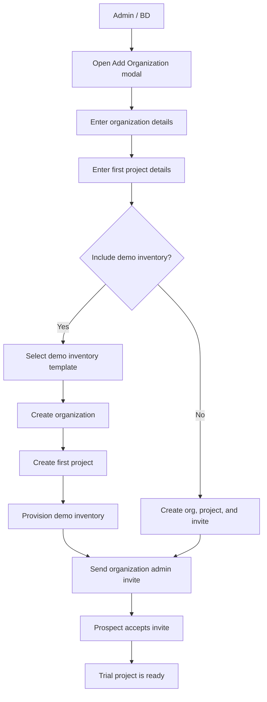
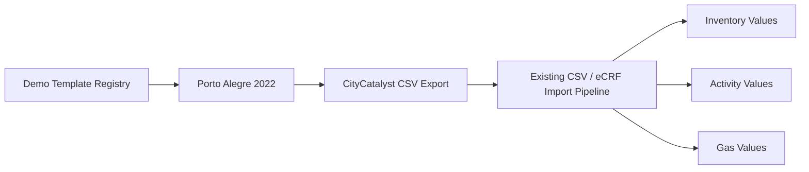
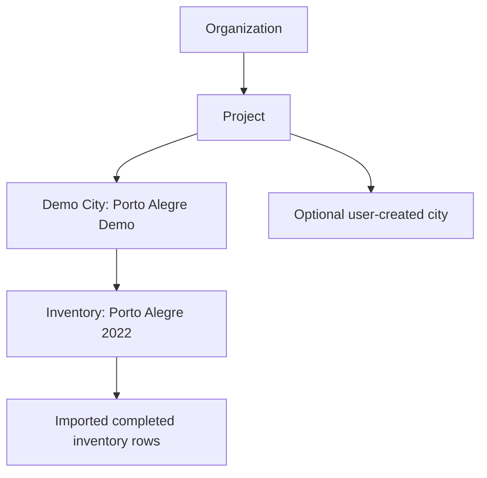
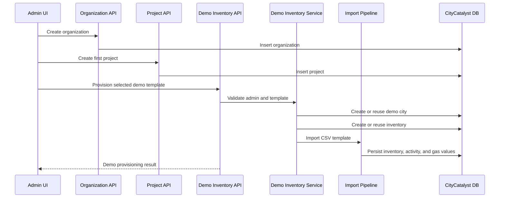

# ON-5648: Optional Demo Inventory Prefill for Free Trial Accounts

## Summary

This proposal adds an optional admin-controlled step to prefill a completed demo inventory when Business Development creates a free trial organization.

The first supported template is a completed Porto Alegre 2022 inventory. The design treats Porto Alegre as a template, not as a hard-coded product rule, so additional demo inventories can be added later without changing the user flow.

## Problem

Today, preparing a free trial account with a completed demo inventory is manual and time-consuming. The current process requires Carole to create extra accounts, accept invitations in an incognito session, create the city, create the inventory, manually connect/import data, and then invite the actual prospect.

This creates repeated operational work for every free trial account where BD wants to show what a finished inventory looks like.

## Proposed User Flow

1. An admin opens the "Add an organization" modal.
2. The admin enters organization and first project details as usual.
3. The admin optionally checks "Include a demo inventory in this project".
4. The admin selects the desired demo inventory template.
5. CityCatalyst creates the organization, creates the first project, provisions the demo city and inventory, imports the template data, and sends the organization admin invite.
6. When the invited user accepts the invite, they can access the project and inspect the completed demo inventory.

## Initial Template

The first template is:

- Template: Porto Alegre 2022 completed inventory
- City shown in the project: Porto Alegre Demo
- Year: 2022
- Inventory type: GPC BASIC+
- GWP: AR6
- Source data: existing CityCatalyst-compatible CSV export with SEEG, EPE, SINIR, and SNIS-backed values

## Product Behavior

- The demo inventory is optional and controlled by admins.
- The demo city is created as a separate city in the trial project.
- The trial city limit still applies. If BD wants the user to have both the demo city and room to create their own city, the project city limit should be set accordingly.
- The feature is idempotent per project and template: retrying the action should reuse the existing demo city/inventory instead of creating duplicates.
- Porto Alegre is the first supported template, but the implementation supports a small template registry so more examples can be added later.

## Data Model Impact

The implementation avoids reusing the real Porto Alegre LOCODE directly because CityCatalyst treats city LOCODEs as globally unique. Instead, each project receives a synthetic demo city for the selected template.

This keeps the demo isolated from real city records and makes provisioning repeatable across many free trial projects.

Because the demo city uses a synthetic LOCODE (`DEMO-<templateId>-<projectId>`), any feature that resolves geographic context from an external service by LOCODE (city boundary lookup, eCRF download geometry, bulk locations) maps the synthetic LOCODE back to the template's real UN/LOCODE (`BR POA` for Porto Alegre 2022). This is centralized in a small helper exported from the demo inventory service so each template only declares its `boundaryLocode` once.

## Technical Approach

- Add a server-side demo inventory provisioning service.
- Add an admin-only API endpoint: `POST /api/v1/admin/demo-inventory`.
- Reuse the existing deterministic CSV/eCRF import pipeline instead of manually copying inventory tables.
- Package the Porto Alegre 2022 CSV template with the app.
- Add an optional checkbox and template selector to the admin organization creation modal.

## Why This Approach

This solves the repetitive BD workflow without exposing extra complexity to trial users. It also avoids relying on live third-party data connection behavior for the demo; the demo comes from a known completed CSV template that already matches CityCatalyst import/export format.

Using a template registry keeps the first implementation small while leaving a clear path for future demo inventories beyond Porto Alegre.

## Open Product Decision

The main product decision is whether BD should set free trial city limits to `2` when including a demo inventory, so prospects can both inspect the completed demo and create their own city during the same trial.
