# Target architecture: the open core as layers with interfaces

A proposal, 1 October 2026. "Exists" means the codebase has it today; "climate-bound" means it exists but assumes climate vocabulary; "missing" means it does not exist. File paths are in [01-component-inventory.md](01-component-inventory.md).

## 1. The design rules

1. **Thin core, named interfaces.** The core owns eight interfaces and nothing else. Everything behind an interface may be a mature external component.
2. **No rebuild.** Nothing the core keeps in-house may already be solved by a mature, foundation-governed component ([04-research-directions/08-component-benchmark.md](04-research-directions/08-component-benchmark.md)).
3. **Domain as configuration.** Schemas, taxonomies, criteria, workflows and catalogue sources live in a configuration package per domain. The core carries no climate vocabulary.
4. **Spatial-first.** The root entity is a place or jurisdiction with versioned geometry; nesting and overlap are a typed, dated graph ([07-spatial-first.md](04-research-directions/07-spatial-first.md)).
5. **Issuer proofs and verifier receipts are separate objects.** The core signs what an organisation published and stores what a programme checked; it never asserts that content is correct ([05-verifiable-records.md](04-research-directions/05-verifiable-records.md)).
6. **Design for compatibility now, commit later.** Every record, agent and place carries the slots that later standards need (algorithm identifier, multiple proofs, attestation token, jurisdiction reference) even where they are empty at first.

## 2. The layers

```mermaid
flowchart TB
    subgraph APPS["Domain apps and services (not core)"]
        A1[Climate apps: inventory, risk, actions, energy model]
        A2[Any service front end: GCoM, a national programme, a health network]
        A3[Domain configuration package: schemas, taxonomies, criteria, workflows, sources]
    end
    subgraph CORE["The open core (AGPL-3.0), eight owned interfaces"]
        L1[Identity and access: principals, mandates, assurance, federation]
        L2[Tenancy and programme administration: network, programme, member, entitlement]
        L3[Registries and reference data: places and jurisdictions, organisations, taxonomies, approved sources]
        L4[Record layer: envelope, schema registry, versions, status, receipts]
        L5[Integration: events, webhooks, app registry, app integration rules]
        L6[AI integration: agent registry, scopes, delegation, audit, document ingestion]
        L7[Policy and governance: consent, data-use policy, change advisory, licence boundary]
        L8[Operations: infrastructure as code, release ladder, observability, residency]
    end
    subgraph EXT["Mature components behind the interfaces (integrated, not built)"]
        E1[Identity server: Keycloak or Ory]
        E2[Membership and policy: OpenFGA plus Cedar, AuthZEN-shaped call]
        E3[Jobs: Temporal; pipelines: Airflow]
        E4[Events: NATS; webhooks: Svix or Standard Webhooks]
        E5[Catalogue: CKAN or DCAT-AP output]
        E6[Spatial: PostGIS, H3, pygeoapi, Overture Divisions]
        E7[Agent gateway and telemetry: MCP gateway, OpenTelemetry]
        E8[Logs and proofs: transparency log, timestamps]
    end
    APPS --> CORE
    CORE --> EXT
```



| Layer | Interface the core owns | Status today | Generic abstraction |
|---|---|---|---|
| 1. Identity and access | OpenID Connect provider and relying party; SCIM; principal, mandate and assurance records; federation entity configuration | Exists, minimal: credentials login, TOTP, two-scope OAuth with no OpenID Connect | Principal (person, organisation, service, agent); Mandate ("acts for X in role Y, granted by Z, valid until T"); assurance on session and on link |
| 2. Tenancy and programme administration | Network, Programme, Member, Entitlement; bulk onboarding; delegated administration | Exists, climate-bound: Organization, Project, City, module; no programme entity; entitlement enforced in the UI | Member replaces City as the leaf and points at a place; Programme is the cohort a network runs |
| 3. Registries and reference data | Place and jurisdiction with versioned geometry; containment and authority graph; organisation registry; versioned taxonomies and criteria; approved-source register; crosswalks | Climate-bound: City with one LOCODE and a text polygon; taxonomies hard-coded; no graph; no validity dates | Place with validity; typed dated edges (contains, governs, services, protects); identifier crosswalk table; taxonomy as versioned data |
| 4. Record layer | Record envelope; schema registry; versions with hashes; publish states; status lists; verifier receipts; export bundle | Climate-bound: Inventory with a boolean publish flag; version history keyed by inventory; no hashes or signatures | Envelope: identifier, version, supersedes, entity, issuer, schema and version, period, provenance, hash, proofs, status; payload domain-specific |
| 5. Integration | Event contract; signed webhooks; app registry; the published app integration rules; SDKs | Exists: webhook outbox (clean); events climate-named; module registry opens a tab; SDKs not generated | CloudEvents-shaped events registered by modules; app registry with login, record access and event subscriptions; SDKs published per release |
| 6. AI integration | Agent record; scopes and delegation tokens; tool-call audit log; provenance fields; document ingestion with consent scope; gateway | Exists, thin: six MCP tools, one stub, no agent identity, no audit; capability registries without a shared base | Agent as a principal with sponsor, model pin, allowed tools, retention mode; hash-chained audit; PROV fields on records |
| 7. Policy and governance | Consent record; data-use policy (ODRL profile); residency as policy; change advisory; licence and steward per package | Partial: GDPR consent and retention exist; no policy engine; no per-package licence | Consent in the ISO 27560 shape; a small deterministic ODRL profile; policy objects attachable to places |
| 8. Operations | Infrastructure as code per instance; release ladder; observability; residency and key configuration per tenant | Exists: Kubernetes manifests copied per environment; no Helm or Kustomize; residency as a region choice | Instance as a configuration: region, buckets, keys, providers, feature flags |

## 3. The five primitives

The eight interfaces get their shape from five data primitives. These are the Q4 2026 foundations scope proposed in the decision brief.

### 3.1 Principal and mandate

```
Principal { id, kind: person | organisation | service | agent, created_at }
Identity  { principal_id, scheme: oidc-subject | saml-nameid | did | lei | national-registry | email,
            issuer, value, assurance, verified_at, source }
Mandate   { id, principal_id, organisation_id, role, scope (programme | place), granted_by,
            valid_from, valid_to, evidence, revoked_at }
Session   { principal_id, assurance: low | substantial | high, method, issued_at }
```

Tokens issued to partner tools and agents carry the mandate identifier, not a role string. Account linking is a row in `Identity`, not a merge.

### 3.2 Signed record envelope

```
Record { id, version, supersedes, entity_id (place or organisation), schema_id, schema_version,
         period, issuer_principal_id, issued_at, licence, state: working | shared | published,
         payload_hash, canonicalisation: jcs, proofs[] { cryptosuite, created, verification_method, value },
         provenance { generated_by_run, attributed_to_agent, on_behalf_of, derived_from[], human_reviewed_by },
         inputs[] { hash, source, policy_ref }, execution { model_hash, container_digest, attestation? },
         log_ref { run_id, range, merkle_root }, timestamp_token?, jurisdiction_ref?, status_list_ref }
Receipt { record_id, record_hash, checker_principal_id, framework, version, checks[], result, proofs[] }
```

The payload is domain-specific and validated against the schema registry. Multiple proofs with a cryptosuite identifier are the crypto-agility hook ([09-cryptographic-control.md](04-research-directions/09-cryptographic-control.md)). Receipts live beside the record, never inside it.

### 3.3 Place and jurisdiction, with the authority graph

```
Place     { id, kind: country | region | municipality | district | basin | protected-area | parcel | building | custom,
            name, geometry (PostGIS, 2D or 3D), geometry_version, valid_from, valid_to, superseded_by,
            cells[] (H3 or S2), source, licence }
PlaceEdge { from_place_id, to_place_id, type: contains | governs | services | protects | overlaps,
            authority_organisation_id, valid_from, valid_to, source }
Crosswalk { place_id, scheme: unlocode | iso3166-2 | overture-gers | wikidata | osm-relation | national | lei,
            value, source, verified_at }
Policy    { id, place_id, odrl (action, target, constraints, validity), authority_organisation_id }
```

"What is inside" is cell-set intersection first, geometry second. A record, a dataset, a document and an agent action each carry a `place_id`. The existing City becomes a Place of kind municipality plus a Member row in the tenancy layer.

### 3.4 Consent and policy record

```
Consent { id, subject (organisation or person), purpose, legal_basis, data_categories, parties[],
          granted_at, withdrawn_at, events[] }            -- ISO/IEC TS 27560 shape
Agreement { id, odrl, record_ids[], grantee_principal_id, oauth_grant_ref, valid_from, valid_to, revoked_at }
```

A city sharing a record with a programme is one Agreement, one OAuth grant scoped by it, one Consent, one event and access-log entries on each read.

### 3.5 Agent record and audit log

```
Agent     { id (stable URI), owner_organisation_id, sponsor_principal_id, model_provider, model_version_pin,
            system_prompt_hash, allowed_tools[], retention_mode, attestation_policy, trust_marks[],
            created_at, revoked_at }
AuditEntry{ run_id, seq, prev_hash, trace_id, span_id, agent_id, actor_chain[], tenant_id, tool,
            args_hash, result_hash, model, tokens_in, tokens_out, approval { decision, approver }, at, signature }
```

The registry itself is a hash-chained log. Daily Merkle roots of the audit log are published to a transparency log when one exists.

## 4. Where the climate vocabulary goes

| Today | Target |
|---|---|
| City as the tenant leaf | Member (tenancy) pointing at a Place (registry) |
| Inventory as the record | Record envelope with a domain schema |
| UN/LOCODE as the identifier | Place identifier with a crosswalk row for LOCODE |
| GPC sector tables in shared schema | A versioned taxonomy in the domain configuration package |
| Emission formatting in shared helpers | A domain formatter registered by the climate app |
| Climate-named events | Module-registered event types under a namespace |
| Hard-coded module identifiers | The app registry |
| "Climate data" in MCP and OpenAPI descriptions | Instance branding from configuration |

## 5. What "others can build on it" means

| For whom | What they get |
|---|---|
| A service builder (the GCoM Digital Service, a national programme) | The published app integration rules, the SDKs, the event contract, the record envelope and schema registry, an instance they can run from infrastructure as code |
| A domain network (health, biodiversity, water) | A domain configuration package template; the same identity, registry, record, event and agent layers; a conformance test suite |
| A partner tool | Login through the service's identity layer; read and write through the record API under a mandate; webhooks; the app registry |
| An AI agent | An agent record, scoped tokens, the MCP gateway, documented tools, an audit trail its sponsor can read |
| Another instance of the core | An entity configuration for federation, a DCAT catalogue, signed records with crosswalked identifiers, an export bundle it can import |

## 6. Licence boundary

| Package | Licence | Reason |
|---|---|---|
| The core (identity, tenancy, registries, record, integration, AI, policy, operations) | AGPL-3.0, OEF steward | Improvements that serve users must be published |
| SDKs, client libraries, connectors to partner systems, the app integration rules | Apache-2.0 | A closed front end may connect without copyleft |
| Schemas, the record envelope, event contract, taxonomies and criteria | Open specification (CC-BY-4.0 for text; schema files Apache-2.0) | So any engine can export to it and any operator can work against it |
| Domain configuration packages | Per domain, AGPL-3.0 by default | They are code and data together |
| Contribution terms | Developer certificate of origin or a light contributor agreement | For anyone who changes the core, as the licence schedule of 9 September 2026 already requires for GCoM components |

Per-service licence metadata is missing today and must be added before any package is published.
